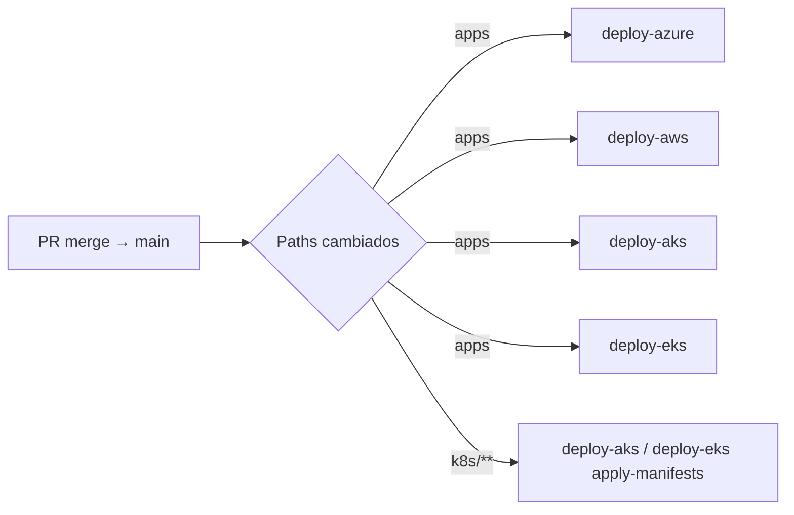

# Checklist — GitHub Secrets y CI/CD (ShopDemo)

Configura estos valores en **Settings → Secrets and variables → Actions** del repositorio GitHub.  
Usa **Environments** separados para aprobar despliegues por plataforma.

**Guía paso a paso en portal:** [SETUP-GITHUB-PORTAL.md](SETUP-GITHUB-PORTAL.md) · **GitHub CLI:** [GH-CLI-COMMANDS.md](GH-CLI-COMMANDS.md)

| Environment | Workflow | Cuándo crear |
|---|---|---|
| `azure` | deploy-azure.yml | Release ACA |
| `azure-aks` | deploy-aks.yml | Release AKS |
| `aws` | deploy-aws.yml | Release ECS |
| `aws-eks` | deploy-eks.yml | Release EKS |

> Los secrets **compartidos** (Event Hubs, PostgreSQL) pueden repetirse en cada environment o definirse a nivel repositorio.

---

## 0. Prerrequisitos (fuera de GitHub)

| # | Tarea | Azure | AWS |
|---|---|---|---|
| 1 | Provisionar infra con script PowerShell | `Deploy-AzureShopDemo.ps1 -Mode ACA` o `AKS` | `Deploy-AwsShopDemo.ps1 -Mode ECS` o `EKS` |
| 2 | Push inicial de imágenes o primer run manual del workflow | ACR + 5 Container Apps | ECR + 5 ECS services |
| 3 | Cluster K8s con namespace `shopdemo` | AKS + Ingress NGINX | EKS + Ingress NGINX |
| 4 | Consumer groups Event Hubs | `analytics-service`, `inventory-service` | Igual (Event Hubs en Azure) |
| 5 | Service Principal / OIDC | Ver §1 | Ver §2 |

---

## 1. Secrets — Azure (environments `azure` y `azure-aks`)

### Infraestructura CI/CD

| Secret | Obligatorio | Ejemplo / origen |
|---|---|---|
| `AZURE_CREDENTIALS` | Sí | JSON Service Principal (`az ad sp create-for-rbac`) |
| `ACR_NAME` | Sí | `acrshopdemolab01` |
| `AZURE_RG` | Sí | `rg-shopdemo-lab` |
| `ACA_ENV` | Solo ACA | `aca-env-shopdemo` |
| `AKS_CLUSTER_NAME` | Solo AKS | `aks-shopdemo` |
| `K8S_NAMESPACE` | Opcional | `shopdemo` (default) |

### Runtime (aplicaciones)

| Secret | ACA | AKS | Descripción |
|---|---|---|---|
| `EVENT_HUBS_CONNECTION_STRING` | Sí | Sí | Azure Event Hubs |
| `EVENT_HUB_NAME` | Sí | Sí | `shopdemo-events` |
| `PG_CATALOG_CONN` | Sí | Sí* | Connection string Catalog |
| `PG_ORDERS_CONN` | Sí | Sí* | Connection string Orders |
| `PG_INVENTORY_CONN` | Sí | Sí* | Connection string Inventory |
| `STORAGE_CHECKPOINT_CONN` | Sí (ACA) | — | Blob Storage checkpoints |
| `AZURITE_CHECKPOINT_CONN` | — | Sí* | Azurite in-cluster (default en script) |
| `INVENTORY_API_BASE_URL` | Sí | — | URL interna Inventory (Orders) |
| `MCP_CATALOG_URL` | Sí | — | URL Catalog para MCP |
| `MCP_INVENTORY_URL` | Sí | — | URL Inventory para MCP |
| `MCP_ANALYTICS_URL` | Sí | — | URL Analytics para MCP |
| `POSTGRES_USER` | Opcional | Opcional | Sync K8s secrets |
| `POSTGRES_PASSWORD` | Opcional | Opcional | Sync K8s secrets |

\* En AKS las connection strings in-cluster suelen ser las de `k8s/secrets.example.yaml`; el job `sync_secrets` (manual) las escribe en el cluster.

### Permisos IAM del Service Principal

- **ACA:** Contributor en RG + AcrPush en ACR + permisos Container Apps
- **AKS:** lo anterior + Azure Kubernetes Service Cluster User Role en el cluster

---

## 2. Secrets — AWS (environments `aws` y `aws-eks`)

### Infraestructura CI/CD

| Secret | Obligatorio | Ejemplo / origen |
|---|---|---|
| `AWS_ROLE_ARN` | Recomendado (OIDC) | `arn:aws:iam::905221885508:role/github-shopdemo` |
| `AWS_ACCESS_KEY_ID` | Alternativa a OIDC | IAM user lab |
| `AWS_SECRET_ACCESS_KEY` | Con access key | — |
| `AWS_REGION` | Sí | `us-east-2` |
| `ECS_CLUSTER` | Solo ECS | `shopdemo-cluster` |
| `EKS_CLUSTER_NAME` | Solo EKS | `shopdemo-eks` |
| `LAB_PREFIX` | Opcional | `shopdemo` |
| `K8S_NAMESPACE` | Opcional | `shopdemo` |

### Runtime (aplicaciones)

| Secret | ECS | EKS | Descripción |
|---|---|---|---|
| `EVENT_HUBS_CONNECTION_STRING` | Sí | Sí | Cross-cloud desde Azure |
| `EVENT_HUB_NAME` | Sí | — | Default `shopdemo-events` en scripts |
| `PG_CATALOG_CONN` | Sí | Sí* | → SSM `/shopdemo/pg-catalog` |
| `PG_ORDERS_CONN` | Sí | Sí* | → SSM |
| `PG_INVENTORY_CONN` | Sí | Sí* | → SSM |
| `AZURITE_CHECKPOINT_CONN` | Sí | Sí* | Checkpoints Event Hubs |
| `INVENTORY_API_BASE_URL` | Sí | — | Cloud Map / DNS interno |
| `MCP_CATALOG_URL` | Sí | — | ALB MCP → APIs |
| `MCP_INVENTORY_URL` | Sí | — | — |
| `MCP_ANALYTICS_URL` | Sí | — | — |
| `POSTGRES_USER` | Opcional | Opcional | Sync K8s secrets |
| `POSTGRES_PASSWORD` | Opcional | Opcional | Sync K8s secrets |

### Permisos IAM (rol OIDC o user)

Políticas de lab: `Source/scripts/aws/iam-policy-shopdemo-lab-ecs.json`, `iam-policy-shopdemo-lab-eks.json`  
EKS adicional: `kubectl` vía `aws eks update-kubeconfig` (Cluster access en IAM).

---

## 3. Flujo tras merge a `main`



1. **No** se despliega al abrir el PR — solo al integrar en `main`.
2. Cada workflow usa **path filters**; un cambio solo en docs no dispara nada.
3. Los 4 workflows pueden correr en paralelo si todos los environments están configurados.

---

## 4. Primer despliegue K8s vía CI (manual)

En **Actions → Deploy AKS / Deploy EKS → Run workflow**:

| Input | Cuándo marcar |
|---|---|
| `sync_secrets` | Primera vez o rotación de connection strings |
| `apply_manifests` | Primera vez o cambio en YAML de deployments/ingress |
| `apply_infra` | Solo bootstrap: postgres + azurite in-cluster |

Después, los pushes a `main` con cambios de código solo ejecutan **build → push → kubectl set image**.

---

## 5. Verificación post-deploy

| Plataforma | Comando / URL |
|---|---|
| ACA | `curl https://<fqdn-catalog>/health` |
| ECS | `curl http://<alb-catalog>/health` |
| AKS/EKS Ingress | `curl http://shopdemo.local/catalog/health` (hosts) |
| AKS/EKS LB | `curl http://<lb-ip>:8080/health` |
| K8s | `kubectl get pods -n shopdemo` |

---

## 6. Checklist rápido (copiar)

```
[ ] Infra provisionada (script PowerShell)
[ ] Environments creados: azure, azure-aks, aws, aws-eks
[ ] AZURE_CREDENTIALS + ACR_NAME + AZURE_RG
[ ] AWS OIDC o access keys + AWS_REGION
[ ] EVENT_HUBS_CONNECTION_STRING en todos los environments
[ ] ACA: ACA_ENV + STORAGE_CHECKPOINT_CONN + URLs MCP/Inventory
[ ] ECS: ECS_CLUSTER + SSM sync OK
[ ] AKS: AKS_CLUSTER_NAME + Ingress + consumer groups EH
[ ] EKS: EKS_CLUSTER_NAME + nodos suficientes para 5 APIs
[ ] Primer run manual AKS/EKS: sync_secrets + apply_manifests
[ ] Merge a main → workflows verdes
```

---

## Referencias

- [README.md](README.md) — índice workflows
- [GH-CLI-COMMANDS.md](GH-CLI-COMMANDS.md) — comandos `gh secret set` por environment (lab)
- [SETUP-GITHUB.md](SETUP-GITHUB.md) — configuración paso a paso en GitHub
- [SETUP-GITHUB-PORTAL.md](SETUP-GITHUB-PORTAL.md) — portal web (environments, secrets, Actions)
- [Documentación_Del_Proyecto/despliegue/ALCANCE-LAB-RELEASE.md](../Documentación_Del_Proyecto/despliegue/ALCANCE-LAB-RELEASE.md)
- [Source/scripts/azure/.env.azure.example](../Source/scripts/azure/.env.azure.example)
- [Source/scripts/aws/.env.aws.example](../Source/scripts/aws/.env.aws.example)
