# 01 — Patrones de diseño

## Objetivo de este capítulo

Al terminar deberías poder responder, con tus propias palabras:

- Qué es un patrón de diseño y en qué se diferencia de una librería o un framework.
- Qué significan las tres familias del catálogo GoF (creacionales, estructurales, comportamiento).
- Cómo funcionan — con diagrama — patrones como Strategy, Observer, Factory, Adapter, Repository, CQRS y Outbox.
- Cuándo aplicar un patrón enterprise y cuándo es sobre-ingeniería.

Asumimos que ya sabes programar en C#, crear clases e interfaces, y que has visto al menos un proyecto con capas (`Controllers`, `Services`, `Data`). Si has escrito un `if` para elegir entre dos implementaciones según una condición, ya has sentido el problema que muchos patrones resuelven.

> **Cómo leer este capítulo:** cada patrón sigue la misma estructura: definición formal → explicación desarrollada → diagrama → **ejemplo en C# comentado** → cuándo usarlo. No te saltes las definiciones; son el vocabulario que usarás en code reviews y diseños de equipo.

---

## 1. Introducción: ¿por qué existen los patrones?

Imagina que construyes una API de pedidos. Al principio todo está en un solo controller con acceso directo a la base de datos. Funciona. Pero cuando crece el equipo y el código, aparecen problemas:

- Cambiar de SQL Server a PostgreSQL obliga a tocar controllers.
- Duplicas lógica de validación en varios endpoints.
- Probar un caso de uso sin levantar la base de datos es casi imposible.

Los **patrones de diseño** son respuestas probadas a problemas que **ya le pasaron a muchos equipos antes que tú**. No son código listo para copiar: son **recetas de organización** que describen qué piezas existen, qué responsabilidad tiene cada una y cómo se relacionan.

### Definición formal

> Un **patrón de diseño** es una solución reutilizable a un problema recurrente en el diseño orientado a objetos y en arquitecturas de software, expresada como un conjunto de roles, colaboraciones y consecuencias.

Los patrones no inventan tecnología nueva: **nombran** una estructura que ya funciona en muchos proyectos. Cuando alguien dice "aquí usamos Repository", todo el equipo entiende que la persistencia está encapsulada detrás de una interfaz orientada al dominio.

### Explicación desarrollada

Piensa en los patrones como **plantillas de conversación** entre piezas de software. En lugar de que tu servicio conozca directamente `SqlConnection`, `HttpClient` y el formato JSON de un proveedor externo, defines roles: un **puerto** (interfaz), un **adaptador** (implementación concreta) y un **cliente** que solo habla con el puerto.

Para un junior, el valor no está en memorizar 23 nombres del libro GoF, sino en reconocer **síntomas**:

| Síntoma en el código | Patrón que suele ayudar |
|---|---|
| `switch` gigante según tipo de pago o descuento | Strategy |
| Clase que hace de todo: validar, guardar, enviar email | Separación + Observer / Domain Events |
| `new ConcreteClass()` repartido por todo el proyecto | Factory |
| Cambiar de proveedor externo rompe media aplicación | Adapter + Anti-Corruption Layer |
| Guardar en BD y publicar evento — uno falla | Outbox |

### Cuándo usar patrones (y cuándo no)

| Situación | ¿Patrón? |
|---|---|
| El problema se repite y el código ya duele mantener | Sí — elige el más simple que encaje |
| CRUD de cinco pantallas, equipo de dos personas | No — capas simples bastan |
| "Por si acaso escalamos a diez millones de usuarios" | No — YAGNI; mide primero |
| Code review señala acoplamiento o clases gigantes | Sí — nombra el patrón para alinear al equipo |

### Qué NO es un patrón

| No es | Por qué |
|---|---|
| Una librería NuGet | El patrón es la idea; MediatR es una implementación del patrón Mediator |
| Siempre la mejor opción | Añade estructura; en un CRUD trivial puede ser innecesario |
| Sin coste | Más clases, más interfaces, curva de aprendizaje |

---

## 2. Clasificación Gang of Four (GoF)

En 1994, cuatro autores (Gamma, Helm, Johnson, Vlissides) publicaron *Design Patterns*, conocido como **GoF**. Catalogaron **23 patrones** agrupados por **intención**:

| Familia | Pregunta que responde | Idea central |
|---|---|---|
| **Creacionales** | ¿Cómo creo objetos sin acoplar el código a clases concretas? | Encapsular la creación |
| **Estructurales** | ¿Cómo combino clases/objetos en piezas más grandes? | Composición y adaptación |
| **Comportamiento** | ¿Cómo distribuyo responsabilidades y algoritmos? | Comunicación y variación de comportamiento |

### Definición formal

La clasificación GoF organiza patrones según **la intención del diseño** (crear, componer o coordinar comportamiento), no según la tecnología (.NET, Java, etc.).

### Explicación desarrollada

En backend moderno no usarás los 23 patrones con la misma frecuencia. Los más habituales en APIs enterprise son Factory/Builder (creación), Adapter/Decorator/Facade (estructura), Strategy/Observer/Command/Mediator/State (comportamiento), más Repository, Unit of Work, CQRS y Outbox (patrones de aplicación).

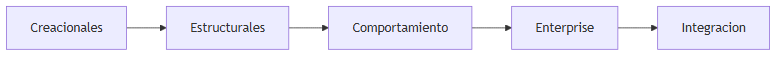

### Cuándo profundizar en cada familia

| Familia | Profundiza cuando… |
|---|---|
| Creacionales | Tienes muchos tipos de objetos o construcción compleja |
| Estructurales | Integras sistemas externos o compones árboles de objetos |
| Comportamiento | Varias reglas de negocio intercambiables o flujos de estado |
| Enterprise | Proyecto con dominio, persistencia y mensajería real |

A continuación verás los más usados en backend moderno, **cada uno con su diagrama y la estructura pedagógica completa**.

---

## 3. Patrones creacionales

Estos patrones responden: **¿quién crea los objetos y cómo evitamos acoplar el resto del código a clases concretas?**

---

### 3.1 Factory Method (Método fábrica)

**Problema:** Tu código necesita crear objetos, pero el tipo exacto depende de una condición de negocio (tipo de pago, tipo de notificación, etc.). Si usas `new ConcreteClass()` por todo el código, quedas acoplado a esa clase concreta.

#### Definición formal

**Factory Method** define una interfaz para crear un objeto, pero deja que las **subclases** (o implementaciones concretas de una clase abstracta) decidan qué clase instanciar.

#### Explicación desarrollada

**Analogía:** Una cadena de restaurantes tiene un método `crearCombo()`. Cada sucursal (subclase) decide si el combo incluye postre regional o no, pero el cliente solo pide "un combo".

En C#, el Factory Method suele aparecer como método `protected abstract` en una clase base que orquesta un flujo, delegando la creación del producto concreto a subclases. También puedes simularlo con una interfaz `INotificationFactory` y varias implementaciones registradas en DI — la idea es la misma: **el cliente no elige la clase concreta con `new`**.

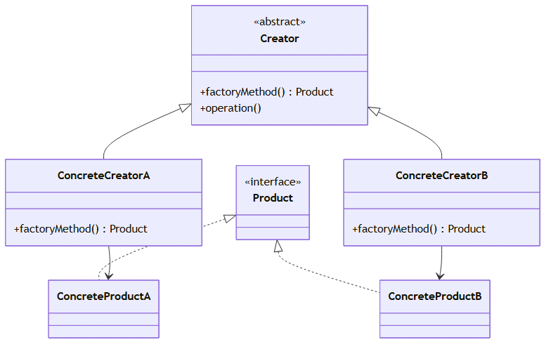

> *Fuente editable (Mermaid):* [01-factory-method.mermaid](./assets/diagrams/01-factory-method.mermaid)

**Ejemplo en C# (comentado):**

```csharp
// Contrato del producto que la fábrica crea
public interface INotificationSender { void Send(string message); }

// Clase base: define el flujo; la subclase decide QUÉ implementación crear
public abstract class NotificationFactory
{
    // Plantilla del caso de uso: no conoce EmailSender ni SmsSender
    public void NotifyUser(string message)
    {
        var sender = CreateSender(); // ← Factory Method: delegación a subclase
        sender.Send(message);
    }

    // Cada subclase devuelve su implementación concreta
    protected abstract INotificationSender CreateSender();
}

// Implementación concreta: solo decide el tipo de notificación
public class EmailNotificationFactory : NotificationFactory
{
    protected override INotificationSender CreateSender() => new EmailSender();
}
```

#### Cuándo usar

- El tipo de objeto creado **varía según contexto** (configuración, tenant, región).
- Quieres que las subclases o implementaciones concretas **decidan** qué producto instanciar.
- Necesitas un punto único de extensión sin modificar el código que usa el producto (Open/Closed).

#### Cuándo no

- Solo hay **un tipo posible** y no cambiará — un `new` simple o inyección directa en DI es suficiente.
- La "fábrica" sería un `if` de dos líneas — no justifica jerarquía de clases.

---

### 3.2 Abstract Factory (Fábrica abstracta)

**Problema:** Debes crear **familias de objetos relacionados** que deben ser compatibles entre sí. Por ejemplo, botones y checkboxes de un tema "Windows" vs un tema "macOS". Mezclar un botón Windows con un checkbox macOS rompe la coherencia visual — y en software, mezclar implementaciones de distintos proveedores rompe contratos.

#### Definición formal

**Abstract Factory** proporciona una interfaz para crear familias de productos relacionados **sin especificar sus clases concretas**, garantizando que los productos de una misma fábrica sean compatibles.

#### Explicación desarrollada

La diferencia clave con Factory Method:

| Factory Method | Abstract Factory |
|---|---|
| Crea **un** producto | Crea **varias** productos de una familia |
| Subclase decide **un** tipo | Implementación concreta crea **todos** los tipos de la familia |
| Un método `CreateX()` | Varios métodos `CreateA()`, `CreateB()`, … |

**Analogía:** Un mueble modular de oficina se vende en líneas "Ejecutivo" y "Industrial". Cada línea incluye escritorio, silla y estantería que encajan estética y medidas. No mezclas escritorio Ejecutivo con silla Industrial — la **fábrica de la línea** te entrega el conjunto coherente.

En backend, un ejemplo típico es una fábrica por proveedor de infraestructura: `ICloudFactory` con `CreateBlobStorage()`, `CreateQueue()`, `CreateSecretStore()` — implementaciones `AzureFactory` y `AwsFactory` que nunca mezclan APIs de nubes distintas en un mismo flujo.

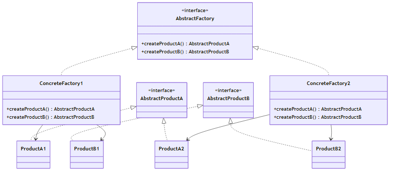

> *Fuente editable (Mermaid):* [01-abstract-factory.mermaid](./assets/diagrams/01-abstract-factory.mermaid)

**Ejemplo en C# (comentado):**

```csharp
// Fábrica abstracta: crea TODA la familia de productos de un proveedor
public interface IPaymentFactory
{
    IPaymentGateway CreateGateway();
    IPaymentReceiptFormatter CreateReceiptFormatter();
}

// Familia Stripe: gateway y formateador siempre compatibles entre sí
public class StripePaymentFactory : IPaymentFactory
{
    public IPaymentGateway CreateGateway() => new StripeGateway();
    public IPaymentReceiptFormatter CreateReceiptFormatter() => new StripeReceiptFormatter();
}

// El cliente solo depende de la fábrica, no de clases concretas sueltas
public class CheckoutService
{
    private readonly IPaymentFactory _factory;
    public CheckoutService(IPaymentFactory factory) => _factory = factory;

    public void Pay(decimal amount)
    {
        var gateway = _factory.CreateGateway();
        var receipt = _factory.CreateReceiptFormatter();
        gateway.Charge(amount);
        receipt.FormatReceipt(amount);
    }
}
```

#### Cuándo usar

- Creas **grupos de objetos** que deben usarse juntos (misma familia, mismo proveedor, mismo tema).
- Quieres **intercambiar toda la familia** en runtime o por configuración (multicloud, multi-tenant con stacks distintos).
- Evitas `if (provider == "A")` repetido para cada tipo de producto.

#### Cuándo no

- Solo necesitas crear **un** objeto — Factory Method o DI simple bastan.
- Las familias no tienen relación de compatibilidad — Abstract Factory añade complejidad innecesaria.

---

### 3.3 Builder (Constructor)

**Problema:** Crear un objeto con muchos campos opcionales produce constructores enormes o objetos en estado inválido (`new Order(null, 0, null, ...)`).

#### Definición formal

**Builder** separa la **construcción** de un objeto complejo de su **representación**, permitiendo el mismo proceso de construcción para distintas representaciones finales.

#### Explicación desarrollada

El Builder resuelve dos dolores a la vez:

1. **Legibilidad:** `OrderBuilder.WithCustomer(id).AddLine(productId, qty).Build()` se lee como una receta.
2. **Invariantes:** pasos intermedios pueden validar parcialmente; `Build()` garantiza que el objeto cumple reglas de negocio antes de existir.

Opcionalmente existe un **Director** que conoce la secuencia de pasos para construcciones estándar ("pedido express", "pedido corporativo"). En muchos proyectos .NET el builder fluido sin Director es suficiente.

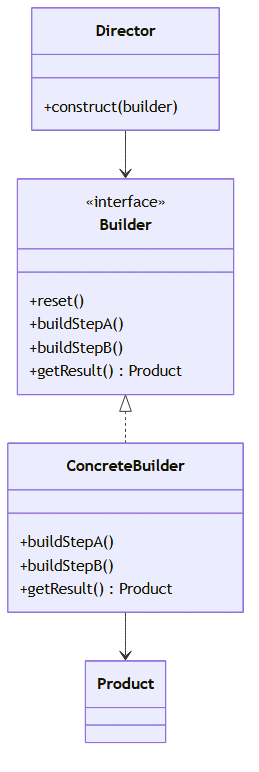

> *Fuente editable (Mermaid):* [01-builder.mermaid](./assets/diagrams/01-builder.mermaid)

**Ejemplo en C# (comentado):**

```csharp
// Producto final: solo se construye vía Build() con reglas validadas
public sealed class Order
{
    public Guid CustomerId { get; init; }
    public List<OrderLine> Lines { get; init; } = new();
    public Address? ShippingAddress { get; init; }
}

// Builder fluido: cada método devuelve this para encadenar llamadas
public class OrderBuilder
{
    private Guid _customerId;
    private readonly List<OrderLine> _lines = new();
    private Address? _shippingAddress;

    public OrderBuilder WithCustomer(Guid customerId)
    {
        _customerId = customerId; // acumula estado intermedio
        return this;
    }

    public OrderBuilder AddLine(Guid productId, int quantity)
    {
        _lines.Add(new OrderLine(productId, quantity));
        return this;
    }

    public OrderBuilder WithShippingAddress(Address address)
    {
        _shippingAddress = address;
        return this;
    }

    // Punto único de validación antes de crear el objeto
    public Order Build()
    {
        if (_customerId == Guid.Empty) throw new InvalidOperationException("Customer required");
        if (_lines.Count == 0) throw new InvalidOperationException("At least one line required");
        return new Order { CustomerId = _customerId, Lines = _lines, ShippingAddress = _shippingAddress };
    }
}

// Uso legible: se lee como una receta paso a paso
var order = new OrderBuilder()
    .WithCustomer(customerId)
    .AddLine(productId, 2)
    .WithShippingAddress(address)
    .Build();
```

#### Cuándo usar

- Objetos con **muchos parámetros opcionales** o construcción en **varios pasos**.
- Necesitas **distintas representaciones** del mismo proceso (DTO vs entidad de dominio).
- Quieres evitar telescoping constructors (constructores encadenados ilegibles).

#### Cuándo no

- Objeto con 3–4 propiedades obligatorias — un constructor o record basta.
- La construcción es trivial y estable — no añadas builder "por estilo".

---

### 3.4 Prototype (Prototipo)

**Problema:** Crear una instancia desde cero es costoso (consultas, cálculos) o quieres clonar un objeto existente como plantilla, modificando solo algunos campos.

#### Definición formal

**Prototype** especifica los tipos de objetos a crear mediante una instancia **prototípica**, y crea nuevos objetos **copiando** ese prototipo en lugar de instanciar clases concretas repetidamente.

#### Explicación desarrollada

**Analogía:** En un estudio de diseño guardas una plantilla de presupuesto con logo, tipografía y secciones. Para cada cliente clonas la plantilla y cambias nombre y partidas — no rediseñas desde cero.

En software:

- **Clonación superficial:** copia referencias — rápida pero peligrosa si objetos mutables se comparten.
- **Clonación profunda:** copia recursivamente — más segura para agregados complejos.

En .NET, `MemberwiseClone()` es superficial; para dominio rico suele preferirse un método explícito `Clone()` o un mapper que construya una copia con reglas claras.

**Ejemplo en C# (comentado):**

```csharp
// Plantilla con datos mutables que se copiarán
public class ReportTemplate
{
    public string Title { get; init; } = "";
    public List<Section> Sections { get; init; } = new();

    // Clonación profunda: cada sección también se copia (no comparte referencias)
    public ReportTemplate DeepClone() =>
        new ReportTemplate
        {
            Title = Title,
            Sections = Sections.Select(s => s.Clone()).ToList()
        };
}

// Uso: partir de una plantilla y personalizar sin reconstruir desde cero
var monthlyReport = baseTemplate.DeepClone();
monthlyReport.Title = "Reporte marzo 2026";
```

#### Cuándo usar

- Creación **costosa** y la mayoría de copias son similares a una plantilla.
- Necesitas muchas variantes ligeras de un mismo objeto (documentos, configuraciones, escenarios de simulación).
- El tipo concreto se decide en runtime y clonar es más simple que una jerarquía de factories.

#### Cuándo no

- Objetos pequeños e inmutables — `new` o factory simple.
- Clonación profunda difícil de mantener — evalúa Builder o factory dedicada.

---

### 3.5 Singleton (Único)

**Problema histórico:** compartir un recurso único (configuración global, pool de conexiones) con un solo punto de acceso.

#### Definición formal

**Singleton** garantiza que una clase tenga **una sola instancia** y proporciona un punto de acceso global a ella.

#### Explicación desarrollada

El patrón original usaba constructor privado y `getInstance()` estático. Eso creaba problemas en tests (estado global compartido), concurrencia (doble instancia en multi-hilo) y acoplamiento oculto.

**Hoy en .NET:** se prefiere registrar el servicio en el contenedor de **inyección de dependencias (DI)** con lifetime `Singleton`. El contenedor garantiza una instancia por aplicación sin antipatrón manual.

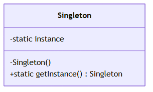

**Ejemplo en C# (comentado):**

```csharp
// En ASP.NET Core: el contenedor DI gestiona la instancia única (patrón moderno)
// Program.cs — registro una sola vez al arrancar la aplicación
builder.Services.AddSingleton<IAppConfiguration, AppConfiguration>();

// Cualquier servicio recibe la MISMA instancia por constructor
public class PricingService
{
    private readonly IAppConfiguration _config;
    public PricingService(IAppConfiguration config) => _config = config; // inyectado, no new()
}

// Evitar en código nuevo: Singleton manual con getInstance() estático
// public static AppConfiguration Instance { get; } — difícil de testear
```

#### Cuándo usar

- Un recurso **realmente único** por proceso: caché de configuración, cliente HTTP reutilizable, pool.
- Registrado en DI como `AddSingleton<T>()` — patrón de lifetime, no clase Singleton manual.

#### Cuándo no

- Implementar Singleton manual con `getInstance()` — difícil de testear y oculta dependencias.
- "Singleton por comodidad" para evitar pasar parámetros — mejor diseño de interfaces.

> **Regla práctica para juniors:** usa DI `AddSingleton<T>()`; no implementes Singleton manual salvo casos muy específicos y documentados.

---

## 4. Patrones estructurales

Estos patrones responden: **¿cómo combino piezas existentes o adapto interfaces incompatibles?**

---

### 4.1 Adapter (Adaptador)

**Problema:** Tu aplicación espera una interfaz `IPaymentGateway.Charge(amount)`, pero el proveedor externo expone una API completamente distinta (`POST /v2/charges/create` con JSON propietario).

#### Definición formal

**Adapter** convierte la interfaz de una clase en otra interfaz que el **cliente espera**. Permite que clases con interfaces incompatibles trabajen juntas **sin modificar** el código del cliente ni del servicio externo (idealmente).

#### Explicación desarrollada

**Analogía:** Un adaptador de enchufe europeo a americano no cambia el aparato eléctrico ni la red eléctrica; **traduce** la conexión.

Hay dos variantes clásicas:

| Variante | Cómo funciona |
|---|---|
| **Object adapter** | El adaptador contiene una referencia al adaptee y delega |
| **Class adapter** | Herencia múltiple (menos común en C#) |

En arquitectura enterprise, el Adapter suele vivir en la capa de **infraestructura** implementando un **puerto** definido en aplicación/dominio (hexagonal).

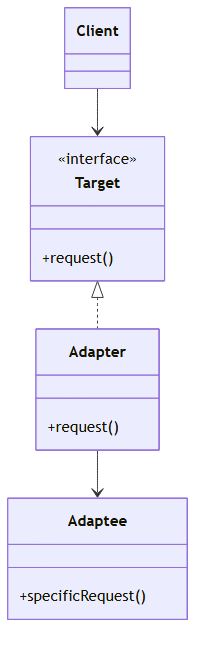

> *Fuente editable (Mermaid):* [01-adapter.mermaid](./assets/diagrams/01-adapter.mermaid)

**Ejemplo en C# (comentado):**

```csharp
// Puerto que TU dominio espera (contrato interno estable)
public interface IPaymentGateway
{
    PaymentResult Charge(decimal amount, string currency);
}

// SDK externo con API distinta — no debe filtrarse al dominio
public class LegacyPaymentSdk
{
    public string CreateChargeJson(decimal cents, string iso) { /* HTTP al proveedor */ return "{}"; }
}

// Adapter: traduce del contrato interno al SDK externo
public class LegacyPaymentAdapter : IPaymentGateway
{
    private readonly LegacyPaymentSdk _sdk;
    public LegacyPaymentAdapter(LegacyPaymentSdk sdk) => _sdk = sdk;

    public PaymentResult Charge(decimal amount, string currency)
    {
        var cents = (long)(amount * 100);           // conversión de unidades
        var json = _sdk.CreateChargeJson(cents, currency); // delega al adaptee
        return PaymentResult.FromJson(json);        // traduce respuesta al modelo interno
    }
}
```

#### Cuándo usar

- Integrar **APIs legacy o de terceros** con contratos distintos al tuyo.
- Quieres que el dominio **nunca** importe SDKs externos.
- Sustituir un proveedor sin reescribir la lógica de aplicación.

#### Cuándo no

- Puedes cambiar el cliente para hablar directamente con la API externa y no hay capa de dominio que proteger — raro en enterprise.
- El "adaptador" solo renombra métodos sin traducción real — considera si hace falta la capa.

---

### 4.2 Bridge (Puente)

**Problema:** Tienes una abstracción (formas de envío: estándar, express) y una implementación (transportistas: correo, mensajería) que evolucionan **independientemente**. Un árbol de herencia `StandardMailShipping`, `ExpressCourierShipping`, … explota combinatoriamente.

#### Definición formal

**Bridge** desacopla una **abstracción** de su **implementación**, de modo que ambas puedan variar independientemente mediante composición en lugar de herencia múltiple.

#### Explicación desarrollada

**Analogía:** Un mando a distancia (abstracción) no es un televisor concreto (implementación). El mismo mando puede controlar distintos dispositivos si comparten el protocolo correcto — cambias TV sin rediseñar el mando entero.

En código, la abstracción mantiene una referencia a una interfaz `IImplementation` (o `IDeliveryCarrier`). Cada variante de abstracción delega operaciones a la implementación inyectada.

**Ejemplo en C# (comentado):**

```csharp
// Implementación concreta (el "dispositivo" que puede cambiar)
public interface INotificationChannel { void Send(string to, string body); }

// Abstracción de alto nivel: no sabe si envía por email, SMS o push
public abstract class Notification
{
    protected readonly INotificationChannel Channel; // composición, no herencia múltiple
    protected Notification(INotificationChannel channel) => Channel = channel;
    public abstract void Notify(string to, string body);
}

// Variante de abstracción: añade prefijo sin cambiar el canal subyacente
public class UrgentNotification : Notification
{
    public UrgentNotification(INotificationChannel channel) : base(channel) { }
    public override void Notify(string to, string body) =>
        Channel.Send(to, $"[URGENT] {body}"); // delega al canal inyectado
}
```

#### Cuándo usar

- Abstracción e implementación tienen **dimensiones de variación independientes**.
- Quieres evitar **explosión de subclases** (N × M combinaciones).
- Cambios frecuentes en plataforma subyacente (UI, storage, transporte) sin tocar la lógica de alto nivel.

#### Cuándo no

- Una sola implementación estable — composición extra sin beneficio.
- Pocas combinaciones fijas — herencia simple puede bastar.

---

### 4.3 Composite (Compuesto)

**Problema:** Debes tratar **objetos individuales y composiciones** de objetos de forma uniforme — por ejemplo, un menú con ítems sueltos y submenús anidados, o un árbol de permisos.

#### Definición formal

**Composite** compone objetos en estructuras de **árbol** para representar jerarquías parte-todo. Permite a los clientes tratar objetos individuales y composiciones **de la misma manera**.

#### Explicación desarrollada

El patrón distingue:

| Rol | Descripción |
|---|---|
| **Component** | Interfaz común (`Operation()`, `Add`, `Remove`) |
| **Leaf** | Nodo hoja sin hijos |
| **Composite** | Nodo contenedor con lista de hijos |

**Analogía:** Un sistema de archivos: un archivo y una carpeta responden a "calcular tamaño" — la carpeta delega en sus hijos; el archivo devuelve su tamaño. El cliente no necesita saber si es hoja o composite.

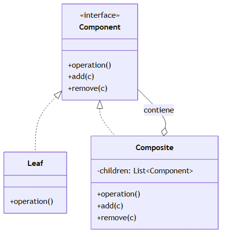

> *Fuente editable (Mermaid):* [01-composite.mermaid](./assets/diagrams/01-composite.mermaid)

**Ejemplo en C# (comentado):**

```csharp
// Component: interfaz común para hoja y contenedor
public interface IMenuComponent
{
    decimal GetPrice();
}

// Leaf: elemento sin hijos
public class MenuItem : IMenuComponent
{
    public decimal Price { get; init; }
    public decimal GetPrice() => Price;
}

// Composite: agrupa hijos y delega la operación recursivamente
public class MenuGroup : IMenuComponent
{
    private readonly List<IMenuComponent> _children = new();
    public void Add(IMenuComponent child) => _children.Add(child);
    public decimal GetPrice() => _children.Sum(c => c.GetPrice()); // recursión uniforme
}

// Cliente: trata ítem y grupo igual — no necesita saber si es hoja o composite
var burger = new MenuItem { Price = 8.99m };
var drink = new MenuItem { Price = 2.50m };
var combo = new MenuGroup();
combo.Add(burger);
combo.Add(drink);
decimal total = combo.GetPrice(); // 11.49 — suma sin if/else por tipo
```

#### Cuándo usar

- Estructuras **jerárquicas** (UI, categorías, permisos, expresiones).
- El cliente debe ignorar si trabaja con un elemento o un grupo.
- Operaciones recursivas naturales (sumar precios, validar árbol, renderizar).

#### Cuándo no

- Lista plana sin anidamiento — una colección simple basta.
- Diferencias fuertes entre hojas y contenedores en la API pública — forzar la misma interfaz confunde.

---

### 4.4 Decorator (Decorador)

**Problema:** Quieres añadir responsabilidades (caché, logging, métricas) a un objeto **sin modificar su clase** y **sin herencia rígida** para cada combinación.

#### Definición formal

**Decorator** adjunta responsabilidades adicionales a un objeto **dinámicamente**. Los decoradores envuelven al componente original compartiendo la **misma interfaz**.

#### Explicación desarrollada

**Ejemplo:** `IOrderRepository` base → `CachedOrderRepository` envuelve al real y añade caché → `LoggedOrderRepository` envuelve y añade logging. Puedes apilar decoradores en distinto orden según necesidad.

**Alternativa moderna:** pipeline behaviors en MediatR logran efecto similar para cross-cutting concerns en handlers.

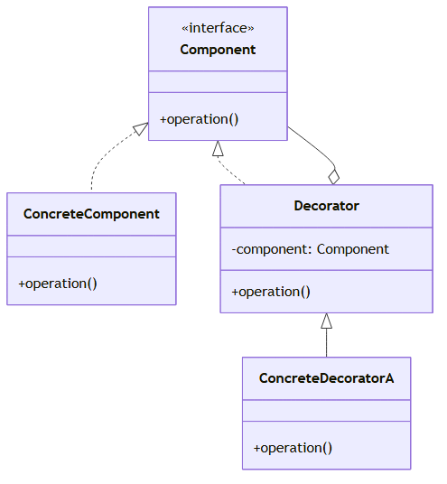

> *Fuente editable (Mermaid):* [01-decorator.mermaid](./assets/diagrams/01-decorator.mermaid)

**Ejemplo en C# (comentado):**

```csharp
// Interfaz compartida: componente real y decoradores
public interface IOrderRepository
{
    Task<Order?> GetByIdAsync(Guid id, CancellationToken ct = default);
}

// Componente concreto (implementación base)
public class EfOrderRepository : IOrderRepository { /* acceso a BD */ }

// Decorator: envuelve otro repositorio y añade caché sin cambiar EfOrderRepository
public class CachedOrderRepository : IOrderRepository
{
    private readonly IOrderRepository _inner; // referencia al componente envuelto
    private readonly IMemoryCache _cache;

    public CachedOrderRepository(IOrderRepository inner, IMemoryCache cache)
    {
        _inner = inner;
        _cache = cache;
    }

    public async Task<Order?> GetByIdAsync(Guid id, CancellationToken ct = default)
    {
        if (_cache.TryGetValue(id, out Order? cached)) return cached; // comportamiento extra
        var order = await _inner.GetByIdAsync(id, ct);              // delega al interior
        _cache.Set(id, order);
        return order;
    }
}
```

#### Cuándo usar

- Añadir comportamiento **opcional y combinable** en runtime.
- Evitar subclases `LoggedCachedRepository`, `CachedLoggedRepository`, etc.
- Cross-cutting concerns en una capa con interfaz estable.

#### Cuándo no

- Un solo aspecto transversal — middleware o behavior único es más simple.
- Orden de decoradores no importa pero la pila se vuelve opaca — documenta o usa pipeline explícito.

---

### 4.5 Facade (Fachada)

**Problema:** Para confirmar un pedido tu código llama a cinco servicios internos (inventario, pago, envío, factura, email). El controller se llena de detalle.

#### Definición formal

**Facade** proporciona una **interfaz unificada y simplificada** a un subsistema complejo. No elimina el subsistema; lo oculta detrás de una API más cómoda.

#### Explicación desarrollada

La Facade **no añade lógica de negocio nueva** — coordina llamadas que ya existen. Es el "mostrador único" del subsistema.

**Adapter vs Facade — comparación directa:**

| | Adapter | Facade |
|---|---|---|
| **Propósito** | Traducir interfaz incompatible | Simplificar interfaz de subsistema |
| **Enfoque** | Un componente externo | Varios componentes internos |
| **Dirección típica** | Hacia fuera (legacy, SDK) | Hacia dentro (módulos propios) |

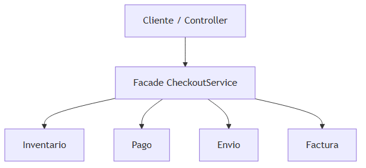

> *Fuente editable (Mermaid):* [01-facade.mermaid](./assets/diagrams/01-facade.mermaid)

**Ejemplo en C# (comentado):**

```csharp
// Facade: una entrada simple para un subsistema con varios servicios
public class OrderCheckoutFacade
{
    private readonly IInventoryService _inventory;
    private readonly IPaymentService _payment;
    private readonly INotificationService _notifications;

    public OrderCheckoutFacade(
        IInventoryService inventory,
        IPaymentService payment,
        INotificationService notifications)
    {
        _inventory = inventory;
        _payment = payment;
        _notifications = notifications;
    }

    // El controller solo llama ConfirmOrder — no conoce los 3 servicios internos
    public async Task ConfirmOrderAsync(Order order, CancellationToken ct)
    {
        await _inventory.ReserveAsync(order, ct);       // paso 1 del subsistema
        await _payment.ChargeAsync(order.Total, ct);    // paso 2
        await _notifications.SendConfirmationAsync(order, ct); // paso 3
    }
}
```

#### Cuándo usar

- Subsistema con **múltiples puntos de entrada** que el cliente no debería conocer.
- Quieres una API estable aunque el interior del subsistema cambie.
- Reducir acoplamiento del controller o capa de presentación.

#### Cuándo no

- La Facade se convierte en **clase dios** con toda la lógica de negocio — mueve reglas al dominio.
- Solo hay una llamada a un servicio — no necesitas fachada.

---

## 5. Patrones de comportamiento

Estos patrones responden: **¿cómo distribuyo algoritmos, estado y comunicación entre objetos?**

---

### 5.1 Strategy (Estrategia)

**Problema:** Tienes varias formas de calcular descuento (por temporada, por cliente VIP, por cupón). Un `switch` gigante en el servicio de pedidos viola Open/Closed Principle: cada descuento nuevo obliga a modificar esa clase.

#### Definición formal

**Strategy** define una familia de algoritmos, encapsula cada uno en una clase separada e intercambiable, y deja que el algoritmo varíe independientemente del cliente que lo usa.

#### Explicación desarrollada

El **Context** (servicio de pedidos) delega en una interfaz `IStrategy`. Cambiar comportamiento = cambiar la implementación inyectada o seleccionada por reglas, **sin editar** el contexto.

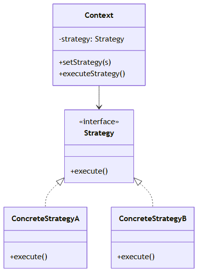

> *Fuente editable (Mermaid):* [01-strategy.mermaid](./assets/diagrams/01-strategy.mermaid)

**Ejemplo en C# (comentado):**

```csharp
// Estrategia intercambiable: cada algoritmo en su propia clase
public interface IDiscountStrategy
{
    decimal Apply(decimal subtotal, Customer customer);
}

public class VipDiscountStrategy : IDiscountStrategy
{
    public decimal Apply(decimal subtotal, Customer customer) =>
        customer.IsVip ? subtotal * 0.90m : subtotal;
}

// Context: delega el cálculo sin switch interno
public class OrderPricingService
{
    private readonly IDiscountStrategy _strategy;
    public OrderPricingService(IDiscountStrategy strategy) => _strategy = strategy;

    public decimal CalculateTotal(Order order) =>
        _strategy.Apply(order.Subtotal, order.Customer); // algoritmo inyectado
}
```

#### Cuándo usar

- **Varias variantes** de un algoritmo con la misma interfaz.
- Quieres evitar `switch`/`if-else` que crecen sin control.
- Algoritmos deben ser **testeables** de forma aislada.

#### Cuándo no

- Una sola regla fija — inline es más claro.
- Las "estrategias" comparten 90 % del código — extrae función común antes de crear clases.

---

### 5.2 Observer (Observador)

**Problema:** Cuando cambia el estado de un pedido, debes notificar inventario, enviar email y actualizar analytics. Si pones todo eso dentro de `Order.Confirm()`, la clase crece sin control.

#### Definición formal

**Observer** define una dependencia **uno-a-muchos** entre objetos: cuando un sujeto cambia de estado, todos sus observadores son notificados automáticamente.

#### Explicación desarrollada

**En sistemas modernos:** evoluciona hacia **Domain Events** (dentro del dominio) y **mensajería** (entre servicios). El Observer local escala mal si hay muchos suscriptores en procesos distintos — ahí entra el bus de eventos (capítulo 04).

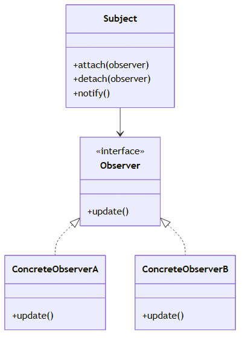

> *Fuente editable (Mermaid):* [01-observer.mermaid](./assets/diagrams/01-observer.mermaid)

**Ejemplo en C# (comentado):**

```csharp
// Sujeto: mantiene estado y lista de observadores
public class Order
{
    private readonly List<IOrderObserver> _observers = new();
    public void Attach(IOrderObserver observer) => _observers.Add(observer);

    public void Confirm()
    {
        Status = OrderStatus.Confirmed; // cambio de estado
        foreach (var observer in _observers)
            observer.OnOrderConfirmed(this); // notifica a todos sin conocerlos en detalle
    }
}

// Observador: reacciona al evento sin modificar la clase Order
public interface IOrderObserver { void OnOrderConfirmed(Order order); }

public class EmailNotifier : IOrderObserver
{
    public void OnOrderConfirmed(Order order) { /* enviar email */ }
}
```

#### Cuándo usar

- Un cambio debe **propagarse** a múltiples interesados en el mismo proceso.
- Quieres desacoplar el emisor del conocimiento de **quién** reacciona.
- Evolución natural hacia eventos de dominio en DDD.

#### Cuándo no

- Un solo consumidor síncrono — llamada directa o evento único basta.
- Muchos suscriptores en **otros servicios** — usa mensajería asíncrona, no Observer en memoria.

---

### 5.3 Command (Comando)

**Problema:** Quieres encapsular acciones como objetos para encolarlas, registrarlas, deshacerlas o enrutarlas sin acoplar el invocador al receptor concreto.

#### Definición formal

**Command** encapsula una solicitud como un **objeto**, permitiendo parametrizar clientes con distintas solicitudes, encolar operaciones, registrar logs o soportar deshacer (undo).

#### Explicación desarrollada

Roles clásicos: **Invoker** (quien ejecuta), **Command** (la solicitud), **Receiver** (quien tiene la lógica real). En APIs modernas, el Command a menudo **es** el DTO de intención (`CreateOrderCommand`) y el Handler es el receiver.

**Relación con CQRS:** en CQRS, los **commands** son objetos que representan intenciones de cambio. No siempre implementan undo, pero comparten la idea de encapsular la solicitud.

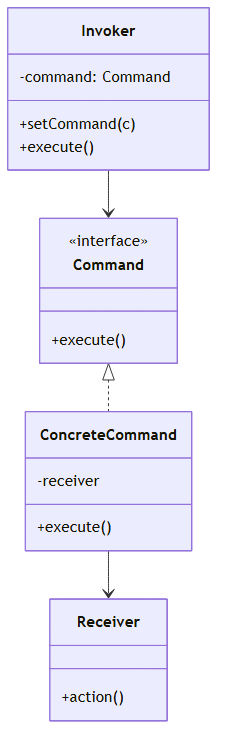

> *Fuente editable (Mermaid):* [01-command.mermaid](./assets/diagrams/01-command.mermaid)

**Ejemplo en C# (comentado):**

```csharp
// Command: encapsula la solicitud como objeto (parámetros + intención)
public record CancelOrderCommand(Guid OrderId, string Reason);

// Handler (receiver): ejecuta la lógica real
public class CancelOrderHandler
{
    private readonly IOrderRepository _orders;
    public CancelOrderHandler(IOrderRepository orders) => _orders = orders;

    public async Task Handle(CancelOrderCommand command, CancellationToken ct)
    {
        var order = await _orders.GetByIdAsync(command.OrderId, ct);
        order.Cancel(command.Reason); // acción sobre el dominio
        await _orders.UpdateAsync(order, ct);
    }
}

// Invoker (API): solo despacha el comando, no conoce detalles de cancelación
// await _mediator.Send(new CancelOrderCommand(id, reason), ct);
```

#### Cuándo usar

- Operaciones que deben **encolarse**, auditarse o deshacer.
- Desacoplar UI/API del objeto que ejecuta la acción.
- Base de CQRS: un comando = una intención de mutación.

#### Cuándo no

- Operación trivial sin historial ni cola — método directo en servicio.
- Commands anémicos sin validación ni handler claro — riesgo de "DTO soup".

---

### 5.4 State (Estado)

**Problema:** Un objeto cambia de comportamiento según su estado interno (pedido: borrador → confirmado → enviado → cancelado). Un `switch` sobre `Status` en cada método vuelve ilegible y frágil.

#### Definición formal

**State** permite que un objeto altere su comportamiento cuando su **estado interno** cambia. El objeto parecerá haber cambiado de clase, delegando en objetos de estado concretos.

#### Explicación desarrollada

Cada estado implementa la misma interfaz (`IOrderState`) con métodos como `Confirm()`, `Ship()`, `Cancel()`. Transiciones inválidas se modelan como excepciones o resultados en el estado concreto — la lógica **vive en el estado**, no en un enum + switch global.

**Analogía:** Una máquina expendedora: insertar moneda en estado "sin selección" habilita productos; en estado "sin stock" rechaza la compra. La máquina delega en el estado actual.

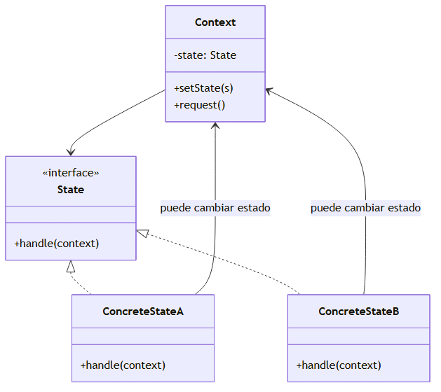

> *Fuente editable (Mermaid):* [01-state.mermaid](./assets/diagrams/01-state.mermaid)

**Ejemplo en C# (comentado):**

```csharp
// Interfaz común: cada estado implementa las mismas operaciones
public interface IOrderState
{
    void Confirm(Order order);
    void Ship(Order order);
}

// Estado concreto: define qué está permitido en "borrador"
public class DraftOrderState : IOrderState
{
    public void Confirm(Order order)
    {
        // validar reglas y cambiar al siguiente estado
        order.SetState(new ConfirmedOrderState());
    }

    public void Ship(Order order) =>
        throw new InvalidOperationException("Cannot ship draft"); // transición inválida aquí
}
```

#### Cuándo usar

- Comportamiento **depende fuertemente** del estado y hay **muchas transiciones**.
- Quieres eliminar `switch (status)` repetido en múltiples métodos.
- Reglas de transición son parte del **lenguaje ubiquo** del dominio.

#### Cuándo no

- Dos o tres estados simples — enum + validación centralizada puede bastar.
- Estados sin comportamiento distinto — solo datos; un campo `Status` es suficiente.

---

### 5.5 Template Method (Método plantilla)

**Problema:** Varios flujos comparten la **misma secuencia de pasos** pero algunos pasos varían (exportar informe PDF vs Excel: recopilar datos igual, formatear distinto).

#### Definición formal

**Template Method** define el esqueleto de un algoritmo en una operación de una clase base, delegando algunos pasos a **subclases** sin cambiar la estructura del algoritmo.

#### Explicación desarrollada

La clase abstracta define `Execute()` con pasos fijos: `LoadData()` → `Transform()` → `Save()`. `Transform()` es `abstract` o `virtual`; cada subclase lo implementa. El **orden** lo controla la base — las subclases no pueden saltarse pasos críticos.

**Analogía:** Una receta de cocina con pasos fijos ("calentar horno", "mezclar", "hornear") donde solo cambia el relleno según el postre.

**Ejemplo en C# (comentado):**

```csharp
// Clase base: fija el ORDEN del algoritmo; subclases solo varían pasos concretos
public abstract class ReportExporter
{
    // Template Method: esqueleto no modificable por subclases
    public void Export()
    {
        var data = LoadData();           // paso 1 — puede ser abstracto
        var formatted = Format(data);    // paso 2 — variación por subclase
        WriteOutput(formatted);          // paso 3 — común a todos
    }

    protected abstract Data LoadData();
    protected abstract FormattedData Format(Data data);
    protected void WriteOutput(FormattedData data) { /* lógica compartida */ }
}

public class PdfReportExporter : ReportExporter
{
    protected override Data LoadData() => /* SQL o API */;
    protected override FormattedData Format(Data data) => /* layout PDF */;
}
```

#### Cuándo usar

- Algoritmo con **estructura fija** y **variación en puntos concretos**.
- Quieres garantizar que nadie olvide un paso obligatorio del flujo.
- Herencia es aceptable en el módulo (framework interno, pipeline base).

#### Cuándo no

- Variación en **todos** los pasos — Strategy o composición es más flexible.
- Prefieres composición sobre herencia — delega en interfaces inyectadas (similar espíritu, distinto mecanismo).

---

### 5.6 Chain of Responsibility (Cadena de responsabilidad)

**Problema:** Una solicitud (validar pedido, autorizar pago, aplicar descuento) puede ser manejada por varios handlers en secuencia; no sabes de antemano cuál lo resolverá.

#### Definición formal

**Chain of Responsibility** evita acoplar el emisor de una solicitud a su receptor, dando a más de un objeto la oportunidad de manejar la solicitud. Encadena receptores y pasa la solicitud a lo largo de la cadena hasta que alguien la procese o se agote la cadena.

#### Explicación desarrollada

Cada **handler** implementa la misma interfaz y mantiene referencia al **siguiente**. Si puede procesar, lo hace; si no, delega en `Next.Handle(request)`.

**Analogía:** Soporte técnico por niveles: L1 intenta resolver; si no puede, escala a L2, luego a L3.

En ASP.NET Core, el pipeline de **middleware** es una cadena de responsabilidad: cada middleware puede cortar la respuesta o pasar al siguiente.

**Ejemplo en C# (comentado):**

```csharp
// Handler base: mantiene referencia al siguiente eslabón de la cadena
public abstract class ValidationHandler
{
    protected ValidationHandler? Next;
    public ValidationHandler SetNext(ValidationHandler next) { Next = next; return next; }
    public abstract ValidationResult Handle(OrderRequest request);
}

// Handler concreto: procesa o delega al siguiente
public class StockValidationHandler : ValidationHandler
{
    public override ValidationResult Handle(OrderRequest request)
    {
        if (!HasStock(request)) return ValidationResult.Fail("No stock"); // corta la cadena
        return Next?.Handle(request) ?? ValidationResult.Ok(); // pasa al siguiente handler
    }
}
```

#### Cuándo usar

- **Varios candidatos** para procesar una solicitud y el orden importa.
- Quieres añadir o quitar pasos **sin modificar** el emisor (Open/Closed).
- Pipelines de validación, autorización, logging, transformación.

#### Cuándo no

- Un solo handler siempre — cadena innecesaria.
- Orden impredecible o handlers con efectos laterales opacos — depura con trazas explícitas.

---

### 5.7 Mediator (Mediador)

**Problema:** Diez servicios se llaman entre sí directamente. Cambiar uno rompe otros. El grafo de dependencias es inmanejable.

#### Definición formal

**Mediator** define un objeto que encapsula cómo un conjunto de objetos interactúa. Promueve comunicación **desacoplada** evitando que los objetos se referencien explícitamente entre sí.

#### Explicación desarrollada

**En .NET:** MediatR es la implementación más conocida. El controller no conoce handlers; solo envía un command o query al mediador. Los handlers no se referencian entre sí directamente — el mediador enruta.


> *Fuente editable (Mermaid):* [01-cqrs-mediator.mermaid](./assets/diagrams/01-cqrs-mediator.mermaid)

**Ejemplo en C# (comentado):**

```csharp
// Command: intención de escritura enviada al mediador
public record CreateOrderCommand(Guid CustomerId, List<OrderLineDto> Lines);

// Handler: procesa UN tipo de mensaje; no lo invoca el controller directamente
public class CreateOrderHandler
{
    public Task<OrderDto> Handle(CreateOrderCommand command, CancellationToken ct) { /* ... */ }
}

// Controller: solo conoce IMediator, no los handlers concretos
public class OrdersController
{
    private readonly IMediator _mediator;
    public OrdersController(IMediator mediator) => _mediator = mediator;

    [HttpPost]
    public Task<OrderDto> Create(CreateOrderCommand command, CancellationToken ct) =>
        _mediator.Send(command, ct); // mediador enruta al handler correcto
}
```

#### Cuándo usar

- Comunicación **N-a-N** que se vuelve enredada.
- Quieres un punto único de despacho (commands, queries, notificaciones).
- CQRS con handlers pequeños y focalizados.

#### Cuándo no

- Dos clases que se hablan una vez — mediador es overhead.
- El mediador concentra **toda** la lógica — vuelve a ser clase dios.

---

## 6. Patrones enterprise (aplicaciones de negocio)

Estos patrones no vienen del libro GoF original, pero son **estándar** en backend enterprise (.NET, Java, etc.).

---

### 6.1 Repository (Repositorio)

**Problema sin patrón:** tu servicio de aplicación contiene SQL o LINQ mezclado con reglas de negocio. Cambiar de EF Core a otro store obliga a reescribir lógica de negocio.

#### Definición formal

**Repository** actúa como una **colección en memoria** de agregados desde la perspectiva del dominio. Media entre el dominio y la capa de mapeo de datos, ocultando detalles de persistencia.

#### Explicación desarrollada

**Responsabilidades del Repository:**

- `GetById`, `Add`, `Update`, `Remove` a nivel de **agregado** (no de tabla suelta).
- Ocultar ORM, SQL, índices, paginación interna.
- Permitir tests con un `FakeOrderRepository` en memoria.

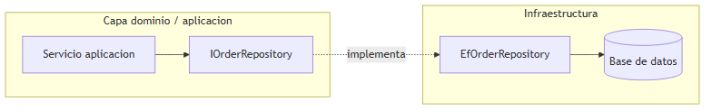

> *Fuente editable (Mermaid):* [01-repository.mermaid](./assets/diagrams/01-repository.mermaid)

**Repository vs acceso directo a DbContext:**

| Acceso directo | Repository |
|---|---|
| Rápido en prototipos | Mejor en proyectos que crecerán |
| Lógica de query dispersa | Punto único de acceso por agregado |
| Tests acoplados a BD | Tests con dobles en memoria |

**Ejemplo en C# (comentado):**

```csharp
// Puerto en dominio/aplicación: habla en términos de agregados, no de tablas SQL
public interface IOrderRepository
{
    Task<Order?> GetByIdAsync(Guid id, CancellationToken ct = default);
    Task AddAsync(Order order, CancellationToken ct = default);
    Task UpdateAsync(Order order, CancellationToken ct = default);
}

// Implementación en infraestructura: EF Core, SQL, etc. — oculta detalles al dominio
public class EfOrderRepository : IOrderRepository
{
    private readonly AppDbContext _db;
    public EfOrderRepository(AppDbContext db) => _db = db;

    public async Task<Order?> GetByIdAsync(Guid id, CancellationToken ct) =>
        await _db.Orders.Include(o => o.Lines).FirstOrDefaultAsync(o => o.Id == id, ct);

    public async Task AddAsync(Order order, CancellationToken ct) =>
        await _db.Orders.AddAsync(order, ct);
}
```

#### Cuándo usar

- Dominio con **agregados** y reglas que deben testearse sin BD.
- Múltiples fuentes de datos o ORM intercambiable.
- Equipo que valora **límite claro** entre aplicación e infraestructura.

#### Cuándo no

- Prototipo desechable — DbContext directo acelera.
- Repository genérico `IRepository<T>` para todo — pierde semántica de agregado y vuelve a ser DAO fino.

---

### 6.2 Unit of Work (Unidad de trabajo)

**Problema:** una operación de negocio modifica dos agregados. Guardas uno y el segundo falla — quedas con datos inconsistentes.

#### Definición formal

**Unit of Work** mantiene una lista de objetos afectados por una transacción de negocio y coordina la escritura de cambios y la resolución de problemas de concurrencia en **un commit atómico**.

#### Explicación desarrollada

**En Entity Framework Core:** `DbContext.SaveChanges()` actúa como Unit of Work — rastrea cambios y los persiste en una transacción. No siempre necesitas una interfaz `IUnitOfWork` explícita si el DbContext ya delimita la unidad.

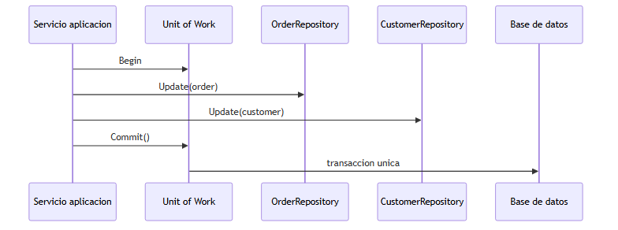

> *Fuente editable (Mermaid):* [01-unit-of-work.mermaid](./assets/diagrams/01-unit-of-work.mermaid)

**Ejemplo en C# (comentado):**

```csharp
// Servicio de aplicación: coordina varios cambios en una sola unidad de trabajo
public class PlaceOrderHandler
{
    private readonly IOrderRepository _orders;
    private readonly IUnitOfWork _unitOfWork; // abstrae el commit atómico

    public async Task Handle(PlaceOrderCommand command, CancellationToken ct)
    {
        var order = Order.Create(command.CustomerId, command.Lines);
        await _orders.AddAsync(order, ct);           // cambio pendiente en memoria/tracker
        await _unitOfWork.SaveChangesAsync(ct);      // un solo commit: todo o nada
    }
}

// En EF Core, DbContext.SaveChanges() ES la Unit of Work
public class EfUnitOfWork : IUnitOfWork
{
    private readonly AppDbContext _db;
    public Task SaveChangesAsync(CancellationToken ct) => _db.SaveChangesAsync(ct);
}
```

#### Cuándo usar

- Una operación de aplicación toca **varios agregados** que deben persistir juntos.
- Necesitas transacción explícita en servicios sin ORM con change tracking.
- Coordinación con Outbox en la **misma** transacción.

#### Cuándo no

- Una sola entidad por operación — SaveChanges directo basta.
- Unit of Work duplicado encima de DbContext sin valor añadido.

---

### 6.3 CQRS (Command Query Responsibility Segregation)

#### Definición formal

**CQRS** separa responsabilidades de **mutación** (commands) y **consulta** (queries): métodos que cambian estado no se mezclan con métodos que solo leen.

#### Explicación desarrollada

**Motivación pedagógica:** leer y escribir tienen necesidades diferentes:

- **Escritura:** invariantes de negocio, transacciones, validación estricta.
- **Lectura:** proyecciones rápidas, joins, reportes, pantallas — a veces datos desnormalizados.

| Variante | Qué significa |
|---|---|
| **CQRS lógico** | Mismas tablas; clases `CreateOrderCommand` / `GetOrdersQuery` separadas |
| **CQRS físico** | Bases distintas: OLTP para escribir, proyección o BD de lectura |

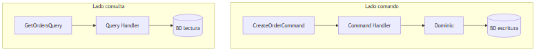

> *Fuente editable (Mermaid):* [01-cqrs-split.mermaid](./assets/diagrams/01-cqrs-split.mermaid)

**Flujo completo con Mediator:**

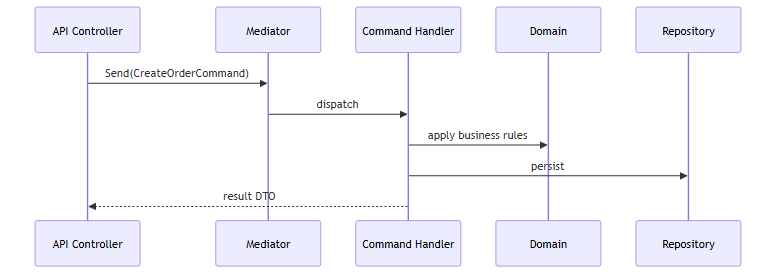

**Ejemplo en C# (comentado):**

```csharp
// COMMAND — mutación: cambia estado, sin lógica de lectura mezclada
public record CreateOrderCommand(Guid CustomerId, List<OrderLineDto> Lines);
public class CreateOrderHandler { /* valida, crea agregado, persiste */ }

// QUERY — lectura: no modifica estado, puede proyectar DTOs optimizados
public record GetOrdersByCustomerQuery(Guid CustomerId);
public class GetOrdersByCustomerHandler
{
    public Task<List<OrderSummaryDto>> Handle(GetOrdersByCustomerQuery query, CancellationToken ct)
    {
        // puede usar SQL directo o vista desnormalizada — independiente del modelo de escritura
        return Task.FromResult(new List<OrderSummaryDto>());
    }
}
```

#### Cuándo usar

- Modelos de lectura y escritura **divergen** (pantallas complejas vs agregados ricos).
- Necesitas escalar lecturas independientemente (CQRS físico con proyecciones).
- Quieres handlers pequeños y testeables por caso de uso.

#### Cuándo no

- CRUD simétrico simple — CQRS añade carpetas y ceremonia.
- "CQRS porque es enterprise" sin problema de lectura/escritura — YAGNI.

> **Importante para juniors:** CQRS **no obliga** a tener microservicios. Es un patrón de organización de código que puede vivir en un solo proyecto.

---

### 6.4 Domain Events vs Integration Events

#### Definición formal

Un **Domain Event** es algo que ocurrió en el dominio, expresado en lenguaje de negocio pasado (`OrderPlaced`). Un **Integration Event** es un mensaje **contratado** para cruzar límites de proceso o bounded context, con versionado y transporte definidos.

#### Explicación desarrollada

| | Domain Event | Integration Event |
|---|---|---|
| **Alcance** | Dentro de un bounded context | Entre servicios o contextos |
| **Nombre** | Pasado de negocio (`OrderPlaced`) | Contrato de mensajería versionado |
| **Transporte** | En memoria, MediatR, outbox local | Bus, cola, HTTP webhook |
| **Modelo** | Puede incluir entidades ricas | DTO plano, estable en el tiempo |

**Ejemplo en C# (comentado):**

```csharp
// Domain Event: ocurre DENTRO del bounded context, lenguaje de negocio
public record OrderPlacedDomainEvent(Guid OrderId, DateTimeOffset OccurredAt);

// En el agregado, al confirmar la operación de negocio
public class Order
{
    private readonly List<object> _domainEvents = new();
    public void Place() { /* reglas */ _domainEvents.Add(new OrderPlacedDomainEvent(Id, DateTimeOffset.UtcNow)); }
}

// Integration Event: contrato para OTRO servicio (mensajería, versión estable)
public record OrderPlacedIntegrationEvent
{
    public Guid OrderId { get; init; }
    public string EventType { get; init; } = "orders.placed.v1";
    public DateTimeOffset OccurredAt { get; init; }
}
```

#### Cuándo usar cada uno

- **Domain Event:** reacciones dentro del mismo servicio (enviar email tras confirmar pedido en el mismo proceso).
- **Integration Event:** otro equipo/servicio debe reaccionar (inventario reserva stock en otro microservicio).

---

### 6.5 Outbox Pattern

**Problema:** guardas un pedido en SQL y publicas un evento en RabbitMQ. Si la BD confirma pero el bus falla (o al revés), los sistemas quedan desincronizados.

#### Definición formal

**Outbox** almacena mensajes salientes en la **misma base de datos** que los datos de negocio, dentro de la **misma transacción**. Un proceso separado lee la tabla outbox y publica al bus.

#### Explicación desarrollada

**Inbox (complemento):** tabla de IDs de mensajes ya procesados para ignorar duplicados cuando el bus garantiza **at-least-once delivery**.

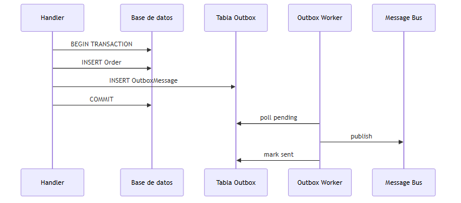

> *Fuente editable (Mermaid):* [01-outbox.mermaid](./assets/diagrams/01-outbox.mermaid)

**Ejemplo en C# (comentado):**

```csharp
// Misma transacción: guardar pedido Y mensaje outbox
public async Task Handle(PlaceOrderCommand command, CancellationToken ct)
{
    var order = Order.Create(command);
    _db.Orders.Add(order);

    // Mensaje pendiente de publicar — vive en la MISMA BD que el pedido
    _db.OutboxMessages.Add(new OutboxMessage
    {
        Id = Guid.NewGuid(),
        Type = "OrderPlaced",
        Payload = JsonSerializer.Serialize(new { order.Id }),
        CreatedAt = DateTimeOffset.UtcNow
    });

    await _db.SaveChangesAsync(ct); // commit atómico: pedido + outbox juntos
}

// Proceso en background (worker): lee outbox y publica al bus
// foreach (var msg in pending) { await _bus.Publish(msg); msg.MarkProcessed(); }
```

#### Cuándo usar

- Debes garantizar **consistencia** entre persistencia y publicación de eventos.
- Mensajería **at-least-once** y consumidores idempotentes.
- Microservicios o monolitos que publican integration events tras commit.

#### Cuándo no

- No hay bus ni eventos — outbox no aplica.
- Fire-and-forget sin requisito de consistencia — aceptas riesgo explícitamente (documentado).

---

## 7. Patrones de integración entre sistemas

---

### 7.1 Anti-Corruption Layer (ACL)

#### Definición formal

**Anti-Corruption Layer** es una capa de traducción que evita que un modelo externo (legacy, API de terceros) **contamine** tu modelo de dominio interno.

#### Explicación desarrollada

La ACL traduce **en ambos sentidos** si hace falta: peticiones salientes al formato legacy y respuestas entrantes a tus value objects y entidades. Es Adapter a escala de **bounded context**.


**Ejemplo en C# (comentado):**

```csharp
// Modelo INTERNO del dominio — no se contamina con el legacy
public record CustomerId(Guid Value);

// DTO del sistema legacy (formato ajeno a tu ubiquitous language)
public class LegacyCustomerDto { public int LegacyId { get; set; } public string FullName { get; set; } }

// ACL: traduce entre mundos; el dominio nunca ve LegacyCustomerDto
public class LegacyCustomerAdapter
{
    public CustomerId ToDomain(LegacyCustomerDto legacy) =>
        new CustomerId(Guid.Parse(legacy.LegacyId.ToString().PadLeft(32, '0')));

    public LegacyCustomerDto ToLegacy(string name) =>
        new LegacyCustomerDto { FullName = name }; // solo en capa de integración
}
```

#### Cuándo usar

- Integración con sistemas cuyo modelo **no encaja** con tu ubiquitous language.
- Legacy que no puedes reemplazar pronto pero no debe dictar tu diseño interno.
- APIs de terceros con conceptos distintos (IDs, estados, moneda).

#### Cuándo no

- API externa ya alineada con tu dominio y estable — Adapter puntual puede bastar.
- Copiar modelos externos dentro del dominio "para ir rápido" — deuda que la ACL evita.

---

### 7.2 Saga (visión introductoria)

#### Definición formal

**Saga** es una secuencia de **transacciones locales** en servicios distintos, con **compensaciones** si un paso falla, en lugar de una transacción distribuida ACID global.

#### Explicación desarrollada

Dos estilos (detalle en capítulo 04):

| Estilo | Idea |
|---|---|
| **Coreografía** | Cada servicio reacciona a eventos y emite el siguiente |
| **Orquestación** | Un coordinador central define pasos y compensaciones |

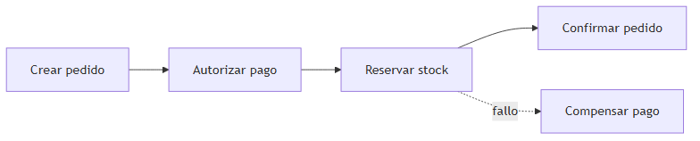

> *Fuente editable (Mermaid):* [01-saga-overview.mermaid](./assets/diagrams/01-saga-overview.mermaid)

**Ejemplo en C# (comentado):**

```csharp
// Saga orquestada: coordinador ejecuta pasos locales con compensación si falla
public class PlaceOrderSaga
{
    public async Task ExecuteAsync(PlaceOrderRequest request)
    {
        Guid? reservationId = null;
        try
        {
            var orderId = await _orders.CreateAsync(request);     // paso 1 — transacción local
            reservationId = await _inventory.ReserveAsync(orderId); // paso 2 — otra transacción local
            await _payments.ChargeAsync(orderId);                   // paso 3
        }
        catch
        {
            if (reservationId.HasValue)
                await _inventory.ReleaseAsync(reservationId.Value); // compensación del paso 2
            throw;
        }
    }
}
```

#### Cuándo usar

- Operación de negocio **atraviesa varios servicios** sin 2PC (two-phase commit) viable.
- Aceptas **consistencia eventual** con compensaciones explícitas.
- Flujos largos (pedido, reserva, pago, envío).

#### Cuándo no

- Todo cabe en **una transacción** local — saga añade complejidad innecesaria.
- No has definido compensaciones — saga incompleta es peor que monolito transaccional.

---

## 8. Cómo elegir patrones sin sobre-ingeniería

### Definición formal

**Sobre-ingeniería** es añadir abstracciones y patrones cuyo coste (complejidad, mantenimiento, onboarding) supera el beneficio ante el problema **actual**, no el imaginado.

### Explicación desarrollada

Preguntas antes de introducir un patrón:

1. ¿Qué **dolor concreto** resuelve hoy?
2. ¿Hay una solución **más simple** (función, interfaz única, middleware)?
3. ¿El equipo **entenderá** la estructura en seis meses?
4. ¿Los tests serán **más fáciles** después?

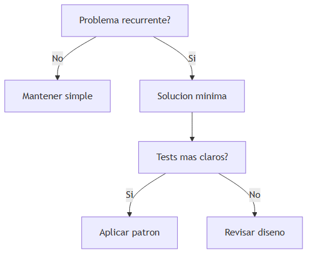

### Cuándo parar de añadir patrones

- El diagrama de clases tiene más interfaces que casos de uso.
- Juniors preguntan "¿por qué existe esta capa?" y la respuesta es "por si acaso".
- Duplicas el mismo DTO en Command, Entity, IntegrationEvent sin razón de evolución distinta.

---

## 9. Resumen del capítulo

| Patrón | Problema que resuelve |
|---|---|
| Factory Method | Creación sin acoplar a clase concreta |
| Abstract Factory | Familias de productos compatibles |
| Builder | Objetos complejos con muchos pasos |
| Prototype | Clonar plantillas costosas |
| Singleton | Una instancia por recurso (preferir DI) |
| Adapter | Interfaces incompatibles |
| Bridge | Abstracción e implementación independientes |
| Composite | Árboles parte-todo uniformes |
| Decorator | Responsabilidades dinámicas en capas |
| Facade | Subsistema complejo |
| Strategy | Algoritmos intercambiables |
| Observer | Notificar cambios a múltiples interesados |
| Command | Encapsular solicitudes |
| State | Comportamiento según estado interno |
| Template Method | Esqueleto de algoritmo con pasos variables |
| Chain of Responsibility | Cadena de handlers |
| Mediator | Desacoplar comunicación N-a-N |
| Repository | Abstraer persistencia |
| Unit of Work | Transacción lógica |
| CQRS | Separar lectura y escritura |
| Outbox | Consistencia BD + mensajería |
| ACL | Proteger dominio de modelos externos |
| Saga | Consistencia distribuida con compensación |

**Siguiente paso:** capítulo 02 — cómo estos patrones se organizan en **arquitecturas completas** (capas, Clean, Hexagonal, microservicios).
