# 03 — Domain-Driven Design (DDD)

## Objetivo de este capítulo

Has visto entidades en EF Core (`public class Order { public int Id { get; set; } ... }`). DDD te enseña a ir más allá: **modelar el negocio como lo entiende el experto del dominio**, no solo como lo entiende la base de datos.

Asumimos que ya sabes C#, HTTP y SQL, y que leíste el capítulo 02 sobre arquitecturas. DDD no es un framework ni una librería NuGet: es un **conjunto de principios y patrones** para alinear código, conversaciones y documentación con el negocio real.

Conceptos que dominarás:

- Qué es DDD y por qué existe.
- DDD estratégico vs táctico.
- Tipos de subdominio (core, supporting, generic).
- Bounded context con ejemplos concretos.
- Context map y **todas** las relaciones entre contextos.
- Ubiquitous Language (lenguaje ubicuo).
- Entity, Value Object, Aggregate y Aggregate Root.
- Reglas de agregados, eventos de dominio, repository, domain service, factory.
- Taller Event Storming.
- Anti-patrones frecuentes.

> **Cómo leer este capítulo:** cada building block sigue definición → explicación → diagrama → cuándo usarlo. DDD tiene vocabulario preciso; usar "agregado" sin definición genera bugs de modelado difíciles de corregir después.

---

## 1. ¿Qué es Domain-Driven Design?

### Definición formal

**Domain-Driven Design (DDD)** es un enfoque de diseño de software, articulado por Eric Evans en *Domain-Driven Design* (2003), que coloca el **dominio de negocio** — el área de conocimiento de la actividad que el software apoya — en el **centro** de todas las decisiones de modelado, colaboración y arquitectura.

### Explicación desarrollada

Imagina construir un simulador de vuelo sin hablar nunca con un piloto. Podrías programar botones bonitos, pero el modelo no reflejaría la realidad. DDD dice: **el software es una traducción del dominio** — ventas, logística, contabilidad, salud — y esa traducción debe hacerse **junto** con quien conoce las reglas (el experto de dominio).

Palabras clave:

| Término | Significado sencillo |
|---|---|
| **Dominio** | El "mundo" del negocio: pedidos, inventario, pagos, citas médicas |
| **Experto de dominio** | Persona del negocio que conoce las reglas (no programador) |
| **Modelo de dominio** | Representación en código de conceptos y reglas del negocio |
| **Ubiquitous Language** | Mismo vocabulario en reuniones, documentación y código |

Para un junior en C#, DDD cambia preguntas como "¿qué tablas necesito?" por "¿qué conceptos del negocio existen y qué reglas los gobiernan?".

**¿Para quién es DDD?**

- Sistemas con **reglas de negocio complejas** (no un CRUD de contactos).
- Equipos que pueden hablar con expertos del negocio con cierta regularidad.
- Proyectos que vivirán años y cambiarán según el mercado.

**No es obligatorio** en todo proyecto. Un panel de administración interno simple puede funcionar con capas y entidades anémicas sin DDD completo.

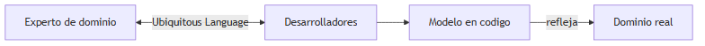

### Cuándo aplicar DDD (y cuándo no)

| Aplica DDD cuando… | No fuerces DDD cuando… |
|---|---|
| Reglas cambian seguido y son críticas | CRUD sin lógica, vida útil corta |
| Bugs cuestan dinero o reputación | No hay acceso a expertos de dominio |
| Múltiples equipos modelan la misma área | Equipo de 1 persona, plazo de 2 semanas |

> **Nota del instructor:** DDD tiene **coste de aprendizaje**. Empieza por lenguaje ubicuo y bounded contexts antes de agregados perfectos. Un lenguaje compartido mal implementado ya aporta valor.

---

## 2. DDD estratégico vs DDD táctico

### Definición formal

**DDD estratégico** define **dónde** dividir el sistema y **cómo** se relacionan las partes (macro). **DDD táctico** define **cómo** modelar **dentro** de cada parte con building blocks concretos (micro): entidades, agregados, repositorios, etc.

### Explicación desarrollada

Analogía: construir una ciudad. **Estratégico** decide dónde están el barrio residencial, la zona industrial y el hospital, y qué carreteras los conectan. **Táctico** decide cómo se construye cada edificio: cimientos, plantas, normativa de incendios.

| Nivel | Pregunta que responde | Artefactos principales |
|---|---|---|
| **Estratégico** | ¿Dónde están los límites del sistema? | Subdominios, bounded contexts, context map |
| **Táctico** | ¿Cómo modelamos dentro de un límite? | Entity, VO, Aggregate, Repository, Events |

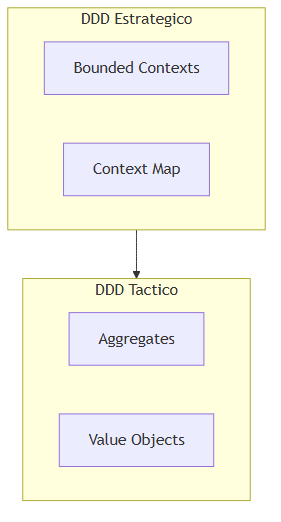

> *Fuente editable (Mermaid):* [03-ddd-levels.mermaid](./assets/diagrams/03-ddd-levels.mermaid)

**Orden recomendado para juniors:** primero estratégico (¿dónde corto?). Luego táctico (¿cómo modelo Pedidos dentro de Ventas?). Modelar agregados perfectos en un sistema sin bounded contexts claros es decoración inútil.

### Cuándo priorizar cada nivel

| Prioriza estratégico cuando… | Prioriza táctico cuando… |
|---|---|
| Sistema grande, varios equipos | Un solo bounded context bien delimitado |
| Mismo término significa cosas distintas | Reglas complejas dentro de un módulo |
| Integración con sistemas legacy | Refactor de entidades anémicas en un servicio |

> **Nota del instructor:** en equipos reales, confundir estratégico con táctico es muy común. Recuerda: **context map = estratégico**; **aggregate root = táctico**.

---

## 3. Subdominios y tipos (Core, Supporting, Generic)

### Definición formal

Un **subdominio** es una **parte coherente del dominio general** del negocio, con vocabulario y reglas propias. Evans clasifica subdominios en **Core** (núcleo), **Supporting** (soporte) y **Generic** (genérico) según su valor competitivo y la inversión de modelado recomendada.

### Explicación desarrollada

Una tienda online tiene subdominios: catálogo, ventas, logística, facturación, marketing, autenticación. **No todos merecen el mismo esfuerzo**.

| Tipo | Descripción | Inversión de modelado | Ejemplo |
|---|---|---|---|
| **Core (núcleo)** | Lo que te **diferencia** de la competencia; ventaja competitiva | Máxima — DDD profundo, mejores devs | Motor de recomendaciones personalizadas |
| **Supporting (soporte)** | Necesario para operar pero **no único**; custom pero no diferenciador | Moderada — modelo propio, menos ceremonia | Gestión de pedidos estándar |
| **Generic (genérico)** | **Commodity** — solución estándar del mercado | Mínima — comprar o integrar SaaS | Email transaccional, autenticación OAuth |

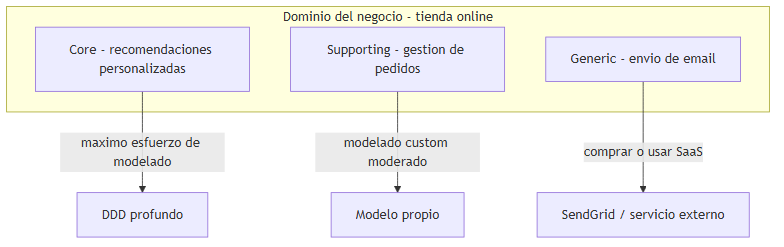

> *Fuente editable (Mermaid):* [03-subdomains.mermaid](./assets/diagrams/03-subdomains.mermaid)

**Ejemplo numérico de esfuerzo:** en un equipo de 10 desarrolladores, quizá 6 trabajan en core, 3 en supporting y 1 integra genéricos. Invertir 6 meses modelando "envío de email" con agregados perfectos es desperdicio si SendGrid resuelve el 99%.

### Cuándo clasificar subdominios (y errores comunes)

| Haz la clasificación cuando… | Error frecuente |
|---|---|
| Planificas asignación de equipos | Tratar todo como "core" por orgullo |
| Decides build vs buy | Comprar SaaS para el core diferenciador |
| Priorizas deuda técnica | Ignorar supporting hasta que bloquee ventas |

> **Nota del instructor:** pregunta al negocio: "Si mañana un competidor copia todo excepto X, ¿seguimos ganando?" — X suele ser el subdominio core.

---

## 4. Bounded Context (contexto delimitado)

### Definición formal

Un **bounded context** es un **límite explícito** — lingüístico y de software — dentro del cual un **modelo de dominio** y un **lenguaje ubicuo** tienen un significado **preciso y consistente**. Fuera de ese límite, el mismo término puede significar otra cosa.

### Explicación desarrollada

Es la idea más importante de DDD estratégico. El mismo concepto del mundo real puede tener **modelos distintos** según el contexto.

**Ejemplo pedagógico — "Producto":**

| Contexto | Modelo de Producto | Campos relevantes |
|---|---|---|
| **Ventas** | Ítem vendible | `id`, `nombre`, `precioOferta`, `descuento` |
| **Catálogo** | Ficha comercial | `id`, `descripción`, `categorías`, `imágenes` |
| **Logística** | Ítem físico a mover | `id`, `peso`, `dimensiones`, `almacén`, `fragil` |
| **Contabilidad** | Línea contable | `id`, `cuenta`, `IVA`, `centro de coste` |

Es el **mismo producto físico**, pero cuatro modelos distintos — y **cuatro clases distintas** en código (o cuatro servicios con DTOs distintos). Compartir una sola clase `Product` con 40 propiedades para todos es una receta para acoplamiento.

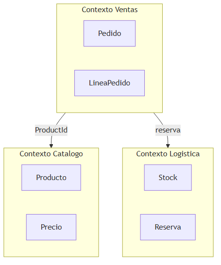

> *Fuente editable (Mermaid):* [03-bounded-contexts.mermaid](./assets/diagrams/03-bounded-contexts.mermaid)

**Regla de oro:** no compartas la misma clase de entidad entre contextos. Comparte **identificadores** (`ProductId` como GUID) y **contratos** (API REST, eventos de integración).

En monolito modular, un bounded context ≈ un módulo. En microservicios, un bounded context ≈ un servicio (idealmente).

### Cuándo definir un bounded context (y cuándo fusionar)

| Crea contexto separado cuando… | Mantén en el mismo contexto cuando… |
|---|---|
| El mismo término genera malentendidos | Modelo y reglas son idénticos |
| Equipos distintos evolucionan la parte | Un solo equipo, alta cohesión |
| Ciclos de release independientes | Transacciones ACID frecuentes entre conceptos |

| Señal de bounded context mal dibujado | Síntoma |
|---|---|
| Clase `Product` usada en 8 proyectos | Cambio en logística rompe ventas |
| Reuniones largas definiendo "cliente" | Dos equipos, dos definiciones |

> **Nota del instructor:** dibuja bounded contexts **antes** de dibujar microservicios. Un servicio mal partido suele ser un bounded context mal entendido.

---

## 5. Context Map (mapa de contextos)

### Definición formal

El **Context Map** es un diagrama — artefacto de DDD estratégico — que documenta **todos los bounded contexts** del sistema y el **tipo de relación** entre ellos, incluyendo dirección de influencia (upstream/downstream) y patrones de integración.

### Explicación desarrollada

Si los bounded contexts son países, el context map es el **mapa político**: quién es aliado, quién depende de quién, quién impone leyes y quién traduce idiomas.

A continuación, **todas** las relaciones principales del libro de Evans y la comunidad DDD:

#### 5.1 Partnership (Asociación)

**Definición:** Dos equipos/contextos **colaboran en igualdad**; éxito o fracaso compartido. Cambios se coordinan en ambas direcciones.

**Ejemplo:** Equipo Ventas y Equipo Pagos construyen juntos el checkout unificado. Ninguno puede imponer unilateralmente.

**Cuándo:** equipos pequeños, mismo producto, alta confianza.

#### 5.2 Shared Kernel (Núcleo compartido)

**Definición:** Subconjunto **explícito y acotado** del modelo compartido por dos contextos. Cambios requieren **acuerdo mutuo** de ambos equipos.

**Ejemplo:** librería `Shared.Identifiers` con `CustomerId`, `OrderId` — nada más.

**Riesgo:** crece hasta convertirse en acoplamiento global. Usar **con mucho cuidado**.

#### 5.3 Customer-Supplier (Cliente-Proveedor)

**Definición:** Relación **upstream (proveedor)** / **downstream (cliente)** clara. El downstream **puede negociar** prioridades; el upstream considera sus necesidades.

**Ejemplo:** Catálogo (supplier) expone API de productos; Ventas (customer) pide campos adicionales para promociones.

#### 5.4 Conformist (Conformista)

**Definición:** Downstream **acepta el modelo del upstream tal cual**, sin traducción, porque no tiene poder de negociación (legacy, vendor externo, plazo).

**Ejemplo:** Integración con ERP SAP — usas sus DTOs y nombres aunque no encajen con tu lenguaje ubicuo.

#### 5.5 Anti-Corruption Layer (ACL — Capa anticorrupción)

**Definición:** Downstream construye una **capa de traducción** entre el modelo externo (upstream) y su propio modelo interno, **protegiendo** su bounded context de conceptos ajenos.

**Ejemplo:** Servicio Ventas recibe XML del legacy; `LegacyOrderAdapter` lo convierte a `Order` del dominio interno.

#### 5.6 Open Host Service (Servicio anfitrión abierto)

**Definición:** Upstream publica un **protocolo/API estable y bien documentado** para múltiples consumidores, con contrato explícito (REST, eventos).

**Ejemplo:** Catálogo expone `/v1/products` y eventos `ProductPriceChanged` con esquema JSON versionado.

#### 5.7 Published Language (Lenguaje publicado)

**Definición:** Upstream y downstreams acuerdan un **lenguaje de intercambio común** — often estándar de industria o esquema compartido — independiente de modelos internos.

**Ejemplo:** Integración logística usando estándar GS1 para identificadores de producto.

#### 5.8 Separate Ways (Caminos separados)

**Definición:** **No hay integración** entre contextos; duplicación aceptada porque el coste de integrar supera el beneficio.

**Ejemplo:** CRM interno y sistema de soporte usan cada uno su copia de datos de cliente, sincronizados manualmente o no.

#### 5.9 Big Ball of Mud (Bola de barro)

**Definición:** Relación **caótica** sin límites claros — anti-patrón documentado en el mapa como advertencia, no como elección consciente.

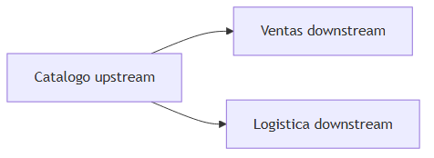

> *Fuente editable (Mermaid):* [03-context-map.mermaid](./assets/diagrams/03-context-map.mermaid)

### Cuándo actualizar el Context Map

| Actualiza cuando… | No omitas… |
|---|---|
| Nuevo bounded context o servicio | Dirección upstream/downstream |
| Cambio de integración (REST → eventos) | Tipo de relación (ACL vs Conformist) |
| Fusión o split de equipos | Shared Kernel existente |

> **Nota del instructor:** el context map es un **documento vivo**, no un diagrama de arquitectura de hace tres años en Confluence. Revísalo cada trimestre en productos activos.

---

## 6. Ubiquitous Language (lenguaje ubicuo)

### Definición formal

El **Ubiquitous Language** (lenguaje ubicuo) es el **vocabulario compartido** entre desarrolladores y expertos de dominio, usado de forma **consistente** en conversaciones, documentación, código fuente, tests y nombres de APIs.

### Explicación desarrollada

DDD no es solo patrones técnicos; es **comunicación**. Si en la reunión el negocio dice "confirmar pedido" pero el código tiene `UpdateOrderStatus(3)`, hay **dos lenguajes** — y bugs de interpretación.

**Mal ejemplo:**

- Reunión: "El pedido queda **confirmado** cuando el pago está autorizado."
- Código: `order.Status = 3;` y `PaymentService.Check()` en otro servicio sin nombre de negocio.

**Buen ejemplo:**

- Reunión: "Confirmar pedido."
- Código: `order.Confirm()` que valida invariantes.
- Evento: `OrderConfirmed`.
- Test: `Cannot_Confirm_Empty_Order()`.

El lenguaje ubicuo **evoluciona**. Cuando el negocio descubre un matiz ("pedido pendiente de fraude" vs "pendiente de pago"), el código debe reflejarlo con nuevos términos o estados nombrados, no con `Status = 7`.

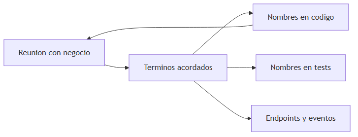

### Cuándo reforzar el lenguaje ubicuo (y señales de rotura)

| Refuerza cuando… | Señal de rotura |
|---|---|
| Onboarding de juniors | Glosario ignorado; devs inventan sinónimos |
| Bugs por malentendido de términos | `Active`, `Enabled`, `Confirmed` mezclados |
| Nuevo experto de dominio en el equipo | Documentación desactualizada |

| Práctica | Detalle |
|---|---|
| Glosario en repo o wiki | Término → definición → clase/evento |
| Code review | Rechazar nombres técnicos opacos en dominio |
| Event Storming | Descubre términos en workshop (sección 15) |

> **Nota del instructor:** si el negocio usa una palabra y tú otra en código durante más de dos sprints, **el modelo está mintiendo**. Para el código hacia el lenguaje del negocio, no al revés.

---

## 7. Entity (entidad)

### Definición formal

Una **Entity** (entidad) es un objeto de dominio con **identidad única y continua** a lo largo del tiempo y de los cambios de sus atributos. Dos entidades son la misma si comparten el mismo identificador, aunque todos sus demás campos difieran.

### Explicación desarrollada

Piensa en tu DNI: aunque cambies de domicilio, pelo o nombre, **sigues siendo tú** porque el identificador persiste. Un `Order` con `OrderId = 5` es el mismo pedido aunque cambie su total, su dirección o su estado.

**Criterio de diseño:** si solo te importa el valor (dos billetes de 10€), no es entidad — es value object. Si te importa **rastrear historial** de ese objeto concreto, es entidad.

```csharp
public class Order
{
    public OrderId Id { get; private set; }
    public OrderStatus Status { get; private set; }
    // ...
    public void Confirm() { /* reglas */ }
}
```

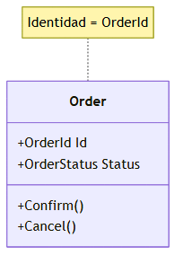

**Ejemplo:** dos pedidos con `Id = 5` en la misma BD es un error de datos — deben ser uno solo. Dos direcciones con la misma calle en pedidos distintos **no** son la misma entidad de negocio (salvo que modeles `Address` como entidad con su propio Id).

### Cuándo modelar como Entity (y cuándo no)

| Usa Entity cuando… | Considera Value Object cuando… |
|---|---|
| Necesitas identidad persistente | Igualdad por valor basta |
| El objeto tiene ciclo de vida (crear, modificar, archivar) | Es descripción medible (dinero, email) |
| Historial y auditoría por Id | Reemplazas el valor entero al cambiar |

> **Nota del instructor:** no conviertas todo en entidad con Id autoincremental. Pregunta: "¿el negocio distingue **instancias** de este concepto?"

---

## 8. Value Object (objeto valor)

### Definición formal

Un **Value Object** es un objeto que describe una característica **sin identidad propia**. Se define por el **valor** de sus atributos, es **inmutable** y dos instancias con los mismos valores son **intercambiables**.

### Explicación desarrollada

Un billete de 10€ es intercambiable por otro billete de 10€ — no te importa el número de serie para la compra. `Money(100, "EUR")` es igual a otro `Money(100, "EUR")` sin importar referencia en memoria.

**Ejemplos típicos:** `Money`, `Email`, `Address`, `DateRange`, `Percentage`, `PhoneNumber`.

```csharp
public record Money(decimal Amount, string Currency)
{
    public Money Add(Money other)
    {
        if (Currency != other.Currency)
            throw new InvalidOperationException("Currency mismatch.");
        return new Money(Amount + other.Amount, Currency);
    }
}
```

Usar `record` en C# facilita inmutabilidad e igualdad por valor.

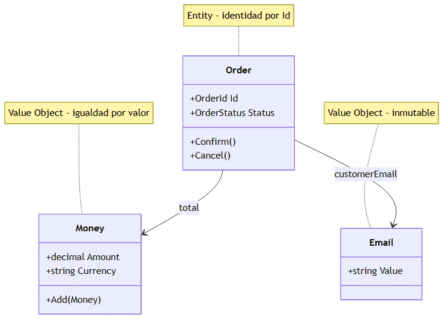

> *Fuente editable (Mermaid):* [03-entity-vo.mermaid](./assets/diagrams/03-entity-vo.mermaid)

**Por qué importa:** en lugar de pasar `decimal amount, string currency` por todo el código (primitivos obsesivos), encapsulas validación: `Money` no permite moneda vacía; `Email` valida formato en el constructor.

| Entity | Value Object |
|---|---|
| Tiene Id | No tiene Id |
| Mutable con cuidado (vía métodos) | Inmutable — cambio = nueva instancia |
| Igualdad por Id | Igualdad por valor |

### Cuándo usar Value Objects (y cuándo no)

| Usa VO cuando… | Evita VO cuando… |
|---|---|
| Validación repetida de combinaciones de campos | Necesitas rastrear historial del valor |
| Concepto del glosario es "cantidad con moneda" | Framework exige entidad ORM con Id (evalúa owned types EF) |
| Inmutabilidad reduce bugs | Overhead de 50 VOs para campos triviales sin reglas |

> **Nota del instructor:** empezar por `Money`, `Email` y `Address` como VO suele limpiar más código que añadir agregados complejos de golpe.

---

## 9. Aggregate (agregado) y Aggregate Root

### Definición formal

Un **Aggregate** (agregado) es un **cluster** de entidades y value objects con **límites de consistencia** explícitos, tratado como **una unidad** para cambios de datos. La **Aggregate Root** (raíz del agregado) es la entidad que actúa como **única puerta de entrada** al cluster; referencias externas solo apuntan a la raíz.

### Explicación desarrollada

Analogía: un **pedido** es un sobre cerrado con líneas de pedido dentro. Desde fuera solo hablas con la **portada** (la raíz `Order`). No metes la mano entre las hojas (`OrderLine`) directamente desde otro módulo — pides a `Order` que añada una línea.

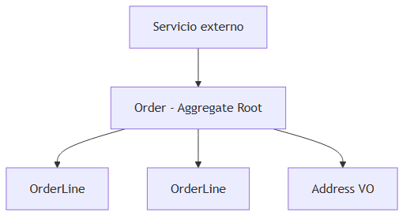

> *Fuente editable (Mermaid):* [03-aggregate.mermaid](./assets/diagrams/03-aggregate.mermaid)

### Reglas del agregado (obligatorias)

1. **Solo la raíz es referenciada desde fuera.** Otros agregados guardan `OrderId`, no referencias a `OrderLine`.
2. **Las invariantes se cumplen dentro del agregado** en cada operación pública de la raíz.
3. **Una transacción modifica un agregado** (idealmente). Si siempre necesitas modificar dos raíces en la misma transacción, revisa si el límite del agregado está mal dibujado.
4. **Tamaño pequeño.** Agregados gigantes causan contención y conflictos de concurrencia.
5. **Consistencia inmediata solo dentro del agregado.** Entre agregados, consistencia eventual vía eventos.

**Ejemplo de invariante:** "Un pedido no confirmado no puede tener líneas con cantidad cero." La raíz valida en `AddLine()` y `Confirm()`:

```csharp
public void AddLine(ProductId productId, int quantity, Money unitPrice)
{
    if (Status != OrderStatus.Draft)
        throw new InvalidOperationException("Cannot modify confirmed order.");
    if (quantity <= 0)
        throw new ArgumentException("Quantity must be positive.");
    _lines.Add(new OrderLine(productId, quantity, unitPrice));
}
```

### Cuándo definir un agregado (y anti-patrones)

| Define agregado cuando… | Red flag |
|---|---|
| Grupo de objetos debe ser consistente junto | Agregado con 30 entidades hijas |
| Negocio habla de "pedido" como unidad | Dos servicios modifican `OrderLine` directamente |
| Transacción ACID natural en un cluster | Referencias circulares entre raíces |

| Anti-patrón | Solución |
|---|---|
| Agregado gigante | Dividir; referencias por Id |
| Agregado anémico (raíz sin métodos) | Mover lógica a la raíz |

> **Nota del instructor:** cuando dudes del límite, pregunta en Event Storming: "¿qué comando afecta a qué objetos **siempre juntos**?" Ese cluster candidato es tu agregado.

---

## 10. Domain Event (evento de dominio)

### Definición formal

Un **Domain Event** es un objeto que registra algo **significativo que ya ocurrió** en el dominio, nombrado en **tiempo pasado** en lenguaje ubicuo, y que otros componentes **del mismo bounded context** (o integración) pueden consumir.

### Explicación desarrollada

"No voy a reservar stock" (comando/intención) vs "**Pedido confirmado**" (hecho ocurrido). Los eventos de dominio describen **hechos** que no se pueden negar después de ocurrir.

```csharp
public record OrderConfirmed(OrderId OrderId, DateTime OccurredAt) : IDomainEvent;
```

Flujo típico:

1. `order.Confirm()` valida reglas.
2. Cambia estado interno.
3. Registra `OrderConfirmed` en colección interna del agregado.
4. Al persistir, dispatcher publica handlers (email, proyección read model).

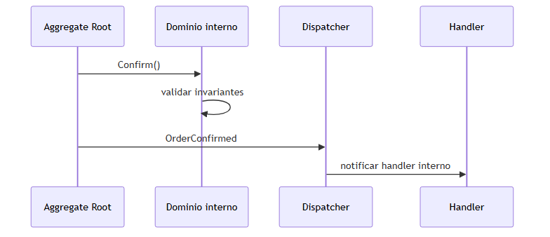

> *Fuente editable (Mermaid):* [03-domain-event.mermaid](./assets/diagrams/03-domain-event.mermaid)

**No confundir con:**

| Tipo | Alcance | Ejemplo |
|---|---|---|
| **Domain Event** | Dentro del bounded context | `OrderConfirmed` en memoria |
| **Integration Event** | Entre servicios / contextos | Mensaje JSON en Service Bus |

### Cuándo usar domain events (y cuándo no)

| Usa domain events cuando… | Evita cuando… |
|---|---|
| Otros módulos del mismo contexto reaccionan | Simple CRUD sin efectos colaterales |
| Desacoplar handlers (email, auditoría) | Event explosion — 50 eventos por click |
| Preparar publicación outbox (cap. 04) | El handler debe ser síncrono crítico para UX |

> **Nota del instructor:** nombra eventos como **hechos pasados**: `PaymentFailed`, no `ProcessPayment`.

---

## 11. Repository (repositorio)

### Definición formal

En DDD, un **Repository** simula una **colección en memoria** de **agregados**, ocultando detalles de persistencia (SQL, NoSQL, archivos). La interfaz vive en el dominio; la implementación en infraestructura.

### Explicación desarrollada

Desde el caso de uso, no piensas "hacer JOIN en tabla OrderLines". Piensas "`repository.GetById(orderId)` devuelve el **pedido completo** como agregado".

Operaciones típicas:

- `GetById(OrderId id) → Order?`
- `Add(Order order)`
- `Remove(Order order)` (poco frecuente — preferir soft delete por negocio)

```csharp
public interface IOrderRepository
{
    Task<Order?> GetByIdAsync(OrderId id, CancellationToken ct);
    Task AddAsync(Order order, CancellationToken ct);
}
```

**Importante:**

- Devuelve la **raíz del agregado** completa, no DTOs sueltos ni proyecciones parciales (eso es read model / query side).
- Un repositorio por **aggregate root**, no por cada tabla.
- No expongas `IQueryable` al dominio — filtra en infraestructura o usa specifications.

### Cuándo usar Repository (y cuándo no)

| Usa Repository cuando… | Alternativa cuando… |
|---|---|
| Persistes agregados con reglas | Lecturas complejas de reporting → queries directas (CQRS) |
| Quieres testear dominio con fake in-memory | Tabla de lookup estática sin agregado |

> **Nota del instructor:** Repository **no es** solo un wrapper de DbSet. Es un límite de lenguaje: "colección de pedidos", no "acceso a tabla Orders".

---

## 12. Domain Service (servicio de dominio)

### Definición formal

Un **Domain Service** es una operación de dominio **stateless** que **no encaja naturalmente** en una entidad o value object, expresada en **lenguaje ubicuo** y que coordina lógica entre múltiples agregados o conceptos del dominio.

### Explicación desarrollada

Si la operación "transferir dinero de cuenta A a cuenta B" no pertenece solo a `Account` ni solo a la otra, modelas `TransferService` o `FundsTransfer` como servicio de dominio. Sigue siendo **lógica de negocio**, no infraestructura.

**Domain Service vs Application Service:**

| Tipo | Responsabilidad | Ejemplo |
|---|---|---|
| **Domain Service** | Regla de negocio pura | `PricingService.CalculateDiscount(order, customerTier)` |
| **Application Service / Handler** | Orquestación, transacciones, I/O | `CreateOrderHandler` llama repo, publica evento, envía email |

**Señales de que necesitas domain service:**

- Operación involucra varias raíces sin formar un solo agregado.
- Algoritmo de dominio puro sin estado (cálculo de ruta, scoring de fraude simple).

### Cuándo usar Domain Service (y cuándo evitar)

| Usa cuando… | Evita cuando… |
|---|---|
| Lógica no pertenece a una entidad | Es CRUD que forzaste fuera de entidad anémica |
| Varios agregados participan en regla | Puedes mover método a la raíz correcta |

> **Nota del instructor:** si tu `DomainService` tiene `HttpClient`, no es de dominio — es aplicación o infraestructura.

---

## 13. Factory (fábrica de dominio)

### Definición formal

Una **Factory** (en DDD) es un mecanismo — clase, método estático o servicio — que **encapsula la creación compleja** de agregados o entidades, garantizando que nacen en un **estado válido** y cumplen invariantes desde el origen.

### Explicación desarrollada

Constructores públicos con 15 parámetros invitan a errores. `Order.Create(customerId, lines)` centraliza validación: "pedido debe tener al menos una línea", "cliente activo", etc.

```csharp
public static Order Create(CustomerId customerId, IReadOnlyList<OrderLineDraft> lines)
{
    if (!lines.Any()) throw new DomainException("Order must have lines.");
    var order = new Order(OrderId.New(), customerId);
    foreach (var line in lines)
        order.AddLine(line.ProductId, line.Quantity, line.UnitPrice);
    return order;
}
```

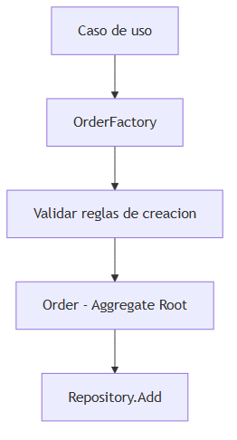

> *Fuente editable (Mermaid):* [03-factory.mermaid](./assets/diagrams/03-factory.mermaid)

**Factory vs Builder (patrón GoF):** Builder construye paso a paso objetos complejos con muchas variantes; Factory en DDD enfatiza **validez del agregado** al nacer.

### Cuándo usar Factory (y cuándo no)

| Usa Factory cuando… | Constructor simple basta cuando… |
|---|---|
| Creación con reglas de negocio | Entidad trivial, 2–3 campos |
| Varios caminos de creación (`CreateFromCart`, `CreateManual`) | Invariantes mínimas |
| Reconstitución desde BD separada de creación nueva | EF rehidrata con constructor privado + factory interna |

> **Nota del instructor:** distingue **creación nueva** (`Create`) de **reconstitución** desde persistencia (`FromPersistence`) — EF a menudo necesita ambos caminos.

---

## 14. Event Storming (taller de descubrimiento)

### Definición formal

**Event Storming** es un taller colaborativo — popularizado por Alberto Brandolini — donde expertos de dominio y desarrolladores mapean el flujo del negocio usando **post-its** (físicos o digitales) de colores estándar para descubrir eventos, comandos, agregados, políticas y actores.

### Explicación desarrollada

No es una fase opcional "para arquitectos". Es la forma más rápida de alinear equipo antes de escribir código en dominios complejos.

**Leyenda de colores típica:**

| Color | Elemento | Ejemplo |
|---|---|---|
| Naranja | **Domain Event** (pasado) | Pedido confirmado |
| Azul | **Command** (intención) | Confirmar pedido |
| Amarillo | **Aggregate** | Pedido |
| Lavanda | **Policy** (reacción) | Cuando pedido confirmado → reservar stock |
| Rosa | **External system** | Pasarela de pago |
| Pequeño amarillo | **Actor** | Cliente, Admin |

**Proceso simplificado:**

1. Brainstorm de eventos naranja en orden cronológico (timeline).
2. Identificar comandos azules que causan eventos.
3. Agrupar en agregados amarillos.
4. Añadir políticas lavanda (evento → comando en otro agregado).
5. Detectar bounded contexts cuando el vocabulario diverge.

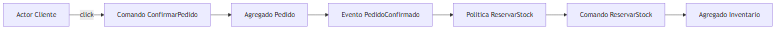

> *Fuente editable (Mermaid):* [03-event-storming.mermaid](./assets/diagrams/03-event-storming.mermaid)

**Duración típica:** medio día para un flujo; 2–3 días para un subdominio core.

### Cuándo hacer Event Storming (y cuándo no)

| Haz el taller cuando… | Puede esperar cuando… |
|---|---|
| Dominio nuevo o mal entendido | CRUD conocido de años |
| Varios equipos deben alinearse | Un dev solo, dominio trivial |
| Antes de dividir microservicios | Después de dividir mal (primero arregla mapa) |

> **Nota del instructor:** facilita alguien neutral; el dueño del producto debe estar **de pie** frente a la pared, no solo al final en email.

---

## 15. Anti-patrones en DDD

### Definición formal

Los **anti-patrones DDD** son formas recurrentes de **mal aplicar** o **simular** DDD que producen complejidad sin beneficio de modelado, o que erosionan límites de bounded context y agregados.

### Explicación desarrollada

Conocer anti-patrones te ahorra meses de refactor.

| Anti-patrón | Qué pasa | Qué hacer |
|---|---|---|
| **Big Ball of Mud** | Todo mezclado, sin límites | Event Storming; bounded contexts |
| **Anemic Domain Model** | Entidades vacías, lógica en servicios | Comportamiento en raíz y VOs |
| **Shared Database** | Varios contextos leen mismas tablas | BD por contexto o vistas controladas |
| **Agregado gigante** | Pedido con 50 entidades hijas | Dividir; referencias por Id |
| **DDD de cargo cult** | Agregados y VOs everywhere sin negocio | Clasificar subdominios; DDD donde duele |
| **Integration Event como Domain Event** | Acoplamiento entre servicios en dominio | Separar capas e outbox |
| **Ubiquitous Language solo en wiki** | Código con nombres técnicos opacos | Renombrar hacia glosario |
| **Context Map decorativo** | Diagrama desactualizado | Revisión trimestral con equipos |

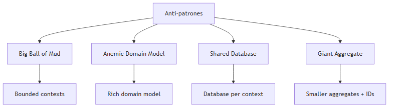

### Cuándo auditar anti-patrones

| Señal | Anti-patrón probable |
|---|---|
| Cambio en una tabla rompe 4 servicios | Shared Database |
| `OrderService` de 3000 líneas | Anemic + missing aggregates |
| No sabes quién consume un evento | Big Ball of Mud distribuido |

> **Nota del instructor:** DDD mal hecho es **peor** que capas simples bien hechas. Reduce alcance antes de abandonar el enfoque.

---

## Resumen del capítulo

- **DDD** alinea código, negocio y conversaciones mediante el **dominio** como centro.
- **Estratégico** (dónde): subdominios, **bounded contexts**, **context map** con todas las relaciones (Partnership, Shared Kernel, Customer-Supplier, Conformist, ACL, OHS, Published Language, Separate Ways).
- **Táctico** (cómo): **Entity**, **Value Object**, **Aggregate** + **Aggregate Root**, **Domain Events**, **Repository**, **Domain Service**, **Factory**.
- **Ubiquitous Language** es el pegamento — mismo vocabulario en reuniones y código.
- **Reglas de agregado:** una raíz, invariantes internas, transacción por agregado, referencias externas solo por Id.
- **Event Storming** descubre el modelo antes del código en dominios complejos.
- Evita **anti-patrones**: modelo anémico, BD compartida, agregados gigantes, DDD de fachada.

**Siguiente capítulo:** [04 — Microservicios y comunicación](./04-microservicios-comunicacion.md) — qué ocurre cuando esos bounded contexts viven en **servicios separados** y se comunican por red.
