# 05 — Servicios de Microsoft Azure

## Objetivo de este capítulo

Al terminar este capítulo podrás **nombrar, definir y relacionar** los servicios más importantes de Microsoft Azure. No se trata de memorizar nombres comerciales, sino de entender **qué problema resuelve cada servicio**, en qué capa de la nube vive y **cuándo elegirlo** frente a alternativas.

Asumimos que ya sabes programar en C#, crear APIs REST con HTTP y trabajar con bases de datos SQL. Si has desplegado una aplicación en tu propio PC o en un servidor IIS, ya tienes la base para entender por qué existen estos servicios.

Conceptos que dominarás:

- Modelos de cloud: IaaS, PaaS y SaaS.
- Compute: App Service, Functions, AKS, Container Apps, VMs.
- Datos: SQL, Cosmos DB, Redis, Blob Storage.
- Mensajería: Service Bus, Event Hubs, Event Grid.
- Identidad, red, observabilidad y DevOps en Azure.

> **Cómo leer este capítulo:** cada servicio sigue la misma estructura: definición formal → explicación con analogías → diagrama (cuando aplica) → cuándo usarlo. No te saltes las definiciones; son la base del vocabulario que usarás en equipos reales.

---

## 1. ¿Qué es Microsoft Azure?

### Definición formal

**Microsoft Azure** es una plataforma de computación en la nube pública que ofrece servicios gestionados para ejecutar aplicaciones, almacenar datos, conectar sistemas y proteger recursos, facturados por consumo (pay-as-you-go) o por reservas.

### Explicación desarrollada

Imagina que en lugar de comprar un servidor físico, instalar Windows, configurar IIS, abrir puertos en el router y hacer backups manualmente, **contratas a un proveedor** que ya tiene centros de datos, electricidad, refrigeración y personal de operaciones. Tú solo defines qué quieres ejecutar y pagas por lo que usas.

Azure organiza miles de servicios en **regiones geográficas** (por ejemplo, *West Europe*, *East US*). Una región contiene uno o más **datacenters** independientes llamados **Availability Zones** (zonas de disponibilidad). Desplegar en varias zonas protege contra fallos de un solo edificio físico.

Desde la perspectiva de un desarrollador junior, Azure responde a preguntas como:

- ¿Dónde hospedo mi API .NET sin administrar un servidor?
- ¿Dónde guardo archivos, imágenes o backups?
- ¿Cómo envío mensajes entre microservicios?
- ¿Cómo autentico usuarios sin escribir todo el sistema de login yo solo?

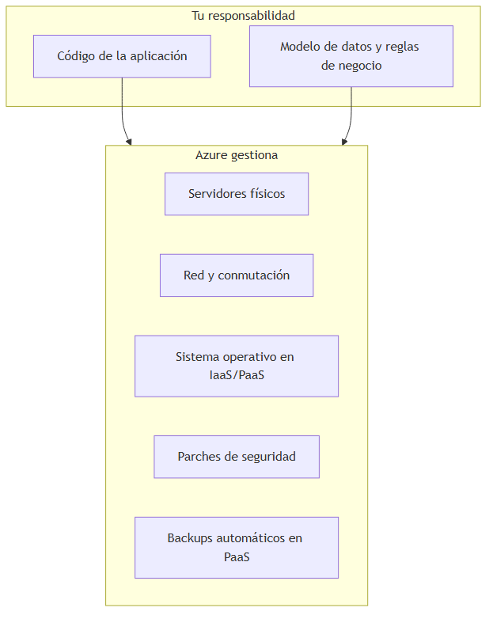

### Cuándo usar Azure (y cuándo no)

| Situación | ¿Azure? |
|---|---|
| Quieres desplegar una API sin comprar hardware | Sí |
| Necesitas cumplir normativas en regiones concretas (GDPR, etc.) | Sí — eliges región europea |
| Prototipo local que nunca saldrá de tu laptop | No necesariamente — `dotnet run` basta |
| Requisito estricto de on-premise sin internet | No — evalúa Azure Stack o infra local |

---

## 2. Modelos de servicio: IaaS, PaaS y SaaS

### Definición formal

Los **modelos de servicio cloud** describen qué capas de la pila tecnológica gestiona el proveedor (Azure) y cuáles gestiona el cliente (tú o tu equipo).

| Modelo | Nombre completo | Proveedor gestiona | Cliente gestiona |
|---|---|---|---|
| **IaaS** | Infrastructure as a Service | Hardware, virtualización, red física | SO, runtime, aplicación, datos |
| **PaaS** | Platform as a Service | Infraestructura + runtime + middleware | Aplicación y datos |
| **SaaS** | Software as a Service | Aplicación completa | Configuración, usuarios, datos propios |

### Explicación desarrollada

Piensa en **pizza**:

- **On-premise (tu casa):** compras ingredientes, amasas, horneas y sirves. Control total, trabajo total.
- **IaaS:** te entregan la cocina equipada con horno y mesa; tú haces la pizza.
- **PaaS:** te dan la cocina y un chef que prepara la base; tú solo añades ingredientes (tu código).
- **SaaS:** pides pizza a domicilio; comes, no cocinas.

En C# y ASP.NET:

- **IaaS** = Virtual Machine con Windows Server donde instalas .NET manualmente.
- **PaaS** = App Service donde subes tu DLL o contenedor y Azure configura el runtime.
- **SaaS** = Microsoft 365, Dynamics — usas la app, no despliegas código.

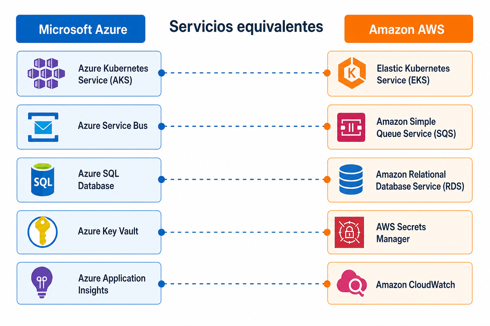

La imagen anterior muestra categorías equivalentes entre Azure y AWS. No son copias exactas, pero ayudan a ubicar servicios por función.

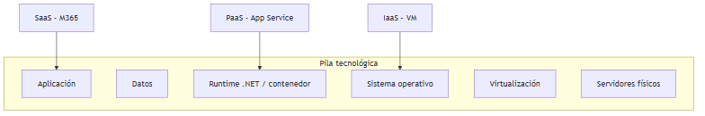

### Cuándo elegir cada modelo

| Modelo | Elige cuando… | Evita cuando… |
|---|---|---|
| **IaaS** | Necesitas control total del SO, software legacy, drivers especiales | Quieres minimizar tareas de operaciones |
| **PaaS** | Quieres desplegar APIs .NET rápido sin parchear Windows | Necesitas configuraciones de kernel muy específicas |
| **SaaS** | El producto comercial cubre tu necesidad (email, CRM) | Necesitas lógica de negocio custom extensa |

**Trade-off fundamental:** más control (IaaS) implica más responsabilidad operativa. Más abstracción (PaaS/SaaS) implica menos flexibilidad en la capa inferior.

---

## 3. Compute y contenedores

Esta sección responde: **¿dónde corre mi código en Azure?**

### 3.1 Azure App Service

#### Definición formal

**Azure App Service** es una plataforma **PaaS** para hospedar aplicaciones web, APIs REST, backends móviles y funciones web sin administrar servidores, balanceadores ni parches del sistema operativo.

#### Explicación desarrollada

Si ya has publicado una API ASP.NET Core en IIS o con `dotnet run`, App Service es el equivalente **gestionado en la nube**. Subes tu código (Git, GitHub Actions, ZIP, contenedor) y Azure:

- Asigna una URL pública (`https://mi-api.azurewebsites.net`).
- Proporciona HTTPS con certificado gestionado.
- Permite **escalar** horizontalmente (más instancias) o verticalmente (más CPU/RAM).
- Ofrece **deployment slots** (ranuras): entornos `staging` y `production` en el mismo servicio para probar antes de intercambiar tráfico.

Conceptos clave para juniors:

- **Plan de App Service:** define CPU, RAM y límites. Planes compartidos (Free/Shared) sirven para pruebas; Standard/Premium para producción.
- **Always On:** evita que la app se "duerma" por inactividad (importante para WebJobs y tareas en background).
- **Integración con Entra ID:** autenticación de usuarios sin implementar OAuth desde cero.

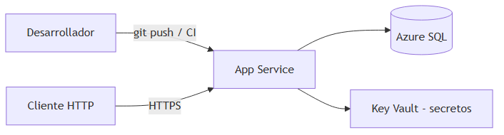

#### Cuándo usar App Service

| Usa App Service cuando… | Considera otra opción cuando… |
|---|---|
| API REST CRUD estándar en .NET | Necesitas Kubernetes, operators o Helm |
| Equipo pequeño sin experiencia en contenedores | Carga muy esporádica (evalúa Functions) |
| Quieres slots de staging integrados | Necesitas control del SO (usa VM) |

---

### 3.2 Azure Functions

#### Definición formal

**Azure Functions** es un servicio de **computación serverless** orientado a eventos: ejecuta fragmentos de código (funciones) en respuesta a **triggers** (HTTP, cola, timer, blob, etc.) sin aprovisionar servidores visibles.

#### Explicación desarrollada

**Serverless** no significa "sin servidores", sino que **no gestionas servidores**. Azure escala automáticamente y, en el plan Consumption, **puede escalar a cero** (no pagas cuando no hay ejecuciones).

Una función típica en C#:

- Se dispara cuando llega un mensaje a una cola.
- Procesa el mensaje (por ejemplo, redimensiona una imagen).
- Termina.

Conceptos importantes:

- **Trigger:** qué inicia la función (HTTP request, mensaje en Service Bus, cron con Timer).
- **Binding:** conexión declarada a otros servicios (entrada/salida de datos sin boilerplate).
- **Cold start:** la primera invocación tras inactividad puede tardar más porque Azure "despierta" el runtime.
- **Facturación Consumption:** por número de ejecuciones + GB-segundos de memoria.

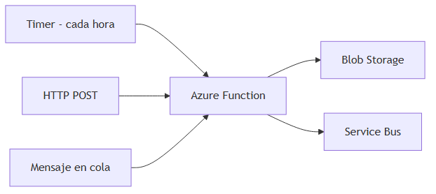

#### Cuándo usar Functions

| Usa Functions cuando… | Evita Functions cuando… |
|---|---|
| Tareas cortas (< minutos), event-driven | Proceso largo de horas (límite de timeout) |
| Webhooks, ETL ligero, procesamiento de archivos | API con tráfico constante 24/7 muy predecible (App Service puede ser más económico) |
| Escala impredecible con picos | Necesitas estado en memoria entre invocaciones (anti-patrón) |

---

### 3.3 Azure Kubernetes Service (AKS)

#### Definición formal

**Azure Kubernetes Service (AKS)** es un servicio **Kubernetes gestionado** donde Microsoft opera el **control plane** (API server, etcd, scheduler, controllers) y el cliente gestiona los **nodos worker** donde corren los contenedores.

#### Explicación desarrollada

**Kubernetes (K8s)** es un orquestador de contenedores: decide en qué máquina corre cada contenedor, los reinicia si fallan, escala réplicas y expone servicios de red. AKS elimina la parte más compleja: instalar y mantener el control plane.

Para un junior que viene de `docker run`:

- Empaquetas tu API en una **imagen Docker**.
- Defines un **Deployment** con 3 réplicas.
- Kubernetes mantiene 3 pods vivos aunque uno falle.

Integraciones típicas en Azure:

- **ACR (Azure Container Registry):** almacén privado de imágenes.
- **Azure CNI:** red de pods integrada con Virtual Network.
- **Workload Identity:** pods que obtienen tokens de Entra ID sin secretos en código.
- **Azure Monitor / Application Insights:** métricas y trazas del clúster.

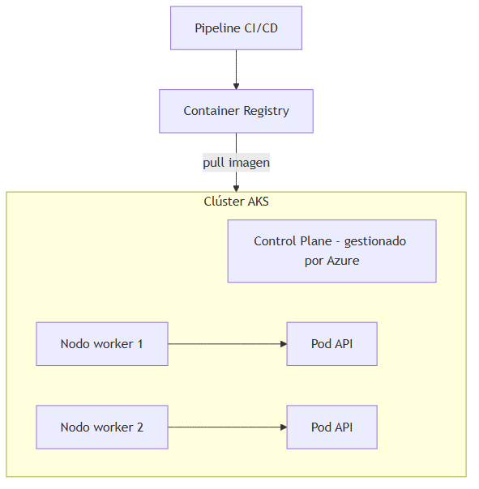

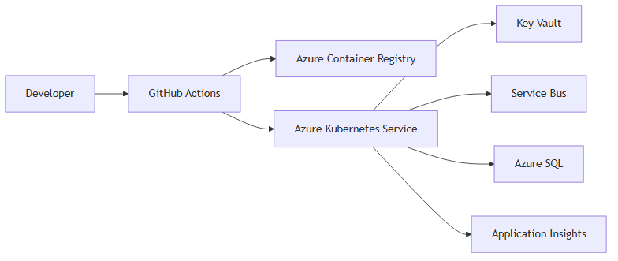

> *Fuente editable (Mermaid):* [05-azure-stack.mermaid](./assets/diagrams/05-azure-stack.mermaid)

#### Cuándo usar AKS

| Usa AKS cuando… | Considera Container Apps o App Service cuando… |
|---|---|
| Microservicios con muchos servicios e interdependencias | Tienes 1–2 APIs simples |
| Necesitas Helm, operators, GitOps (Argo CD) | El equipo no tiene capacidad de operar K8s |
| Portabilidad multicloud del manifiesto K8s es importante | Quieres escala a cero sin configurar K8s |

---

### 3.4 Azure Container Apps

#### Definición formal

**Azure Container Apps** es una plataforma **serverless para contenedores** construida sobre Kubernetes, que abstrae la complejidad del clúster y ofrece escalado automático (incluido a cero), revisiones y entrada HTTP integrada.

#### Explicación desarrollada

Container Apps ocupa el espacio intermedio entre App Service (PaaS simple) y AKS (K8s completo). Ejecutas contenedores Docker, pero no gestionas nodos, ni etcd, ni upgrades del control plane.

Características distintivas:

- **Escalado a cero:** si no hay tráfico, no pagas compute activo.
- **Revisiones:** cada despliegue crea una revisión; puedes dividir tráfico entre revisiones (similar a canary).
- **Dapr opcional:** sidecar para invocación entre servicios, pub/sub, state store (útil en microservicios).
- **Entorno (Environment):** agrupa apps que comparten red y logs.

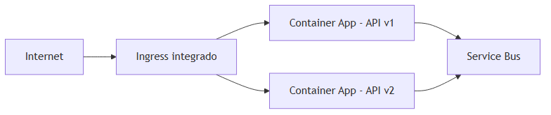

#### Cuándo usar Container Apps

| Usa Container Apps cuando… | Usa AKS cuando… |
|---|---|
| Contenedores con tráfico variable o escala a cero | Necesitas control fino de red, DaemonSets, CRDs |
| Equipo sin operadores K8s dedicados | Ya tienes ecosistema Helm/operators maduro |
| Microservicios moderados con Dapr | Cargas con requisitos de GPU, Windows nodes, etc. |

---

### 3.5 Virtual Machines y Scale Sets

#### Definición formal

**Azure Virtual Machines (VMs)** son máquinas virtuales **IaaS** con control completo del sistema operativo. **Virtual Machine Scale Sets (VMSS)** son conjuntos de VMs idénticas con autoescalado y balanceo de carga integrado.

#### Explicación desarrollada

Una VM es lo más parecido a un servidor tradicional en la nube: eliges tamaño (vCPU, RAM), SO (Windows Server, Linux), discos y abres puertos con Network Security Groups.

VMSS añade:

- **Autoescalado:** más VMs cuando sube la CPU; menos cuando baja.
- **Modelo idéntico:** misma imagen en todas las instancias (patrón cattle, no pets).

#### Cuándo usar VMs / VMSS

| Usa VMs cuando… | Prefiere PaaS cuando… |
|---|---|
| Software legacy que no containeriza fácilmente | Puedes desplegar en App Service o contenedores |
| Requisitos de SO muy específicos | Quieres parches automáticos del runtime |
| Licencias per-core que ya tienes | Minimizar tareas de sysadmin |

---

## 4. Servicios de datos

### 4.1 Azure SQL Database

#### Definición formal

**Azure SQL Database** es un motor **relacional SQL Server** ofrecido como servicio **PaaS**, compatible con T-SQL, con backups automáticos, alta disponibilidad y escalado de compute y almacenamiento independientes.

#### Explicación desarrollada

Si ya usas SQL Server o Entity Framework con SQL, Azure SQL es el camino natural a la nube. No instalas SQL Server en una VM: Azure gestiona:

- **Backups automáticos** con retención configurable.
- **Patching** de seguridad del motor.
- **Tier de servicio:** Basic, Standard, Premium, Hyperscale (para cargas muy grandes).

Conceptos para juniors:

- **DTU vs vCore:** modelos de capacidad; vCore da más control y transparencia.
- **Connection string:** igual que local, pero con firewall de Azure (debes permitir tu IP o usar Private Link).
- **Elastic Pool:** varias bases comparten recursos — útil para muchas BD pequeñas.

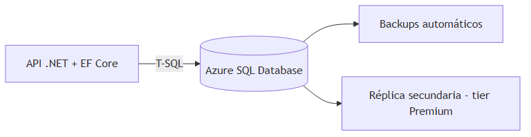

#### Cuándo usar Azure SQL

| Usa Azure SQL cuando… | Considera PostgreSQL/MySQL managed cuando… |
|---|---|
| Ecosistema Microsoft, T-SQL, EF Core | Equipo prefiere PostgreSQL open source |
| Transacciones ACID, joins complejos | — |
| Migración desde SQL Server on-premise | — |

---

### 4.2 Azure Cosmos DB

#### Definición formal

**Azure Cosmos DB** es una base de datos **NoSQL multi-modelo** (documento, clave-valor, grafo, columna) distribuida globalmente, con SLAs de latencia y niveles de consistencia configurables.

#### Explicación desarrollada

Cosmos DB no es "SQL en la nube". Está diseñada para:

- **Escala masiva** de lecturas/escrituras horizontales.
- **Distribución multi-región** con réplicas de lectura en varios continentes.
- **Latencia predecible** (p99 en single-digit ms en muchos escenarios).

Conceptos clave:

- **Partición (partition key):** decide cómo se distribuyen los datos; mala elección = cuellos de botella.
- **APIs:** puedes usar la API de MongoDB, Cassandra, Gremlin, Table o SQL (Core) según el modelo.
- **Niveles de consistencia:** desde *Strong* (como SQL single-node) hasta *Eventual* (más rendimiento, menos garantía instantánea).

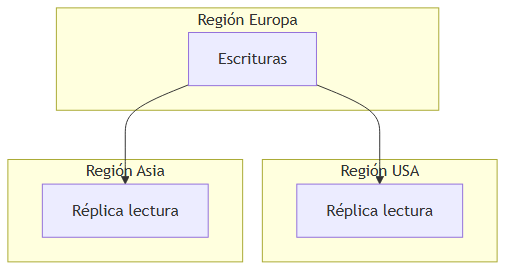

#### Cuándo usar Cosmos DB

| Usa Cosmos DB cuando… | Usa Azure SQL cuando… |
|---|---|
| App global con usuarios en varios continentes | Datos relacionales con joins complejos |
| Escala de millones de operaciones/segundo | Modelo relacional clásico basta |
| Puedes modelar datos por clave de partición | Necesitas transacciones multi-tabla ACID simples |

---

### 4.3 Azure Database for PostgreSQL / MySQL

#### Definición formal

**Azure Database for PostgreSQL** y **Azure Database for MySQL** son servicios **PaaS** que ejecutan motores open source relacionales gestionados por Azure (backups automáticos, parches de seguridad, alta disponibilidad opcional y escalado de compute/almacenamiento).

#### Explicación desarrollada

Equivalente managed a instalar PostgreSQL o MySQL en una VM, pero sin administrar el servidor. Azure opera el motor; tú defines SKU, red y parámetros.

Variantes habituales:

| Variante | Descripción |
|---|---|
| **Flexible Server** | Modelo actual recomendado; control de zona de disponibilidad, parada/arranque, réplicas de lectura |
| **Single Server** | Legado; migrar a Flexible Server en proyectos nuevos |

Conceptos para juniors:

- **Connection string** igual que on-premise, con TLS obligatorio en producción.
- **Firewall / Private Link:** la BD no debe exponerse a internet abierto; solo subnets de aplicación.
- **Extensiones PostgreSQL:** PostGIS, `uuid-ossp`, etc. — motivo frecuente para elegir PostgreSQL sobre SQL Server.

**Ejemplo de connection string (EF Core):**

```json
"ConnectionStrings": {
  "Default": "Host=myserver.postgres.database.azure.com;Database=orders;Username=app@myserver;Password=***;Ssl Mode=Require"
}
```

En C# con Npgsql o Pomelo.EntityFrameworkCore.PostgreSQL, el código de dominio no cambia; solo el proveedor y la cadena de conexión.

#### Cuándo usar PostgreSQL/MySQL managed

| Elige PostgreSQL/MySQL managed cuando… | Elige Azure SQL cuando… |
|---|---|
| Stack open source, extensiones PostgreSQL | Ecosistema Microsoft, T-SQL, Always Encrypted |
| Coste/licenciamiento SQL Server es factor | Migración directa desde SQL Server on-premise |
| Equipo con experiencia en Postgres | Reporting con herramientas SQL Server nativas |

**Recursos:** [Documentación Azure Database for PostgreSQL](https://learn.microsoft.com/azure/postgresql/) | [Comparativa Flexible Server](https://learn.microsoft.com/azure/postgresql/flexible-server/overview)

---

### 4.4 Azure Cache for Redis

#### Definición formal

**Azure Cache for Redis** es un servicio **managed** de cache en memoria compatible con el protocolo **Redis**, usado para almacenar datos temporales de acceso rápido.

#### Explicación desarrollada

Redis guarda datos en **RAM**, mucho más rápido que disco. Casos típicos:

- **Cache de consultas:** guardar resultado de `GET /products` 60 segundos.
- **Sesiones de usuario:** estado de login entre requests.
- **Rate limiting:** contador de requests por IP.
- **Pub/Sub ligero:** notificaciones en tiempo real simples.

En C# usarías `StackExchange.Redis` o `IDistributedCache`.

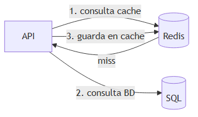

#### Cuándo usar Redis

| Usa Redis cuando… | No uses Redis como… |
|---|---|
| Lecturas repetidas de datos que cambian poco | Única base de datos persistente |
| Necesitas latencia sub-milisegundo | Almacén de archivos grandes |

---

### 4.5 Azure Blob Storage

#### Definición formal

**Azure Blob Storage** es un servicio de **almacenamiento de objetos** para archivos binarios (blobs) escalable, con tiers de coste según frecuencia de acceso.

#### Explicación desarrollada

Un **blob** es un archivo: PDF, imagen, video, backup ZIP. Se organiza en **contenedores** (como carpetas de primer nivel). Cada blob tiene una URL única.

**Tiers (niveles):**

| Tier | Uso |
|---|---|
| **Hot** | Acceso frecuente (imágenes de web activa) |
| **Cool** | Acceso ocasional (backups recientes) |
| **Archive** | Retención larga, acceso raro (cumplimiento legal) |

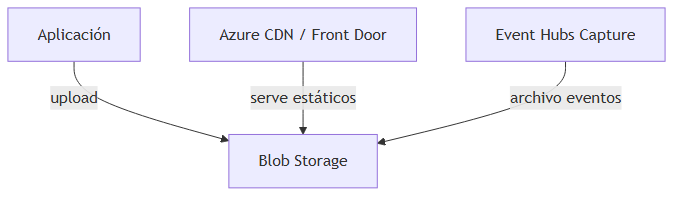

#### Cuándo usar Blob Storage

| Usa Blob cuando… | Usa SQL cuando… |
|---|---|
| Archivos, imágenes, videos, logs archivados | Datos estructurados con consultas SQL |
| Data lake, backups, artefactos de build | Relaciones entre entidades |

---

## 5. Mensajería e integración

### 5.1 Azure Service Bus

#### Definición formal

**Azure Service Bus** es un **broker de mensajes enterprise** que soporta **colas** (un consumidor por mensaje) y **topics con suscripciones** (pub/sub), con garantías de entrega, dead-lettering y opciones de orden y transacciones.

#### Explicación desarrollada

Cuando un microservicio debe **enviar un trabajo** a otro sin esperar respuesta HTTP, usa una cola. Service Bus:

- **Almacena** el mensaje hasta que un consumidor lo procese.
- **Reintenta** si el consumidor falla (visibility timeout similar a SQS).
- **Dead-letter queue (DLQ):** mensajes que fallaron repetidamente van a una cola especial para análisis.

Conceptos:

- **Cola vs Topic:** cola = un consumidor procesa cada mensaje; topic = varios suscriptores reciben copia.
- **Sesiones:** mensajes con mismo `SessionId` se procesan en orden.
- **Duplicate detection:** evita procesar el mismo mensaje dos veces (idempotencia a nivel broker).

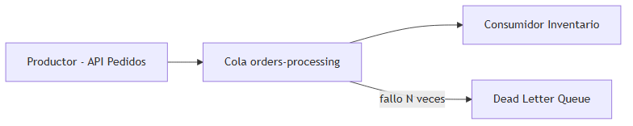

#### Cuándo usar Service Bus

| Usa Service Bus cuando… | Usa Event Hubs cuando… |
|---|---|
| Mensajes de negocio con confirmación de procesamiento | Millones de eventos/segundo (telemetría, IoT) |
| Necesitas orden parcial, transacciones, DLQ enterprise | Varios consumidores leen el mismo flujo como log |
| Integración entre microservicios con garantías | Analytics en streaming masivo |

---

### 5.2 Azure Event Hubs

#### Definición formal

**Azure Event Hubs** es un servicio de **ingesta de eventos** a gran escala que implementa un modelo de **log particionado** optimizado para millones de eventos por segundo.

#### Explicación desarrollada

Event Hubs es un "tubo" de eventos: productores escriben; múltiples **consumer groups** leen el mismo stream a ritmo independiente (como Kafka o un log de commits).

Analogía: Service Bus es una **cola de tareas** ("procesa este pedido"); Event Hubs es un **río de telemetría** ("registra cada clic, cada sensor, cada log").

Características:

- **Particiones:** paralelismo de lectura/escritura.
- **Retención:** días de eventos almacenados (no solo en tránsito).
- **Capture:** exportación automática a Blob Storage para análisis batch.

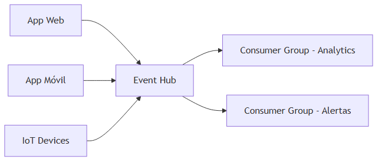

#### Cuándo usar Event Hubs

| Usa Event Hubs cuando… | Usa Service Bus cuando… |
|---|---|
| Telemetría, logs, IoT, clickstreams | Comandos de negocio ("crear factura") |
| Throughput masivo | Mensajes grandes con transacciones complejas |

---

### 5.3 Azure Event Grid

#### Definición formal

**Azure Event Grid** es un servicio de **enrutamiento de eventos** basado en **pub/sub** que conecta fuentes de eventos (recursos Azure, aplicaciones custom) con handlers (Functions, Logic Apps, webhooks).

#### Explicación desarrollada

Event Grid reacciona a **hechos** ("se creó un blob", "se eliminó una VM") y dispara acciones automáticas. Es ideal para automatización reactiva de infraestructura, no para colas de trabajo pesadas.

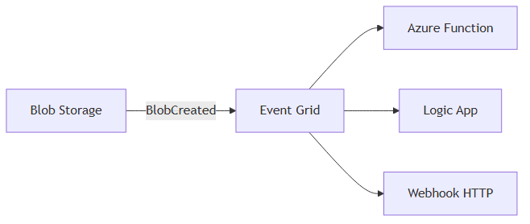

#### Cuándo usar Event Grid

| Usa Event Grid cuando… | Usa Service Bus cuando… |
|---|---|
| Reaccionar a cambios en recursos Azure | Procesamiento de negocio con reintentos y DLQ |
| Arquitectura event-driven ligera | Orden, sesiones, mensajes grandes |

---

### 5.4 Azure Logic Apps

#### Definición formal

**Azure Logic Apps** es un servicio de **orquestación de workflows** low-code con conectores predefinidos a cientos de sistemas (Office 365, Salesforce, SQL, HTTP, etc.).

#### Explicación desarrollada

Logic Apps permite integrar sistemas **con poco o ningún código**: diseñas un workflow visual o JSON con **conectores** predefinidos.

Ejemplo de flujo B2B:

1. **Trigger:** "Cuando llega un email con adjunto PDF a buzón facturas@".
2. **Acción:** Extraer PDF → guardar en Blob Storage `invoices/incoming/`.
3. **Acción:** Crear fila en SQL `Invoices` con metadata.
4. **Acción:** Publicar mensaje en Service Bus topic `invoice-received`.

Conectores útiles para backends .NET:

| Conector | Uso |
|---|---|
| HTTP / HTTP + Swagger | Llamar tu API REST |
| Azure Service Bus | Publicar/consumir mensajes |
| SQL Server / PostgreSQL | CRUD sin escribir worker |
| Office 365 / Teams | Notificaciones humanas |

**Cuándo no:** lógica con ramas complejas, tests unitarios extensos, latencia sub-100 ms — ahí un **Azure Function** o microservicio .NET es más mantenible.

#### Cuándo usar Logic Apps

| Usa Logic Apps cuando… | Escribe código custom cuando… |
|---|---|
| Integraciones B2B, flujos administrativos | Lógica compleja, tests unitarios extensos |
| Equipo mixto negocio + IT | Performance crítica en microsegundos |

---

## 6. Identidad y seguridad

### 6.1 Microsoft Entra ID (antes Azure AD)

#### Definición formal

**Microsoft Entra ID** es el servicio de **identidad y acceso** en la nube de Microsoft. Gestiona usuarios, grupos, autenticación (OAuth 2.0, OpenID Connect, SAML) y autorización de aplicaciones.

#### Explicación desarrollada

En lugar de guardar usuarios y contraseñas en tu propia tabla `Users`, delegas en Entra ID:

- **SSO (Single Sign-On):** un login para muchas apps.
- **Registro de aplicaciones:** tu API declara qué permisos expone; clientes obtienen tokens JWT.
- **Managed Identities:** identidades para recursos Azure (ver siguiente sección).

Flujo típico OAuth para API:

1. Usuario inicia sesión en portal.
2. Obtiene **access token** JWT.
3. Llama a tu API con `Authorization: Bearer <token>`.
4. API valida firma y claims del token.

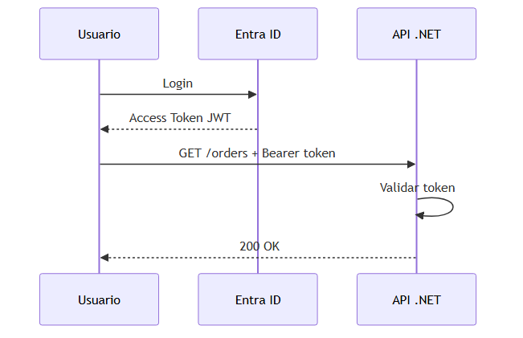

#### Cuándo usar Entra ID

| Usa Entra ID cuando… | Auth propia cuando… |
|---|---|
| Empresa ya usa Microsoft 365 / Azure | Prototipo muy aislado (aún así, considera Auth0/OIDC) |
| Necesitas SSO corporativo | — |

---

### 6.2 Azure Key Vault

#### Definición formal

**Azure Key Vault** es un servicio centralizado para almacenar de forma segura **secretos** (connection strings, API keys), **claves criptográficas** y **certificados TLS**, con control de acceso y auditoría.

#### Explicación desarrollada

**Nunca** pongas connection strings en `appsettings.json` commiteado a Git. Key Vault:

- Cifra secretos en reposo.
- Registra quién accedió.
- Permite rotación de secretos y certificados.
- Se integra con App Service, Functions, AKS via referencias o CSI driver.

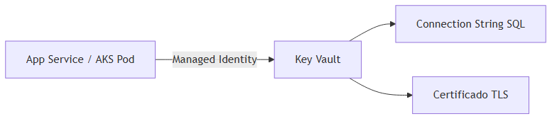

#### Cuándo usar Key Vault

Siempre en producción para secretos. En desarrollo local, `User Secrets` o variables de entorno, nunca en el repositorio.

---

### 6.3 Managed Identity

#### Definición formal

**Managed Identity** es una identidad de Entra ID **asignada automáticamente** a un recurso Azure (App Service, VM, AKS pod) que obtiene tokens de acceso **sin credenciales embebidas** en código o configuración.

#### Explicación desarrollada

Tipos:

| Tipo | Vida útil | Uso |
|---|---|---|
| **System-assigned** | Ligada al recurso; se elimina con el recurso | Un recurso, una identidad |
| **User-assigned** | Independiente; reutilizable | Varios recursos comparten identidad |

Tu código en Azure solo pregunta al metadata endpoint por un token; Azure AD valida y Key Vault entrega el secreto.

#### Cuándo usar Managed Identity

Siempre que un recurso Azure acceda a otro servicio Azure (SQL, Storage, Service Bus). Elimina el riesgo de client secrets filtrados.

---

### 6.4 Azure Private Link

#### Definición formal

**Azure Private Link** expone servicios PaaS de Azure mediante **Private Endpoints** con direcciones IP privadas dentro de tu Virtual Network, de modo que el tráfico entre aplicación y servicio **no atraviese internet público**.

#### Explicación desarrollada

Por defecto, muchos servicios PaaS (Azure SQL, Storage, Key Vault) tienen un endpoint público protegido por firewall. Eso funciona en laboratorios, pero en enterprise el requisito suele ser: "todo el tráfico permanece en red privada".

Private Link crea un **NIC privado** en tu subnet que representa al servicio PaaS. Tu API en App Service (con integración VNet) o en AKS resuelve `myserver.privatelink.database.windows.net` por IP interna.

Flujo mental:

1. Creas **Private Endpoint** en subnet `data`.
2. Deshabilitas o restringes el endpoint público del servicio.
3. DNS privado (Azure Private DNS Zone) resuelve el FQDN del servicio a la IP privada.
4. NSG controlan qué subnets pueden hablar con ese endpoint.

Casos típicos:

- API en VNet accede a SQL sin IP pública en la base de datos.
- Data exfiltration risk reducido: el servicio no es alcanzable desde internet aunque alguien filtre credenciales.

#### Cuándo usar Private Link

| Usa Private Link cuando… | Endpoint público + firewall basta cuando… |
|---|---|
| Datos sensibles, PCI, HIPAA, ISO 27001 | Prototipo, dev/test aislado |
| Política "sin tráfico a PaaS por internet" | Equipo pequeño sin VNet integrada aún |
| Arquitectura hub-spoke o landing zone enterprise | MVP con acceso restringido por IP del desarrollador |

**Recursos:** [Private Link overview](https://learn.microsoft.com/azure/private-link/private-link-overview)

---

## 7. Red y edge

### 7.1 Virtual Network (VNet)

#### Definición formal

**Azure Virtual Network** es una red privada aislada en Azure con rangos IP definidos por el cliente (CIDR), **subnets**, peering entre VNets, gateways VPN/ExpressRoute y servicios de filtrado (NSG, Azure Firewall).

#### Explicación desarrollada

Piensa en la VNet como tu **red de oficina virtual** en la nube. Todo recurso que necesita comunicación privada (VMs, AKS, App Service con integración VNet, Private Endpoints) vive dentro de una VNet o se conecta a ella.

Conceptos clave:

| Concepto | Función |
|---|---|
| **Address space** | Rango CIDR de la VNet (ej. `10.10.0.0/16`) |
| **Subnet** | Segmento dentro de la VNet (`10.10.1.0/24` para apps, `10.10.2.0/24` para datos) |
| **Peering** | Conectar dos VNets para tráfico privado (misma región o global) |
| **Service endpoints** | Acceso legacy a PaaS desde subnet (Private Link es el enfoque moderno preferido) |
| **DNS** | Resolución de nombres internos; Private DNS Zones para Private Link |

Patrón típico para APIs .NET:

- Subnet `app` → App Service integrado o nodos AKS.
- Subnet `data` → Private Endpoints hacia SQL, Storage, Key Vault.
- Subnet `gateway` → Application Gateway o Firewall.

#### Cuándo usar VNet

| Usa VNet cuando… | Sin VNet basta cuando… |
|---|---|
| AKS, Private Link, tráfico interno entre servicios | App Service público simple sin datos sensibles |
| Conectividad híbrida (on-premise ↔ Azure) | Prototipo con PaaS público y firewall por IP |
| Segmentación por capas (app / data / dmz) | Functions Consumption sin integración de red |

---

### 7.2 Network Security Groups (NSG)

#### Definición formal

Un **Network Security Group (NSG)** es un firewall con estado que aplica reglas de **permitir/denegar** tráfico por puerto, protocolo, dirección y prioridad, asociado a subnets o interfaces de red (NIC).

#### Explicación desarrollada

Los NSG son la primera línea de defensa en red dentro de Azure. Cada regla tiene **prioridad** (número menor = más prioritaria) y se evalúa en orden hasta coincidencia.

Ejemplo mental para una API en subnet `app`:

| Prioridad | Dirección | Puerto | Origen | Acción |
|---|---|---|---|---|
| 100 | Inbound | 443 | Application Gateway subnet | Allow |
| 200 | Inbound | * | Internet | Deny |
| 100 | Outbound | 5432 | subnet `data` | Allow (hacia SQL via Private Link) |

Diferencia con firewall de aplicación (WAF): NSG opera en **capa 3–4** (IP, puerto); WAF inspecciona HTTP (capa 7).

Buenas prácticas:

- Principio de mínimo privilegio: solo puertos necesarios.
- No abrir RDP/SSH desde `0.0.0.0/0` en producción.
- Combinar NSG con Private Link para que datos nunca salgan a internet.

#### Cuándo usar NSG

Siempre que tengas VNet. Sin NSG explícitos, Azure aplica reglas por defecto que pueden ser demasiado permisivas para producción.

---

### 7.3 Application Gateway

#### Definición formal

**Application Gateway** es un balanceador de carga **Layer 7 (HTTP/HTTPS)** regional con enrutamiento por URL/path, terminación SSL/TLS, afinidad de sesión, autoscaling y **WAF (Web Application Firewall)** opcional integrado.

#### Explicación desarrollada

Si tu API .NET recibe tráfico HTTPS desde internet, algo debe terminar TLS y distribuir requests entre instancias. Application Gateway cumple ese rol **dentro de una región** y **integrado con VNet**.

Componentes:

| Componente | Rol |
|---|---|
| **Frontend IP** | IP pública o privada que recibe tráfico |
| **Listener** | Puerto 443, certificado TLS, protocolo |
| **Routing rule** | `if path starts with /api/orders` → backend pool Orders |
| **Backend pool** | IPs de VMs, App Service, AKS ingress |
| **Health probe** | `GET /health` cada N segundos; quita instancias unhealthy |
| **WAF** | Reglas OWASP contra SQLi, XSS, bots |

Ejemplo de enrutamiento:

- `https://api.tienda.com/catalog/*` → pool Catalog (3 instancias App Service).
- `https://api.tienda.com/orders/*` → pool Orders.

En AKS suele combinarse con **Ingress Controller** (AGIC) que configura Application Gateway automáticamente desde recursos Ingress de Kubernetes.

#### Cuándo usar Application Gateway

| Usa Application Gateway cuando… | Considera Front Door cuando… |
|---|---|
| Tráfico regional en una VNet | Usuarios globales en múltiples regiones |
| WAF regional con integración VNet profunda | CDN + anycast + failover multi-región |
| Path-based routing hacia microservicios | Optimizar latencia mundial con edge |

---

### 7.4 Azure Front Door

#### Definición formal

**Azure Front Door** es un servicio global de **CDN + balanceo anycast + WAF** que enruta usuarios al endpoint más cercano o saludable en múltiples regiones.

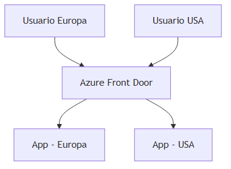

#### Cuándo usar Front Door vs Application Gateway

| Front Door | Application Gateway |
|---|---|
| Tráfico global, multi-región | Tráfico regional dentro de una VNet |
| CDN y WAF global | WAF regional, integración VNet profunda |

---

### 7.5 Azure DNS

#### Definición formal

**Azure DNS** es un servicio de hospedaje de **zonas DNS** autoritativas que permite crear y gestionar registros (A, AAAA, CNAME, MX, TXT, SRV) con integración nativa a otros recursos Azure.

#### Explicación desarrollada

Cuando un usuario escribe `api.miempresa.com`, un resolver DNS consulta la **zona autoritativa**. Azure DNS hospeda esa zona si delegas el dominio desde tu registrador (GoDaddy, Cloudflare, etc.).

Registros frecuentes en despliegues .NET:

| Registro | Ejemplo | Uso |
|---|---|---|
| **A** | `api` → IP de Application Gateway | API pública |
| **CNAME** | `www` → `myapp.azurewebsites.net` | Alias a App Service |
| **TXT** | verificación dominio, SPF email | Validación Entra ID, correo |
| **Private DNS Zone** | `privatelink.database.windows.net` | Resolver Private Link internamente |

Azure DNS no es un CDN ni un proxy: solo **resuelve nombres a direcciones**. El tráfico HTTP lo manejan App Gateway, Front Door o Ingress.

#### Cuándo usar Azure DNS

| Usa Azure DNS cuando… | Mantén DNS en otro proveedor cuando… |
|---|---|
| Quieres IaC completo en Azure (Bicep/Terraform) | Ya usas Cloudflare con proxy/WAF global |
| Private DNS Zones para Private Link | Política corporativa fija otro DNS |
| Integración simple con recursos Azure | Necesitas features avanzadas del registrador |

**Recursos:** [Azure DNS overview](https://learn.microsoft.com/azure/dns/dns-overview)

---

## 8. Observabilidad

### 8.1 Azure Monitor

#### Definición formal

**Azure Monitor** es la plataforma unificada de **telemetría operativa** en Azure que recopila **métricas** (series temporales numéricas), **logs** (datos de texto estructurados) y **trazas** (distribuidas vía Application Insights/OpenTelemetry), y permite definir **alertas** y **autoscale**.

#### Explicación desarrollada

Azure Monitor es el "sistema nervioso" de tu suscripción. Casi todo recurso Azure emite métricas automáticamente: CPU de VM, RPS de App Service, mensajes en Service Bus, latencia de SQL.

Tres pilares dentro del ecosistema:

| Pilar | Qué almacena | Ejemplo de consulta |
|---|---|---|
| **Metrics** | Números agregados cada 1–5 min | CPU > 80 % durante 10 min |
| **Logs** | Eventos detallados en Log Analytics | `requests | where resultCode == 500` |
| **Alerts** | Reglas que disparan acción | Email, webhook, runbook, scale out |

Flujo típico para una API .NET:

1. Application Insights SDK envía requests, dependencias y excepciones.
2. Datos aterrizan en Log Analytics Workspace.
3. Alerta KQL detecta pico de errores 5xx.
4. Action Group notifica al equipo on-call.

Métricas de plataforma vs aplicación:

- **Plataforma:** `Percentage CPU` de App Service — infraestructura.
- **Aplicación:** `requests/duration` p95 — experiencia del usuario.

#### Cuándo usar Azure Monitor

| Usa Azure Monitor cuando… | No es suficiente solo cuando… |
|---|---|
| Operas cualquier recurso en Azure | Necesitas APM profundo sin instrumentar código (aun así, añade App Insights) |
| Quieres alertas y dashboards centralizados | Requieres SIEM enterprise (envía logs a Sentinel) |

**Recursos:** [Azure Monitor overview](https://learn.microsoft.com/azure/azure-monitor/overview)

---

### 8.2 Application Insights

#### Definición formal

**Application Insights** es el componente de **APM (Application Performance Monitoring)** dentro de Azure Monitor: requests HTTP, dependencias (SQL, HTTP externos), excepciones, trazas distribuidas y mapa de servicios.

#### Explicación desarrollada

En ASP.NET Core añades el SDK NuGet; automáticamente registras cada request, llamadas a SQL y errores. Con **correlation ID** (capítulo 04) puedes seguir una petición entre microservicios.

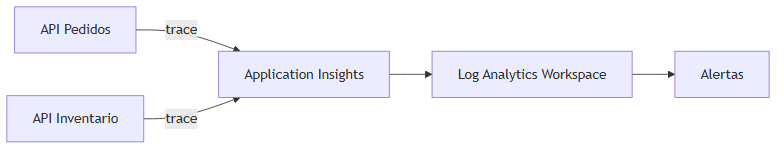

---

### 8.3 Log Analytics Workspace

#### Definición formal

Un **Log Analytics Workspace** es el repositorio centralizado donde Azure Monitor almacena **logs de consulta**, indexados para búsqueda con **KQL (Kusto Query Language)**.

#### Explicación desarrollada

Piensa en el Workspace como una **base de datos de eventos operativos**. Application Insights, diagnósticos de AKS, logs de Azure Firewall y custom logs via Data Collection Rule convergen aquí.

**Ejemplo KQL** — errores HTTP en la última hora:

```kusto
requests
| where timestamp > ago(1h)
| where success == false
| summarize count() by name, resultCode
| order by count_ desc
```

Tablas comunes para desarrolladores .NET:

| Tabla | Contenido |
|---|---|
| `requests` | Cada HTTP request a tu API |
| `dependencies` | Llamadas a SQL, HTTP externos, Service Bus |
| `exceptions` | Stack traces no manejados |
| `traces` | `ILogger` y mensajes custom |
| `ContainerLog` | stdout/stderr de pods AKS |

Retención y coste dependen del plan (pay-as-you-go por GB ingerido). En producción define **retention** y **sampling** para controlar gasto.

#### Cuándo usar Log Analytics

Siempre que uses Application Insights o centralices logs de infraestructura. Un workspace por entorno (`prod`, `staging`) es un patrón habitual.

**Recursos:** [KQL quick reference](https://learn.microsoft.com/azure/data-explorer/kusto/query/)

---

## 9. DevOps e infraestructura en Azure

### 9.1 Azure Container Registry (ACR)

#### Definición formal

**Azure Container Registry (ACR)** es un registro **privado** de imágenes de contenedor compatibles con OCI/Docker, con autenticación integrada, geo-replicación, escaneo de vulnerabilidades y webhooks para CI/CD.

#### Explicación desarrollada

ACR almacena las imágenes que construyes en el capítulo 07 (`docker push`). AKS, Container Apps y App Service (modo contenedor) hacen **pull** desde ACR al desplegar.

Conceptos:

| Concepto | Ejemplo |
|---|---|
| **Login server** | `myacr.azurecr.io` |
| **Repository** | `orders-api` |
| **Tag** | `v1.2.0`, `build-456` |
| **SKU** | Basic (lab), Standard (webhooks), Premium (geo-replica, private link) |

Flujo CI/CD típico:

```bash
az acr login --name myacr
docker build -t myacr.azurecr.io/orders-api:$GITHUB_SHA .
docker push myacr.azurecr.io/orders-api:$GITHUB_SHA
# Pipeline despliega tag en AKS/ACA
```

Integración con identidad: AKS puede hacer pull con **Managed Identity** (AcrPull) sin admin user ni password en el clúster.

#### Cuándo usar ACR

| Usa ACR cuando… | Docker Hub público basta cuando… |
|---|---|
| Imágenes propietarias .NET en Azure | Solo imágenes base open source en dev |
| AKS, ACA, App Service contenedor | Prototipo local sin cloud |
| Escaneo CVE y políticas de retención | — |

**Recursos:** [ACR documentation](https://learn.microsoft.com/azure/container-registry/)

---

### 9.2 Azure DevOps

#### Definición formal

**Azure DevOps** es la suite de colaboración de Microsoft para desarrollo de software que incluye **Azure Repos** (Git), **Pipelines** (CI/CD YAML), **Boards** (work items/Kanban), **Test Plans** y **Artifacts** (paquetes NuGet/npm).

#### Explicación desarrollada

Equivalente al ecosistema GitHub dentro de Azure/Microsoft 365. Muchas empresas con contrato enterprise usan Azure DevOps aunque el código sea similar a GitHub Actions.

**Pipeline YAML** ejemplo simplificado (.NET + Docker + AKS):

```yaml
trigger:
  branches: [ main ]

stages:
  - stage: Build
    jobs:
      - job: CI
        steps:
          - task: DotNetCoreCLI@2
            inputs:
              command: publish
              projects: Orders.Api/Orders.Api.csproj
          - task: Docker@2
            inputs:
              command: buildAndPush
              repository: orders-api
              containerRegistry: myacr-connection
              tags: $(Build.BuildId)
  - stage: Deploy
    jobs:
      - deployment: AKS
        environment: production
        strategy:
          runOnce:
            deploy:
              steps:
                - task: KubernetesManifest@1
                  inputs:
                    action: deploy
                    manifests: k8s/deployment.yaml
```

Ventajas vs GitHub Actions: integración con Boards, permisos enterprise AD, agentes self-hosted en VNet.

#### Cuándo usar Azure DevOps

| Usa Azure DevOps cuando… | Usa GitHub Actions cuando… |
|---|---|
| Organización ya estandarizó Azure DevOps | Repos en GitHub, open source, ecosistema Actions |
| Requieres Boards + Pipelines unificados | OIDC federado simple con Azure ya configurado |
| Agentes en red privada sin salida a internet | — |

**Recursos:** [Azure Pipelines docs](https://learn.microsoft.com/azure/devops/pipelines/)

---

### 9.3 Bicep y ARM Templates

#### Definición formal

**ARM (Azure Resource Manager)** es la capa de API y despliegue declarativo de recursos Azure. **Bicep** es un lenguaje **domain-specific** que compila a ARM JSON, diseñado para **Infraestructura como Código (IaC)** nativa con sintaxis legible.

#### Explicación desarrollada

En lugar de crear recursos a mano en el portal (no reproducible), defines infraestructura en archivos versionados en Git.

**Ejemplo Bicep** — App Service + plan:

```bicep
param location string = resourceGroup().location
param appName string = 'orders-api-prod'

resource plan 'Microsoft.Web/serverfarms@2022-09-01' = {
  name: '${appName}-plan'
  location: location
  sku: { name: 'P1v3', tier: 'PremiumV3' }
}

resource app 'Microsoft.Web/sites@2022-09-01' = {
  name: appName
  location: location
  properties: { serverFarmId: plan.id }
}
```

Despliegue:

```bash
az deployment group create -g my-rg -f main.bicep
```

Comparación con otras herramientas:

| Herramienta | Alcance |
|---|---|
| **Bicep/ARM** | Nativo Azure, día 0 de features |
| **Terraform** | Multicloud, estado remoto, HCL |
| **Pulumi** | IaC con C#/TypeScript real |

#### Cuándo usar Bicep

| Usa Bicep cuando… | Usa Terraform cuando… |
|---|---|
| Solo Azure, equipo Microsoft | Multicloud AKS + EKS + on-prem |
| Quieres tipado y módulos nativos | Ya tienes módulos Terraform maduros |

**Recursos:** [Bicep documentation](https://learn.microsoft.com/azure/azure-resource-manager/bicep/)

---

### 9.4 GitHub Actions con OIDC federado

#### Definición formal

**OIDC federation** (OpenID Connect) permite que un workflow de GitHub Actions obtenga un token de identidad de GitHub y **asuma un rol/app registration** en Microsoft Entra ID para desplegar en Azure **sin client secrets de larga duración** almacenados en GitHub Secrets.

#### Explicación desarrollada

El anti-patrón: guardar `AZURE_CLIENT_SECRET` en GitHub y rotarlo manualmente cada año. El patrón moderno:

1. Creas **App Registration** / **federated credential** que confía en el issuer `token.actions.githubusercontent.com` y el repo `org/repo`.
2. El workflow solicita `id-token: write`.
3. `azure/login@v2` intercambia el token OIDC por credenciales temporales de Azure.
4. Pasos siguientes ejecutan `az deployment`, `kubectl`, `docker push` a ACR.

**Ejemplo workflow (fragmento):**

```yaml
permissions:
  id-token: write
  contents: read

jobs:
  deploy:
    runs-on: ubuntu-latest
    steps:
      - uses: azure/login@v2
        with:
          client-id: ${{ secrets.AZURE_CLIENT_ID }}
          tenant-id: ${{ secrets.AZURE_TENANT_ID }}
          subscription-id: ${{ secrets.AZURE_SUBSCRIPTION_ID }}
      - run: az acr login --name myacr && az aks get-credentials -g rg -n cluster
```

Beneficios: credenciales de corta duración, auditoría en Entra ID, menos fugas de secretos.

#### Cuándo usar OIDC federado

Siempre en pipelines GitHub → Azure en producción. Client secrets solo en migraciones legacy o herramientas sin soporte OIDC.

**Recursos:** [GitHub Actions Azure OIDC](https://learn.microsoft.com/azure/developer/github/connect-from-azure)

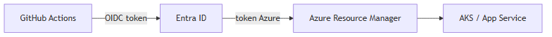

---

## 10. Diagrama: stack típico con AKS

Este diagrama resume cómo encajan servicios en un despliegue microservicios típico en Azure:


> *Fuente editable (Mermaid):* [05-azure-stack.mermaid](./assets/diagrams/05-azure-stack.mermaid)

**Lectura del flujo:**

1. Desarrollador hace commit; GitHub Actions compila y construye imagen Docker.
2. Imagen se publica en ACR.
3. Pipeline despliega en AKS (kubectl, Helm o GitOps).
4. Pods usan Managed Identity para leer secretos de Key Vault.
5. Microservicios se comunican via Service Bus.
6. Datos transaccionales en Azure SQL.
7. Trazas y métricas en Application Insights.

---

## 11. Resumen del capítulo

- **Azure** es una plataforma cloud con servicios por capas **IaaS, PaaS y SaaS**; más abstracción = menos operaciones, menos control fino.
- **Compute:** App Service para APIs simples; Functions para eventos cortos; AKS para orquestación completa; Container Apps como punto medio serverless.
- **Datos:** Azure SQL para relacional ACID; Cosmos DB para escala global NoSQL; Redis para cache; Blob para archivos.
- **Mensajería:** Service Bus para colas de negocio; Event Hubs para streaming masivo; Event Grid para reaccionar a eventos de infraestructura.
- **Seguridad:** Entra ID para identidad; Key Vault para secretos; Managed Identity para eliminar credenciales en código; Private Link para red privada.
- **Observabilidad:** Application Insights + Log Analytics + alertas forman la base para operar en producción.
- **DevOps:** ACR + pipelines (GitHub Actions / Azure DevOps) + Bicep para reproducibilidad.

**Siguiente paso:** capítulo 06 — los servicios equivalentes en **Amazon Web Services (AWS)** y cómo compararlos con lo que acabas de aprender en Azure.
