# 10 — Observabilidad

## Objetivo de este capítulo

Al terminar este capítulo podrás **definir, distinguir e implementar mentalmente** los conceptos fundamentales de observabilidad en sistemas modernos. No se trata de memorizar nombres de herramientas (Grafana, Prometheus, Jaeger), sino de entender **qué problema resuelve cada señal**, cómo se relacionan entre sí y **cuándo aplicar cada práctica** en un entorno de producción real.

Asumimos que ya sabes programar APIs REST, usar logs básicos (`Console.WriteLine`, Serilog, ILogger) y desplegar aplicaciones. Si has depurado un error en un solo servidor con un stack trace, ya tienes la base para entender por qué ese enfoque **no escala** cuando hay decenas de servicios hablando entre sí.

Conceptos que dominarás:

- Observabilidad vs monitorización tradicional.
- Los tres pilares: métricas, logs y trazas.
- Tipos de métricas: counter, gauge, histogram.
- Logging estructurado y propagación de contexto.
- Trazas distribuidas: trace, span, context propagation.
- OpenTelemetry como estándar de instrumentación.
- SLI, SLO, SLA y error budget con ejemplo numérico.
- Golden Signals, sampling (head vs tail) y correlación de señales.
- Fatiga de alertas y cómo evitarla.

> **Cómo leer este capítulo:** cada concepto mayor sigue la misma estructura: definición formal → explicación desarrollada → diagrama → cuándo usarlo. No te saltes las definiciones; son el vocabulario que usarás en equipos de operaciones, SRE y desarrollo backend.

---

## 1. Introducción: el problema de los sistemas que no puedes "ver"

Imagina que eres el desarrollador de turno un viernes por la tarde. Llega un aviso: "Los usuarios reportan lentitud al crear pedidos." Abres la consola del servidor… pero ya no hay **un** servidor. Hay cinco microservicios, un API Gateway, una base de datos por servicio, colas de mensajes y un clúster de Kubernetes con pods que se reinician solos.

La pregunta ya no es "¿qué línea de código falló?" sino:

- ¿En qué servicio empezó el problema?
- ¿Es un fallo de red, de base de datos o de lógica de negocio?
- ¿Afecta a todos los usuarios o solo a un segmento?
- ¿Empezó tras un despliegue hace veinte minutos?

Sin las herramientas y prácticas correctas, depurar esto es adivinar. Con **observabilidad**, tienes un mapa. Este capítulo te enseña a construir y usar ese mapa.

---

## 2. ¿Qué es la observabilidad?

### Definición formal

**Observabilidad** es la capacidad de inferir el **estado interno** de un sistema a partir de sus **salidas externas** — es decir, a partir de los datos que el sistema emite mientras funciona: métricas, logs y trazas.

El término proviene de la **teoría de control** en ingeniería: un sistema es "observable" si, conociendo sus salidas a lo largo del tiempo, puedes deducir qué está ocurriendo dentro sin abrirlo como un reloj mecánico.

### Explicación desarrollada

Cuando desarrollas en local, el debugger es tu observabilidad: pausas la ejecución, inspeccionas variables, avanzas paso a paso. En producción, no puedes conectar un debugger a cada pod de Kubernetes. Lo que sí puedes hacer es **instrumentar** tu código para que emita señales externas que describan su comportamiento.

La observabilidad no es un producto que compras; es una **propiedad del sistema** más la **disciplina del equipo** para instrumentarlo, almacenar señales y usarlas para investigar. Un sistema mal instrumentado con Grafana instalado sigue siendo una caja negra con dashboards bonitos.

La diferencia clave con la monitorización tradicional (que veremos en la siguiente sección) es que la observabilidad te permite responder preguntas **que no anticipaste** cuando diseñaste los dashboards. "¿Por qué el percentil 99 de latencia se duplicó solo para usuarios de la región X que usan la versión 2.3 del cliente?" — esa pregunta requiere explorar datos con alta cardinalidad, no solo mirar un umbral fijo de CPU.

### Diagrama

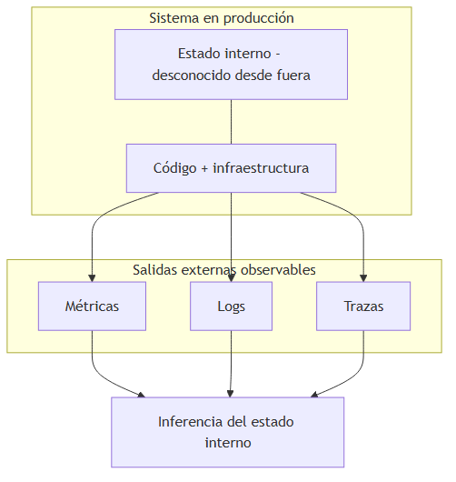

### Cuándo usar / Cuándo no

| Situación | ¿Observabilidad completa? |
|---|---|
| API en producción con usuarios reales | Sí — imprescindible |
| Prototipo local de un solo desarrollador | Mínima — logs en consola pueden bastar |
| Sistema crítico con SLA contractual | Sí — con SLI/SLO definidos y alertas basadas en SLO |
| Script batch que corre una vez al mes | Observabilidad ligera — log de ejecución y notificación de fallo |

> **Nota del instructor:** Muchos juniors confunden "tener Grafana" con "tener observabilidad". Grafana es una herramienta de visualización; la observabilidad existe cuando tu código **emite señales útiles**, cuando esas señales se **almacenan con contexto suficiente** y cuando tu equipo **sabe interpretarlas** bajo presión de un incidente.

---

## 3. Observabilidad vs monitorización

### Definición formal

**Monitorización tradicional** es la práctica de vigilar métricas **predefinidas** y disparar alertas cuando superan umbrales conocidos. **Observabilidad** extiende esa capacidad permitiendo **explorar comportamiento no anticipado** mediante consultas ad-hoc sobre métricas, logs y trazas con alta cardinalidad.

### Explicación desarrollada

Esta distinción confunde a muchos juniors porque suenan parecido. Piénsalo con una analogía médica:

- **Monitorización** es el termómetro y la tensión arterial que el médico mide en cada consulta. Si la fiebre supera 38 °C, suena la alarma. Funciona para condiciones **conocidas**.
- **Observabilidad** es la capacidad de hacer análisis de laboratorio, radiografías y exploraciones cuando el paciente presenta síntomas **nuevos** que no encajan en los protocolos habituales.

En sistemas de software:

| Aspecto | Monitorización tradicional | Observabilidad |
|---|---|---|
| **Enfoque** | Vigilar métricas predefinidas y alertas sobre umbrales conocidos | Explorar comportamiento no anticipado con consultas ad-hoc |
| **Pregunta típica** | "¿Superamos el 80 % de CPU?" | "¿Por qué el p99 de latencia se duplicó solo para tenant X?" |
| **Datos** | Agregados, baja cardinalidad | Alta cardinalidad (por usuario, tenant, endpoint, versión) |
| **Cuándo brilla** | Incidentes conocidos, dashboards operativos | Incidentes nuevos, debugging profundo, post-mortems |

**Monitorización** responde: "¿Está roto lo que ya sé que debo vigilar?"

**Observabilidad** responde: "¿Qué está pasando que **no** anticipé?"

En la práctica, ambas conviven. Necesitas dashboards y alertas (monitorización) **y** la capacidad de investigar lo desconocido (observabilidad). No son opuestos; son capas complementarias.

### Diagrama

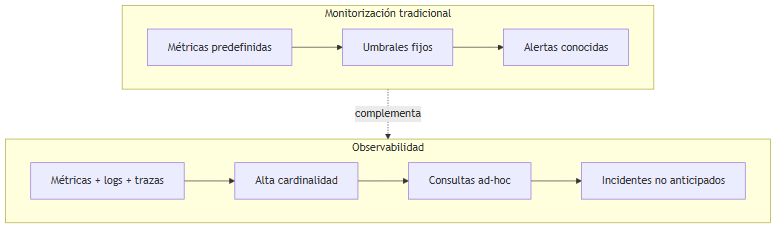

> *Fuente editable (Mermaid):* [09-monitoring-vs-observability.mermaid](./assets/diagrams/09-monitoring-vs-observability.mermaid)

### Cuándo usar / Cuándo no

| Enfoque | Elige cuando… | Evita depender solo de esto cuando… |
|---|---|---|
| **Monitorización** | Tienes SLIs claros y quieres alertas automáticas sobre condiciones conocidas | Los incidentes son impredecibles o requieren debugging profundo |
| **Observabilidad** | Necesitas investigar causas raíz en sistemas distribuidos | El sistema es trivial (un solo proceso, un solo log file) |

> **Nota del instructor:** Un error clásico es instalar Prometheus y Grafana el día del despliegue a producción sin haber instrumentado el código. Las herramientas sin señales son pantallas vacías. Instrumenta **antes** de desplegar; las herramientas vienen después.

---

## 4. Los tres pilares de la observabilidad

### Definición formal

Los **tres pilares de la observabilidad** son **métricas**, **logs** y **trazas** — tres tipos de señales complementarias que, correlacionadas, permiten entender el comportamiento de un sistema en producción.

### Explicación desarrollada

La comunidad SRE (Site Reliability Engineering) popularizó esta metáfora. Cada pilar captura una dimensión distinta del comportamiento del sistema:

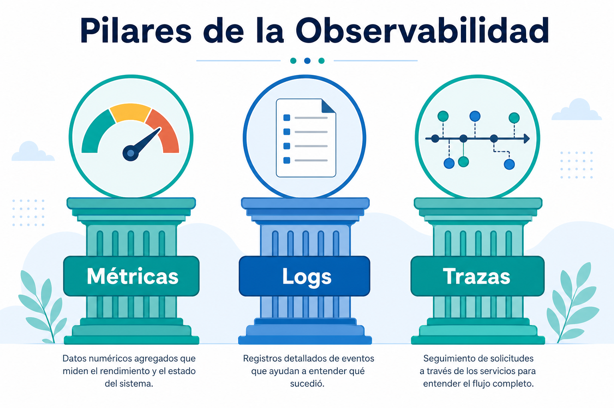

- **Métricas:** números agregados en el tiempo. Responden "¿cuánto?" y "¿con qué frecuencia?" con bajo coste de almacenamiento. Ejemplo: requests por segundo, porcentaje de errores, latencia p95.
- **Logs:** eventos discretos con timestamp y contexto. Responden "¿qué pasó exactamente en este momento?" con alto detalle pero alto volumen. Ejemplo: "OrderId=456 falló por timeout de BD a las 10:00:02".
- **Trazas:** el camino de una solicitud a través de múltiples servicios. Responden "¿por dónde pasó esta request y dónde se demoró?" Ejemplo: Gateway → Servicio A → Servicio B → Base de datos, con duración de cada salto.

Ningún pilar sustituye a los otros. Las métricas te dan la vista de pájaro; los logs te dan el detalle de eventos concretos; las trazas te muestran el camino distribuido. La magia ocurre cuando **correlacionas** los tres — veremos eso en la sección 14.

### Diagrama

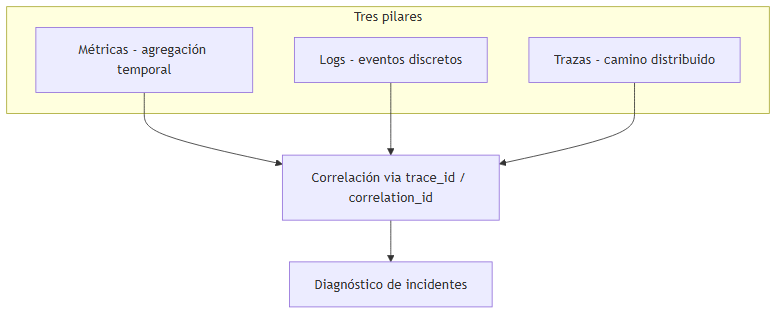

### Cuándo usar / Cuándo no

| Pilar | Usa cuando… | No uses solo esto cuando… |
|---|---|---|
| **Métricas** | Necesitas dashboards, alertas y tendencias históricas | Necesitas saber qué request concreto falló |
| **Logs** | Necesitas detalle de un evento específico | Necesitas ver el panorama entre servicios |
| **Trazas** | Necesitas seguir una solicitud entre microservicios | El sistema es un monolito sin llamadas externas |

> **Nota del instructor:** La imagen de los tres pilares es un mapa mental, no una checklist de compras. Empieza instrumentando lo mínimo en los tres; luego profundiza según los incidentes que enfrentes.

---

## 5. Pilar 1: Métricas — tipos Counter, Gauge e Histogram

### Definición formal

Una **métrica** es una medida numérica agregada en el tiempo que describe algún aspecto del comportamiento o estado del sistema. En el modelo de Prometheus (adoptado ampliamente), existen cuatro tipos principales; los tres más usados son **Counter**, **Gauge** e **Histogram**.

### Explicación desarrollada

Las métricas son la señal más barata de almacenar y la más rápida de consultar. Por eso son la base de dashboards y alertas. Pero no todas las métricas se comportan igual; elegir el tipo incorrecto produce datos engañosos.

#### Counter (contador)

Un **Counter** solo **incrementa** (nunca baja, salvo reset al reiniciar el proceso). Representa una cantidad acumulada de eventos.

Ejemplos concretos:

```
http_requests_total{method="GET", status="200"}  →  incrementa +1 por cada request exitoso
orders_created_total                             →  incrementa +1 por cada pedido creado
exceptions_total{type="NullReference"}           →  incrementa +1 por cada excepción
```

Para obtener "requests por segundo", no lees el counter directamente: calculas la **tasa** (rate) sobre una ventana de tiempo:

```
rate(http_requests_total[5m])  →  requests/segundo en los últimos 5 minutos
```

#### Gauge (medidor)

Un **Gauge** sube y baja libremente. Representa un valor **instantáneo** en un momento dado.

Ejemplos concretos:

```
memory_usage_bytes{pod="api-7f3a"}     →  512000000 (512 MB ahora)
active_connections{pool="db"}          →  47 conexiones abiertas
queue_depth{queue="orders"}            →  123 mensajes pendientes
temperature_celsius{rack="A1"}         →  23.5 °C
```

Si tu servicio expone "usuarios conectados ahora", es un Gauge. Si expone "total de usuarios que se conectaron hoy", es un Counter.

#### Histogram (histograma)

Un **Histogram** agrupa observaciones en **buckets** (rangos) predefinidos. Es la herramienta estándar para medir **latencia** y calcular percentiles (p50, p95, p99) en el servidor de métricas.

Ejemplo de buckets para latencia HTTP en milisegundos:

```
http_request_duration_seconds_bucket{le="0.1"}   →  850 requests ≤ 100 ms
http_request_duration_seconds_bucket{le="0.5"}   →  980 requests ≤ 500 ms
http_request_duration_seconds_bucket{le="1.0"}   →  995 requests ≤ 1 s
http_request_duration_seconds_bucket{le="+Inf"}  →  1000 requests total
http_request_duration_seconds_sum               →  suma total de duraciones
http_request_duration_seconds_count             →  1000
```

Con estos buckets, Prometheus calcula: "El 98 % de requests respondieron en menos de 500 ms" — es decir, aproximadamente p98 ≈ 500 ms.

**Histogram vs Summary:** Prometheus también tiene el tipo Summary, que calcula percentiles en el **cliente** (tu aplicación). Histogram es preferido en la mayoría de casos porque permite agregar percentiles entre instancias en el servidor. Summary no se agrega bien entre réplicas.

### Diagrama

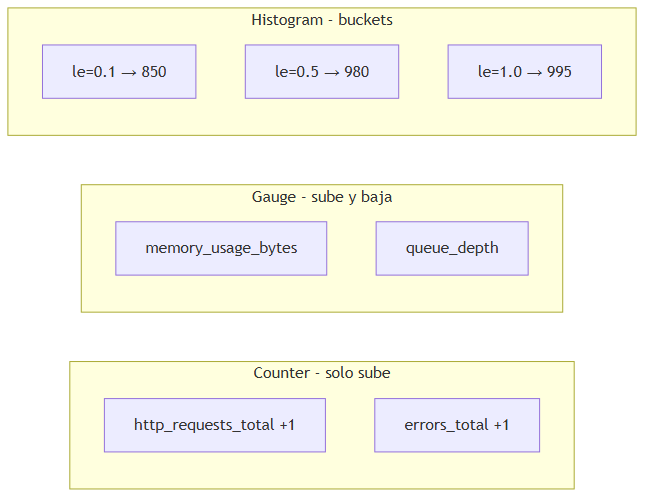

### Cuándo usar / Cuándo no

| Tipo | Usa para… | No uses para… |
|---|---|---|
| **Counter** | Contar eventos: requests, errores, jobs procesados | Valores que suben y bajan (memoria, conexiones) |
| **Gauge** | Valores instantáneos: memoria, profundidad de cola, temperatura | Contar eventos acumulados |
| **Histogram** | Latencia, tamaño de payload, duración de operaciones | Contar eventos simples (usa Counter) |

> **Nota del instructor:** Un error muy común es modelar "usuarios activos" como Counter porque "cuenta usuarios". Si el número sube y baja durante el día, es Gauge. Counter es para cosas que solo crecen: total de ventas, total de errores, total de bytes enviados.

---

## 6. Golden Signals — las cuatro métricas esenciales

### Definición formal

Las **Golden Signals** (señales doradas) son cuatro métricas propuestas por Google SRE que todo servicio expuesto a usuarios debería monitorizar: **Latency**, **Traffic**, **Errors** y **Saturation**.

### Explicación desarrollada

Google identificó que la mayoría de problemas de producción se manifiestan en una o más de estas cuatro dimensiones. No necesitas cien métricas el primer día; necesitas las que te permiten responder: "¿Está lento, roto, saturado o simplemente con mucho tráfico?"

| Señal | Qué mide | Ejemplo de métrica | Por qué importa |
|---|---|---|---|
| **Latency** | Tiempo de respuesta | `http_request_duration_seconds` p95 | Los usuarios perciben lentitud antes que errores |
| **Traffic** | Demanda sobre el sistema | `rate(http_requests_total[5m])` | Contextualiza todo lo demás: ¿el pico es tráfico real? |
| **Errors** | Tasa de fallo | `rate(http_requests_total{status=~"5.."}[5m])` | Indica salud funcional |
| **Saturation** | Qué tan lleno está el recurso | CPU %, conexiones BD al máximo, cola al 90 % | Predice problemas **antes** del colapso |

**Latencia:** mide tanto requests exitosos como fallidos, pero por separado. Un error 500 que responde en 2 ms no es "rápido" — es un fallo. Reporta latencia de éxito y de error por separado.

**Tráfico:** sin contexto de tráfico, un pico de CPU puede parecer un problema cuando en realidad es Black Friday. Traffic te da la baseline.

**Errores:** no solo HTTP 5xx. Incluye timeouts, excepciones no capturadas, respuestas de negocio incorrectas (HTTP 200 con body de error).

**Saturación:** el recurso más limitante del sistema. Puede ser CPU, memoria, disco I/O, ancho de banda de red, conexiones a base de datos o profundidad de cola. Cuando un recurso se satura al 100 %, la latencia explota.

### Diagrama

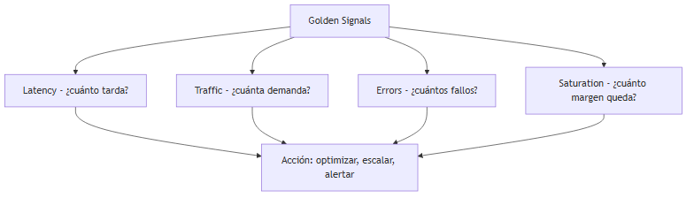

### Cuándo usar / Cuándo no

| Situación | ¿Golden Signals? |
|---|---|
| API HTTP expuesta a usuarios | Sí — las cuatro señales como mínimo |
| Worker background sin interfaz HTTP | Adaptar: latencia de procesamiento, jobs/min, jobs fallidos, profundidad de cola |
| Prototipo local sin usuarios | Opcional — pero acostúmbrate a pensar en estas cuatro |

> **Nota del instructor:** Cuando instrumentes tu primera API, crea un dashboard con exactamente estas cuatro señales antes de añadir gráficos decorativos. Es el 80 % del valor con el 20 % del esfuerzo.

---

## 7. Pilar 2: Logging estructurado

### Definición formal

Un **log** (registro) es un evento discreto con timestamp, severidad y contexto que describe algo que ocurrió en un punto concreto del sistema. El **logging estructurado** representa cada entrada como datos parseables (típicamente JSON) en lugar de texto libre, permitiendo búsqueda, filtrado y correlación automatizada.

### Explicación desarrollada

Piensa en los logs como el **diario** del software: "A las 10:00:00 recibí un POST /orders", "A las 10:00:01 la base de datos tardó 800 ms", "A las 10:00:02 devolví HTTP 500 por timeout".

**Texto libre (evitar en producción):**

```
2026-06-11 10:00:00 INFO Order created for user john orderId=456
```

Este formato es legible para humanos pero **difícil de parsear** para herramientas. ¿Es `orderId=456` o `orderId = 456`? ¿Y si el mensaje cambia mañana?

**Log estructurado (JSON — preferido):**

```json
{
  "timestamp": "2026-06-11T10:00:00Z",
  "level": "Information",
  "message": "Order created",
  "correlationId": "abc-123",
  "traceId": "4bf92f3577b34da6a3ce929d0e0e4736",
  "spanId": "00f067aa0ba902b7",
  "orderId": "ord-456",
  "userId": "usr-789",
  "durationMs": 42,
  "service": "orders-api",
  "environment": "production"
}
```

¿Por qué JSON? Porque puedes **filtrar, agrupar y buscar** en herramientas como Loki, Elasticsearch o Log Analytics:

```
correlationId = "abc-123" AND level = "Error"
traceId = "4bf92f3577b34da6a3ce929d0e0e4736"
durationMs > 1000 AND service = "payments-api"
```

**Niveles de severidad (convención habitual):**

| Nivel | Cuándo usarlo |
|---|---|
| **Debug** | Detalle para desarrollo; normalmente desactivado en producción |
| **Information** | Flujo normal: request recibido, operación completada |
| **Warning** | Algo inesperado pero recuperable: reintento, cache miss, deprecación |
| **Error** | Fallo que impide completar una operación |
| **Critical / Fatal** | El servicio no puede continuar; requiere intervención inmediata |

**Buenas prácticas para juniors:**

1. **Incluye correlation ID y trace ID en cada entrada.** Si el API Gateway genera `abc-123`, propágalo a todos los servicios downstream en headers HTTP (`X-Correlation-Id`, `traceparent` W3C).
2. **No loguees secretos ni datos personales sensibles.** Passwords, tokens, números de tarjeta, DNI completos — fuera de los logs. En muchas jurisdicciones es requisito legal (GDPR).
3. **Sé consistente con los nombres de campos.** `userId` en un servicio y `user_id` en otro dificulta la correlación. Define convenciones de equipo.
4. **Centraliza los logs.** Un archivo en disco de un pod de Kubernetes desaparece cuando el pod muere. Usa un agregador (Fluent Bit → Loki, o equivalente cloud).

### Diagrama

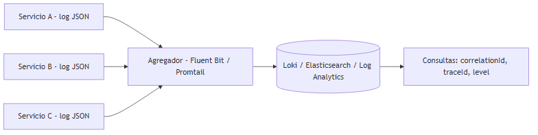

### Cuándo usar / Cuándo no

| Práctica | Usa cuando… | Evita cuando… |
|---|---|---|
| **Logging estructurado JSON** | Producción, microservicios, equipos con herramientas de búsqueda | Prototipo local de una persona (texto plano puede bastar temporalmente) |
| **Nivel Debug en producción** | Nunca por defecto | Siempre — genera volumen masivo y expone detalles internos |
| **Log de cada variable** | Debugging puntual con feature flag | Permanentemente — coste y ruido prohibitivos |

> **Nota del instructor:** Serilog en .NET con `WriteTo.Console(new JsonFormatter())` o sink a Elasticsearch/Loki es el camino natural. Configura enriquecedores (`Enrich.FromLogContext()`) para que correlationId y traceId se añadan automáticamente sin repetir código en cada log.

---

## 8. Pilar 3: Trazas distribuidas — trace, span y propagación de contexto

### Definición formal

Una **traza** (trace) es el registro del camino completo de una solicitud a través de uno o más servicios, compuesto por **spans** — operaciones individuales con inicio, fin y duración. La **propagación de contexto** (context propagation) es el mecanismo por el cual el trace ID y span ID se transmiten entre servicios mediante headers HTTP estándar (W3C Trace Context).

### Explicación desarrollada

En un monolito, un stack trace te dice dónde falló. En microservicios, una request puede pasar por Gateway → Servicio A → Servicio B → Base de datos → cola de mensajes. Sin trazas, cada servicio tiene logs aislados y conectar los puntos es manual y lento.

**Conceptos clave:**

| Concepto | Qué es |
|---|---|
| **Trace ID** | Identificador global único de toda la solicitud, desde el gateway hasta la última base de datos |
| **Span ID** | Identificador de una operación individual dentro del trace (una llamada HTTP, una query SQL) |
| **Parent span** | El span que "contiene" otro; forma un árbol jerárquico |
| **Span attributes** | Metadatos: `http.method=POST`, `db.statement=SELECT...`, `error=true` |
| **Span events** | Puntos en el tiempo dentro de un span (ej. "cache miss", "retry attempt 2") |

**Propagación de contexto:**

Cuando el Servicio A llama al Servicio B, debe **propagar** el trace context en los headers HTTP. El estándar W3C Trace Context define:

```
traceparent: 00-4bf92f3577b34da6a3ce929d0e0e4736-00f067aa0ba902b7-01
tracestate: congo=t61rcWkgMzE
```

- `traceparent` contiene: versión, trace-id, parent-span-id, flags.
- El Servicio B **extrae** este header, crea un span hijo y continúa la traza.

Si un servicio no propaga el contexto, la traza se **rompe** — verás spans huérfanos en Jaeger/Tempo y perderás visibilidad de la cadena completa.

**Ejemplo de árbol de spans:**

```
Trace: 4bf92f3577b34da6a3ce929d0e0e4736
├── Span: Gateway POST /api/orders (120 ms)
│   └── Span: Orders API CreateOrder (115 ms)
│       ├── Span: HTTP GET Inventory (45 ms)
│       │   └── Span: Inventory DB query (40 ms)
│       └── Span: SQL INSERT orders (60 ms)  ← span lento, sospechoso
```

Si B tarda 3 segundos en la query SQL, lo verás como un span largo — sin adivinar.

### Diagrama

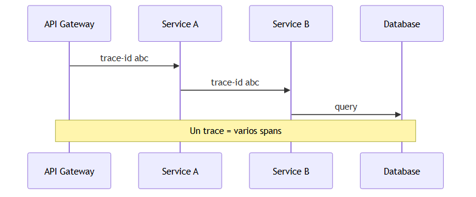

> *Fuente editable (Mermaid):* [09-distributed-tracing.mermaid](./assets/diagrams/09-distributed-tracing.mermaid)

### Cuándo usar / Cuándo no

| Situación | ¿Trazas distribuidas? |
|---|---|
| Microservicios con llamadas HTTP/gRPC entre sí | Sí — imprescindible |
| Monolito sin llamadas externas síncronas | Trazas internas opcionales (APM) |
| Sistemas event-driven puros (solo colas) | Trazas con context propagation en mensajes (headers en AMQP/Kafka) |

> **Nota del instructor:** El error más costoso en trazas es instrumentar el servicio A pero olvidar propagar headers al servicio B. La traza se corta a la mitad y pierdes la mitad del valor. Verifica la cadena completa en staging antes de producción.

---

## 9. OpenTelemetry — arquitectura del estándar

### Definición formal

**OpenTelemetry (OTel)** es un proyecto open source y estándar de la industria que unifica la **instrumentación**, **recolección** y **exportación** de métricas, logs y trazas, independientemente del backend de almacenamiento (Jaeger, Prometheus, Application Insights, etc.).

### Explicación desarrollada

Antes de OpenTelemetry, cada herramienta (Jaeger, Zipkin, New Relic, Datadog) tenía su SDK propio. Cambiar de vendor significaba reescribir instrumentación. OTel resuelve esto con una capa estándar.

**Componentes de la arquitectura OTel:**

| Componente | Función |
|---|---|
| **OTel SDK** | Biblioteca en tu aplicación (.NET, Java, Python…) que crea spans, métricas y logs |
| **Auto-instrumentación** | Agentes que instrumentan frameworks sin cambiar código (ASP.NET Core, HttpClient, EF Core) |
| **OTel Collector** | Proceso intermedio que recibe, procesa (batch, filter, sampling) y exporta a backends |
| **OTLP** | OpenTelemetry Protocol — formato de transporte entre SDK/Collector y backends |
| **Exporters** | Prometheus, Jaeger, Tempo, Loki, Azure Monitor, AWS X-Ray, etc. |

**Flujo típico:**

1. Tu API .NET usa `OpenTelemetry.Instrumentation.AspNetCore` — cada request HTTP genera un span automáticamente.
2. El SDK exporta spans vía OTLP al **OTel Collector** (sidecar en K8s o daemon central).
3. El Collector aplica **sampling** (descarta el 90 % de trazas normales, retiene las de error).
4. El Collector exporta a **Tempo** (trazas), **Prometheus** (métricas) y **Loki** (logs correlacionados).

**Correlación automática:** OTel inyecta `trace_id` y `span_id` en los logs cuando usas el bridge de logging. Así, desde un log puedes saltar a la traza completa en Grafana con un clic.

### Diagrama

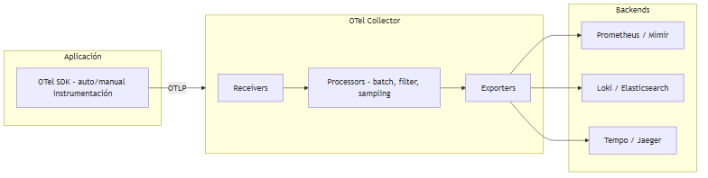

> *Fuente editable (Mermaid):* [09-opentelemetry.mermaid](./assets/diagrams/09-opentelemetry.mermaid)

### Cuándo usar / Cuándo no

| Situación | ¿OpenTelemetry? |
|---|---|
| Nuevo proyecto en 2024+ | Sí — es el estándar de la industria |
| Sistema legacy con SDK vendor-specific maduro | Migración gradual; OTel como capa de exportación |
| Prototipo de un día | Overhead innecesario — logs en consola |

> **Nota del instructor:** No necesitas dominar OTel el primer día, pero sí saber que es **el estándar** hacia el que converge la industria. En .NET, el paquete `OpenTelemetry.Extensions.Hosting` con auto-instrumentación de ASP.NET Core es el punto de partida recomendado.

---

## 10. SLI, SLO y SLA — el idioma de la fiabilidad

### Definición formal

- **SLI (Service Level Indicator):** la **métrica** concreta que mides para evaluar el nivel de servicio.
- **SLO (Service Level Objective):** el **objetivo interno** que tu equipo se compromete a cumplir sobre ese SLI.
- **SLA (Service Level Agreement):** el **compromiso contractual** con el cliente, con consecuencias (créditos, penalizaciones) si no se cumple.

### Explicación desarrollada

Estos tres acrónimos aparecen en toda conversación sobre operaciones. No son lo mismo.

| Concepto | Definición | Ejemplo |
|---|---|---|
| **SLI** | La métrica que mides | "Porcentaje de requests HTTP con latencia < 300 ms" |
| **SLO** | El objetivo interno sobre ese SLI | "El 99.9 % de requests deben responder en < 300 ms" |
| **SLA** | El compromiso contractual con penalizaciones | "Garantizamos 99.5 % uptime; si no, crédito del 10 %" |

El SLI es el termómetro. El SLO es la temperatura que tu equipo se compromete a mantener. El SLA es lo que firmas con el cliente (y suele ser **más laxo** que el SLO interno, para tener margen de maniobra).

**Ejemplos de SLIs habituales:**

| SLI | Cómo se mide |
|---|---|
| Disponibilidad | `(requests exitosos / requests totales) × 100` |
| Latencia | `percentil(request_duration, 99) < umbral` |
| Correctitud | `(respuestas correctas / respuestas totales) × 100` |
| Freshness | `edad del dato más reciente < umbral` (para pipelines de datos) |

**Relación SLO interno vs SLA contractual:**

Si tu SLA promete 99.5 % de disponibilidad al cliente, tu SLO interno debería ser 99.9 % o superior. El margen entre SLO y SLA es tu **colchón** para incidentes menores sin incumplir contrato.

### Diagrama

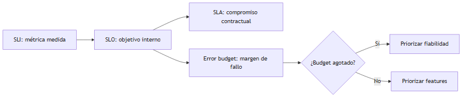

> *Fuente editable (Mermaid):* [09-sli-slo-budget.mermaid](./assets/diagrams/09-sli-slo-budget.mermaid)

### Cuándo usar / Cuándo no

| Concepto | Define cuando… | Evita cuando… |
|---|---|---|
| **SLI** | Siempre — necesitas saber qué mides | Nunca — sin SLI no hay SLO |
| **SLO** | Tienes usuarios que dependen del servicio | El sistema es interno sin impacto de negocio |
| **SLA** | Hay contrato comercial con consecuencias | Prototipos o herramientas internas sin clientes externos |

> **Nota del instructor:** Un SLO mal definido es peor que ninguno. "El sistema debe ser rápido" no es un SLO. "El 99 % de requests de la API de checkout responden en menos de 500 ms medidos en el load balancer" sí lo es — medible, acotado, accionable.

---

## 11. Error budget — ejemplo numérico

### Definición formal

El **error budget** (presupuesto de error) es la cantidad máxima de fallos permitida durante un periodo sin incumplir el SLO. Se calcula como el complemento del objetivo de disponibilidad expresado en tiempo o en número de requests fallidos.

### Explicación desarrollada

Si tu SLO es 99.9 % de disponibilidad mensual, el error budget es el **0.1 %** de tiempo (o requests) en que puedes fallar sin incumplir el objetivo.

**Ejemplo numérico completo:**

| Dato | Valor |
|---|---|
| SLO | 99.9 % de requests exitosos por mes |
| Error budget | 100 % − 99.9 % = **0.1 %** |
| Mes | 30 días = 720 horas = 43 200 minutos |
| Tiempo de fallo permitido | 0.1 % × 43 200 min = **43.2 minutos/mes** |
| Requests totales/mes (estimado) | 10 000 000 |
| Requests fallidos permitidos | 0.1 % × 10 000 000 = **10 000 requests/mes** |

**Interpretación práctica:**

- Si llevas 15 días y ya consumiste 40 minutos de downtime, estás al **93 % del budget agotado** con la mitad del mes por delante.
- Decisión de equipo: congelar despliegues arriesgados, priorizar deuda técnica operativa, posponer features.
- Si aún tienes 35 minutos de budget restante, puedes permitirte un despliegue canary agresivo.

**Error budget como herramienta de negocio:**

El error budget equilibra **velocidad de desarrollo** y **fiabilidad**. No es solo métrica técnica; es el lenguaje para que producto y operaciones negocien:

- Budget saludable → el equipo de desarrollo puede moverse rápido.
- Budget agotado → el equipo de operaciones tiene "veto" sobre nuevos despliegues hasta recuperar margen.

### Diagrama

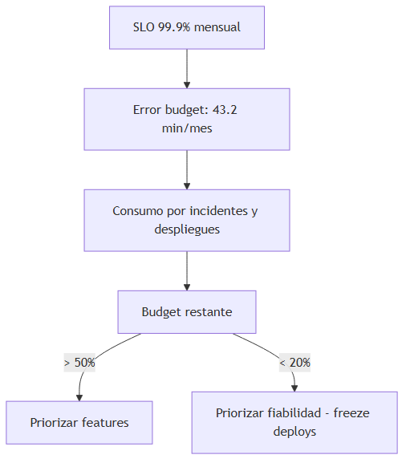

### Cuándo usar / Cuándo no

| Situación | ¿Error budget? |
|---|---|
| Servicio con SLO definido y equipo SRE/DevOps | Sí — guía decisiones de despliegue |
| Prototipo sin usuarios | No — overhead innecesario |
| SLA contractual con penalizaciones | Sí — el budget protege de incumplir el SLA |

> **Nota del instructor:** Calcula el error budget en **requests fallidos**, no solo en minutos de downtime. Un servicio puede estar "up" pero devolver errores 500 — eso consume budget aunque no haya caída total.

---

## 12. Sampling — head vs tail

### Definición formal

**Sampling** (muestreo) es la técnica de seleccionar un subconjunto de trazas para almacenar y analizar, reduciendo coste y overhead en sistemas de alto tráfico. **Head sampling** decide al inicio de la traza; **tail sampling** decide al final, reteniendo trazas "interesantes".

### Explicación desarrollada

En sistemas con millones de requests por hora, guardar el 100 % de las trazas es costoso e innecesario. El 99 % de las trazas son requests normales que confirman que todo funciona; el 1 % contiene errores, latencia anómala o patrones útiles.

**Head sampling:**

- Decide **al inicio** de la traza si se va a registrar o no.
- Ejemplo: "Retener 1 de cada 100 trazas" — probabilidad fija al recibir la request.
- Ventaja: simple, bajo overhead, no requiere buffer.
- Desventaja: puede **descartar trazas con errores** si la decisión se tomó antes de que ocurriera el fallo.

**Tail sampling:**

- Espera a que la traza **termine** y entonces decide si retenerla.
- Criterios típicos: retener si hubo error, si latencia > umbral, si status code 5xx.
- Ventaja: captura **siempre** lo importante (errores, lentitud).
- Desventaja: requiere buffer temporal (memoria) para trazas en vuelo; más complejo de implementar.

**Regla práctica por entorno:**

| Entorno | Estrategia recomendada |
|---|---|
| Desarrollo local | 100 % — traza todo |
| Staging | 50–100 % — validar instrumentación |
| Producción baja escala | 10–25 % head sampling |
| Producción alta escala | 1–5 % head + tail sampling en Collector |

### Diagrama

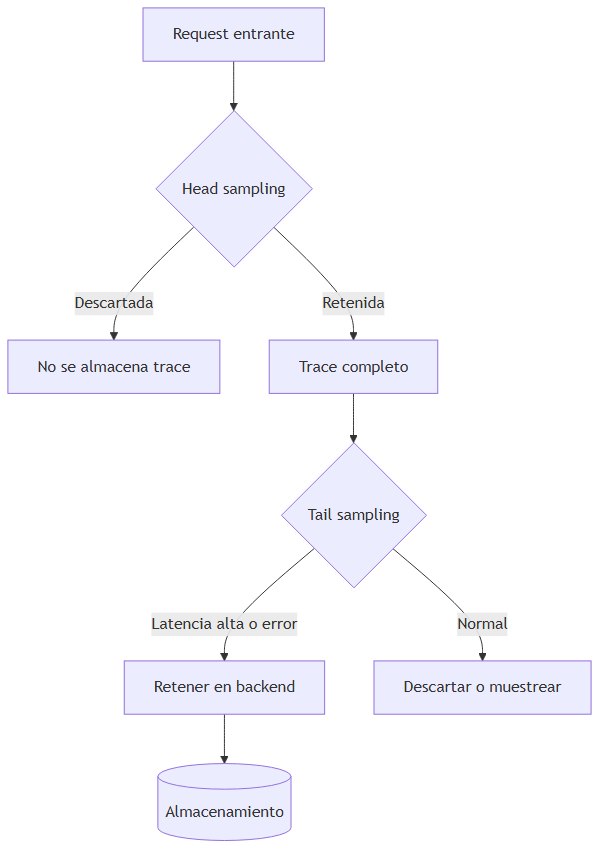

> *Fuente editable (Mermaid):* [09-sampling-strategies.mermaid](./assets/diagrams/09-sampling-strategies.mermaid)

### Cuándo usar / Cuándo no

| Estrategia | Usa cuando… | Evita cuando… |
|---|---|---|
| **Head sampling** | Alto tráfico, simplicidad prioritaria, coste limitado | Necesitas capturar todos los errores |
| **Tail sampling** | Producción crítica donde errores no pueden perderse | Recursos limitados para buffer en Collector |
| **100 % sampling** | Desarrollo, staging, debugging activo | Producción con millones de req/hora |

> **Nota del instructor:** Nunca despliegues trazas al 100 % en producción de alto tráfico sin calcular el coste de almacenamiento primero. Un servicio con 10 000 req/s genera ~864 millones de spans/día — el coste escala linealmente.

---

## 13. Correlación entre pilares — flujo de diagnóstico

### Definición formal

**Correlación de señales** es el proceso de vincular métricas, logs y trazas mediante identificadores comunes (`trace_id`, `correlation_id`, labels compartidos) para reconstruir la historia completa de un incidente.

### Explicación desarrollada

Aquí es donde la observabilidad supera a la monitorización aislada. Un flujo típico de investigación de incidente:

**Paso 1 — Métrica dispara alerta:** el dashboard muestra error rate al 5 % (normalmente < 0.1 %). Alertmanager notifica al equipo.

**Paso 2 — Consultar Golden Signals:** latencia p99 subió de 200 ms a 2 s. Tráfico estable (no es pico de demanda). Saturación de conexiones BD al 95 %.

**Paso 3 — Filtrar logs:** `level=Error AND timestamp > now()-1h`. Encuentras correlation ID `abc-123` repetido en errores de timeout.

**Paso 4 — Abrir trace:** buscas trace ID asociado a `abc-123`. El span "Service B → Database" tarda 8 segundos y marca `error=true`.

**Paso 5 — Correlacionar con saturación:** métrica de conexiones activas a BD al 100 % — la base de datos está saturada, no el código de negocio.

**Paso 6 — Acción:** escalar pool de conexiones, optimizar query lenta identificada en span attributes, o activar circuit breaker mientras se corrige.

Sin correlación, habrías mirado solo logs y perdido horas. Con correlación, llegas a la causa en minutos.

### Diagrama

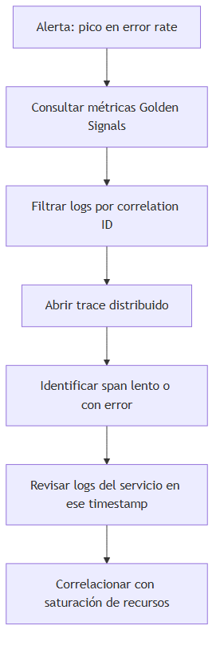

> *Fuente editable (Mermaid):* [09-observability-correlation.mermaid](./assets/diagrams/09-observability-correlation.mermaid)

### Cuándo usar / Cuándo no

| Práctica | Imprescindible cuando… | Opcional cuando… |
|---|---|---|
| **Correlación trace_id en logs** | Microservicios con trazas distribuidas | Monolito con un solo log file |
| **Dashboards con drill-down** | Equipo de operaciones con on-call | Desarrollo local individual |
| **Runbooks con flujo de correlación** | Servicios críticos con SLA | Herramientas internas de bajo impacto |

> **Nota del instructor:** Practica este flujo en staging **antes** de tu primer incidente real. En producción bajo presión, no es momento de aprender dónde hacer clic en Grafana.

---

## 14. Fatiga de alertas (alert fatigue)

### Definición formal

**Alert fatigue** (fatiga de alertas) es el fenómeno por el cual un equipo expuesto a demasiadas alertas repetitivas, irrelevantes o sin contexto accionable **deja de responder** incluso cuando ocurre un incidente real.

### Explicación desarrollada

Imagina que recibes 200 notificaciones por Slack al día:

- "CPU > 80 %" cada 5 minutos en un servicio que siempre corre al 85 %.
- "Pod restarted" en staging (donde los reinicios son normales).
- La misma alerta duplicada en Slack, email y PagerDuty.
- Alertas sin runbook: "Something is wrong with payments" — ¿y ahora qué?

Después de dos semanas, el equipo **silencia** el canal o ignora las notificaciones. Cuando llega el incidente real — caída total del servicio de pagos — nadie reacciona a tiempo.

**Causas habituales de alert fatigue:**

| Causa | Ejemplo |
|---|---|
| Umbrales mal calibrados | Alerta CPU > 70 % en servicio que necesita 75 % normalmente |
| Alertas sin SLO | Alertar sobre métricas que no afectan al usuario |
| Duplicación | Misma condición alertando en 3 canales y 5 dashboards |
| Falta de runbook | Alerta sin pasos de remediación |
| Alertas en entornos no productivos | Staging/dev generando ruido |
| Sin agrupación | 50 alertas individuales por 50 pods caídos (debería ser 1 alerta agrupada) |

**Cómo mitigar alert fatigue:**

1. **Alerta basada en SLO**, no en métricas infra: "Error budget consumido al 80 %" > "CPU > 90 %".
2. **Agrupación y deduplicación:** Alertmanager `group_by`, PagerDuty dedup.
3. **Severidad clara:** P1 (despierta a alguien), P2 (Slack urgente), P3 (ticket), P4 (informativo).
4. **Runbook en cada alerta:** enlace a pasos concretos de diagnóstico y remediación.
5. **Silencios programados:** ventanas de mantenimiento donde las alertas se suprimen conscientemente.
6. **Revisión periódica:** cada mes, auditar alertas que nadie ha mirado en 30 días — eliminar o ajustar.

### Diagrama

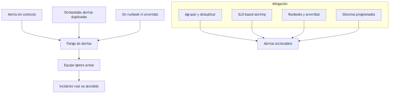

> *Fuente editable (Mermaid):* [09-alert-fatigue.mermaid](./assets/diagrams/09-alert-fatigue.mermaid)

### Cuándo usar / Cuándo no

| Práctica | Aplica cuando… | Evita cuando… |
|---|---|---|
| **Alertas basadas en SLO** | Servicios con usuarios y SLO definido | Prototipos sin tráfico |
| **Revisión mensual de alertas** | Siempre en producción | Nunca — las alertas envejecen mal |
| **Alerta por cada métrica disponible** | Nunca | Siempre — genera ruido |

> **Nota del instructor:** La regla de oro: **cada alerta debe ser accionable**. Si nadie sabe qué hacer cuando suena, no es una alerta — es ruido. Mejor pocas alertas buenas que cien alertas ignoradas.

---

## 15. Stack de observabilidad — capas y herramientas

### Definición formal

El **stack de observabilidad** es la arquitectura en capas que va desde la instrumentación en el código hasta la visualización y alertas, pasando por recolección y almacenamiento de señales.

### Explicación desarrollada

Piensa en el stack como una tubería con cuatro etapas:

| Capa | Qué hace | Herramientas de ejemplo |
|---|---|---|
| **Instrumentación** | Tu código emite señales | OpenTelemetry SDK, Serilog, prometheus-net |
| **Colección** | Recibe, procesa y enruta señales | OTel Collector, Fluent Bit, Promtail |
| **Almacenamiento** | Persiste para consulta | Prometheus/Mimir, Loki, Elasticsearch, Tempo/Jaeger |
| **Visualización y alertas** | Dashboards, búsqueda, paging | Grafana, Kibana, Azure Monitor, Alertmanager, PagerDuty |

No necesitas aprender todas las herramientas de golpe. El patrón es siempre el mismo: **emitir → recolectar → almacenar → consultar**.

**Stack open source popular (LGTM):**

- **L**oki — logs
- **G**rafana — visualización
- **T**empo — trazas
- **M**imir/Prometheus — métricas

**Stack cloud managed:**

- Azure: Application Insights + Log Analytics + Azure Monitor
- AWS: CloudWatch Metrics + Logs + X-Ray
- GCP: Cloud Monitoring + Cloud Logging + Cloud Trace

La elección depende de dónde despliegas, presupuesto y expertise del equipo — no de cuál es "mejor" en abstracto.

### Diagrama

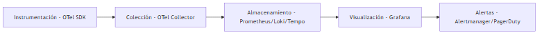

### Cuándo usar / Cuándo no

| Stack | Elige cuando… | Evita cuando… |
|---|---|---|
| **Open source (LGTM)** | Control total, coste predecible a escala, expertise en ops | Equipo pequeño sin tiempo para operar infra |
| **Cloud managed** | Despliegue en una nube, equipo pequeño, time-to-value rápido | Multi-cloud con vendor lock-in concern |
| **Híbrido** | Métricas en Prometheus + logs en cloud nativo | — patrón común en migraciones |

> **Nota del instructor:** Empieza con lo que tu cloud provider ofrece gratis o casi gratis (Application Insights tier gratuito, CloudWatch basic). Migra a open source cuando el coste o la flexibilidad lo justifiquen — no al revés.

---

## 16. Instrumentación desde el primer día

### Definición formal

**Instrumentación** es el acto de añadir código o configuración a tu aplicación para que emita métricas, logs y trazas de forma sistemática y consistente.

### Explicación desarrollada

Un error clásico de equipos junior: "Añadimos observabilidad cuando tengamos tiempo." Ese tiempo nunca llega — llega el primer incidente en producción.

**Qué instrumentar como mínimo viable (MVP de observabilidad):**

| Componente | Qué emitir |
|---|---|
| API HTTP | Latencia, status code, throughput por endpoint |
| Llamadas salientes | Duración, errores, destino (service name) |
| Base de datos | Duración de queries, errores de conexión |
| Colas de mensajes | Mensajes procesados, lag, errores |
| Logs | Correlation ID, trace ID, user/tenant (si aplica), duración de operación |

**Anti-patrones a evitar:**

| Anti-patrón | Por qué es malo |
|---|---|
| Logs sin correlation ID | Imposible seguir una solicitud entre servicios |
| Métricas con cardinalidad explosiva | Coste prohibitivo (`user_id` como label en millones de usuarios) |
| Alertas sin runbook | Despiertas al equipo sin saber qué hacer |
| Trazas al 100 % en producción de alto tráfico | Coste y rendimiento degradado |
| Instrumentar solo en producción | Staging sin señales = sorpresas en prod |

### Diagrama

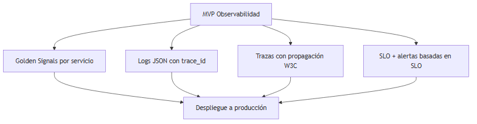

### Cuándo usar / Cuándo no

| Práctica | Desde cuándo | Postergar solo si… |
|---|---|---|
| Logs estructurados con correlation ID | Sprint 1 | Nunca en producción |
| Golden Signals | Primer despliegue con usuarios | Prototipo desechable |
| Trazas distribuidas | Segundo microservicio en la arquitectura | Monolito sin llamadas externas |
| SLO y error budget | Primer SLA o usuarios pagos | Herramienta interna sin impacto |

> **Nota del instructor:** La observabilidad es más barata **antes** del incidente que **durante**. Una hora de instrumentación en sprint 1 ahorra diez horas de debugging ciego en el primer outage.

---

## Resumen del capítulo

- **Observabilidad** es inferir el estado interno del sistema a partir de sus salidas externas; va más allá de vigilar umbrales predefinidos (monitorización).
- Los **tres pilares** — métricas, logs y trazas — son complementarios: agregación temporal, detalle de eventos y camino distribuido.
- Tipos de métricas: **Counter** (solo incrementa), **Gauge** (sube y baja), **Histogram** (buckets para percentiles).
- Las **Golden Signals** (latency, traffic, errors, saturation) son el punto de partida para cualquier servicio.
- **Logging estructurado JSON** con `trace_id` y `correlation_id` habilita búsqueda y correlación automatizada.
- **Trazas distribuidas** con propagación W3C Trace Context muestran el camino de una request entre microservicios.
- **OpenTelemetry** es el estándar de instrumentación; el Collector centraliza sampling y exportación.
- **SLI** mide, **SLO** objetiva, **SLA** contrata; el **error budget** (ej. 43.2 min/mes para 99.9 %) equilibra features y fiabilidad.
- **Head sampling** decide al inicio; **tail sampling** retiene trazas interesantes al final.
- La **correlación** métricas → logs → trazas es el flujo de diagnóstico que reduce MTTR.
- **Alert fatigue** se mitiga con alertas basadas en SLO, runbooks y revisión periódica.
- Instrumenta **desde el primer día**, no después del primer incidente.

**Siguiente paso:** lee el capítulo 11 sobre resiliencia. Observabilidad te dice *qué* falla; resiliencia te enseña *cómo* diseñar para que el fallo no derribe todo el sistema.
