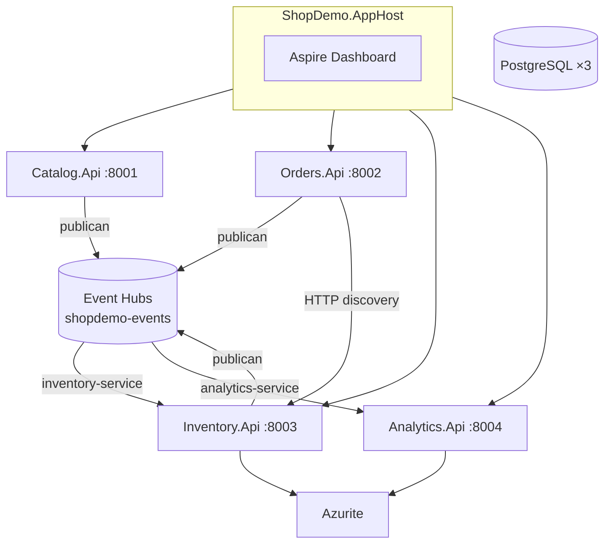

# Anexo — Especificación técnica: Analytics + Aspire (ShopDemo)

| Campo | Detalle |
|:------|:--------|
| **Capa** | B — Especificación técnica |

**Proyectos:** `ShopDemo.AppHost`, `ShopDemo.ServiceDefaults`, `ShopDemo.Analytics.Api`

---

## 1. Arquitectura técnica



---

## 2. Decisiones de diseño

| # | Decisión | Valor |
|---|---|---|
| D-01 | Nombre servicio | `ShopDemo.Analytics.Api` |
| D-02 | Program.cs APIs existentes | Sin cambios fase 1 |
| D-03 | Event Hubs en Aspire | Habilitado con connection string AppHost |
| D-04 | Puerto Analytics | `8004` |
| D-05 | Consumer group | `analytics-service` |
| D-06 | Despliegue nube | Etapa 7+; AppHost solo local |

---

## 3. ShopDemo.AppHost — RF técnicos

| ID | Requerimiento |
|---|---|
| RF-AH-01 | Orquestar 4 APIs como proyectos referenciados |
| RF-AH-02 | PostgreSQL con 3 bases: Catalog, Orders, Inventory |
| RF-AH-03 | Azurite para checkpoints |
| RF-AH-04 | `EventHubs__Enabled=true` en 4 servicios |
| RF-AH-05 | Service discovery Orders → Inventory |
| RF-AH-06 | Puertos 8001–8004 |
| RF-AH-07 | Connection string desde user secrets AppHost |

---

## 4. ShopDemo.Analytics.Api

| ID | Requerimiento |
|---|---|
| RF-AN-T01 | Consumer group `analytics-service` |
| RF-AN-T02 | Checkpoints blob `analytics-checkpoints` (Azurite) |
| RF-AN-T03 | Deserializar `IntegrationEventEnvelope` |
| RF-AN-T04 | Ring buffer memoria (máx. 100) |
| RF-AN-T05 | `GET /api/analytics/events?take=50` |
| RF-AN-T06 | `GET /api/analytics/health` |
| RF-AN-T07 | ServiceDefaults solo en Analytics |

---

## 5. Configuración Event Hubs

| Variable | Inventory | Analytics |
|---|---|---|
| `EventHubs__ConsumerGroup` | `inventory-service` | `analytics-service` |
| `EventHubs__CheckpointContainerName` | `inventory-checkpoints` | `analytics-checkpoints` |
| Hub | `shopdemo-events` | `shopdemo-events` |

---

## 6. Endpoints Analytics

| Método | Ruta | Descripción |
|---|---|---|
| GET | `/api/analytics/events?take=50` | Últimos eventos (1–100) |
| GET | `/api/analytics/health` | Estado y contador buffer |
| GET | `/health`, `/alive` | Aspire (Development) |
| GET | `/swagger` | OpenAPI |

---

## 7. Estructura proyectos

```
Source/Aspire/
├── ShopDemo.AppHost/
├── ShopDemo.ServiceDefaults/
└── ShopDemo.Analytics.Api/
    ├── Controllers/
    ├── Messaging/
    └── Services/
```

---

## 8. RNF

| ID | Requerimiento |
|---|---|
| RNF-AN-01 | Domain/Application Source/Catalog, Source/Orders, Source/Inventory sin cambios |
| RNF-AN-02 | Docker Compose por servicio sigue independiente |
| RNF-AN-03 | Consumer groups obligatorios en hub cloud |

---

## 9. CA-T

| ID | Criterio |
|---|---|
| CA-T-AN-01 | `dotnet build Source/ShopDemo.slnx` sin errores |
| CA-T-AN-02 | AppHost + 4 APIs en Aspire Dashboard |
| CA-T-AN-03 | Fan-out: grupos distintos operativos |
| CA-T-AN-04 | `ObservedEventDto` en ring buffer |
| CA-T-AN-05 | Analytics desplegable en ACA/ECS/K8s (imagen `shopdemo-analytics`) |

---

## 10. Referencias

- [ANEXO-CODIGO-ANALYTICS-ASPIRE.md](./ANEXO-CODIGO-ANALYTICS-ASPIRE.md)
- [IMPLEMENTACION-ANALYTICS-ASPIRE.md](./IMPLEMENTACION-ANALYTICS-ASPIRE.md)
