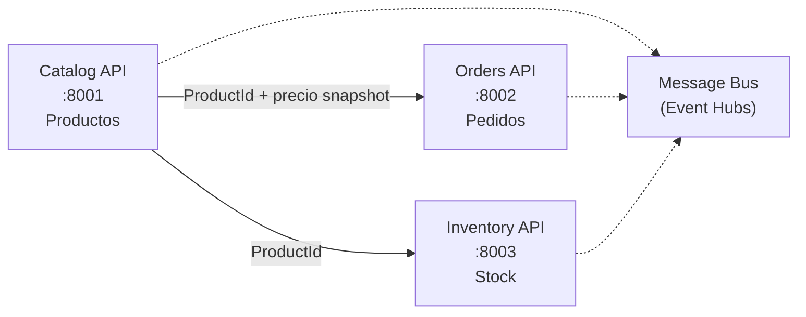

# Anexo — Especificación técnica: Catalog (ShopDemo)

| Campo | Detalle |
|:------|:--------|
| **Requerimientos de negocio** | [REQUERIMIENTOS-CATALOG.md](./REQUERIMIENTOS-CATALOG.md) |
| **Capa** | B — Especificación técnica |

**Arquitectura:** Clean Architecture + CQRS (MediatR)  
**Bounded Context:** Catalog

---

## 1. Contexto técnico en la plataforma



| Microservicio | Base de datos | Puerto API | Puerto PostgreSQL (host) |
|---|---|---|---|
| **Catalog** | **`ShopDemoCatalog`** | **`8001`** | **`5433`** |
| Orders | `ShopDemoOrders` | `8002` | `5434` |
| Inventory | `ShopDemoInventory` | `8003` | `5435` |

---

## 2. Modelo de dominio

### 2.1 Agregado raíz: `Product`

```
Product (AggregateRoot<Guid>)
├── ProductName        (Value Object)
├── string Description
├── Money Price        (Value Object)
├── StockLevel Stock   (Value Object)
├── Category Category  (Value Object)
├── bool IsActive
├── DateTimeOffset CreatedAt
└── DateTimeOffset? LastUpdatedAt
```

### 2.2 Comportamientos del agregado

| Método | Regla de negocio | Evento generado |
|---|---|---|
| `Create()` | Factory; producto activo por defecto | `ProductCreatedDomainEvent` |
| `UpdateDetails()` | Solo si está activo | — |
| `ChangePrice()` | No-op si precio igual; solo activos | `ProductPriceChangedDomainEvent` |
| `ReplenishStock()` | Unidades > 0; solo activos | `StockReplenishedDomainEvent` |
| `DeductStock()` | Validación en `StockLevel`; solo activos | `StockDepletedDomainEvent` (si stock = 0) |
| `Deactivate()` | Idempotente | `ProductDeactivatedDomainEvent` |

### 2.3 Value Objects

| Value Object | Reglas |
|---|---|
| `ProductName` | No vacío; 3–200 caracteres; igualdad case-insensitive |
| `Money` | Monto ≥ 0; moneda ISO 3 letras |
| `StockLevel` | Unidades ≥ 0; `Increase`/`Decrease` inmutables |
| `Category` | Electronics, Clothing, Food, Books, Sports |

### 2.4 Domain Events

| Evento | Cuándo se emite |
|---|---|
| `ProductCreatedDomainEvent` | Al crear producto |
| `ProductPriceChangedDomainEvent` | Al cambiar precio |
| `StockReplenishedDomainEvent` | Al reabastecer stock |
| `StockDepletedDomainEvent` | Stock llega a 0 |
| `ProductDeactivatedDomainEvent` | Al desactivar producto |

### 2.5 Repositorio

`IProductRepository` extiende `IRepository<Product, Guid>` con:

- `GetByCategoryAsync`
- `GetActiveProductsAsync` (paginado)
- `CountActiveAsync`
- `ExistsByNameAsync`

---

## 3. API REST

### `POST /api/products`

**Request:**

```json
{
  "name": "Teclado Mecánico",
  "description": "RGB, switches azules",
  "price": 89.99,
  "currency": "USD",
  "stock": 50,
  "category": "Electronics"
}
```

**Respuestas:**

| Código | Descripción |
|---|---|
| `201 Created` | Producto creado; body = `ProductDto` |
| `400 Bad Request` | Validación fallida o regla de dominio |
| `409 Conflict` | Nombre de producto duplicado |

**Response (`ProductDto`):**

```json
{
  "id": "3fa85f64-5717-4562-b3fc-2c963f66afa6",
  "name": "Teclado Mecánico",
  "description": "RGB, switches azules",
  "price": 89.99,
  "currency": "USD",
  "stockUnits": 50,
  "category": "Electronics",
  "isActive": true,
  "createdAt": "2026-06-11T22:59:47+00:00",
  "lastUpdatedAt": null
}
```

### Swagger

- Ruta: `/swagger` cuando `ASPNETCORE_ENVIRONMENT=Development`
- Título: **ShopDemo Catalog API v1**

---

## 4. Estructura de proyectos y stack

```
Source/Catalog/
├── ShopDemo.Catalog.Domain/
├── ShopDemo.Catalog.Application/
├── ShopDemo.Catalog.Infraestructure/
└── ShopDemo.Catalog.Api/
```

**Dependencias:** `Api → Infrastructure → Application → Domain → Shared`

| Componente | Tecnología |
|---|---|
| Runtime | .NET 10 |
| ORM | EF Core 10 + Npgsql |
| CQRS | MediatR 14.1 |
| Validación | FluentValidation 12.1 |
| API docs | Swashbuckle 10.2 |
| Base de datos | PostgreSQL 16 |

**Conexión (desarrollo):**

```json
{
  "ConnectionStrings": {
    "DefaultConnection": "Host=localhost;Port=5433;Database=ShopDemoCatalog;Username=ShopDemo;Password=ShopDemo123"
  }
}
```

**Tabla:** `products` — columnas para Value Objects (`name`, `price_amount`, `price_currency`, `stock_units`, `category`).

---

## 5. Criterios de aceptación técnicos (CA-T)

| ID | Criterio |
|---|---|
| CA-T01 | `POST /api/products` válido retorna `201` y persiste en PostgreSQL |
| CA-T02 | Nombre duplicado retorna `409 Conflict` |
| CA-T03 | Datos inválidos retornan `400` con Problem Details |
| CA-T04 | `ProductCreatedDomainEvent` visible en logs al crear |
| CA-T05 | Swagger accesible en Development |
| CA-T06 | `docker compose up` levanta API en `:8001` y PostgreSQL en `:5433` |
| CA-T07 | Migraciones EF se aplican al iniciar |
| CA-T08 | El dominio no referencia EF Core, MediatR ni ASP.NET |
| CA-T09 | Tabla `products` existe tras migración |
| CA-T10 | `GetByIdAsync` hidrata Value Objects correctamente |
| CA-T11 | Excepciones de dominio → `400` con `traceId` |

---

## 6. Referencias

- [IMPLEMENTACION-CATALOG.md](./IMPLEMENTACION-CATALOG.md)
- [ANEXO-HISTORIAS-TECNICAS-CATALOG.md](./ANEXO-HISTORIAS-TECNICAS-CATALOG.md)
- [ARQUITECTURA.md](../ARQUITECTURA.md)
