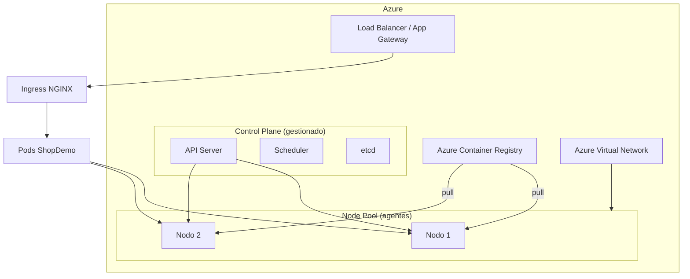

# Teoría — Azure Kubernetes Service (AKS)

| Campo | Detalle |
|:------|:--------|
| **Empresa** | Lite Thinking |
| **Curso** | Microservicios con .NET en Kubernetes y Entornos Multicloud |
| **Instructor** | Lcc. Gilberto Valentino Juárez Sánchez |
| **Contacto** | WhatsApp: +52 5614206660 |
| | E-mail: gilberto.juarez@gmail.com |
| | E-mail: lcc.gilberto.juarez@gmail.com |

**Tema principal:** Introducción a **AKS** para desplegar ShopDemo.

---

## 1. Presentación de AKS

**Azure Kubernetes Service (AKS)** es el servicio administrado de Kubernetes en Azure. Microsoft opera el **plan de control** (API server, scheduler, etcd); tú gestionas los **nodos** (agent pool) donde corren los Pods.

| Ventaja | Descripción |
|---|---|
| Kubernetes estándar | Mismos manifiestos YAML que en Minikube |
| Integración Azure | ACR, Key Vault, Monitor, Application Gateway |
| Menos operación | Sin instalar/controlar el control plane |
| Multicloud | Misma app en AKS, EKS o local |

**ShopDemo en AKS:** imágenes en **ACR**, manifiestos de `k8s/`, Ingress NGINX, Event Hubs existente.

---

## 2. Arquitectura de AKS

| Componente | Responsabilidad |
|---|---|
| **Resource Group** | Contenedor de recursos AKS + ACR + red |
| **AKS Cluster** | Cluster K8s con versión de Kubernetes soportada |
| **Node pool** | VMs (Azure) que ejecutan contenedores |
| **ACR** | Registro de imágenes `shopdemo-*` |
| **Ingress Controller** | NGINX o Application Gateway Ingress Controller |
| **Azure CNI / kubenet** | Plugin de red para Pods |

**Flujo ShopDemo:** `docker push ACR` → Deployment pull imagen → Service → Ingress → usuario.

---

## 3. Modelo de precios (resumen práctico)

| Concepto | Costo típico (lab) |
|---|---|
| **Plan de control AKS** | **Gratis** (tier estándar) |
| **Nodos (VMs)** | Se paga por tamaño y cantidad (ej. `Standard_B2s`) |
| **ACR** | SKU Basic ~ bajo costo fijo mensual |
| **Disco (PVC)** | Storage asociado a StatefulSet Postgres |
| **Load Balancer** | IP pública del Ingress / servicio |
| **Tráfico salida** | Event Hubs, pull de imágenes |

**Ahorro en curso:**

- 1–2 nodos pequeños
- Apagar node pool fuera de horario de clase
- `kubectl delete namespace shopdemo` al terminar
- Eliminar Resource Group al final del módulo

> Precios exactos: [Calculadora Azure](https://azure.microsoft.com/pricing/calculator/) — región y SKU varían.

---

## 4. Errores comunes en AKS

| Error | Causa | Prevención |
|---|---|---|
| `ImagePullBackOff` | ACR sin permisos / imagen inexistente | `az aks update -n ... --attach-acr ...` |
| Pods `Pending` | CPU/mem insuficiente en nodos | Ampliar node pool o reducir `requests` |
| Ingress sin IP externa | Controller no instalado | Instalar NGINX Ingress o AGIC |
| Postgres PVC pendiente | Storage class | Usar `managed-csi` (default en AKS) |
| App no alcanza Event Hubs | NSG / firewall | Permitir salida HTTPS 443 |
| `CrashLoopBackOff` | Connection string / migraciones EF | Revisar logs: `kubectl logs` |
| Credenciales ACR en Deployment | Mal configurado | Usar integración AKS-ACR, no docker config manual |

---

## Referencias

- [Documentación AKS](https://learn.microsoft.com/azure/aks/)
- [IMPLEMENTACION-DESPLIEGUE-AKS.md](./IMPLEMENTACION-DESPLIEGUE-AKS.md)
- [IMPLEMENTACION-KUBERNETES-LOCAL.md](../kubernetes/IMPLEMENTACION-KUBERNETES-LOCAL.md)
