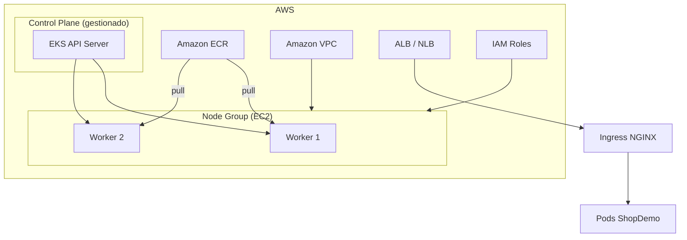

# Teoría — Amazon Elastic Kubernetes Service (EKS)

| Campo | Detalle |
|:------|:--------|
| **Empresa** | Lite Thinking |
| **Curso** | Microservicios con .NET en Kubernetes y Entornos Multicloud |
| **Instructor** | Lcc. Gilberto Valentino Juárez Sánchez |
| **Contacto** | WhatsApp: +52 5614206660 |
| | E-mail: gilberto.juarez@gmail.com |
| | E-mail: lcc.gilberto.juarez@gmail.com |

**Tema principal:** Introducción a **EKS** para desplegar ShopDemo.

---

## 1. Presentación de EKS

**Amazon Elastic Kubernetes Service (EKS)** es Kubernetes administrado en AWS. AWS opera el **plan de control**; los **nodos** corren en EC2 (managed node groups) o **Fargate**.

| Ventaja | Descripción |
|---|---|
| Kubernetes conforme | Mismos YAML que Minikube/AKS |
| Integración AWS | ECR, IAM, CloudWatch, ALB Ingress |
| Opciones de cómputo | EC2 managed nodes o Fargate por Pod |
| Portabilidad | ShopDemo sin cambios de código |

---

## 2. Arquitectura de EKS

| Componente | Rol |
|---|---|
| **EKS Cluster** | Endpoint Kubernetes regional |
| **Node group** | EC2 con kubelet para Pods |
| **ECR** | Imágenes `shopdemo-*` |
| **VPC + subnets** | Red privada/pública para nodos y LB |
| **IAM** | Permisos nodos (worker) y usuarios (`aws eks update-kubeconfig`) |
| **Ingress** | NGINX + ALB o AWS Load Balancer Controller |

---

## 3. Modelo de precios (resumen práctico)

| Concepto | Costo típico (lab) |
|---|---|
| **Cluster EKS** | ~USD 0.10/hora por cluster (control plane) |
| **EC2 nodos** | Según tipo (ej. `t3.medium`) |
| **ECR** | Almacenamiento + transferencia |
| **EBS (PVC)** | Volúmenes Postgres StatefulSet |
| **Load Balancer** | ALB/NLB del Ingress |
| **Datos salida** | Event Hubs cross-cloud (HTTPS) |

**Ahorro en curso:**

- 1 nodo `t3.small` o `t3.medium`
- Eliminar node group y cluster al terminar
- `eksctl delete cluster`

---

## 4. Errores comunes en EKS

| Error | Causa | Prevención |
|---|---|---|
| `ImagePullBackOff` | ECR sin permisos IAM en node role | Política `AmazonEC2ContainerRegistryReadOnly` |
| Pods `Pending` | Insuficiente CPU/mem en nodos | Escalar node group |
| Ingress sin ADDRESS | Controller no instalado | Instalar NGINX o AWS LBC |
| `Unauthorized` kubectl | kubeconfig desactualizado | `aws eks update-kubeconfig` |
| PVC `Pending` | EBS CSI driver no instalado | Addon `aws-ebs-csi-driver` |
| Timeout Event Hubs | Subnet sin NAT/route internet | NAT Gateway o endpoints |
| Security groups | Tráfico bloqueado entre nodos | Revisar reglas del node group |

---

## Referencias

- [Documentación Amazon EKS](https://docs.aws.amazon.com/eks/)
- [IMPLEMENTACION-DESPLIEGUE-EKS.md](./IMPLEMENTACION-DESPLIEGUE-EKS.md)
