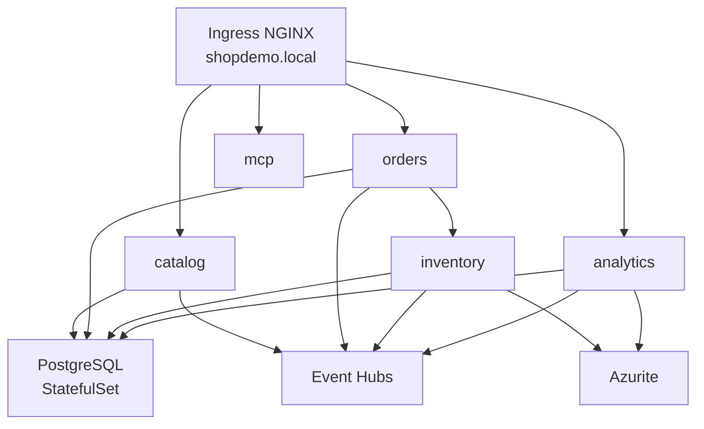

# Anexo — Especificación técnica: Kubernetes local (ShopDemo)

| Campo | Detalle |
|:------|:--------|
| **Requerimientos** | [REQUERIMIENTOS-KUBERNETES.md](./REQUERIMIENTOS-KUBERNETES.md) |
| **Capa** | B — Especificación técnica |

**Cluster:** Minikube · **Manifiestos:** `k8s/` compartidos + `k8s/local/`

---

## 1. Arquitectura en cluster



---

## 2. Recursos Kubernetes

| Recurso | Ruta | Notas |
|---|---|---|
| Namespace | `k8s/namespace.yaml` | `shopdemo` |
| PostgreSQL | `k8s/postgres/` | StatefulSet, 3 DBs |
| Azurite | `k8s/azurite/` | Checkpoints |
| Services | `k8s/*/service.yaml` | ClusterIP |
| Deployments local | `k8s/local/*/` | Imágenes locales |
| Ingress | `k8s/ingress/ingress.yaml` | Rutas por servicio |
| Secrets | `k8s/secrets.example.yaml` | Plantilla; generar `secrets.yaml` |
| HPA | `k8s/catalog/hpa.yaml` | Solo Catalog (demo) |

---

## 3. Matriz de servicios

| Servicio | Puerto API | Ruta Ingress | Probes |
|---|---|---|---|
| Catalog | 8080 | `/catalog` | `/health`, `/alive` |
| Orders | 8080 | `/orders` | `/health`, `/alive` |
| Inventory | 8080 | interno | `/health`, `/alive` |
| Analytics | 8080 | `/analytics` | `/health`, `/alive` |
| MCP | 8080 | `/mcp` | `/health` |

---

## 4. Comandos operativos

```bash
kubectl apply -f k8s/namespace.yaml
# postgres, azurite, secrets, deployments local, ingress
kubectl get pods -n shopdemo
kubectl describe pod <name> -n shopdemo
kubectl logs <pod> -n shopdemo
```

Orden: ver [k8s/README.md](../../../k8s/README.md)

---

## 5. Requerimientos no funcionales (RNF)

| ID | Requerimiento |
|---|---|
| RNF-K8-01 | Minikube con addon ingress y metrics-server |
| RNF-K8-02 | Imágenes construidas localmente o cargadas en Minikube |
| RNF-K8-03 | Consumer groups Event Hubs obligatorios |
| RNF-K8-04 | Entrada hosts: `<minikube-ip> shopdemo.local` |

---

## 6. Criterios técnicos (CA-T)

| ID | Criterio |
|---|---|
| CA-T-K8-01 | `kubectl get pods -n shopdemo` — todos Running |
| CA-T-K8-02 | Ingress responde rutas configuradas |
| CA-T-K8-03 | Secrets aplicados; sin CrashLoop por credenciales |
| CA-T-K8-04 | `kubectl describe pod` — probes Success |
| CA-T-K8-05 | `kubectl get hpa -n shopdemo` — HPA Catalog activo |
| CA-T-K8-06 | Carpeta `k8s/local/` diferenciada de `azure/` y `aws/` |

---

## 7. Referencias

- [IMPLEMENTACION-KUBERNETES-LOCAL.md](./IMPLEMENTACION-KUBERNETES-LOCAL.md)
- [TEORIA-KUBERNETES-OPERACIONES.md](./TEORIA-KUBERNETES-OPERACIONES.md)
- [GUIA-RELEASE-KUBERNETES.md](./GUIA-RELEASE-KUBERNETES.md)
