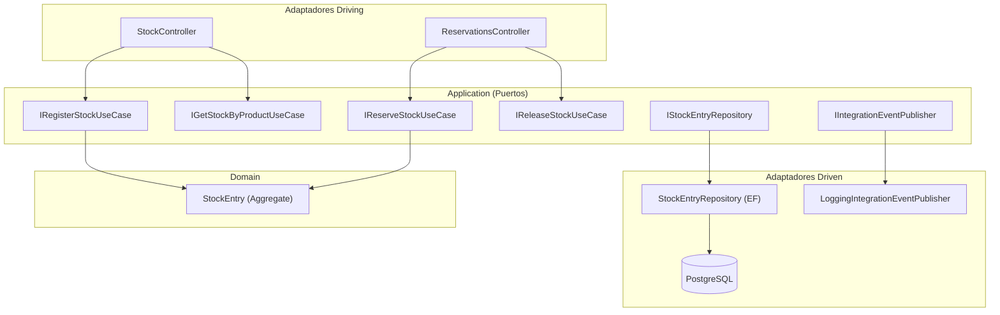

# Documento de Implementación — Microservicio Inventory (ShopDemo)

| Campo | Detalle |
|:------|:--------|
| **Empresa** | Lite Thinking |
| **Curso** | Microservicios con .NET en Kubernetes y Entornos Multicloud |
| **Instructor** | Lcc. Gilberto Valentino Juárez Sánchez |
| **Contacto** | WhatsApp: +52 5614206660 |
| | E-mail: gilberto.juarez@gmail.com |
| | E-mail: lcc.gilberto.juarez@gmail.com |

**Tipo:** Guía de implementación con código funcional de referencia  
**Arquitectura:** Hexagonal (Ports & Adapters)  
**Versión:** 1.0  
**Prerequisito:** Catalog y Orders implementados + `ShopDemo.Shared` disponible

> Este documento describe paso a paso la implementación del microservicio **Inventory**. Los alumnos deben seguir `REQUERIMIENTOS-INVENTORY.md` y usar este documento para validar su solución.

**Guía de desarrollo:** [GUIA-DESARROLLO-INTEGRACIONES.md](../GUIA-DESARROLLO-INTEGRACIONES.md)  
**Código completo:** [ANEXO-CODIGO-INVENTORY.md](./ANEXO-CODIGO-INVENTORY.md) — todos los `.cs` de Inventory listos para pegar en cada ruta (excluye migraciones EF; genéralas con `dotnet ef migrations add`).

---

## Índice

1. [Visión hexagonal](#1-visión-hexagonal)
2. [Configuración inicial de proyectos](#2-configuración-inicial-de-proyectos)
3. [Capa Domain (núcleo)](#3-capa-domain-núcleo)
4. [Capa Application (puertos y casos de uso)](#4-capa-application-puertos-y-casos-de-uso)
5. [Capa Infrastructure (adaptadores driven)](#5-capa-infrastructure-adaptadores-driven)
6. [Capa API (adaptadores driving)](#6-capa-api-adaptadores-driving)
7. [Integración Orders → Inventory](#7-integración-orders--inventory)
8. [Docker](#8-docker)
9. [Migraciones y ejecución](#9-migraciones-y-ejecución)
10. [Pruebas manuales del flujo integrado](#10-pruebas-manuales-del-flujo-integrado)

---

## 1. Visión hexagonal

A diferencia de Catalog y Orders (Clean Architecture + MediatR), Inventory usa **arquitectura hexagonal**:

| Concepto | Ubicación en Inventory |
|---|---|
| **Núcleo de dominio** | `ShopDemo.Inventory.Domain` |
| **Puertos de entrada (inbound)** | Interfaces en `Application/Ports/Inbound` |
| **Casos de uso** | Clases en `Application/UseCases` que implementan inbound ports |
| **Puertos de salida (outbound)** | Interfaces en `Application/Ports/Outbound` |
| **Adaptadores driving** | Controllers HTTP en `Api/Adapters/Http` |
| **Adaptadores driven** | EF Core, logging de eventos en `Infrastructure/Adapters` |



**Regla clave:** los controllers **no** conocen EF Core ni el dominio directamente; solo invocan **puertos de entrada**.

---

## 2. Configuración inicial de proyectos

### 2.1 Estructura de carpetas

```
Source/Inventory/
├── ShopDemo.Inventory.Domain/
├── ShopDemo.Inventory.Application/
├── ShopDemo.Inventory.Infrastructure/
└── ShopDemo.Inventory.Api/
```

### 2.2 Crear proyectos y referencias

```bash
cd I:\Curso\ShopDemo

dotnet new classlib -n ShopDemo.Inventory.Domain -o Source/Inventory/ShopDemo.Inventory.Domain -f net10.0
dotnet new classlib -n ShopDemo.Inventory.Application -o Source/Inventory/ShopDemo.Inventory.Application -f net10.0
dotnet new classlib -n ShopDemo.Inventory.Infrastructure -o Source/Inventory/ShopDemo.Inventory.Infrastructure -f net10.0
dotnet new webapi -n ShopDemo.Inventory.Api -o Source/Inventory/ShopDemo.Inventory.Api -f net10.0

# Domain
dotnet add Source/Inventory/ShopDemo.Inventory.Domain/ShopDemo.Inventory.Domain.csproj reference Source/ShopDemo.Shared/ShopDemo.Shared.csproj

# Application
dotnet add Source/Inventory/ShopDemo.Inventory.Application/ShopDemo.Inventory.Application.csproj reference Source/Inventory/ShopDemo.Inventory.Domain/ShopDemo.Inventory.Domain.csproj
dotnet add Source/Inventory/ShopDemo.Inventory.Application/ShopDemo.Inventory.Application.csproj reference Source/ShopDemo.Shared/ShopDemo.Shared.csproj

# Infrastructure
dotnet add Source/Inventory/ShopDemo.Inventory.Infrastructure/ShopDemo.Inventory.Infrastructure.csproj reference Source/Inventory/ShopDemo.Inventory.Application/ShopDemo.Inventory.Application.csproj
dotnet add Source/Inventory/ShopDemo.Inventory.Infrastructure/ShopDemo.Inventory.Infrastructure.csproj reference Source/Inventory/ShopDemo.Inventory.Domain/ShopDemo.Inventory.Domain.csproj
dotnet add Source/Inventory/ShopDemo.Inventory.Infrastructure/ShopDemo.Inventory.Infrastructure.csproj reference Source/ShopDemo.Shared/ShopDemo.Shared.csproj
dotnet add Source/Inventory/ShopDemo.Inventory.Infrastructure/ShopDemo.Inventory.Infrastructure.csproj package Microsoft.EntityFrameworkCore
dotnet add Source/Inventory/ShopDemo.Inventory.Infrastructure/ShopDemo.Inventory.Infrastructure.csproj package Npgsql.EntityFrameworkCore.PostgreSQL

# Api
dotnet add Source/Inventory/ShopDemo.Inventory.Api/ShopDemo.Inventory.Api.csproj reference Source/Inventory/ShopDemo.Inventory.Infrastructure/ShopDemo.Inventory.Infrastructure.csproj
dotnet add Source/Inventory/ShopDemo.Inventory.Api/ShopDemo.Inventory.Api.csproj reference Source/Inventory/ShopDemo.Inventory.Application/ShopDemo.Inventory.Application.csproj
dotnet add Source/Inventory/ShopDemo.Inventory.Api/ShopDemo.Inventory.Api.csproj package Swashbuckle.AspNetCore
dotnet add Source/Inventory/ShopDemo.Inventory.Api/ShopDemo.Inventory.Api.csproj package Microsoft.EntityFrameworkCore.Design
```

### 2.3 Agregar a la solución

En `Source/ShopDemo.slnx`, añadir la carpeta `/Inventory/` con los cuatro proyectos.

---

## 3. Capa Domain (núcleo)

El dominio no depende de ninguna otra capa. Solo usa `ShopDemo.Shared` para primitivas DDD.

> **Nota para alumnos:** Las secciones de este documento explican la arquitectura hexagonal. El código **completo** (sin `/* valida */`) está en [ANEXO-CODIGO-INVENTORY.md](./ANEXO-CODIGO-INVENTORY.md).

### 3.1 `StockQuantity` — Value Object

**Archivo:** `ShopDemo.Inventory.Domain/ValueObjects/StockQuantity.cs`

**Explicación:** Encapsula la cantidad de unidades disponibles. Impide valores negativos y centraliza las operaciones `Increase` / `Decrease` con validación de stock insuficiente.

```csharp
public sealed class StockQuantity : ValueObject
{
    public int Value { get; }
    public static StockQuantity Of(int value) { /* valida >= 0 */ }
    public static StockQuantity Zero => new(0);
    public StockQuantity Decrease(int units) { /* valida stock suficiente */ }
    public StockQuantity Increase(int units) { /* valida units > 0 */ }
}
```

### 3.2 `ProductReference` — Value Object

**Archivo:** `ShopDemo.Inventory.Domain/ValueObjects/ProductReference.cs`

**Explicación:** Referencia al producto de Catalog. El `ProductId` es el identificador compartido entre bounded contexts (sin FK entre bases de datos).

### 3.3 `StockEntry` — Agregado raíz

**Archivo:** `ShopDemo.Inventory.Domain/Aggregates/StockEntry.cs`

**Explicación:** Agregado principal de inventario. Su `Id` coincide con `ProductId` de Catalog. Expone comportamiento de negocio:

| Método | Descripción |
|---|---|
| `Register` | Crea entrada de stock inicial |
| `Replenish` | Aumenta unidades (reabastecimiento) |
| `Reserve` | Descuenta unidades al confirmar pedido |
| `Release` | Devuelve unidades al cancelar pedido |

Emite eventos de dominio: `StockEntryRegistered`, `StockReserved`, `StockReleased`, `StockDepleted`.

### 3.4 `InventoryDomainException`

**Archivo:** `ShopDemo.Inventory.Domain/Exceptions/InventoryDomainException.cs`

**Explicación:** Excepción de reglas de negocio del bounded context Inventory.

### 3.5 Eventos de dominio

**Archivo:** `ShopDemo.Inventory.Domain/Events/InventoryDomainEvents.cs`

**Explicación:** Records que implementan `IDomainEvent` de Shared. Se publican tras operaciones de stock para integración futura (Event Hubs).

---

## 4. Capa Application (puertos y casos de uso)

En hexagonal, Application define **contratos** (puertos) y **orquestación** (casos de uso). No usa MediatR.

### 4.1 Puertos de entrada (Inbound Ports)

| Interfaz | Responsabilidad |
|---|---|
| `IRegisterStockUseCase` | Registrar o reabastecer stock |
| `IGetStockByProductUseCase` | Consultar stock por ProductId |
| `IReserveStockUseCase` | Reservar unidades (invocado por Orders) |
| `IReleaseStockUseCase` | Liberar unidades (invocado por Orders) |

**Ubicación:** `ShopDemo.Inventory.Application/Ports/Inbound/`

Cada puerto define su `Request` record (DTO de entrada del caso de uso).

### 4.2 Puertos de salida (Outbound Ports)

| Interfaz | Responsabilidad |
|---|---|
| `IStockEntryRepository` | Persistencia del agregado `StockEntry` |
| `IIntegrationEventPublisher` | Publicación de eventos de integración |

**Ubicación:** `ShopDemo.Inventory.Application/Ports/Outbound/`

### 4.3 DTOs

**Archivo:** `ShopDemo.Inventory.Application/DTOs/StockEntryDto.cs`

**Explicación:** Proyección de lectura del agregado para la API. Incluye `FromAggregate` para mapear desde dominio sin exponer entidades.

### 4.4 Casos de uso

#### `RegisterStockUseCase`

**Explicación:** Si el producto no existe en inventario, crea `StockEntry.Register`. Si ya existe, llama `Replenish`. Persiste y publica eventos.

#### `GetStockByProductUseCase`

**Explicación:** Consulta por `ProductId` y devuelve `StockEntryDto` o `null` (404 en API).

#### `ReserveStockUseCase`

**Explicación:** Itera las líneas del pedido, carga cada `StockEntry`, ejecuta `Reserve(quantity, orderId)` y persiste. Falla si no hay stock suficiente.

#### `ReleaseStockUseCase`

**Explicación:** Similar a reserva pero invoca `Release` para devolver unidades al inventario.

**Ubicación:** `ShopDemo.Inventory.Application/UseCases/`

---

## 5. Capa Infrastructure (adaptadores driven)

Implementa los **outbound ports** con tecnología concreta.

### 5.1 `InventoryDbContext`

**Archivo:** `Infrastructure/Adapters/Persistence/InventoryDbContext.cs`

**Explicación:** DbContext de EF Core. Aplica configuraciones desde el mismo ensamblado (`ApplyConfigurationsFromAssembly`).

### 5.2 `StockEntryConfiguration`

**Archivo:** `Infrastructure/Adapters/Persistence/Configurations/StockEntryConfiguration.cs`

**Explicación:** Mapea `StockEntry` a tabla `stock_entries`. `AvailableUnits` se persiste como columna `available_units` (owned type / value conversion).

### 5.3 `StockEntryRepository`

**Explicación:** Adaptador driven que implementa `IStockEntryRepository` usando EF Core.

### 5.4 `UnitOfWork`

**Explicación:** Implementa `IUnitOfWork` de Shared; delega `SaveChangesAsync` al DbContext.

### 5.5 `LoggingIntegrationEventPublisher`

**Archivo:** `Infrastructure/Adapters/Messaging/LoggingIntegrationEventPublisher.cs`

**Explicación:** En desarrollo, registra eventos en log (simula Azure Event Hubs). Sustituible por adaptador real sin cambiar casos de uso.

### 5.6 `DatabaseInitializer`

**Explicación:** Asegura que la base de datos exista antes de aplicar migraciones (útil en Docker).

### 5.7 `DependencyInjection`

**Archivo:** `Infrastructure/DependencyInjection.cs`

**Explicación:** Registra DbContext, repositorio, UnitOfWork, publisher y **vincula cada inbound port con su caso de uso**:

```csharp
services.AddScoped<IRegisterStockUseCase, RegisterStockUseCase>();
services.AddScoped<IGetStockByProductUseCase, GetStockByProductUseCase>();
services.AddScoped<IReserveStockUseCase, ReserveStockUseCase>();
services.AddScoped<IReleaseStockUseCase, ReleaseStockUseCase>();
```

---

## 6. Capa API (adaptadores driving)

Los controllers son **adaptadores HTTP** que traducen requests REST a llamadas a inbound ports.

### 6.1 `StockController`

**Archivo:** `Api/Adapters/Http/StockController.cs`

| Endpoint | Puerto invocado |
|---|---|
| `POST /api/inventory/stock` | `IRegisterStockUseCase` |
| `GET /api/inventory/{productId}` | `IGetStockByProductUseCase` |

### 6.2 `ReservationsController`

**Archivo:** `Api/Adapters/Http/ReservationsController.cs`

| Endpoint | Puerto invocado |
|---|---|
| `POST /api/inventory/reservations` | `IReserveStockUseCase` |
| `POST /api/inventory/reservations/release` | `IReleaseStockUseCase` |

**Nota:** Estos endpoints no están pensados para consumo directo del usuario final; los invoca **Orders API** al confirmar/cancelar pedidos.

### 6.3 `ExceptionHandlingMiddleware`

**Explicación:** Mapea excepciones de dominio a códigos HTTP (400, 404, 409, 500) con `application/problem+json`.

### 6.4 `Program.cs`

**Explicación:**

1. Registra controllers y Swagger.
2. Llama `AddInventoryInfrastructure`.
3. Ejecuta `DatabaseInitializer` y `MigrateAsync`.
4. Configura middleware y mapea controllers.

**Puerto API:** `8003` (Docker) / `5260` (local).

---

## 7. Integración Orders → Inventory

Orders no conoce el dominio de Inventory. Usa un **puerto de salida** y un **adaptador HTTP**.

### 7.1 Puerto en Orders Application

**Archivo:** `Source/Orders/ShopDemo.Orders.Application/Ports/IInventoryService.cs`

```csharp
public interface IInventoryService
{
    Task ReserveStockAsync(Guid orderId, IReadOnlyList<InventoryLineRequest> lines, CancellationToken ct = default);
    Task ReleaseStockAsync(Guid orderId, IReadOnlyList<InventoryLineRequest> lines, CancellationToken ct = default);
}
```

### 7.2 Adaptador HTTP en Orders Infrastructure

**Archivo:** `Source/Orders/ShopDemo.Orders.Infraestructure/Integrations/InventoryHttpClient.cs`

**Explicación:** Implementa `IInventoryService` con `HttpClient`. Llama a los endpoints de reserva/liberación de Inventory.

### 7.3 Registro en DI de Orders

En `DependencyInjection.cs` de Orders:

```csharp
var inventoryBaseUrl = configuration["InventoryApi:BaseUrl"] ?? "http://localhost:8003";
services.AddHttpClient<IInventoryService, InventoryHttpClient>(client =>
{
    client.BaseAddress = new Uri(inventoryBaseUrl.TrimEnd('/') + "/");
});
```

### 7.4 Handlers modificados

**`ConfirmOrderHandler`:** Antes de `order.Confirm()`, invoca `inventoryService.ReserveStockAsync` con las líneas del pedido.

**`CancelOrderHandler`:** Si el pedido estaba `Confirmed`, invoca `inventoryService.ReleaseStockAsync` antes de cancelar.

### 7.5 Configuración

En `Source/Orders/ShopDemo.Orders.Api/appsettings.json`:

```json
"InventoryApi": {
  "BaseUrl": "http://localhost:8003"
}
```

En Docker Compose de Orders, usar `InventoryApi__BaseUrl=http://host.docker.internal:8003` para alcanzar Inventory en el host.

---

## 8. Docker

> **Copiar del repo:** `Source/Inventory/ShopDemo.Inventory.Api/docker-compose.yml` incluye **Azurite** para checkpoints (local/K8s). En Azure ACA el release usa **Storage Account** — ver [IMPLEMENTACION-DESPLIEGUE-AZURE §7](../despliegue/azure/IMPLEMENTACION-DESPLIEGUE-AZURE.md#7-paso-5--storage-account-checkpoints-aca).

### 8.1 `docker-compose.yml` (Inventory)

**Ubicación:** `Source/Inventory/ShopDemo.Inventory.Api/docker-compose.yml`

```yaml
services:
  inventory-db:
    image: postgres:16-alpine
    ports:
      - "5435:5432"
    # ... POSTGRES_DB ShopDemoInventory, healthcheck

  azurite:
    image: mcr.microsoft.com/azure-storage/azurite
    ports:
      - "10000:10000"
    command: azurite-blob --blobHost 0.0.0.0 --blobPort 10000 --location /data

  inventory-service:
    build:
      context: ../..
      dockerfile: Source/Inventory/ShopDemo.Inventory.Api/Dockerfile
    ports:
      - "8003:8080"
    environment:
      - EventHubs__CheckpointStorageConnectionString=...BlobEndpoint=http://azurite:10000/devstoreaccount1;
      - EventHubs__CheckpointContainerName=inventory-checkpoints
```

| Servicio | Puerto host | Descripción |
|---|---|---|
| `inventory-db` | 5435 | PostgreSQL `ShopDemoInventory` |
| `azurite` | 10000 | Checkpoints Event Hubs (local) |
| `inventory-service` | 8003 | API Inventory |

Código YAML completo: copiar archivo del repo (incluye `depends_on` y volúmenes).

### 8.2 `Dockerfile`

**Ubicación:** `Source/Inventory/ShopDemo.Inventory.Api/Dockerfile` — contexto de build: **raíz del repositorio** (`../..` en compose).

### 8.3 Script init PostgreSQL

`Source/Inventory/ShopDemo.Inventory.Api/docker/postgres/init/01-init-shopdemoinventory.sql` — permisos en schema `public`.

---

## 9. Migraciones y ejecución

### 9.1 Crear migración

```bash
cd Source/Inventory/ShopDemo.Inventory.Api
dotnet ef migrations add InitialCreate \
  --project ../ShopDemo.Inventory.Infrastructure/ShopDemo.Inventory.Infrastructure.csproj \
  --output-dir Adapters/Persistence/Migrations
```

### 9.2 Levantar Inventory con Docker

```bash
cd Source/Inventory/ShopDemo.Inventory.Api
docker compose up --build
```

### 9.3 Ejecutar local (sin Docker)

1. PostgreSQL en puerto **5435** con BD `ShopDemoInventory`.
2. `dotnet run --project Source/Inventory/ShopDemo.Inventory.Api`
3. Swagger: `http://localhost:5260/swagger`

---

## 10. Pruebas manuales del flujo integrado

Ejecutar los tres servicios (Catalog :8001, Orders :8002, Inventory :8003).

### Paso 1 — Crear producto (Catalog)

```http
POST http://localhost:8001/api/products
Content-Type: application/json

{
  "name": "Teclado Mecánico",
  "description": "RGB",
  "price": 89.99,
  "currency": "USD",
  "category": "Electronics",
  "initialStock": 10
}
```

Guardar el `id` del producto → `PRODUCT_ID`.

### Paso 2 — Registrar stock (Inventory)

```http
POST http://localhost:8003/api/inventory/stock
Content-Type: application/json

{
  "productId": "PRODUCT_ID",
  "productName": "Teclado Mecánico",
  "units": 50
}
```

### Paso 3 — Crear pedido (Orders)

```http
POST http://localhost:8002/api/orders
Content-Type: application/json

{
  "customerId": "11111111-1111-1111-1111-111111111111",
  "shippingAddress": {
    "street": "Calle 1",
    "city": "CDMX",
    "state": "CDMX",
    "postalCode": "01000",
    "country": "MX"
  },
  "lines": [
    {
      "productId": "PRODUCT_ID",
      "productName": "Teclado Mecánico",
      "unitPrice": 89.99,
      "currency": "USD",
      "quantity": 2
    }
  ]
}
```

Guardar `id` del pedido → `ORDER_ID`.

### Paso 4 — Confirmar pedido (reserva stock automática)

```http
POST http://localhost:8002/api/orders/ORDER_ID/confirm
```

Orders llama internamente a `POST /api/inventory/reservations`.

### Paso 5 — Consultar stock

```http
GET http://localhost:8003/api/inventory/PRODUCT_ID
```

Esperado: `availableUnits` = 48 (50 − 2).

### Paso 6 — Cancelar pedido (libera stock)

```http
POST http://localhost:8002/api/orders/ORDER_ID/cancel
Content-Type: application/json

{ "reason": "Cliente solicitó cancelación" }
```

### Paso 7 — Verificar stock restaurado

```http
GET http://localhost:8003/api/inventory/PRODUCT_ID
```

Esperado: `availableUnits` = 50.

---

## Resumen de clases implementadas

| Clase / Interfaz | Capa | Rol en hexagonal |
|---|---|---|
| `StockEntry` | Domain | Agregado raíz (núcleo) |
| `StockQuantity`, `ProductReference` | Domain | Value Objects |
| `InventoryDomainException` | Domain | Errores de negocio |
| `*DomainEvent` | Domain | Eventos de dominio |
| `IRegisterStockUseCase` (+ otros inbound) | Application | Puerto de entrada |
| `IStockEntryRepository`, `IIntegrationEventPublisher` | Application | Puertos de salida |
| `RegisterStockUseCase` (+ otros) | Application | Casos de uso |
| `StockEntryDto` | Application | DTO de salida |
| `StockEntryRepository` | Infrastructure | Adaptador driven (persistencia) |
| `LoggingIntegrationEventPublisher` | Infrastructure | Adaptador driven (mensajería) |
| `InventoryDbContext` | Infrastructure | EF Core |
| `StockController`, `ReservationsController` | Api | Adaptadores driving (HTTP) |
| `ExceptionHandlingMiddleware` | Api | Manejo transversal de errores |
| `IInventoryService` | Orders Application | Puerto hacia Inventory |
| `InventoryHttpClient` | Orders Infrastructure | Adaptador HTTP driven |

---

## Comparación con Source/Catalog/Orders

| Aspecto | Catalog / Orders | Inventory |
|---|---|---|
| Estilo arquitectónico | Clean Architecture | Hexagonal |
| Orquestación | MediatR (Commands/Queries) | Casos de uso + Inbound Ports |
| Controllers | Envían Commands/Queries | Invocan interfaces de use case |
| Integración entre servicios | No implementada (solo eventos log) | Orders → Inventory vía HTTP |

Esta diferencia es intencional para que el curso compare ambos enfoques en el mismo dominio de e-commerce.
