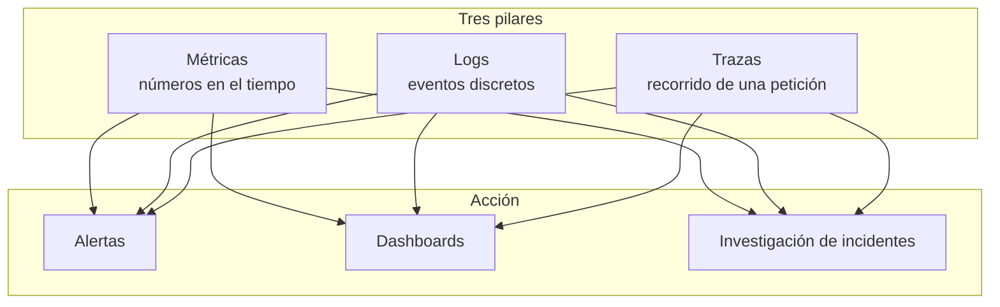
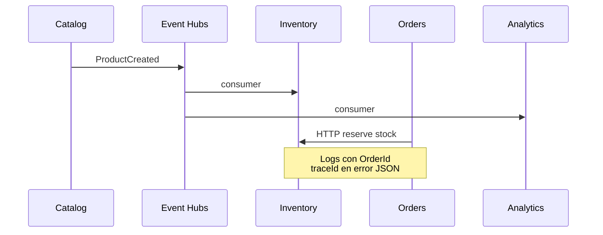

# Teoría — Observabilidad de microservicios (ShopDemo)

| Campo | Detalle |
|:------|:--------|
| **Empresa** | Lite Thinking |
| **Curso** | Microservicios con .NET en Kubernetes y Entornos Multicloud |
| **Instructor** | Lcc. Gilberto Valentino Juárez Sánchez |
| **Contacto** | WhatsApp: +52 5614206660 |
| | E-mail: gilberto.juarez@gmail.com |
| | E-mail: lcc.gilberto.juarez@gmail.com |

**Alcance:** Conceptos aplicables a ShopDemo en Azure (ACA, AKS) y AWS (ECS, EKS).

---

## Índice

1. [Los tres pilares](#1-los-tres-pilares)
2. [Métricas](#2-métricas)
3. [Logs](#3-logs)
4. [Trazas](#4-trazas)
5. [Agregación de registros](#5-agregación-de-registros)
6. [Correlación y causalidad](#6-correlación-y-causalidad)
7. [Capacidad de reacción y preparación](#7-capacidad-de-reacción-y-preparación)
8. [ShopDemo en la práctica](#8-shopdemo-en-la-práctica)
9. [Mapa Azure vs AWS](#9-mapa-azure-vs-aws)

---

## 1. Los tres pilares

La **observabilidad** permite entender el comportamiento interno de un sistema distribuido a partir de sus salidas externas.



| Pilar | Pregunta que responde | Ejemplo ShopDemo |
|---|---|---|
| **Métricas** | ¿Cuánto y con qué frecuencia? | Requests/s a Catalog, CPU del pod Orders |
| **Logs** | ¿Qué pasó y cuándo? | `Reserving stock for order {OrderId}` |
| **Trazas** | ¿Qué servicios participaron en una operación? | Crear pedido → llamada HTTP a Inventory |

---

## 2. Métricas

Son **mediciones numéricas agregadas** en el tiempo (contadores, gauges, histogramas).

| Tipo | Uso |
|---|---|
| **Infraestructura** | CPU, memoria, reinicios de contenedor |
| **Aplicación** | Latencia HTTP, tasa de errores 5xx |
| **Negocio / integración** | Mensajes en Event Hubs, pedidos confirmados |

En ShopDemo:

- **Plataforma:** métricas del contenedor en ACA/AKS/ECS/EKS.
- **Event Hubs:** métricas *Incoming/Outgoing Messages* en Azure Portal.
- **Analytics / Aspire:** OpenTelemetry expone métricas de runtime y HTTP cuando se usa `ServiceDefaults` con exportador OTLP.

---

## 3. Logs

Los **logs** son registros de eventos con timestamp y contexto. En .NET se usan con `ILogger<T>`.

```csharp
logger.LogInformation("Reserving stock in Inventory for order {OrderId}", orderId);
```

Buenas prácticas en microservicios:

| Práctica | ShopDemo |
|---|---|
| Logs estructurados (plantillas con `{Nombre}`) | Sí en `InventoryHttpClient`, publishers Event Hubs |
| Nivel adecuado (Information / Warning / Error) | `ExceptionHandlingMiddleware` |
| No loguear secretos | Connection strings solo en configuración |

---

## 4. Trazas

Una **traza** sigue el camino de una operación a través de varios servicios.

| Enfoque | ShopDemo (código actual) |
|---|---|
| **traceId** por petición HTTP | `context.TraceIdentifier` en respuestas Problem Details |
| **OpenTelemetry** | Analytics + Aspire Dashboard (local, vía OTLP) |
| **Trazas distribuidas en nube** | Application Insights (Azure) / X-Ray (AWS) — ver guías de implementación |

---

## 5. Agregación de registros

En microservicios cada pod/contenedor genera logs en su filesystem. La **agregación** los centraliza en un repositorio consultable.

| Entorno | Destino típico |
|---|---|
| Azure ACA / AKS | **Log Analytics** (workspace) |
| AWS ECS / EKS | **CloudWatch Logs** |

Sin agregación, depurar un flujo E2E (Catalog → Orders → Inventory) obliga a entrar pod por pod.

---

## 6. Correlación y causalidad

**Correlación:** vincular logs, métricas y trazas que pertenecen a la **misma operación**.

| Mecanismo | ShopDemo |
|---|---|
| `traceId` en JSON de error | Buscar en Log Analytics / CloudWatch por ese ID |
| Request ID de plataforma | Headers que añade el balanceador / Ingress |
| OpenTelemetry TraceId | Analytics cuando OTLP está activo |

**Causalidad:** entender *por qué* falló algo (ej. Orders devolvió 500 porque Inventory no respondió). Se investiga siguiendo el `traceId` y los logs de `InventoryHttpClient` en la misma ventana de tiempo.

---

## 7. Capacidad de reacción y preparación

| Concepto | Significado práctico |
|---|---|
| **Preparación** | Dashboards, health checks, métricas baseline antes del incidente |
| **Reacción** | Alertas cuando CPU > umbral, 5xx > N, pod en CrashLoop |

ShopDemo ya expone `/health` y `/alive` para que la plataforma detecte instancias no listas. Las alertas se configuran en **Azure Monitor** o **CloudWatch Alarms**.

---

## 8. ShopDemo en la práctica



**Flujo de investigación típico:**

1. Usuario reporta error al confirmar pedido.
2. Copiar `traceId` de la respuesta HTTP.
3. Buscar en logs centralizados de Orders e Inventory en el mismo minuto.
4. Revisar métricas de CPU/reinicios y health del pod Inventory.

---

## 9. Mapa Azure vs AWS

| Capacidad | Azure | AWS |
|---|---|---|
| Agregación logs | Log Analytics | CloudWatch Logs |
| Métricas contenedores | Container Insights / ACA metrics | Container Insights (EKS) / ECS metrics |
| Trazas / APM | Application Insights | X-Ray (opcional) |
| Alertas | Azure Monitor Alerts | CloudWatch Alarms |
| Dashboards | Azure Workbooks / Grafana | CloudWatch Dashboards |

---

## Referencias

- [REQUERIMIENTOS-OBSERVABILIDAD.md](./REQUERIMIENTOS-OBSERVABILIDAD.md)
- [INTEGRACION-ASPIRE.md](../INTEGRACION-ASPIRE.md) — OpenTelemetry local
- [TEORIA-KUBERNETES-OPERACIONES.md](../despliegue/kubernetes/TEORIA-KUBERNETES-OPERACIONES.md) — probes
