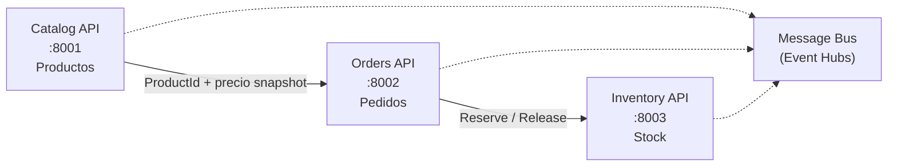
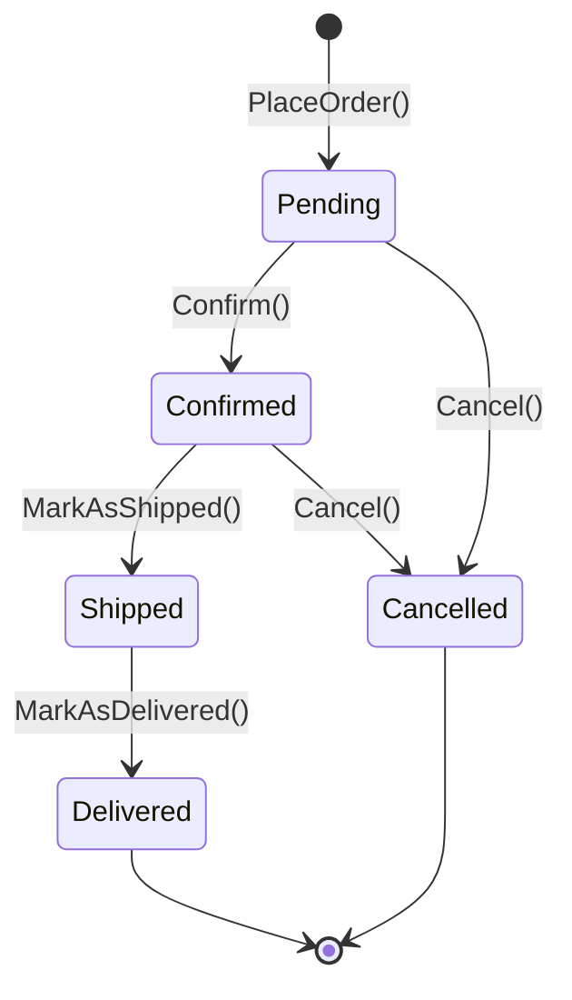

# Anexo — Especificación técnica: Orders (ShopDemo)

| Campo | Detalle |
|:------|:--------|
| **Requerimientos de negocio** | [REQUERIMIENTOS-ORDERS.md](./REQUERIMIENTOS-ORDERS.md) |
| **Capa** | B — Especificación técnica |

**Arquitectura:** Clean Architecture + CQRS (MediatR)  
**Bounded Context:** Orders

---

## 1. Contexto técnico en la plataforma



| Microservicio | Base de datos | Puerto API | Puerto PostgreSQL (host) |
|---|---|---|---|
| Catalog | `ShopDemoCatalog` | `8001` | `5433` |
| **Orders** | **`ShopDemoOrders`** | **`8002`** | **`5434`** |
| Inventory | `ShopDemoInventory` | `8003` | `5435` |

> Orders usa puertos distintos para evitar colisión con Catalog y con PostgreSQL local (5432).

---

## 2. Modelo de dominio

### 2.1 Agregado raíz: `Order`

```
Order (AggregateRoot<Guid>)
├── CustomerId         (Value Object)
├── ShippingAddress    (Value Object)
├── OrderStatus        (Value Object)
├── Money TotalAmount  (Value Object)
├── List<OrderLine>    (Entidades hijas)
├── DateTimeOffset CreatedAt
└── DateTimeOffset? LastUpdatedAt
```

### 2.2 Entidad hija: `OrderLine`

```
OrderLine (Entity<Guid>)
├── ProductId          (Guid — referencia externa a Catalog)
├── ProductName        (string — snapshot)
├── UnitPrice          (Money — snapshot al momento del pedido)
├── Quantity           (int)
└── LineTotal          (Money — calculado)
```

> **Decisión de diseño:** Orders guarda **snapshot** del nombre y precio del producto. No referencia el agregado `Product` de Catalog para mantener autonomía del bounded context.

### 2.3 Value Objects

| Value Object | Reglas de validación |
|---|---|
| `CustomerId` | Guid no vacío (`Guid.Empty` inválido) |
| `Money` | Monto ≥ 0; moneda ISO 3 letras (default `MXN`) |
| `OrderStatus` | Valores: `Pending`, `Confirmed`, `Shipped`, `Delivered`, `Cancelled` |
| `ShippingAddress` | Street, City, PostalCode, Country — todos requeridos |
| `Quantity` | Entero > 0 |

### 2.4 Máquina de estados (dominio)



**Transiciones prohibidas:**

| Desde | Acción | Motivo |
|---|---|---|
| `Shipped` | `Cancel()` | El pedido ya fue enviado |
| `Delivered` | `Cancel()` | El pedido ya fue entregado |
| `Cancelled` | Cualquier modificación | Pedido cerrado |

### 2.5 Domain Events

| Evento | Cuándo se emite |
|---|---|
| `OrderPlacedDomainEvent` | Al crear el pedido (`PlaceOrder`) |
| `OrderConfirmedDomainEvent` | Al confirmar el pedido |
| `OrderCancelledDomainEvent` | Al cancelar el pedido |
| `OrderShippedDomainEvent` | Al marcar como enviado (opcional en MVP) |

### 2.6 Repositorio

`IOrderRepository` extiende `IRepository<Order, Guid>` con:

```csharp
Task<IReadOnlyList<Order>> GetByCustomerAsync(CustomerId customerId, CancellationToken ct = default);
Task<IReadOnlyList<Order>> GetByStatusAsync(OrderStatus status, int skip, int take, CancellationToken ct = default);
```

**Tablas PostgreSQL:**

| Tabla | Descripción |
|---|---|
| `orders` | Agregado Order |
| `order_lines` | Líneas del pedido (relación 1:N) |
| `__EFMigrationsHistory` | Control de migraciones EF Core |

---

## 3. API REST

### 3.1 Comandos (escritura)

| Caso de uso | HTTP | Ruta | Comando MediatR |
|---|---|---|---|
| Registrar pedido | `POST` | `/api/orders` | `PlaceOrderCommand` |
| Confirmar pedido | `POST` | `/api/orders/{id}/confirm` | `ConfirmOrderCommand` |
| Cancelar pedido | `POST` | `/api/orders/{id}/cancel` | `CancelOrderCommand` |

### 3.2 Consultas (lectura)

| Caso de uso | HTTP | Ruta | Query MediatR |
|---|---|---|---|
| Obtener pedido por Id | `GET` | `/api/orders/{id}` | `GetOrderByIdQuery` |
| Listar pedidos por cliente | `GET` | `/api/orders?customerId={guid}` | `GetOrdersByCustomerQuery` |

### 3.3 Payload — PlaceOrder

```json
{
  "customerId": "3fa85f64-5717-4562-b3fc-2c963f66afa6",
  "shippingAddress": {
    "street": "Av. Reforma 123",
    "city": "Ciudad de México",
    "postalCode": "06600",
    "country": "MX"
  },
  "lines": [
    {
      "productId": "7c9e6679-7425-40de-944b-e07fc1f90ae7",
      "productName": "Laptop Pro",
      "unitPrice": 1299.99,
      "currency": "MXN",
      "quantity": 1
    }
  ]
}
```

### 3.4 Respuesta — OrderDto

```json
{
  "id": "a1b2c3d4-e5f6-7890-abcd-ef1234567890",
  "customerId": "3fa85f64-5717-4562-b3fc-2c963f66afa6",
  "status": "Pending",
  "totalAmount": 1299.99,
  "currency": "MXN",
  "shippingAddress": {
    "street": "Av. Reforma 123",
    "city": "Ciudad de México",
    "postalCode": "06600",
    "country": "MX"
  },
  "lines": [
    {
      "id": "...",
      "productId": "7c9e6679-7425-40de-944b-e07fc1f90ae7",
      "productName": "Laptop Pro",
      "unitPrice": 1299.99,
      "currency": "MXN",
      "quantity": 1,
      "lineTotal": 1299.99
    }
  ],
  "createdAt": "2026-06-11T20:00:00Z",
  "lastUpdatedAt": null
}
```

### 3.5 Integración con Inventory

Flujo de confirmación:

```
ConfirmOrderHandler:
  1. Obtener Order
  2. Llamar IInventoryService.ReserveStockAsync(orderId, lines)
  3. order.Confirm()
  4. Persistir + publicar eventos
```

Flujo de cancelación:

```
CancelOrderHandler:
  1. Si order.Status == Confirmed → ReleaseStockAsync
  2. order.Cancel(reason)
```

### 3.6 Swagger

- Ruta: `/swagger` cuando `ASPNETCORE_ENVIRONMENT=Development`
- Título: **ShopDemo Orders API v1**

---

## 4. Estructura de proyectos y stack

```
Source/Orders/
├── ShopDemo.Orders.Domain/
├── ShopDemo.Orders.Application/
├── ShopDemo.Orders.Infraestructure/
└── ShopDemo.Orders.Api/
```

**Dependencias:** `Api → Infrastructure → Application → Domain → Shared`

| Componente | Tecnología |
|---|---|
| Runtime | .NET 10 |
| ORM | EF Core 10 + Npgsql |
| CQRS | MediatR 14.1 |
| Validación | FluentValidation 12.1 |
| API docs | Swashbuckle 10.2 |
| Base de datos | PostgreSQL 16 |

**Conexión (desarrollo):**

```json
{
  "ConnectionStrings": {
    "DefaultConnection": "Host=localhost;Port=5434;Database=ShopDemoOrders;Username=ShopDemo;Password=ShopDemo123"
  }
}
```

**Paquetes NuGet:**

| Proyecto | Paquetes |
|---|---|
| Orders.Application | `MediatR`, `FluentValidation`, `FluentValidation.DependencyInjectionExtensions` |
| Orders.Infraestructure | `Microsoft.EntityFrameworkCore`, `Npgsql.EntityFrameworkCore.PostgreSQL` |
| Orders.Api | `Swashbuckle.AspNetCore`, `Microsoft.EntityFrameworkCore.Design` |

**Docker Compose** (`ShopDemo.Orders.Api/docker-compose.yml`):

- Servicio `orders-db` (PostgreSQL 16)
- Servicio `orders-service` (API .NET 10)
- Puerto host PostgreSQL: **5434**
- Puerto host API: **8002**
- Healthcheck con `pg_isready -U ShopDemo -d ShopDemoOrders`

---

## 5. Criterios de aceptación técnicos (CA-T)

| ID | Criterio |
|---|---|
| CA-T01 | `Order.PlaceOrder()` es la única forma de crear pedidos |
| CA-T02 | `Order.Cancel()` valida estados prohibidos (Shipped, Delivered) |
| CA-T03 | `Order.Confirm()` solo funciona desde `Pending` |
| CA-T04 | Domain Events se levantan en cada cambio de estado relevante |
| CA-T05 | Value Objects invalidan datos incorrectos en construcción |
| CA-T06 | Handlers no contienen lógica de negocio (solo orquestan) |
| CA-T07 | FluentValidation valida comandos antes del handler |
| CA-T08 | DTOs nunca exponen el agregado directamente |
| CA-T09 | Pipeline MediatR incluye `ValidationBehavior` |
| CA-T10 | `IOrderRepository` implementado con EF Core |
| CA-T11 | Migración inicial generada y aplicada |
| CA-T12 | `IDomainEventPublisher` registrado (logging en dev) |
| CA-T13 | `POST /api/orders` retorna `201 Created` |
| CA-T14 | `GET /api/orders/{id}` retorna `200` o `404` |
| CA-T15 | Errores de dominio retornan `400 Bad Request` con `traceId` |
| CA-T16 | `docker compose up -d --build` levanta API y PostgreSQL |
| CA-T17 | Tablas `orders` y `order_lines` creadas tras migración |
| CA-T18 | Confirmar pedido invoca reserva en Inventory vía HTTP |
| CA-T19 | Cancelar pedido Confirmado invoca liberación en Inventory |

---

## 6. Referencias

- [IMPLEMENTACION-ORDERS.md](./IMPLEMENTACION-ORDERS.md)
- [ANEXO-HISTORIAS-TECNICAS-ORDERS.md](./ANEXO-HISTORIAS-TECNICAS-ORDERS.md)
- [ANEXO-ESPECIFICACION-TECNICA-INVENTORY.md](../inventory/ANEXO-ESPECIFICACION-TECNICA-INVENTORY.md)
- [ARQUITECTURA.md](../ARQUITECTURA.md)
