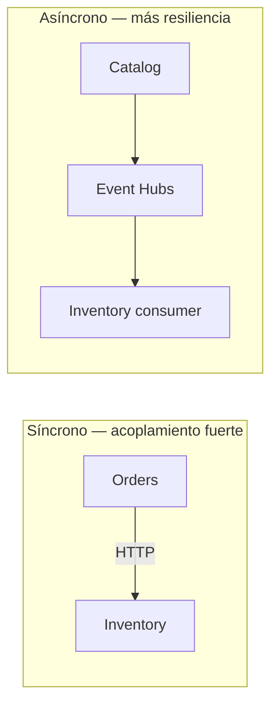

# Teoría — Resiliencia de servicios (ShopDemo)

| Campo | Detalle |
|:------|:--------|
| **Empresa** | Lite Thinking |
| **Curso** | Microservicios con .NET en Kubernetes y Entornos Multicloud |
| **Instructor** | Lcc. Gilberto Valentino Juárez Sánchez |
| **Contacto** | WhatsApp: +52 5614206660 |
| | E-mail: gilberto.juarez@gmail.com |
| | E-mail: lcc.gilberto.juarez@gmail.com |

---

## Índice

1. [¿Qué es resiliencia?](#1-qué-es-resiliencia)
2. [Patrones nativos de nube](#2-patrones-nativos-de-nube)
3. [Redundancia y continuidad](#3-redundancia-y-continuidad)
4. [Comunicación entre servicios](#4-comunicación-entre-servicios)
5. [ShopDemo: puntos fuertes y huecos](#5-shopdemo-puntos-fuertes-y-huecos)
6. [Mapa Azure vs AWS](#6-mapa-azure-vs-aws)
7. [Evolución futura (IA)](#7-evolución-futura-ia)

---

## 1. ¿Qué es resiliencia?

**Resiliencia** es la capacidad del sistema para **seguir operando** (o degradarse de forma controlada) ante fallos parciales: caída de un pod, timeout de red, pico de carga o indisponibilidad temporal de Inventory.

No es lo mismo que **alta disponibilidad** (múltiples zonas sin downtime), aunque comparten técnicas como réplicas y health checks.

---

## 2. Patrones nativos de nube

| Patrón | Descripción | Dónde en ShopDemo |
|---|---|---|
| **Reintentos (retry)** | Repetir llamada tras fallo transitorio | `AddStandardResilienceHandler` en ServiceDefaults (Analytics); Orders→Inventory **sin retry aún** |
| **Circuit breaker** | Dejar de llamar a un servicio caído | ServiceDefaults (futuro en Orders) |
| **Timeout** | Limitar espera de respuesta | Configurable en HttpClient / plataforma |
| **Health checks** | Detectar instancias malas | `/health`, `/alive` + probes K8s / ACA |
| **Bulkhead** | Aislar recursos por dependencia | Avanzado — fuera de alcance básico |
| **Mensajería asíncrona** | Desacoplar en el tiempo | **Event Hubs** Catalog → Inventory |

---

## 3. Redundancia y continuidad

| Mecanismo | Azure | AWS | ShopDemo |
|---|---|---|---|
| Múltiples réplicas | ACA min/max replicas | ECS desired count | K8s `replicas` + HPA Catalog |
| Reinicio automático | ACA revision / K8s restart | ECS task replacement | `livenessProbe` |
| Balanceo | ACA ingress / App Gateway | ALB / NLB | Ingress NGINX |
| Persistencia | PostgreSQL StatefulSet / ACI | ECS + EFS / EKS PVC | `k8s/postgres/` |

**Continuidad del negocio (básico):** si Inventory cae, Orders no puede confirmar pedidos (síncrono); con Event Hubs, el stock puede actualizarse cuando Inventory vuelva (asíncrono).

---

## 4. Comunicación entre servicios

| Estilo | Ventaja | Riesgo |
|---|---|---|
| **HTTP síncrono** | Respuesta inmediata, simple | Cascada de fallos si Inventory no responde |
| **Eventos** | Desacoplamiento temporal | Consistencia eventual |

ShopDemo usa **ambos**: confirmar pedido requiere Inventory en línea; crear producto puede propagarse por Event Hubs.

---

## 5. ShopDemo: puntos fuertes y huecos

| Fortaleza | Detalle |
|---|---|
| Health endpoints | Plataforma retira instancias no listas |
| HPA Catalog | Escala ante CPU alta |
| Event Hubs | Reduce dependencia síncrona en creación de stock |
| Logging en integraciones | `InventoryHttpClient` registra `OrderId` |

| Hueco documentado | Mitigación en nube (sin código) |
|---|---|
| Sin retry en Orders→Inventory | Réplicas Inventory + alertas; futuro: Polly |
| Sin circuit breaker en APIs legacy | Timeouts de plataforma / Ingress |
| Single-node Postgres en lab | Backup manual; Azure/AWS DB managed en producción real |

---

## 6. Mapa Azure vs AWS

| Resiliencia | Azure ACA | Azure AKS | AWS ECS | AWS EKS |
|---|---|---|---|---|
| Health probes | TCP/HTTP en Container App | K8s probes | ALB + container health | K8s probes |
| Escalado | HTTP scale rules / min-max | HPA | Service Auto Scaling | HPA |
| Despliegue seguro | Revisiones + traffic split | Rolling update | Circuit breaker deployment | Rolling update |
| Red interna | VNet integration | ClusterIP | Cloud Map | ClusterIP |

---

## 7. Evolución futura (IA)

La **predicción de fallos con IA** (anomalías, forecasting) se cubre conceptualmente como evolución usando:

- Azure Monitor metric anomalies (futuro)
- CloudWatch Anomaly Detection (futuro)

**No forma parte de la implementación básica** de esta etapa del curso.

---

## Referencias

- [REQUERIMIENTOS-RESILIENCIA.md](./REQUERIMIENTOS-RESILIENCIA.md)
- [TEORIA-KUBERNETES-OPERACIONES.md](../despliegue/kubernetes/TEORIA-KUBERNETES-OPERACIONES.md)
- [INTEGRACION-AZURE-EVENT-HUBS.md](../INTEGRACION-AZURE-EVENT-HUBS.md)
