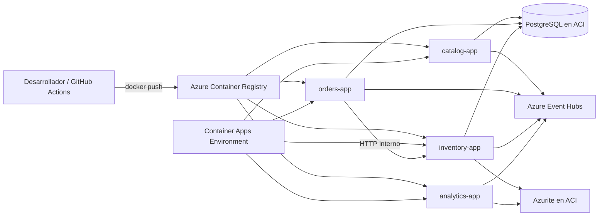
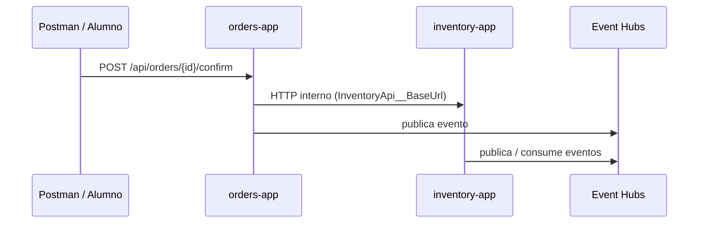

# Teoría — Contenedores en Azure (ShopDemo)

| Campo | Detalle |
|:------|:--------|
| **Empresa** | Lite Thinking |
| **Curso** | Microservicios con .NET en Kubernetes y Entornos Multicloud |
| **Instructor** | Lcc. Gilberto Valentino Juárez Sánchez |
| **Contacto** | WhatsApp: +52 5614206660 |
| | E-mail: gilberto.juarez@gmail.com |
| | E-mail: lcc.gilberto.juarez@gmail.com |

**Tema principal:** Despliegue de microservicios .NET en **Azure Container Apps**  
**Versión:** 1.0

---

## 1. ¿Por qué contenedores en la nube?

Un **contenedor** empaqueta la aplicación con sus dependencias en una imagen inmutable. En ShopDemo ya construyes imágenes con `Dockerfile` multi-stage (.NET 10, puerto 8080, usuario no-root).

En Azure, el flujo típico es:

```
Código → docker build → push a ACR → Container App ejecuta la imagen
```

**Ventajas para el curso:**

- Misma imagen que en local (`docker compose`)
- Escalado horizontal sin reescribir la app
- Secretos y variables fuera del código
- Alineación con Aspire (publicación futura a Container Apps)

---

## 2. Componentes Azure usados en ShopDemo



| Servicio Azure | Rol en ShopDemo |
|---|---|
| **Resource Group** | Agrupa todos los recursos del laboratorio |
| **Azure Container Registry (ACR)** | Almacena imágenes `shopdemo-catalog`, `shopdemo-orders`, etc. |
| **Container Apps Environment** | Red y runtime compartido para las 4 Container Apps |
| **Container App** | Una instancia desplegada por microservicio (revisión + escalado) |
| **Azure Container Instances (ACI)** | PostgreSQL y Azurite en contenedor (enfoque lab “todo en contenedores”) |
| **Azure Event Hubs** | Bus de eventos ya integrado en el código |
| **Log Analytics** | Logs del environment de Container Apps (incluido al crear el environment) |

> **Nota:** En producción real se usaría **Azure Database for PostgreSQL** y **Azure Storage** para checkpoints. En este curso usamos contenedores para reducir costo y complejidad.

---

## 3. Azure Container Registry (ACR)

ACR es un registro **privado** de imágenes Docker/OCI.

| Concepto | Descripción |
|---|---|
| **Login server** | `miacr.azurecr.io` — prefijo de las imágenes |
| **Repository** | Nombre lógico, ej. `shopdemo-catalog` |
| **Tag** | Versión, ej. `latest`, `v1`, `sha-abc123` |
| **SKU Basic** | Suficiente para laboratorio |

Autenticación habitual:

- Local: `az acr login --name <acr>`
- CI/CD: identidad de GitHub Actions con federación OIDC o credencial de servicio

---

## 4. Azure Container Apps (ACA)

Container Apps ejecuta contenedores sin gestionar Kubernetes directamente.

| Concepto | Descripción |
|---|---|
| **Environment** | Límite de red; VNet opcional; observabilidad compartida |
| **Container App** | Despliegue de una imagen con CPU/memoria, réplicas min/max |
| **Ingress** | HTTP/HTTPS público o interno |
| **Secrets** | Connection strings, contraseñas — referenciados como env vars |
| **Revision** | Cada deploy crea una revisión; tráfico 100% a la activa |

### Ingress interno vs externo (ShopDemo)

| App | Ingress sugerido | Motivo |
|---|---|---|
| Catalog | Externo | Swagger / pruebas desde Postman |
| Orders | Externo | Crear y confirmar pedidos |
| Inventory | **Interno** + opcional externo | Orders lo llama por URL interna |
| Analytics | Externo | `GET /api/analytics/events` |

La URL interna de Inventory se pasa a Orders como `InventoryApi__BaseUrl`.

---

## 5. Variables de entorno y secretos

ASP.NET Core mapea variables con doble guion bajo:

| Variable de entorno | Equivalente `appsettings` |
|---|---|
| `ConnectionStrings__DefaultConnection` | `ConnectionStrings:DefaultConnection` |
| `EventHubs__Enabled` | `EventHubs:Enabled` |
| `InventoryApi__BaseUrl` | `InventoryApi:BaseUrl` |

En Container Apps:

- **Secrets** → datos sensibles (connection strings, passwords)
- **Environment variables** → valores no sensibles o referencias a secrets

---

## 6. PostgreSQL en contenedor (ACI)

Para el enfoque **lab con todo en contenedores**, PostgreSQL corre en **Azure Container Instances**:

- Imagen: `postgres:16-alpine`
- Puerto 5432 expuesto en IP privada o pública (lab)
- Volumen Azure Files para persistencia básica

Cada bounded context puede usar:

- Una instancia ACI por base (`ShopDemoCatalog`, `ShopDemoOrders`, `ShopDemoInventory`), o
- Una sola instancia con tres bases (más económico)

Las Container Apps reciben el host PostgreSQL vía variable `ConnectionStrings__DefaultConnection`.

---

## 7. Red y comunicación entre servicios



**Orders → Inventory:** en ACA usa la URL **interna** del Container App de Inventory (FQDN `*.internal.<environment>`).

---

## 8. CI/CD con GitHub Actions (visión)

Pipeline mínimo:

1. `docker build` por servicio
2. `docker push` a ACR
3. `az containerapp update --image ...` para cada app

Los workflows de ejemplo están en `.github/workflows/deploy-azure.yml`.

---

## 9. Aspire vs despliegue en ACA

| | Aspire AppHost | Container Apps en Azure |
|---|---|---|
| Uso | Desarrollo local integrado | Ejecución en nube |
| Dashboard | Aspire Dashboard | Log Analytics + Portal |
| Service discovery | Automático en local | URLs / ingress interno configuradas |
| ¿Se despliega AppHost? | **No** en este curso | — |

Aspire puede generar manifiestos para ACA en fases avanzadas (`azd up`). Esta guía usa **Docker + ACR + ACA** para que el alumno entienda cada pieza.

---

## 10. Costos y buenas prácticas (lab)

- Apagar Container Apps (`minReplicas: 0`) cuando no se usen
- Eliminar Resource Group al terminar el laboratorio
- No commitear connection strings — usar secrets
- Usar tags de imagen versionados en CI, no solo `latest` en producción

---

## Referencias

- [Microsoft — Azure Container Apps](https://learn.microsoft.com/azure/container-apps/)
- [Microsoft — Azure Container Registry](https://learn.microsoft.com/azure/container-registry/)
- [INTEGRACION-AZURE-EVENT-HUBS.md](../../INTEGRACION-AZURE-EVENT-HUBS.md)
- [IMPLEMENTACION-DESPLIEGUE-AZURE.md](./IMPLEMENTACION-DESPLIEGUE-AZURE.md)
