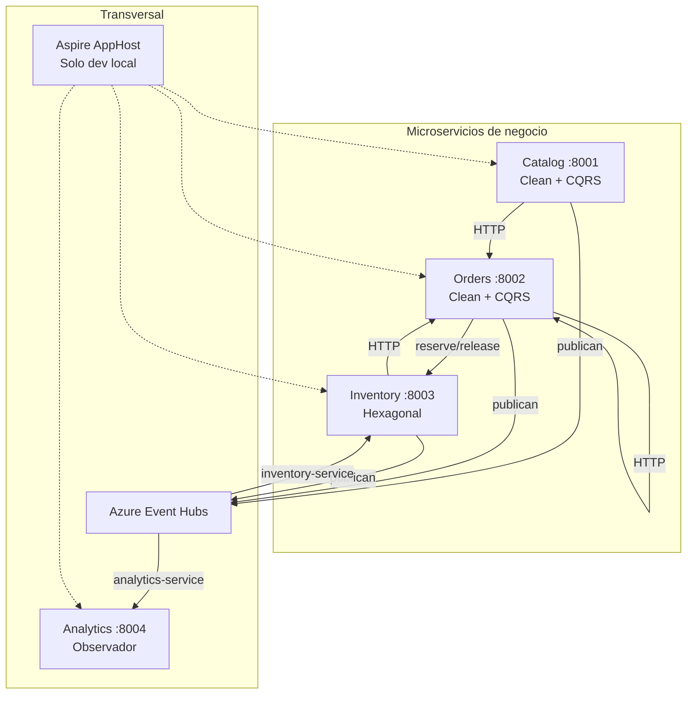
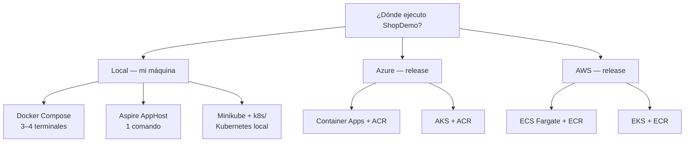
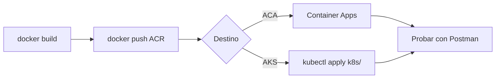

# ShopDemo — Plataforma de e-commerce distribuida (.NET 10)

| Campo | Detalle |
|:------|:--------|
| **Empresa** | Lite Thinking |
| **Curso** | Microservicios con .NET en Kubernetes y Entornos Multicloud |
| **Instructor** | Lcc. Gilberto Valentino Juárez Sánchez |
| **Contacto** | WhatsApp: +52 5614206660 |
| | E-mail: gilberto.juarez@gmail.com |
| | E-mail: lcc.gilberto.juarez@gmail.com |

ShopDemo es un laboratorio práctico donde construyes y operas una plataforma de comercio electrónico como **microservicios independientes**, comparas estilos arquitectónicos, integras bounded contexts por HTTP y eventos, orquestas el sistema con **.NET Aspire** y despliegas contenedores en **Azure** y **AWS**.

---

## Objetivo de la práctica

Al finalizar las etapas del curso, el alumno debe poder:

1. **Modelar** tres bounded contexts de negocio (Catalog, Orders, Inventory) con DDD y persistencia dedicada.
2. **Comparar** Clean Architecture + CQRS (Catalog, Orders) frente a arquitectura hexagonal (Inventory).
3. **Integrar** servicios por HTTP síncrono (Orders → Inventory) y por mensajería asíncrona (Azure Event Hubs).
4. **Observar** el bus de eventos con Analytics y orquestar todo localmente con Aspire.
5. **Empaquetar** cada API en Docker y **desplegarla** en Azure (Container Apps, AKS) y AWS (ECS, EKS).
6. **Desplegar** en Kubernetes (Minikube local, AKS, EKS) con manifiestos `k8s/`.
7. **Probar** flujos de punta a punta con Swagger, Postman y la guía de endpoints.

---

## Arquitectura a alto nivel



| Capa | Qué contiene |
|---|---|
| **API** | Controllers HTTP, Swagger, composición DI |
| **Application** | CQRS / casos de uso, DTOs, validación |
| **Domain** | Agregados, value objects, domain events |
| **Infrastructure** | EF Core, HTTP clients, adaptadores Event Hubs |
| **Shared** | Kernel DDD + `IntegrationEventEnvelope` |
| **Aspire** | AppHost, ServiceDefaults, Analytics |

**Documentación técnica completa:** [docs/ARQUITECTURA.md](docs/ARQUITECTURA.md)

---

## Etapas del curso (roadmap)

Cada etapa tiene un par de documentos: **requerimientos** (qué y por qué) e **implementación** (cómo, con código). Se recomienda leer ambos en orden.

| Etapa | Tema | Requerimientos | Implementación | Cómo validar |
|---|---|---|---|---|
| **0** | Visión y endpoints | — | [GUIA-ENDPOINTS](docs/GUIA-ENDPOINTS.md) | Postman E2E |
| **1** | Catalog (Clean + CQRS) | [REQUERIMIENTOS-CATALOG](docs/catalog/REQUERIMIENTOS-CATALOG.md) | [IMPLEMENTACION-CATALOG](docs/catalog/IMPLEMENTACION-CATALOG.md) | `POST /api/products` |
| **2** | Orders (Clean + CQRS) | [REQUERIMIENTOS-ORDERS](docs/orders/REQUERIMIENTOS-ORDERS.md) | [IMPLEMENTACION-ORDERS](docs/orders/IMPLEMENTACION-ORDERS.md) | Crear y confirmar pedido |
| **3** | Inventory (Hexagonal) | [REQUERIMIENTOS-INVENTORY](docs/inventory/REQUERIMIENTOS-INVENTORY.md) | [IMPLEMENTACION-INVENTORY](docs/inventory/IMPLEMENTACION-INVENTORY.md) | Stock y reservas |
| **4** | Integración E2E | [GUIA-ENDPOINTS](docs/GUIA-ENDPOINTS.md) | [ARQUITECTURA §4](docs/ARQUITECTURA.md#4-integración-entre-bounded-contexts) | Flujo compra completo |
| **5** | Azure Event Hubs | [INTEGRACION-AZURE-EVENT-HUBS](docs/INTEGRACION-AZURE-EVENT-HUBS.md) | Mismo doc (paso a paso) | Auto-stock + eventos en log |
| **6** | Aspire + Analytics | [REQUERIMIENTOS-ANALYTICS-ASPIRE](docs/analytics/REQUERIMIENTOS-ANALYTICS-ASPIRE.md) | [IMPLEMENTACION-ANALYTICS-ASPIRE](docs/analytics/IMPLEMENTACION-ANALYTICS-ASPIRE.md) | `GET /api/analytics/events` |
| **7** | Docker → Azure | [REQUERIMIENTOS-DESPLIEGUE-AZURE](docs/despliegue/azure/REQUERIMIENTOS-DESPLIEGUE-AZURE.md) | [IMPLEMENTACION-DESPLIEGUE-AZURE](docs/despliegue/azure/IMPLEMENTACION-DESPLIEGUE-AZURE.md) | APIs en Container Apps |
| **8** | Docker → AWS | [REQUERIMIENTOS-DESPLIEGUE-AWS](docs/despliegue/aws/REQUERIMIENTOS-DESPLIEGUE-AWS.md) | [IMPLEMENTACION-DESPLIEGUE-AWS](docs/despliegue/aws/IMPLEMENTACION-DESPLIEGUE-AWS.md) | APIs en ECS Fargate |
| **9** | Kubernetes local (Minikube) | [REQUERIMIENTOS-KUBERNETES](docs/despliegue/kubernetes/REQUERIMIENTOS-KUBERNETES.md) | [IMPLEMENTACION-KUBERNETES-LOCAL](docs/despliegue/kubernetes/IMPLEMENTACION-KUBERNETES-LOCAL.md) · [Teoría K8s](docs/despliegue/kubernetes/TEORIA-KUBERNETES-OPERACIONES.md) | `kubectl get hpa -n shopdemo` |
| **10** | Azure AKS | [REQUERIMIENTOS-DESPLIEGUE-AKS](docs/despliegue/aks/REQUERIMIENTOS-DESPLIEGUE-AKS.md) | [IMPLEMENTACION-DESPLIEGUE-AKS](docs/despliegue/aks/IMPLEMENTACION-DESPLIEGUE-AKS.md) | ShopDemo en AKS |
| **11** | Amazon EKS | [REQUERIMIENTOS-DESPLIEGUE-EKS](docs/despliegue/eks/REQUERIMIENTOS-DESPLIEGUE-EKS.md) | [IMPLEMENTACION-DESPLIEGUE-EKS](docs/despliegue/eks/IMPLEMENTACION-DESPLIEGUE-EKS.md) | ShopDemo en EKS |
| **12** | Observabilidad | [REQUERIMIENTOS-OBSERVABILIDAD](docs/observabilidad/REQUERIMIENTOS-OBSERVABILIDAD.md) | [Azure](docs/observabilidad/azure/IMPLEMENTACION-OBSERVABILIDAD-AZURE.md) · [AWS](docs/observabilidad/aws/IMPLEMENTACION-OBSERVABILIDAD-AWS.md) | Logs + alerta + traceId |
| **13** | Resiliencia | [REQUERIMIENTOS-RESILIENCIA](docs/resiliencia/REQUERIMIENTOS-RESILIENCIA.md) | [Azure](docs/resiliencia/azure/IMPLEMENTACION-RESILIENCIA-AZURE.md) · [AWS](docs/resiliencia/aws/IMPLEMENTACION-RESILIENCIA-AWS.md) | Recuperación tras fallo de pod/tarea |

**Teoría:** [Docker/K8s/AOT](docs/TEORIA-DOCKER-KUBERNETES-AOT.md) · [Observabilidad](docs/observabilidad/TEORIA-OBSERVABILIDAD.md) · [Resiliencia](docs/resiliencia/TEORIA-RESILIENCIA.md) · [AKS](docs/despliegue/aks/TEORIA-AKS.md) · [EKS](docs/despliegue/eks/TEORIA-EKS.md) · [Azure ACA](docs/despliegue/azure/TEORIA-CONTENEDORES-AZURE.md) · [AWS ECS](docs/despliegue/aws/TEORIA-CONTENEDORES-AWS.md)

---

## Guía rápida: ¿qué modo de ejecución uso?

| Si quieres… | Modo | Sección |
|---|---|---|
| Desarrollar o probar **en tu PC** sin nube | **Local** | [Inicio local](#inicio-local-desarrollo-y-pruebas) |
| Publicar a **Azure** (release) | **Azure** | [Release Azure](#release-azure) |
| Publicar a **AWS** (release) | **AWS** | [Release AWS](#release-aws) |



---

## Inicio local (desarrollo y pruebas)

### Requisitos previos

```bash
dotnet build ShopDemo.slnx    # compila la solución
docker --version            # Docker Desktop en ejecución
```

| Herramienta | Obligatorio para | Enlace |
|---|---|---|
| .NET 10 SDK | Aspire / `dotnet run` | [Descargar](https://dotnet.microsoft.com/download) |
| Docker Desktop | Compose y builds | [Descargar](https://www.docker.com/products/docker-desktop/) |
| Minikube + kubectl | Solo modo Kubernetes local | [Minikube](https://minikube.sigs.k8s.io/docs/start/) |

### URLs locales (todos los modos)

| Servicio | URL | Swagger |
|---|---|---|
| Catalog | http://localhost:8001 | http://localhost:8001/swagger |
| Orders | http://localhost:8002 | http://localhost:8002/swagger |
| Inventory | http://localhost:8003 | http://localhost:8003/swagger |
| Analytics | http://localhost:8004 | http://localhost:8004/swagger |

> **Postman:** importa [ShopDemo.postman_collection.json](docs/ShopDemo.postman_collection.json) — las variables ya apuntan a `localhost`. Ver [Configurar Postman](#configurar-postman-según-entorno).

---

### Opción A — Docker Compose (recomendada para empezar)

**Cuándo usarla:** etapas 1–5; quieres levantar un servicio aislado con su PostgreSQL.

**Orden:** Catalog e Inventory primero; luego Orders (Orders llama a Inventory).

| Paso | Acción | Terminal |
|---|---|---|
| 1 | Catalog + PostgreSQL | `cd Catalog/ShopDemo.Catalog.Api` → `copy .env.example .env` → `docker compose up --build` |
| 2 | Inventory + PostgreSQL + Azurite | `cd Inventory/ShopDemo.Inventory.Api` → `docker compose up --build` |
| 3 | Orders + PostgreSQL | `cd Orders/ShopDemo.Orders.Api` → `docker compose up --build` |
| 4 | Analytics (opcional, etapa 6+) | `cd Aspire/ShopDemo.Analytics.Api` → `docker compose up --build` |

**Verificar:**

```bash
curl http://localhost:8001/swagger/index.html
curl http://localhost:8003/swagger/index.html
curl http://localhost:8002/swagger/index.html
```

**Event Hubs (opcional):** edita `.env` en cada API con `EVENT_HUBS_ENABLED=true` y la connection string. Guía: [INTEGRACION-AZURE-EVENT-HUBS.md](docs/INTEGRACION-AZURE-EVENT-HUBS.md).

**Detener:** `Ctrl+C` en cada terminal o `docker compose down`.

---

### Opción B — .NET Aspire (stack completo en un comando)

**Cuándo usarla:** etapa 6; quieres las 4 APIs + PostgreSQL + Azurite + dashboard sin varias terminales.

| Paso | Comando |
|---|---|
| 1 | Configurar Event Hubs (una vez): `dotnet user-secrets set "ShopDemo:EventHubs:ConnectionString" "<CONNECTION_STRING>" --project Aspire/ShopDemo.AppHost` |
| 2 | Arrancar todo: `dotnet run --project Aspire/ShopDemo.AppHost` |
| 3 | Abrir **Aspire Dashboard** (URL que muestra la consola) |

Los puertos siguen siendo **8001–8004**. El AppHost inyecta `EventHubs__*` y la URL de Inventory para Orders.

Guía: [IMPLEMENTACION-ANALYTICS-ASPIRE.md](docs/analytics/IMPLEMENTACION-ANALYTICS-ASPIRE.md)

---

### Opción C — `dotnet run` (depuración en Visual Studio / Cursor)

**Cuándo usarla:** depurar un solo microservicio con breakpoints.

Requiere PostgreSQL accesible en `localhost:5433`–`5435` (vía Compose de cada BD o instancia local).

```bash
dotnet run --project Catalog/ShopDemo.Catalog.Api
dotnet run --project Orders/ShopDemo.Orders.Api
dotnet run --project Inventory/ShopDemo.Inventory.Api
dotnet run --project Aspire/ShopDemo.Analytics.Api
```

---

### Opción D — Kubernetes local (Minikube)

**Cuándo usarla:** etapa 9; practicar manifiestos antes de AKS/EKS.

| Paso | Resumen |
|---|---|
| 1 | `minikube start` + `minikube addons enable ingress` |
| 2 | Build imágenes en daemon Minikube (`minikube docker-env`) |
| 3 | `kubectl apply -f k8s/` (ver orden en [k8s/README.md](k8s/README.md)) |

Guía completa: [IMPLEMENTACION-KUBERNETES-LOCAL.md](docs/despliegue/kubernetes/IMPLEMENTACION-KUBERNETES-LOCAL.md)

**Postman con Ingress:** `catalogBaseUrl` = `http://shopdemo.local/catalog` (tras configurar hosts o `minikube tunnel`).

---

## Release Azure

Dos caminos de **release** en Azure. Ambos usan imágenes en **Azure Container Registry (ACR)**.

| Camino | Servicio Azure | Ideal para | Guía |
|---|---|---|---|
| **ACA** | Container Apps | Release serverless, más simple | [IMPLEMENTACION-DESPLIEGUE-AZURE](docs/despliegue/azure/IMPLEMENTACION-DESPLIEGUE-AZURE.md) |
| **AKS** | Kubernetes Service | Release con manifiestos `k8s/` | [IMPLEMENTACION-DESPLIEGUE-AKS](docs/despliegue/aks/IMPLEMENTACION-DESPLIEGUE-AKS.md) |

### Flujo común release Azure



| Paso | ACA (Container Apps) | AKS |
|---|---|---|
| 1 | Crear RG + ACR | Crear RG + ACR + cluster AKS |
| 2 | `docker push` a ACR | `az aks get-credentials` + push ACR |
| 3 | Crear 4 Container Apps | Instalar Ingress NGINX |
| 4 | Secrets `EventHubs__*` en cada app | Editar imagen en Deployments → `kubectl apply` |
| 5 | Copiar FQDN de cada app | Copiar IP/DNS del Ingress |

### URLs release Azure (Postman)

Tras desplegar, actualiza las variables de colección:

| Variable Postman | Origen (ACA) | Origen (AKS Ingress) |
|---|---|---|
| `catalogBaseUrl` | `https://ca-shopdemo-catalog.<fqdn>` | `http://<ingress-ip>/catalog` |
| `ordersBaseUrl` | `https://ca-shopdemo-orders.<fqdn>` | `http://<ingress-ip>/orders` |
| `inventoryBaseUrl` | URL **interna** o pública si expusiste | `http://<ingress-ip>/inventory` |
| `analyticsBaseUrl` | `https://ca-shopdemo-analytics.<fqdn>` | `http://<ingress-ip>/analytics` |

**Secrets obligatorios en nube:** `EventHubs__ConnectionString`, connection strings PostgreSQL, Azurite/checkpoint para Inventory y Analytics.

CI/CD: [.github/workflows/deploy-azure.yml](.github/workflows/deploy-azure.yml)

---

## Release AWS

Dos caminos de **release** en AWS. Ambos usan **Amazon ECR**.

| Camino | Servicio AWS | Ideal para | Guía |
|---|---|---|---|
| **ECS** | Fargate | Release sin Kubernetes | [IMPLEMENTACION-DESPLIEGUE-AWS](docs/despliegue/aws/IMPLEMENTACION-DESPLIEGUE-AWS.md) |
| **EKS** | Elastic Kubernetes Service | Release con manifiestos `k8s/` | [IMPLEMENTACION-DESPLIEGUE-EKS](docs/despliegue/eks/IMPLEMENTACION-DESPLIEGUE-EKS.md) |

### Flujo común release AWS

| Paso | ECS Fargate | EKS |
|---|---|---|
| 1 | Crear repos ECR | `eksctl create cluster` o Consola EKS |
| 2 | `docker push` a ECR | `aws eks update-kubeconfig` |
| 3 | Task definitions + services | EBS CSI + Ingress NGINX |
| 4 | ALB por API pública | `kubectl apply -f k8s/` |
| 5 | Cloud Map para Orders→Inventory | Mismos secrets que Minikube |

### URLs release AWS (Postman)

| Variable Postman | Origen (ECS + ALB) | Origen (EKS Ingress) |
|---|---|---|
| `catalogBaseUrl` | `http://<alb-catalog-dns>` | `http://<ingress-host>/catalog` |
| `ordersBaseUrl` | `http://<alb-orders-dns>` | `http://<ingress-host>/orders` |
| `inventoryBaseUrl` | DNS interno Cloud Map o ALB | `http://<ingress-host>/inventory` |
| `analyticsBaseUrl` | `http://<alb-analytics-dns>` | `http://<ingress-host>/analytics` |

**Nota:** el código usa **Azure Event Hubs**; los contenedores en AWS necesitan salida HTTPS a internet hacia Azure.

CI/CD: [.github/workflows/deploy-aws.yml](.github/workflows/deploy-aws.yml)

---

## Configurar Postman según entorno

1. Importar [docs/ShopDemo.postman_collection.json](docs/ShopDemo.postman_collection.json)
2. En la colección → **Variables**, elegir el perfil:

| Perfil | `deploymentProfile` | Qué cambiar |
|---|---|---|
| **Local** (default) | `local` | Ya configurado: `localhost:8001`–`8004` |
| **Azure ACA** | `azure-aca` | Reemplazar `catalogBaseUrl`, `ordersBaseUrl`, `inventoryBaseUrl`, `analyticsBaseUrl` con FQDN de Container Apps |
| **Azure AKS** | `azure-aks` | URLs con prefijo de Ingress (`/catalog`, `/orders`, …) |
| **AWS ECS** | `aws-ecs` | DNS de cada ALB |
| **AWS EKS** | `aws-eks` | Igual que AKS con Ingress |

3. Ejecutar carpeta **Flujo integrado (E2E)** en orden
4. Tras crear producto/pedido, copiar `id` de la respuesta a variables `productId` / `orderId`

Con **Event Hubs activo**, el paso 2 del E2E (registrar stock) puede omitirse; usa **Analytics → Listar eventos** para validar.

---

## Checklist antes del flujo E2E

| # | Verificación | Local Compose | Aspire | Release nube |
|---|---|---|---|---|
| 1 | APIs responden Swagger | ✓ 8001–8003 | ✓ 8001–8004 | ✓ FQDN/Ingress |
| 2 | Orders alcanza Inventory | `host.docker.internal:8003` | automático | URL interna configurada |
| 3 | PostgreSQL accesible | compose por API | Aspire PG | ACI/ECS/StatefulSet |
| 4 | Event Hubs (si aplica) | `.env` | user secrets AppHost | Secrets ACA/EKS/SSM |
| 5 | Postman variables actualizadas | localhost | localhost | FQDN release |

---

## Variables de configuración

### Resumen por servicio

| Servicio | Archivo principal | Variables clave |
|---|---|---|
| **Catalog** | `appsettings.json` + `.env` | `ConnectionStrings__DefaultConnection`, `EventHubs__*` |
| **Orders** | `appsettings.json` + `.env` | `ConnectionStrings__*`, `InventoryApi__BaseUrl`, `EventHubs__*` |
| **Inventory** | `appsettings.json` + `.env` | `ConnectionStrings__*`, `EventHubs__*` + consumer/checkpoint |
| **Analytics** | `appsettings.json` + `.env` | `EventHubs__*` + consumer/checkpoint |
| **AppHost** | `appsettings.Development.json` o user secrets | `ShopDemo:EventHubs:ConnectionString` |

### Catalog — `Catalog/ShopDemo.Catalog.Api/`

| Variable | Dónde configurarla | Ejemplo / notas |
|---|---|---|
| `ConnectionStrings__DefaultConnection` | `appsettings.json`, `docker-compose.yml` | Host `catalog-db` en Docker; `localhost:5433` en dev |
| `EventHubs__Enabled` | `.env`, compose, ACA/ECS | `true` / `false` |
| `EventHubs__ConnectionString` | `.env` (no commitear) | Connection string del namespace Azure |
| `EventHubs__EventHubName` | `.env`, compose | `shopdemo-events` |

Archivo plantilla: `Catalog/ShopDemo.Catalog.Api/.env.example`

### Orders — `Orders/ShopDemo.Orders.Api/`

| Variable | Dónde configurarla | Ejemplo / notas |
|---|---|---|
| `ConnectionStrings__DefaultConnection` | `appsettings.json`, compose | Puerto host `5434` |
| `InventoryApi__BaseUrl` | `appsettings.json`, compose, ACA, ECS | `http://localhost:8003` · Docker: `http://host.docker.internal:8003` · Aspire: automático · Nube: URL interna Inventory |
| `EventHubs__Enabled` | `.env`, compose | Igual que Catalog |
| `EventHubs__ConnectionString` | `.env` | Igual que Catalog |
| `EventHubs__EventHubName` | `.env` | `shopdemo-events` |

Archivo plantilla: `Orders/ShopDemo.Orders.Api/.env.example`

### Inventory — `Inventory/ShopDemo.Inventory.Api/`

| Variable | Dónde configurarla | Ejemplo / notas |
|---|---|---|
| `ConnectionStrings__DefaultConnection` | `appsettings.json`, compose | Puerto host `5435` |
| `EventHubs__Enabled` | `.env`, compose | `true` activa publisher + `CatalogEventsProcessor` |
| `EventHubs__ConnectionString` | `.env` | Connection string Azure |
| `EventHubs__ConsumerGroup` | compose, ACA, ECS | `inventory-service` |
| `EventHubs__CheckpointStorageConnectionString` | `.env`, compose | Azurite local; Blob en nube |
| `EventHubs__CheckpointContainerName` | compose | `inventory-checkpoints` |

Archivo plantilla: `Inventory/ShopDemo.Inventory.Api/.env.example`

### Analytics — `Aspire/ShopDemo.Analytics.Api/`

| Variable | Dónde configurarla | Ejemplo / notas |
|---|---|---|
| `EventHubs__Enabled` | compose, ACA, ECS | `true` |
| `EventHubs__ConnectionString` | `.env`, AppHost | Desde AppHost en Aspire |
| `EventHubs__ConsumerGroup` | compose | `analytics-service` |
| `EventHubs__CheckpointStorageConnectionString` | compose | Azurite (`azurite:10000` en compose) |
| `EventHubs__CheckpointContainerName` | compose | `analytics-checkpoints` |

Archivo plantilla: `Aspire/ShopDemo.Analytics.Api/.env.example`

### AppHost Aspire — `Aspire/ShopDemo.AppHost/`

| Variable | Dónde configurarla | Ejemplo / notas |
|---|---|---|
| `ShopDemo:EventHubs:ConnectionString` | `appsettings.Development.json` o **user secrets** | Centraliza EH para los 4 APIs |
| `ShopDemo:EventHubs:EventHubName` | `appsettings.json` | `shopdemo-events` |
| `ShopDemo:EventHubs:Enabled` | `appsettings.json` | `true` |

El AppHost inyecta a cada API como `EventHubs__*` y configura `InventoryApi__BaseUrl` para Orders.

### Plataformas en nube (release)

| Plataforma | Dónde poner secretos | Documentación |
|---|---|---|
| **Azure Container Apps** | Secrets de cada Container App | [despliegue/azure](docs/despliegue/azure/) |
| **Azure AKS** | Secrets K8s / Key Vault | [despliegue/aks](docs/despliegue/aks/) |
| **AWS ECS** | SSM Parameter Store / Secrets Manager | [despliegue/aws](docs/despliegue/aws/) |
| **Amazon EKS** | Secrets K8s / Parameter Store | [despliegue/eks](docs/despliegue/eks/) |
| **GitHub Actions** | Repository secrets | [.github/workflows/](.github/workflows/) |

> **Regla:** nunca commitear connection strings reales. Usa `.env` local (gitignored), user secrets o secretos de la plataforma.

---

## Prueba rápida del flujo integrado

1. Elige modo de ejecución: [Inicio local](#inicio-local-desarrollo-y-pruebas) o [Release](#release-azure).
2. Completa el [checklist E2E](#checklist-antes-del-flujo-e2e).
3. Importa y configura [Postman](#configurar-postman-según-entorno).
4. Ejecuta carpeta **Flujo integrado (E2E)** o sigue [GUIA-ENDPOINTS.md](docs/GUIA-ENDPOINTS.md).

Con Event Hubs activo, el stock se auto-registra y Analytics lista eventos en `GET /api/analytics/events`.

---

## Estructura del repositorio

```
ShopDemo/
├── Catalog/          # Clean Architecture — catálogo
├── Orders/           # Clean Architecture — pedidos
├── Inventory/        # Hexagonal — stock
├── Aspire/           # AppHost, ServiceDefaults, Analytics
├── ShopDemo.Shared/  # Kernel DDD + mensajería
├── k8s/              # Manifiestos Kubernetes (Minikube, AKS, EKS)
├── docs/             # Toda la documentación del curso
└── .github/workflows/  # CI/CD Azure y AWS
```

---

## Documentación índice

| Tema | Enlace |
|---|---|
| Arquitectura | [docs/ARQUITECTURA.md](docs/ARQUITECTURA.md) |
| Endpoints y Postman | [docs/GUIA-ENDPOINTS.md](docs/GUIA-ENDPOINTS.md) |
| Event Hubs | [docs/INTEGRACION-AZURE-EVENT-HUBS.md](docs/INTEGRACION-AZURE-EVENT-HUBS.md) |
| Aspire | [docs/INTEGRACION-ASPIRE.md](docs/INTEGRACION-ASPIRE.md) |
| Despliegue | [docs/despliegue/README.md](docs/despliegue/README.md) |
| Observabilidad | [docs/observabilidad/README.md](docs/observabilidad/README.md) |
| Resiliencia | [docs/resiliencia/README.md](docs/resiliencia/README.md) |
| Cheat sheets CLI | [docs/cheat-sheets/](docs/cheat-sheets/) |
| Teoría Docker, K8s y AOT | [docs/TEORIA-DOCKER-KUBERNETES-AOT.md](docs/TEORIA-DOCKER-KUBERNETES-AOT.md) |
| Manifiestos Kubernetes | [k8s/](k8s/) |

---

## Requisitos técnicos

- [.NET 10 SDK](https://dotnet.microsoft.com/download)
- [Docker Desktop](https://www.docker.com/products/docker-desktop/)
- Opcional: [Azure CLI](https://learn.microsoft.com/cli/azure/install-azure-cli), [AWS CLI](https://aws.amazon.com/cli/)
- Opcional: cuenta Azure con Event Hubs para etapas 5–8

```bash
dotnet build ShopDemo.slnx
```
