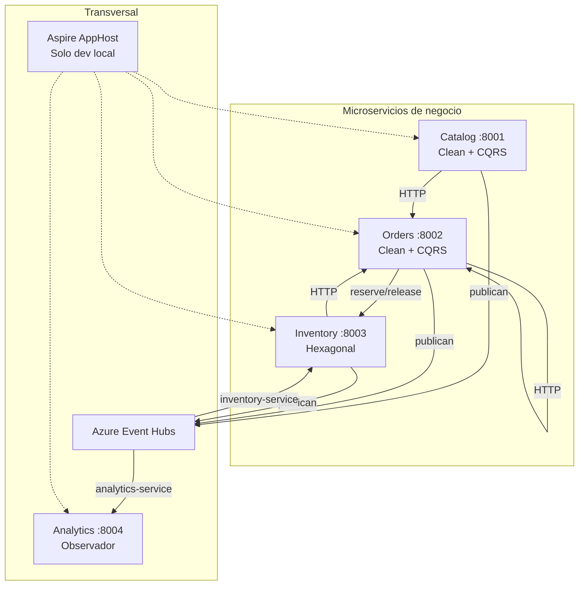

# ShopDemo — Plataforma de e-commerce distribuida (.NET 10)

| Campo | Detalle |
|:------|:--------|
| **Empresa** | Lite Thinking |
| **Curso** | Microservicios con .NET en Kubernetes y Entornos Multicloud |
| **Instructor** | Lcc. Gilberto Valentino Juárez Sánchez |
| **Contacto** | WhatsApp: +52 5614206660 |
| | E-mail: gilberto.juarez@gmail.com |
| | E-mail: lcc.gilberto.juarez@gmail.com |

ShopDemo es un laboratorio práctico donde construyes y operas una plataforma de comercio electrónico como **microservicios independientes**, comparas estilos arquitectónicos, integras bounded contexts por HTTP y eventos, orquestas el sistema con **.NET Aspire** y despliegas contenedores en **Azure** y **AWS**.

---

## Objetivo de la práctica

Al finalizar las etapas del curso, el alumno debe poder:

1. **Modelar** tres bounded contexts de negocio (Catalog, Orders, Inventory) con DDD y persistencia dedicada.
2. **Comparar** Clean Architecture + CQRS (Catalog, Orders) frente a arquitectura hexagonal (Inventory).
3. **Integrar** servicios por HTTP síncrono (Orders → Inventory) y por mensajería asíncrona (Azure Event Hubs).
4. **Observar** el bus de eventos con Analytics y orquestar todo localmente con Aspire.
5. **Empaquetar** cada API en Docker y **desplegarla** en Azure Container Apps o Amazon ECS Fargate.
6. **Probar** flujos de punta a punta con Swagger, Postman y la guía de endpoints.

---

## Arquitectura a alto nivel



| Capa | Qué contiene |
|---|---|
| **API** | Controllers HTTP, Swagger, composición DI |
| **Application** | CQRS / casos de uso, DTOs, validación |
| **Domain** | Agregados, value objects, domain events |
| **Infrastructure** | EF Core, HTTP clients, adaptadores Event Hubs |
| **Shared** | Kernel DDD + `IntegrationEventEnvelope` |
| **Aspire** | AppHost, ServiceDefaults, Analytics |

**Documentación técnica completa:** [docs/ARQUITECTURA.md](docs/ARQUITECTURA.md)

---

## Etapas del curso (roadmap)

Cada etapa tiene un par de documentos: **requerimientos** (qué y por qué) e **implementación** (cómo, con código). Se recomienda leer ambos en orden.

| Etapa | Tema | Requerimientos | Implementación | Cómo validar |
|---|---|---|---|---|
| **0** | Visión y endpoints | — | [GUIA-ENDPOINTS](docs/GUIA-ENDPOINTS.md) | Postman E2E |
| **1** | Catalog (Clean + CQRS) | [REQUERIMIENTOS-CATALOG](docs/catalog/REQUERIMIENTOS-CATALOG.md) | [IMPLEMENTACION-CATALOG](docs/catalog/IMPLEMENTACION-CATALOG.md) | `POST /api/products` |
| **2** | Orders (Clean + CQRS) | [REQUERIMIENTOS-ORDERS](docs/orders/REQUERIMIENTOS-ORDERS.md) | [IMPLEMENTACION-ORDERS](docs/orders/IMPLEMENTACION-ORDERS.md) | Crear y confirmar pedido |
| **3** | Inventory (Hexagonal) | [REQUERIMIENTOS-INVENTORY](docs/inventory/REQUERIMIENTOS-INVENTORY.md) | [IMPLEMENTACION-INVENTORY](docs/inventory/IMPLEMENTACION-INVENTORY.md) | Stock y reservas |
| **4** | Integración E2E | [GUIA-ENDPOINTS](docs/GUIA-ENDPOINTS.md) | [ARQUITECTURA §4](docs/ARQUITECTURA.md#4-integración-entre-bounded-contexts) | Flujo compra completo |
| **5** | Azure Event Hubs | [INTEGRACION-AZURE-EVENT-HUBS](docs/INTEGRACION-AZURE-EVENT-HUBS.md) | Mismo doc (paso a paso) | Auto-stock + eventos en log |
| **6** | Aspire + Analytics | [REQUERIMIENTOS-ANALYTICS-ASPIRE](docs/analytics/REQUERIMIENTOS-ANALYTICS-ASPIRE.md) | [IMPLEMENTACION-ANALYTICS-ASPIRE](docs/analytics/IMPLEMENTACION-ANALYTICS-ASPIRE.md) | `GET /api/analytics/events` |
| **7** | Docker → Azure | [REQUERIMIENTOS-DESPLIEGUE-AZURE](docs/despliegue/azure/REQUERIMIENTOS-DESPLIEGUE-AZURE.md) | [IMPLEMENTACION-DESPLIEGUE-AZURE](docs/despliegue/azure/IMPLEMENTACION-DESPLIEGUE-AZURE.md) | APIs en Container Apps |
| **8** | Docker → AWS | [REQUERIMIENTOS-DESPLIEGUE-AWS](docs/despliegue/aws/REQUERIMIENTOS-DESPLIEGUE-AWS.md) | [IMPLEMENTACION-DESPLIEGUE-AWS](docs/despliegue/aws/IMPLEMENTACION-DESPLIEGUE-AWS.md) | APIs en ECS Fargate |

**Teoría de despliegue:** [Azure](docs/despliegue/azure/TEORIA-CONTENEDORES-AZURE.md) · [AWS](docs/despliegue/aws/TEORIA-CONTENEDORES-AWS.md)

---

## Cómo levantar los servicios

Hay **cuatro modos** de ejecución. Elige uno según la etapa que estés practicando.

### Modo 1 — Docker Compose (por microservicio)

Ideal para etapas 1–5. Cada API trae su PostgreSQL.

```bash
# Terminal 1 — Catalog
cd Catalog/ShopDemo.Catalog.Api
copy .env.example .env    # opcional, si usas Event Hubs
docker compose up --build

# Terminal 2 — Orders
cd Orders/ShopDemo.Orders.Api
docker compose up --build

# Terminal 3 — Inventory
cd Inventory/ShopDemo.Inventory.Api
docker compose up --build

# Terminal 4 — Analytics (etapa 6+)
cd Aspire/ShopDemo.Analytics.Api
docker compose up --build
```

| Servicio | URL local | PostgreSQL |
|---|---|---|
| Catalog | http://localhost:8001 | localhost:5433 |
| Orders | http://localhost:8002 | localhost:5434 |
| Inventory | http://localhost:8003 | localhost:5435 |
| Analytics | http://localhost:8004 | — |

### Modo 2 — .NET Aspire (stack integrado)

Ideal para etapa 6. **Un solo comando** levanta 4 APIs + PostgreSQL + Azurite + dashboard.

```bash
# Configurar Event Hubs en AppHost (una vez)
dotnet user-secrets set "ShopDemo:EventHubs:ConnectionString" "<TU_CONNECTION_STRING>" \
  --project Aspire/ShopDemo.AppHost

dotnet run --project Aspire/ShopDemo.AppHost
```

Abre el **Aspire Dashboard** (URL en consola) y prueba los mismos endpoints en puertos 8001–8004.

### Modo 3 — `dotnet run` individual (desarrollo)

```bash
dotnet run --project Catalog/ShopDemo.Catalog.Api
dotnet run --project Orders/ShopDemo.Orders.Api
dotnet run --project Inventory/ShopDemo.Inventory.Api
dotnet run --project Aspire/ShopDemo.Analytics.Api
```

Requiere PostgreSQL local en los puertos 5433–5435 (o ajustar `appsettings.Development.json`).

### Modo 4 — Nube (Azure / AWS)

Sigue las guías de despliegue. Las URLs dejan de ser `localhost` y pasan a FQDN del load balancer / Container App.

- **Azure:** [IMPLEMENTACION-DESPLIEGUE-AZURE](docs/despliegue/azure/IMPLEMENTACION-DESPLIEGUE-AZURE.md)
- **AWS:** [IMPLEMENTACION-DESPLIEGUE-AWS](docs/despliegue/aws/IMPLEMENTACION-DESPLIEGUE-AWS.md)

CI/CD de referencia: `.github/workflows/deploy-azure.yml` y `deploy-aws.yml`.

---

## Variables de configuración

### Resumen por servicio

| Servicio | Archivo principal | Variables clave |
|---|---|---|
| **Catalog** | `appsettings.json` + `.env` | `ConnectionStrings__DefaultConnection`, `EventHubs__*` |
| **Orders** | `appsettings.json` + `.env` | `ConnectionStrings__*`, `InventoryApi__BaseUrl`, `EventHubs__*` |
| **Inventory** | `appsettings.json` + `.env` | `ConnectionStrings__*`, `EventHubs__*` + consumer/checkpoint |
| **Analytics** | `appsettings.json` + `.env` | `EventHubs__*` + consumer/checkpoint |
| **AppHost** | `appsettings.Development.json` o user secrets | `ShopDemo:EventHubs:ConnectionString` |

### Catalog — `Catalog/ShopDemo.Catalog.Api/`

| Variable | Dónde configurarla | Ejemplo / notas |
|---|---|---|
| `ConnectionStrings__DefaultConnection` | `appsettings.json`, `docker-compose.yml` | Host `catalog-db` en Docker; `localhost:5433` en dev |
| `EventHubs__Enabled` | `.env`, compose, ACA/ECS | `true` / `false` |
| `EventHubs__ConnectionString` | `.env` (no commitear) | Connection string del namespace Azure |
| `EventHubs__EventHubName` | `.env`, compose | `shopdemo-events` |

Archivo plantilla: `Catalog/ShopDemo.Catalog.Api/.env.example`

### Orders — `Orders/ShopDemo.Orders.Api/`

| Variable | Dónde configurarla | Ejemplo / notas |
|---|---|---|
| `ConnectionStrings__DefaultConnection` | `appsettings.json`, compose | Puerto host `5434` |
| `InventoryApi__BaseUrl` | `appsettings.json`, compose, ACA, ECS | `http://localhost:8003` · Docker: `http://host.docker.internal:8003` · Aspire: automático · Nube: URL interna Inventory |
| `EventHubs__Enabled` | `.env`, compose | Igual que Catalog |
| `EventHubs__ConnectionString` | `.env` | Igual que Catalog |
| `EventHubs__EventHubName` | `.env` | `shopdemo-events` |

Archivo plantilla: `Orders/ShopDemo.Orders.Api/.env.example`

### Inventory — `Inventory/ShopDemo.Inventory.Api/`

| Variable | Dónde configurarla | Ejemplo / notas |
|---|---|---|
| `ConnectionStrings__DefaultConnection` | `appsettings.json`, compose | Puerto host `5435` |
| `EventHubs__Enabled` | `.env`, compose | `true` activa publisher + `CatalogEventsProcessor` |
| `EventHubs__ConnectionString` | `.env` | Connection string Azure |
| `EventHubs__ConsumerGroup` | compose, ACA, ECS | `inventory-service` |
| `EventHubs__CheckpointStorageConnectionString` | `.env`, compose | Azurite local; Blob en nube |
| `EventHubs__CheckpointContainerName` | compose | `inventory-checkpoints` |

Archivo plantilla: `Inventory/ShopDemo.Inventory.Api/.env.example`

### Analytics — `Aspire/ShopDemo.Analytics.Api/`

| Variable | Dónde configurarla | Ejemplo / notas |
|---|---|---|
| `EventHubs__Enabled` | compose, ACA, ECS | `true` |
| `EventHubs__ConnectionString` | `.env`, AppHost | Desde AppHost en Aspire |
| `EventHubs__ConsumerGroup` | compose | `analytics-service` |
| `EventHubs__CheckpointStorageConnectionString` | compose | Azurite (`azurite:10000` en compose) |
| `EventHubs__CheckpointContainerName` | compose | `analytics-checkpoints` |

Archivo plantilla: `Aspire/ShopDemo.Analytics.Api/.env.example`

### AppHost Aspire — `Aspire/ShopDemo.AppHost/`

| Variable | Dónde configurarla | Ejemplo / notas |
|---|---|---|
| `ShopDemo:EventHubs:ConnectionString` | `appsettings.Development.json` o **user secrets** | Centraliza EH para los 4 APIs |
| `ShopDemo:EventHubs:EventHubName` | `appsettings.json` | `shopdemo-events` |
| `ShopDemo:EventHubs:Enabled` | `appsettings.json` | `true` |

El AppHost inyecta a cada API como `EventHubs__*` y configura `InventoryApi__BaseUrl` para Orders.

### Plataformas en nube

| Plataforma | Dónde poner secretos | Documentación |
|---|---|---|
| **Azure Container Apps** | Secrets de cada Container App + `appsettings` AppHost no aplica | [despliegue/azure](docs/despliegue/azure/) |
| **AWS ECS** | SSM Parameter Store / Secrets Manager | [despliegue/aws](docs/despliegue/aws/) |
| **GitHub Actions** | Repository secrets (`AZURE_CREDENTIALS`, `ACR_NAME`, `AWS_ROLE_ARN`, etc.) | `.github/workflows/` |

> **Regla:** nunca commitear connection strings reales. Usa `.env` local (gitignored), user secrets o secretos de la plataforma.

---

## Prueba rápida del flujo integrado

1. Levantar servicios (Compose, Aspire o nube).
2. Importar [ShopDemo.postman_collection.json](docs/ShopDemo.postman_collection.json).
3. Seguir la carpeta **Flujo integrado (E2E)** o [GUIA-ENDPOINTS.md](docs/GUIA-ENDPOINTS.md).

Con Event Hubs activo, el paso manual de stock puede omitirse: Inventory auto-registra al crear producto. Analytics muestra el evento en `GET /api/analytics/events`.

---

## Estructura del repositorio

```
ShopDemo/
├── Catalog/          # Clean Architecture — catálogo
├── Orders/           # Clean Architecture — pedidos
├── Inventory/        # Hexagonal — stock
├── Aspire/           # AppHost, ServiceDefaults, Analytics
├── ShopDemo.Shared/  # Kernel DDD + mensajería
├── docs/             # Toda la documentación del curso
└── .github/workflows/  # CI/CD Azure y AWS
```

---

## Documentación índice

| Tema | Enlace |
|---|---|
| Arquitectura | [docs/ARQUITECTURA.md](docs/ARQUITECTURA.md) |
| Endpoints y Postman | [docs/GUIA-ENDPOINTS.md](docs/GUIA-ENDPOINTS.md) |
| Event Hubs | [docs/INTEGRACION-AZURE-EVENT-HUBS.md](docs/INTEGRACION-AZURE-EVENT-HUBS.md) |
| Aspire | [docs/INTEGRACION-ASPIRE.md](docs/INTEGRACION-ASPIRE.md) |
| Despliegue | [docs/despliegue/README.md](docs/despliegue/README.md) |
| Cheat sheets CLI | [docs/cheat-sheets/](docs/cheat-sheets/) |

---

## Requisitos técnicos

- [.NET 10 SDK](https://dotnet.microsoft.com/download)
- [Docker Desktop](https://www.docker.com/products/docker-desktop/)
- Opcional: [Azure CLI](https://learn.microsoft.com/cli/azure/install-azure-cli), [AWS CLI](https://aws.amazon.com/cli/)
- Opcional: cuenta Azure con Event Hubs para etapas 5–8

```bash
dotnet build ShopDemo.slnx
```
