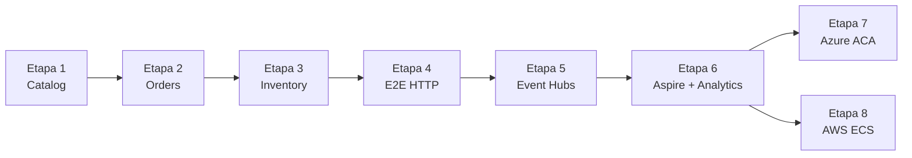
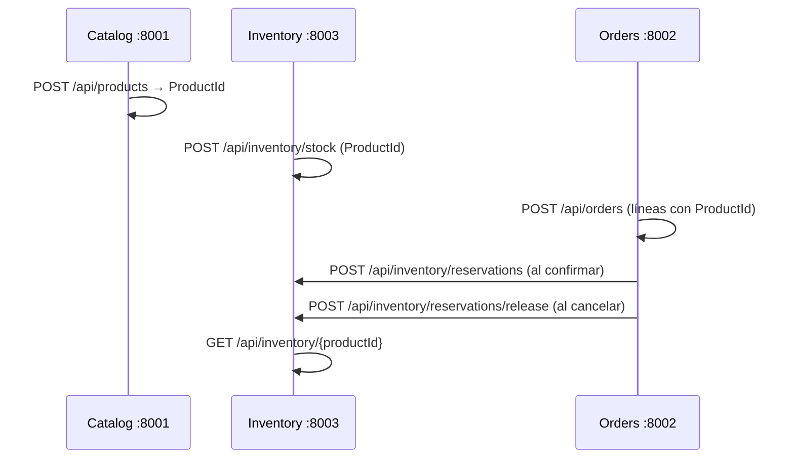
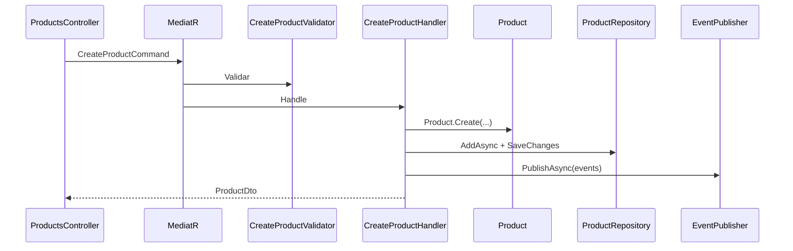
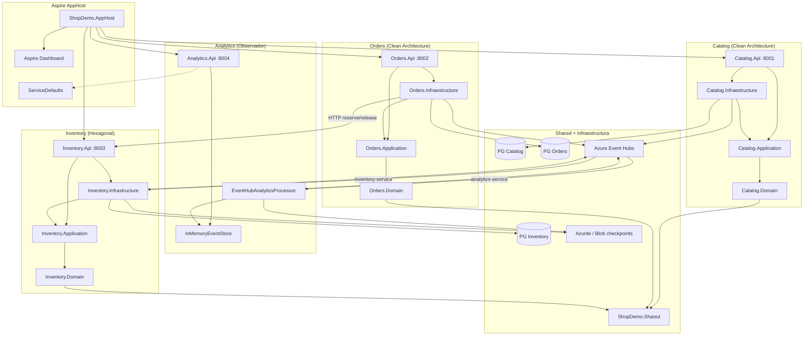

# Arquitectura de ShopDemo

| Campo | Detalle |
|:------|:--------|
| **Empresa** | Lite Thinking |
| **Curso** | Microservicios con .NET en Kubernetes y Entornos Multicloud |
| **Instructor** | Lcc. Gilberto Valentino Juárez Sánchez |
| **Contacto** | WhatsApp: +52 5614206660 |
| | E-mail: gilberto.juarez@gmail.com |
| | E-mail: lcc.gilberto.juarez@gmail.com |

**Índice general del curso:** [README.md](../README.md) · **Prueba de APIs:** [GUIA-ENDPOINTS.md](./GUIA-ENDPOINTS.md)

---

## 1. Visión general

**ShopDemo** es una plataforma de e-commerce organizada como **sistema distribuido por bounded contexts**, implementada en **.NET 10**. Cada microservicio de negocio tiene su propia base de datos PostgreSQL y API HTTP independiente. La orquestación local unificada se realiza con **.NET Aspire** (`ShopDemo.AppHost`).

La solución combina dos estilos arquitectónicos de forma intencional en los microservicios de dominio, más un **observador de eventos** orquestado por Aspire:

| Microservicio | Estilo arquitectónico | Orquestación |
|---|---|---|
| **Catalog** | Clean Architecture + DDD | CQRS con MediatR |
| **Orders** | Clean Architecture + DDD | CQRS con MediatR |
| **Inventory** | Hexagonal (Ports & Adapters) | Casos de uso + Inbound Ports |
| **Analytics** | API mínima + `BackgroundService` | Consumidor Event Hubs (read-only) |
| **AppHost** | .NET Aspire | Orquesta 4 APIs + PostgreSQL + Azurite + config Event Hubs |

```
┌──────────────────────────────────────────────────────────────────────────────┐
│  API (Presentación)                                                          │
│  Catalog (:8001)  Orders (:8002)  Inventory (:8003)  Analytics (:8004)     │
├──────────────────────────────────────────────────────────────────────────────┤
│  Infrastructure / Adaptadores Driven                                         │
│  EF Core, HTTP clients, Event Hubs publishers/consumers                      │
├──────────────────────────────────────────────────────────────────────────────┤
│  Application                                                                 │
│  Commands/Queries (MediatR)  │  Use Cases + Ports (Hexagonal)                │
├──────────────────────────────────────────────────────────────────────────────┤
│  Domain                                                                      │
│  Aggregates, Value Objects, Domain Events, Repositories                      │
├──────────────────────────────────────────────────────────────────────────────┤
│  Shared Kernel — ShopDemo.Shared                                             │
│  Entity, AggregateRoot, ValueObject, IRepository, IntegrationEventEnvelope   │
├──────────────────────────────────────────────────────────────────────────────┤
│  Orquestación — Aspire/ShopDemo.AppHost                                      │
│  PostgreSQL ×3, Azurite, Event Hubs config, service discovery, dashboard     │
└──────────────────────────────────────────────────────────────────────────────┘
```

---

## 1.1 Roadmap de etapas (práctica del curso)

La solución se construye y valida en **etapas incrementales**. En cada una conviene leer el documento de **requerimientos** (el qué y el por qué) y el de **implementación** (el cómo).



| Etapa | Entregable | Requerimientos | Implementación | Validación |
|---|---|---|---|---|
| 0 | Entender el dominio | — | [GUIA-ENDPOINTS](./GUIA-ENDPOINTS.md) | Postman E2E |
| 1 | Catalog API | [catalog/REQUERIMIENTOS-CATALOG](./catalog/REQUERIMIENTOS-CATALOG.md) | [catalog/IMPLEMENTACION-CATALOG](./catalog/IMPLEMENTACION-CATALOG.md) | `POST /api/products` |
| 2 | Orders API | [orders/REQUERIMIENTOS-ORDERS](./orders/REQUERIMIENTOS-ORDERS.md) | [orders/IMPLEMENTACION-ORDERS](./orders/IMPLEMENTACION-ORDERS.md) | Confirmar pedido |
| 3 | Inventory API | [inventory/REQUERIMIENTOS-INVENTORY](./inventory/REQUERIMIENTOS-INVENTORY.md) | [inventory/IMPLEMENTACION-INVENTORY](./inventory/IMPLEMENTACION-INVENTORY.md) | Reserva/liberación stock |
| 4 | Flujo integrado | [GUIA-ENDPOINTS](./GUIA-ENDPOINTS.md) | §4 de este documento | Compra completa |
| 5 | Mensajería Azure | [INTEGRACION-AZURE-EVENT-HUBS](./INTEGRACION-AZURE-EVENT-HUBS.md) | Mismo documento | Auto-stock por evento |
| 6 | Orquestación Aspire | [analytics/REQUERIMIENTOS-ANALYTICS-ASPIRE](./analytics/REQUERIMIENTOS-ANALYTICS-ASPIRE.md) | [analytics/IMPLEMENTACION-ANALYTICS-ASPIRE](./analytics/IMPLEMENTACION-ANALYTICS-ASPIRE.md) | `/api/analytics/events` |
| 7 | Contenedores en Azure | [despliegue/azure/REQUERIMIENTOS](./despliegue/azure/REQUERIMIENTOS-DESPLIEGUE-AZURE.md) | [despliegue/azure/IMPLEMENTACION](./despliegue/azure/IMPLEMENTACION-DESPLIEGUE-AZURE.md) | ACA + ACR |
| 8 | Contenedores en AWS | [despliegue/aws/REQUERIMIENTOS](./despliegue/aws/REQUERIMIENTOS-DESPLIEGUE-AWS.md) | [despliegue/aws/IMPLEMENTACION](./despliegue/aws/IMPLEMENTACION-DESPLIEGUE-AWS.md) | ECS + ECR |

---

## 1.2 Modos de ejecución

| Modo | Cuándo usarlo | Comando / ubicación |
|---|---|---|
| **Docker Compose** | Etapas 1–5; un servicio aislado | `docker compose up` en cada `*.Api/` |
| **Aspire AppHost** | Etapa 6; desarrollo integrado | `dotnet run --project Aspire/ShopDemo.AppHost` |
| **dotnet run** | Depuración de un solo proyecto | `dotnet run --project <Api>.csproj` |
| **Azure Container Apps** | Etapa 7; nube Microsoft | [despliegue/azure/](./despliegue/azure/) |
| **AWS ECS Fargate** | Etapa 8; nube Amazon | [despliegue/aws/](./despliegue/aws/) |

---

## 1.3 Matriz de configuración

Variables en formato ASP.NET Core (`Section__Key`). Origen según modo de ejecución:

| Variable | Catalog | Orders | Inventory | Analytics | AppHost |
|---|---|---|---|---|---|
| `ConnectionStrings__DefaultConnection` | ✅ | ✅ | ✅ | — | — (Aspire inyecta por referencia PG) |
| `InventoryApi__BaseUrl` | — | ✅ | — | — | Aspire: auto |
| `EventHubs__Enabled` | ✅ | ✅ | ✅ | ✅ | `ShopDemo:EventHubs:Enabled` |
| `EventHubs__ConnectionString` | ✅ | ✅ | ✅ | ✅ | `ShopDemo:EventHubs:ConnectionString` |
| `EventHubs__EventHubName` | ✅ | ✅ | ✅ | ✅ | `ShopDemo:EventHubs:EventHubName` |
| `EventHubs__ConsumerGroup` | — | — | ✅ | ✅ | AppHost inyecta |
| `EventHubs__CheckpointStorageConnectionString` | — | — | ✅ | ✅ | AppHost / Azurite |
| `EventHubs__CheckpointContainerName` | — | — | ✅ | ✅ | AppHost inyecta |

**Archivos locales:**

| Servicio | `appsettings.json` | `.env` (compose) | User secrets |
|---|---|---|---|
| Catalog | `Catalog/.../appsettings.json` | `.env.example` → `.env` | Opcional |
| Orders | `Orders/.../appsettings.json` | `.env.example` → `.env` | Opcional |
| Inventory | `Inventory/.../appsettings.json` | `.env.example` → `.env` | Opcional |
| Analytics | `Aspire/.../appsettings.json` | `.env.example` → `.env` | Opcional |
| AppHost | `appsettings.Development.json` | — | **Recomendado** para EH |

**Nube:** secretos en Container Apps (Azure), SSM/Secrets Manager (AWS) o GitHub Actions secrets. Detalle en [despliegue/README.md](./despliegue/README.md).

---

## 2. Estructura de la solución

La solución (`ShopDemo.slnx`) contiene **16 proyectos**:

| Carpeta | Proyecto | Rol |
|---|---|---|
| — | `ShopDemo.Shared` | Kernel compartido DDD + contrato de mensajería |
| Catalog | `ShopDemo.Catalog.Domain` | Modelo de dominio del catálogo |
| Catalog | `ShopDemo.Catalog.Application` | CQRS — comandos y consultas |
| Catalog | `ShopDemo.Catalog.Infraestructure` | EF Core, Event Hubs publisher |
| Catalog | `ShopDemo.Catalog.Api` | API HTTP del catálogo |
| Orders | `ShopDemo.Orders.Domain` | Modelo de dominio de pedidos |
| Orders | `ShopDemo.Orders.Application` | CQRS — comandos y consultas |
| Orders | `ShopDemo.Orders.Infraestructure` | EF Core, HTTP a Inventory, Event Hubs |
| Orders | `ShopDemo.Orders.Api` | API HTTP de pedidos |
| Inventory | `ShopDemo.Inventory.Domain` | Núcleo de inventario |
| Inventory | `ShopDemo.Inventory.Application` | Puertos y casos de uso |
| Inventory | `ShopDemo.Inventory.Infrastructure` | EF Core, Event Hubs pub/sub |
| Inventory | `ShopDemo.Inventory.Api` | API HTTP de inventario |
| Aspire | `ShopDemo.AppHost` | Orquestador Aspire (4 APIs + infra) |
| Aspire | `ShopDemo.ServiceDefaults` | Telemetría, health, service discovery |
| Aspire | `ShopDemo.Analytics.Api` | Observador Event Hubs + API de consulta |

### Regla de dependencias

```
Api → Infrastructure → Application → Domain → Shared
```

- **Domain** solo referencia `Shared`.
- **Application** referencia `Domain` (y opcionalmente `Shared`).
- **Infrastructure** implementa puertos definidos en capas superiores.
- **Api** compone DI y expone HTTP.

---

## 3. Microservicios y puertos

| Servicio | Puerto API | PostgreSQL (host) | Base de datos | Arquitectura |
|---|---|---|---|---|
| **Catalog** | 8001 | 5433* | `ShopDemoCatalog` | Clean + CQRS |
| **Orders** | 8002 | 5434* | `ShopDemoOrders` | Clean + CQRS |
| **Inventory** | 8003 | 5435* | `ShopDemoInventory` | Hexagonal |
| **Analytics** | 8004 | — | — (sin BD; buffer en memoria) | Observador Event Hubs |
| **Aspire Dashboard** | ~15888 | — | — | Orquestación local |

\* Con **Docker Compose** cada servicio usa su propio contenedor PostgreSQL en el puerto indicado. Con **Aspire AppHost** se usa un servidor PostgreSQL compartido con tres bases de datos.

### Orquestación con Aspire

```bash
dotnet run --project Aspire/ShopDemo.AppHost
```

El AppHost levanta los 4 APIs, PostgreSQL (3 DBs), Azurite (checkpoints Event Hubs), inyecta `EventHubs__*` y resuelve `InventoryApi__BaseUrl` para Orders vía **service discovery**. Los `Program.cs` de Catalog, Orders e Inventory **no se modifican** en Fase 1.

**Documentación:** [docs/analytics/](./analytics/) · [INTEGRACION-ASPIRE.md](./INTEGRACION-ASPIRE.md)

---

## 4. Integración entre bounded contexts

### 4.1 Flujo de negocio integrado



Con **Event Hubs habilitado**, el paso de registro de stock puede ocurrir de forma automática: Catalog publica `ProductCreatedDomainEvent` → Inventory (`inventory-service`) crea stock sin llamada HTTP. Analytics (`analytics-service`) observa el mismo evento en paralelo.

### 4.2 Integración síncrona (implementada)

| Origen | Destino | Mecanismo | Cuándo |
|---|---|---|---|
| Orders | Inventory | HTTP (`IInventoryService` → `InventoryHttpClient`) | Confirmar / cancelar pedido |

Orders no conoce el dominio de Inventory; solo consume su contrato HTTP.

### 4.3 Integración asíncrona (Azure Event Hubs)

Los tres microservicios de negocio publican **Domain Events** a **Azure Event Hubs** cuando `EventHubs:Enabled = true`. El contrato común es `IntegrationEventEnvelope` en `ShopDemo.Shared`.

```
┌──────────────┐    IntegrationEventEnvelope    ┌──────────────────────┐
│ Catalog      │ ─────────────────────────────► │ Azure Event Hubs     │
│ Orders       │ ─────────────────────────────► │ (shopdemo-events)    │
│ Inventory    │ ─────────────────────────────► └──────────┬───────────┘
└──────────────┘                                          │
                              ┌───────────────────────────┼───────────────────────────┐
                              ▼                           ▼                           │
                    inventory-service            analytics-service                    │
                              │                           │                           │
                              ▼                           ▼                           │
                    CatalogEventsProcessor        EventHubAnalyticsProcessor          │
                    (auto-stock ProductCreated)   (observador read-only)            │
                              │                           │                           │
                              ▼                           ▼                           │
                    Inventory.Api :8003           Analytics.Api :8004                 │
                    POST stock automático         GET /api/analytics/events           │
```

| Consumer group | Servicio | Comportamiento |
|---|---|---|
| `inventory-service` | Inventory | Reacciona a `ProductCreatedDomainEvent` — registra stock automáticamente |
| `analytics-service` | Analytics | Observa **todos** los eventos; los expone vía HTTP sin lógica de negocio |

**Fan-out:** un mismo evento publicado por Catalog es consumido de forma independiente por Inventory (efecto de negocio) y Analytics (auditoría/BI en memoria).

**Checkpoints:** Inventory y Analytics persisten progreso en Azure Blob Storage (Azurite en desarrollo local / Aspire).

**Configuración:** centralizada en `ShopDemo.AppHost` o por servicio vía `docker-compose` + `.env`. Ver [INTEGRACION-AZURE-EVENT-HUBS.md](./INTEGRACION-AZURE-EVENT-HUBS.md).

> Con Event Hubs deshabilitado (`EventHubs:Enabled = false`), los adaptadores de logging siguen activos y el registro manual de stock en Inventory permanece disponible.

---

## 5. Shared Kernel (`ShopDemo.Shared`)

| Abstracción | Responsabilidad |
|---|---|
| `Entity<TId>` | Identidad tipada, comparación por `Id` (`protected set` en `Id`) |
| `AggregateRoot<TId>` | Gestión de `DomainEvents` |
| `ValueObject` | Igualdad por componentes |
| `IDomainEvent` | `EventId`, `OccurredOn` (`DateTimeOffset`) |
| `IRepository<TAggregate, TId>` | CRUD genérico |
| `IUnitOfWork` | `SaveChangesAsync()` |
| `IntegrationEventEnvelope` | Contrato JSON para Event Hubs (`EventType`, `EventId`, `Source`, `PayloadJson`) |

---

## 6. Bounded Context: Catalog

**Documentación:** [docs/catalog/](./catalog/)

### 6.1 Estado de implementación

| Componente | Estado |
|---|---|
| Domain (agregado, VOs, eventos, repositorio) | ✅ Completo |
| Application (CreateProduct + validación) | ✅ MVP |
| Infrastructure (EF Core, migraciones, eventos) | ✅ Completo |
| API (`POST /api/products`, Swagger) | ✅ MVP |
| Queries CQRS adicionales | ⏳ Preparado |

### 6.2 Agregado `Product`

```
Product (Aggregate Root)
├── ProductName      (Value Object)
├── Money            (Value Object) — precio
├── StockLevel       (Value Object) — inventario en catálogo
├── Category         (Value Object)
├── Description      (string)
├── IsActive         (bool)
├── CreatedAt        (DateTimeOffset)
└── LastUpdatedAt    (DateTimeOffset?)
```

**Comportamientos:** `Create`, `UpdateDetails`, `ChangePrice`, `ReplenishStock`, `DeductStock`, `Deactivate`, `HasSufficientStock`.

**Endpoint expuesto:** `POST /api/products`

### 6.3 Flujo CreateProduct (CQRS)



---

## 7. Bounded Context: Orders

**Documentación:** [docs/orders/](./orders/)

### 7.1 Estado de implementación

| Componente | Estado |
|---|---|
| Domain (`Order`, `OrderLine`, VOs, eventos) | ✅ Completo |
| Application (Place, Confirm, Cancel, queries) | ✅ Completo |
| Infrastructure (EF Core + HTTP Inventory) | ✅ Completo |
| API (OrdersController, Swagger) | ✅ Completo |

### 7.2 Agregado `Order`

Ciclo de vida: `Pending` → `Confirmed` → `Shipped` → `Delivered` / `Cancelled`.

**Integración con Inventory:** al confirmar, `ConfirmOrderHandler` llama `IInventoryService.ReserveStockAsync`. Al cancelar un pedido confirmado, `CancelOrderHandler` llama `ReleaseStockAsync`.

---

## 8. Bounded Context: Inventory

**Documentación:** [docs/inventory/](./inventory/)

### 8.1 Estado de implementación

| Componente | Estado |
|---|---|
| Domain (`StockEntry`, VOs, eventos) | ✅ Completo |
| Application (puertos + use cases) | ✅ Completo |
| Infrastructure (EF Core, migraciones) | ✅ Completo |
| API (stock + reservations, Swagger) | ✅ Completo |

### 8.2 Arquitectura hexagonal

| Tipo | Implementación |
|---|---|
| Driving adapters | `StockController`, `ReservationsController` |
| Inbound ports | `IRegisterStockUseCase`, `IGetStockByProductUseCase`, `IReserveStockUseCase`, `IReleaseStockUseCase` |
| Outbound ports | `IStockEntryRepository`, `IIntegrationEventPublisher` |
| Driven adapters | `StockEntryRepository`, `EventHubsIntegrationEventPublisher`, `CatalogEventsProcessor` |

**Endpoints:**

- `POST /api/inventory/stock`
- `GET /api/inventory/{productId}`
- `POST /api/inventory/reservations`
- `POST /api/inventory/reservations/release`

### 8.3 Consumidor Event Hubs (`CatalogEventsProcessor`)

Cuando Event Hubs está habilitado, Inventory escucha `ProductCreatedDomainEvent` del bus y ejecuta `RegisterStock` automáticamente (consumer group `inventory-service`). Esto complementa — no reemplaza — el endpoint manual `POST /api/inventory/stock`.

---

## 9. Bounded Context: Analytics (Aspire)

**Documentación:** [docs/analytics/](./analytics/)

### 9.1 Estado de implementación

| Componente | Estado |
|---|---|
| `EventHubAnalyticsProcessor` (consumer group `analytics-service`) | ✅ Completo |
| `InMemoryEventStore` (ring buffer, máx. 100 eventos) | ✅ Completo |
| API (`GET /api/analytics/events`, Swagger) | ✅ Completo |
| `ShopDemo.ServiceDefaults` (telemetría Aspire) | ✅ Completo |
| `ShopDemo.AppHost` (orquestación 4 APIs) | ✅ Completo |

### 9.2 Rol arquitectónico

Analytics **no es un bounded context de negocio** con dominio propio; es un **observador transversal** del bus de eventos:

| Atributo | Valor |
|---|---|
| Acoplamiento con Catalog/Orders/Inventory | Solo asíncrono (mismo Event Hub) |
| Lógica de negocio | Ninguna — read-only |
| Persistencia | Memoria (MVP); sin PostgreSQL |
| Consumer group | `analytics-service` (offset independiente de Inventory) |

**Endpoints:**

- `GET /api/analytics/events?take=50` — últimos eventos observados
- `GET /api/analytics/health` — estado del servicio

---

## 10. Diagrama de componentes



---

## 11. Despliegue

### 11.1 Docker Compose (por microservicio)

Cada microservicio de negocio tiene su propio `docker-compose.yml`:

| Servicio | Ubicación compose | API | PostgreSQL |
|---|---|---|---|
| Catalog | `Catalog/ShopDemo.Catalog.Api/` | 8001 | 5433 |
| Orders | `Orders/ShopDemo.Orders.Api/` | 8002 | 5434 |
| Inventory | `Inventory/ShopDemo.Inventory.Api/` | 8003 | 5435 |
| Analytics | `Aspire/ShopDemo.Analytics.Api/` | 8004 | — (Azurite en compose) |

Patrón común:

- Imagen PostgreSQL 16 Alpine
- Healthcheck `pg_isready` antes de levantar la API
- Volumen persistente por servicio
- Dockerfile multi-stage .NET 10 con usuario no-root
- Migraciones EF aplicadas al iniciar (`MigrateAsync`)

### 11.2 .NET Aspire (orquestación integrada)

| Componente | Ubicación | Rol |
|---|---|---|
| AppHost | `Aspire/ShopDemo.AppHost/` | Arranque unificado de 4 APIs + infra |
| ServiceDefaults | `Aspire/ShopDemo.ServiceDefaults/` | Telemetría y health (Analytics en Fase 1) |
| Analytics | `Aspire/ShopDemo.Analytics.Api/` | Solo disponible vía Aspire o ejecución directa |

```bash
dotnet run --project Aspire/ShopDemo.AppHost
```

**Coexistencia:** Docker Compose y Aspire son alternativas. Compose sirve para desplegar un microservicio aislado; Aspire para desarrollo integrado con dashboard y configuración centralizada.

### 11.3 Despliegue en nube (Azure / AWS)

| Plataforma | Servicio de cómputo | Documentación |
|---|---|---|
| **Azure** | Container Apps + ACR | [docs/despliegue/azure/](./despliegue/azure/) |
| **AWS** | ECS Fargate + ECR | [docs/despliegue/aws/](./despliegue/aws/) |
| **Kubernetes** | Minikube / AKS / EKS | [despliegue/kubernetes/](./despliegue/kubernetes/) + [k8s/](../k8s/) |

Cada guía incluye pasos por **Portal/Consola** y **CLI**. Manifiestos en `k8s/`.

---

## 12. Documentación por microservicio

| Microservicio | Requerimientos | Implementación |
|---|---|---|
| Catalog | [REQUERIMIENTOS-CATALOG.md](./catalog/REQUERIMIENTOS-CATALOG.md) | [IMPLEMENTACION-CATALOG.md](./catalog/IMPLEMENTACION-CATALOG.md) |
| Orders | [REQUERIMIENTOS-ORDERS.md](./orders/REQUERIMIENTOS-ORDERS.md) | [IMPLEMENTACION-ORDERS.md](./orders/IMPLEMENTACION-ORDERS.md) |
| Inventory | [REQUERIMIENTOS-INVENTORY.md](./inventory/REQUERIMIENTOS-INVENTORY.md) | [IMPLEMENTACION-INVENTORY.md](./inventory/IMPLEMENTACION-INVENTORY.md) |
| Analytics + Aspire | [REQUERIMIENTOS-ANALYTICS-ASPIRE.md](./analytics/REQUERIMIENTOS-ANALYTICS-ASPIRE.md) | [IMPLEMENTACION-ANALYTICS-ASPIRE.md](./analytics/IMPLEMENTACION-ANALYTICS-ASPIRE.md) |
| Despliegue Azure | [REQUERIMIENTOS-DESPLIEGUE-AZURE.md](./despliegue/azure/REQUERIMIENTOS-DESPLIEGUE-AZURE.md) | [IMPLEMENTACION-DESPLIEGUE-AZURE.md](./despliegue/azure/IMPLEMENTACION-DESPLIEGUE-AZURE.md) |
| Despliegue AWS | [REQUERIMIENTOS-DESPLIEGUE-AWS.md](./despliegue/aws/REQUERIMIENTOS-DESPLIEGUE-AWS.md) | [IMPLEMENTACION-DESPLIEGUE-AWS.md](./despliegue/aws/IMPLEMENTACION-DESPLIEGUE-AWS.md) |
| Kubernetes local | [REQUERIMIENTOS-KUBERNETES.md](./despliegue/kubernetes/REQUERIMIENTOS-KUBERNETES.md) | [IMPLEMENTACION-KUBERNETES-LOCAL.md](./despliegue/kubernetes/IMPLEMENTACION-KUBERNETES-LOCAL.md) |
| Azure AKS | [REQUERIMIENTOS-DESPLIEGUE-AKS.md](./despliegue/aks/REQUERIMIENTOS-DESPLIEGUE-AKS.md) | [IMPLEMENTACION-DESPLIEGUE-AKS.md](./despliegue/aks/IMPLEMENTACION-DESPLIEGUE-AKS.md) |
| Amazon EKS | [REQUERIMIENTOS-DESPLIEGUE-EKS.md](./despliegue/eks/REQUERIMIENTOS-DESPLIEGUE-EKS.md) | [IMPLEMENTACION-DESPLIEGUE-EKS.md](./despliegue/eks/IMPLEMENTACION-DESPLIEGUE-EKS.md) |

**Integración transversal:**

| Tema | Documento |
|---|---|
| Azure Event Hubs | [INTEGRACION-AZURE-EVENT-HUBS.md](./INTEGRACION-AZURE-EVENT-HUBS.md) |
| .NET Aspire | [INTEGRACION-ASPIRE.md](./INTEGRACION-ASPIRE.md) |
| Endpoints y flujos de prueba | [GUIA-ENDPOINTS.md](./GUIA-ENDPOINTS.md) |

---

## 13. Estado de madurez por componente

| Componente | Estado | Completitud |
|---|---|---|
| Shared Kernel | Implementado | ~95% |
| Catalog — Domain | Implementado | ~90% |
| Catalog — Application (commands) | MVP (CreateProduct) | ~40% |
| Catalog — Application (queries) | Pendiente | 0% |
| Catalog — Infrastructure | Implementado | ~95% |
| Catalog — API | MVP (1 endpoint) | ~30% |
| Orders — completo | Implementado | ~90% |
| Inventory — completo | Implementado | ~90% |
| Integración Orders → Inventory | Implementada (HTTP) | ~85% |
| Azure Event Hubs (publishers) | Implementado (Catalog, Orders, Inventory) | ~90% |
| Event Hubs consumer Inventory | Implementado (`CatalogEventsProcessor`) | ~85% |
| Analytics + Aspire AppHost | Implementado | ~85% |
| Despliegue Docker → Azure (ACA) | Documentado | Guía en `docs/despliegue/azure/` |
| Despliegue Docker → AWS (ECS) | Documentado | Guía en `docs/despliegue/aws/` |
| Kubernetes (Minikube / AKS / EKS) | Implementado | Manifiestos `k8s/` + `docs/despliegue/kubernetes/` |
| Docker por servicio | Implementado | ~90% |
| Azure Container Apps / `azd` (automatizado Aspire) | Documentado — pendiente | 0% |

---

## 14. Observaciones técnicas

1. **Typo consistente:** los proyectos de infraestructura usan `Infraestructure` (con "e") en Catalog y Orders; Inventory usa `Infrastructure` (ortografía estándar).

2. **Validación en dos capas:** FluentValidation valida la forma del comando (Application); los Value Objects validan reglas de negocio (Domain). Separación correcta y deliberada.

3. **Stock en dos contextos:** Catalog tiene `StockLevel` (informativo en catálogo); Inventory tiene `StockEntry` (stock operativo para reservas). En el ejercicio, Inventory es la fuente de verdad para reservas.

4. **DTOs vs agregados:** ninguna API expone agregados directamente; siempre se proyectan a DTOs en Application.

5. **Referencias a Shared:** los proyectos Domain referencian `../../ShopDemo.Shared/ShopDemo.Shared.csproj` desde subcarpetas `Catalog/`, `Orders/`, `Inventory/`.

6. **Fase 1 Aspire:** Catalog, Orders e Inventory no usan `AddServiceDefaults()` en su `Program.cs`. Solo Analytics lo adopta; los tres microservicios existentes se referencian desde AppHost sin cambios en dominio ni application.

7. **Dos modos de stock inicial:** con Event Hubs habilitado, Inventory crea stock automáticamente al recibir `ProductCreated`. Sin Event Hubs, el ejercicio manual (`POST /api/inventory/stock`) sigue siendo válido.

---

## 15. Resumen ejecutivo

ShopDemo implementa **tres microservicios de negocio** que modelan un flujo de e-commerce — definición de productos (Catalog), gestión de pedidos (Orders) y control de stock (Inventory) — más un **cuarto servicio observador** (Analytics) orquestado con **.NET Aspire**. Catalog y Orders usan **Clean Architecture con CQRS**; Inventory usa **arquitectura hexagonal** para comparar enfoques en el mismo curso.

La integración entre contextos combina **HTTP síncrono** (Orders → Inventory), **Azure Event Hubs** con fan-out (`inventory-service` + `analytics-service`) y orquestación local vía **AppHost** (PostgreSQL, Azurite, service discovery, dashboard). Cada microservicio de negocio mantiene **PostgreSQL dedicado** en Docker Compose, **Swagger**, documentación en `docs/` y puede ejecutarse de forma independiente, bajo Aspire o en **Azure Container Apps / AWS ECS**.

**Guía de inicio para alumnos:** [README.md](../README.md)
