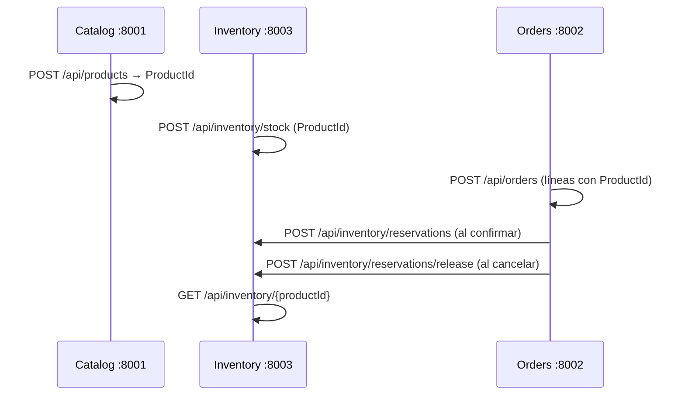
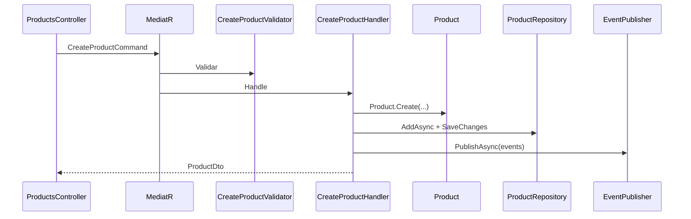
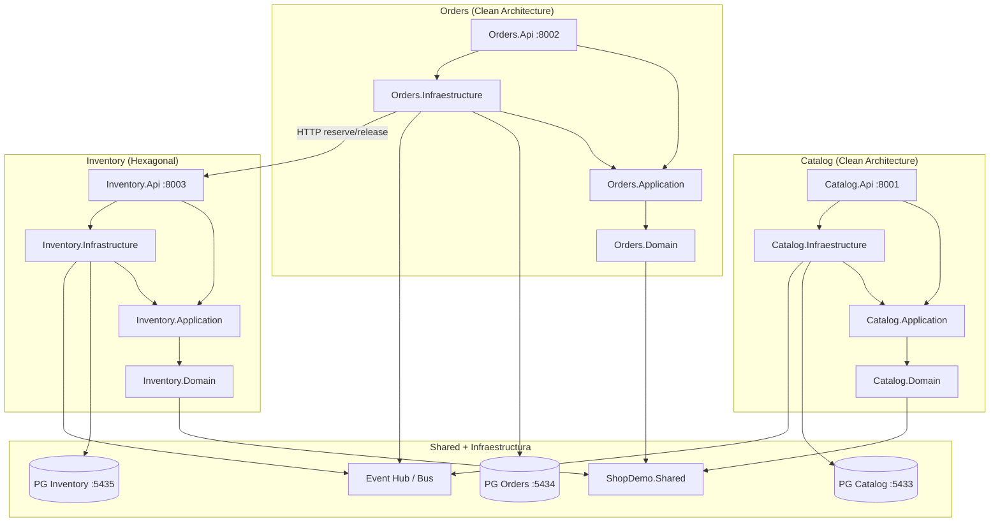

# Arquitectura de ShopDemo

## 1. Visión general

**ShopDemo** es una plataforma de e-commerce organizada como **sistema distribuido por bounded contexts**, implementada en **.NET 10**. Cada microservicio tiene su propia base de datos PostgreSQL y API HTTP independiente.

La solución combina dos estilos arquitectónicos de forma intencional:

| Microservicio | Estilo arquitectónico | Orquestación |
|---|---|---|
| **Catalog** | Clean Architecture + DDD | CQRS con MediatR |
| **Orders** | Clean Architecture + DDD | CQRS con MediatR |
| **Inventory** | Hexagonal (Ports & Adapters) | Casos de uso + Inbound Ports |

```
┌─────────────────────────────────────────────────────────────────────┐
│  API (Presentación)                                                 │
│  Catalog.Api (:8001)  Orders.Api (:8002)  Inventory.Api (:8003)   │
├─────────────────────────────────────────────────────────────────────┤
│  Infrastructure / Adaptadores Driven                                │
│  EF Core, HTTP clients, logging de eventos                          │
├─────────────────────────────────────────────────────────────────────┤
│  Application                                                        │
│  Commands/Queries (MediatR)  │  Use Cases + Ports (Hexagonal)       │
├─────────────────────────────────────────────────────────────────────┤
│  Domain                                                             │
│  Aggregates, Value Objects, Domain Events, Repositories             │
├─────────────────────────────────────────────────────────────────────┤
│  Shared Kernel — ShopDemo.Shared                                    │
│  Entity, AggregateRoot, ValueObject, IRepository, IUnitOfWork       │
└─────────────────────────────────────────────────────────────────────┘
```

---

## 2. Estructura de la solución

La solución (`ShopDemo.slnx`) contiene **13 proyectos**:

| Carpeta | Proyecto | Rol |
|---|---|---|
| — | `ShopDemo.Shared` | Kernel compartido DDD |
| Catalog | `ShopDemo.Catalog.Domain` | Modelo de dominio del catálogo |
| Catalog | `ShopDemo.Catalog.Application` | CQRS — comandos y consultas |
| Catalog | `ShopDemo.Catalog.Infraestructure` | EF Core, mensajería |
| Catalog | `ShopDemo.Catalog.Api` | API HTTP del catálogo |
| Orders | `ShopDemo.Orders.Domain` | Modelo de dominio de pedidos |
| Orders | `ShopDemo.Orders.Application` | CQRS — comandos y consultas |
| Orders | `ShopDemo.Orders.Infraestructure` | EF Core, HTTP a Inventory |
| Orders | `ShopDemo.Orders.Api` | API HTTP de pedidos |
| Inventory | `ShopDemo.Inventory.Domain` | Núcleo de inventario |
| Inventory | `ShopDemo.Inventory.Application` | Puertos y casos de uso |
| Inventory | `ShopDemo.Inventory.Infrastructure` | EF Core, mensajería |
| Inventory | `ShopDemo.Inventory.Api` | API HTTP de inventario |

### Regla de dependencias

```
Api → Infrastructure → Application → Domain → Shared
```

- **Domain** solo referencia `Shared`.
- **Application** referencia `Domain` (y opcionalmente `Shared`).
- **Infrastructure** implementa puertos definidos en capas superiores.
- **Api** compone DI y expone HTTP.

---

## 3. Microservicios y puertos

| Servicio | Puerto API | PostgreSQL (host) | Base de datos | Arquitectura |
|---|---|---|---|---|
| **Catalog** | 8001 | 5433 | `ShopDemoCatalog` | Clean + CQRS |
| **Orders** | 8002 | 5434 | `ShopDemoOrders` | Clean + CQRS |
| **Inventory** | 8003 | 5435 | `ShopDemoInventory` | Hexagonal |

---

## 4. Integración entre bounded contexts

### 4.1 Flujo de negocio integrado



### 4.2 Integración síncrona (implementada)

| Origen | Destino | Mecanismo | Cuándo |
|---|---|---|---|
| Orders | Inventory | HTTP (`IInventoryService` → `InventoryHttpClient`) | Confirmar / cancelar pedido |

Orders no conoce el dominio de Inventory; solo consume su contrato HTTP.

### 4.3 Integración asíncrona (diseño / desarrollo)

Los tres servicios publican **Domain Events** a un adaptador de logging (`LoggingDomainEventPublisher` / `LoggingIntegrationEventPublisher`). En producción se sustituiría por **Azure Event Hubs**.

```
┌──────────────┐    Domain Events     ┌──────────────────┐
│ Catalog      │ ──────────────────►  │ Event Hub / Bus  │
│ Orders       │ ──────────────────►  └────────┬─────────┘
│ Inventory    │ ──────────────────►           │
└──────────────┘                               ▼
                                    Suscriptores futuros
```

**Nota:** Catalog e Inventory no se sincronizan automáticamente por eventos en el MVP. El registro de stock en Inventory es un paso manual del ejercicio (`POST /api/inventory/stock`).

---

## 5. Shared Kernel (`ShopDemo.Shared`)

| Abstracción | Responsabilidad |
|---|---|
| `Entity<TId>` | Identidad tipada, comparación por `Id` (`protected set` en `Id`) |
| `AggregateRoot<TId>` | Gestión de `DomainEvents` |
| `ValueObject` | Igualdad por componentes |
| `IDomainEvent` | `EventId`, `OccurredOn` (`DateTimeOffset`) |
| `IRepository<TAggregate, TId>` | CRUD genérico |
| `IUnitOfWork` | `SaveChangesAsync()` |

---

## 6. Bounded Context: Catalog

**Documentación:** [docs/catalog/](./catalog/)

### 6.1 Estado de implementación

| Componente | Estado |
|---|---|
| Domain (agregado, VOs, eventos, repositorio) | ✅ Completo |
| Application (CreateProduct + validación) | ✅ MVP |
| Infrastructure (EF Core, migraciones, eventos) | ✅ Completo |
| API (`POST /api/products`, Swagger) | ✅ MVP |
| Queries CQRS adicionales | ⏳ Preparado |

### 6.2 Agregado `Product`

```
Product (Aggregate Root)
├── ProductName      (Value Object)
├── Money            (Value Object) — precio
├── StockLevel       (Value Object) — inventario en catálogo
├── Category         (Value Object)
├── Description      (string)
├── IsActive         (bool)
├── CreatedAt        (DateTimeOffset)
└── LastUpdatedAt    (DateTimeOffset?)
```

**Comportamientos:** `Create`, `UpdateDetails`, `ChangePrice`, `ReplenishStock`, `DeductStock`, `Deactivate`, `HasSufficientStock`.

**Endpoint expuesto:** `POST /api/products`

### 6.3 Flujo CreateProduct (CQRS)



---

## 7. Bounded Context: Orders

**Documentación:** [docs/orders/](./orders/)

### 7.1 Estado de implementación

| Componente | Estado |
|---|---|
| Domain (`Order`, `OrderLine`, VOs, eventos) | ✅ Completo |
| Application (Place, Confirm, Cancel, queries) | ✅ Completo |
| Infrastructure (EF Core + HTTP Inventory) | ✅ Completo |
| API (OrdersController, Swagger) | ✅ Completo |

### 7.2 Agregado `Order`

Ciclo de vida: `Pending` → `Confirmed` → `Shipped` → `Delivered` / `Cancelled`.

**Integración con Inventory:** al confirmar, `ConfirmOrderHandler` llama `IInventoryService.ReserveStockAsync`. Al cancelar un pedido confirmado, `CancelOrderHandler` llama `ReleaseStockAsync`.

---

## 8. Bounded Context: Inventory

**Documentación:** [docs/inventory/](./inventory/)

### 8.1 Estado de implementación

| Componente | Estado |
|---|---|
| Domain (`StockEntry`, VOs, eventos) | ✅ Completo |
| Application (puertos + use cases) | ✅ Completo |
| Infrastructure (EF Core, migraciones) | ✅ Completo |
| API (stock + reservations, Swagger) | ✅ Completo |

### 8.2 Arquitectura hexagonal

| Tipo | Implementación |
|---|---|
| Driving adapters | `StockController`, `ReservationsController` |
| Inbound ports | `IRegisterStockUseCase`, `IGetStockByProductUseCase`, `IReserveStockUseCase`, `IReleaseStockUseCase` |
| Outbound ports | `IStockEntryRepository`, `IIntegrationEventPublisher` |
| Driven adapters | `StockEntryRepository`, `LoggingIntegrationEventPublisher` |

**Endpoints:**

- `POST /api/inventory/stock`
- `GET /api/inventory/{productId}`
- `POST /api/inventory/reservations`
- `POST /api/inventory/reservations/release`

---

## 9. Diagrama de componentes



---

## 10. Despliegue

Cada microservicio tiene su propio `docker-compose.yml`:

| Servicio | Ubicación compose | API | PostgreSQL |
|---|---|---|---|
| Catalog | `Catalog/ShopDemo.Catalog.Api/` | 8001 | 5433 |
| Orders | `Orders/ShopDemo.Orders.Api/` | 8002 | 5434 |
| Inventory | `Inventory/ShopDemo.Inventory.Api/` | 8003 | 5435 |

Patrón común:

- Imagen PostgreSQL 16 Alpine
- Healthcheck `pg_isready` antes de levantar la API
- Volumen persistente por servicio
- Dockerfile multi-stage .NET 10 con usuario no-root
- Migraciones EF aplicadas al iniciar (`MigrateAsync`)

---

## 11. Documentación por microservicio

| Microservicio | Requerimientos | Implementación |
|---|---|---|
| Catalog | [REQUERIMIENTOS-CATALOG.md](./catalog/REQUERIMIENTOS-CATALOG.md) | [IMPLEMENTACION-CATALOG.md](./catalog/IMPLEMENTACION-CATALOG.md) |
| Orders | [REQUERIMIENTOS-ORDERS.md](./orders/REQUERIMIENTOS-ORDERS.md) | [IMPLEMENTACION-ORDERS.md](./orders/IMPLEMENTACION-ORDERS.md) |
| Inventory | [REQUERIMIENTOS-INVENTORY.md](./inventory/REQUERIMIENTOS-INVENTORY.md) | [IMPLEMENTACION-INVENTORY.md](./inventory/IMPLEMENTACION-INVENTORY.md) |

---

## 12. Estado de madurez por componente

| Componente | Estado | Completitud |
|---|---|---|
| Shared Kernel | Implementado | ~95% |
| Catalog — Domain | Implementado | ~90% |
| Catalog — Application (commands) | MVP (CreateProduct) | ~40% |
| Catalog — Application (queries) | Pendiente | 0% |
| Catalog — Infrastructure | Implementado | ~95% |
| Catalog — API | MVP (1 endpoint) | ~30% |
| Orders — completo | Implementado | ~90% |
| Inventory — completo | Implementado | ~90% |
| Integración Orders → Inventory | Implementada (HTTP) | ~85% |
| Event Hubs real | Pendiente | 0% |
| Docker por servicio | Implementado | ~90% |

---

## 13. Observaciones técnicas

1. **Typo consistente:** los proyectos de infraestructura usan `Infraestructure` (con "e") en Catalog y Orders; Inventory usa `Infrastructure` (ortografía estándar).

2. **Validación en dos capas:** FluentValidation valida la forma del comando (Application); los Value Objects validan reglas de negocio (Domain). Separación correcta y deliberada.

3. **Stock en dos contextos:** Catalog tiene `StockLevel` (informativo en catálogo); Inventory tiene `StockEntry` (stock operativo para reservas). En el ejercicio, Inventory es la fuente de verdad para reservas.

4. **DTOs vs agregados:** ninguna API expone agregados directamente; siempre se proyectan a DTOs en Application.

5. **Referencias a Shared:** los proyectos Domain referencian `../../ShopDemo.Shared/ShopDemo.Shared.csproj` desde subcarpetas `Catalog/`, `Orders/`, `Inventory/`.

---

## 14. Resumen ejecutivo

ShopDemo implementa **tres microservicios** que modelan un flujo de e-commerce: definición de productos (Catalog), gestión de pedidos (Orders) y control de stock (Inventory). Catalog y Orders usan **Clean Architecture con CQRS**; Inventory usa **arquitectura hexagonal** para comparar enfoques en el mismo curso.

La integración entre contextos se realiza por **HTTP síncrono** (Orders → Inventory) y por **Domain Events** registrados en log (preparado para Event Hubs). Cada servicio tiene **PostgreSQL dedicado**, **Swagger**, **Docker Compose** y documentación de requerimientos e implementación en `docs/`.
