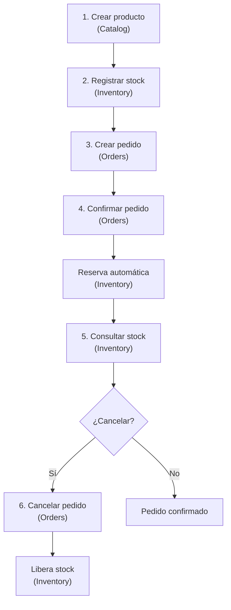
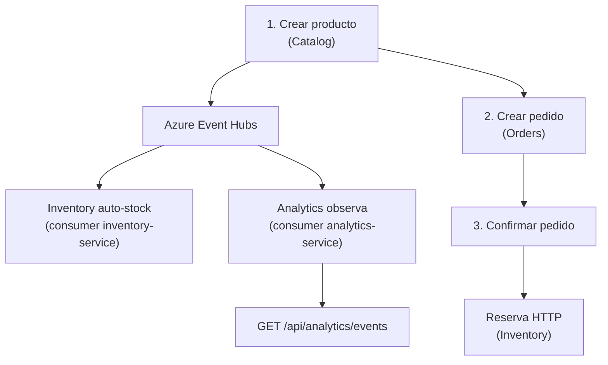

# Guía de uso de APIs — ShopDemo

| Campo | Detalle |
|:------|:--------|
| **Empresa** | Lite Thinking |
| **Curso** | Microservicios con .NET en Kubernetes y Entornos Multicloud |
| **Instructor** | Lcc. Gilberto Valentino Juárez Sánchez |
| **Contacto** | WhatsApp: +52 5614206660 |
| | E-mail: gilberto.juarez@gmail.com |
| | E-mail: lcc.gilberto.juarez@gmail.com |

Esta guía está pensada para **usuarios, testers y desarrolladores** que necesitan entender **para qué sirve cada endpoint**, **cómo encajan en el proceso de compra** y **cómo levantar y configurar** los servicios en local, Aspire o nube.

**Índice del curso:** [README.md](../README.md) · **Arquitectura:** [ARQUITECTURA.md](./ARQUITECTURA.md)  
**Arranque de servicios:** [Tabla maestra](../README.md#tabla-maestra-de-arranque) · [Local](../README.md#inicio-local-desarrollo-y-pruebas) · [Azure](../README.md#release-azure) · [AWS](../README.md#release-aws)

---

## ¿Qué es ShopDemo?

ShopDemo es una plataforma de comercio electrónico dividida en **microservicios independientes**, cada uno con una responsabilidad clara:

| Servicio | ¿Qué hace? | Puerto | Health |
|---|---|---|---|
| **Catalog** | Administra el catálogo de productos (nombre, precio, categoría) | 8001 | `/health`, `/alive` |
| **Orders** | Gestiona los pedidos de los clientes | 8002 | `/health`, `/alive` |
| **Inventory** | Controla cuántas unidades hay disponibles para vender | 8003 | `/health`, `/alive` |
| **Analytics** | Observa eventos del bus (solo lectura; no modifica negocio) | 8004 | `/health`, `/api/analytics/health` |
| **MCP Gateway** | Expone herramientas para agentes IA sobre Catalog, Inventory y Analytics | 8005 | `/health` |

Ninguno reemplaza a otro: trabajan en conjunto. Un producto se **define** en Catalog, se **abastece** en Inventory y se **vende** a través de Orders. Con **Event Hubs** activo, Inventory puede recibir stock automáticamente y Analytics **muestra** los eventos publicados. El **MCP Gateway** no participa en el flujo de compra; sirve para que agentes (Cursor, Claude Code) invoquen operaciones vía protocolo MCP en `{{mcpBaseUrl}}/mcp`.

---

## Colección para pruebas

Puedes importar en **Postman**, **Insomnia** o **Thunder Client** el archivo:

**[ShopDemo.postman_collection.json](./ShopDemo.postman_collection.json)**

La colección agrupa los endpoints por API, incluye carpeta **Health checks**, **MCP Gateway** y la carpeta **Flujo integrado (E2E)** con la secuencia completa de compra.

### Variables de la colección

| Variable | Valor por defecto | Uso |
|---|---|---|
| `deploymentProfile` | `local` | Documenta el entorno: `local`, `azure-aca`, `azure-aks`, `aws-ecs`, `aws-eks` |
| `catalogBaseUrl` | `http://localhost:8001` | URL base de Catalog |
| `ordersBaseUrl` | `http://localhost:8002` | URL base de Orders |
| `inventoryBaseUrl` | `http://localhost:8003` | URL base de Inventory |
| `analyticsBaseUrl` | `http://localhost:8004` | URL base de Analytics |
| `mcpBaseUrl` | `http://localhost:8005` | URL base del MCP Gateway (sin `/mcp`) |
| `customerId` | UUID de ejemplo | Identificador del cliente en pedidos |
| `productId` | UUID de ejemplo | Actualizar tras crear un producto |
| `orderId` | UUID de ejemplo | Actualizar tras crear un pedido |

### Perfiles de despliegue (Postman)

| Perfil | `deploymentProfile` | Qué actualizar en variables |
|---|---|---|
| **Local** | `local` | Valores por defecto (`localhost:8001`–`8005`) |
| **Azure ACA** | `azure-aca` | FQDN de cada Container App |
| **Azure AKS** | `azure-aks` | Ingress: `http://<ip>/catalog`, `/orders`, …, `/mcp` |
| **AWS ECS** | `aws-ecs` | DNS de cada ALB |
| **AWS EKS** | `aws-eks` | Igual que AKS con Ingress |

> **Nube:** sustituye cada `localhost` por el FQDN, ALB o prefijo de Ingress. Guías: [despliegue/README.md](./despliegue/README.md) · [README § Postman](../README.md#configurar-postman-según-entorno).

> **Tip:** Después de crear un producto o pedido, copia el `id` de la respuesta y actualiza las variables `productId` u `orderId` en Postman.

---

## Cómo levantar los servicios

**Orden recomendado (local):** Catalog → Inventory → Orders → Analytics (opcional) → MCP (opcional, etapa 14+).

### Opción A — Docker Compose (recomendado etapas 1–5)

Cada API tiene su `docker-compose.yml`. Desde la raíz del repo:

```bash
# 1. Catalog
cd Catalog/ShopDemo.Catalog.Api
copy .env.example .env   # si usarás Event Hubs
docker compose up --build

# 2. Inventory (otra terminal)
cd Inventory/ShopDemo.Inventory.Api
docker compose up --build

# 3. Orders (otra terminal)
cd Orders/ShopDemo.Orders.Api
docker compose up --build

# 4. Analytics (etapa 6+)
cd Aspire/ShopDemo.Analytics.Api
docker compose up --build

# 5. MCP Gateway (etapa 14+; requiere Catalog, Inventory, Analytics)
cd AI/ShopDemo.Mcp.Api
copy .env.example .env
docker compose up --build
```

**Verificar antes del E2E:**

```bash
curl http://localhost:8001/health
curl http://localhost:8003/health
curl http://localhost:8002/health
curl http://localhost:8004/health   # si Analytics activo
curl http://localhost:8005/health   # si MCP activo
```

Para el flujo integrado de negocio, **Catalog, Orders e Inventory deben estar en ejecución**. Analytics es opcional salvo pruebas de eventos; MCP es opcional salvo integración IA.

### Opción B — .NET Aspire (recomendado etapa 6)

Un solo comando levanta 4 APIs + PostgreSQL + Azurite + dashboard (MCP **no** incluido):

```bash
dotnet user-secrets set "ShopDemo:EventHubs:ConnectionString" "<TU_CONNECTION_STRING>" \
  --project Aspire/ShopDemo.AppHost

dotnet run --project Aspire/ShopDemo.AppHost
```

MCP por separado: `dotnet run --project AI/ShopDemo.Mcp.Api`

### Opción C — Kubernetes (Minikube / AKS / EKS)

```bash
kubectl apply -f k8s/   # ver orden en k8s/README.md
```

**Postman con Ingress:** `catalogBaseUrl` = `http://shopdemo.local/catalog` (o IP del Ingress + prefijo `/catalog`).

Guía: [IMPLEMENTACION-KUBERNETES-LOCAL.md](./despliegue/kubernetes/IMPLEMENTACION-KUBERNETES-LOCAL.md)

### Opción D — Azure (release)

| Camino | Guía | URLs Postman |
|---|---|---|
| Container Apps (ACA) | [IMPLEMENTACION-DESPLIEGUE-AZURE](./despliegue/azure/IMPLEMENTACION-DESPLIEGUE-AZURE.md) | FQDN por Container App |
| AKS + `k8s/` | [IMPLEMENTACION-DESPLIEGUE-AKS](./despliegue/aks/IMPLEMENTACION-DESPLIEGUE-AKS.md) | Ingress `/catalog`, `/orders`, … |
| MCP en nube | [IMPLEMENTACION-DESPLIEGUE-MCP-AZURE](./integracion-ia/IMPLEMENTACION-DESPLIEGUE-MCP-AZURE.md) | `mcpBaseUrl` + `/mcp` |

### Opción E — AWS (release)

| Camino | Guía | URLs Postman |
|---|---|---|
| ECS Fargate | [IMPLEMENTACION-DESPLIEGUE-AWS](./despliegue/aws/IMPLEMENTACION-DESPLIEGUE-AWS.md) | DNS de cada ALB |
| EKS + `k8s/` | [IMPLEMENTACION-DESPLIEGUE-EKS](./despliegue/eks/IMPLEMENTACION-DESPLIEGUE-EKS.md) | Ingress con prefijos |
| MCP en nube | [IMPLEMENTACION-DESPLIEGUE-MCP-AWS](./integracion-ia/IMPLEMENTACION-DESPLIEGUE-MCP-AWS.md) | ALB o Ingress `/mcp` |

---

## Variables de configuración por servicio

Antes de probar endpoints con Event Hubs o integración Orders→Inventory, revisa estas variables.

### Catalog — `Catalog/ShopDemo.Catalog.Api/`

| Variable | Archivo | Descripción |
|---|---|---|
| `ConnectionStrings__DefaultConnection` | `appsettings.json`, `docker-compose.yml` | PostgreSQL (`catalog-db` en Docker; `localhost:5433` en dev) |
| `EventHubs__Enabled` | `.env`, compose | `true` publica a Azure Event Hubs |
| `EventHubs__ConnectionString` | `.env` | Connection string del namespace (secreto) |
| `EventHubs__EventHubName` | `.env`, compose | `shopdemo-events` |

Plantilla: `.env.example` → copiar a `.env`

### Orders — `Orders/ShopDemo.Orders.Api/`

| Variable | Archivo | Descripción |
|---|---|---|
| `ConnectionStrings__DefaultConnection` | `appsettings.json`, compose | Puerto `5434` en host |
| `InventoryApi__BaseUrl` | `appsettings.json`, compose | `http://localhost:8003` · Docker: `http://host.docker.internal:8003` · Aspire/nube: URL de Inventory |
| `EventHubs__*` | `.env` | Igual que Catalog |

### Inventory — `Inventory/ShopDemo.Inventory.Api/`

| Variable | Archivo | Descripción |
|---|---|---|
| `ConnectionStrings__DefaultConnection` | `appsettings.json`, compose | Puerto `5435` en host |
| `EventHubs__Enabled` | `.env` | Activa publisher y consumidor `CatalogEventsProcessor` |
| `EventHubs__ConsumerGroup` | compose | `inventory-service` |
| `EventHubs__CheckpointStorageConnectionString` | `.env`, compose | Azurite en Docker (`azurite:10000`) |
| `EventHubs__CheckpointContainerName` | compose | `inventory-checkpoints` |

### Analytics — `Aspire/ShopDemo.Analytics.Api/`

| Variable | Archivo | Descripción |
|---|---|---|
| `EventHubs__Enabled` | compose, Aspire | `true` |
| `EventHubs__ConsumerGroup` | compose | `analytics-service` |
| `EventHubs__CheckpointStorageConnectionString` | compose | Azurite local |
| `EventHubs__CheckpointContainerName` | compose | `analytics-checkpoints` |

En Aspire, el AppHost inyecta estas variables; no necesitas `.env` si usas solo AppHost.

### MCP Gateway — `AI/ShopDemo.Mcp.Api/`

| Variable | Archivo | Descripción |
|---|---|---|
| `ShopDemo__CatalogApiBaseUrl` | `.env`, compose | URL de Catalog (`http://localhost:8001` · Docker: `host.docker.internal:8001`) |
| `ShopDemo__InventoryApiBaseUrl` | `.env`, compose | URL de Inventory |
| `ShopDemo__AnalyticsApiBaseUrl` | `.env`, compose | URL de Analytics |

Plantilla: `AI/ShopDemo.Mcp.Api/.env.example` → copiar a `.env`

### AppHost — `Aspire/ShopDemo.AppHost/`

| Variable | Dónde | Descripción |
|---|---|---|
| `ShopDemo:EventHubs:ConnectionString` | user secrets o `appsettings.Development.json` | Centraliza Event Hubs para los 4 APIs |

Guía completa: [INTEGRACION-AZURE-EVENT-HUBS.md](./INTEGRACION-AZURE-EVENT-HUBS.md) · [INTEGRACION-ASPIRE.md](./INTEGRACION-ASPIRE.md)

---

## Flujo general del proceso

### Flujo manual (Event Hubs desactivado)



### Flujo con Event Hubs + Analytics (etapas 5–6)



### En palabras sencillas

1. Un administrador **crea un producto** en el catálogo.
2. El almacén **registra stock** — manualmente (`POST /api/inventory/stock`) o **automáticamente** si Event Hubs está activo.
3. Un cliente **hace un pedido** con uno o más productos.
4. Al **confirmar** el pedido, el sistema **aparta (reserva)** las unidades del inventario vía HTTP.
5. Puedes **consultar** cuántas unidades quedan y, si Analytics está activo, **ver los eventos** del bus.
6. Si el pedido se **cancela**, las unidades reservadas **vuelven** al inventario.

---

## Catalog API — Catálogo de productos

**Base URL:** `http://localhost:8001`  
**Swagger:** `http://localhost:8001/swagger`

### ¿Quién lo usa?

- Administradores o sistemas de back-office que dan de alta productos en la tienda.
- Es el **primer paso** del flujo: aquí nace el identificador del producto (`ProductId`).

---

### `POST /api/products` — Crear producto

**¿Para qué sirve?**  
Registra un producto nuevo en la tienda con su nombre, descripción, precio, categoría y stock inicial informativo.

**¿Cuándo usarlo?**  
Cuando quieres agregar un artículo al catálogo antes de venderlo.

**Ejemplo de solicitud:**

```json
{
  "name": "Teclado Mecánico",
  "description": "RGB, switches azules",
  "price": 89.99,
  "currency": "USD",
  "stock": 50,
  "category": "Electronics"
}
```

**Categorías válidas:** `Electronics`, `Clothing`, `Food`, `Books`, `Sports`.

**Respuesta esperada:** `201 Created` con el producto creado, incluyendo su `id`.  
**Guarda ese `id`** — lo necesitarás en Inventory y Orders.

**Errores comunes:**

| Código | Significado |
|---|---|
| 400 | Datos inválidos (nombre muy corto, precio negativo, etc.) |
| 409 | Ya existe un producto con ese nombre |

---

## Inventory API — Inventario y stock

**Base URL:** `http://localhost:8003`  
**Swagger:** `http://localhost:8003/swagger`

### ¿Quién lo usa?

- Personal de almacén o integraciones que registran y consultan stock.
- **Orders** también lo usa de forma automática al confirmar o cancelar pedidos (no necesitas llamarlo manualmente en el flujo normal).

---

### `POST /api/inventory/stock` — Registrar stock

**¿Para qué sirve?**  
Indica cuántas unidades de un producto están disponibles para la venta.

**¿Cuándo usarlo?**  
- **Sin Event Hubs:** siempre después de crear un producto en Catalog.
- **Con Event Hubs:** opcional si Inventory ya auto-registró stock al recibir `ProductCreatedDomainEvent`.

**Ejemplo de solicitud:**

```json
{
  "productId": "3fa85f64-5717-4562-b3fc-2c963f66afa6",
  "productName": "Teclado Mecánico",
  "units": 50
}
```

**Respuesta esperada:** `201 Created` con el registro de stock.

> Si el producto ya tenía stock registrado, las unidades se **suman** (reabastecimiento).

---

### `GET /api/inventory/{productId}` — Consultar stock

**¿Para qué sirve?**  
Muestra cuántas unidades quedan disponibles de un producto.

**¿Cuándo usarlo?**  
- Para verificar el inventario después de confirmar un pedido.
- Para comprobar que el stock se restauró tras una cancelación.

**Respuesta esperada:** `200 OK` con `availableUnits`.

**Ejemplo de respuesta:**

```json
{
  "productId": "3fa85f64-5717-4562-b3fc-2c963f66afa6",
  "productName": "Teclado Mecánico",
  "availableUnits": 48,
  "createdAt": "2026-06-11T10:00:00+00:00",
  "lastUpdatedAt": "2026-06-11T10:30:00+00:00"
}
```

---

### `POST /api/inventory/reservations` — Reservar stock

**¿Para qué sirve?**  
Descuenta unidades del inventario para un pedido concreto.

**¿Cuándo usarlo?**  
En operación normal **no lo llamas tú**: Orders lo invoca automáticamente al confirmar un pedido. Está en la colección para pruebas técnicas directas.

**Ejemplo de solicitud:**

```json
{
  "orderId": "a1b2c3d4-e5f6-7890-abcd-ef1234567890",
  "lines": [
    { "productId": "3fa85f64-5717-4562-b3fc-2c963f66afa6", "quantity": 2 }
  ]
}
```

**Respuesta esperada:** `204 No Content` (éxito sin cuerpo).

---

### `POST /api/inventory/reservations/release` — Liberar stock

**¿Para qué sirve?**  
Devuelve al inventario las unidades que estaban reservadas para un pedido.

**¿Cuándo usarlo?**  
En operación normal **no lo llamas tú**: Orders lo invoca al cancelar un pedido que ya estaba confirmado.

**Respuesta esperada:** `204 No Content`.

---

## Orders API — Pedidos

**Base URL:** `http://localhost:8002`  
**Swagger:** `http://localhost:8002/swagger`

### ¿Quién lo usa?

- Aplicaciones de checkout o back-office de ventas.
- Clientes finales (indirectamente) al realizar una compra.

---

### `POST /api/orders` — Crear pedido

**¿Para qué sirve?**  
Registra un nuevo pedido con los productos que el cliente quiere comprar.

**¿Cuándo usarlo?**  
Cuando el cliente confirma su carrito. El pedido queda en estado **Pending** (pendiente).

**Ejemplo de solicitud:**

```json
{
  "customerId": "11111111-1111-1111-1111-111111111111",
  "shippingAddress": {
    "street": "Av. Reforma 123",
    "city": "Ciudad de México",
    "postalCode": "06600",
    "country": "MX"
  },
  "lines": [
    {
      "productId": "3fa85f64-5717-4562-b3fc-2c963f66afa6",
      "productName": "Teclado Mecánico",
      "unitPrice": 89.99,
      "currency": "USD",
      "quantity": 2
    }
  ]
}
```

**Respuesta esperada:** `201 Created` con el pedido y su `id`.  
**Guarda ese `id`** para confirmar, cancelar o consultar el pedido.

> El `productId` debe existir en Catalog. El stock debe estar registrado en Inventory antes de confirmar.

---

### `GET /api/orders/{id}` — Consultar pedido

**¿Para qué sirve?**  
Obtiene el detalle de un pedido: estado, líneas, total y dirección de envío.

**¿Cuándo usarlo?**  
Para ver el estado de un pedido después de crearlo, confirmarlo o cancelarlo.

**Estados posibles:** `Pending`, `Confirmed`, `Shipped`, `Delivered`, `Cancelled`.

---

### `GET /api/orders?customerId={uuid}` — Listar pedidos de un cliente

**¿Para qué sirve?**  
Devuelve todos los pedidos asociados a un cliente.

**¿Cuándo usarlo?**  
En un historial de compras o panel de “Mis pedidos”.

---

### `POST /api/orders/{id}/confirm` — Confirmar pedido

**¿Para qué sirve?**  
Aprueba el pedido y lo pasa de **Pending** a **Confirmed**.

**¿Cuándo usarlo?**  
Cuando el pago fue aceptado o el negocio valida la orden.

**¿Qué pasa detrás?**  
Orders llama automáticamente a Inventory para **reservar** las unidades de cada línea. Si no hay stock suficiente, la confirmación falla.

**Respuesta esperada:** `200 OK` con el pedido actualizado (`status: "Confirmed"`).

---

### `POST /api/orders/{id}/cancel` — Cancelar pedido

**¿Para qué sirve?**  
Cancela un pedido indicando el motivo.

**¿Cuándo usarlo?**  
Cuando el cliente o el negocio decide no continuar con la compra.

**Ejemplo de solicitud:**

```json
{
  "reason": "El cliente solicitó la cancelación"
}
```

**¿Qué pasa detrás?**  
Si el pedido estaba **Confirmed**, Orders libera automáticamente el stock reservado en Inventory.

**Respuesta esperada:** `200 OK` con `status: "Cancelled"`.

---

## Analytics API — Observador de eventos

**Base URL:** `http://localhost:8004`  
**Swagger:** `http://localhost:8004/swagger`

### ¿Quién lo usa?

- Desarrolladores y alumnos que validan la integración con **Azure Event Hubs** y **.NET Aspire**.
- No participa en el flujo de compra; solo **lee** el bus de eventos.

> Requiere `EventHubs__Enabled=true` y connection string válida. Con Aspire, el AppHost configura todo automáticamente.

---

### `GET /api/analytics/events` — Listar eventos observados

**¿Para qué sirve?**  
Devuelve los últimos eventos que Analytics consumió del Event Hub (buffer en memoria).

**¿Cuándo usarlo?**  
Después de crear un producto, confirmar un pedido o cualquier acción que publique eventos en Catalog, Orders o Inventory.

**Parámetros:**

| Query | Default | Rango |
|---|---|---|
| `take` | 50 | 1–100 |

**Ejemplo:** `GET http://localhost:8004/api/analytics/events?take=20`

**Respuesta esperada:** `200 OK`

```json
{
  "totalBuffered": 3,
  "returned": 3,
  "events": [
    {
      "eventType": "ProductCreatedDomainEvent",
      "eventId": "3fa85f64-5717-4562-b3fc-2c963f66afa6",
      "occurredOn": "2026-06-11T10:00:00Z",
      "source": "catalog",
      "payloadJson": "{ ... }",
      "receivedAt": "2026-06-11T10:00:01Z"
    }
  ]
}
```

---

### `GET /api/analytics/health` — Estado del servicio

**¿Para qué sirve?**  
Indica si Analytics está en ejecución y cuántos eventos hay en el buffer.

**Respuesta esperada:** `200 OK` con `bufferedEvents`.

> Analytics también expone **`GET /health`** vía ServiceDefaults (usado por probes de Kubernetes). La colección Postman incluye ambas rutas.

---

## Health checks — Todas las APIs

Endpoints de **operación** (no forman parte del flujo de compra). Útiles antes del E2E y en despliegues K8s/ACA/ECS.

| Servicio | Readiness | Liveness | Postman (carpeta Health checks) |
|---|---|---|---|
| Catalog | `GET /health` | `GET /alive` | ✅ |
| Orders | `GET /health` | `GET /alive` | ✅ |
| Inventory | `GET /health` | `GET /alive` | ✅ |
| Analytics | `GET /health` | `GET /alive` | ✅ |
| Analytics (detalle buffer) | `GET /api/analytics/health` | — | ✅ |
| MCP Gateway | `GET /health` | — | ✅ |

**Respuesta esperada:** `200 OK` (cuerpo según implementación de health checks ASP.NET Core).

---

## MCP Gateway — Integración IA (etapa 14+)

**Base URL:** `http://localhost:8005`  
**Endpoint MCP:** `http://localhost:8005/mcp` (protocolo MCP sobre HTTP; **no** es REST estándar)

### ¿Quién lo usa?

- Agentes IA (Cursor, Claude Code) conectados vía `.cursor/mcp.json` o `.mcp.json`.
- No sustituye a Postman para el flujo E2E de negocio; Postman solo valida **`GET /health`**.

### Herramientas MCP disponibles

| Tool | Acción equivalente |
|---|---|
| `CreateProduct` | `POST /api/products` (Catalog) |
| `GetProductStock` | `GET /api/inventory/{productId}` (Inventory) |
| `ListAnalyticsEvents` | `GET /api/analytics/events` (Analytics) |
| `GetShopDemoStatus` | Ping de conectividad a las 3 APIs configuradas |

**Arranque:** [AI/README.md](../AI/README.md) · **Despliegue nube:** [IMPLEMENTACION-DESPLIEGUE-MCP-AZURE](./integracion-ia/IMPLEMENTACION-DESPLIEGUE-MCP-AZURE.md) · [AWS](./integracion-ia/IMPLEMENTACION-DESPLIEGUE-MCP-AWS.md)

---

## Escenarios de uso

### Escenario 1: Compra exitosa

| Paso | Acción | Endpoint |
|---|---|---|
| 1 | Dar de alta el producto | `POST /api/products` (Catalog) |
| 2 | Registrar 50 unidades en almacén | `POST /api/inventory/stock` (Inventory) |
| 3 | Cliente pide 2 unidades | `POST /api/orders` (Orders) |
| 4 | Se confirma el pago | `POST /api/orders/{id}/confirm` (Orders) |
| 5 | Verificar que quedan 48 unidades | `GET /api/inventory/{productId}` (Inventory) |

### Escenario 2: Compra cancelada después de confirmar

| Paso | Acción | Endpoint |
|---|---|---|
| 1–4 | Igual que escenario 1 | — |
| 5 | Cliente cancela | `POST /api/orders/{id}/cancel` (Orders) |
| 6 | Verificar que el stock volvió a 50 | `GET /api/inventory/{productId}` (Inventory) |

### Escenario 3: Consultar historial del cliente

| Paso | Acción | Endpoint |
|---|---|---|
| 1 | Listar todos sus pedidos | `GET /api/orders?customerId={uuid}` (Orders) |
| 2 | Ver detalle de uno | `GET /api/orders/{id}` (Orders) |

---

### Escenario 4: Event Hubs + Analytics (etapa 5–6)

| Paso | Acción | Endpoint |
|---|---|---|
| 1 | Activar Event Hubs (`.env` o Aspire) | Ver sección configuración |
| 2 | Crear producto | `POST /api/products` (Catalog) |
| 3 | Ver evento en Analytics | `GET /api/analytics/events` |
| 4 | Verificar stock auto-creado | `GET /api/inventory/{productId}` (Inventory) |
| 5 | Crear y confirmar pedido | Orders |
| 6 | Revisar eventos acumulados | `GET /api/analytics/events?take=20` |

### Escenario 5: Despliegue en nube (Azure / AWS)

| Paso | Acción | Referencia |
|---|---|---|
| 1 | Desplegar 5 imágenes en ACR o ECR | [despliegue/](./despliegue/) |
| 2 | Configurar secretos en ACA / ECS / AKS / EKS | Guías Azure o AWS |
| 3 | Actualizar variables Postman (`deploymentProfile` + `*BaseUrl` + `mcpBaseUrl`) | [README § Postman](../README.md#configurar-postman-según-entorno) |
| 4 | Ejecutar carpeta **Health checks** | Verificar `/health` en cada servicio |
| 5 | Ejecutar flujo E2E | Escenarios 1 o 4 |

### Escenario 6: Kubernetes con Ingress

| Paso | Acción | Variable Postman (ejemplo) |
|---|---|---|
| 1 | `kubectl apply -f k8s/` | — |
| 2 | Configurar host `shopdemo.local` o usar IP Ingress | `catalogBaseUrl` = `http://shopdemo.local/catalog` |
| 3 | Health checks vía Ingress | `http://shopdemo.local/catalog/health` |
| 4 | E2E con prefijos | Misma base con `/orders`, `/inventory`, etc. |

### Escenario 7: MCP + agente IA

| Paso | Acción | Referencia |
|---|---|---|
| 1 | Levantar Catalog, Inventory, Analytics | Opción A o B |
| 2 | `dotnet run --project AI/ShopDemo.Mcp.Api` | Puerto 8005 |
| 3 | `curl http://localhost:8005/health` | Postman carpeta MCP |
| 4 | Conectar agente a `http://localhost:8005/mcp` | [integracion-ia/](./integracion-ia/) |

---

## Resumen rápido por API

### Catalog (1 endpoint de negocio + health)

| Método | Ruta | Uso principal |
|---|---|---|
| POST | `/api/products` | Crear producto en el catálogo |
| GET | `/health` | Readiness (operación) |
| GET | `/alive` | Liveness (operación) |

### Inventory (4 endpoints de negocio + health)

| Método | Ruta | Uso principal |
|---|---|---|
| POST | `/api/inventory/stock` | Registrar o reabastecer stock |
| GET | `/api/inventory/{productId}` | Consultar unidades disponibles |
| POST | `/api/inventory/reservations` | Reservar stock (normalmente vía Orders) |
| POST | `/api/inventory/reservations/release` | Liberar stock (normalmente vía Orders) |
| GET | `/health`, `/alive` | Operación / K8s probes |

### Orders (5 endpoints de negocio + health)

| Método | Ruta | Uso principal |
|---|---|---|
| POST | `/api/orders` | Crear pedido |
| GET | `/api/orders/{id}` | Consultar pedido |
| GET | `/api/orders?customerId={uuid}` | Listar pedidos del cliente |
| POST | `/api/orders/{id}/confirm` | Confirmar pedido y reservar stock |
| POST | `/api/orders/{id}/cancel` | Cancelar pedido y liberar stock |
| GET | `/health`, `/alive` | Operación / K8s probes |

### Analytics (2 endpoints de negocio + health)

| Método | Ruta | Uso principal |
|---|---|---|
| GET | `/api/analytics/events` | Listar eventos observados del bus |
| GET | `/api/analytics/health` | Estado y contador del buffer |
| GET | `/health`, `/alive` | ServiceDefaults / K8s probes |

### MCP Gateway (operación)

| Método | Ruta | Uso principal |
|---|---|---|
| GET | `/health` | Verificar que MCP está activo |
| MCP | `/mcp` | Herramientas para agentes IA (no REST Postman) |

---

## URLs y Swagger por entorno

| Servicio | Local | Aspire | Minikube Ingress | Azure ACA | AWS ECS/EKS |
|---|---|---|---|---|---|
| Catalog | :8001/swagger | :8001 | `/catalog/swagger` | FQDN ACA | ALB o `/catalog` |
| Orders | :8002/swagger | :8002 | `/orders/swagger` | FQDN ACA | ALB o `/orders` |
| Inventory | :8003/swagger | :8003 | `/inventory/swagger` | URL interna | Cloud Map / Ingress |
| Analytics | :8004/swagger | :8004 | `/analytics/swagger` | FQDN ACA | ALB o `/analytics` |
| MCP Gateway | :8005/health | manual | `/mcp` | FQDN + `/mcp` | ALB/Ingress `/mcp` |
| Aspire Dashboard | — | consola AppHost | — | No desplegado | No desplegado |

**Health rápido (local):** `curl localhost:8001/health` … `8005/health`

---

## Etapas del curso — documentación recomendada

| Etapa | Tema | Leer primero | Luego implementar |
|---|---|---|---|
| 1 | Catalog | [REQUERIMIENTOS-CATALOG](./catalog/REQUERIMIENTOS-CATALOG.md) | [IMPLEMENTACION-CATALOG](./catalog/IMPLEMENTACION-CATALOG.md) |
| 2 | Orders | [REQUERIMIENTOS-ORDERS](./orders/REQUERIMIENTOS-ORDERS.md) | [IMPLEMENTACION-ORDERS](./orders/IMPLEMENTACION-ORDERS.md) |
| 3 | Inventory | [REQUERIMIENTOS-INVENTORY](./inventory/REQUERIMIENTOS-INVENTORY.md) | [IMPLEMENTACION-INVENTORY](./inventory/IMPLEMENTACION-INVENTORY.md) |
| 4 | E2E | Esta guía | [ARQUITECTURA](./ARQUITECTURA.md) |
| 5 | Event Hubs | [INTEGRACION-AZURE-EVENT-HUBS](./INTEGRACION-AZURE-EVENT-HUBS.md) | Mismo documento |
| 6 | Aspire | [REQUERIMIENTOS-ANALYTICS-ASPIRE](./analytics/REQUERIMIENTOS-ANALYTICS-ASPIRE.md) | [IMPLEMENTACION-ANALYTICS-ASPIRE](./analytics/IMPLEMENTACION-ANALYTICS-ASPIRE.md) |
| 7–8 | Nube ACA/ECS | [despliegue/README](./despliegue/README.md) | Azure o AWS IMPLEMENTACION |
| 9–11 | Kubernetes | [despliegue/kubernetes/](./despliegue/kubernetes/) | Minikube, AKS, EKS |
| 12–13 | Observabilidad / Resiliencia | [observabilidad/](./observabilidad/) · [resiliencia/](./resiliencia/) | Azure y AWS |
| 14–14b | IA + MCP | [integracion-ia/](./integracion-ia/) | MCP en contenedores/K8s |
| 15 | Spec-driven | [spec-driven/](../spec-driven/) | Cursor + Claude Code |

---

## Documentación relacionada

| Documento | Contenido |
|---|---|
| [README.md](../README.md) | Objetivo del curso, roadmap, configuración global |
| [ARQUITECTURA.md](./ARQUITECTURA.md) | Visión técnica, etapas, matriz de configuración |
| [catalog/](./catalog/) | Requerimientos e implementación de Catalog |
| [orders/](./orders/) | Requerimientos e implementación de Orders |
| [inventory/](./inventory/) | Requerimientos e implementación de Inventory |
| [analytics/](./analytics/) | Aspire + Analytics |
| [despliegue/](./despliegue/) | Docker → Azure, AWS y Kubernetes |
| [integracion-ia/](./integracion-ia/) | MCP Gateway y agentes IA |
| [spec-driven/](../spec-driven/) | Desarrollo guiado por especificaciones |
| [INTEGRACION-AZURE-EVENT-HUBS.md](./INTEGRACION-AZURE-EVENT-HUBS.md) | Event Hubs paso a paso |
| [INTEGRACION-ASPIRE.md](./INTEGRACION-ASPIRE.md) | Orquestación local Aspire |
| [AI/README.md](../AI/README.md) | Arranque MCP Gateway |
