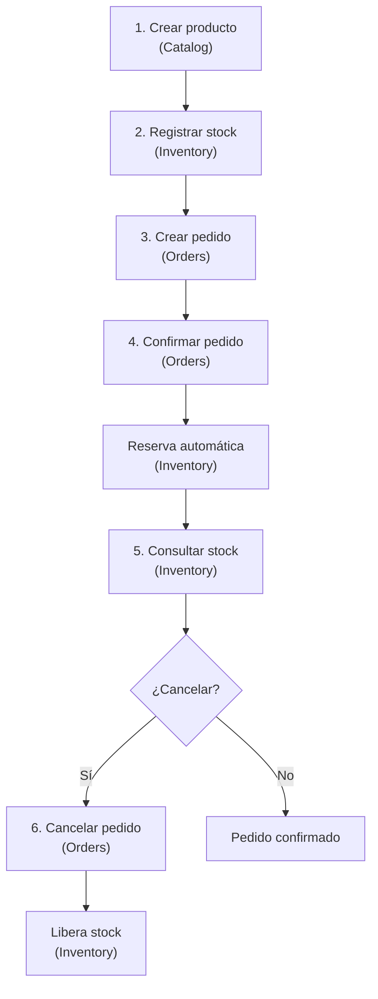

# Guía de uso de APIs — ShopDemo

Esta guía está pensada para **usuarios, testers y desarrolladores** que necesitan entender **para qué sirve cada endpoint** y **cómo encajan en el proceso de compra** de la plataforma ShopDemo.

---

## ¿Qué es ShopDemo?

ShopDemo es una plataforma de comercio electrónico dividida en **tres servicios independientes**, cada uno con una responsabilidad clara:

| Servicio | ¿Qué hace? | Puerto |
|---|---|---|
| **Catalog** | Administra el catálogo de productos (nombre, precio, categoría) | 8001 |
| **Inventory** | Controla cuántas unidades hay disponibles para vender | 8003 |
| **Orders** | Gestiona los pedidos de los clientes | 8002 |

Ninguno reemplaza a otro: trabajan en conjunto. Un producto se **define** en Catalog, se **abastece** en Inventory y se **vende** a través de Orders.

---

## Colección para pruebas

Puedes importar en **Postman**, **Insomnia** o **Thunder Client** el archivo:

**[ShopDemo.postman_collection.json](./ShopDemo.postman_collection.json)**

La colección agrupa los endpoints por API e incluye una carpeta **Flujo integrado (E2E)** con la secuencia completa de compra.

### Variables de la colección

| Variable | Valor por defecto | Uso |
|---|---|---|
| `catalogBaseUrl` | `http://localhost:8001` | URL base de Catalog |
| `ordersBaseUrl` | `http://localhost:8002` | URL base de Orders |
| `inventoryBaseUrl` | `http://localhost:8003` | URL base de Inventory |
| `customerId` | UUID de ejemplo | Identificador del cliente en pedidos |
| `productId` | UUID de ejemplo | Actualizar tras crear un producto |
| `orderId` | UUID de ejemplo | Actualizar tras crear un pedido |

> **Tip:** Después de crear un producto o pedido, copia el `id` de la respuesta y actualiza las variables `productId` u `orderId` en Postman.

---

## Flujo general del proceso



### En palabras sencillas

1. Un administrador **crea un producto** en el catálogo.
2. El almacén **registra cuántas unidades** hay disponibles de ese producto.
3. Un cliente **hace un pedido** con uno o más productos.
4. Al **confirmar** el pedido, el sistema **aparta (reserva)** las unidades del inventario.
5. Puedes **consultar** cuántas unidades quedan disponibles.
6. Si el pedido se **cancela**, las unidades reservadas **vuelven** al inventario.

---

## Catalog API — Catálogo de productos

**Base URL:** `http://localhost:8001`  
**Swagger:** `http://localhost:8001/swagger`

### ¿Quién lo usa?

- Administradores o sistemas de back-office que dan de alta productos en la tienda.
- Es el **primer paso** del flujo: aquí nace el identificador del producto (`ProductId`).

---

### `POST /api/products` — Crear producto

**¿Para qué sirve?**  
Registra un producto nuevo en la tienda con su nombre, descripción, precio, categoría y stock inicial informativo.

**¿Cuándo usarlo?**  
Cuando quieres agregar un artículo al catálogo antes de venderlo.

**Ejemplo de solicitud:**

```json
{
  "name": "Teclado Mecánico",
  "description": "RGB, switches azules",
  "price": 89.99,
  "currency": "USD",
  "stock": 50,
  "category": "Electronics"
}
```

**Categorías válidas:** `Electronics`, `Clothing`, `Food`, `Books`, `Sports`.

**Respuesta esperada:** `201 Created` con el producto creado, incluyendo su `id`.  
**Guarda ese `id`** — lo necesitarás en Inventory y Orders.

**Errores comunes:**

| Código | Significado |
|---|---|
| 400 | Datos inválidos (nombre muy corto, precio negativo, etc.) |
| 409 | Ya existe un producto con ese nombre |

---

## Inventory API — Inventario y stock

**Base URL:** `http://localhost:8003`  
**Swagger:** `http://localhost:8003/swagger`

### ¿Quién lo usa?

- Personal de almacén o integraciones que registran y consultan stock.
- **Orders** también lo usa de forma automática al confirmar o cancelar pedidos (no necesitas llamarlo manualmente en el flujo normal).

---

### `POST /api/inventory/stock` — Registrar stock

**¿Para qué sirve?**  
Indica cuántas unidades de un producto están disponibles para la venta.

**¿Cuándo usarlo?**  
Después de crear un producto en Catalog. Usa el mismo `productId` que devolvió Catalog.

**Ejemplo de solicitud:**

```json
{
  "productId": "3fa85f64-5717-4562-b3fc-2c963f66afa6",
  "productName": "Teclado Mecánico",
  "units": 50
}
```

**Respuesta esperada:** `201 Created` con el registro de stock.

> Si el producto ya tenía stock registrado, las unidades se **suman** (reabastecimiento).

---

### `GET /api/inventory/{productId}` — Consultar stock

**¿Para qué sirve?**  
Muestra cuántas unidades quedan disponibles de un producto.

**¿Cuándo usarlo?**  
- Para verificar el inventario después de confirmar un pedido.
- Para comprobar que el stock se restauró tras una cancelación.

**Respuesta esperada:** `200 OK` con `availableUnits`.

**Ejemplo de respuesta:**

```json
{
  "productId": "3fa85f64-5717-4562-b3fc-2c963f66afa6",
  "productName": "Teclado Mecánico",
  "availableUnits": 48,
  "createdAt": "2026-06-11T10:00:00+00:00",
  "lastUpdatedAt": "2026-06-11T10:30:00+00:00"
}
```

---

### `POST /api/inventory/reservations` — Reservar stock

**¿Para qué sirve?**  
Descuenta unidades del inventario para un pedido concreto.

**¿Cuándo usarlo?**  
En operación normal **no lo llamas tú**: Orders lo invoca automáticamente al confirmar un pedido. Está en la colección para pruebas técnicas directas.

**Ejemplo de solicitud:**

```json
{
  "orderId": "a1b2c3d4-e5f6-7890-abcd-ef1234567890",
  "lines": [
    { "productId": "3fa85f64-5717-4562-b3fc-2c963f66afa6", "quantity": 2 }
  ]
}
```

**Respuesta esperada:** `204 No Content` (éxito sin cuerpo).

---

### `POST /api/inventory/reservations/release` — Liberar stock

**¿Para qué sirve?**  
Devuelve al inventario las unidades que estaban reservadas para un pedido.

**¿Cuándo usarlo?**  
En operación normal **no lo llamas tú**: Orders lo invoca al cancelar un pedido que ya estaba confirmado.

**Respuesta esperada:** `204 No Content`.

---

## Orders API — Pedidos

**Base URL:** `http://localhost:8002`  
**Swagger:** `http://localhost:8002/swagger`

### ¿Quién lo usa?

- Aplicaciones de checkout o back-office de ventas.
- Clientes finales (indirectamente) al realizar una compra.

---

### `POST /api/orders` — Crear pedido

**¿Para qué sirve?**  
Registra un nuevo pedido con los productos que el cliente quiere comprar.

**¿Cuándo usarlo?**  
Cuando el cliente confirma su carrito. El pedido queda en estado **Pending** (pendiente).

**Ejemplo de solicitud:**

```json
{
  "customerId": "11111111-1111-1111-1111-111111111111",
  "shippingAddress": {
    "street": "Av. Reforma 123",
    "city": "Ciudad de México",
    "postalCode": "06600",
    "country": "MX"
  },
  "lines": [
    {
      "productId": "3fa85f64-5717-4562-b3fc-2c963f66afa6",
      "productName": "Teclado Mecánico",
      "unitPrice": 89.99,
      "currency": "USD",
      "quantity": 2
    }
  ]
}
```

**Respuesta esperada:** `201 Created` con el pedido y su `id`.  
**Guarda ese `id`** para confirmar, cancelar o consultar el pedido.

> El `productId` debe existir en Catalog. El stock debe estar registrado en Inventory antes de confirmar.

---

### `GET /api/orders/{id}` — Consultar pedido

**¿Para qué sirve?**  
Obtiene el detalle de un pedido: estado, líneas, total y dirección de envío.

**¿Cuándo usarlo?**  
Para ver el estado de un pedido después de crearlo, confirmarlo o cancelarlo.

**Estados posibles:** `Pending`, `Confirmed`, `Shipped`, `Delivered`, `Cancelled`.

---

### `GET /api/orders?customerId={uuid}` — Listar pedidos de un cliente

**¿Para qué sirve?**  
Devuelve todos los pedidos asociados a un cliente.

**¿Cuándo usarlo?**  
En un historial de compras o panel de “Mis pedidos”.

---

### `POST /api/orders/{id}/confirm` — Confirmar pedido

**¿Para qué sirve?**  
Aprueba el pedido y lo pasa de **Pending** a **Confirmed**.

**¿Cuándo usarlo?**  
Cuando el pago fue aceptado o el negocio valida la orden.

**¿Qué pasa detrás?**  
Orders llama automáticamente a Inventory para **reservar** las unidades de cada línea. Si no hay stock suficiente, la confirmación falla.

**Respuesta esperada:** `200 OK` con el pedido actualizado (`status: "Confirmed"`).

---

### `POST /api/orders/{id}/cancel` — Cancelar pedido

**¿Para qué sirve?**  
Cancela un pedido indicando el motivo.

**¿Cuándo usarlo?**  
Cuando el cliente o el negocio decide no continuar con la compra.

**Ejemplo de solicitud:**

```json
{
  "reason": "El cliente solicitó la cancelación"
}
```

**¿Qué pasa detrás?**  
Si el pedido estaba **Confirmed**, Orders libera automáticamente el stock reservado en Inventory.

**Respuesta esperada:** `200 OK` con `status: "Cancelled"`.

---

## Escenarios de uso

### Escenario 1: Compra exitosa

| Paso | Acción | Endpoint |
|---|---|---|
| 1 | Dar de alta el producto | `POST /api/products` (Catalog) |
| 2 | Registrar 50 unidades en almacén | `POST /api/inventory/stock` (Inventory) |
| 3 | Cliente pide 2 unidades | `POST /api/orders` (Orders) |
| 4 | Se confirma el pago | `POST /api/orders/{id}/confirm` (Orders) |
| 5 | Verificar que quedan 48 unidades | `GET /api/inventory/{productId}` (Inventory) |

### Escenario 2: Compra cancelada después de confirmar

| Paso | Acción | Endpoint |
|---|---|---|
| 1–4 | Igual que escenario 1 | — |
| 5 | Cliente cancela | `POST /api/orders/{id}/cancel` (Orders) |
| 6 | Verificar que el stock volvió a 50 | `GET /api/inventory/{productId}` (Inventory) |

### Escenario 3: Consultar historial del cliente

| Paso | Acción | Endpoint |
|---|---|---|
| 1 | Listar todos sus pedidos | `GET /api/orders?customerId={uuid}` (Orders) |
| 2 | Ver detalle de uno | `GET /api/orders/{id}` (Orders) |

---

## Resumen rápido por API

### Catalog (1 endpoint)

| Método | Ruta | Uso principal |
|---|---|---|
| POST | `/api/products` | Crear producto en el catálogo |

### Inventory (4 endpoints)

| Método | Ruta | Uso principal |
|---|---|---|
| POST | `/api/inventory/stock` | Registrar o reabastecer stock |
| GET | `/api/inventory/{productId}` | Consultar unidades disponibles |
| POST | `/api/inventory/reservations` | Reservar stock (normalmente vía Orders) |
| POST | `/api/inventory/reservations/release` | Liberar stock (normalmente vía Orders) |

### Orders (5 endpoints)

| Método | Ruta | Uso principal |
|---|---|---|
| POST | `/api/orders` | Crear pedido |
| GET | `/api/orders/{id}` | Consultar pedido |
| GET | `/api/orders?customerId={uuid}` | Listar pedidos del cliente |
| POST | `/api/orders/{id}/confirm` | Confirmar pedido y reservar stock |
| POST | `/api/orders/{id}/cancel` | Cancelar pedido y liberar stock |

---

## Cómo levantar los servicios

Cada API tiene su propio Docker Compose. Desde la raíz del repositorio:

```bash
# Catalog
cd Catalog/ShopDemo.Catalog.Api
docker compose up --build

# Orders (en otra terminal)
cd Orders/ShopDemo.Orders.Api
docker compose up --build

# Inventory (en otra terminal)
cd Inventory/ShopDemo.Inventory.Api
docker compose up --build
```

Para el flujo integrado, **los tres servicios deben estar en ejecución**.

---

## Documentación relacionada

| Documento | Contenido |
|---|---|
| [ARQUITECTURA.md](./ARQUITECTURA.md) | Visión técnica del sistema |
| [catalog/](./catalog/) | Requerimientos e implementación de Catalog |
| [orders/](./orders/) | Requerimientos e implementación de Orders |
| [inventory/](./inventory/) | Requerimientos e implementación de Inventory |
