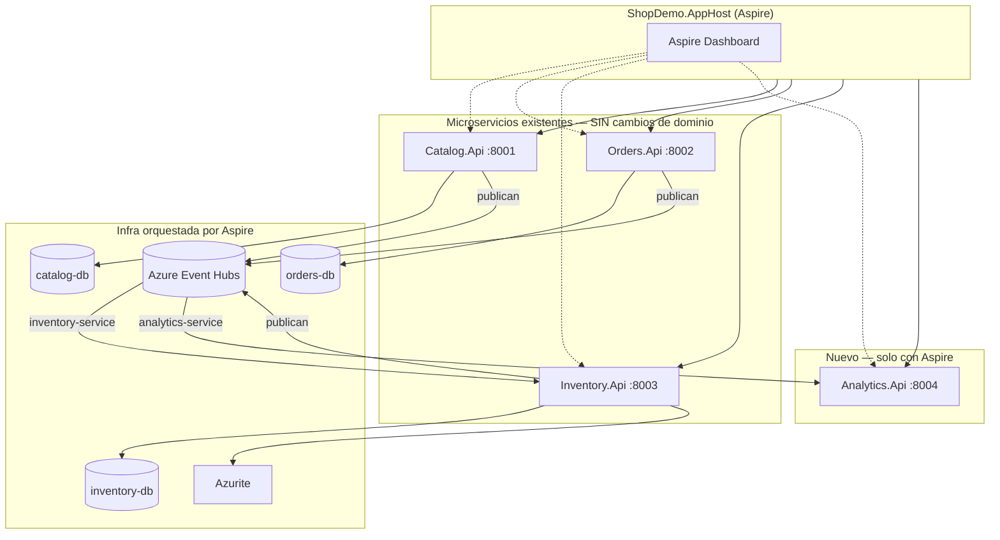

# Integración con .NET Aspire — Propuesta y guía paso a paso (ShopDemo)

| Campo | Detalle |
|:------|:--------|
| **Empresa** | Lite Thinking |
| **Curso** | Microservicios con .NET en Kubernetes y Entornos Multicloud |
| **Instructor** | Lcc. Gilberto Valentino Juárez Sánchez |
| **Contacto** | WhatsApp: +52 5614206660 |
| | E-mail: gilberto.juarez@gmail.com |
| | E-mail: lcc.gilberto.juarez@gmail.com |

**Versión:** 2.0 — **Implementado**  
**Estado del código:** Aspire + Analytics.Api en `Aspire/` — ver [docs/analytics/](./analytics/)

> **Implementado según decisiones del instructor:** Analytics.Api, Fase 1 sin tocar `Program.cs` de los 3 APIs, Event Hubs habilitado desde AppHost. Despliegue en nube (ACA/AKS/ECS/EKS): [despliegue/README.md](./despliegue/README.md).

---

## Índice

1. [Validación: ¿conviene integrar Aspire?](#1-validación-conviene-integrar-aspire)
2. [Propuesta recomendada (implementación sencilla)](#2-propuesta-recomendada-implementación-sencilla)
3. [Qué NO se modifica](#3-qué-no-se-modifica)
4. [Qué se agrega (nuevos proyectos)](#4-qué-se-agrega-nuevos-proyectos)
5. [Introducción a .NET Aspire](#5-introducción-a-net-aspire)
6. [Arquitectura objetivo con Aspire](#6-arquitectura-objetivo-con-aspire)
7. [Guía paso a paso (pendiente de implementar)](#7-guía-paso-a-paso-pendiente-de-implementar)
8. [Integración con Azure y Kubernetes](#8-integración-con-azure-y-kubernetes)
9. [Automatización local y pruebas](#9-automatización-local-y-pruebas)
10. [Decisiones abiertas para el instructor](#10-decisiones-abiertas-para-el-instructor)

---

## 1. Validación: ¿conviene integrar Aspire?

### 1.1 Situación actual

| Aspecto | Estado |
|---|---|
| 3 microservicios (Catalog, Orders, Inventory) | ✅ Implementados y estables |
| Docker Compose por servicio | ✅ Independiente (puertos 8001–8003) |
| Azure Event Hubs | ✅ Adaptadores listos; activación vía `.env` en contenedores |
| Orquestación unificada | ❌ No existe — 3 terminales / 3 compose |
| Service discovery | ❌ URLs hardcodeadas (`InventoryApi:BaseUrl`, `host.docker.internal`) |
| Dashboard de desarrollo | ❌ No centralizado |

### 1.2 ¿Aspire encaja sin romper los 3 servicios?

**Sí**, si Aspire se introduce como **capa de orquestación externa** y un **cuarto servicio nuevo** para demostrar consumo de eventos, sin alterar dominio ni handlers existentes.

| Criterio | Evaluación |
|---|---|
| ¿Rompe Clean / Hexagonal de los 3 APIs? | **No** — Aspire no entra en Domain/Application |
| ¿Requiere reescribir microservicios? | **No** — se referencian como proyectos existentes |
| ¿Puede usar Event Hubs ya implementado? | **Sí** — inyecta `EventHubs__*` por configuración |
| ¿Aporta valor pedagógico? | **Sí** — orquestación, dashboard, despliegue unificado |
| ¿Riesgo bajo? | **Sí** — cambios opcionales y reversibles en los 3 APIs |

### 1.3 ¿Conviene un cuarto servicio o solo AppHost?

| Opción | Descripción | Recomendación |
|---|---|---|
| **A) Solo AppHost** | Orquesta los 3 APIs + PostgreSQL + Azurite | Mínimo, pero poca “interacción” nueva |
| **B) AppHost + Analytics** | Orquesta todo + servicio que consume Event Hubs | ✅ **Recomendada para el curso** |
| **C) Convertir un API existente a Aspire** | Refactor mayor | ❌ No recomendado — rompe el ejercicio actual |

**Conclusión:** La opción **B** cumple los objetivos del curso: Aspire, contenedores, Event Hubs e interacción con los 3 bounded contexts **sin modificarlos**.

---

## 2. Propuesta recomendada (implementación sencilla)

### 2.1 Nombre del nuevo servicio: **ShopDemo.Analytics.Api**

| Atributo | Valor |
|---|---|
| **Rol** | Observador del bus de eventos (read-only) |
| **Puerto** | `8004` |
| **Arquitectura** | API mínima + `BackgroundService` consumidor Event Hubs |
| **Consumer group** | `analytics-service` (distinto de `inventory-service`) |
| **Interacción con los 3 APIs** | **Solo asíncrona** — lee el mismo Event Hub donde Catalog, Orders e Inventory publican |
| **Endpoints MVP** | `GET /api/analytics/events` (últimos N eventos en memoria), `GET /health` |

### 2.2 Por qué Analytics y no otro servicio

- **No compite** con Inventory (que ya consume `ProductCreated` para stock).
- **No requiere HTTP** hacia Catalog/Orders/Inventory — cero acoplamiento nuevo.
- Demuestra **fan-out** de Event Hubs: un evento, múltiples consumidores.
- Es el caso de uso típico de streaming: BI, auditoría, dashboards.

### 2.3 Diagrama de la propuesta



### 2.4 Flujo de demostración en clase

1. Alumno ejecuta **un solo comando**: `dotnet run --project Aspire/ShopDemo.AppHost`
2. Aspire levanta dashboard + 4 APIs + 3 PostgreSQL + Azurite
3. `POST /api/products` (Catalog) → evento en Event Hubs
4. Inventory auto-registra stock (consumidor existente)
5. **Analytics** muestra el evento en `GET /api/analytics/events`
6. `POST /api/orders` + confirmar → Analytics lista `OrderPlaced`, `OrderConfirmed`, `StockReserved`

### 2.5 Cambios opcionales en los 3 APIs (Fase 2 — no obligatoria)

Solo si se desea telemetría OpenTelemetry unificada:

```csharp
// 2 líneas en Program.cs de cada Api existente
builder.AddServiceDefaults();
app.MapDefaultEndpoints();
```

**Fase 1 del curso puede omitir esto** — los 3 servicios funcionan igual referenciados desde AppHost.

---

## 3. Qué NO se modifica

| Componente | Acción |
|---|---|
| `Catalog/ShopDemo.Catalog.Domain` | Sin cambios |
| `Catalog/ShopDemo.Catalog.Application` | Sin cambios |
| `Orders/ShopDemo.Orders.*` (Domain, Application) | Sin cambios |
| `Inventory/ShopDemo.Inventory.*` (Domain, Application) | Sin cambios |
| Handlers, use cases, agregados | Sin cambios |
| `docker-compose.yml` por servicio | Se mantienen — Aspire es alternativa de orquestación |
| Adaptadores Event Hubs existentes | Sin cambios — AppHost inyecta configuración |

---

## 4. Qué se agrega (nuevos proyectos)

```
Aspire/
├── ShopDemo.AppHost/              ← Orquestador Aspire
├── ShopDemo.ServiceDefaults/      ← Extensiones compartidas (telemetría, health)
└── ShopDemo.Analytics.Api/        ← Nuevo microservicio consumidor
```

| Proyecto | Responsabilidad |
|---|---|
| **ShopDemo.AppHost** | Define recursos (Postgres ×3, Azurite), referencia 4 APIs, inyecta `EventHubs__*`, service discovery `https+http://inventory` para Orders |
| **ShopDemo.ServiceDefaults** | `AddServiceDefaults()`, health checks, OpenTelemetry (usado por Analytics y opcionalmente por los 3 APIs) |
| **ShopDemo.Analytics.Api** | Consumidor Event Hubs + API de consulta de eventos recientes |

**Referencia en solución:** carpeta `/Aspire/` en `ShopDemo.slnx` — los 13 proyectos actuales intactos.

---

## 5. Introducción a .NET Aspire

**.NET Aspire** es un stack de orquestación para aplicaciones distribuidas en .NET:

| Componente | Función |
|---|---|
| **App Host** | Proyecto ejecutable que declara servicios y recursos |
| **Dashboard** | UI local: logs, trazas, URLs, estado de recursos |
| **Service discovery** | URLs entre servicios sin hardcodear `localhost:8003` |
| **Integraciones** | PostgreSQL, Redis, Azure, containers con unas líneas |
| **Publishing** | Genera manifiestos para Azure Container Apps o Kubernetes |

### Diferencia con Docker Compose actual

| | Docker Compose (actual) | .NET Aspire |
|---|---|---|
| Alcance | 1 API + su BD por archivo | Toda la solución en un AppHost |
| Dashboard | No integrado | Aspire Dashboard |
| Service discovery | Manual (`host.docker.internal`) | Automático entre proyectos |
| Event Hubs config | `.env` por servicio | Centralizado en AppHost |
| Curso | Despliegue por microservicio | Orquestación cloud-native |

**Ambos pueden coexistir** — Compose para despliegue individual; Aspire para desarrollo integrado y publicación.

---

## 6. Arquitectura objetivo con Aspire

### 6.1 Recursos declarados en AppHost (propuesta)

```csharp
// Pseudocódigo — ilustrativo, pendiente de implementar
var catalogDb = builder.AddPostgres("catalog-db").AddDatabase("ShopDemoCatalog");
var ordersDb  = builder.AddPostgres("orders-db").AddDatabase("ShopDemoOrders");
var inventoryDb = builder.AddPostgres("inventory-db").AddDatabase("ShopDemoInventory");
var azurite = builder.AddContainer("azurite", "mcr.microsoft.com/azure-storage/azurite", "latest");

var catalog   = builder.AddProject<Projects.ShopDemo_Catalog_Api>("catalog");
var orders    = builder.AddProject<Projects.ShopDemo_Orders_Api>("orders");
var inventory = builder.AddProject<Projects.ShopDemo_Inventory_Api>("inventory");
var analytics = builder.AddProject<Projects.ShopDemo_Analytics_Api>("analytics");

catalog.WithReference(catalogDb);
orders.WithReference(ordersDb).WithReference(inventory);  // service discovery
inventory.WithReference(inventoryDb);

// Event Hubs — parámetros desde user secrets o configuración Aspire
var eventHubs = builder.AddConnectionString("eventhubs");
catalog.WithReference(eventHubs);
orders.WithReference(eventHubs);
inventory.WithReference(eventHubs);
analytics.WithReference(eventHubs);
```

### 6.2 Puertos propuestos (sin colisión)

| Servicio | Puerto |
|---|---|
| Catalog | 8001 |
| Orders | 8002 |
| Inventory | 8003 |
| **Analytics** | **8004** |
| Aspire Dashboard | 15888 (default) |

---

## 7. Guía paso a paso

> **Implementación completa** con código fuente en [IMPLEMENTACION-ANALYTICS-ASPIRE.md](./analytics/IMPLEMENTACION-ANALYTICS-ASPIRE.md).

### Paso 1 — Instalar workload Aspire

```bash
dotnet workload update
dotnet workload install aspire
```

**Explicación:** Instala plantillas y herramientas del AppHost.

### Paso 2 — Crear ShopDemo.ServiceDefaults

```bash
cd I:\Curso\ShopDemo
dotnet new aspire-servicedefaults -n ShopDemo.ServiceDefaults -o Aspire/ShopDemo.ServiceDefaults
```

**Explicación:** Proyecto con extensiones `AddServiceDefaults()` para telemetría y health checks.

### Paso 3 — Crear ShopDemo.AppHost

```bash
dotnet new aspire-apphost -n ShopDemo.AppHost -o Aspire/ShopDemo.AppHost
```

**Explicación:** Orquestador principal. Referenciará los 4 APIs y los recursos.

### Paso 4 — Crear ShopDemo.Analytics.Api

```bash
dotnet new webapi -n ShopDemo.Analytics.Api -o Aspire/ShopDemo.Analytics.Api -f net10.0
```

**Explicación:** API mínima del nuevo bounded context “Analytics”.

**Componentes a implementar:**

| Archivo | Rol |
|---|---|
| `EventHubAnalyticsProcessor.cs` | `BackgroundService` — consumer group `analytics-service` |
| `InMemoryEventStore.cs` | Guarda últimos 50 eventos (ring buffer) |
| `AnalyticsController.cs` | `GET /api/analytics/events` |
| `Program.cs` | `AddServiceDefaults()`, registro del processor |

### Paso 5 — Referenciar proyectos existentes en AppHost

```bash
dotnet add Aspire/ShopDemo.AppHost/ShopDemo.AppHost.csproj reference \
  Catalog/ShopDemo.Catalog.Api/ShopDemo.Catalog.Api.csproj

dotnet add Aspire/ShopDemo.AppHost/ShopDemo.AppHost.csproj reference \
  Orders/ShopDemo.Orders.Api/ShopDemo.Orders.Api.csproj

dotnet add Aspire/ShopDemo.AppHost/ShopDemo.AppHost.csproj reference \
  Inventory/ShopDemo.Inventory.Api/ShopDemo.Inventory.Api.csproj

dotnet add Aspire/ShopDemo.AppHost/ShopDemo.AppHost.csproj reference \
  Aspire/ShopDemo.Analytics.Api/ShopDemo.Analytics.Api.csproj
```

**Explicación:** AppHost conoce los ejecutables sin moverlos de carpeta.

### Paso 6 — Configurar AppHost (Program.cs)

- 3 instancias PostgreSQL (o 1 servidor con 3 bases)
- Contenedor Azurite para checkpoints de Inventory
- Variables `EventHubs__Enabled`, `EventHubs__ConnectionString`, etc.
- `Orders` recibe `InventoryApi__BaseUrl` vía service discovery Aspire

**Explicación:** Un solo lugar para toda la configuración de desarrollo.

### Paso 7 — Analytics: consumidor Event Hubs

Reutiliza `IntegrationEventEnvelope` de `ShopDemo.Shared` (mismo contrato que Catalog/Orders/Inventory).

Lógica mínima del processor:

1. Deserializar `IntegrationEventEnvelope`
2. Agregar a `InMemoryEventStore`
3. Actualizar checkpoint (Azurite o Azure Blob)
4. **No** ejecutar lógica de negocio — solo observar

### Paso 8 — Agregar a ShopDemo.slnx

Carpeta `/Aspire/` con AppHost, ServiceDefaults y Analytics.Api.

### Paso 9 — Ejecutar localmente

```bash
cd Aspire/ShopDemo.AppHost
dotnet run
```

Abre Aspire Dashboard → verifica 4 servicios + recursos → prueba flujo de [GUIA-ENDPOINTS.md](./GUIA-ENDPOINTS.md) + `GET /api/analytics/events`.

### Paso 10 — Publicación con contenedores (Aspire CLI)

```bash
dotnet publish Aspire/ShopDemo.AppHost -p:PublishProfile=DefaultContainer
```

**Explicación:** Genera imágenes Docker de cada servicio para despliegue en Azure Container Apps o AKS.

---

## 8. Integración con Azure y Kubernetes

El AppHost **no se despliega** a nube. Cada API se publica como contenedor independiente con las guías del curso:

| Destino | Guía |
|---|---|
| Azure Container Apps | [GUIA-RELEASE-SCRIPT-AZURE](./despliegue/azure/GUIA-RELEASE-SCRIPT-AZURE.md) |
| Azure AKS | [IMPLEMENTACION-DESPLIEGUE-AKS](./despliegue/aks/IMPLEMENTACION-DESPLIEGUE-AKS.md) |
| AWS ECS | [GUIA-RELEASE-SCRIPT-AWS](./despliegue/aws/GUIA-RELEASE-SCRIPT-AWS.md) |
| Amazon EKS | [IMPLEMENTACION-DESPLIEGUE-EKS](./despliegue/eks/IMPLEMENTACION-DESPLIEGUE-EKS.md) |
| Manifiestos compartidos | [k8s/README.md](../k8s/README.md) |

Build de imagen por servicio (ejemplo Analytics):

```bash
docker build -f Aspire/ShopDemo.Analytics.Api/Dockerfile -t shopdemo-analytics:latest .
```

**Referencia opcional:** Aspire puede generar manifiestos o imágenes con `PublishProfile=DefaultContainer` o `azd up`; el lab del curso usa **scripts PowerShell + push ACR/ECR**, no `azd`.

### 8.1 Equivalencia AWS (referencia)

Si el entorno fuera AWS en lugar de Azure Event Hubs, el rol de Analytics sería el mismo consumiendo **Kinesis** o **MSK**. Eso **no forma parte** del lab (mensajería cross-cloud a Event Hubs).

---

## 9. Automatización local y pruebas

### 9.1 Un comando para todo el stack

```bash
dotnet run --project Aspire/ShopDemo.AppHost
```

Reemplaza 3–4 terminales con `docker compose`.

### 9.2 Checklist de prueba manual (Aspire local)

| # | Acción | Verificación |
|---|---|---|
| 1 | Health de 4 APIs vía dashboard | Estado verde |
| 2 | Crear producto | Analytics lista `ProductCreatedDomainEvent` |
| 3 | Consultar Inventory | Stock auto-creado |
| 4 | Crear y confirmar pedido | Analytics lista eventos de Orders e Inventory |

### 9.3 Coexistencia con Docker Compose

Los `docker-compose.yml` en cada API **siguen válidos** para:

- Desplegar un solo microservicio aislado
- CI/CD por servicio
- Alumnos que aún no usen Aspire

---

## 10. Decisiones confirmadas

| # | Pregunta | Decisión aplicada |
|---|---|---|
| 1 | ¿Nombre del 4.º servicio? | ✅ `ShopDemo.Analytics.Api` |
| 2 | ¿Modificar `Program.cs` de los 3 APIs con `ServiceDefaults`? | ✅ **No** en fase 1 |
| 3 | ¿PostgreSQL: 3 contenedores o 1 servidor con 3 DBs? | ✅ 1 servidor Aspire con 3 bases |
| 4 | ¿Event Hubs en Aspire dev: Azure real o deshabilitado? | ✅ Azure real — connection string en AppHost |
| 5 | ¿Implementar `azd` / Azure Container Apps en el curso? | ✅ Release con scripts + guías etapa 7+ (no `azd up` obligatorio) |
| 6 | ¿Puerto Analytics 8004? | ✅ Sí |

---

## Resumen ejecutivo de la propuesta

| Pregunta | Respuesta |
|---|---|
| ¿Conviene Aspire? | **Sí** — orquesta sin romper los 3 microservicios |
| ¿Nuevo servicio? | **Sí** — `Analytics.Api` consume Event Hubs (fan-out) |
| ¿Se tocan dominios existentes? | **No** |
| ¿Usa Event Hubs + contenedores? | **Sí** |
| ¿Implementación sencilla? | **Sí** — 3 proyectos nuevos en `Aspire/`, AppHost referencia APIs existentes |
| ¿Estado actual? | ✅ **Implementado** — ver `Aspire/` y [docs/analytics/](./analytics/) |

---

## Referencias

- [REQUERIMIENTOS-ANALYTICS-ASPIRE.md](./analytics/REQUERIMIENTOS-ANALYTICS-ASPIRE.md)
- [IMPLEMENTACION-ANALYTICS-ASPIRE.md](./analytics/IMPLEMENTACION-ANALYTICS-ASPIRE.md)
- [Documentación .NET Aspire](https://learn.microsoft.com/dotnet/aspire/)
- [INTEGRACION-AZURE-EVENT-HUBS.md](./INTEGRACION-AZURE-EVENT-HUBS.md)
- [ARQUITECTURA.md](./ARQUITECTURA.md)
- [GUIA-ENDPOINTS.md](./GUIA-ENDPOINTS.md)
