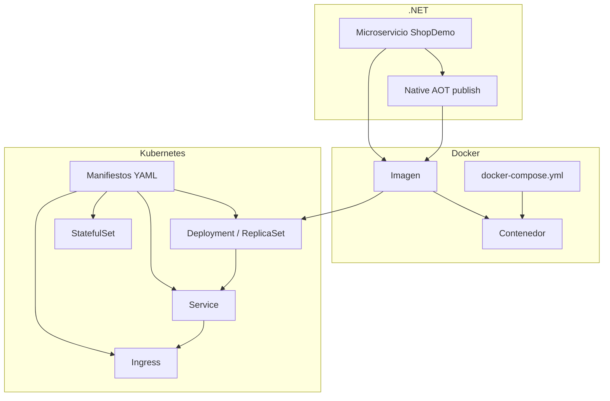

# Teoría — Docker, Kubernetes y Native AOT (.NET)

| Campo | Detalle |
|:------|:--------|
| **Empresa** | Lite Thinking |
| **Curso** | Microservicios con .NET en Kubernetes y Entornos Multicloud |
| **Instructor** | Lcc. Gilberto Valentino Juárez Sánchez |
| **Contacto** | WhatsApp: +52 5614206660 |
| | E-mail: gilberto.juarez@gmail.com |
| | E-mail: lcc.gilberto.juarez@gmail.com |

**Propósito:** Material breve para clase y diapositivas. Contexto de referencia: solución **ShopDemo** (microservicios .NET en contenedores).

---

## 1. Docker — conceptos básicos

### ¿Qué es?

**Docker** empaqueta una aplicación y sus dependencias en una **imagen** inmutable. Esa imagen se ejecuta como **contenedor**: un proceso aislado que comparte el kernel del host.

| Concepto | Definición práctica |
|---|---|
| **Imagen** | Plantilla de solo lectura (capas). Ej.: `mcr.microsoft.com/dotnet/aspnet:10.0` |
| **Contenedor** | Instancia en ejecución de una imagen |
| **Dockerfile** | Receta para construir la imagen (`FROM`, `COPY`, `RUN`, `ENTRYPOINT`) |
| **Registry** | Almacén de imágenes (Docker Hub, ACR, ECR) |
| **Volumen** | Persistencia de datos fuera del ciclo de vida del contenedor |
| **Red Docker** | Permite que contenedores se comuniquen por nombre (`catalog-db`, `orders-service`) |

### Flujo típico (ShopDemo)

```
Código → docker build → imagen local → docker push → registry → pull en servidor/K8s
```

**Ventajas en microservicios:** mismo artefacto en dev y producción, arranque rápido, aislamiento por servicio, escalado horizontal.

### Comandos esenciales

| Acción | Comando |
|---|---|
| Construir | `docker build -t shopdemo-catalog:latest .` |
| Ejecutar | `docker run -p 8001:8080 shopdemo-catalog:latest` |
| Orquestar varios | `docker compose up` |
| Ver logs | `docker logs <container>` |

> En ShopDemo cada API tiene `Dockerfile` + `docker-compose.yml` (API + PostgreSQL).

---

## 2. Docker — archivos YAML (`docker-compose.yml`)

**Compose** describe **varios contenedores** en un solo archivo YAML: servicios, redes, volúmenes y variables de entorno.

### Estructura mínima

```yaml
services:
  catalog-db:
    image: postgres:16-alpine
    environment:
      POSTGRES_DB: ShopDemoCatalog
    ports:
      - "5433:5432"

  catalog-service:
    build:
      context: ..
      dockerfile: ShopDemo.Catalog.Api/Dockerfile
    ports:
      - "8001:8080"
    environment:
      - ConnectionStrings__DefaultConnection=Host=catalog-db;...
    depends_on:
      catalog-db:
        condition: service_healthy
```

### Elementos clave del YAML

| Clave | Uso |
|---|---|
| `services` | Define cada contenedor (API, BD, Azurite) |
| `image` / `build` | Imagen preconstruida o Dockerfile |
| `ports` | `host:contenedor` — expone la API |
| `environment` | Variables de configuración (`EventHubs__Enabled`, etc.) |
| `volumes` | Datos persistentes (PostgreSQL) |
| `depends_on` | Orden de arranque entre servicios |
| `healthcheck` | Esperar a que PostgreSQL esté listo |

**Idea para diapositiva:** *YAML = contrato declarativo; Docker Compose lo interpreta y levanta el stack.*

---

## 3. Kubernetes — conceptos básicos

### ¿Qué es?

**Kubernetes (K8s)** orquesta contenedores a escala: despliegue, escalado, autorreparación, balanceo y configuración declarativa.

| Concepto | Rol |
|---|---|
| **Cluster** | Conjunto de nodos (máquinas) que ejecutan cargas |
| **Nodo (Node)** | Worker con `kubelet` + runtime de contenedores |
| **Pod** | Unidad mínima: uno o más contenedores que comparten red y almacenamiento |
| **Namespace** | Separación lógica (`shopdemo-dev`, `shopdemo-prod`) |
| **Control plane** | API server, scheduler, controller manager — “cerebro” del cluster |
| **kubectl** | CLI para aplicar manifiestos y consultar estado |

### Modelo mental

```
Manifiesto YAML → API Server → Controller → Pods en Nodos → Servicio/Ingress → Usuario
```

**Por qué K8s si ya tengo Docker:** Docker corre **un** host; K8s gestiona **muchos** hosts, réplicas, fallos y actualizaciones sin downtime manual.

---

## 4. Kubernetes — archivos YAML (manifiestos)

Cada recurso K8s se describe en YAML con cuatro campos obligatorios:

```yaml
apiVersion: apps/v1
kind: Deployment
metadata:
  name: shopdemo-catalog
  namespace: shopdemo
spec:
  # definición del recurso
```

| Campo | Significado |
|---|---|
| `apiVersion` | Versión de la API (`v1`, `apps/v1`, `networking.k8s.io/v1`) |
| `kind` | Tipo de recurso (`Pod`, `Deployment`, `Service`, `Ingress`) |
| `metadata` | Nombre, etiquetas (`labels`), namespace |
| `spec` | Estado deseado del recurso |

**Labels y selectors:** conectan recursos. Ej.: `app: catalog` en Deployment y en Service para enrutar tráfico.

**Aplicar y verificar:**

```bash
kubectl apply -f catalog-deployment.yaml
kubectl get pods -n shopdemo
kubectl describe deployment shopdemo-catalog
```

---

## 5. Kubernetes — ReplicaSets y Deployments

### ReplicaSet

Garantiza que **N réplicas** de un Pod estén corriendo. Si un Pod muere, crea otro.

| Campo | Ejemplo |
|---|---|
| `replicas: 3` | Tres instancias del microservicio Catalog |
| `selector.matchLabels` | Qué Pods controla |

> En la práctica **casi siempre usas Deployment**, no ReplicaSet suelto.

### Deployment

ReplicaSet + **actualizaciones controladas** (rolling update, rollback).

```yaml
apiVersion: apps/v1
kind: Deployment
metadata:
  name: shopdemo-orders
spec:
  replicas: 2
  selector:
    matchLabels:
      app: orders
  template:
    metadata:
      labels:
        app: orders
    spec:
      containers:
        - name: orders-api
          image: acrshopdemo.azurecr.io/shopdemo-orders:v1
          ports:
            - containerPort: 8080
          env:
            - name: InventoryApi__BaseUrl
              value: "http://shopdemo-inventory:8080"
```

| Ventaja | Descripción |
|---|---|
| Rolling update | Sustituye Pods de forma gradual (`maxSurge`, `maxUnavailable`) |
| Rollback | `kubectl rollout undo` si la nueva imagen falla |
| Escalado | `kubectl scale deployment shopdemo-orders --replicas=5` |

**ShopDemo:** Catalog, Orders, Inventory y Analytics = **Deployments** (stateless, escalan horizontalmente).

---

## 6. Kubernetes — StatefulSets

Para cargas **con estado** e identidad estable: cada Pod tiene nombre y volumen persistente predecible.

| Característica | Deployment | StatefulSet |
|---|---|---|
| Nombre del Pod | Aleatorio (`orders-7d8f9-xyz`) | Estable (`postgres-0`, `postgres-1`) |
| Almacenamiento | Efímero o genérico | **PersistentVolumeClaim** por réplica |
| Orden de arranque | Paralelo | Secuencial (0 → 1 → 2) |
| Uso típico | APIs .NET | PostgreSQL, Kafka, Redis |

```yaml
apiVersion: apps/v1
kind: StatefulSet
metadata:
  name: shopdemo-postgres
spec:
  serviceName: shopdemo-postgres
  replicas: 1
  template:
    spec:
      containers:
        - name: postgres
          image: postgres:16-alpine
          volumeMounts:
            - name: data
              mountPath: /var/lib/postgresql/data
  volumeClaimTemplates:
    - metadata:
        name: data
      spec:
        accessModes: ["ReadWriteOnce"]
        resources:
          requests:
            storage: 10Gi
```

**ShopDemo:** las APIs van en Deployment; PostgreSQL en laboratorio avanzado puede ir en StatefulSet (en el curso también se usa Postgres en contenedor fuera de K8s o servicio gestionado).

---

## 7. Kubernetes — Services

Un **Service** expone Pods con una **IP/DNS estable** dentro del cluster y balancea tráfico entre réplicas.

| Tipo | Alcance | Uso en ShopDemo |
|---|---|---|
| **ClusterIP** (default) | Solo dentro del cluster | Orders → Inventory (`shopdemo-inventory:8080`) |
| **NodePort** | Puerto en cada nodo | Pruebas en lab |
| **LoadBalancer** | IP externa (cloud) | Exponer Catalog/Orders al público |
| **Headless** (`clusterIP: None`) | DNS por Pod | StatefulSet (PostgreSQL) |

```yaml
apiVersion: v1
kind: Service
metadata:
  name: shopdemo-catalog
spec:
  selector:
    app: catalog
  ports:
    - port: 80
      targetPort: 8080
  type: LoadBalancer
```

**Regla:** el `selector` del Service debe coincidir con las `labels` del Deployment.

---

## 8. Kubernetes — Ingresses

**Ingress** define reglas HTTP/HTTPS de entrada al cluster (rutas y hosts) y delega en un **Ingress Controller** (NGINX, Traefik, Application Gateway).

| Sin Ingress | Con Ingress |
|---|---|
| Un LoadBalancer por servicio ($$$) | Un punto de entrada; rutas por path/host |
| `catalog.ejemplo.com`, `orders.ejemplo.com` | Un solo balanceador + reglas |

```yaml
apiVersion: networking.k8s.io/v1
kind: Ingress
metadata:
  name: shopdemo-ingress
spec:
  rules:
    - host: api.shopdemo.local
      http:
        paths:
          - path: /catalog
            pathType: Prefix
            backend:
              service:
                name: shopdemo-catalog
                port:
                  number: 80
          - path: /orders
            pathType: Prefix
            backend:
              service:
                name: shopdemo-orders
                port:
                  number: 80
```

**TLS:** el Ingress puede referenciar un Secret con certificado. En producción se usa Let's Encrypt o certificado del cloud provider.

---

## 9. Native AOT en .NET — optimización de rendimiento

### ¿Qué es?

**Ahead-of-Time (AOT)** compila la aplicación .NET a **código nativo** en tiempo de publicación (`dotnet publish -p:PublishAot=true`), en lugar de depender del JIT en runtime.

### Beneficios principales

| Beneficio | Efecto en microservicios |
|---|---|
| **Menor consumo de memoria** | Sin JIT ni metadatos completos en runtime — relevante con muchas réplicas en K8s |
| **Arranque más rápido** | Sin compilación JIT al inicio — ideal para escalado automático (HPA) y serverless |
| **Imagen Docker más pequeña** | Puede usarse imagen base `chiseled` / sin SDK completo |

### Trade-offs (importante en clase)

| Limitación | Impacto |
|---|---|
| Sin reflexión dinámica completa | EF Core, serialización dinámica y algunos frameworks requieren configuración extra |
| Tiempo de compilación mayor | CI/CD más lento |
| Compatibilidad | No todo el ecosistema NuGet es 100 % AOT-ready |

### Casos de uso en microservicios (ShopDemo)

| Escenario | ¿AOT recomendado? |
|---|---|
| API stateless de alto tráfico (Catalog, Orders) | ✅ Candidato fuerte |
| Worker consumidor de eventos (Analytics) | ✅ Buen candidato (arranque rápido) |
| API con EF Core + migraciones complejas | ⚠️ Evaluar; puede requerir ajustes |
| Prototipo / curso con Clean Architecture estándar | Opcional — priorizar contenedor estándar primero |

### Publicación AOT (ejemplo)

```bash
dotnet publish Catalog/ShopDemo.Catalog.Api/ShopDemo.Catalog.Api.csproj \
  -c Release -r linux-x64 -p:PublishAot=true -o ./publish-aot
```

**Dockerfile AOT:** imagen final sobre `mcr.microsoft.com/dotnet/runtime-deps` (más liviana que `aspnet`).

### Idea para diapositiva

> **Contenedor estándar:** equilibrio simplicidad/dev-experience.  
> **Native AOT:** cuando el costo por réplica y el cold start importan en Kubernetes.

---

## 10. Resumen visual (mapa para diapositivas)



| Tema | Una frase |
|---|---|
| **Docker** | Empaqueta el microservicio; Compose orquesta en un host |
| **YAML** | Contrato declarativo (Compose y K8s) |
| **Deployment** | APIs stateless con réplicas y rolling updates |
| **StatefulSet** | Estado estable (bases de datos) |
| **Service** | Descubrimiento y balanceo interno |
| **Ingress** | Puerta de entrada HTTP al cluster |
| **Native AOT** | Menos RAM, arranque más rápido; validar compatibilidad |

---

## Referencias

- [Docker — documentación](https://docs.docker.com/)
- [Kubernetes — conceptos](https://kubernetes.io/docs/concepts/)
- [Microsoft — Native AOT deployment](https://learn.microsoft.com/dotnet/core/deploying/native-aot/)
- [Cheat sheets del curso](./cheat-sheets/)
- [ShopDemo — ARQUITECTURA](./ARQUITECTURA.md)
