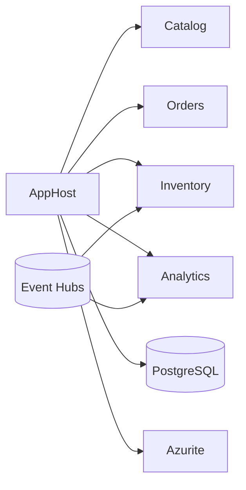

# Documento de Implementación — Analytics + .NET Aspire (ShopDemo)

**Curso:** Arquitectura Clean + DDD — Lite Thinking  
**Tipo:** Guía de implementación con código fuente completo  
**Versión:** 1.0  
**Prerequisito:** Catalog, Orders, Inventory + Event Hubs + `ShopDemo.Shared`

> Los alumnos deben seguir [REQUERIMIENTOS-ANALYTICS-ASPIRE.md](./REQUERIMIENTOS-ANALYTICS-ASPIRE.md) y usar este documento para implementar o validar su solución.

---

## Índice

1. [Visión general](#1-visión-general)
2. [Paso 1 — Crear ShopDemo.ServiceDefaults](#2-paso-1--crear-shopdemoservicedefaults)
3. [Paso 2 — Crear ShopDemo.Analytics.Api](#3-paso-2--crear-shopdemoanalyticsapi)
4. [Paso 3 — Crear ShopDemo.AppHost](#4-paso-3--crear-shopdemoapphost)
5. [Paso 4 — Registrar en la solución](#5-paso-4--registrar-en-la-solución)
6. [Paso 5 — Configurar Event Hubs en AppHost](#6-paso-5--configurar-event-hubs-en-apphost)
7. [Paso 6 — Ejecutar y probar](#7-paso-6--ejecutar-y-probar)
8. [Qué NO se modifica (Fase 1)](#8-qué-no-se-modifica-fase-1)
9. [Fase posterior — Azure Container Apps](#9-fase-posterior--azure-container-apps)

---

## 1. Visión general

Esta integración agrega **3 proyectos nuevos** bajo `Aspire/`:

| Proyecto | Responsabilidad |
|---|---|
| `ShopDemo.AppHost` | Orquesta 4 APIs + PostgreSQL + Azurite + config Event Hubs |
| `ShopDemo.ServiceDefaults` | Telemetría, health checks, service discovery (plantilla Aspire) |
| `ShopDemo.Analytics.Api` | Consumidor read-only del bus + API de consulta |



**Regla clave de Fase 1:** Catalog, Orders e Inventory **no reciben** `AddServiceDefaults()` en su `Program.cs`. Aspire los referencia tal cual están.

---

## 2. Paso 1 — Crear ShopDemo.ServiceDefaults

### 2.1 Explicación

`ServiceDefaults` es el proyecto compartido que Aspire genera en toda solución. Centraliza:

- OpenTelemetry (métricas y trazas hacia el dashboard)
- Health checks (`/health`, `/alive`)
- Service discovery para `HttpClient`

En Fase 1 **solo Analytics** lo usa. Los 3 microservicios existentes pueden adoptarlo en una fase posterior.

### 2.2 Crear el proyecto

```bash
cd I:\Curso\ShopDemo
mkdir Aspire\ShopDemo.ServiceDefaults

dotnet new classlib -n ShopDemo.ServiceDefaults -o Aspire/ShopDemo.ServiceDefaults -f net10.0
```

### 2.3 Paquetes NuGet

```bash
dotnet add Aspire/ShopDemo.ServiceDefaults package Microsoft.Extensions.Http.Resilience --version 10.0.0
dotnet add Aspire/ShopDemo.ServiceDefaults package Microsoft.Extensions.ServiceDiscovery --version 10.0.0
dotnet add Aspire/ShopDemo.ServiceDefaults package OpenTelemetry.Exporter.OpenTelemetryProtocol --version 1.12.0
dotnet add Aspire/ShopDemo.ServiceDefaults package OpenTelemetry.Extensions.Hosting --version 1.12.0
dotnet add Aspire/ShopDemo.ServiceDefaults package OpenTelemetry.Instrumentation.AspNetCore --version 1.12.0
dotnet add Aspire/ShopDemo.ServiceDefaults package OpenTelemetry.Instrumentation.Http --version 1.12.0
dotnet add Aspire/ShopDemo.ServiceDefaults package OpenTelemetry.Instrumentation.Runtime --version 1.12.0
```

### 2.4 `ShopDemo.ServiceDefaults.csproj`

```xml
<Project Sdk="Microsoft.NET.Sdk">

  <PropertyGroup>
    <TargetFramework>net10.0</TargetFramework>
    <ImplicitUsings>enable</ImplicitUsings>
    <Nullable>enable</Nullable>
    <IsAspireSharedProject>true</IsAspireSharedProject>
  </PropertyGroup>

  <ItemGroup>
    <FrameworkReference Include="Microsoft.AspNetCore.App" />
    <PackageReference Include="Microsoft.Extensions.Http.Resilience" Version="10.0.0" />
    <PackageReference Include="Microsoft.Extensions.ServiceDiscovery" Version="10.0.0" />
    <PackageReference Include="OpenTelemetry.Exporter.OpenTelemetryProtocol" Version="1.12.0" />
    <PackageReference Include="OpenTelemetry.Extensions.Hosting" Version="1.12.0" />
    <PackageReference Include="OpenTelemetry.Instrumentation.AspNetCore" Version="1.12.0" />
    <PackageReference Include="OpenTelemetry.Instrumentation.Http" Version="1.12.0" />
    <PackageReference Include="OpenTelemetry.Instrumentation.Runtime" Version="1.12.0" />
  </ItemGroup>

</Project>
```

### 2.5 `Extensions.cs`

**Qué hace cada método:**

| Método | Propósito |
|---|---|
| `AddServiceDefaults()` | Punto de entrada: registra telemetría, health y discovery |
| `ConfigureOpenTelemetry()` | Instrumenta ASP.NET Core, HttpClient y runtime |
| `AddDefaultHealthChecks()` | Check `self` con tag `live` |
| `MapDefaultEndpoints()` | Expone `/health` y `/alive` en Development |

```csharp
using Microsoft.AspNetCore.Builder;
using Microsoft.AspNetCore.Diagnostics.HealthChecks;
using Microsoft.Extensions.DependencyInjection;
using Microsoft.Extensions.Diagnostics.HealthChecks;
using Microsoft.Extensions.Logging;
using OpenTelemetry;
using OpenTelemetry.Metrics;
using OpenTelemetry.Trace;

namespace Microsoft.Extensions.Hosting;

public static class Extensions
{
    public static IHostApplicationBuilder AddServiceDefaults(this IHostApplicationBuilder builder)
    {
        builder.ConfigureOpenTelemetry();
        builder.AddDefaultHealthChecks();
        builder.Services.AddServiceDiscovery();
        builder.Services.ConfigureHttpClientDefaults(http =>
        {
            http.AddStandardResilienceHandler();
            http.AddServiceDiscovery();
        });
        return builder;
    }

    public static IHostApplicationBuilder ConfigureOpenTelemetry(this IHostApplicationBuilder builder)
    {
        builder.Logging.AddOpenTelemetry(logging =>
        {
            logging.IncludeFormattedMessage = true;
            logging.IncludeScopes = true;
        });

        builder.Services.AddOpenTelemetry()
            .WithMetrics(metrics =>
            {
                metrics.AddAspNetCoreInstrumentation()
                    .AddHttpClientInstrumentation()
                    .AddRuntimeInstrumentation();
            })
            .WithTracing(tracing =>
            {
                tracing.AddAspNetCoreInstrumentation()
                    .AddHttpClientInstrumentation();
            });

        builder.AddOpenTelemetryExporters();
        return builder;
    }

    private static IHostApplicationBuilder AddOpenTelemetryExporters(this IHostApplicationBuilder builder)
    {
        var useOtlp = !string.IsNullOrWhiteSpace(builder.Configuration["OTEL_EXPORTER_OTLP_ENDPOINT"]);
        if (useOtlp)
            builder.Services.AddOpenTelemetry().UseOtlpExporter();

        return builder;
    }

    public static IHostApplicationBuilder AddDefaultHealthChecks(this IHostApplicationBuilder builder)
    {
        builder.Services.AddHealthChecks()
            .AddCheck("self", () => HealthCheckResult.Healthy(), ["live"]);
        return builder;
    }

    public static WebApplication MapDefaultEndpoints(this WebApplication app)
    {
        if (app.Environment.IsDevelopment())
        {
            app.MapHealthChecks("/health");
            app.MapHealthChecks("/alive", new HealthCheckOptions
            {
                Predicate = r => r.Tags.Contains("live")
            });
        }

        return app;
    }
}
```

---

## 3. Paso 2 — Crear ShopDemo.Analytics.Api

### 3.1 Explicación

Analytics es un **observador** del bus de eventos:

1. Se suscribe al mismo Event Hub que Catalog, Orders e Inventory.
2. Usa consumer group `analytics-service` (offset independiente de Inventory).
3. Guarda eventos en memoria para consulta HTTP.
4. **No** modifica stock, pedidos ni catálogo.

### 3.2 Crear el proyecto

```bash
dotnet new webapi -n ShopDemo.Analytics.Api -o Aspire/ShopDemo.Analytics.Api -f net10.0

dotnet add Aspire/ShopDemo.Analytics.Api reference Aspire/ShopDemo.ServiceDefaults/ShopDemo.ServiceDefaults.csproj
dotnet add Aspire/ShopDemo.Analytics.Api reference ShopDemo.Shared/ShopDemo.Shared.csproj

dotnet add Aspire/ShopDemo.Analytics.Api package Azure.Messaging.EventHubs --version 5.12.2
dotnet add Aspire/ShopDemo.Analytics.Api package Azure.Messaging.EventHubs.Processor --version 5.12.2
dotnet add Aspire/ShopDemo.Analytics.Api package Azure.Storage.Blobs --version 12.26.0
dotnet add Aspire/ShopDemo.Analytics.Api package Microsoft.AspNetCore.OpenApi --version 10.0.0
dotnet add Aspire/ShopDemo.Analytics.Api package Swashbuckle.AspNetCore --version 10.2.1
```

### 3.3 `ShopDemo.Analytics.Api.csproj`

```xml
<Project Sdk="Microsoft.NET.Sdk.Web">

  <PropertyGroup>
    <TargetFramework>net10.0</TargetFramework>
    <Nullable>enable</Nullable>
    <ImplicitUsings>enable</ImplicitUsings>
  </PropertyGroup>

  <ItemGroup>
    <PackageReference Include="Azure.Messaging.EventHubs" Version="5.12.2" />
    <PackageReference Include="Azure.Messaging.EventHubs.Processor" Version="5.12.2" />
    <PackageReference Include="Azure.Storage.Blobs" Version="12.26.0" />
    <PackageReference Include="Microsoft.AspNetCore.OpenApi" Version="10.0.0" />
    <PackageReference Include="Swashbuckle.AspNetCore" Version="10.2.1" />
  </ItemGroup>

  <ItemGroup>
    <ProjectReference Include="..\ShopDemo.ServiceDefaults\ShopDemo.ServiceDefaults.csproj" />
    <ProjectReference Include="..\..\ShopDemo.Shared\ShopDemo.Shared.csproj" />
  </ItemGroup>

</Project>
```

### 3.4 `Services/InMemoryEventStore.cs`

**Explicación:** Ring buffer thread-safe. Cuando supera 100 eventos, descarta los más antiguos. Es suficiente para demostración en clase; en producción se usaría una base de datos o data lake.

```csharp
namespace ShopDemo.Analytics.Api.Services;

/// <summary>
/// Almacén en memoria de los últimos eventos observados (ring buffer).
/// </summary>
public sealed class InMemoryEventStore
{
    private readonly object _lock = new();
    private readonly Queue<StoredEvent> _events = new();
    private const int MaxEvents = 100;

    public void Add(StoredEvent storedEvent)
    {
        lock (_lock)
        {
            _events.Enqueue(storedEvent);
            while (_events.Count > MaxEvents)
                _events.Dequeue();
        }
    }

    public IReadOnlyList<StoredEvent> GetLatest(int take = 50)
    {
        lock (_lock)
        {
            return _events.Reverse().Take(take).ToList();
        }
    }

    public int Count
    {
        get
        {
            lock (_lock)
                return _events.Count;
        }
    }
}

public sealed record StoredEvent(
    string EventType,
    Guid EventId,
    DateTimeOffset OccurredOn,
    string Source,
    string PayloadJson,
    DateTimeOffset ReceivedAt);
```

### 3.5 `Messaging/EventHubAnalyticsProcessor.cs`

**Explicación:** Patrón idéntico al `CatalogEventsProcessor` de Inventory, pero:

- Consumer group: `analytics-service`
- Contenedor checkpoint: `analytics-checkpoints`
- Acción: solo agregar a `InMemoryEventStore` (sin casos de uso)

```csharp
using System.Text;
using System.Text.Json;
using Azure.Messaging.EventHubs;
using Azure.Messaging.EventHubs.Processor;
using Azure.Storage.Blobs;
using ShopDemo.Analytics.Api.Services;
using ShopDemo.Shared.Messaging;

namespace ShopDemo.Analytics.Api.Messaging;

/// <summary>
/// Consumidor de Analytics: observa todos los eventos del bus (consumer group analytics-service).
/// No ejecuta lógica de negocio — solo registra eventos para consulta.
/// </summary>
public sealed class EventHubAnalyticsProcessor : BackgroundService
{
    private readonly EventProcessorClient _processor;
    private readonly InMemoryEventStore _eventStore;
    private readonly ILogger<EventHubAnalyticsProcessor> _logger;

    public EventHubAnalyticsProcessor(
        IConfiguration configuration,
        InMemoryEventStore eventStore,
        ILogger<EventHubAnalyticsProcessor> logger)
    {
        var connectionString = configuration["EventHubs:ConnectionString"]
            ?? throw new InvalidOperationException(
                "EventHubs:ConnectionString is not configured for Analytics.");

        var eventHubName = configuration["EventHubs:EventHubName"]
            ?? throw new InvalidOperationException(
                "EventHubs:EventHubName is not configured for Analytics.");

        var checkpointConnection = configuration["EventHubs:CheckpointStorageConnectionString"]
            ?? throw new InvalidOperationException(
                "EventHubs:CheckpointStorageConnectionString is not configured for Analytics.");

        var checkpointContainer = configuration["EventHubs:CheckpointContainerName"]
            ?? "analytics-checkpoints";

        var consumerGroup = configuration["EventHubs:ConsumerGroup"]
            ?? "analytics-service";

        _processor = new EventProcessorClient(
            new BlobContainerClient(checkpointConnection, checkpointContainer),
            consumerGroup,
            connectionString,
            eventHubName);

        _processor.ProcessEventAsync += OnProcessEventAsync;
        _processor.ProcessErrorAsync += OnProcessErrorAsync;
        _eventStore = eventStore;
        _logger = logger;
    }

    private async Task OnProcessEventAsync(ProcessEventArgs args)
    {
        var body = Encoding.UTF8.GetString(args.Data.Body.ToArray());
        var envelope = JsonSerializer.Deserialize<IntegrationEventEnvelope>(body);

        if (envelope is not null)
        {
            _eventStore.Add(new StoredEvent(
                envelope.EventType,
                envelope.EventId,
                envelope.OccurredOn,
                envelope.Source,
                envelope.PayloadJson,
                DateTimeOffset.UtcNow));

            _logger.LogInformation(
                "Analytics observed {EventType} from {Source} ({EventId})",
                envelope.EventType,
                envelope.Source,
                envelope.EventId);
        }

        await args.UpdateCheckpointAsync(args.CancellationToken);
    }

    private Task OnProcessErrorAsync(ProcessErrorEventArgs args)
    {
        _logger.LogError(
            args.Exception,
            "Analytics Event Hubs processor error. Partition={PartitionId}",
            args.PartitionId);

        return Task.CompletedTask;
    }

    protected override Task ExecuteAsync(CancellationToken stoppingToken)
    {
        _logger.LogInformation("Analytics Event Hubs consumer started (group: analytics-service)");
        return _processor.StartProcessingAsync(stoppingToken);
    }

    public override async Task StopAsync(CancellationToken cancellationToken)
    {
        await _processor.StopProcessingAsync(cancellationToken);
        await base.StopAsync(cancellationToken);
        _logger.LogInformation("Analytics Event Hubs consumer stopped");
    }
}
```

### 3.6 `Controllers/AnalyticsController.cs`

**Explicación:** API mínima de consulta. El parámetro `take` limita resultados entre 1 y 100.

```csharp
using Microsoft.AspNetCore.Mvc;
using ShopDemo.Analytics.Api.Services;

namespace ShopDemo.Analytics.Api.Controllers;

[ApiController]
[Route("api/analytics")]
public sealed class AnalyticsController(InMemoryEventStore eventStore) : ControllerBase
{
    [HttpGet("events")]
    [ProducesResponseType(StatusCodes.Status200OK)]
    public IActionResult GetEvents([FromQuery] int take = 50)
    {
        var events = eventStore.GetLatest(Math.Clamp(take, 1, 100));
        return Ok(new
        {
            totalBuffered = eventStore.Count,
            returned = events.Count,
            events
        });
    }

    [HttpGet("health")]
    [ProducesResponseType(StatusCodes.Status200OK)]
    public IActionResult GetHealth() => Ok(new
    {
        service = "ShopDemo.Analytics.Api",
        status = "running",
        bufferedEvents = eventStore.Count
    });
}
```

### 3.7 `Program.cs`

**Explicación:**

- `AddServiceDefaults()` — telemetría visible en Aspire Dashboard
- `AddHostedService<EventHubAnalyticsProcessor>()` — arranca el consumidor al iniciar la API
- `MapDefaultEndpoints()` — health checks estándar Aspire

```csharp
using Microsoft.OpenApi;
using ShopDemo.Analytics.Api.Messaging;
using ShopDemo.Analytics.Api.Services;

var builder = WebApplication.CreateBuilder(args);

builder.AddServiceDefaults();

builder.Services.AddControllers();
builder.Services.AddEndpointsApiExplorer();
builder.Services.AddSwaggerGen(options =>
{
    options.SwaggerDoc("v1", new OpenApiInfo
    {
        Title = "ShopDemo Analytics API",
        Version = "v1",
        Description = "Observador de eventos del bus — orquestado por .NET Aspire"
    });
});

builder.Services.AddSingleton<InMemoryEventStore>();
builder.Services.AddHostedService<EventHubAnalyticsProcessor>();

var app = builder.Build();

if (app.Environment.IsDevelopment())
{
    app.UseSwagger();
    app.UseSwaggerUI(o =>
    {
        o.SwaggerEndpoint("/swagger/v1/swagger.json", "ShopDemo Analytics API v1");
        o.RoutePrefix = "swagger";
    });
}

app.MapDefaultEndpoints();
app.MapControllers();

app.Run();
```

### 3.8 `appsettings.json`

```json
{
  "EventHubs": {
    "Enabled": true,
    "ConnectionString": "",
    "EventHubName": "shopdemo-events",
    "ConsumerGroup": "analytics-service",
    "CheckpointStorageConnectionString": "",
    "CheckpointContainerName": "analytics-checkpoints"
  },
  "Logging": {
    "LogLevel": {
      "Default": "Information",
      "Microsoft.AspNetCore": "Warning"
    }
  },
  "AllowedHosts": "*"
}
```

> En ejecución con AppHost, los valores vacíos se **sobrescriben** por variables de entorno que inyecta el orquestador.

### 3.9 `Properties/launchSettings.json`

```json
{
  "$schema": "https://json.schemastore.org/launchsettings.json",
  "profiles": {
    "http": {
      "commandName": "Project",
      "dotnetRunMessages": true,
      "launchBrowser": true,
      "launchUrl": "swagger",
      "applicationUrl": "http://localhost:8004",
      "environmentVariables": {
        "ASPNETCORE_ENVIRONMENT": "Development"
      }
    }
  }
}
```

---

## 4. Paso 3 — Crear ShopDemo.AppHost

### 4.1 Explicación

El **App Host** es el ejecutable principal de Aspire. Declara:

- Recursos de infraestructura (PostgreSQL, Azurite)
- Los 4 proyectos API
- Variables de entorno compartidas (Event Hubs)
- Service discovery entre Orders e Inventory

### 4.2 Crear el proyecto

```bash
mkdir Aspire\ShopDemo.AppHost

# Referencias a los 4 APIs
dotnet add Aspire/ShopDemo.AppHost reference Catalog/ShopDemo.Catalog.Api/ShopDemo.Catalog.Api.csproj
dotnet add Aspire/ShopDemo.AppHost reference Orders/ShopDemo.Orders.Api/ShopDemo.Orders.Api.csproj
dotnet add Aspire/ShopDemo.AppHost reference Inventory/ShopDemo.Inventory.Api/ShopDemo.Inventory.Api.csproj
dotnet add Aspire/ShopDemo.AppHost reference Aspire/ShopDemo.Analytics.Api/ShopDemo.Analytics.Api.csproj
```

### 4.3 `ShopDemo.AppHost.csproj`

Usa el SDK de Aspire 13 (compatible con .NET 10):

```xml
<Project Sdk="Aspire.AppHost.Sdk/13.0.0">

  <PropertyGroup>
    <OutputType>Exe</OutputType>
    <TargetFramework>net10.0</TargetFramework>
    <ImplicitUsings>enable</ImplicitUsings>
    <Nullable>enable</Nullable>
    <UserSecretsId>shopdemo-aspire-apphost</UserSecretsId>
  </PropertyGroup>

  <ItemGroup>
    <PackageReference Include="Aspire.Hosting.Azure.Storage" Version="13.0.0" />
    <PackageReference Include="Aspire.Hosting.PostgreSQL" Version="13.0.0" />
  </ItemGroup>

  <ItemGroup>
    <ProjectReference Include="..\..\Catalog\ShopDemo.Catalog.Api\ShopDemo.Catalog.Api.csproj" />
    <ProjectReference Include="..\..\Orders\ShopDemo.Orders.Api\ShopDemo.Orders.Api.csproj" />
    <ProjectReference Include="..\..\Inventory\ShopDemo.Inventory.Api\ShopDemo.Inventory.Api.csproj" />
    <ProjectReference Include="..\ShopDemo.Analytics.Api\ShopDemo.Analytics.Api.csproj" />
  </ItemGroup>

</Project>
```

### 4.4 `Program.cs` — explicación línea por línea

| Bloque | Qué hace |
|---|---|
| `ShopDemo:EventHubs` | Lee connection string centralizada del AppHost |
| `AddPostgres` + 3 DBs | Un servidor PostgreSQL con bases separadas por bounded context |
| `AddAzureStorage().RunAsEmulator()` | Levanta Azurite para checkpoints de Event Hubs |
| `catalog` / `orders` / `inventory` | Referencia proyectos existentes + inyecta `EventHubs__*` |
| `orders.WithReference(inventory)` | Service discovery: Orders obtiene URL de Inventory automáticamente |
| `analytics` | Nuevo servicio con consumer group y checkpoints propios |
| `WaitFor(inventory)` | Analytics arranca después de Inventory (orden de dependencia) |

```csharp
using Aspire.Hosting.Azure;

var builder = DistributedApplication.CreateBuilder(args);

// ── Configuración Event Hubs (desde appsettings / user secrets del AppHost) ──
var eventHubsSection = builder.Configuration.GetSection("ShopDemo:EventHubs");
var eventHubsEnabled = eventHubsSection["Enabled"] ?? "true";
var eventHubsConnection = eventHubsSection["ConnectionString"]
    ?? throw new InvalidOperationException(
        "Configure ShopDemo:EventHubs:ConnectionString in AppHost appsettings or user secrets.");
var eventHubName = eventHubsSection["EventHubName"] ?? "shopdemo-events";

// ── PostgreSQL (un servidor, tres bases de datos) ──
var postgres = builder.AddPostgres("postgres")
    .WithDataVolume()
    .WithPgAdmin();

var catalogDb = postgres.AddDatabase("ShopDemoCatalog");
var ordersDb = postgres.AddDatabase("ShopDemoOrders");
var inventoryDb = postgres.AddDatabase("ShopDemoInventory");

// ── Azurite vía Aspire (checkpoints Event Hubs para Inventory y Analytics) ──
var storage = builder.AddAzureStorage("storage")
    .RunAsEmulator(emulator => emulator.WithDataVolume());

var blobs = storage.AddBlobs("blobs");

// Connection string del emulador para checkpoints
const string azuriteBlobConnection =
    "DefaultEndpointsProtocol=http;AccountName=devstoreaccount1;" +
    "AccountKey=Eby8vdM02xNOcqFlqUwJPLlmEtlCDXJ1OUzFT50uSRZ6IFsuFq2UVErCz4I6tq/K1SZFPTOtr/KBHBeksoGMGw==;" +
    "BlobEndpoint=http://127.0.0.1:10000/devstoreaccount1;";

// ── Microservicios existentes (sin modificar Program.cs) ──
var catalog = builder.AddProject<Projects.ShopDemo_Catalog_Api>("catalog")
    .WithReference(catalogDb)
    .WithHttpEndpoint(port: 8001, targetPort: 8080, name: "http")
    .WithEnvironment("EventHubs__Enabled", eventHubsEnabled)
    .WithEnvironment("EventHubs__ConnectionString", eventHubsConnection)
    .WithEnvironment("EventHubs__EventHubName", eventHubName);

var inventory = builder.AddProject<Projects.ShopDemo_Inventory_Api>("inventory")
    .WithReference(inventoryDb)
    .WithReference(blobs)
    .WithHttpEndpoint(port: 8003, targetPort: 8080, name: "http")
    .WithEnvironment("EventHubs__Enabled", eventHubsEnabled)
    .WithEnvironment("EventHubs__ConnectionString", eventHubsConnection)
    .WithEnvironment("EventHubs__EventHubName", eventHubName)
    .WithEnvironment("EventHubs__ConsumerGroup", "inventory-service")
    .WithEnvironment("EventHubs__CheckpointStorageConnectionString", azuriteBlobConnection)
    .WithEnvironment("EventHubs__CheckpointContainerName", "inventory-checkpoints");

var orders = builder.AddProject<Projects.ShopDemo_Orders_Api>("orders")
    .WithReference(ordersDb)
    .WithReference(inventory)
    .WithHttpEndpoint(port: 8002, targetPort: 8080, name: "http")
    .WithEnvironment("EventHubs__Enabled", eventHubsEnabled)
    .WithEnvironment("EventHubs__ConnectionString", eventHubsConnection)
    .WithEnvironment("EventHubs__EventHubName", eventHubName)
    .WithEnvironment("InventoryApi__BaseUrl", inventory.GetEndpoint("http"));

// ── Nuevo: Analytics (observador del bus) ──
builder.AddProject<Projects.ShopDemo_Analytics_Api>("analytics")
    .WithReference(blobs)
    .WithHttpEndpoint(port: 8004, targetPort: 8080, name: "http")
    .WithEnvironment("EventHubs__Enabled", eventHubsEnabled)
    .WithEnvironment("EventHubs__ConnectionString", eventHubsConnection)
    .WithEnvironment("EventHubs__EventHubName", eventHubName)
    .WithEnvironment("EventHubs__ConsumerGroup", "analytics-service")
    .WithEnvironment("EventHubs__CheckpointStorageConnectionString", azuriteBlobConnection)
    .WithEnvironment("EventHubs__CheckpointContainerName", "analytics-checkpoints")
    .WaitFor(inventory);

builder.Build().Run();
```

### 4.5 `appsettings.json`

```json
{
  "ShopDemo": {
    "EventHubs": {
      "Enabled": "true",
      "ConnectionString": "",
      "EventHubName": "shopdemo-events"
    }
  },
  "Logging": {
    "LogLevel": {
      "Default": "Information",
      "Microsoft.AspNetCore": "Warning",
      "Aspire.Hosting.Dcp": "Warning"
    }
  }
}
```

### 4.6 `appsettings.Development.json`

```json
{
  "ShopDemo": {
    "EventHubs": {
      "Enabled": "true",
      "ConnectionString": "REEMPLAZAR_CON_CONNECTION_STRING_DE_AZURE",
      "EventHubName": "shopdemo-events"
    }
  }
}
```

### 4.7 `Properties/launchSettings.json`

```json
{
  "$schema": "https://json.schemastore.org/launchsettings.json",
  "profiles": {
    "https": {
      "commandName": "Project",
      "dotnetRunMessages": true,
      "launchBrowser": true,
      "applicationUrl": "https://localhost:17134;http://localhost:15170",
      "environmentVariables": {
        "ASPNETCORE_ENVIRONMENT": "Development",
        "DOTNET_ENVIRONMENT": "Development",
        "ASPIRE_DASHBOARD_OTLP_ENDPOINT_URL": "https://localhost:21030",
        "ASPIRE_RESOURCE_SERVICE_ENDPOINT_URL": "https://localhost:22276"
      }
    }
  }
}
```

---

## 5. Paso 4 — Registrar en la solución

Agregar carpeta `/Aspire/` en `ShopDemo.slnx`:

```xml
<Folder Name="/Aspire/">
  <Project Path="Aspire/ShopDemo.AppHost/ShopDemo.AppHost.csproj" />
  <Project Path="Aspire/ShopDemo.ServiceDefaults/ShopDemo.ServiceDefaults.csproj" />
  <Project Path="Aspire/ShopDemo.Analytics.Api/ShopDemo.Analytics.Api.csproj" />
</Folder>
```

Verificar compilación:

```bash
dotnet build ShopDemo.slnx
```

---

## 6. Paso 5 — Configurar Event Hubs en AppHost

Event Hubs está **habilitado desde el inicio**. El AppHost centraliza la connection string.

### Opción A — User secrets (recomendado)

```bash
dotnet user-secrets set "ShopDemo:EventHubs:ConnectionString" \
  "Endpoint=sb://TU-NAMESPACE.servicebus.windows.net/;SharedAccessKeyName=...;SharedAccessKey=..." \
  --project Aspire/ShopDemo.AppHost
```

### Opción B — `appsettings.Development.json`

Editar `Aspire/ShopDemo.AppHost/appsettings.Development.json` con la connection string obtenida en [INTEGRACION-AZURE-EVENT-HUBS.md](../INTEGRACION-AZURE-EVENT-HUBS.md).

### Consumer groups requeridos en Azure

Crear en el portal o CLI (si no existen):

| Consumer group | Servicio |
|---|---|
| `inventory-service` | Inventory (ya existente) |
| `analytics-service` | Analytics (nuevo) |

---

## 7. Paso 6 — Ejecutar y probar

### 7.1 Arrancar el stack completo

```bash
dotnet run --project Aspire/ShopDemo.AppHost
```

Se abre el **Aspire Dashboard** con los 4 servicios y recursos (postgres, storage, pgadmin).

### 7.2 Flujo de prueba manual

| # | Acción | URL / comando |
|---|---|---|
| 1 | Crear producto | `POST http://localhost:8001/api/products` |
| 2 | Ver eventos en Analytics | `GET http://localhost:8004/api/analytics/events` |
| 3 | Verificar stock auto-creado | `GET http://localhost:8003/api/inventory/{productId}` |
| 4 | Crear pedido | `POST http://localhost:8002/api/orders` |
| 5 | Confirmar pedido | `POST http://localhost:8002/api/orders/{id}/confirm` |
| 6 | Revisar eventos acumulados | `GET http://localhost:8004/api/analytics/events?take=20` |

### 7.3 Eventos esperados en Analytics

Tras el flujo completo deberías ver, entre otros:

- `ProductCreatedDomainEvent` (source: `catalog`)
- Eventos de Orders (`OrderPlaced`, `OrderConfirmed`, etc.)
- Eventos de Inventory (`StockReserved`, `StockReplenished`, etc.)

### 7.4 Verificación de fan-out

Inventory y Analytics procesan el **mismo** `ProductCreatedDomainEvent` con offsets independientes:

- Inventory → crea stock automáticamente
- Analytics → solo lo registra en memoria

---

## 8. Qué NO se modifica (Fase 1)

| Componente | Estado |
|---|---|
| `Catalog/ShopDemo.Catalog.Domain` | Sin cambios |
| `Catalog/ShopDemo.Catalog.Application` | Sin cambios |
| `Orders/ShopDemo.Orders.*` (Domain, Application) | Sin cambios |
| `Inventory/ShopDemo.Inventory.*` (Domain, Application) | Sin cambios |
| `Program.cs` de Catalog, Orders, Inventory | **Sin** `AddServiceDefaults()` |
| `docker-compose.yml` por servicio | Se mantienen como alternativa |

Los adaptadores Event Hubs existentes en Catalog, Orders e Inventory **no cambian** — AppHost solo inyecta configuración.

---

## 9. Fase posterior — Azure Container Apps

> **Fuera de alcance de esta implementación.** Documentado para referencia futura.

Cuando el curso avance a despliegue en Azure:

```bash
# Inicializar Azure Developer CLI (una vez)
azd init

# Publicar manifiestos / desplegar
azd up
```

Aspire puede generar imágenes de contenedor:

```bash
dotnet publish Aspire/ShopDemo.AppHost -p:PublishProfile=DefaultContainer
```

Requisitos adicionales en Azure:

- Azure Container Apps Environment
- Azure Database for PostgreSQL (o mantener contenedores)
- Event Hubs y Storage Account (checkpoints en producción)
- Connection strings en Azure App Configuration o Key Vault

Ver [INTEGRACION-ASPIRE.md](../INTEGRACION-ASPIRE.md) sección 8 para más detalle.

---

## Referencias

- [REQUERIMIENTOS-ANALYTICS-ASPIRE.md](./REQUERIMIENTOS-ANALYTICS-ASPIRE.md)
- [INTEGRACION-AZURE-EVENT-HUBS.md](../INTEGRACION-AZURE-EVENT-HUBS.md)
- [GUIA-ENDPOINTS.md](../GUIA-ENDPOINTS.md)
- [Documentación .NET Aspire](https://learn.microsoft.com/dotnet/aspire/)
