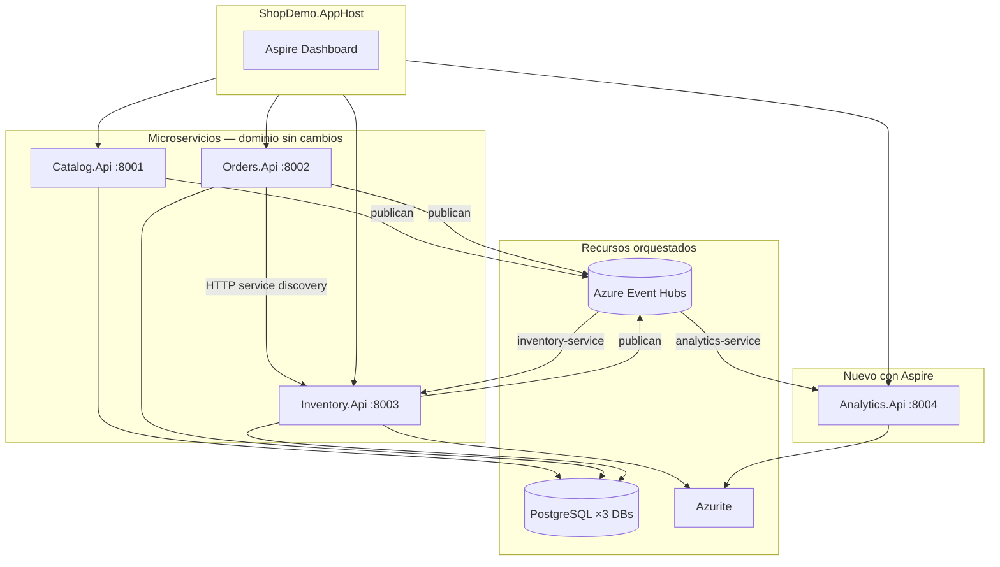

# Documento de Requerimientos — Analytics + .NET Aspire (ShopDemo)

| Campo | Detalle |
|:------|:--------|
| **Empresa** | Lite Thinking |
| **Curso** | Microservicios con .NET en Kubernetes y Entornos Multicloud |
| **Instructor** | Lcc. Gilberto Valentino Juárez Sánchez |
| **Contacto** | WhatsApp: +52 5614206660 |
| | E-mail: gilberto.juarez@gmail.com |
| | E-mail: lcc.gilberto.juarez@gmail.com |

**Bounded Context:** Analytics (observador) + Orquestación Aspire  
**Versión:** 1.0  
**Estado:** Implementado

---

## 1. Propósito

Definir los requerimientos para:

1. Integrar **.NET Aspire** como capa de orquestación local de ShopDemo.
2. Agregar el microservicio **ShopDemo.Analytics.Api**, que **observa** el bus de eventos sin modificar Catalog, Orders ni Inventory.

Aspire centraliza el arranque de los 4 APIs, PostgreSQL, Azurite y la configuración de Azure Event Hubs. Analytics demuestra el patrón **fan-out**: un mismo evento consumido por múltiples consumer groups.

---

## 2. Decisiones de diseño (confirmadas)

| # | Decisión | Valor elegido |
|---|---|---|
| D-01 | Nombre del 4.º servicio | `ShopDemo.Analytics.Api` |
| D-02 | Fase 1 en APIs existentes | **No** modificar `Program.cs` de Catalog, Orders ni Inventory |
| D-03 | Event Hubs en desarrollo Aspire | **Habilitado desde el inicio** con connection string real en AppHost |
| D-04 | Azure Container Apps / `azd up` | **Fuera de alcance** — solo documentar para fase posterior |
| D-05 | Puerto Analytics | `8004` |
| D-06 | Consumer group Analytics | `analytics-service` (distinto de `inventory-service`) |

---

## 3. Contexto en la plataforma



### Flujo de demostración en clase

| Paso | Acción | Resultado esperado |
|---|---|---|
| 1 | `dotnet run --project Aspire/ShopDemo.AppHost` | Dashboard + 4 APIs + Postgres + Azurite |
| 2 | `POST /api/products` (Catalog) | Evento `ProductCreated` en Event Hubs |
| 3 | Inventory (automático) | Stock auto-registrado vía `inventory-service` |
| 4 | `GET /api/analytics/events` | Analytics lista el mismo evento |
| 5 | Crear y confirmar pedido (Orders) | Analytics lista eventos de Orders e Inventory |

---

## 4. Objetivos de aprendizaje

1. Comprender el rol del **App Host** de .NET Aspire.
2. Orquestar microservicios existentes **sin alterar** su dominio ni application layer.
3. Centralizar configuración (`EventHubs__*`, connection strings, service discovery).
4. Implementar un **consumidor read-only** de Event Hubs con consumer group independiente.
5. Observar **fan-out**: Inventory y Analytics procesan el mismo stream con grupos distintos.
6. Usar **ServiceDefaults** solo en el servicio nuevo (Analytics).

---

## 5. Alcance MVP

### 5.1 ShopDemo.AppHost

| ID | Requerimiento |
|---|---|
| RF-AH-01 | Orquestar Catalog, Orders, Inventory y Analytics como proyectos referenciados |
| RF-AH-02 | Provisionar PostgreSQL con 3 bases: `ShopDemoCatalog`, `ShopDemoOrders`, `ShopDemoInventory` |
| RF-AH-03 | Provisionar Azurite (emulador Azure Storage) para checkpoints de Event Hubs |
| RF-AH-04 | Inyectar `EventHubs__Enabled=true` y connection string a los 4 servicios |
| RF-AH-05 | Configurar service discovery: Orders recibe `InventoryApi__BaseUrl` automáticamente |
| RF-AH-06 | Exponer puertos 8001–8004 sin colisión |
| RF-AH-07 | Leer connection string de Event Hubs desde `appsettings` o user secrets del AppHost |

### 5.2 ShopDemo.ServiceDefaults

| ID | Requerimiento |
|---|---|
| RF-SD-01 | Proveer `AddServiceDefaults()` con OpenTelemetry, health checks y service discovery |
| RF-SD-02 | Proveer `MapDefaultEndpoints()` para `/health` y `/alive` en Development |
| RF-SD-03 | Usado **solo** por Analytics.Api en fase 1 |

### 5.3 ShopDemo.Analytics.Api

| ID | Requerimiento |
|---|---|
| RF-AN-01 | Consumir Event Hubs con consumer group `analytics-service` |
| RF-AN-02 | Persistir checkpoints en contenedor blob `analytics-checkpoints` (Azurite) |
| RF-AN-03 | Deserializar `IntegrationEventEnvelope` de `ShopDemo.Shared` |
| RF-AN-04 | Almacenar últimos N eventos en memoria (ring buffer, máx. 100) |
| RF-AN-05 | `GET /api/analytics/events?take=50` — listar eventos observados |
| RF-AN-06 | `GET /api/analytics/health` — estado del servicio |
| RF-AN-07 | Swagger en Development |
| RF-AN-08 | **No** ejecutar lógica de negocio ni modificar otros servicios |

### Fuera de alcance (fase actual)

- Modificar `Program.cs` de Catalog, Orders, Inventory con `AddServiceDefaults()`
- Azure Container Apps, `azd up`, publicación a Kubernetes
- Persistencia durable de eventos (solo memoria en MVP)
- Autenticación / autorización en Analytics

---

## 6. Lenguaje ubicuo

| Término | Definición |
|---|---|
| **App Host** | Proyecto ejecutable Aspire que declara y arranca todos los recursos |
| **Observador** | Servicio que lee eventos sin producir efectos de negocio |
| **Consumer group** | Grupo de consumidores Event Hubs con offset independiente |
| **Fan-out** | Un evento publicado, múltiples consumidores en paralelo |
| **Checkpoint** | Marca de progreso del consumidor en Azure Blob Storage |
| **Service discovery** | Resolución automática de URLs entre servicios (Aspire) |
| **Ring buffer** | Cola circular en memoria que descarta eventos antiguos |

---

## 7. Contratos técnicos

### 7.1 Envelope de integración (existente)

```csharp
public sealed record IntegrationEventEnvelope(
    string EventType,
    Guid EventId,
    DateTimeOffset OccurredOn,
    string Source,
    string PayloadJson);
```

Ubicación: `ShopDemo.Shared/Messaging/IntegrationEventEnvelope.cs`

### 7.2 Configuración Event Hubs (inyectada por AppHost)

| Variable | Catalog / Orders | Inventory | Analytics |
|---|---|---|---|
| `EventHubs__Enabled` | `true` | `true` | `true` |
| `EventHubs__ConnectionString` | desde AppHost | desde AppHost | desde AppHost |
| `EventHubs__EventHubName` | `shopdemo-events` | `shopdemo-events` | `shopdemo-events` |
| `EventHubs__ConsumerGroup` | — | `inventory-service` | `analytics-service` |
| `EventHubs__CheckpointStorageConnectionString` | — | Azurite | Azurite |
| `EventHubs__CheckpointContainerName` | — | `inventory-checkpoints` | `analytics-checkpoints` |

### 7.3 Endpoints Analytics

| Método | Ruta | Descripción |
|---|---|---|
| GET | `/api/analytics/events?take=50` | Últimos eventos observados (1–100) |
| GET | `/api/analytics/health` | Estado y contador de eventos en buffer |
| GET | `/health` | Health check Aspire (Development) |
| GET | `/swagger` | Documentación OpenAPI |

### 7.4 Respuesta `GET /api/analytics/events`

```json
{
  "totalBuffered": 12,
  "returned": 12,
  "events": [
    {
      "eventType": "ProductCreatedDomainEvent",
      "eventId": "3fa85f64-5717-4562-b3fc-2c963f66afa6",
      "occurredOn": "2026-06-11T10:00:00Z",
      "source": "catalog",
      "payloadJson": "{ ... }",
      "receivedAt": "2026-06-11T10:00:01Z"
    }
  ]
}
```

---

## 8. Estructura de proyectos

```
Aspire/
├── ShopDemo.AppHost/              ← Orquestador
├── ShopDemo.ServiceDefaults/      ← Extensiones compartidas Aspire
└── ShopDemo.Analytics.Api/        ← Observador Event Hubs
    ├── Controllers/
    ├── Messaging/
    └── Services/
```

Los proyectos Catalog, Orders e Inventory **permanecen en sus carpetas actuales** sin moverse.

---

## 9. Criterios de aceptación

| # | Criterio |
|---|---|
| CA-01 | `dotnet build ShopDemo.slnx` compila sin errores |
| CA-02 | AppHost levanta 4 APIs visibles en Aspire Dashboard |
| CA-03 | Crear producto genera evento visible en Analytics |
| CA-04 | Inventory sigue auto-registrando stock (no regresión) |
| CA-05 | Orders confirma pedido usando Inventory vía service discovery |
| CA-06 | Analytics y Inventory usan consumer groups distintos |
| CA-07 | Los 3 APIs existentes no tienen cambios en Domain/Application |
| CA-08 | Docker Compose por servicio sigue funcionando de forma independiente |

---

## 10. Referencias

- [IMPLEMENTACION-ANALYTICS-ASPIRE.md](./IMPLEMENTACION-ANALYTICS-ASPIRE.md)
- [INTEGRACION-ASPIRE.md](../INTEGRACION-ASPIRE.md)
- [INTEGRACION-AZURE-EVENT-HUBS.md](../INTEGRACION-AZURE-EVENT-HUBS.md)
- [GUIA-ENDPOINTS.md](../GUIA-ENDPOINTS.md)
- [ARQUITECTURA.md](../ARQUITECTURA.md)
