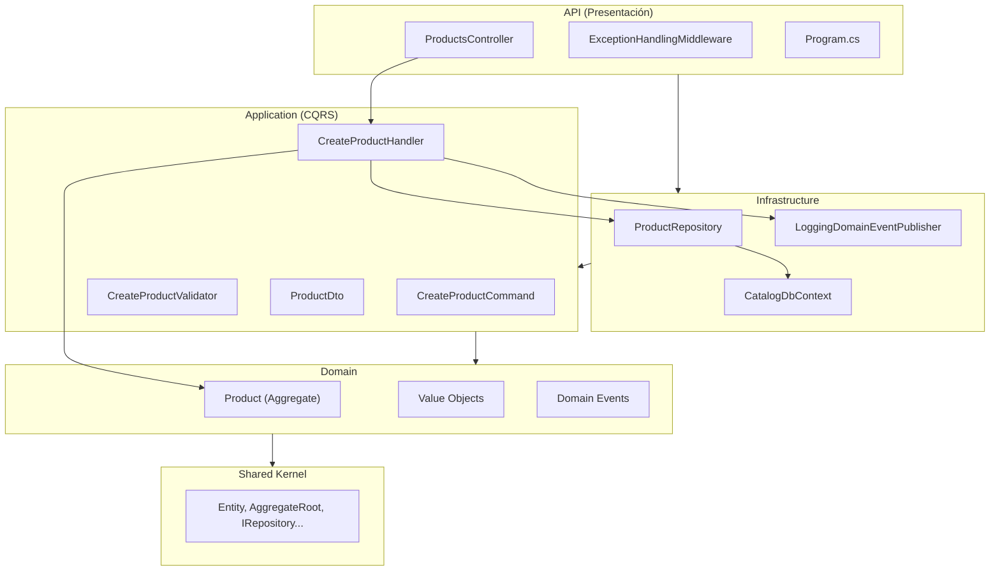
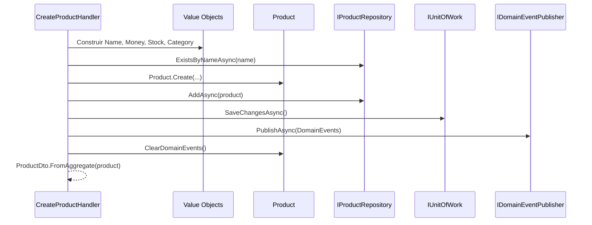

# Documento de Implementación — Microservicio Catalog (ShopDemo)

| Campo | Detalle |
|:------|:--------|
| **Empresa** | Lite Thinking |
| **Curso** | Microservicios con .NET en Kubernetes y Entornos Multicloud |
| **Instructor** | Lcc. Gilberto Valentino Juárez Sánchez |
| **Contacto** | WhatsApp: +52 5614206660 |
| | E-mail: gilberto.juarez@gmail.com |
| | E-mail: lcc.gilberto.juarez@gmail.com |

**Tipo:** Guía de implementación con el código fuente actual del repositorio  
**Versión:** 1.0  
**Prerequisito:** Proyecto `ShopDemo.Shared` disponible

> Este documento describe paso a paso la implementación **real** del microservicio Catalog. Los alumnos deben seguir `REQUERIMIENTOS-CATALOG.md` y usar este documento para validar su solución contra el código en `Catalog/`.

---

## Índice

1. [Visión Clean Architecture](#1-visión-clean-architecture)
2. [Configuración inicial de proyectos](#2-configuración-inicial-de-proyectos)
3. [Shared Kernel](#3-shared-kernel)
4. [Capa Domain](#4-capa-domain)
5. [Capa Application](#5-capa-application)
6. [Capa Infrastructure](#6-capa-infrastructure)
7. [Capa API](#7-capa-api)
8. [Docker](#8-docker)
9. [Migraciones y ejecución](#9-migraciones-y-ejecución)
10. [Pruebas manuales](#10-pruebas-manuales)

---

## 1. Visión Clean Architecture

Catalog organiza el código en capas concéntricas. Las dependencias apuntan siempre hacia el dominio:



**Diferencia clave con Inventory:** Catalog usa **MediatR** para CQRS; Inventory usa puertos hexagonales sin mediador.

---

## 2. Configuración inicial de proyectos

### 2.1 Estructura de carpetas

```
Catalog/
├── ShopDemo.Catalog.Domain/
├── ShopDemo.Catalog.Application/
├── ShopDemo.Catalog.Infraestructure/
└── ShopDemo.Catalog.Api/
```

### 2.2 Crear proyectos y referencias

```bash
cd I:\Curso\ShopDemo

dotnet new classlib -n ShopDemo.Catalog.Domain -o Catalog/ShopDemo.Catalog.Domain -f net10.0
dotnet new classlib -n ShopDemo.Catalog.Application -o Catalog/ShopDemo.Catalog.Application -f net10.0
dotnet new classlib -n ShopDemo.Catalog.Infraestructure -o Catalog/ShopDemo.Catalog.Infraestructure -f net10.0
dotnet new webapi -n ShopDemo.Catalog.Api -o Catalog/ShopDemo.Catalog.Api -f net10.0

# Domain
dotnet add Catalog/ShopDemo.Catalog.Domain/ShopDemo.Catalog.Domain.csproj reference ShopDemo.Shared/ShopDemo.Shared.csproj

# Application
dotnet add Catalog/ShopDemo.Catalog.Application/ShopDemo.Catalog.Application.csproj reference Catalog/ShopDemo.Catalog.Domain/ShopDemo.Catalog.Domain.csproj
dotnet add Catalog/ShopDemo.Catalog.Application/ShopDemo.Catalog.Application.csproj package MediatR
dotnet add Catalog/ShopDemo.Catalog.Application/ShopDemo.Catalog.Application.csproj package FluentValidation
dotnet add Catalog/ShopDemo.Catalog.Application/ShopDemo.Catalog.Application.csproj package FluentValidation.DependencyInjectionExtensions

# Infrastructure
dotnet add Catalog/ShopDemo.Catalog.Infraestructure/ShopDemo.Catalog.Infraestructure.csproj reference Catalog/ShopDemo.Catalog.Application/ShopDemo.Catalog.Application.csproj
dotnet add Catalog/ShopDemo.Catalog.Infraestructure/ShopDemo.Catalog.Infraestructure.csproj reference Catalog/ShopDemo.Catalog.Domain/ShopDemo.Catalog.Domain.csproj
dotnet add Catalog/ShopDemo.Catalog.Infraestructure/ShopDemo.Catalog.Infraestructure.csproj reference ShopDemo.Shared/ShopDemo.Shared.csproj
dotnet add Catalog/ShopDemo.Catalog.Infraestructure/ShopDemo.Catalog.Infraestructure.csproj package Microsoft.EntityFrameworkCore
dotnet add Catalog/ShopDemo.Catalog.Infraestructure/ShopDemo.Catalog.Infraestructure.csproj package Npgsql.EntityFrameworkCore.PostgreSQL

# Api
dotnet add Catalog/ShopDemo.Catalog.Api/ShopDemo.Catalog.Api.csproj reference Catalog/ShopDemo.Catalog.Infraestructure/ShopDemo.Catalog.Infraestructure.csproj
dotnet add Catalog/ShopDemo.Catalog.Api/ShopDemo.Catalog.Api.csproj reference Catalog/ShopDemo.Catalog.Application/ShopDemo.Catalog.Application.csproj
dotnet add Catalog/ShopDemo.Catalog.Api/ShopDemo.Catalog.Api.csproj package Swashbuckle.AspNetCore
dotnet add Catalog/ShopDemo.Catalog.Api/ShopDemo.Catalog.Api.csproj package Microsoft.EntityFrameworkCore.Design
```

### 2.3 Agregar a la solución

En `ShopDemo.slnx`, carpeta `/Catalog/` con los cuatro proyectos.

---

## 3. Shared Kernel

**Ubicación:** `ShopDemo.Shared/Domain/`

Clases base reutilizadas por Catalog, Orders e Inventory.

| Clase / Interfaz | Explicación |
|---|---|
| `Entity<TId>` | Entidad con identidad tipada y comparación por `Id` |
| `AggregateRoot<TId>` | Extiende `Entity`; gestiona `DomainEvents`, `RaiseDomainEvent()`, `ClearDomainEvents()` |
| `ValueObject` | Base para objetos de valor con igualdad por componentes |
| `IDomainEvent` | Contrato: `EventId`, `OccurredOn` (`DateTimeOffset`) |
| `IRepository<TAggregate, TId>` | CRUD genérico sobre agregados |
| `IUnitOfWork` | Abstracción transaccional: `SaveChangesAsync()` |

---

## 4. Capa Domain

El dominio no depende de EF Core, MediatR ni ASP.NET. Solo referencia `ShopDemo.Shared`.

### 4.1 Value Objects

#### `Money`

**Archivo:** `Catalog/ShopDemo.Catalog.Domain/ValueObjects/Money.cs`

**Explicación:** Encapsula monto y moneda ISO de 3 letras. Valida montos no negativos y ofrece operaciones `Add`, `Subtract`, `Multiply` con guard de misma moneda.

```csharp
public sealed class Money : ValueObject
{
    public decimal Amount { get; }
    public string Currency { get; }
    public static Money Of(decimal amount, string currency = "MXN") { /* validaciones */ }
}
```

#### `ProductName`

**Explicación:** Nombre del producto entre 3 y 200 caracteres. Igualdad case-insensitive. Conversión implícita a `string` para comodidad.

#### `StockLevel`

**Explicación:** Unidades de inventario en catálogo. Métodos inmutables `Increase`/`Decrease` con validación de stock insuficiente. `IsAvailableFor(quantity)` para consultas.

#### `Category`

**Explicación:** Catálogo cerrado de categorías válidas (Electronics, Clothing, Food, Books, Sports). Usa `HashSet` en lugar de enum para extensibilidad futura.

### 4.2 Agregado `Product`

**Archivo:** `Catalog/ShopDemo.Catalog.Domain/Aggregates/Product.cs`

**Explicación:** Agregado raíz del bounded context. Toda la lógica de negocio de productos vive aquí.

| Método | Qué hace |
|---|---|
| `Create(...)` | Factory method — única forma de instanciar; emite `ProductCreatedDomainEvent` |
| `UpdateDetails(...)` | Actualiza nombre/descripción si el producto está activo |
| `ChangePrice(...)` | Cambia precio; no-op si es igual; emite evento de cambio |
| `ReplenishStock(units)` | Aumenta stock; emite `StockReplenishedDomainEvent` |
| `DeductStock(units)` | Reduce stock vía `StockLevel.Decrease`; emite `StockDepletedDomainEvent` si llega a 0 |
| `Deactivate()` | Marca inactivo (idempotente); emite `ProductDeactivatedDomainEvent` |
| `HasSufficientStock(qty)` | Delega a `StockLevel.IsAvailableFor` |

**Guard interno:** `GuardIsActive()` impide modificar productos desactivados.

### 4.3 Domain Events

**Ubicación:** `Catalog/ShopDemo.Catalog.Domain/Events/`

| Evento | Datos relevantes |
|---|---|
| `ProductCreatedDomainEvent` | ProductId, nombre, precio, moneda, stock inicial, categoría |
| `ProductPriceChangedDomainEvent` | Precio anterior/nuevo, moneda |
| `StockReplenishedDomainEvent` | Unidades añadidas, total |
| `StockDepletedDomainEvent` | ProductId, nombre |
| `ProductDeactivatedDomainEvent` | ProductId, nombre |

Todos implementan `IDomainEvent` con `EventId` y `OccurredOn` auto-generados.

### 4.4 `IProductRepository`

**Archivo:** `Catalog/ShopDemo.Catalog.Domain/Repositories/IProductRepository.cs`

**Explicación:** Contrato de persistencia definido en el dominio (inversión de dependencias). Extiende `IRepository<Product, Guid>` con consultas específicas: por categoría, activos paginados, conteo y verificación de nombre duplicado.

### 4.5 `ProductDomainException`

**Explicación:** Excepción semántica para violaciones de reglas de negocio (producto desactivado, unidades inválidas, etc.). La API la mapea a HTTP 400.

---

## 5. Capa Application

Orquesta flujos sin contener lógica de negocio. Usa **MediatR** para CQRS y **FluentValidation** para validación de entrada.

### 5.1 `CreateProductCommand`

**Archivo:** `Catalog/ShopDemo.Catalog.Application/Commands/CreateProduct/CreateProductCommand.cs`

**Explicación:** Record inmutable que implementa `IRequest<ProductDto>`. Es el contrato de entrada del comando CreateProduct.

```csharp
public sealed record CreateProductCommand(
    string Name,
    string Description,
    decimal Price,
    string Currency,
    int Stock,
    string Category
) : IRequest<ProductDto>;
```

### 5.2 `CreateProductValidator`

**Explicación:** Valida la **forma** del comando (campos requeridos, rangos). Las reglas de **negocio** profundas están en los Value Objects del dominio. Separación deliberada de responsabilidades.

### 5.3 `ValidationBehavior<TRequest, TResponse>`

**Archivo:** `Catalog/ShopDemo.Catalog.Application/Common/Behaviors/ValidationBehavior.cs`

**Explicación:** Pipeline behavior de MediatR que ejecuta todos los validadores FluentValidation antes del handler. Si hay errores, lanza `ValidationException` (mapeada a 400 en el middleware).

### 5.4 `CreateProductHandler`

**Archivo:** `Catalog/ShopDemo.Catalog.Application/Commands/CreateProduct/CreateProductHandler.cs`

**Explicación:** Orquesta el flujo completo sin lógica de negocio:



Pasos del handler:

1. Construir Value Objects (el dominio valida).
2. Verificar duplicados por nombre → `409` si existe.
3. Crear agregado vía `Product.Create`.
4. Persistir con repositorio + unit of work.
5. Publicar domain events.
6. Retornar `ProductDto` (nunca el agregado).

### 5.5 `ProductDto`

**Archivo:** `Catalog/ShopDemo.Catalog.Application/DTOs/ProductDto.cs`

**Explicación:** Proyección de lectura inmutable. `FromAggregate()` centraliza el mapeo fuera del agregado para no contaminar el dominio.

### 5.6 `IDomainEventPublisher`

**Archivo:** `Catalog/ShopDemo.Catalog.Application/Ports/IDomainEventPublisher.cs`

**Explicación:** Puerto hacia infraestructura de mensajería. Application define el contrato; Infrastructure lo implementa (en desarrollo: logging; en producción: Event Hubs).

---

## 6. Capa Infrastructure

Implementa los contratos definidos en Domain y Application.

### 6.1 `CatalogDbContext`

**Archivo:** `Catalog/ShopDemo.Catalog.Infraestructure/Persistence/CatalogDbContext.cs`

**Explicación:** DbContext de EF Core. Expone `DbSet<Product>` y aplica configuraciones desde el ensamblado.

### 6.2 `ProductConfiguration`

**Archivo:** `Catalog/ShopDemo.Catalog.Infraestructure/Persistence/Configurations/ProductConfiguration.cs`

**Explicación:** Mapea el agregado `Product` a la tabla `products`. Los Value Objects se persisten como **owned types**:

| Value Object | Columnas |
|---|---|
| `ProductName` | `name` |
| `Money` | `price_amount`, `price_currency` |
| `StockLevel` | `stock_units` |
| `Category` | `category` |

`DomainEvents` se ignora (`builder.Ignore`) — no se persisten.

### 6.3 `ProductRepository`

**Explicación:** Implementación EF Core de `IProductRepository`. Incluye consultas por categoría, productos activos paginados, conteo y verificación de nombre (case-insensitive).

### 6.4 `UnitOfWork`

**Explicación:** Implementa `IUnitOfWork` delegando `SaveChangesAsync` al `CatalogDbContext`.

### 6.5 `LoggingDomainEventPublisher`

**Archivo:** `Catalog/ShopDemo.Catalog.Infraestructure/Messaging/LoggingDomainEventPublisher.cs`

**Explicación:** Adaptador de desarrollo que registra eventos en log. Sustituible por Azure Event Hubs sin cambiar handlers.

### 6.6 `DatabaseInitializer`

**Explicación:** Verifica si la base de datos `ShopDemoCatalog` existe; si no, la crea conectándose a `postgres`. Útil cuando PostgreSQL ya corre pero la BD aún no existe.

### 6.7 `DependencyInjection`

**Archivo:** `Catalog/ShopDemo.Catalog.Infraestructure/DependencyInjection.cs`

**Explicación:** Método de extensión `AddCatalogInfrastructure` que registra:

- `CatalogDbContext` con Npgsql
- `IProductRepository` → `ProductRepository`
- `IUnitOfWork` → `UnitOfWork`
- `IDomainEventPublisher` → `LoggingDomainEventPublisher`

---

## 7. Capa API

Punto de entrada HTTP. Compone DI y expone endpoints REST.

### 7.1 `ProductsController`

**Archivo:** `Catalog/ShopDemo.Catalog.Api/Controllers/ProductsController.cs`

**Explicación:** Controller delgado que delega a MediatR. Solo expone `POST /api/products` en el MVP actual.

```csharp
[ApiController]
[Route("api/products")]
public sealed class ProductsController(IMediator mediator) : ControllerBase
{
    [HttpPost]
    public async Task<ActionResult<ProductDto>> Create(
        [FromBody] CreateProductCommand command, CancellationToken cancellationToken)
    {
        var product = await mediator.Send(command, cancellationToken);
        return CreatedAtAction(nameof(Create), new { id = product.Id }, product);
    }
}
```

### 7.2 `ExceptionHandlingMiddleware`

**Archivo:** `Catalog/ShopDemo.Catalog.Api/Middleware/ExceptionHandlingMiddleware.cs`

**Explicación:** Mapeo transversal de excepciones a Problem Details (`application/problem+json`):

| Excepción | HTTP |
|---|---|
| `ValidationException` | 400 |
| `ProductDomainException` | 400 |
| `InvalidOperationException` (nombre duplicado) | 409 |
| `KeyNotFoundException` | 404 |
| Otras | 500 |

### 7.3 `Program.cs`

**Archivo:** `Catalog/ShopDemo.Catalog.Api/Program.cs`

**Explicación:** Composición raíz (DI):

1. Controllers + Swagger
2. MediatR con `ValidationBehavior`
3. FluentValidation desde ensamblado
4. `AddCatalogInfrastructure`
5. `DatabaseInitializer.EnsureCreatedAsync`
6. `dbContext.Database.MigrateAsync()`
7. Middleware de excepciones
8. MapControllers

---

## 8. Docker

### 8.1 `docker-compose.yml`

**Ubicación:** `Catalog/ShopDemo.Catalog.Api/docker-compose.yml`

| Servicio | Puerto host | Descripción |
|---|---|---|
| `catalog-db` | 5433 | PostgreSQL `ShopDemoCatalog` |
| `catalog-service` | 8001 | API Catalog |

Healthcheck en PostgreSQL antes de levantar la API.

### 8.2 `Dockerfile`

Build multi-stage (.NET 10) con contexto en carpeta `Catalog/`. Usuario no-root (`USER app`).

### 8.3 Script init PostgreSQL

`docker/postgres/init/` — permisos en schema `public` para el usuario `ShopDemo`.

---

## 9. Migraciones y ejecución

### 9.1 Crear migración (ya generada en el repo)

```bash
cd Catalog/ShopDemo.Catalog.Api
dotnet ef migrations add InitialCreate \
  --project ../ShopDemo.Catalog.Infraestructure/ShopDemo.Catalog.Infraestructure.csproj \
  --output-dir Persistence/Migrations
```

### 9.2 Levantar con Docker

```bash
cd Catalog/ShopDemo.Catalog.Api
docker compose up --build
```

- API: `http://localhost:8001`
- Swagger: `http://localhost:8001/swagger`
- PostgreSQL: `localhost:5433`

### 9.3 Ejecutar local (sin Docker)

1. PostgreSQL en puerto **5433** con BD `ShopDemoCatalog`.
2. `dotnet run --project Catalog/ShopDemo.Catalog.Api`
3. Swagger: `http://localhost:5260/swagger` (según `launchSettings.json`)

---

## 10. Pruebas manuales

### Crear producto

```http
POST http://localhost:8001/api/products
Content-Type: application/json

{
  "name": "Teclado Mecánico",
  "description": "RGB, switches azules",
  "price": 89.99,
  "currency": "USD",
  "stock": 50,
  "category": "Electronics"
}
```

**Respuesta esperada:** `201 Created` con `ProductDto` incluyendo `id` generado.

### Validación — nombre corto

```http
POST http://localhost:8001/api/products
Content-Type: application/json

{
  "name": "AB",
  "description": "Test",
  "price": 10,
  "currency": "USD",
  "stock": 5,
  "category": "Electronics"
}
```

**Respuesta esperada:** `400 Bad Request` con detalle de validación.

### Duplicado — mismo nombre

Repetir el POST del primer producto.

**Respuesta esperada:** `409 Conflict` — `"A product with name 'Teclado Mecánico' already exists."`

### Verificar en PostgreSQL

```sql
SELECT id, name, price_amount, price_currency, stock_units, category, is_active
FROM products;
```

### Flujo integrado con Inventory y Orders

Tras crear el producto, usar el `id` retornado para:

1. `POST http://localhost:8003/api/inventory/stock` — registrar stock
2. `POST http://localhost:8002/api/orders` — crear pedido con ese `productId`
3. `POST http://localhost:8002/api/orders/{id}/confirm` — confirmar y reservar stock

---

## Resumen de clases implementadas

| Clase / Interfaz | Capa | Rol |
|---|---|---|
| `Product` | Domain | Agregado raíz |
| `Money`, `ProductName`, `StockLevel`, `Category` | Domain | Value Objects |
| `ProductCreatedDomainEvent` (+ otros) | Domain | Domain Events |
| `IProductRepository` | Domain | Contrato de persistencia |
| `ProductDomainException` | Domain | Errores de negocio |
| `CreateProductCommand` | Application | Comando CQRS |
| `CreateProductValidator` | Application | Validación de entrada |
| `ValidationBehavior` | Application | Pipeline MediatR |
| `CreateProductHandler` | Application | Orquestación del flujo |
| `ProductDto` | Application | DTO de salida |
| `IDomainEventPublisher` | Application | Puerto de mensajería |
| `CatalogDbContext` | Infrastructure | EF Core |
| `ProductConfiguration` | Infrastructure | Mapeo EF |
| `ProductRepository` | Infrastructure | Repositorio EF |
| `UnitOfWork` | Infrastructure | Transacciones |
| `LoggingDomainEventPublisher` | Infrastructure | Publicador de eventos |
| `DatabaseInitializer` | Infrastructure | Creación de BD |
| `DependencyInjection` | Infrastructure | Registro DI |
| `ProductsController` | Api | Endpoint REST |
| `ExceptionHandlingMiddleware` | Api | Manejo de errores |
| `Program.cs` | Api | Composición raíz |

---

## Extensiones sugeridas (no implementadas en API)

El dominio ya expone comportamientos adicionales listos para nuevos comandos CQRS:

| Comando sugerido | Método de dominio |
|---|---|
| `UpdateProductCommand` | `UpdateDetails` |
| `ChangePriceCommand` | `ChangePrice` |
| `ReplenishStockCommand` | `ReplenishStock` |
| `DeactivateProductCommand` | `Deactivate` |
| `GetProductByIdQuery` | Lectura vía repositorio → `ProductDto` |
| `GetActiveProductsQuery` | `GetActiveProductsAsync` paginado |

La carpeta `Application/Queries/` está preparada para las consultas.
