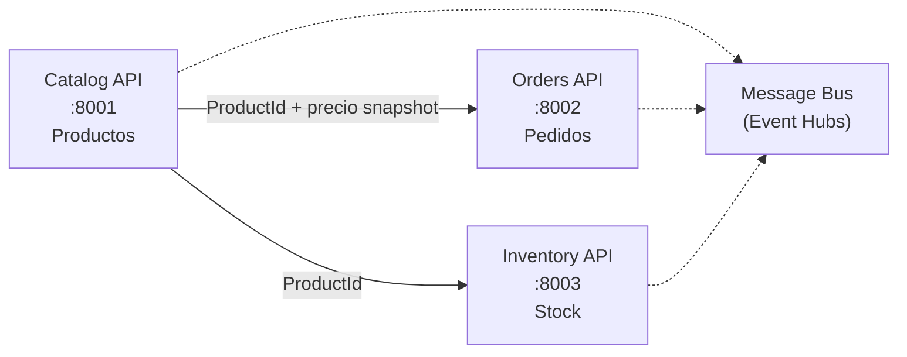

# Documento de Requerimientos — Microservicio Catalog (ShopDemo)

| Campo | Detalle |
|:------|:--------|
| **Empresa** | Lite Thinking |
| **Curso** | Microservicios con .NET en Kubernetes y Entornos Multicloud |
| **Instructor** | Lcc. Gilberto Valentino Juárez Sánchez |
| **Contacto** | WhatsApp: +52 5614206660 |
| | E-mail: gilberto.juarez@gmail.com |
| | E-mail: lcc.gilberto.juarez@gmail.com |

**Arquitectura:** Clean Architecture + CQRS (MediatR)  
**Bounded Context:** Catalog  
**Versión:** 1.0  
**Fecha:** Junio 2026

**Historias de usuario:** [HISTORIAS-USUARIO-CATALOG.md](./HISTORIAS-USUARIO-CATALOG.md)

---

## 1. Propósito

Definir los requerimientos del microservicio **Catalog**, responsable de la **gestión del catálogo de productos** en la plataforma ShopDemo. Es el **primer bounded context** de referencia del curso y sirve de base arquitectónica para Orders e Inventory.

Catalog modela productos como agregados DDD, expone una API REST independiente y persiste en PostgreSQL dedicado.

---

## 2. Objetivos de aprendizaje

Al completar esta implementación, el alumno será capaz de:

1. Modelar un **Aggregate Root** (`Product`) con Value Objects y Domain Events.
2. Aplicar **Clean Architecture** con dependencias hacia el dominio.
3. Implementar **CQRS** con MediatR (comandos y consultas).
4. Validar entrada con **FluentValidation** en la capa de aplicación.
5. Persistir agregados con **EF Core + PostgreSQL** sin contaminar el dominio.
6. Publicar **Domain Events** mediante un puerto de infraestructura.
7. Exponer endpoints REST documentados con **Swagger**.
8. Containerizar el servicio con **Docker Compose**.

---

## 3. Contexto en la plataforma



| Microservicio | Base de datos | Puerto API | Puerto PostgreSQL (host) |
|---|---|---|---|
| **Catalog** | **`ShopDemoCatalog`** | **`8001`** | **`5433`** |
| Orders | `ShopDemoOrders` | `8002` | `5434` |
| Inventory | `ShopDemoInventory` | `8003` | `5435` |

> **Nota:** Catalog usa el puerto **5433** en el host para no colisionar con PostgreSQL local (5432).

### Flujo de negocio integrado (ejercicio)

| Paso | Servicio | Acción |
|---|---|---|
| 1 | **Catalog** | `POST /api/products` → crea producto con `ProductId` |
| 2 | **Inventory** | `POST /api/inventory/stock` → registra stock para ese `ProductId` |
| 3 | **Orders** | `POST /api/orders` → crea pedido con líneas que referencian `ProductId` |
| 4 | **Orders** | `POST /api/orders/{id}/confirm` → reserva stock en Inventory |
| 5 | **Inventory** | `GET /api/inventory/{productId}` → consulta unidades disponibles |

---

## 4. Alcance MVP

### 4.1 Dentro del alcance (implementado en el curso)

| ID | Requerimiento | Estado |
|---|---|---|
| RF-01 | Crear un producto (`CreateProduct`) vía `POST /api/products` | ✅ Implementado |
| RF-02 | Modelar agregado `Product` con comportamientos de dominio | ✅ Implementado |
| RF-03 | Persistir productos en PostgreSQL con EF Core | ✅ Implementado |
| RF-04 | Publicar Domain Events al crear producto (log en desarrollo) | ✅ Implementado |
| RF-05 | Validar entrada con FluentValidation | ✅ Implementado |
| RF-06 | Documentar API con Swagger en Development | ✅ Implementado |
| RF-07 | Desplegar con Docker Compose (API + PostgreSQL) | ✅ Implementado |
| RF-08 | Aplicar migraciones EF Core al iniciar | ✅ Implementado |
| RF-09 | Manejo transversal de errores (Problem Details) | ✅ Implementado |

### 4.2 Preparado en dominio, pendiente de exponer en API

| ID | Requerimiento | Estado |
|---|---|---|
| RF-10 | Actualizar detalles de producto (`UpdateDetails`) | Dominio listo |
| RF-11 | Cambiar precio (`ChangePrice`) | Dominio listo |
| RF-12 | Reabastecer stock en catálogo (`ReplenishStock`) | Dominio listo |
| RF-13 | Descontar stock (`DeductStock`) | Dominio listo |
| RF-14 | Desactivar producto (`Deactivate`) | Dominio listo |
| RF-15 | Consultar productos (queries CQRS) | Carpeta `Queries/` preparada |

### 4.3 Fuera de alcance (fases futuras)

- Azure Event Hubs real
- Outbox Pattern completo
- .NET Aspire AppHost
- Kubernetes manifests
- Sincronización automática Catalog → Inventory vía eventos

---

## 5. Lenguaje ubicuo (Ubiquitous Language)

| Término | Definición | No usar |
|---|---|---|
| **Product** | Entidad de catálogo; agregado raíz | `Item`, `SKU` |
| **ProductName** | Nombre validado del producto (3–200 caracteres) | `string name` suelto |
| **Money** | Precio con monto y moneda ISO 3 letras | `decimal price` |
| **StockLevel** | Unidades disponibles en catálogo | `int stock` |
| **Category** | Categoría de producto (catálogo cerrado) | `enum` expuesto |
| **CreateProduct** | Comando para registrar un nuevo producto | `AddProduct` |
| **Deactivate** | Marcar producto como inactivo (idempotente) | `Delete` |
| **ReplenishStock** | Aumentar unidades de inventario | `AddStock` |
| **DeductStock** | Reducir unidades (validación en Value Object) | `RemoveStock` |

---

## 6. Modelo de dominio requerido

### 6.1 Agregado raíz: `Product`

```
Product (AggregateRoot<Guid>)
├── ProductName        (Value Object)
├── string Description
├── Money Price        (Value Object)
├── StockLevel Stock   (Value Object)
├── Category Category  (Value Object)
├── bool IsActive
├── DateTimeOffset CreatedAt
└── DateTimeOffset? LastUpdatedAt
```

### 6.2 Comportamientos del agregado

| Método | Regla de negocio | Evento generado |
|---|---|---|
| `Create()` | Factory; producto activo por defecto | `ProductCreatedDomainEvent` |
| `UpdateDetails()` | Solo si está activo | — |
| `ChangePrice()` | No-op si precio igual; solo activos | `ProductPriceChangedDomainEvent` |
| `ReplenishStock()` | Unidades > 0; solo activos | `StockReplenishedDomainEvent` |
| `DeductStock()` | Validación en `StockLevel`; solo activos | `StockDepletedDomainEvent` (si stock = 0) |
| `Deactivate()` | Idempotente | `ProductDeactivatedDomainEvent` |
| `HasSufficientStock()` | Consulta delegada al Value Object | — |

### 6.3 Value Objects

| Value Object | Reglas |
|---|---|
| `ProductName` | No vacío; 3–200 caracteres; igualdad case-insensitive |
| `Money` | Monto ≥ 0; moneda ISO 3 letras; operaciones con misma moneda |
| `StockLevel` | Unidades ≥ 0; `Increase`/`Decrease` inmutables |
| `Category` | Valores: Electronics, Clothing, Food, Books, Sports |

### 6.4 Domain Events

| Evento | Cuándo se emite |
|---|---|
| `ProductCreatedDomainEvent` | Al crear producto |
| `ProductPriceChangedDomainEvent` | Al cambiar precio |
| `StockReplenishedDomainEvent` | Al reabastecer stock |
| `StockDepletedDomainEvent` | Stock llega a 0 |
| `ProductDeactivatedDomainEvent` | Al desactivar producto |

### 6.5 Repositorio

`IProductRepository` extiende `IRepository<Product, Guid>` con:

- `GetByCategoryAsync`
- `GetActiveProductsAsync` (paginado)
- `CountActiveAsync`
- `ExistsByNameAsync`

---

## 7. Requerimientos de API

### 7.1 Endpoint implementado

#### `POST /api/products`

Crea un nuevo producto en el catálogo.

**Request body:**

```json
{
  "name": "Teclado Mecánico",
  "description": "RGB, switches azules",
  "price": 89.99,
  "currency": "USD",
  "stock": 50,
  "category": "Electronics"
}
```

**Respuestas:**

| Código | Descripción |
|---|---|
| `201 Created` | Producto creado; body = `ProductDto` |
| `400 Bad Request` | Validación fallida o regla de dominio |
| `409 Conflict` | Nombre de producto duplicado |

**Response body (`ProductDto`):**

```json
{
  "id": "3fa85f64-5717-4562-b3fc-2c963f66afa6",
  "name": "Teclado Mecánico",
  "description": "RGB, switches azules",
  "price": 89.99,
  "currency": "USD",
  "stockUnits": 50,
  "category": "Electronics",
  "isActive": true,
  "createdAt": "2026-06-11T22:59:47+00:00",
  "lastUpdatedAt": null
}
```

### 7.2 Swagger

- Disponible en `/swagger` cuando `ASPNETCORE_ENVIRONMENT=Development`.
- Título: **ShopDemo Catalog API v1**.

---

## 8. Requerimientos técnicos

### 8.1 Estructura de proyectos

```
Catalog/
├── ShopDemo.Catalog.Domain/
├── ShopDemo.Catalog.Application/
├── ShopDemo.Catalog.Infraestructure/
└── ShopDemo.Catalog.Api/
```

### 8.2 Regla de dependencias

```
Api → Infrastructure → Application → Domain → Shared
```

### 8.3 Stack tecnológico

| Componente | Tecnología |
|---|---|
| Runtime | .NET 10 |
| ORM | EF Core 10 + Npgsql |
| CQRS | MediatR 14.1 |
| Validación | FluentValidation 12.1 |
| API docs | Swashbuckle 10.2 |
| Base de datos | PostgreSQL 16 |

### 8.4 Configuración de conexión

```json
{
  "ConnectionStrings": {
    "DefaultConnection": "Host=localhost;Port=5433;Database=ShopDemoCatalog;Username=ShopDemo;Password=ShopDemo123"
  }
}
```

### 8.5 Tabla de persistencia

| Tabla | Descripción |
|---|---|
| `products` | Agregado `Product` con columnas para Value Objects (`name`, `price_amount`, `price_currency`, `stock_units`, `category`) |

---

## 9. Criterios de aceptación

| # | Criterio |
|---|---|
| CA-01 | `POST /api/products` con datos válidos retorna `201` y persiste en PostgreSQL |
| CA-02 | Nombre duplicado retorna `409 Conflict` |
| CA-03 | Datos inválidos (nombre corto, precio negativo) retornan `400` |
| CA-04 | Al crear producto se registra `ProductCreatedDomainEvent` en logs |
| CA-05 | Swagger accesible en Development |
| CA-06 | `docker compose up` levanta API en `:8001` y PostgreSQL en `:5433` |
| CA-07 | Migraciones EF se aplican automáticamente al iniciar la API |
| CA-08 | El dominio no referencia EF Core, MediatR ni ASP.NET |

---

## 10. Referencias

- [IMPLEMENTACION-CATALOG.md](./IMPLEMENTACION-CATALOG.md) — guía paso a paso con código
- [ARQUITECTURA.md](../ARQUITECTURA.md) — visión global de ShopDemo
- [REQUERIMIENTOS-ORDERS.md](../orders/REQUERIMIENTOS-ORDERS.md) — microservicio complementario
- [REQUERIMIENTOS-INVENTORY.md](../inventory/REQUERIMIENTOS-INVENTORY.md) — gestión de stock
