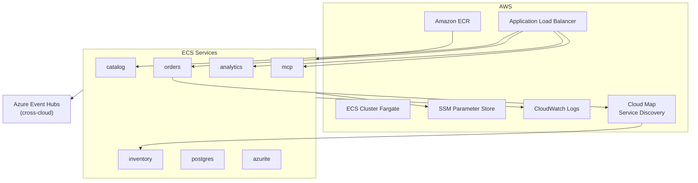

# Anexo — Especificación técnica: Despliegue AWS (ShopDemo)

| Campo | Detalle |
|:------|:--------|
| **Requerimientos de negocio** | [REQUERIMIENTOS-DESPLIEGUE-AWS.md](./REQUERIMIENTOS-DESPLIEGUE-AWS.md) |
| **Capa** | B — Especificación técnica |

**Plataforma:** ECS Fargate · **Registro:** ECR · **Alternativa:** EKS (etapa 11)

---

## 1. Arquitectura de despliegue

---

## 2. Matriz de servicios ECS

| Servicio ECS | Repositorio ECR | ALB público | Service discovery |
|---|---|---|---|
| `shopdemo-catalog` | `shopdemo-catalog` | Sí | No |
| `shopdemo-orders` | `shopdemo-orders` | Sí | No (cliente Inventory) |
| `shopdemo-inventory` | `shopdemo-inventory` | No (lab) | Sí (`inventory.shopdemo.local`) |
| `shopdemo-analytics` | `shopdemo-analytics` | Sí | No |
| `shopdemo-mcp` | `shopdemo-mcp` | Sí | No |
| `shopdemo-postgres` | Docker Hub `postgres:16` | No | Opcional |
| `shopdemo-azurite` | Microsoft Azurite | No | Opcional |

---

## 3. Red y seguridad

| Componente | Configuración lab |
|---|---|
| VPC | 1 VPC, subnets públicas |
| Security Groups | 3 SG: ALB, apps, datos |
| Tráfico ALB → apps | Puerto 8080 |
| apps → postgres | Puerto 5432 |
| apps → azurite | Puerto 10000 |
| Egress | HTTPS 443 hacia Azure Event Hubs |

---

## 4. Secretos SSM

| Parámetro | Uso |
|---|---|
| `/shopdemo/pg-catalog` | Connection string Catalog |
| `/shopdemo/pg-orders` | Connection string Orders |
| `/shopdemo/pg-inventory` | Connection string Inventory |
| `/shopdemo/eh-connection` | Event Hubs connection string |

**Regla técnica:** Host PostgreSQL = IP privada de task Postgres (actualizar tras reinicio).

---

## 5. Scripts y automatización

| Artefacto | Ruta |
|---|---|
| Script principal | `scripts/aws/Deploy-AwsShopDemo.ps1` (`-Mode ECS`) |
| Variables | `scripts/aws/.env.aws` (**no commitear**) |
| Workflow | `.github/workflows/deploy-aws.yml` |
| Task definitions | [ANEXO-TASK-DEFINITIONS-ECS.md](./ANEXO-TASK-DEFINITIONS-ECS.md) |
| Guías | [GUIA-RELEASE-SCRIPT-AWS.md](./GUIA-RELEASE-SCRIPT-AWS.md), [GUIA-RELEASE-PORTAL-AWS.md](./GUIA-RELEASE-PORTAL-AWS.md), [GUIA-RELEASE-CLI-AWS.md](./GUIA-RELEASE-CLI-AWS.md) |

---

## 6. Requerimientos no funcionales (RNF)

| ID | Requerimiento |
|---|---|
| RNF-AW-01 | Primer despliegue: 3–5 horas |
| RNF-AW-02 | Región única (`us-east-1` recomendada) |
| RNF-AW-03 | Egress HTTPS hacia Event Hubs Azure |
| RNF-AW-04 | Documentación dual Consola + CLI |
| RNF-AW-05 | IAM lab: política `ShopDemoLabECS` consolidada |

---

## 7. Criterios de aceptación técnicos (CA-T)

| ID | Criterio |
|---|---|
| CA-T-AW-01 | Servicios ECS en estado `RUNNING` (5 APIs + infra) |
| CA-T-AW-02 | 5 repos ECR con tag `latest` |
| CA-T-AW-03 | Health Catalog vía DNS ALB |
| CA-T-AW-04 | Orders resuelve `inventory.shopdemo.local` |
| CA-T-AW-05 | Analytics lista eventos tras crear producto |
| CA-T-AW-06 | Log groups CloudWatch con logs de APIs |
| CA-T-AW-07 | Workflow `deploy-aws.yml` actualiza ECR/ECS |

---

## 8. Consideración cross-cloud

El código usa `Azure.Messaging.EventHubs`. En ECS:

- Task definitions incluyen `EventHubs__ConnectionString` hacia namespace Azure
- Security groups permiten egress 443
- Latencia cross-cloud aceptable solo para **laboratorio**

---

## 9. Referencias

- [IMPLEMENTACION-DESPLIEGUE-AWS.md](./IMPLEMENTACION-DESPLIEGUE-AWS.md)
- [TEORIA-CONTENEDORES-AWS.md](./TEORIA-CONTENEDORES-AWS.md)
- [PREPARACION-AMBIENTE-AWS.md](./PREPARACION-AMBIENTE-AWS.md)
