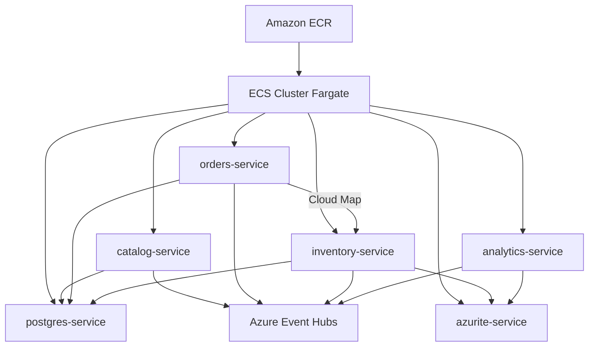

# Teoría — Contenedores en AWS (ShopDemo)

| Campo | Detalle |
|:------|:--------|
| **Empresa** | Lite Thinking |
| **Curso** | Microservicios con .NET en Kubernetes y Entornos Multicloud |
| **Instructor** | Lcc. Gilberto Valentino Juárez Sánchez |
| **Contacto** | WhatsApp: +52 5614206660 |
| | E-mail: gilberto.juarez@gmail.com |
| | E-mail: lcc.gilberto.juarez@gmail.com |

**Tema principal:** Despliegue de microservicios .NET en **Amazon ECS con Fargate**  
**Versión:** 1.0

---

## 1. Equivalencia Azure ↔ AWS (mapa mental)

| Concepto | Azure (esta guía) | AWS (esta guía) |
|---|---|---|
| Registro de imágenes | ACR | **ECR** |
| Ejecución serverless | Container Apps | **ECS Fargate** |
| Grupo de recursos | Resource Group | **CloudFormation stack** / etiquetas en recursos |
| Red privada | VNet + ACA Environment | **VPC + subnets** |
| DNS interno entre servicios | Ingress interno ACA | **Cloud Map** (service discovery) |
| PostgreSQL en contenedor | ACI | **ECS service** + **EFS** |
| Logs | Log Analytics | **CloudWatch Logs** |
| Mensajería en ShopDemo | Event Hubs | **Mismo Event Hubs** (cross-cloud en lab) |

> El código ShopDemo usa **Azure Event Hubs**. En la pista AWS del curso los contenedores en ECS se conectan al mismo namespace de Event Hubs en Azure. En producción multi-cloud real se evaluaría MSK/Kinesis; eso queda fuera del alcance básico.

---

## 2. Amazon ECR (Elastic Container Registry)

ECR almacena imágenes Docker de forma privada en tu cuenta AWS.

| Concepto | Ejemplo ShopDemo |
|---|---|
| Registry URI | `123456789012.dkr.ecr.us-east-1.amazonaws.com` |
| Repository | `shopdemo-catalog` |
| Tag | `latest`, `v1` |

Flujo:

```
docker build → aws ecr get-login-password → docker push → ECS pull
```

---

## 3. Amazon ECS con Fargate

**ECS (Elastic Container Service)** orquesta contenedores. **Fargate** elimina la gestión de servidores EC2.

| Concepto | Descripción |
|---|---|
| **Cluster** | Agrupación lógica (`shopdemo-cluster`) |
| **Task Definition** | Plantilla: imagen, CPU, memoria, env vars, puertos |
| **Service** | Mantiene N tareas corriendo (réplicas) |
| **Task** | Una ejecución concreta de la definición |



---

## 4. VPC y networking

Fargate requiere **subnets** (públicas para ALB, privadas opcionales para tareas).

Para el laboratorio básico:

- VPC con CIDR `10.0.0.0/16`
- 2 subnets públicas en AZ distintas
- Internet Gateway
- Security Groups que permitan:
  - ALB → APIs en puerto 8080
  - APIs → PostgreSQL 5432
  - APIs → Azurite 10000
  - Salida a internet (Event Hubs en Azure)

---

## 5. Application Load Balancer (ALB)

Un **ALB** expone HTTP/HTTPS hacia las APIs públicas.

| Servicio | ¿ALB? | Regla de path/host |
|---|---|---|
| Catalog | Sí | `catalog.<lab-domain>` o path `/catalog` |
| Orders | Sí | `orders.<lab-domain>` |
| Analytics | Sí | `analytics.<lab-domain>` |
| Inventory | Preferible **interno** | Solo Cloud Map (Orders lo resuelve) |

En lab simple se pueden crear **3 ALB** (uno por API pública) o **1 ALB** con reglas por host header.

---

## 6. AWS Cloud Map (service discovery)

Orders necesita la URL de Inventory sin hardcodear IP.

**Cloud Map** registra el nombre `inventory.shopdemo.local` → IP de la tarea Inventory.

Variable en Orders:

```
InventoryApi__BaseUrl=http://inventory.shopdemo.local:8080
```

(o el DNS que registre el namespace de Cloud Map)

---

## 7. PostgreSQL en contenedor (ECS + EFS)

Para el enfoque **todo en contenedores**:

- Task definition con imagen `postgres:16-alpine`
- **EFS** montado en `/var/lib/postgresql/data` para persistencia entre reinicios
- Service con 1 tarea estable
- Security group: solo tráfico desde subnets de las APIs

Tres bases: `ShopDemoCatalog`, `ShopDemoOrders`, `ShopDemoInventory`.

---

## 8. Variables de entorno en ECS

En la **task definition**, sección `containerDefinitions.environment` y `secrets` (desde SSM Parameter Store o Secrets Manager):

| Variable | Origen sugerido |
|---|---|
| `ConnectionStrings__DefaultConnection` | Secrets Manager |
| `EventHubs__ConnectionString` | Secrets Manager |
| `InventoryApi__BaseUrl` | Valor fijo Cloud Map |

---

## 9. CI/CD con GitHub Actions

Pipeline mínimo:

1. Configure AWS credentials (OIDC recomendado)
2. `docker build` + `docker push` a ECR
3. `aws ecs update-service --force-new-deployment`

Workflow de ejemplo: `.github/workflows/deploy-aws.yml`

---

## 10. Aspire en AWS

El **AppHost Aspire** no se despliega en ECS en esta fase. Sirve para desarrollo local; en AWS cada API es un ECS Service independiente con su task definition.

---

## Referencias

- [Amazon ECS on Fargate](https://docs.aws.amazon.com/AmazonECS/latest/developerguide/AWS_Fargate.html)
- [Amazon ECR](https://docs.aws.amazon.com/AmazonECR/latest/userguide/what-is-ecr.html)
- [AWS Cloud Map](https://docs.aws.amazon.com/cloud-map/latest/dg/what-is-cloud-map.html)
- [IMPLEMENTACION-DESPLIEGUE-AWS.md](./IMPLEMENTACION-DESPLIEGUE-AWS.md)
