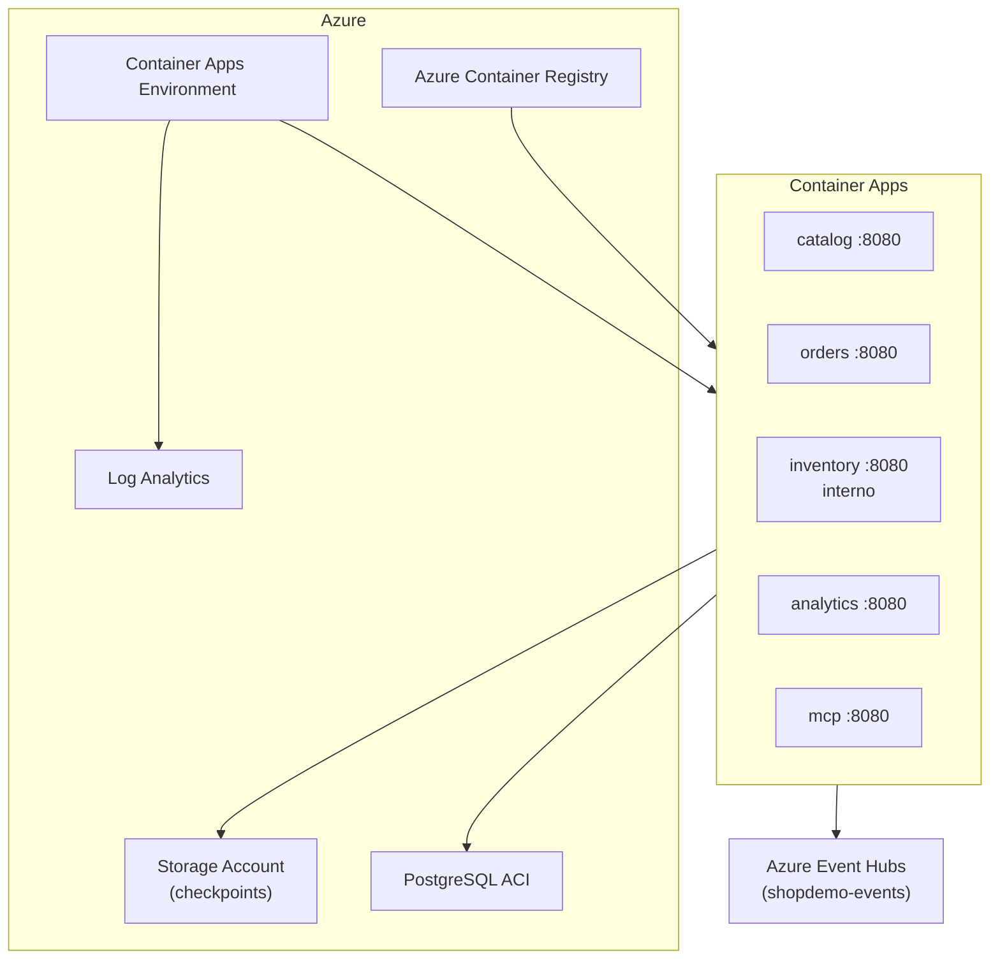

# Anexo — Especificación técnica: Despliegue Azure (ShopDemo)

| Campo | Detalle |
|:------|:--------|
| **Requerimientos de negocio** | [REQUERIMIENTOS-DESPLIEGUE-AZURE.md](./REQUERIMIENTOS-DESPLIEGUE-AZURE.md) |
| **Capa** | B — Especificación técnica |

**Plataforma:** Azure Container Apps (ACA) · **Registro:** ACR · **Orquestación alternativa:** AKS (etapa 10)

---

## 1. Arquitectura de despliegue

---

## 2. Matriz de servicios

| Servicio | Imagen ACR | Puerto contenedor | Ingress ACA | Dependencias |
|---|---|---|---|---|
| Catalog | `shopdemo-catalog` | 8080 | Externo | PostgreSQL, Event Hubs |
| Orders | `shopdemo-orders` | 8080 | Externo | PostgreSQL, Inventory URL, Event Hubs |
| Inventory | `shopdemo-inventory` | 8080 | Interno | PostgreSQL, Storage checkpoints, Event Hubs |
| Analytics | `shopdemo-analytics` | 8080 | Externo | Storage checkpoints, Event Hubs |
| MCP | `shopdemo-mcp` | 8080 | Externo | URLs APIs de negocio |

---

## 3. Recursos Azure requeridos

| Recurso | Propósito |
|---|---|
| Resource Group | Agrupación y teardown del lab |
| Azure Container Registry (ACR) | Registro de 5 imágenes Docker |
| Log Analytics Workspace | Logs y diagnósticos de ACA |
| Container Apps Environment | Entorno compartido de las 5 apps |
| Storage Account | Checkpoints Event Hubs (Inventory, Analytics) |
| Azure Container Instance (ACI) | PostgreSQL con 3 bases de datos |
| Event Hubs namespace | Bus `shopdemo-events` (preexistente o creado) |

---

## 4. Variables y secretos

| Secreto / variable | Servicios | Notas |
|---|---|---|
| `ConnectionStrings__DefaultConnection` | Catalog, Orders, Inventory | Apunta a ACI PostgreSQL |
| `EventHubs__ConnectionString` | Catalog, Orders, Inventory, Analytics | Namespace Azure |
| `EventHubs__ConsumerGroup` | Inventory (`inventory-service`), Analytics (`analytics-service`) | Obligatorios en hub |
| `InventoryApi__BaseUrl` | Orders | URL interna ACA de Inventory |
| `EventHubs__CheckpointStorageConnectionString` | Inventory, Analytics | Storage Account en ACA |
| `ShopDemo__*ApiBaseUrl` | MCP | URLs públicas o internas según entorno |

---

## 5. Scripts y automatización

| Artefacto | Ruta | Uso |
|---|---|---|
| Script principal | `scripts/azure/Deploy-AzureShopDemo.ps1` | `-Mode ACA` o `-Mode AKS` |
| Variables entorno | `scripts/azure/.env.azure` | **No commitear** |
| Workflow CI/CD | `.github/workflows/deploy-azure.yml` | Build + push ACR + deploy ACA |
| Guía script | [GUIA-RELEASE-SCRIPT-AZURE.md](./GUIA-RELEASE-SCRIPT-AZURE.md) | Paso a paso automatizado |
| Guía Portal | [GUIA-RELEASE-PORTAL-AZURE.md](./GUIA-RELEASE-PORTAL-AZURE.md) | Paso a paso consola |
| Guía CLI | [GUIA-RELEASE-CLI-AZURE.md](./GUIA-RELEASE-CLI-AZURE.md) | Comandos `az` |

---

## 6. Requerimientos no funcionales (RNF)

| ID | Requerimiento |
|---|---|
| RNF-AZ-01 | Tiempo de implementación lab: 2–4 horas (primer despliegue) |
| RNF-AZ-02 | Costo acotado: tier Basic ACR, `minReplicas: 0` en ACA |
| RNF-AZ-03 | Secretos nunca en repositorio git |
| RNF-AZ-04 | Documentación dual Portal + Azure CLI |
| RNF-AZ-05 | Coexistencia con `docker compose` local sin romper flujos |
| RNF-AZ-06 | Puerto contenedor 8080; `ASPNETCORE_URLS=http://+:8080` |

---

## 7. Criterios de aceptación técnicos (CA-T)

| ID | Criterio |
|---|---|
| CA-T-AZ-01 | `az containerapp list` muestra 5 aplicaciones en estado Running |
| CA-T-AZ-02 | `az acr repository list` incluye las 5 imágenes `shopdemo-*` |
| CA-T-AZ-03 | Health/Swagger responde en FQDN público de Catalog |
| CA-T-AZ-04 | Consumer groups `analytics-service` e `inventory-service` existen en hub |
| CA-T-AZ-05 | Orders usa URL interna de Inventory (no `localhost`) |
| CA-T-AZ-06 | Logs visibles en Log Analytics Workspace asociado |
| CA-T-AZ-07 | Workflow `deploy-azure.yml` actualiza imagen y revisión ACA |

---

## 8. Riesgos técnicos

| Riesgo | Mitigación |
|---|---|
| Costos inesperados | Resource Group dedicado; `minReplicas: 0`; teardown documentado |
| PostgreSQL efímero en ACI | Documentar pérdida de datos al recrear |
| Imagen no arranca | Revisar logs Log Analytics; verificar puerto 8080 |
| Checkpoints fallan | Validar Storage Account y contenedores blob |

---

## 9. Referencias

- [IMPLEMENTACION-DESPLIEGUE-AZURE.md](./IMPLEMENTACION-DESPLIEGUE-AZURE.md)
- [TEORIA-CONTENEDORES-AZURE.md](./TEORIA-CONTENEDORES-AZURE.md)
- [PREPARACION-AMBIENTE-AZURE.md](./PREPARACION-AMBIENTE-AZURE.md)
- [k8s/azure/](../../../k8s/azure/) — deployments AKS
