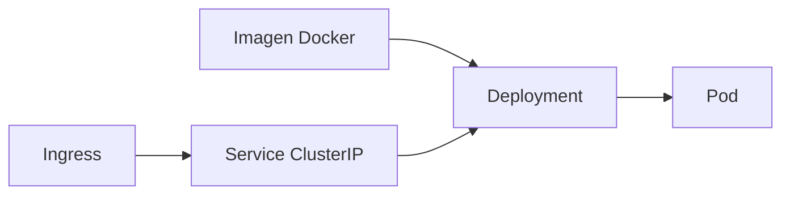

# Teoría — Operaciones Kubernetes (ShopDemo)

| Campo | Detalle |
|:------|:--------|
| **Empresa** | Lite Thinking |
| **Curso** | Microservicios con .NET en Kubernetes y Entornos Multicloud |
| **Instructor** | Lcc. Gilberto Valentino Juárez Sánchez |
| **Contacto** | WhatsApp: +52 5614206660 |
| | E-mail: gilberto.juarez@gmail.com |
| | E-mail: lcc.gilberto.juarez@gmail.com |

**Alcance:** Conceptos prácticos para Minikube (local), AKS (Azure) y EKS (AWS) con ShopDemo.  
**Implementación:** [IMPLEMENTACION-KUBERNETES-LOCAL.md](./IMPLEMENTACION-KUBERNETES-LOCAL.md) · [AKS](../aks/IMPLEMENTACION-DESPLIEGUE-AKS.md) · [EKS](../eks/IMPLEMENTACION-DESPLIEGUE-EKS.md)

---

## Índice

1. [Kubernetes y kubectl](#1-kubernetes-y-kubectl)
2. [Minikube](#2-minikube)
3. [Despliegue de aplicaciones](#3-despliegue-de-aplicaciones)
4. [Kubernetes Secrets](#4-kubernetes-secrets)
5. [Liveness y Readiness Checks](#5-liveness-y-readiness-checks)
6. [Autoscaling (HPA)](#6-autoscaling-hpa)
7. [Ingress: addon vs Helm](#7-ingress-addon-vs-helm)
8. [Resumen por entorno](#8-resumen-por-entorno)

---

## 1. Kubernetes y kubectl

**Kubernetes (K8s)** es un orquestador de contenedores: programa en qué nodo corre cada contenedor, expone servicios en red, reinicia fallos y escala réplicas.

**kubectl** es la CLI que habla con la API del cluster. No ejecuta contenedores directamente; envía objetos YAML (Deployments, Services, Secrets, etc.).

| Comando | Para qué sirve |
|---|---|
| `kubectl get pods -n shopdemo` | Ver estado de los pods |
| `kubectl describe pod <nombre> -n shopdemo` | Eventos, probes, errores |
| `kubectl logs -n shopdemo -l app=shopdemo-catalog` | Logs de una API |
| `kubectl apply -f k8s/catalog/` | Crear o actualizar recursos |
| `kubectl delete -f k8s/namespace.yaml` | Eliminar recursos declarados |
| `kubectl get hpa -n shopdemo` | Ver autoscaling |

**Namespace:** segmento lógico del cluster. ShopDemo usa `shopdemo` para aislar sus recursos.

---

## 2. Minikube

**Minikube** levanta un cluster Kubernetes de **un nodo** en tu máquina (Docker, Hyper-V, etc.). Es el entorno estándar para aprender K8s sin costo de nube.

| Ventaja | Limitación |
|---|---|
| Mismo `kubectl` que AKS/EKS | Un solo nodo; no alta disponibilidad real |
| Imágenes locales sin registry | Menos RAM/CPU que producción |
| Addons (`ingress`, `metrics-server`) | No replica balanceadores cloud |

```bash
minikube start --cpus=4 --memory=8192
kubectl get nodes
```

---

## 3. Despliegue de aplicaciones

En ShopDemo el flujo es:



| Recurso | Rol en ShopDemo |
|---|---|
| **Deployment** | 4 APIs + Azurite; réplicas y probes |
| **StatefulSet** | PostgreSQL con volumen persistente |
| **Service** | DNS interno (`shopdemo-catalog:8080`) |
| **Ingress** | Rutas HTTP `/catalog`, `/orders`, … |
| **Secret** | Connection strings y contraseñas |
| **HPA** | Escala Catalog según CPU |

**Orden de despliegue:** namespace → secrets → postgres → azurite → APIs → ingress → HPA.

---

## 4. Kubernetes Secrets

Los **Secrets** almacenan datos sensibles (contraseñas, connection strings) **fuera** del código y de los Deployments en texto plano.

| Aspecto | Detalle |
|---|---|
| Tipo usado | `Opaque` (clave-valor genérico) |
| En repo | Solo `secrets.example.yaml` (plantilla) |
| En cluster | `kubectl apply -f secrets.yaml` |
| Consumo | `env.valueFrom.secretKeyRef` en el Deployment |

```yaml
env:
  - name: ConnectionStrings__DefaultConnection
    valueFrom:
      secretKeyRef:
        name: shopdemo-secrets
        key: PG_CATALOG_CONN
```

**Regla del curso:** nunca commitear `secrets.yaml` con valores reales. En AKS/EKS se aplican los mismos YAML; en producción avanzada se integraría Azure Key Vault o AWS Secrets Manager (fuera del alcance básico).

---

## 5. Liveness y Readiness Checks

Kubernetes pregunta periódicamente si el contenedor está listo y vivo.

| Probe | Pregunta | Efecto si falla |
|---|---|---|
| **Readiness** | ¿Puede recibir tráfico? | Pod sale del Service (no recibe requests) |
| **Liveness** | ¿El proceso sigue sano? | Kubernetes **reinicia** el contenedor |

ShopDemo expone en las 4 APIs:

| Ruta | Uso en K8s |
|---|---|
| `GET /health` | Readiness — app arrancó |
| `GET /alive` | Liveness — proceso vivo (tag `live`) |

```yaml
readinessProbe:
  httpGet:
    path: /health
    port: 8080
livenessProbe:
  httpGet:
    path: /alive
    port: 8080
```

**Por qué HTTP y no TCP:** un puerto abierto no garantiza que ASP.NET terminó migraciones y DI; `/health` confirma que el pipeline HTTP responde.

---

## 6. Autoscaling (HPA)

El **Horizontal Pod Autoscaler (HPA)** aumenta o reduce réplicas de un Deployment según métricas (típicamente **CPU**).

| Requisito | ShopDemo |
|---|---|
| `resources.requests.cpu` en el contenedor | Definido en `catalog/deployment.yaml` |
| **metrics-server** en el cluster | Addon en Minikube; incluido en AKS/EKS |
| Manifiesto HPA | `k8s/catalog/hpa.yaml` (1–3 réplicas, 70 % CPU) |

```yaml
spec:
  minReplicas: 1
  maxReplicas: 3
  metrics:
    - type: Resource
      resource:
        name: cpu
        target:
          type: Utilization
          averageUtilization: 70
```

En el laboratorio se demuestra solo en **Catalog** para mantener el alcance básico. Las demás APIs quedan en 1 réplica fija.

---

## 7. Ingress: addon vs Helm

El **Ingress Controller** enruta HTTP externo hacia Services internos.

| Entorno | Método | Comando |
|---|---|---|
| **Minikube** | Addon integrado | `minikube addons enable ingress` |
| **AKS** | Helm | `helm install ingress-nginx ingress-nginx/ingress-nginx` |
| **EKS** | Helm | Igual que AKS |

**Helm** es un gestor de paquetes para K8s: instala charts (plantillas + valores) con versiones y upgrades reproducibles. En nube se prefiere Helm porque el addon de Minikube no existe y los proveedores documentan el chart oficial `ingress-nginx`.

ShopDemo define rutas en `k8s/ingress/ingress.yaml` con host `shopdemo.local` (local) o IP/DNS del balanceador (nube).

---

## 8. Resumen por entorno

| Tema | Minikube | Azure AKS | Amazon EKS |
|---|---|---|---|
| Cluster | `minikube start` | `az aks create` | `eksctl create cluster` |
| Imágenes | Build en daemon Minikube | Push ACR | Push ECR |
| Secrets | `kubectl apply -f secrets.yaml` | Igual | Igual |
| Probes | `/health`, `/alive` | Igual manifiestos | Igual manifiestos |
| HPA | `minikube addons enable metrics-server` | metrics-server por defecto | Verificar addon |
| Ingress | **Addon** Minikube | **Helm** ingress-nginx | **Helm** ingress-nginx |

---

## Referencias

- [REQUERIMIENTOS-KUBERNETES.md](./REQUERIMIENTOS-KUBERNETES.md)
- [k8s/README.md](../../../k8s/README.md)
- [kubernetes-cli.md](../../cheat-sheets/kubernetes-cli.md)
- [TEORIA-DOCKER-KUBERNETES-AOT.md](../../TEORIA-DOCKER-KUBERNETES-AOT.md)
