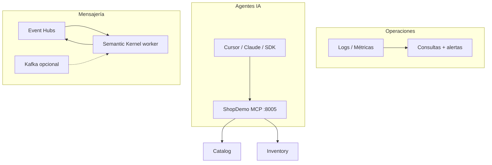

# Teoría — Integración de IA (ShopDemo)

| Campo | Detalle |
|:------|:--------|
| **Empresa** | Lite Thinking |
| **Curso** | Microservicios con .NET en Kubernetes y Entornos Multicloud |
| **Instructor** | Lcc. Gilberto Valentino Juárez Sánchez |
| **Contacto** | WhatsApp: +52 5614206660 |
| | E-mail: gilberto.juarez@gmail.com |
| | E-mail: lcc.gilberto.juarez@gmail.com |

---

## Índice

1. [Visión general](#1-visión-general)
2. [Detección de anomalías](#2-detección-de-anomalías)
3. [Model Context Protocol (MCP)](#3-model-context-protocol-mcp)
4. [Semantic Kernel y mensajería](#4-semantic-kernel-y-mensajería)
5. [ShopDemo en el mapa](#5-shopdemo-en-el-mapa)
6. [Azure vs AWS](#6-azure-vs-aws)

---

## 1. Visión general

La **integración de IA** en microservicios no sustituye la observabilidad clásica: la **complementa** con:

- Alertas inteligibles sobre patrones en logs y métricas
- Interfaces para que **agentes** (Cursor, Copilot, etc.) invoquen operaciones de negocio de forma segura
- **Enriquecimiento** de eventos del bus con contexto generado por LLM



---

## 2. Detección de anomalías

En el alcance **básico** del curso no se entrena un modelo custom. Se usan:

| Enfoque | Azure | AWS |
|---|---|---|
| Umbrales estáticos | Alertas Azure Monitor | CloudWatch Alarms |
| Consultas | **KQL** en Log Analytics | **Logs Insights** |
| Señales | CPU, 5xx, picos de errores en logs | Igual |

**Anomalía operativa:** desviación respecto a un baseline humano (ej. más de 10 errores `Reserving stock` en 5 min cuando lo normal es 0–2).

La **IA avanzada** (smart detection, forecasting) queda como evolución; este módulo enseña a **preparar datos** y **alertas** que luego alimentan esas funciones.

---

## 3. Model Context Protocol (MCP)

**MCP** estandariza cómo un agente IA descubre y ejecuta **tools** (funciones) expuestas por un servidor.

| Concepto | ShopDemo |
|---|---|
| MCP Server | `ShopDemo.Mcp.Api` |
| Transporte | HTTP Streamable (`/mcp`) — apto para contenedores |
| SDK | `ModelContextProtocol.AspNetCore` NuGet |
| Tools | Crear producto, consultar stock, listar eventos Analytics |

El servidor **no** reemplaza las APIs REST: actúa como **fachada para agentes**, delegando en Catalog/Inventory/Analytics por HTTP.

---

## 4. Semantic Kernel y mensajería

**Semantic Kernel (SK)** orquesta llamadas a LLM (OpenAI en el lab) y funciones C#.

| Patrón | Descripción |
|---|---|
| **Consumer** | Lee mensajes del bus |
| **Enriquecimiento** | SK resume/clasifica el payload del evento |
| **Producer** | Publica mensaje enriquecido a otro topic |

**ShopDemo principal:** Azure **Event Hubs** (ya integrado).  
**Anexo lab:** **Apache Kafka** con `Confluent.Kafka` — mismo patrón mental, útil en entornos multicloud AWS.

```
Evento ProductCreated → SK prompt → "Resumen: nuevo producto Electronics, 50 uds" → topic enriched-events
```

El worker SK es **documentado** en esta etapa; su código completo es proyecto opcional posterior.

---

## 5. ShopDemo en el mapa

| Capacidad existente | Uso con IA |
|---|---|
| `ILogger` + agregación cloud | Entrada para consultas de anomalías |
| `traceId` en errores | Correlación manual en investigaciones |
| Event Hubs | Fuente para SK |
| Analytics | Destino observable tras enriquecimiento |
| MCP Gateway | Punto de entrada para agentes |

---

## 6. Azure vs AWS

| Tema | Azure | AWS |
|---|---|---|
| Logs | Log Analytics + KQL | CloudWatch Logs Insights |
| LLM lab | OpenAI API (misma clave) | OpenAI API (misma clave) |
| MCP deploy | ACA + AKS | ECS + EKS |
| Bus principal | Event Hubs | Event Hubs (cross-cloud) |
| Bus alternativo | Event Hubs compatible Kafka | Amazon MSK (anexo doc) |

---

## Referencias

- [MCP C# SDK](https://csharp.sdk.modelcontextprotocol.io/)
- [Semantic Kernel](https://github.com/microsoft/semantic-kernel)
- [REQUERIMIENTOS-INTEGRACION-IA.md](./REQUERIMIENTOS-INTEGRACION-IA.md)
