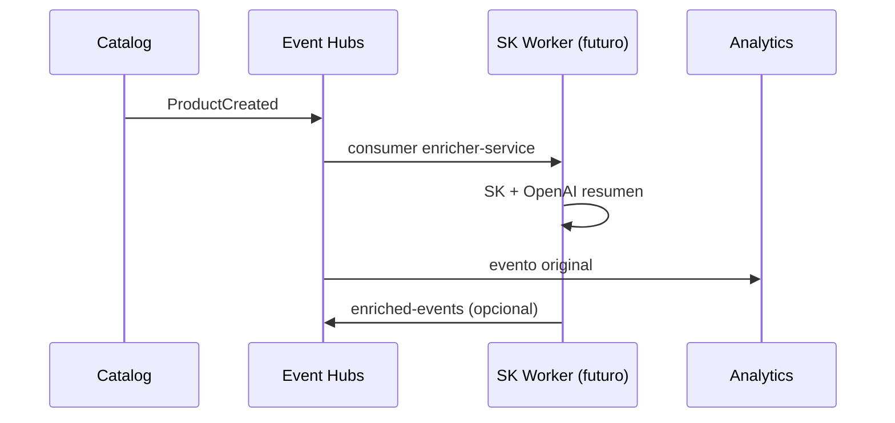

# Implementación — Integración de IA en Azure (ACA + AKS)

| Campo | Detalle |
|:------|:--------|
| **Empresa** | Lite Thinking |
| **Curso** | Microservicios con .NET en Kubernetes y Entornos Multicloud |
| **Instructor** | Lcc. Gilberto Valentino Juárez Sánchez |
| **Contacto** | WhatsApp: +52 5614206660 |
| | E-mail: gilberto.juarez@gmail.com |
| | E-mail: lcc.gilberto.juarez@gmail.com |

**Prerequisitos:** APIs desplegadas · logs en Log Analytics · [observabilidad](../../observabilidad/azure/IMPLEMENTACION-OBSERVABILIDAD-AZURE.md)  
**Teoría:** [TEORIA-INTEGRACION-IA.md](../TEORIA-INTEGRACION-IA.md)

---

## Índice

1. [Módulo 1 — Anomalías en métricas y logs](#módulo-1--anomalías-en-métricas-y-logs)
2. [Módulo 2 — MCP Server (ShopDemo.Mcp.Api)](#módulo-2--mcp-server-shopdemomcpapi)
3. [Módulo 3 — Semantic Kernel + Event Hubs (+ Kafka)](#módulo-3--semantic-kernel--event-hubs--kafka)
4. [Parte A — MCP en Container Apps](#parte-a--mcp-en-container-apps)
5. [Parte B — MCP en AKS](#parte-b--mcp-en-aks)

---

## Módulo 1 — Anomalías en métricas y logs

**Objetivo:** Detectar desviaciones operativas con **KQL** y alertas por umbral (sin ML custom).

### Paso 1.1 — Baseline de errores Orders

En **Log Analytics** → **Logs**:

```kql
ContainerAppConsoleLogs_CL
| where ContainerAppName_s == "ca-shopdemo-orders"
| where Log_s contains "error" or Log_s contains "Exception"
| summarize ErrorCount = count() by bin(TimeGenerated, 5m)
| order by TimeGenerated desc
```

**Explicación:** Establece cuántos errores son “normales” en 5 minutos en horario de práctica.

### Paso 1.2 — Alerta por umbral de errores

| # | Portal |
|---|---|
| 1 | **Monitor** → **Alerts** → **Create** → **Log alert** |
| 2 | Scope: workspace `law-shopdemo` |
| 3 | Query: la KQL anterior con `| where ErrorCount > 5` |
| 4 | Evaluation: cada 5 min |
| 5 | Action group: email |

### Paso 1.3 — Anomalía en métricas CPU Catalog

| # | Acción |
|---|---|
| 1 | Container App Catalog → **Metrics** → CPU |
| 2 | **New alert rule**: avg CPU > 85 % durante 10 min |
| 3 | Correlacionar con HPA si está en AKS |

### Paso 1.4 — Investigación con traceId

Tras alerta, buscar causa:

```kql
ContainerAppConsoleLogs_CL
| where Log_s contains "<traceId-de-respuesta>"
| project TimeGenerated, ContainerAppName_s, Log_s
```

---

## Módulo 2 — MCP Server (ShopDemo.Mcp.Api)

**Objetivo:** Exponer ShopDemo a agentes IA vía [Model Context Protocol](https://modelcontextprotocol.io/).

### Paso 2.1 — Probar en local

| # | Comando |
|---|---|
| 1 | Levantar Catalog, Inventory, Analytics (Compose o Aspire) |
| 2 | `dotnet run --project AI/ShopDemo.Mcp.Api` |
| 3 | `curl http://localhost:8005/health` |
| 4 | Endpoint MCP: `http://localhost:8005/mcp` |

**Tools disponibles:** `CreateProduct`, `GetProductStock`, `ListAnalyticsEvents`, `GetShopDemoStatus`.

### Paso 2.2 — Configurar Cursor (ejemplo)

Archivo `.cursor/mcp.json` en el workspace (o configuración MCP del IDE):

```json
{
  "mcpServers": {
    "shopdemo": {
      "url": "http://localhost:8005/mcp"
    }
  }
}
```

**Explicación:** El agente descubre tools por el protocolo MCP; no necesita conocer URLs de Catalog/Inventory.

### Paso 2.3 — Build imagen Docker

```bash
cd I:\Curso\ShopDemo
az acr login --name $ACR_NAME
docker build -f AI/ShopDemo.Mcp.Api/Dockerfile -t $ACR_LOGIN/shopdemo-mcp:v1 .
docker push $ACR_LOGIN/shopdemo-mcp:v1
```

Variables de entorno en contenedor:

| Variable | Ejemplo ACA interno |
|---|---|
| `ShopDemo__CatalogApiBaseUrl` | `https://ca-shopdemo-catalog.internal...` o URL interna |
| `ShopDemo__InventoryApiBaseUrl` | URL interna Inventory |
| `ShopDemo__AnalyticsApiBaseUrl` | URL Analytics |

---

## Módulo 3 — Semantic Kernel + Event Hubs (+ Kafka)

**Objetivo:** Documentar enriquecimiento asíncrono con LLM. **Código worker:** etapa opcional; aquí el diseño y pasos.

### Paso 3.1 — Flujo principal (Event Hubs)



| # | Paso |
|---|---|
| 1 | Crear consumer group `enricher-service` en Event Hubs |
| 2 | Worker .NET: `BackgroundService` + `EventProcessorClient` (patrón Inventory) |
| 3 | Por mensaje: `Kernel.InvokePromptAsync` con template de resumen |
| 4 | Publicar resultado a topic/log Analytics |

**Paquetes NuGet (worker futuro):**

```bash
dotnet add package Microsoft.SemanticKernel
dotnet add package Azure.Messaging.EventHubs.Processor
dotnet add package Azure.AI.OpenAI
# OpenAI connector alternativo: Microsoft.SemanticKernel.Connectors.OpenAI
```

**Secreto:** `OPENAI_API_KEY` en Key Vault / Container App secrets (misma clave lab Azure/AWS).

### Paso 3.2 — Anexo Kafka (opcional)

Para practicar Kafka sin reemplazar Event Hubs:

| # | Acción |
|---|---|
| 1 | `docker compose` con `bitnami/kafka` en red local |
| 2 | Topic `shopdemo-events-raw` / `shopdemo-events-enriched` |
| 3 | Consumer `Confluent.Kafka` + mismo `Kernel` del paso 3.1 |
| 4 | En AWS: **Amazon MSK** como managed Kafka |

**Equivalencia:** Event Hubs ≈ Kafka en arquitectura de eventos; ShopDemo de negocio sigue en Event Hubs.

---

## Parte A — MCP en Container Apps

Guía detallada (Portal + CLI): [IMPLEMENTACION-DESPLIEGUE-MCP-AZURE.md](../IMPLEMENTACION-DESPLIEGUE-MCP-AZURE.md) — Parte A.

Resumen: imagen ACR → `ca-shopdemo-mcp` → env `ShopDemo__*ApiBaseUrl` → Ingress externo → probes `/health`.

---

## Parte B — MCP en AKS

Guía detallada: [IMPLEMENTACION-DESPLIEGUE-MCP-AZURE.md](../IMPLEMENTACION-DESPLIEGUE-MCP-AZURE.md) — Parte B.

Manifiestos: `k8s/azure/mcp/deployment.yaml` + `k8s/mcp/service.yaml`; Ingress `/mcp` ya en el repo.

---

## Referencias

| # | Módulo | ACA | AKS |
|---|---|---|---|
| 1 | Alerta KQL errores | ✓ | ✓ (ContainerLogV2) |
| 2 | MCP `/health` | ✓ | ✓ |
| 3 | Agente invoca tool | ✓ | ✓ |
| 4 | SK diseño Event Hubs documentado | ✓ | ✓ |

---

## Referencias

- [AI/ShopDemo.Mcp.Api](../../../AI/ShopDemo.Mcp.Api/)
- [IMPLEMENTACION-OBSERVABILIDAD-AZURE.md](../../observabilidad/azure/IMPLEMENTACION-OBSERVABILIDAD-AZURE.md)
- [INTEGRACION-AZURE-EVENT-HUBS.md](../../INTEGRACION-AZURE-EVENT-HUBS.md)
