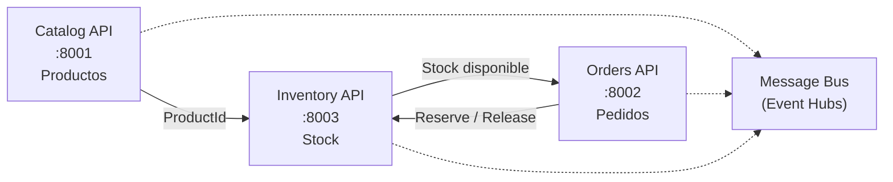

# Anexo — Especificación técnica: Inventory (ShopDemo)

| Campo | Detalle |
|:------|:--------|
| **Requerimientos de negocio** | [REQUERIMIENTOS-INVENTORY.md](./REQUERIMIENTOS-INVENTORY.md) |
| **Capa** | B — Especificación técnica |

**Arquitectura:** Hexagonal (Ports & Adapters)  
**Bounded Context:** Inventory

---

## 1. Contexto técnico en la plataforma



| Microservicio | Base de datos | Puerto API | Puerto PostgreSQL (host) |
|---|---|---|---|
| Catalog | `ShopDemoCatalog` | `8001` | `5433` |
| Orders | `ShopDemoOrders` | `8002` | `5434` |
| **Inventory** | **`ShopDemoInventory`** | **`8003`** | **`5435`** |

---

## 2. Modelo de dominio

### 2.1 Agregado raíz: `StockEntry`

```
StockEntry (AggregateRoot — Id = ProductId)
├── ProductName        (snapshot de Catalog)
├── AvailableUnits     (int)
├── DateTimeOffset CreatedAt
└── DateTimeOffset? LastUpdatedAt
```

### 2.2 Comportamientos del agregado

| Método | Regla de negocio | Evento generado |
|---|---|---|
| `Register()` | Factory; stock inicial ≥ 0 | `StockEntryRegisteredDomainEvent` |
| `Reserve(quantity)` | No exceder disponible | `StockReservedDomainEvent`, `StockDepletedDomainEvent` (si = 0) |
| `Release(quantity)` | Incrementar disponible | `StockReleasedDomainEvent` |
| `Replenish(units)` | Unidades > 0 | — |

### 2.3 Value Objects

| Value Object | Reglas |
|---|---|
| `ProductReference` | ProductId no vacío; nombre snapshot requerido |
| `Quantity` | Entero > 0 para reserva/liberación |

### 2.4 Domain Events

| Evento | Cuándo se emite |
|---|---|
| `StockEntryRegisteredDomainEvent` | Al registrar stock por primera vez |
| `StockReservedDomainEvent` | Al reservar unidades |
| `StockReleasedDomainEvent` | Al liberar unidades |
| `StockDepletedDomainEvent` | Cuando `AvailableUnits` llega a 0 |

---

## 3. Arquitectura hexagonal

```
                    ┌─────────────────────────────────────┐
  Driving           │         APPLICATION CORE            │           Driven
  Adapters          │  (Use Cases + Domain)               │           Adapters
                    │                                     │
  ┌──────────┐      │  ┌─────────────┐  ┌─────────────┐  │      ┌──────────────┐
  │ REST API │─────►│  │ Inbound     │  │  Domain     │  │◄─────│ EF Core Repo │
  │Controller│      │  │ Ports       │  │  StockEntry │  │      └──────────────┘
  └──────────┘      │  └──────┬──────┘  └─────────────┘  │      ┌──────────────┐
                    │         │                           │◄─────│ Event Logger │
                    │  ┌──────▼──────┐                      │      └──────────────┘
                    │  │  Use Cases  │                      │      ┌──────────────┐
                    │  └──────┬──────┘                      │◄─────│ Event Hubs   │
                    │         │                           │      │ Consumer     │
                    │  ┌──────▼──────┐  Outbound Ports     │      └──────────────┘
                    │  │ IStockRepo  │◄─────────────────────┘
                    │  │ IEventPub   │
                    │  │ IUnitOfWork │
                    │  └─────────────┘
                    └─────────────────────────────────────┘
```

### Puertos requeridos

**Inbound (driving):**

- `IRegisterStockUseCase`
- `IGetStockByProductUseCase`
- `IReserveStockUseCase`
- `IReleaseStockUseCase`

**Outbound (driven):**

- `IStockEntryRepository`
- `IIntegrationEventPublisher`
- `IUnitOfWork`

> Inventory **no usa MediatR**; los use cases implementan directamente los inbound ports.

---

## 4. API REST

| Método | Ruta | Descripción | Invocado por |
|---|---|---|---|
| `POST` | `/api/inventory/stock` | Registrar o reabastecer stock | Operador / flujo manual tras Catalog |
| `GET` | `/api/inventory/{productId}` | Consultar stock disponible | Operador / diagnóstico |
| `POST` | `/api/inventory/reservations` | Reservar unidades por pedido | **Orders** al confirmar |
| `POST` | `/api/inventory/reservations/release` | Liberar unidades por pedido | **Orders** al cancelar |

### Payload — Registrar stock

```json
{
  "productId": "7c9e6679-7425-40de-944b-e07fc1f90ae7",
  "productName": "Laptop Pro",
  "units": 100
}
```

### Payload — Reservar stock

```json
{
  "orderId": "a1b2c3d4-e5f6-7890-abcd-ef1234567890",
  "lines": [
    { "productId": "7c9e6679-7425-40de-944b-e07fc1f90ae7", "quantity": 2 }
  ]
}
```

### Payload — Liberar stock

```json
{
  "orderId": "a1b2c3d4-e5f6-7890-abcd-ef1234567890",
  "lines": [
    { "productId": "7c9e6679-7425-40de-944b-e07fc1f90ae7", "quantity": 2 }
  ]
}
```

### Respuesta — StockDto

```json
{
  "productId": "7c9e6679-7425-40de-944b-e07fc1f90ae7",
  "productName": "Laptop Pro",
  "availableUnits": 98,
  "createdAt": "2026-06-11T20:00:00Z",
  "lastUpdatedAt": "2026-06-11T21:30:00Z"
}
```

### Swagger

- Ruta: `/swagger` cuando `ASPNETCORE_ENVIRONMENT=Development`
- Título: **ShopDemo Inventory API v1**

---

## 5. Estructura de proyectos y stack

```
Inventory/
├── ShopDemo.Inventory.Domain/
├── ShopDemo.Inventory.Application/
├── ShopDemo.Inventory.Infraestructure/
└── ShopDemo.Inventory.Api/
```

**Dependencias:** `Api → Infrastructure → Application → Domain → Shared`

| Componente | Tecnología |
|---|---|
| Runtime | .NET 10 |
| ORM | EF Core 10 + Npgsql |
| Patrón | Hexagonal (Ports & Adapters) |
| API docs | Swashbuckle 10.2 |
| Base de datos | PostgreSQL 16 |
| Mensajería (etapas 5+) | Azure Event Hubs consumer (`inventory-service`) |

**Conexión (desarrollo):**

```json
{
  "ConnectionStrings": {
    "DefaultConnection": "Host=localhost;Port=5435;Database=ShopDemoInventory;Username=ShopDemo;Password=ShopDemo123"
  }
}
```

**Tabla:** `stock_entries` — columnas para `product_id`, `product_name`, `available_units`.

**Docker Compose** (`ShopDemo.Inventory.Api/docker-compose.yml`):

- Servicio `inventory-db` (PostgreSQL 16)
- Servicio `inventory-service` (API .NET 10)
- Puerto host PostgreSQL: **5435**
- Puerto host API: **8003**
- Healthcheck con `pg_isready -U ShopDemo -d ShopDemoInventory`

---

## 6. Integración con Orders

| Evento en Orders | Llamada a Inventory |
|---|---|
| Confirmar pedido | `POST /api/inventory/reservations` |
| Cancelar pedido Confirmado | `POST /api/inventory/reservations/release` |

Flujo esperado desde Orders:

```
ConfirmOrderHandler:
  1. Obtener Order
  2. Llamar IInventoryService.ReserveStockAsync(orderId, lines)
  3. order.Confirm()
  4. Persistir + publicar eventos
```

---

## 7. Event Hubs (etapas 5+)

Consumer group obligatorio: `inventory-service` en hub `shopdemo-events`.

| Evento de integración | Acción en Inventory |
|---|---|
| `ProductCreated` (desde Catalog) | Opcional: pre-registrar stock o sincronizar referencia |

En MVP del curso, el registro de stock es **manual** vía `POST /api/inventory/stock` tras crear producto en Catalog.

---

## 8. Criterios de aceptación técnicos (CA-T)

| ID | Criterio |
|---|---|
| CA-T01 | Estructura hexagonal con puertos In/Out explícitos |
| CA-T02 | Use Cases implementan Inbound Ports (sin MediatR) |
| CA-T03 | Controllers dependen solo de Inbound Ports |
| CA-T04 | `POST /api/inventory/stock` crea stock consultable por GET |
| CA-T05 | `POST /api/inventory/reservations` decrementa `availableUnits` |
| CA-T06 | Stock insuficiente en reserva → `400` o `409` |
| CA-T07 | `POST /api/inventory/reservations/release` incrementa `availableUnits` |
| CA-T08 | Confirmar pedido en Orders reduce stock en Inventory |
| CA-T09 | Cancelar pedido confirmado restaura stock en Inventory |
| CA-T10 | Swagger accesible en `/swagger` (Development) |
| CA-T11 | `docker compose up` levanta API en `:8003` y PostgreSQL en `:5435` |
| CA-T12 | Migraciones EF se aplican al iniciar |
| CA-T13 | El dominio no referencia EF Core ni ASP.NET |
| CA-T14 | `StockReservedDomainEvent` visible en logs al reservar |
| CA-T15 | Controller no referencia repositorio EF directamente |

---

## 9. Referencias

- [IMPLEMENTACION-INVENTORY.md](./IMPLEMENTACION-INVENTORY.md)
- [ANEXO-HISTORIAS-TECNICAS-INVENTORY.md](./ANEXO-HISTORIAS-TECNICAS-INVENTORY.md)
- [ANEXO-ESPECIFICACION-TECNICA-ORDERS.md](../orders/ANEXO-ESPECIFICACION-TECNICA-ORDERS.md)
- [ARQUITECTURA.md](../ARQUITECTURA.md)
