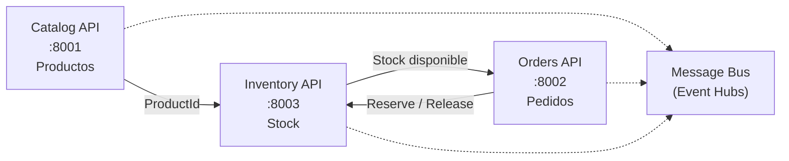

# Documento de Requerimientos — Microservicio Inventory (ShopDemo)

| Campo | Detalle |
|:------|:--------|
| **Empresa** | Lite Thinking |
| **Curso** | Microservicios con .NET en Kubernetes y Entornos Multicloud |
| **Instructor** | Lcc. Gilberto Valentino Juárez Sánchez |
| **Contacto** | WhatsApp: +52 5614206660 |
| | E-mail: gilberto.juarez@gmail.com |
| | E-mail: lcc.gilberto.juarez@gmail.com |

**Arquitectura:** Hexagonal (Ports & Adapters)  
**Bounded Context:** Inventory  
**Versión:** 1.0

---

## 1. Propósito

Definir los requerimientos del microservicio **Inventory**, responsable de la **gestión de stock** por producto, como tercer bounded context de ShopDemo junto a **Catalog** y **Orders**.

Inventory utiliza **arquitectura hexagonal** (a diferencia de Catalog y Orders que usan Clean Architecture), para que los alumnos comparen ambos enfoques.

---

## 2. Contexto en la plataforma



### Flujo de negocio integrado (ejercicio)

| Paso | Servicio | Acción |
|---|---|---|
| 1 | **Catalog** | `POST /api/products` → crea producto con `ProductId` |
| 2 | **Inventory** | `POST /api/inventory/stock` → registra stock para ese `ProductId` |
| 3 | **Orders** | `POST /api/orders` → crea pedido con líneas que referencian `ProductId` |
| 4 | **Orders** | `POST /api/orders/{id}/confirm` → **reserva stock** en Inventory automáticamente |
| 5 | **Inventory** | `GET /api/inventory/{productId}` → consulta unidades disponibles |
| 6 | **Orders** | `POST /api/orders/{id}/cancel` → **libera stock** reservado en Inventory |

---

## 3. Objetivos de aprendizaje

1. Implementar **arquitectura hexagonal** con puertos de entrada y salida explícitos.
2. Diferenciar **driving adapters** (API HTTP) de **driven adapters** (EF Core, HTTP cliente).
3. Integrar bounded contexts sin acoplar dominios (comunicación por contratos HTTP).
4. Modelar **StockEntry** como agregado de inventario.
5. Relacionar los tres microservicios en un flujo de e-commerce coherente.

---

## 4. Alcance MVP

| ID | Requerimiento |
|---|---|
| RF-01 | Registrar stock inicial para un `ProductId` (proveniente de Catalog) |
| RF-02 | Consultar stock disponible por `ProductId` |
| RF-03 | Reservar unidades de stock al confirmar un pedido (invocado por Orders) |
| RF-04 | Liberar unidades al cancelar un pedido confirmado (invocado por Orders) |
| RF-05 | Persistir en PostgreSQL dedicado (`ShopDemoInventory`) |
| RF-06 | Publicar eventos de integración (log en desarrollo) |
| RF-07 | Swagger en Development |
| RF-08 | Docker Compose (API + PostgreSQL) |

### Fuera de alcance

- Azure Event Hubs real
- Sincronización automática Catalog → Inventory vía eventos
- Kubernetes / Aspire

---

## 5. Lenguaje ubicuo

| Término | Definición |
|---|---|
| **StockEntry** | Registro de inventario de un producto (agregado raíz) |
| **ProductReference** | Referencia externa al producto de Catalog (`ProductId` + nombre snapshot) |
| **AvailableUnits** | Unidades disponibles para venta |
| **Reserve** | Descontar unidades al confirmar pedido |
| **Release** | Devolver unidades al cancelar pedido |
| **Replenish** | Aumentar stock (reabastecimiento) |

---

## 6. Modelo de dominio

### Agregado `StockEntry`

```
StockEntry (AggregateRoot — Id = ProductId)
├── ProductName        (snapshot de Catalog)
├── AvailableUnits     (int)
├── CreatedAt
└── LastUpdatedAt
```

### Reglas de negocio

| ID | Regla |
|---|---|
| RN-01 | No se puede reservar más unidades de las disponibles |
| RN-02 | No se puede liberar más unidades de las que se reservaron en contexto del pedido (simplificado: liberar cantidad solicitada si hay lógica de reserva por pedido; MVP: incrementar available) |
| RN-03 | `ProductId` no puede ser `Guid.Empty` |
| RN-04 | Stock inicial no puede ser negativo |
| RN-05 | Un producto solo tiene un `StockEntry` (ProductId único) |

### Domain Events

| Evento | Cuándo |
|---|---|
| `StockEntryRegisteredDomainEvent` | Al registrar stock por primera vez |
| `StockReservedDomainEvent` | Al reservar unidades |
| `StockReleasedDomainEvent` | Al liberar unidades |
| `StockDepletedDomainEvent` | Cuando `AvailableUnits` llega a 0 |

---

## 7. Arquitectura hexagonal

```
                    ┌─────────────────────────────────────┐
  Driving           │         APPLICATION CORE            │           Driven
  Adapters          │  (Use Cases + Domain)               │           Adapters
                    │                                     │
  ┌──────────┐      │  ┌─────────────┐  ┌─────────────┐  │      ┌──────────────┐
  │ REST API │─────►│  │ Inbound     │  │  Domain     │  │◄─────│ EF Core Repo │
  │Controller│      │  │ Ports       │  │  StockEntry │  │      └──────────────┘
  └──────────┘      │  └──────┬──────┘  └─────────────┘  │      ┌──────────────┐
                    │         │                           │◄─────│ Event Logger │
                    │  ┌──────▼──────┐                      │      └──────────────┘
                    │  │  Use Cases  │                      │
                    │  └──────┬──────┘                      │
                    │         │                           │
                    │  ┌──────▼──────┐  Outbound Ports     │
                    │  │ IStockRepo  │◄─────────────────────┘
                    │  │ IEventPub   │
                    │  └─────────────┘
                    └─────────────────────────────────────┘
```

### Puertos requeridos

**Inbound (driving):**
- `IRegisterStockUseCase`
- `IGetStockByProductUseCase`
- `IReserveStockUseCase`
- `IReleaseStockUseCase`

**Outbound (driven):**
- `IStockEntryRepository`
- `IIntegrationEventPublisher`
- `IUnitOfWork`

---

## 8. Endpoints API

| Método | Ruta | Descripción | Invocado por |
|---|---|---|---|
| `POST` | `/api/inventory/stock` | Registrar o reabastecer stock | Usuario / flujo manual tras Catalog |
| `GET` | `/api/inventory/{productId}` | Consultar stock disponible | Usuario / diagnóstico |
| `POST` | `/api/inventory/reservations` | Reservar unidades por pedido | **Orders** al confirmar |
| `POST` | `/api/inventory/reservations/release` | Liberar unidades por pedido | **Orders** al cancelar |

### Payload — Registrar stock

```json
{
  "productId": "7c9e6679-7425-40de-944b-e07fc1f90ae7",
  "productName": "Laptop Pro",
  "units": 100
}
```

### Payload — Reservar stock

```json
{
  "orderId": "a1b2c3d4-e5f6-7890-abcd-ef1234567890",
  "lines": [
    { "productId": "7c9e6679-7425-40de-944b-e07fc1f90ae7", "quantity": 2 }
  ]
}
```

---

## 9. Integración con Orders

Orders debe invocar Inventory **antes** de confirmar el pedido (para evitar confirmar sin stock):

```
ConfirmOrderHandler:
  1. Obtener Order
  2. Llamar IInventoryService.ReserveStockAsync(orderId, lines)
  3. order.Confirm()
  4. Persistir + publicar eventos
```

Al cancelar un pedido que estaba **Confirmed** o **Pending** (si ya se reservó en confirm — solo Confirmed reserva en MVP):

```
CancelOrderHandler:
  1. Si order.Status == Confirmed → ReleaseStockAsync
  2. order.Cancel()
```

---

## 10. Configuración técnica

| Parámetro | Valor |
|---|---|
| Base de datos | `ShopDemoInventory` |
| Puerto PostgreSQL (host) | `5435` |
| Puerto API | `8003` |
| Framework | .NET 10 |

---

## 11. Criterios de aceptación

- [ ] Proyectos Inventory con estructura hexagonal (Ports In/Out explícitos)
- [ ] Use Cases implementan Inbound Ports (sin MediatR en Inventory)
- [ ] Controllers dependen solo de Inbound Ports
- [ ] `POST /api/inventory/stock` crea stock consultable por GET
- [ ] `POST /api/inventory/reservations` descuenta unidades
- [ ] Confirmar pedido en Orders reduce stock en Inventory
- [ ] Cancelar pedido confirmado restaura stock en Inventory
- [ ] Swagger en `/swagger`
- [ ] Docker Compose funcional

---

## 12. Preguntas de reflexión

1. ¿En hexagonal, quién define el contrato: el adaptador o el núcleo?
2. ¿Por qué el Controller no debe conocer `StockEntryRepository` directamente?
3. ¿Qué diferencia hay entre Clean Architecture y Hexagonal en la práctica .NET?
4. ¿Por qué Inventory usa `ProductId` de Catalog sin referenciar su agregado `Product`?

---

## 13. Entregables

1. Código fuente `ShopDemo.Inventory.*` (4 proyectos)
2. Documento de implementación con explicación de clases
3. Integración Orders → Inventory verificada con flujo end-to-end
4. Capturas Swagger + pgAdmin (`ShopDemoInventory` en puerto 5435)
