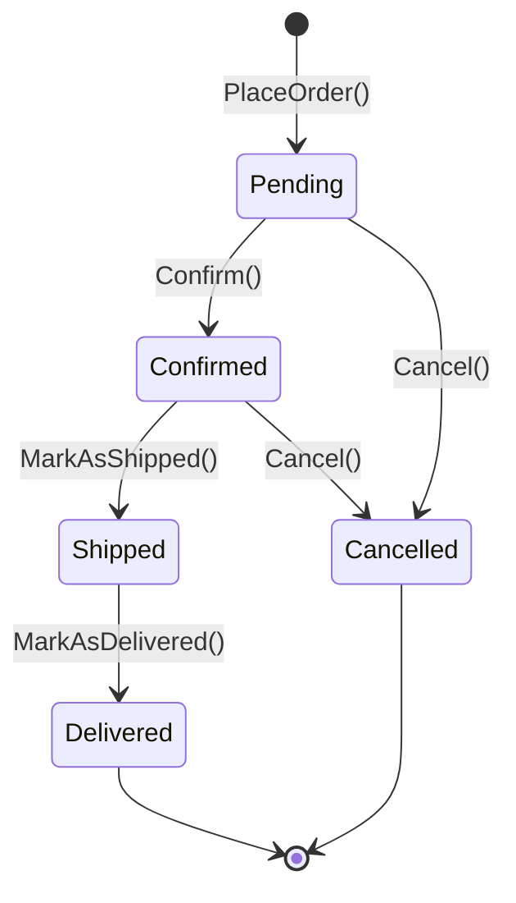

# Documento de Requerimientos — Microservicio Orders (ShopDemo)

| Campo | Detalle |
|:------|:--------|
| **Empresa** | Lite Thinking |
| **Curso** | Microservicios con .NET en Kubernetes y Entornos Multicloud |
| **Instructor** | Lcc. Gilberto Valentino Juárez Sánchez |
| **Contacto** | WhatsApp: +52 5614206660 |
| | E-mail: gilberto.juarez@gmail.com |
| | E-mail: lcc.gilberto.juarez@gmail.com |

**Sprints de referencia:** Sprint 1 (Domain Layer) + Sprint 2 (Infrastructure & Application)  
**Bounded Context:** Orders  
**Versión:** 1.0  
**Fecha:** Junio 2026

**Historias de usuario:** [HISTORIAS-USUARIO-ORDERS.md](./HISTORIAS-USUARIO-ORDERS.md)

---

## 1. Propósito

Este documento define los requerimientos funcionales y técnicos para que los alumnos implementen el **microservicio de pedidos (Orders)** dentro de la solución **ShopDemo**, siguiendo los mismos patrones arquitectónicos ya aplicados en el microservicio **Catalog**.

El microservicio Orders gestiona el ciclo de vida de los pedidos de clientes en una plataforma de e-commerce, sin acoplarse directamente al dominio de Catalog.

---

## 2. Objetivos de aprendizaje

Al completar esta implementación, el alumno será capaz de:

1. Modelar un **Aggregate Root** (`Order`) con entidades hijas y Value Objects.
2. Aplicar **Clean Architecture** con separación estricta de capas.
3. Implementar **CQRS** con MediatR (comandos y consultas).
4. Persistir el agregado con **EF Core + PostgreSQL** sin contaminar el dominio.
5. Publicar **Domain Events** mediante un puerto de infraestructura.
6. Exponer endpoints REST documentados con **Swagger**.
7. Containerizar el servicio con **Docker Compose**.

---

## 3. Contexto del sistema

```
┌─────────────────┐         ┌─────────────────┐
│  Catalog API    │         │   Orders API    │
│  Puerto: 8001   │         │   Puerto: 8002  │
│  BD: 5433       │         │   BD: 5434      │
└────────┬────────┘         └────────┬────────┘
         │                           │
         │    (futuro: Event Hubs)   │
         └───────────┬───────────────┘
                     ▼
            Comunicación asíncrona
```

| Microservicio | Base de datos | Puerto API | Puerto PostgreSQL (host) |
|---|---|---|---|
| Catalog | `ShopDemoCatalog` | `8001` | `5433` |
| **Orders** | **`ShopDemoOrders`** | **`8002`** | **`5434`** |

> **Nota:** Orders usa puertos distintos para evitar colisión con Catalog y con PostgreSQL local (5432).

---

## 4. Alcance

### 4.1 Dentro del alcance (MVP del curso)

| ID | Requerimiento |
|---|---|
| RF-01 | Crear un pedido (`PlaceOrder`) con al menos una línea |
| RF-02 | Consultar un pedido por Id |
| RF-03 | Cancelar un pedido con motivo |
| RF-04 | Confirmar un pedido (cambio de estado) |
| RF-05 | Persistir pedidos en PostgreSQL con EF Core |
| RF-06 | Publicar Domain Events al crear/confirmar/cancelar |
| RF-07 | Validar entrada con FluentValidation |
| RF-08 | Documentar API con Swagger |
| RF-09 | Desplegar con Docker Compose (API + PostgreSQL) |
| RF-10 | Aplicar migraciones EF Core al iniciar en Development |

### 4.2 Fuera del alcance (fases futuras)

- Integración real con Azure Event Hubs
- Outbox Pattern completo
- .NET Aspire AppHost
- Llamada HTTP síncrona a Catalog para validar stock (opcional como extensión)
- Kubernetes manifests
- Pagos, envíos y notificaciones

---

## 5. Lenguaje ubicuo (Ubiquitous Language)

| Término | Definición | No usar |
|---|---|---|
| **Order** | Pedido del cliente; agregado raíz | `Purchase`, `Sale` |
| **OrderLine** | Línea de pedido: producto + cantidad + precio snapshot | `OrderItem` (aceptable), `CartItem` |
| **CustomerId** | Identificador del cliente que realiza el pedido | `UserId` |
| **PlaceOrder** | Acto de registrar un nuevo pedido | `CreateOrder` |
| **OrderStatus** | Estado del ciclo de vida del pedido | `State`, `int status` |
| **OrderTotal** | Monto total calculado del pedido | `decimal total` |
| **ShippingAddress** | Dirección de entrega | `Address` genérico |

---

## 6. Modelo de dominio requerido

### 6.1 Agregado raíz: `Order`

```
Order (AggregateRoot<Guid>)
├── CustomerId         (Value Object)
├── ShippingAddress    (Value Object)
├── OrderStatus        (Value Object)
├── Money TotalAmount  (Value Object)
├── List<OrderLine>    (Entidades hijas)
├── DateTimeOffset CreatedAt
└── DateTimeOffset? LastUpdatedAt
```

### 6.2 Entidad hija: `OrderLine`

```
OrderLine (Entity<Guid>)
├── ProductId          (Guid — referencia externa a Catalog)
├── ProductName        (string — snapshot)
├── UnitPrice          (Money — snapshot al momento del pedido)
├── Quantity           (int)
└── LineTotal          (Money — calculado)
```

> **Decisión de diseño:** Orders guarda **snapshot** del nombre y precio del producto. No referencia el agregado `Product` de Catalog para mantener autonomía del bounded context.

### 6.3 Value Objects requeridos

| Value Object | Reglas de validación |
|---|---|
| `CustomerId` | Guid no vacío (`Guid.Empty` inválido) |
| `Money` | Monto ≥ 0; moneda ISO 3 letras (default `MXN`) |
| `OrderStatus` | Valores: `Pending`, `Confirmed`, `Shipped`, `Delivered`, `Cancelled` |
| `ShippingAddress` | Street, City, PostalCode, Country — todos requeridos |
| `Quantity` | Entero > 0 |

### 6.4 Máquina de estados



**Transiciones prohibidas:**

| Desde | Acción | Motivo |
|---|---|---|
| `Shipped` | `Cancel()` | El pedido ya fue enviado |
| `Delivered` | `Cancel()` | El pedido ya fue entregado |
| `Cancelled` | Cualquier modificación | Pedido cerrado |

### 6.5 Domain Events requeridos

| Evento | Cuándo se emite |
|---|---|
| `OrderPlacedDomainEvent` | Al crear el pedido (`PlaceOrder`) |
| `OrderConfirmedDomainEvent` | Al confirmar el pedido |
| `OrderCancelledDomainEvent` | Al cancelar el pedido |
| `OrderShippedDomainEvent` | Al marcar como enviado (opcional en MVP) |

### 6.6 Reglas de negocio (invariantes)

| ID | Regla |
|---|---|
| RN-01 | Un pedido debe tener **al menos una línea** |
| RN-02 | Todas las líneas deben usar la **misma moneda** |
| RN-03 | El total del pedido es la **suma de los LineTotal** |
| RN-04 | No se puede cancelar un pedido en estado `Delivered` |
| RN-05 | No se puede cancelar un pedido en estado `Shipped` |
| RN-06 | Solo pedidos en `Pending` pueden confirmarse |
| RN-07 | `Quantity` en cada línea debe ser mayor a cero |
| RN-08 | `ProductId` en cada línea no puede ser `Guid.Empty` |

---

## 7. Contratos de persistencia

### 7.1 `IOrderRepository` (definido en Domain)

Debe extender `IRepository<Order, Guid>` e incluir:

```csharp
Task<IReadOnlyList<Order>> GetByCustomerAsync(CustomerId customerId, CancellationToken ct = default);
Task<IReadOnlyList<Order>> GetByStatusAsync(OrderStatus status, int skip, int take, CancellationToken ct = default);
```

### 7.2 Tablas PostgreSQL esperadas

| Tabla | Descripción |
|---|---|
| `orders` | Agregado Order |
| `order_lines` | Líneas del pedido (relación 1:N) |
| `__EFMigrationsHistory` | Control de migraciones EF Core |

---

## 8. Casos de uso y endpoints API

### 8.1 Comandos (escritura)

| Caso de uso | HTTP | Ruta | Comando MediatR |
|---|---|---|---|
| Registrar pedido | `POST` | `/api/orders` | `PlaceOrderCommand` |
| Confirmar pedido | `POST` | `/api/orders/{id}/confirm` | `ConfirmOrderCommand` |
| Cancelar pedido | `POST` | `/api/orders/{id}/cancel` | `CancelOrderCommand` |

### 8.2 Consultas (lectura)

| Caso de uso | HTTP | Ruta | Query MediatR |
|---|---|---|---|
| Obtener pedido por Id | `GET` | `/api/orders/{id}` | `GetOrderByIdQuery` |
| Listar pedidos por cliente | `GET` | `/api/orders?customerId={guid}` | `GetOrdersByCustomerQuery` |

### 8.3 Payload de ejemplo — PlaceOrder

```json
{
  "customerId": "3fa85f64-5717-4562-b3fc-2c963f66afa6",
  "shippingAddress": {
    "street": "Av. Reforma 123",
    "city": "Ciudad de México",
    "postalCode": "06600",
    "country": "MX"
  },
  "lines": [
    {
      "productId": "7c9e6679-7425-40de-944b-e07fc1f90ae7",
      "productName": "Laptop Pro",
      "unitPrice": 1299.99,
      "currency": "MXN",
      "quantity": 1
    }
  ]
}
```

### 8.4 Respuesta esperada — OrderDto

```json
{
  "id": "a1b2c3d4-e5f6-7890-abcd-ef1234567890",
  "customerId": "3fa85f64-5717-4562-b3fc-2c963f66afa6",
  "status": "Pending",
  "totalAmount": 1299.99,
  "currency": "MXN",
  "shippingAddress": {
    "street": "Av. Reforma 123",
    "city": "Ciudad de México",
    "postalCode": "06600",
    "country": "MX"
  },
  "lines": [
    {
      "id": "...",
      "productId": "7c9e6679-7425-40de-944b-e07fc1f90ae7",
      "productName": "Laptop Pro",
      "unitPrice": 1299.99,
      "currency": "MXN",
      "quantity": 1,
      "lineTotal": 1299.99
    }
  ],
  "createdAt": "2026-06-11T20:00:00Z",
  "lastUpdatedAt": null
}
```

---

## 9. Requerimientos técnicos por capa

### 9.1 Proyectos de la solución

| Proyecto | Responsabilidad |
|---|---|
| `ShopDemo.Orders.Domain` | Agregados, VOs, eventos, `IOrderRepository` |
| `ShopDemo.Orders.Application` | Commands, Queries, DTOs, Behaviors, Ports |
| `ShopDemo.Orders.Infraestructure` | EF Core, repositorios, mensajería, DI |
| `ShopDemo.Orders.Api` | Controllers, middleware, Program.cs, Docker |

### 9.2 Regla de dependencias

```
Orders.Api → Orders.Infraestructure → Orders.Application → Orders.Domain → ShopDemo.Shared
```

### 9.3 Paquetes NuGet requeridos

| Proyecto | Paquetes |
|---|---|
| Orders.Application | `MediatR`, `FluentValidation`, `FluentValidation.DependencyInjectionExtensions` |
| Orders.Infraestructure | `Microsoft.EntityFrameworkCore`, `Npgsql.EntityFrameworkCore.PostgreSQL` |
| Orders.Api | `Swashbuckle.AspNetCore`, `Microsoft.EntityFrameworkCore.Design` |

### 9.4 Configuración de conexión

```json
{
  "ConnectionStrings": {
    "DefaultConnection": "Host=localhost;Port=5434;Database=ShopDemoOrders;Username=ShopDemo;Password=ShopDemo123"
  }
}
```

### 9.5 Docker Compose requerido

El alumno debe crear `ShopDemo.Orders.Api/docker-compose.yml` con:

- Servicio `orders-db` (PostgreSQL 16)
- Servicio `orders-service` (API .NET 10)
- Puerto host PostgreSQL: **5434**
- Puerto host API: **8002**
- Healthcheck con `pg_isready -U ShopDemo -d ShopDemoOrders`
- Archivo `.dockerignore` en la raíz del repo (ya existe)

---

## 10. Criterios de aceptación

### 10.1 Dominio

- [ ] `Order.PlaceOrder()` es la única forma de crear pedidos
- [ ] `Order.Cancel()` valida estados prohibidos
- [ ] `Order.Confirm()` solo funciona desde `Pending`
- [ ] Domain Events se levantan en cada cambio de estado relevante
- [ ] Value Objects invalidan datos incorrectos en construcción

### 10.2 Aplicación

- [ ] Handlers no contienen lógica de negocio (solo orquestan)
- [ ] FluentValidation valida comandos antes del handler
- [ ] DTOs nunca exponen el agregado directamente
- [ ] Pipeline MediatR incluye `ValidationBehavior`

### 10.3 Infraestructura

- [ ] `IOrderRepository` implementado con EF Core
- [ ] Migración inicial generada y aplicada
- [ ] `IDomainEventPublisher` registrado (logging en dev)
- [ ] `DatabaseInitializer` crea BD si no existe

### 10.4 API

- [ ] Swagger disponible en `/swagger` (Development)
- [ ] `POST /api/orders` retorna `201 Created`
- [ ] `GET /api/orders/{id}` retorna `200` o `404`
- [ ] Errores de dominio retornan `400 Bad Request`
- [ ] Errores de validación retornan `400` con detalle

### 10.5 Docker

- [ ] `docker compose up -d --build` levanta API y PostgreSQL
- [ ] Base de datos `ShopDemoOrders` visible en pgAdmin (puerto **5434**)
- [ ] Tablas `orders` y `order_lines` creadas tras primer request o migrate

---

## 11. Entregables del alumno

| # | Entregable |
|---|---|
| 1 | Código fuente en los 4 proyectos Orders.* |
| 2 | Migración EF Core `InitialCreate` |
| 3 | `docker-compose.yml` y `Dockerfile` |
| 4 | Captura de Swagger con endpoints funcionando |
| 5 | Captura de pgAdmin mostrando `ShopDemoOrders` |
| 6 | Respuestas breves a las preguntas de reflexión (sección 12) |


```
