# 02 — Arquitecturas de software

## Objetivo de este capítulo

Como desarrollador junior probablemente has visto proyectos con carpetas `Controllers`, `Services`, `Models` y `Data`. Eso ya es una forma de arquitectura, aunque no siempre esté bien definida. Aquí aprenderás **por qué** existen distintos estilos, **qué problema resuelve cada uno** y **cómo se ven en diagrama**.

Asumimos que ya sabes programar en C#, crear APIs REST con HTTP y trabajar con bases de datos SQL. Si has publicado una aplicación en IIS o con `dotnet run`, ya tienes la base para entender por qué la arquitectura importa más allá de "organizar carpetas".

Conceptos que dominarás:

- Diferencia entre monolito, monolito modular y microservicios.
- El anti-patrón *distributed monolith* y por qué ocurre.
- Arquitectura en capas y el riesgo del modelo anémico de dominio.
- Clean Architecture (todos los anillos) e inversión de dependencias.
- Arquitectura hexagonal (puertos y adaptadores).
- Event-driven, serverless, BFF y API Gateway.
- Un árbol de decisión para elegir arquitectura con criterio.

> **Cómo leer este capítulo:** cada concepto sigue la misma estructura: definición formal → explicación con analogías → diagrama → cuándo usarlo. No te saltes las definiciones; son la base del vocabulario que usarás en equipos reales.

---

## 1. ¿Qué es la arquitectura de software?

### Definición formal

La **arquitectura de software** es la **estructura de alto nivel** de un sistema: sus componentes principales, las responsabilidades de cada uno, cómo se comunican y las **reglas que limitan** cómo puede evolucionar el código (dependencias, despliegue, escalado).

### Explicación desarrollada

Piensa en la arquitectura de un edificio: no describe cada tornillo, pero define si hay un sótano, cuántos pisos hay y dónde pasan las tuberías. En software, la arquitectura responde preguntas concretas:

- ¿Dónde vive la lógica de negocio?
- ¿Quién puede llamar a quién?
- ¿Cómo se despliega y escala el sistema?
- ¿Qué pasa si cambiamos la base de datos o el framework web?

**Importante:** arquitectura ≠ tecnología. Puedes hacer microservicios en .NET o en Java; puedes hacer Clean Architecture con o sin Docker. La arquitectura es una **decisión de diseño**, no un producto comercial.

Para un junior, la arquitectura también define **dónde pones el breakpoint** cuando depuras: en un monolito bien modular, un flujo de negocio puede seguirse en un solo proceso; en microservicios, ese mismo flujo cruza varios servicios y necesitas trazas distribuidas (capítulo 10).

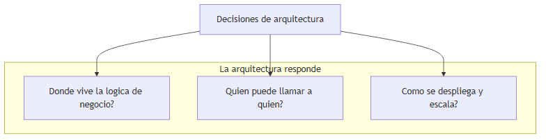

### Cuándo pensar en arquitectura (y cuándo no obsesionarse)

| Situación | ¿Priorizar arquitectura? |
|---|---|
| Proyecto nuevo con reglas de negocio complejas | Sí — define límites desde el inicio |
| CRUD interno de 5 pantallas, equipo de 2 personas | No — capas simples bastan |
| El código ya funciona pero nadie entiende las dependencias | Sí — refactorizar límites antes de añadir features |
| Prototipo desechable de una semana | No — velocidad sobre perfección |

> **Nota del instructor:** no existe "la arquitectura perfecta". Existe la arquitectura **adecuada al contexto**: tamaño del equipo, madurez del dominio, requisitos de escala y tolerancia al riesgo operativo.

---

## 2. Monolito

### Definición formal

Un **monolito** es una aplicación que se **despliega como una sola unidad** ejecutable: un sitio en IIS, un ejecutable `dotnet`, una imagen Docker que contiene toda la aplicación, o un único artefacto en un pipeline de CI/CD.

### Explicación desarrollada

Imagina un restaurante donde **una sola cocina** prepara entrantes, platos principales y postres. Todo sale por la misma puerta. Si la cocina cierra, cierra todo el restaurante. Si necesitas más capacidad en hora punta, amplías toda la cocina, no solo la sección de postres.

En C# y ASP.NET, un monolito típico es **una solución Visual Studio** con un proyecto `Api` que referencia `Application`, `Domain` e `Infrastructure`. Al publicar, generas **un solo paquete** que contiene todos los módulos.

Ventajas reales para juniors y equipos pequeños:

- **Depuración simple:** un breakpoint en un controller puede seguir todo el flujo hasta la base de datos.
- **Transacciones sencillas:** un `SaveChanges()` en Entity Framework puede confirmar pedido, líneas e inventario en una sola transacción ACID.
- **Un solo despliegue:** no coordinas cinco pipelines ni cinco versiones compatibles.
- **Menos infraestructura:** no necesitas Kubernetes, service mesh ni bus de mensajes desde el día uno.

Desventajas cuando el sistema crece sin disciplina:

- El código se mezcla si no hay reglas de dependencia entre módulos.
- Un bug en el módulo de reportes puede tumbar toda la API.
- Escalar "solo la parte de búsqueda" implica escalar **todo** el monolito.
- Un solo equipo grande compite por el mismo repositorio y los releases se vuelven lentos.

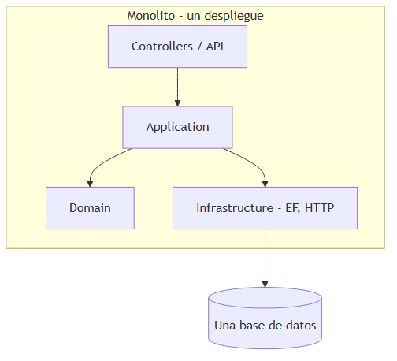

### Cuándo usar monolito (y cuándo no)

| Usa monolito cuando… | Evita asumir que "monolito = malo" cuando… |
|---|---|
| Equipo pequeño (1–8 devs) | El dominio es simple CRUD sin reglas complejas |
| Dominio aún poco entendido | Necesitas validar producto antes de dividir |
| MVP o producto nuevo | — |
| Necesitas transacciones ACID frecuentes entre módulos | — |

| Considera dejar el monolito cuando… | Señal de alerta |
|---|---|
| Equipos distintos bloquean releases entre sí | Un cambio en catálogo obliga a desplegar todo |
| Necesitas escalar módulos con perfiles de carga muy distintos | Reportes consumen CPU y afectan al checkout |
| Partes del sistema tienen ciclos de vida diferentes | Módulo legacy estable vs módulo experimental |

> **Nota del instructor:** la industria redescubrió que **empezar con monolito** es sensato. Los microservicios son una respuesta a problemas **organizacionales y de escala**, no un premio por escribir código "más moderno".

---

## 3. Monolito modular

### Definición formal

Un **monolito modular** es una aplicación que se **despliega como una sola unidad**, pero cuyo código interno está **dividido en módulos** con límites claros, dependencias controladas y contratos explícitos entre ellos (interfaces, eventos internos, identificadores compartidos).

### Explicación desarrollada

Vuelve al restaurante: sigue habiendo **una cocina y una puerta de salida** (un despliegue), pero ahora hay **estaciones separadas** — pastelería, parrilla, ensaladas — con reglas estrictas. La estación de postres no entra al almacén de la parrilla directamente; pide ingredientes mediante un procedimiento acordado.

En .NET, un monolito modular puede verse así:

```
src/
  Modules/
    Catalog/
      Catalog.Domain/
      Catalog.Application/
      Catalog.Infrastructure/
    Orders/
      Orders.Domain/
      ...
  Api/   ← ensambla todo en un host
```

Cada módulo expone solo lo necesario al exterior. Los módulos se comunican por **interfaces públicas** o **eventos de dominio in-process**, nunca accediendo directamente a las clases internas del otro.

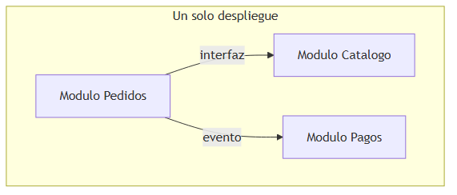

> *Fuente editable (Mermaid):* [02-monolito-modular.mermaid](./assets/diagrams/02-monolito-modular.mermaid)

La diferencia con un monolito "Big Ball of Mud" es **disciplina**: si el módulo Pedidos necesita un producto, llama a `ICatalogService.GetProduct(id)`, no hace `JOIN` directo a tablas del módulo Catálogo ni instancia `ProductRepository` del otro módulo.

### Cuándo usar monolito modular (y cuándo no)

| Usa monolito modular cuando… | Señal de que necesitas más |
|---|---|
| Producto nuevo que puede crecer | Equipos de 15+ personas compitiendo en el mismo repo |
| Quieres preparar futuros bounded contexts sin operaciones distribuidas | Necesitas escalar un módulo de forma independiente |
| Reglas de negocio moderadas o altas dentro de un solo proceso | Fallos en un módulo no deben afectar disponibilidad de otros |

| Evita complicar con módulos cuando… | Alternativa |
|---|---|
| Proyecto CRUD de 3 semanas | Monolito en capas simple |
| No hay acuerdo del equipo sobre límites | Primero DDD estratégico (capítulo 03) |

> **Nota del instructor:** la mayoría de productos nuevos deberían **empezar aquí**. Es el punto dulce entre simplicidad operativa y preparación para dividir más adelante si hace falta.

---

## 4. Microservicios

### Definición formal

Un **microservicio** es un servicio **autónomo** que: (1) implementa **una capacidad de negocio acotada**; (2) se **despliega de forma independiente**; (3) es **dueño de sus datos** (base de datos propia, no compartida); (4) se comunica con otros **solo por red** (HTTP, gRPC, cola de mensajes).

### Explicación desarrollada

Imagina un centro comercial donde cada tienda es **independiente**: tiene su propia caja registradora, su inventario y su horario. Si la tienda de zapatos cierra por reforma, la de libros puede seguir abierta. Pero coordinar una devolución que cruza dos tiendas requiere **procedimientos acordados** (APIs, eventos), no abrir un cajón compartido.

Para un junior en C#, un microservicio es típicamente:

- Un proyecto ASP.NET Core **separado** con su propio `Program.cs`.
- Su **propio repositorio Git** o al menos su propio pipeline de CI/CD.
- Su **propia base de datos** (idealmente; ver anti-patrón más adelante).
- Contratos HTTP o mensajes documentados para otros servicios.

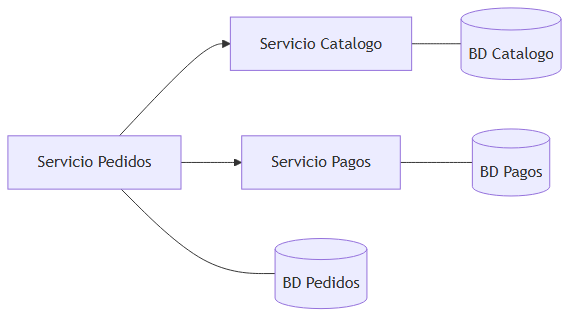

> *Fuente editable (Mermaid):* [02-microservicios.mermaid](./assets/diagrams/02-microservicios.mermaid)

Comparación directa con monolito modular:

| Aspecto | Monolito modular | Microservicios |
|---|---|---|
| Despliegues | 1 | N (uno por servicio) |
| Bases de datos | 1 o pocas, módulos lógicos | 1 por servicio (ideal) |
| Comunicación interna | Llamada a método / evento in-process | Red (latencia, fallos) |
| Transacciones ACID | Entre módulos en una BD | Solo dentro de cada servicio |
| Complejidad operativa | Baja | Alta (K8s, bus, trazas, secretos) |
| Equipos | Un equipo o pocos | Equipos autónomos por servicio |

### Cuándo usar microservicios (y cuándo no)

| Usa microservicios cuando… | No uses microservicios cuando… |
|---|---|
| Equipos autónomos por área de negocio | Equipo pequeño sin experiencia en ops |
| Releases independientes son requisito de negocio | Dominio aún confuso — dividirás mal |
| Escala diferencial por servicio | Busca "código más limpio" sin dolor organizacional |
| Tolerancia a consistencia eventual entre servicios | Necesitas transacciones globales frecuentes |

> **Nota del instructor:** microservicios **no** garantizan código limpio. Puedes tener un monolito excelente y microservicios terribles. La decisión es de **límites organizacionales y operativos**, no de moda.

---

## 5. Anti-patrón: distributed monolith

### Definición formal

Un **distributed monolith** (*monolito distribuido*) es un sistema desplegado como **varios servicios separados** que mantiene **acoplamiento fuerte**: base de datos compartida, despliegues coordinados obligatorios, llamadas síncronas en cadena o contratos tan rígidos que un cambio en un servicio rompe a todos.

### Explicación desarrollada

Es el peor de los dos mundos: tienes la **complejidad operativa** de microservicios (red, contenedores, observabilidad) pero **ninguna autonomía real**. Es como tener tres tiendas en el centro comercial que comparten **una sola caja registradora** y **un solo almacén**: si cambias el layout del almacén, las tres tiendas deben cerrar el mismo día.

Señales típicas que verás como junior:

- Tres servicios desplegados en Kubernetes, pero **todos leen la misma tabla** `Products`.
- Para desplegar Pedidos, **obligatoriamente** despliegas Catálogo en la misma ventana.
- Una cadena `A → B → C → D` síncrona donde si B tarda 5 segundos, todo el checkout falla.
- "Microservicios" que comparten la misma librería de entidades EF Core con las mismas clases `Order` y `Product`.

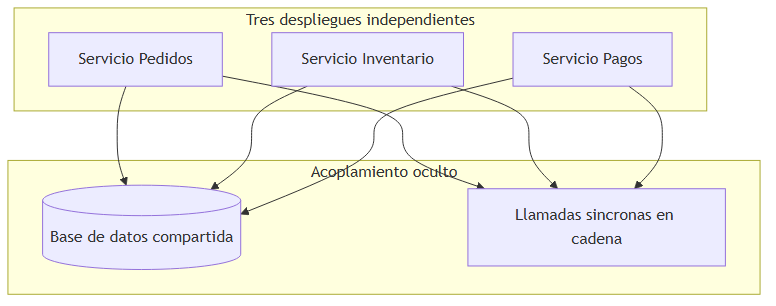

> *Fuente editable (Mermaid):* [02-distributed-monolith.mermaid](./assets/diagrams/02-distributed-monolith.mermaid)

### Cuándo sospechar distributed monolith (y cómo evitarlo)

| Señal de alerta | Qué hacer |
|---|---|
| Varios servicios, una sola BD | Separar datos por bounded context; compartir solo IDs |
| Despliegues "atómicos" de 5 servicios | Revisar contratos; usar versionado y compatibilidad hacia atrás |
| Latencia = suma de N llamadas HTTP | Introducir async, caché, o fusionar servicios mal partidos |
| Misma DLL de entidades en todos los servicios | DTOs y eventos por contrato, no clases compartidas |

| Si detectas distributed monolith… | Opciones |
|---|---|
| El acoplamiento es de datos | Migrar a BD por servicio gradualmente |
| El acoplamiento es de despliegue | Fusionar servicios o extraer librerías compartidas mínimas |
| El acoplamiento es de red síncrona | Eventos async + sagas (capítulo 04) |

> **Nota del instructor:** antes de añadir el servicio número cuatro, pregúntate: "¿Puedo desplegar este servicio un martes a las 3 AM sin despertar a otro equipo?" Si la respuesta es no, no tienes microservicios reales.

---

## 6. Arquitectura en capas (Layered Architecture)

### Definición formal

La **arquitectura en capas** organiza el software en **niveles verticales** con responsabilidades distintas, donde cada capa **solo depende de capas inferiores** (en la versión clásica estricta).

### Explicación desarrollada

Piensa en un edificio de oficinas: planta baja (recepción), pisos intermedios (trabajo), sótano (archivos). Un visitante no entra directamente al sótano; pasa por recepción. En ASP.NET Core:

| Capa | Responsabilidad | Ejemplo típico |
|---|---|---|
| **Presentación** | Recibir HTTP, validar input, devolver JSON | Controllers, Minimal APIs, filtros |
| **Aplicación** | Orquestar casos de uso, coordinar flujo | Handlers MediatR, application services |
| **Dominio** | Reglas de negocio puras | Entidades, value objects, eventos |
| **Infraestructura** | Detalles técnicos externos | DbContext, HttpClient, colas, email |

El flujo típico de una petición `POST /orders`:

1. **Controller** recibe JSON, lo mapea a un comando.
2. **Application** ejecuta el caso de uso "crear pedido".
3. **Domain** valida reglas (cantidad > 0, producto existe).
4. **Infrastructure** persiste en SQL con EF Core.

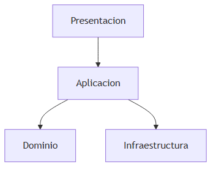

> *Fuente editable (Mermaid):* [02-layered.mermaid](./assets/diagrams/02-layered.mermaid)

**Problema clásico:** en muchos proyectos reales, la capa de dominio es **delgada o inexistente**. Toda la lógica vive en `OrderService`. Eso nos lleva al modelo anémico (siguiente sección).

### Cuándo usar capas (y cuándo evolucionar)

| Usa capas cuando… | Evoluciona hacia Clean/Hexagonal cuando… |
|---|---|
| CRUD simple, equipo junior | Reglas de negocio crecen y se repiten en servicios |
| Necesitas estructura clara sin ceremonia | Cambiar de EF a otro ORM afecta controllers |
| Tiempo de entrega es crítico | Tests de dominio sin BD son imposibles |

> **Nota del instructor:** capas **no son** sinónimo de calidad. Un proyecto en capas con `Services` de 2000 líneas es peor que un monolito modular con dominio rico.

---

## 7. Modelo anémico de dominio (Anemic Domain Model)

### Definición formal

El **modelo anémico de dominio** es un anti-patrón donde las **entidades** (`Order`, `Product`) son contenedores de datos con propiedades `{ get; set; }` **sin comportamiento**, y **toda la lógica de negocio** reside en clases de servicio externas (`OrderService`, `ProductService`).

### Explicación desarrollada

Imagina un contrato legal donde las cláusulas están en blanco y un abogado externo interpreta todo cada vez. Cualquiera puede modificar el documento sin pasar por validación. En código:

```csharp
// Anémico — cualquiera puede hacer esto desde cualquier sitio
order.Status = OrderStatus.Confirmed;
order.Total = -100;
```

La lógica que debería vivir en `Order.Confirm()` está dispersa en `OrderService.ConfirmOrder()`, el controller y quizá un job nocturno. **Nadie garantiza** que las invariantes se cumplan en todos los caminos.

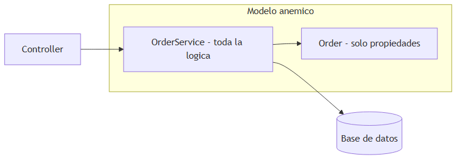

> *Fuente editable (Mermaid):* [02-anemic-domain.mermaid](./assets/diagrams/02-anemic-domain.mermaid)

**Contraste con dominio rico:**

```csharp
// Rico — la entidad protege sus reglas
public void Confirm()
{
    if (Status != OrderStatus.Pending)
        throw new InvalidOperationException("Only pending orders can be confirmed.");
    if (!_lines.Any())
        throw new InvalidOperationException("Cannot confirm empty order.");
    Status = OrderStatus.Confirmed;
    RaiseDomainEvent(new OrderConfirmed(Id));
}
```

### Cuándo aceptar modelo anémico (y cuándo combatirlo)

| Aceptable temporalmente cuando… | Debes enriquecer el dominio cuando… |
|---|---|
| CRUD de administración interna | Reglas de negocio cambian seguido |
| Prototipo rápido | Bugs por estados inválidos en BD |
| Sin experto de dominio disponible | Múltiples servicios repiten las mismas validaciones |

| Síntoma | Acción |
|---|---|
| `if (order.Status == ...)` repetido en 10 archivos | Mover lógica a métodos de entidad o aggregate root |
| Tests solo de integración | Extraer dominio testeable sin BD |

> **Nota del instructor:** EF Core **no obliga** a modelos anémicos. Puedes tener propiedades privadas, constructores protegidos y métodos de negocio. El anemic model es una **decisión de equipo**, no una limitación del ORM.

---

## 8. Clean Architecture (Arquitectura limpia)

### Definición formal

**Clean Architecture** (Robert C. Martin, "Uncle Bob") organiza el software en **anillos concéntricos** donde las **dependencias del código fuente solo apuntan hacia adentro**. El núcleo (dominio) **no conoce** frameworks, bases de datos ni detalles de UI.

### Explicación desarrollada

Imagina un **nuez** (walnut): la cáscara externa cambia (ASP.NET hoy, otro framework mañana), pero el núcleo comestible (reglas de negocio) permanece igual. Cada anillo exterior **adapta** el mundo exterior al interior, nunca al revés.

#### Los cuatro anillos (de fuera a dentro)

| Anillo | Nombre | Contenido | Depende de |
|---|---|---|---|
| 4 (exterior) | **Frameworks & Drivers** | ASP.NET, EF Core, SQL Server, RabbitMQ, archivos | Interfaces definidas dentro |
| 3 | **Interface Adapters** | Controllers, repositorios concretos, gateways HTTP, mappers | Application y Domain |
| 2 | **Application** | Casos de uso, commands/queries, handlers, DTOs de aplicación | Domain |
| 1 (centro) | **Domain (Enterprise)** | Entidades, value objects, eventos de dominio, interfaces de repositorio | **Nada externo** |

Regla de oro:

> **Las dependencias del código fuente solo apuntan hacia adentro.** Nada en el centro conoce frameworks externos.

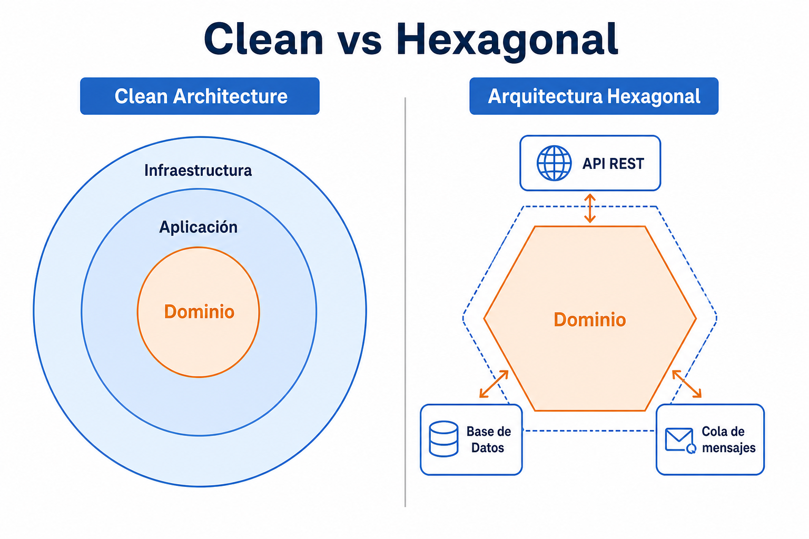

La imagen anterior contrasta Clean (anillos) con Hexagonal (puertos simétricos). Comparten el mismo principio: **proteger el dominio**.

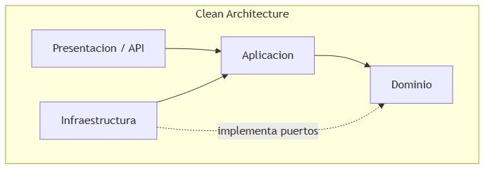

> *Fuente editable (Mermaid):* [02-clean-architecture.mermaid](./assets/diagrams/02-clean-architecture.mermaid)

#### Ejemplo pedagógico: cambiar de SQL Server a MongoDB

- **Sin Clean:** modificas controllers, servicios y queries EF en cascada. Riesgo de romper reglas de negocio mezcladas con SQL.
- **Con Clean:** el dominio define `IOrderRepository`. Solo cambias `EfOrderRepository` por `MongoOrderRepository` en Infrastructure. Los handlers de aplicación **no cambian**.

#### Estructura de carpetas típica en .NET

```
src/
  Domain/           ← entidades, IOrderRepository, eventos
  Application/      ← CreateOrderCommand, CreateOrderHandler
  Infrastructure/   ← EfOrderRepository, DbContext
  Api/              ← Program.cs, controllers
```

### Cuándo usar Clean Architecture (y cuándo no)

| Usa Clean cuando… | Evita over-engineering cuando… |
|---|---|
| Reglas de negocio complejas y longevas | CRUD de 4 tablas sin lógica |
| Esperas cambiar infraestructura (BD, bus) | Equipo sin experiencia — empieza con capas |
| Quieres tests de dominio sin BD | El "dominio" es solo DTOs |

| Trade-off | Detalle |
|---|---|
| Más proyectos y archivos | Curva de aprendizaje para juniors |
| Mappers entre capas | Tiempo inicial mayor, mantenimiento menor a largo plazo |

> **Nota del instructor:** Clean no significa "4 proyectos obligatorios". Significa **dependencias hacia adentro**. Puedes empezar con 2 proyectos (`Core` + `Infrastructure`) y separar cuando duela.

---

## 9. Inversión de dependencias (Dependency Inversion Principle)

### Definición formal

El **Principio de Inversión de Dependencias (DIP)**, la "D" de SOLID, establece que: (1) los módulos de **alto nivel** no deben depender de módulos de **bajo nivel**; ambos deben depender de **abstracciones**; (2) las abstracciones no deben depender de detalles; los detalles deben depender de abstracciones.

### Explicación desarrollada

Sin inversión, tu `CreateOrderHandler` (alto nivel) importa directamente `EfOrderRepository` (bajo nivel). Si mañana cambias EF por Dapper, tocas el handler — que debería preocuparse solo de **orquestar el caso de uso**.

Con inversión:

1. El **dominio** define `IOrderRepository` con `GetById`, `Add`, `Save`.
2. **Infrastructure** implementa `EfOrderRepository : IOrderRepository`.
3. El **handler** recibe `IOrderRepository` por constructor (inyección de dependencias).

La flecha de **compilación** va de Infrastructure hacia Domain (infra implementa la interfaz del dominio). En **runtime**, el handler usa la interfaz y DI resuelve la implementación concreta.

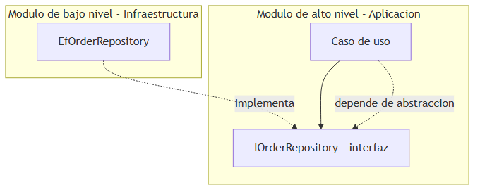

> *Fuente editable (Mermaid):* [02-dependency-inversion.mermaid](./assets/diagrams/02-dependency-inversion.mermaid)

En `Program.cs` registras la implementación:

```csharp
builder.Services.AddScoped<IOrderRepository, EfOrderRepository>();
```

### Cuándo aplicar DIP (y cuándo no)

| Aplica DIP cuando… | Puede ser excesivo cuando… |
|---|---|
| Múltiples implementaciones posibles (SQL, mock, cache) | Script de una sola vez |
| Tests unitarios del dominio sin BD | Prototipo desechable |
| Infraestructura cambia más rápido que negocio | Abstracción sobre abstracción sin segundo implementador |

> **Nota del instructor:** DIP es el **mecanismo** que hace posible Clean y Hexagonal. Sin interfaces en el dominio, solo tienes capas con referencias directas — "capas en papel".

---

## 10. Arquitectura hexagonal (Ports & Adapters)

### Definición formal

La **arquitectura hexagonal**, propuesta por Alistair Cockburn, coloca el **núcleo de la aplicación** (dominio + lógica de aplicación) en el centro de un hexágono. Todo lo externo se conecta mediante **puertos** (interfaces) e **adaptadores** (implementaciones concretas).

### Explicación desarrollada

Clean enfatiza **anillos concéntricos**; Hexagonal enfatiza **simetría entre entrada y salida**. No hay "capa superior" e "inferior" — hay **dentro** (negocio) y **fuera** (mundo real).

| Término | Significado |
|---|---|
| **Puerto** | Interfaz: contrato de entrada (`IPlaceOrderUseCase`) o salida (`IOrderRepository`, `IPaymentGateway`) |
| **Adaptador de entrada (driving / primario)** | Quien **invoca** la app: REST controller, consumer de cola, consola, test |
| **Adaptador de salida (driven / secundario)** | Lo que la app **usa**: BD, bus de mensajes, API de pago, sistema de archivos |

Analogía: el hexágono es un **enchufe universal**. Puedes conectar un adaptador REST, uno gRPC o uno de cola en el mismo puerto de entrada. Del lado de salida, cambias la BD sin tocar el núcleo.

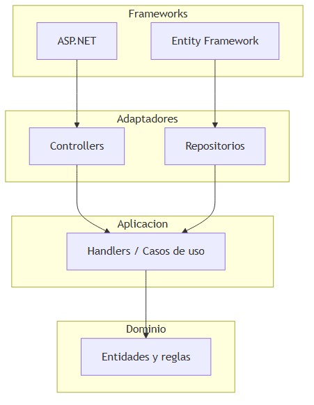

> *Fuente editable (Mermaid):* [02-hexagonal.mermaid](./assets/diagrams/02-hexagonal.mermaid)

#### Clean vs Hexagonal — ¿son lo mismo?

En la práctica profesional, **comparten el mismo principio**: el dominio no depende de infraestructura. Clean nombra anillos; Hexagonal nombra puertos/adaptadores. Muchos proyectos .NET usan ambos términos para la misma estructura:

```
src/
  Domain/           ← entidades, puertos de salida (interfaces repo)
  Application/      ← casos de uso, puertos de entrada
  Infrastructure/   ← adaptadores EF, HTTP, colas
  Api/              ← adaptador REST
```

### Cuándo usar Hexagonal (y cuándo no)

| Usa Hexagonal cuando… | Considera alternativa más simple cuando… |
|---|---|
| Múltiples formas de invocar la app (HTTP + cola + CLI) | Solo una API REST sin planes de cambio |
| Dominio complejo que debe testearse aislado | CRUD sin reglas |
| Equipo acordó vocabulario ports/adapters | Confusión sobre "¿dónde va este archivo?" |

> **Nota del instructor:** no discutas horas "Clean vs Hexagonal". Elige **un nombre** en el equipo y aplica **inversión de dependencias** con consistencia.

---

## 11. Arquitectura orientada a eventos (Event-Driven Architecture)

### Definición formal

La **arquitectura orientada a eventos (EDA)** es un estilo donde los componentes se comunican publicando y consumiendo **eventos** — notificaciones de que **algo ya ocurrió** — en lugar de invocarse directamente con request/response acoplado.

### Explicación desarrollada

En un restaurante tradicional (síncrono), el camarero espera en cocina hasta que el plato esté listo. En event-driven, el cocinero **grita "¡Pedido 42 listo!"** y quien necesite el plato (camarero, pantalla de recogida, app de repartidor) **reacciona** sin que cocina conozca a todos los consumidores.

Un **evento de integración** típico: `OrderCreated { orderId, customerId, total, occurredAt }`. El servicio Pedidos lo publica al bus. Inventario reserva stock; Analytics actualiza métricas; Notificaciones envía email. **Pedidos no conoce** a esos consumidores.

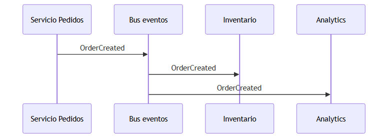

> *Fuente editable (Mermaid):* [02-event-driven.mermaid](./assets/diagrams/02-event-driven.mermaid)

**Ventajas:**

- **Extensibilidad:** añadir Analytics no requiere modificar Pedidos.
- **Desacoplamiento temporal:** el productor no espera al consumidor.
- **Resiliencia parcial:** si Analytics cae, el pedido igual se creó (con consistencia eventual).

**Desventajas:**

- Flujo más difícil de seguir para quien empieza ("¿quién procesa este evento?").
- Requiere **observabilidad** (logs, trazas, correlation ID — capítulos 04 y 09).
- **Consistencia eventual** entre servicios — no es bug si el negocio lo acepta.

### Cuándo usar event-driven (y cuándo no)

| Usa event-driven cuando… | Prefiere síncrono cuando… |
|---|---|
| Varios sistemas deben reaccionar al mismo hecho | Necesitas respuesta inmediata con datos actualizados de otro servicio |
| Picos de carga — la cola absorbe ráfagas | Flujo simple de 2 servicios |
| Equipos autónomos publican/consumen contratos | Debugging lineal es prioridad absoluta |

| Patrón relacionado | Dónde profundizar |
|---|---|
| Outbox pattern | Capítulo 04 |
| Event sourcing | Lectura avanzada; no obligatorio para juniors |

> **Nota del instructor:** event-driven **no reemplaza** REST. Conviven: REST para consultas y comandos síncronos; eventos para notificaciones y procesos largos.

---

## 12. Serverless (computación sin servidor)

### Definición formal

**Serverless** es un modelo de ejecución cloud donde el desarrollador **no administra servidores**; el proveedor asigna recursos automáticamente por invocación, escala (incluso a **cero instancias**) y factura por **uso** (ejecuciones, duración, memoria).

### Explicación desarrollada

"No hay servidores" es marketing: los servidores existen, pero **no son tu problema**. Es como usar taxi en lugar de comprar coche: pagas por viaje, no por garaje ni revisiones.

Ejemplos: **Azure Functions**, **AWS Lambda**, **Google Cloud Functions**.

Una función típica en C#:

- **Trigger HTTP:** webhook que recibe JSON y responde 200.
- **Trigger Timer:** job que cada noche genera un reporte.
- **Trigger cola:** procesa cada mensaje de una cola SQS/Service Bus.

Conceptos clave:

- **Cold start:** primera invocación tras inactividad tarda más (arranque del runtime .NET).
- **Timeout:** límites estrictos (minutos, no horas).
- **Stateless:** no guardes estado en memoria entre invocaciones; usa BD o blob.

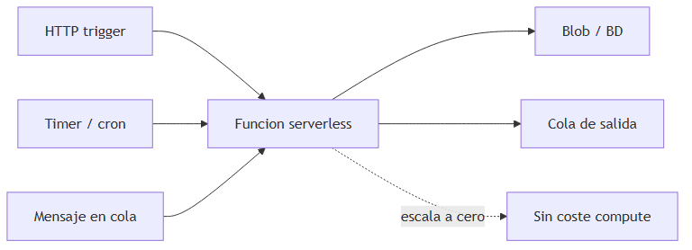

> *Fuente editable (Mermaid):* [02-serverless.mermaid](./assets/diagrams/02-serverless.mermaid)

### Cuándo usar serverless (y cuándo no)

| Usa serverless cuando… | Evita serverless cuando… |
|---|---|
| Tareas cortas, event-driven | Procesos de horas o conexiones WebSocket persistentes |
| Tráfico impredecible con picos | API con tráfico constante 24/7 (App Service puede ser más barato) |
| ETL ligero, redimensionar imágenes, webhooks | Necesitas estado en memoria entre requests |
| Prototipos rápidos sin infra | Latencia de cold start inaceptable para UX |

> **Nota del instructor:** serverless encaja en **tareas auxiliares** dentro de una arquitectura mayor, no como reemplazo automático de toda tu API.

---

## 13. Backend for Frontend (BFF)

### Definición formal

El patrón **Backend for Frontend (BFF)** consiste en crear **APIs backend dedicadas** a cada tipo de cliente (web SPA, app móvil, smart TV), que **agregan y adaptan** datos de varios microservicios al formato que ese cliente necesita.

### Explicación desarrollada

Imagina un centro comercial con **mostradores distintos** para clientes online y clientes en tienda física. Ambos venden los mismos productos, pero el online muestra reseñas y recomendaciones; la tienda muestra stock local y tallas en percha. Un solo mostrador genérico obligaría a cada cliente a filtrar información irrelevante.

Sin BFF, la app móvil llama a 5 microservicios, combina JSON en el cliente y expone lógica de negocio en JavaScript. Con BFF:

- **BFF Web** expone `/dashboard` con datos ya agregados para la SPA.
- **BFF Mobile** expone endpoints optimizados (menos campos, menos round-trips).
- Los microservicios de negocio **no cambian** por cada tipo de UI.

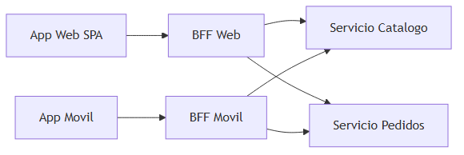

> *Fuente editable (Mermaid):* [02-bff.mermaid](./assets/diagrams/02-bff.mermaid)

### Cuándo usar BFF (y cuándo no)

| Usa BFF cuando… | No necesitas BFF cuando… |
|---|---|
| Varios clientes con necesidades de datos distintas | Un solo cliente web simple |
| Quieres evitar lógica de agregación en el frontend | Pocos microservicios, respuestas ya adecuadas |
| Equipos frontend y backend separados por canal | Monolito que ya sirve el JSON correcto |

| Riesgo | Mitigación |
|---|---|
| Duplicar lógica entre BFFs | Extraer librerías compartidas de cliente HTTP, no reglas de negocio |
| BFF se convierte en "mini monolito" | BFF solo orquesta y mapea; reglas viven en servicios de dominio |

> **Nota del instructor:** un BFF **no debe** contener reglas de negocio core. Si `CalculateDiscount` vive en el BFF, lo has puesto en el sitio equivocado.

---

## 14. API Gateway

### Definición formal

Un **API Gateway** es un **punto de entrada único** delante de múltiples servicios backend que centraliza preocupaciones transversales: enrutamiento, autenticación, rate limiting, SSL termination, transformación de protocolos y agregación básica.

### Explicación desarrollada

Es el **portero del edificio**: los visitantes no entran por la puerta de cada departamento. El portero verifica identidad, registra la visita y dirige al piso correcto. Los departamentos (microservicios) no exponen puertas directas a internet.

Funciones típicas:

- **Enrutamiento:** `/catalog/*` → servicio Catálogo; `/orders/*` → servicio Pedidos.
- **Autenticación JWT:** valida token una vez; servicios internos confían en headers o mTLS.
- **Rate limiting:** protege contra abuso (100 req/min por API key).
- **Versionado:** `/v1/` y `/v2/` en un solo dominio público.
- **Observabilidad:** genera o propaga `X-Correlation-Id`.

Ejemplos de productos: **Azure API Management**, **AWS API Gateway**, **Kong**, **NGINX Ingress** en Kubernetes.

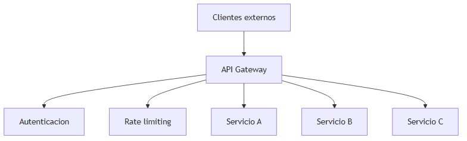

> *Fuente editable (Mermaid):* [02-api-gateway.mermaid](./assets/diagrams/02-api-gateway.mermaid)

#### BFF vs API Gateway — ¿son lo mismo?

| Componente | Rol |
|---|---|
| **API Gateway** | Entrada **global**, seguridad, enrutamiento a servicios |
| **BFF** | Adaptación **por tipo de cliente**, agregación de respuestas |

A menudo coexisten: Cliente → API Gateway → BFF Web → Microservicios.

### Cuándo usar API Gateway (y cuándo no)

| Usa API Gateway cuando… | Puede ser prematuro cuando… |
|---|---|
| Múltiples microservicios expuestos externamente | Un solo servicio monolítico |
| Necesitas auth centralizada y rate limiting | Tráfico interno solo en red privada |
| Clientes externos no deben conocer topología interna | Equipo sin capacidad de operar otro componente |

> **Nota del instructor:** no pongas lógica de negocio en el gateway. Si el gateway calcula precios, has creado un distributed monolith en la puerta.

---

## 15. Árbol de decisión: cómo elegir arquitectura

### Definición formal

Un **árbol de decisión arquitectónica** es una secuencia de preguntas sobre **contexto** (equipo, dominio, escala, operaciones) que guía hacia un estilo inicial **suficiente**, evitando sobre-ingeniería o sub-ingeniería.

### Explicación desarrollada

No existe respuesta única. Estas preguntas las haría un arquitecto senior en la primera semana de un proyecto:

1. **¿Cuántas personas desarrollan y en cuántos equipos?** Equipo pequeño → monolito modular.
2. **¿Entendemos el dominio?** Si no → no dividas en microservicios todavía.
3. **¿Necesitamos releases independientes por área?** Si no → monolito.
4. **¿Hay picos de carga muy variables en tareas concretas?** Serverless para esas tareas.
5. **¿Varios tipos de cliente (web, móvil)?** BFF + posiblemente API Gateway.

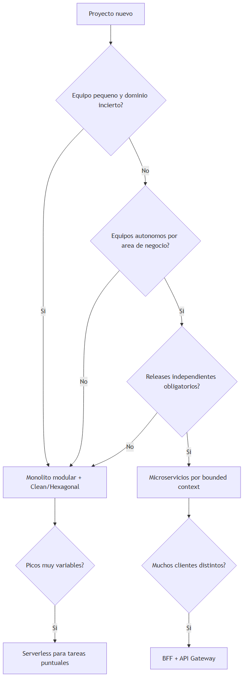

> *Fuente editable (Mermaid):* [02-decision-tree.mermaid](./assets/diagrams/02-decision-tree.mermaid)

#### Tabla resumen de recomendaciones

| Situación | Recomendación inicial |
|---|---|
| Primer trabajo, CRUD, MVP | Capas simples o Clean ligera |
| Reglas de negocio complejas | Monolito modular + DDD (capítulo 03) |
| 3+ equipos, releases independientes | Microservicios por bounded context |
| Picos impredecibles en tareas aisladas | Serverless para esas tareas |
| Web + móvil con UX distinta | BFF por canal |
| Muchos servicios expuestos a internet | API Gateway |

### Cuándo revisar la decisión (señales de cambio)

| Señal | Posible evolución |
|---|---|
| Releases bloqueados entre equipos | Dividir módulo en servicio |
| Un módulo consume 80% CPU | Extraer y escalar por separado |
| Operaciones no dan abasto con K8s | Simplificar a PaaS o fusionar servicios |

> **Nota del instructor:** la arquitectura **evoluciona**. Empezar monolito y extraer servicios cuando duele es más sano que microservicios prematuros que nunca se autonomizan.

---

## Resumen del capítulo

- **Arquitectura** define componentes, dependencias, despliegue y escalado — no es sinónimo de microservicios ni de cloud.
- **Monolito** es válido y recomendado al inicio; **monolito modular** añade límites internos sin complejidad distribuida.
- **Microservicios** aportan autonomía de despliegue y datos a costa de operaciones, red y consistencia eventual.
- **Distributed monolith** combina lo peor de ambos mundos: ops distribuidas sin autonomía real.
- **Capas** organizan responsabilidades; el **modelo anémico** concentra lógica en servicios y debilita el dominio.
- **Clean Architecture** (cuatro anillos) y **Hexagonal** (puertos/adaptadores) protegen el núcleo con **inversión de dependencias**.
- **Event-driven** desacopla productores y consumidores en el tiempo; requiere observabilidad.
- **Serverless** encaja en tareas cortas y event-driven; no reemplaza toda la API.
- **BFF** adapta datos por tipo de cliente; **API Gateway** centraliza entrada, seguridad y enrutamiento.
- Usa el **árbol de decisión** según equipo, dominio y escala — no según moda.

**Siguiente capítulo:** [03 — Domain-Driven Design (DDD)](./03-ddd-domain-driven-design.md) — cómo modelar el negocio dentro de cada módulo o servicio con límites y lenguaje compartido.
