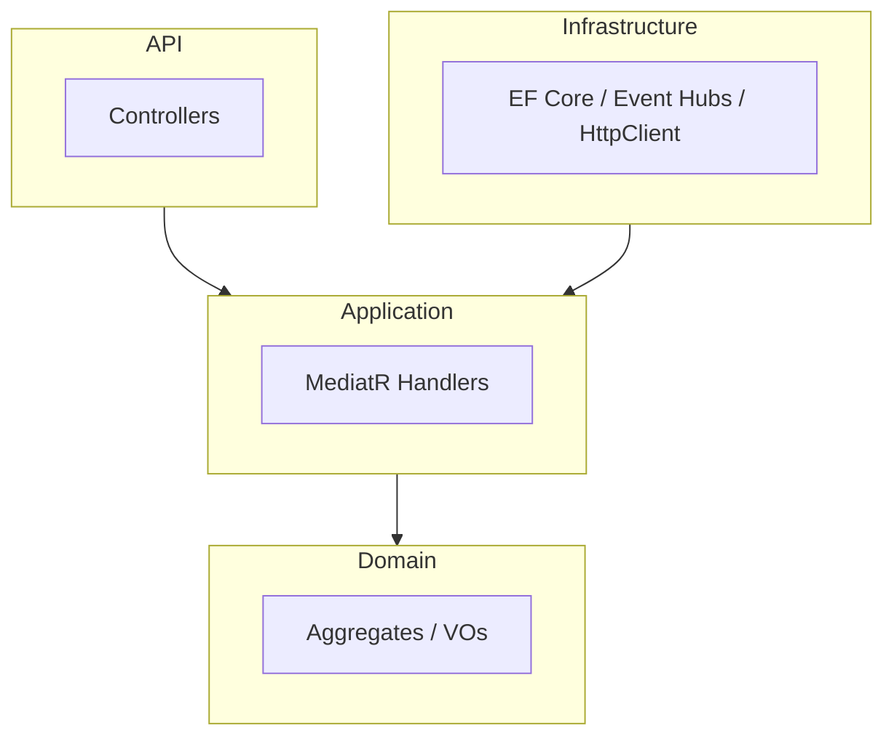
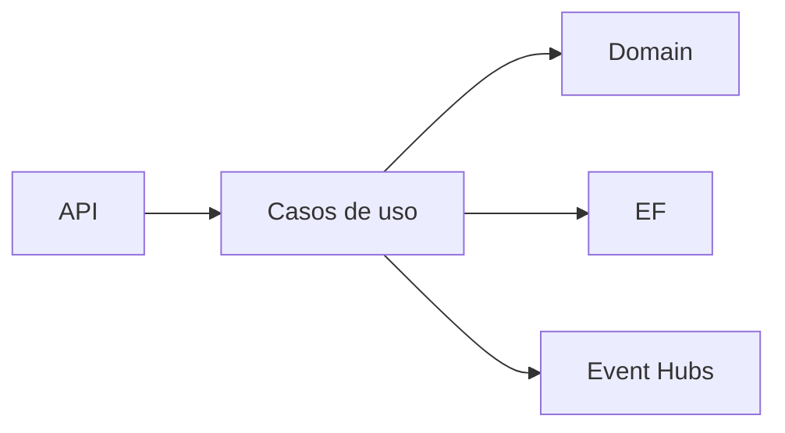

# 02 — Arquitecturas de software en ShopDemo

**Objetivo:** Comparar Clean Architecture, Hexagonal y microservicios en el mismo producto.

---

## Resumen en una frase

| Estilo | Idea | Servicio |
|---|---|---|
| **Clean Architecture** | Capas; dominio al centro | Catalog, Orders |
| **Hexagonal** | Puertos y adaptadores | Inventory |
| **Microservicios** | Autonomía, BD propia, deploy independiente | 5 APIs |

---

## Clean Architecture (Catalog / Orders)

Fuente draw.io: [assets/diagrams/02-clean-architecture.mermaid](./assets/diagrams/02-clean-architecture.mermaid)

**Regla:** `Domain` no referencia EF ni ASP.NET. **DIP:** interfaces internas, implementaciones en Infrastructure.

---

## Hexagonal (Inventory)

Fuente: [assets/diagrams/03-hexagonal.mermaid](./assets/diagrams/03-hexagonal.mermaid)

**Entrevista:** Misma idea que Clean, vocabulario **puerto/adaptador**, núcleo testeable sin framework.

---

## Microservicios en ShopDemo

- **Database per service:** 3 PostgreSQL lógicas.
- **Comunicación:** HTTP + Event Hubs.
- **Health:** `/health`, `/alive` en K8s probes.

**Pregunta clásica:** *¿Cuándo NO microservicios?*

**Respuesta:** Dominio difuso, equipo pequeño, ops limitado. ShopDemo enseña el **costo operativo** real.

---

## Monolito vs microservicios

| Criterio | Monolito | ShopDemo |
|---|---|---|
| Deploy | Un artefacto | 5+ imágenes |
| Consistencia | ACID local | Eventual vía eventos |
| Ops | Baja | K8s, ALB, Ingress |

---

## Preguntas de entrevista

1. ¿Por qué dos estilos arquitectónicos en un mismo sistema?
2. ¿Qué capa conoce `DbContext`?
3. ¿Cómo evitar acoplar dominios entre servicios?

**Profundizar:** [ARQUITECTURA §2](../ARQUITECTURA.md)
