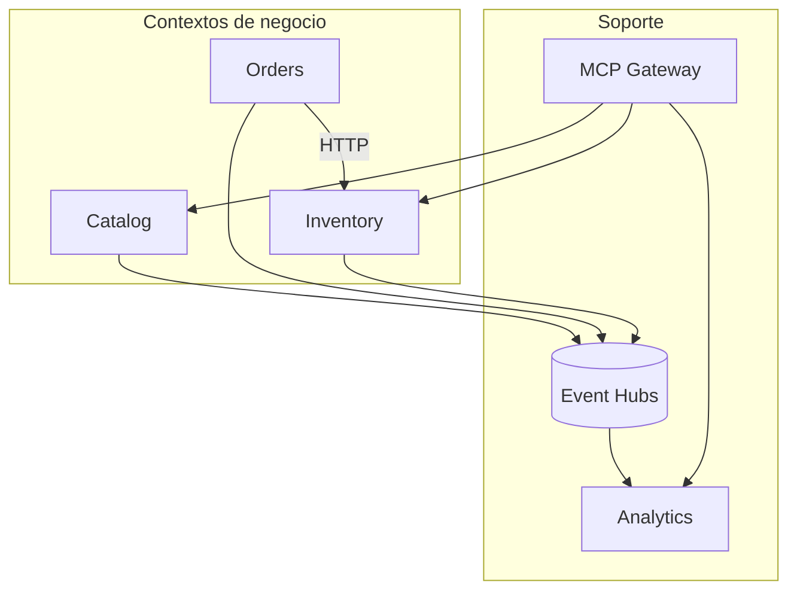

# 03 — DDD y bounded contexts

**Objetivo:** Explicar DDD táctico y los límites de contexto de ShopDemo en entrevista.

---

## Bounded contexts en ShopDemo

Fuente draw.io: [assets/diagrams/01-bounded-contexts.mermaid](./assets/diagrams/01-bounded-contexts.mermaid)

| Contexto | Responsabilidad | Ubicación código |
|---|---|---|
| **Catalog** | Productos, precios | `Catalog/` |
| **Orders** | Pedidos, confirmación | `Orders/` |
| **Inventory** | Stock, reservas | `Inventory/` |
| **Analytics** | Observación de eventos | `Aspire/ShopDemo.Analytics.Api/` |

Cada uno tiene **lenguaje ubicuo** propio: *Product* ≠ *OrderLine* ≠ *StockLevel*.

---

## DDD táctico (building blocks)

| Building block | ShopDemo | Ejemplo |
|---|---|---|
| **Entity** | `Product`, `Order` | Identidad `Id` |
| **Value Object** | `Money`, `ProductName` | Inmutable, igualdad por valor |
| **Aggregate** | `Product`, `Order` | Consistencia transaccional |
| **Domain Event** | `ProductCreatedDomainEvent` | Algo que ocurrió |
| **Repository** | `IProductRepository` | Persistir agregados |
| **Factory / ctor** | Métodos estáticos en agregados | Creación válida |

**Shared Kernel:** `ShopDemo.Shared` — solo primitives compartidos (`Entity`, `IntegrationEventEnvelope`), no lógica de negocio cruzada.

---

## Anti-patrón que evita ShopDemo

**Modelo unificado gigante:** un solo `Product` usado por Orders e Inventory con las mismas reglas. En su lugar: **IDs compartidos** (`ProductId`) y contratos HTTP/eventos, no entidades compartidas.

---

## Preguntas de entrevista

1. ¿Cuántos bounded contexts de negocio hay? ¿Analytics cuenta?
2. ¿Qué es un agregado y cuál es la raíz en Catalog?
3. ¿Por qué `Money` es Value Object y no `decimal` suelto?
4. ¿Shared Kernel vs librería de dominio compartida?

**Profundizar:** [ARQUITECTURA §1 y §6–8](../ARQUITECTURA.md)
