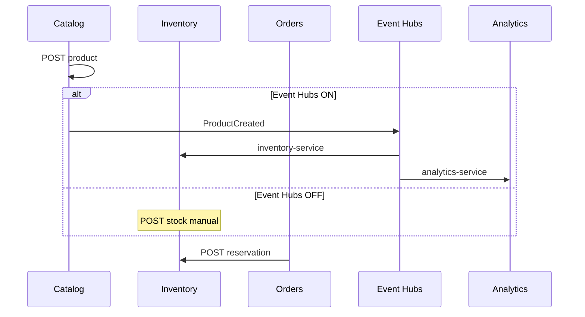

# 04 — Comunicación entre microservicios

**Objetivo:** Dominar sync vs async, Event Hubs y trade-offs de consistencia.

---

## Dos modos en ShopDemo

| Modo | Tecnología | Caso de uso |
|---|---|---|
| **Síncrono** | HTTP REST | Orders confirma → reserva stock en Inventory |
| **Asíncrono** | Azure Event Hubs | Catalog crea producto → Inventory auto-stock + Analytics log |

---

## Secuencia E2E (entrevista favorita)

Fuente: [assets/diagrams/04-secuencia-e2e.mermaid](./assets/diagrams/04-secuencia-e2e.mermaid)

---

## Fan-out y consumer groups

Un evento → **múltiples consumidores independientes**:

| Consumer group | Servicio | Efecto |
|---|---|---|
| `inventory-service` | Inventory | Stock automático |
| `analytics-service` | Analytics | Lista eventos en API |

**Entrevista:** *¿Por qué dos groups y no dos topics?*

**Respuesta:** Fan-out en un hub con groups permite **misma publicación, procesamiento independiente** y escalado por consumidor.

---

## Consistencia

- **Orders → Inventory (HTTP):** consistencia **inmediata** si Inventory responde OK; riesgo si Inventory cae (timeout, retry).
- **Catalog → Inventory (evento):** consistencia **eventual**; Inventory puede ir retrasado segundos.

**Saga / compensación:** cancelar pedido → `release` reservation (implementado en Orders).

---

## Cross-cloud (AWS + Event Hubs Azure)

Contenedores en ECS/EKS necesitan **salida HTTPS** a `*.servicebus.windows.net`. Mensajería centralizada en Azure; compute en AWS — patrón **multicloud híbrido**.

---

## Preguntas de entrevista

1. ¿Cuándo elegirías HTTP vs eventos?
2. ¿Qué pasa si Analytics está caído? ¿Afecta a Inventory?
3. ¿Para qué sirven los checkpoints (Azurite/Blob)?
4. ¿Idempotencia en consumidores?

**Profundizar:** [INTEGRACION-AZURE-EVENT-HUBS.md](../INTEGRACION-AZURE-EVENT-HUBS.md) · [ARQUITECTURA §4](../ARQUITECTURA.md)
