# 04 — Microservicios y comunicación

## Objetivo de este capítulo

En el capítulo 02 definimos microservicios; aquí profundizamos en **cómo se comunican**, qué ocurre con los datos cuando no hay una sola base de datos, y qué patrones evitan inconsistencias graves y cascadas de fallos.

Asumimos que ya sabes C#, HTTP, SQL y los conceptos de bounded context del capítulo 03. En microservicios, cada llamada entre servicios es una **llamada de red** — con latencia, timeouts, duplicados y particiones. Diseñar ignorando eso es la causa principal de incidentes en producción.

Conceptos que dominarás:

- Por qué la red no es confiable (Fallacies of Distributed Computing).
- REST completo: recursos, métodos HTTP, códigos de estado.
- gRPC y cuándo usarlo frente a REST.
- Mensajería asíncrona: cola, pub/sub, streaming.
- ACID letra por letra; consistencia eventual; teorema CAP.
- Sagas: coreografía vs orquestación con diagramas de secuencia.
- Patrón Outbox; garantías de entrega; idempotencia en código.
- Dead-Letter Queue (DLQ); versionado de APIs; Correlation ID.
- Cascada de fallos y mitigaciones básicas.

> **Cómo leer este capítulo:** cada mecanismo de comunicación sigue definición → explicación → diagrama → cuándo usarlo. La red **fallará** en producción; el código debe asumirlo desde el diseño.

---

## 1. Por qué la red no es confiable

### Definición formal

En sistemas distribuidos, la **comunicación por red** introduce fallos parciales, latencia variable y ausencia de transacciones globales. El principio fundamental — articulado en las *Fallacies of Distributed Computing* (Peter Deutsch, 1994) — establece que la red **no es confiable**, no es homogénea, no es segura por defecto y la latencia **nunca** es cero.

### Explicación desarrollada

En un monolito, invocar `inventoryService.Reserve()` es una llamada a método en memoria: microsegundos, sin pérdida de paquetes, sin serialización JSON. En microservicios, esa misma operación es:

1. Serializar request a bytes.
2. Enviar por TCP/HTTP a otro host (quizá otro datacenter).
3. Esperar mientras el otro servicio consulta BD, cola o terceros.
4. Deserializar respuesta o recibir timeout/error.

**Las ocho falacias** (resumen para juniors):

| Falacia | Realidad |
|---|---|
| La red es confiable | Paquetes se pierden; cables se cortan |
| La latencia es cero | Siempre hay milisegundos — a veces segundos |
| El ancho de banda es infinito | Saturación en picos |
| La red es segura | Man-in-the-middle, TLS mal configurado |
| La topología no cambia | Pods mueren; IPs cambian en K8s |
| Hay un administrador | En cloud, tú eres parte del "admin" |
| El coste de transporte es cero | Serialización, egress billing |
| La red es homogénea | Mezcla HTTP/1.1, HTTP/2, VPN, firewalls |

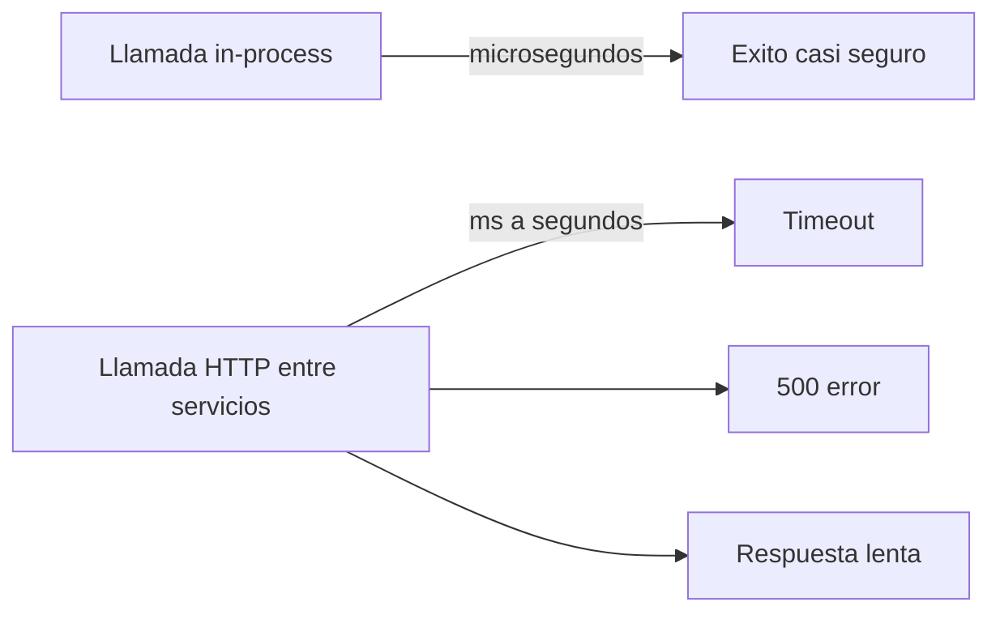

### Cuándo diseñar defensivamente (y qué implica)

| Siempre en microservicios… | Implica en código |
|---|---|
| Timeouts en cada llamada HTTP | `HttpClient.Timeout`, Polly |
| Reintentos con backoff | No reintentar POST sin idempotencia |
| Circuit breaker | Capítulo 10 |
| Idempotencia en consumidores | Sección 12 |
| Observabilidad | Correlation ID — sección 14 |

> **Nota del instructor:** el primer día que despliegues dos servicios, configura **timeout + logs con correlation ID**. El resto de patrones puedes añadirlos cuando duela — estos dos no esperan.

---

## 2. Comunicación síncrona vs asíncrona

### Definición formal

**Comunicación síncrona:** el emisor envía una solicitud y **bloquea o espera** la respuesta antes de continuar (request/response). **Comunicación asíncrona:** el emisor **publica un mensaje** en un intermediario y **continúa** sin esperar que el receptor termine de procesar.

### Explicación desarrollada

**Síncrono** = llamada telefónica: no cuelgas hasta que te respondan (o pasa el timeout).

**Asíncrono** = enviar email: pulsas enviar y sigues trabajando; el destinatario lee cuando puede.

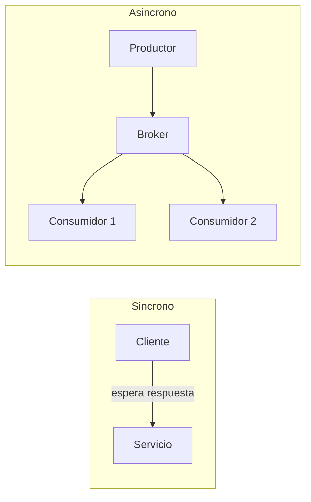

Fuente editable: [assets/diagrams/04-sync-vs-async.mermaid](./assets/diagrams/04-sync-vs-async.mermaid)

| Aspecto | Síncrono | Asíncrono |
|---|---|---|
| Acoplamiento temporal | Alto — ambos deben estar vivos | Bajo — consumidor puede estar caído temporalmente |
| Consistencia inmediata | Posible en la respuesta | Eventual entre servicios |
| Depuración | Flujo lineal | Requiere trazas y logs de mensajes |
| Uso típico | Consultas, validaciones inmediatas | Notificaciones, procesos largos |

### Cuándo usar cada estilo

| Prefiere síncrono cuando… | Prefiere asíncrono cuando… |
|---|---|
| Usuario espera resultado en pantalla | Efecto colateral puede tardar (email, analytics) |
| Necesitas datos frescos del otro servicio ahora | Varios consumidores del mismo hecho |
| Cadena corta (1–2 servicios) | Absorber picos de carga |

> **Nota del instructor:** lo más robusto en producción suele ser **síncrono para leer/consultar** y **asíncrono para propagar cambios** — no todo async ni todo sync.

---

## 3. REST sobre HTTP

### Definición formal

**REST** (Representational State Transfer) es un **estilo arquitectónico** para sistemas distribuidos que trata recursos identificados por **URLs**, manipulados con **verbos HTTP estándar**, intercambiando **representaciones** (típicamente JSON) sin estado en el servidor entre peticiones (*stateless*).

### Explicación desarrollada

REST no es "usar JSON por HTTP". Son **principios**:

1. **Recursos** con identidad (`/orders/42`, `/products/7`).
2. **Representaciones** del recurso (JSON, XML) separadas del almacenamiento interno.
3. **Stateless:** cada petición lleva toda la info necesaria (token, ids); el servidor no guarda sesión de "dónde iba el cliente".
4. **Uniform interface:** mismos verbos HTTP con significado estándar.
5. **Hipermedia (HATEOAS)** — opcional en la práctica: respuestas incluyen links a acciones siguientes.

Para un junior en ASP.NET Core, un controller REST típico:

```csharp
[HttpGet("{id}")]
public async Task<ActionResult<OrderDto>> Get(Guid id) { ... }

[HttpPost]
public async Task<ActionResult<OrderDto>> Create(CreateOrderRequest req) { ... }
```

```mermaid
flowchart LR
  CLIENT[Cliente HTTP]
  subgraph REST["Recursos REST"]
    R1[/orders]
    R2[/orders/42]
    R3[/products/7]
  end
  CLIENT -->|GET POST PUT PATCH DELETE| REST
  REST --> JSON[Representacion JSON]
```

Fuente editable: [assets/diagrams/04-rest-resources.mermaid](./assets/diagrams/04-rest-resources.mermaid)

**Buenas prácticas REST:**

- Sustantivos en URLs, no verbos: `/orders`, no `/createOrder`.
- Usar códigos HTTP correctos (siguiente sección).
- Paginación: `GET /orders?page=2&size=20`.
- Filtrado: `GET /products?category=books`.

### Cuándo usar REST (y cuándo considerar alternativas)

| Usa REST cuando… | Considera gRPC o mensajería cuando… |
|---|---|
| APIs públicas, clientes diversos | Comunicación interna de alto rendimiento |
| Debugging con Postman/curl | Contratos estrictos machine-to-machine |
| Equipo junior familiarizado con HTTP | Streaming bidireccional intensivo |

> **Nota del instructor:** REST bien hecho con OpenAPI/Swagger es el **default sensato** para APIs HTTP externas e internas en equipos .NET junior.

---

## 4. Métodos HTTP y códigos de estado

### Definición formal

Los **métodos HTTP** definen la **intención semántica** de una operación sobre un recurso. Los **códigos de estado HTTP** comunican el **resultado** de esa operación en categorías numéricas: 1xx informativo, 2xx éxito, 3xx redirección, 4xx error del cliente, 5xx error del servidor.

### Explicación desarrollada

#### Métodos principales

| Método | Idempotente | Safe | Uso típico |
|---|---|---|---|
| **GET** | Sí | Sí | Leer recurso o colección |
| **POST** | No | No | Crear recurso; acciones no CRUD |
| **PUT** | Sí | No | Reemplazar recurso completo |
| **PATCH** | No* | No | Actualización parcial |
| **DELETE** | Sí | No | Eliminar recurso |

*PATCH puede diseñarse idempotente según implementación.

**Idempotente** = llamar 1 o 5 veces produce el mismo efecto en el servidor (importante para reintentos).

#### Códigos de estado esenciales

| Código | Significado | Cuándo usarlo |
|---|---|---|
| **200 OK** | Éxito con cuerpo | GET exitoso, PUT/PATCH con respuesta |
| **201 Created** | Recurso creado | POST exitoso; header `Location` |
| **204 No Content** | Éxito sin cuerpo | DELETE exitoso |
| **400 Bad Request** | Input inválido | Validación fallida |
| **401 Unauthorized** | No autenticado | Falta token |
| **403 Forbidden** | Autenticado sin permiso | Rol insuficiente |
| **404 Not Found** | Recurso no existe | Id incorrecto |
| **409 Conflict** | Conflicto de estado | Versión obsoleta, duplicado |
| **422 Unprocessable Entity** | Semántica inválida | Regla de negocio rechazada |
| **429 Too Many Requests** | Rate limit | Gateway o API throttle |
| **500 Internal Server Error** | Error no manejado | Bug — evitar en producción sin log |
| **502 Bad Gateway** | Upstream inválido | Gateway no alcanza servicio |
| **503 Service Unavailable** | Servicio caído / mantenimiento | Circuit breaker abierto |
| **504 Gateway Timeout** | Upstream lento | Timeout en gateway |

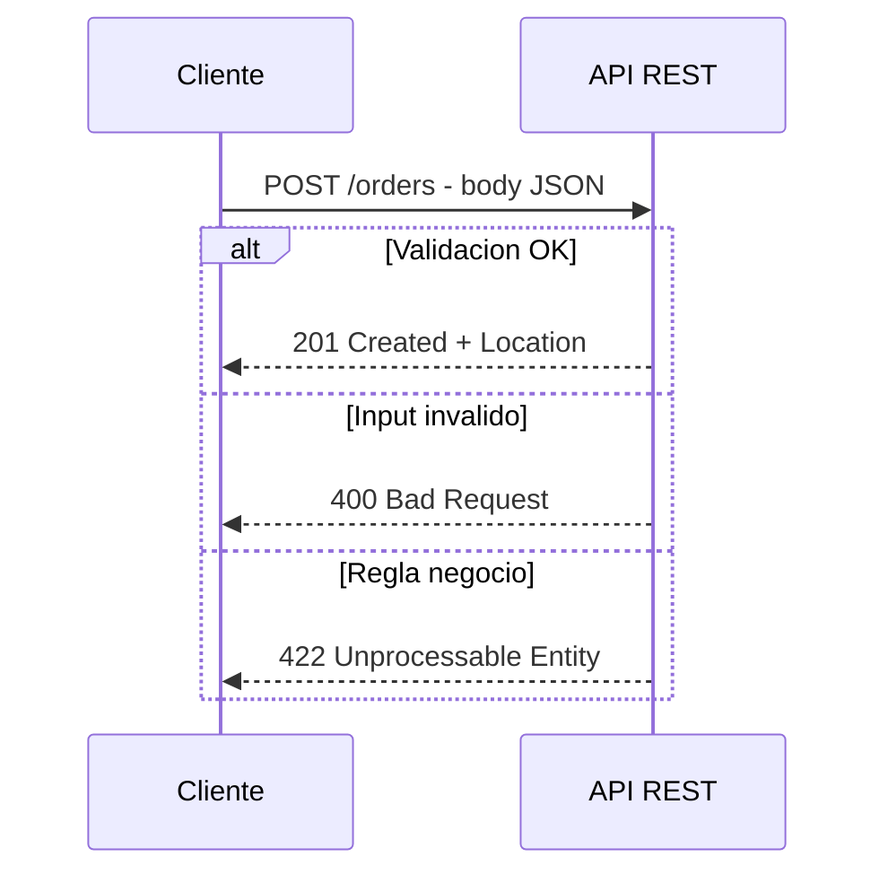

### Cuándo ser estricto con semántica HTTP

| Sé estricto cuando… | Error común |
|---|---|
| Clientes externos consumen tu API | Todo devuelve 200 con `{ success: false }` |
| Implementas cache (GET safe) | GET que modifica datos |
| Reintentos automáticos en cliente | POST no idempotente reintentado |

> **Nota del instructor:** devolver **siempre 200** con `{ error: "..." }` funciona en hackathons; en APIs profesionales dificulta caches, monitors y clientes generados.

---

## 5. gRPC

### Definición formal

**gRPC** (Google Remote Procedure Call) es un framework RPC de alto rendimiento que usa **HTTP/2** como transporte y **Protocol Buffers (Protobuf)** como formato de serialización binaria, con contratos definidos en archivos `.proto`.

### Explicación desarrollada

REST envía JSON texto legible; gRPC envía bytes compactos con esquema fuerte. Analogía: REST es enviar una carta en español claro; gRPC es enviar un telegrama codificado con diccionario compartido — más rápido, menos ambigüedad, menos legible sin herramientas.

**Características clave:**

- **Contrato fuerte:** `.proto` define mensajes y servicios; genera código C# cliente/servidor.
- **HTTP/2:** multiplexación, headers comprimidos, streaming.
- **Tipos de llamada:** unary (1 req → 1 resp), server streaming, client streaming, bidirectional streaming.
- **Performance:** menor CPU y tamaño vs JSON — ideal servicio a servicio.

```protobuf
service InventoryService {
  rpc GetStock (StockRequest) returns (StockResponse);
}
```

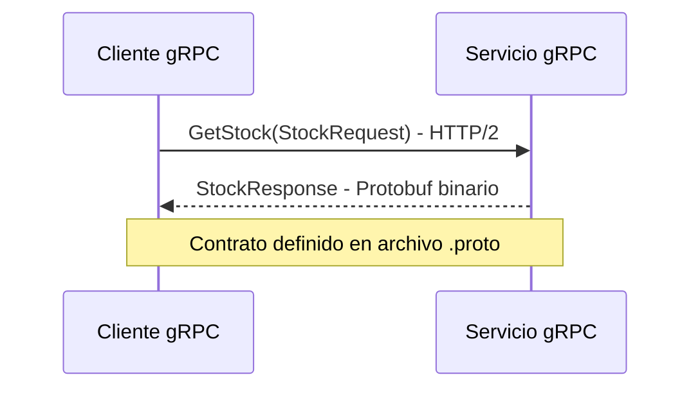

Fuente editable: [assets/diagrams/04-grpc.mermaid](./assets/diagrams/04-grpc.mermaid)

En .NET: paquete `Grpc.AspNetCore`, servicio implementa clase generada desde `.proto`.

### Cuándo usar gRPC (y cuándo no)

| Usa gRPC cuando… | Usa REST cuando… |
|---|---|
| Comunicación **interna** entre microservicios | API pública consumida por browsers sin proxy |
| Alto throughput, baja latencia | Necesitas debug manual con curl |
| Streaming de datos | Equipo sin experiencia con Protobuf |
| Contrato versionado estricto | Cache HTTP estándar en CDN |

| Limitación | Detalle |
|---|---|
| Browser support | gRPC-web requiere proxy (Envoy, etc.) |
| Legibilidad | Logs binarios — necesitas tooling |

> **Nota del instructor:** patrón común: **REST hacia fuera** (clientes), **gRPC hacia dentro** (servicio a servicio). No es obligatorio, pero escala bien.

---

## 6. Mensajería asíncrona: cola, pub/sub y streaming

### Definición formal

La **mensajería asíncrona** usa un **broker** intermediario que recibe mensajes de productores y los entrega a consumidores con distintos modelos: **cola (queue)** con competencia entre consumidores, **publicación/suscripción (pub/sub)** con fan-out a múltiples suscriptores, y **event streaming (log)** con log ordenado persistido donde consumidores leen a su ritmo con offset.

### Explicación desarrollada

| Modelo | Comportamiento | Ejemplo de producto |
|---|---|---|
| **Queue (cola)** | Un mensaje → **un** consumidor (competencia) | Azure Service Bus Queue, AWS SQS |
| **Pub/Sub (topic)** | Un mensaje → **todos** los suscriptores | SNS, Service Bus Topic |
| **Event Streaming (log)** | Log ordenado, replay, consumer groups | Kafka, Azure Event Hubs, Kinesis |

**Queue:** ideal para distribuir trabajo (10 workers procesan facturas en paralelo; cada factura una sola vez).

**Pub/Sub:** ideal cuando un hecho interesa a varios sistemas (`OrderCreated` → Inventario, Analytics, Email).

**Streaming:** ideal para alto volumen, replay histórico, analytics en tiempo casi real.

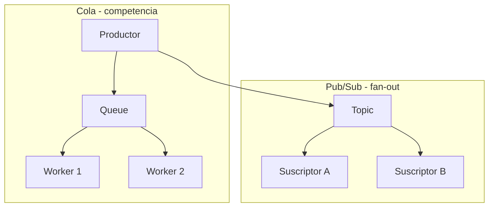

Componentes básicos:

| Componente | Rol |
|---|---|
| **Productor (Publisher)** | Envía mensaje |
| **Broker / Bus** | Almacena, enruta, garantiza entrega parcial |
| **Consumidor (Consumer)** | Recibe, procesa, confirma (ack) o rechaza (nack) |
| **Consumer group** | Grupo que compite por particiones (streaming) |

### Cuándo usar cada modelo

| Modelo | Elige cuando… |
|---|---|
| Queue | Trabajo en background, un procesador por mensaje |
| Pub/Sub | Múltiples reacciones al mismo evento |
| Streaming | Millones de eventos/día, replay, pipelines |

> **Nota del instructor:** no confundas **topic de pub/sub** con **cola**. En pub/sub, cada suscriptor recibe copia; en cola, solo uno procesa.

---

## 7. ACID — explicado letra por letra

### Definición formal

**ACID** es un acrónimo que describe las propiedades garantizadas por una **transacción** en un sistema de gestión de bases de datos relacionales: **Atomicity** (atomicidad), **Consistency** (consistencia), **Isolation** (aislamiento), **Durability** (durabilidad).

### Explicación desarrollada

Una transacción agrupa varias operaciones SQL en una unidad: `BEGIN` … operaciones … `COMMIT` o `ROLLBACK`.

#### A — Atomicity (Atomicidad)

**Todo o nada.** Si una operación dentro de la transacción falla, **ninguna** se persiste. Transferencia bancaria: debitar cuenta A y acreditar cuenta B — o ambas ocurren o ninguna.

#### C — Consistency (Consistencia)

La transacción lleva la BD de un **estado válido** a otro **estado válido** respecto a reglas definidas (constraints, FK, checks). No permite saldo negativo si hay constraint.

#### I — Isolation (Aislamiento)

Transacciones concurrentes **no se interfieren** como si fueran secuenciales (niveles: Read Uncommitted, Read Committed, Repeatable Read, Serializable). Evita lecturas sucias de datos no confirmados.

#### D — Durability (Durabilidad)

Tras `COMMIT`, los datos **sobreviven** a fallos de energía o reinicio del servidor — persistidos en disco o réplica sincronizada.

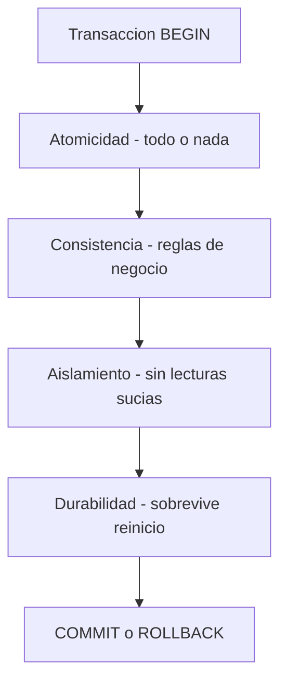

Fuente editable: [assets/diagrams/04-acid.mermaid](./assets/diagrams/04-acid.mermaid)

**Alcance en microservicios:** ACID aplica **dentro de una sola base de datos de un servicio**. No existe `BEGIN TRANSACTION` global entre Pedidos SQL e Inventario SQL en servidores distintos sin protocolo especializado (2PC — raramente usado).

### Cuándo confiar en ACID (y límites)

| ACID local cuando… | No esperes ACID global cuando… |
|---|---|
| Un agregado en una BD | Saga entre 3 servicios |
| EF `SaveChanges()` en un DbContext | Replicas async de lectura |
| Operación crítica en un servicio | Eventos entre contextos |

> **Nota del instructor:** "Necesito ACID en todo el sistema" en microservicios suele significar "aún no hemos aceptado consistencia eventual". Acláralo con negocio.

---

## 8. Consistencia eventual

### Definición formal

La **consistencia eventual** (*eventual consistency*) es un modelo en el que, si dejan de llegar actualizaciones, **eventualmente** todas las réplicas o sistemas relacionados convergerán al **mismo estado**, sin garantizar que en un instante arbitrario T todos lean el mismo valor.

### Explicación desarrollada

Analogía: actualizas tu foto de perfil. Tu amigo puede ver la foto vieja **unos segundos**. No es bug si el producto lo acepta — es trade-off por disponibilidad y rendimiento.

Flujo típico en microservicios:

1. Servicio Pedidos confirma pedido en su BD (ACID local).
2. Publica `OrderCreated` al bus.
3. Inventario consume 500 ms después y reserva stock.
4. Analytics consume 30 s después.

Entre paso 1 y 3, Inventario puede mostrar stock "sin reservar" aunque el pedido ya existe.

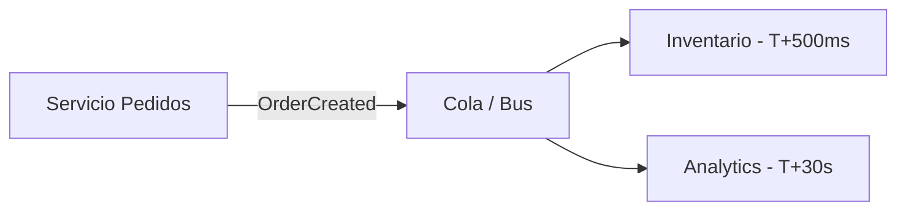

**No es un bug** si el negocio define SLAs aceptables ("stock reflejado en < 2 s").

**Técnicas para reducir ventana:**

- Read-your-writes en UI (mostrar estado optimista).
- Polling corto tras acción del usuario.
- Eventos con prioridad para camino crítico.

### Cuándo aceptar consistencia eventual (y cuándo no)

| Aceptable cuando… | Inaceptable cuando… |
|---|---|
| Analytics, recomendaciones | Saldo bancario en tiempo real |
| Inventario con SLA de segundos | Doble reserva de última unidad sin compensación |
| Notificaciones email | Control de fraude instantáneo |

> **Nota del instructor:** documenta **SLAs de consistencia** con negocio: "¿cuántos segundos puede el usuario ver datos desactualizados?"

---

## 9. Teorema CAP

### Definición formal

El **teorema CAP** (Brewer, 2000) establece que un sistema de datos distribuido **no puede** garantizar simultáneamente más de **dos** de tres propiedades en presencia de **partición de red** (*network partition*): **Consistency** (consistencia linealizable), **Availability** (disponibilidad — toda petición recibe respuesta no error) y **Partition tolerance** (tolerancia a partición — la red puede fallar).

### Explicación desarrollada

En la práctica, **P es inevitable** en sistemas distribuidos (la red fallará). Durante una partición debes elegir entre:

- **CP:** priorizas consistencia — algunas peticiones fallan (no disponibles) hasta reconciliar.
- **AP:** priorizas disponibilidad — respondes aunque los datos puedan estar desactualizados.

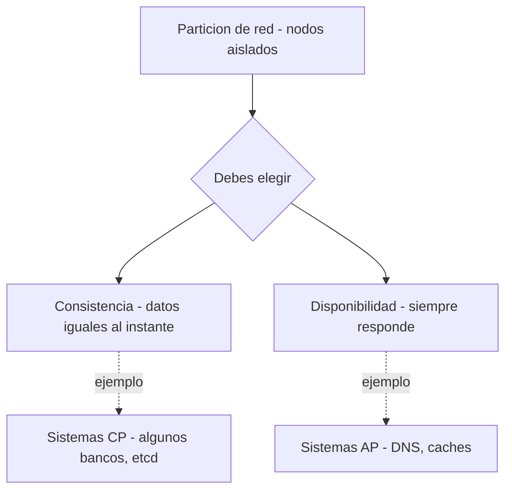

Fuente editable: [assets/diagrams/04-cap.mermaid](./assets/diagrams/04-cap.mermaid)

**Para juniors:** CAP no dice "elige 2 de 3 siempre". Dice: **durante partición**, no tienes las tres. En operación normal sin partición, puedes tener buena consistencia y disponibilidad.

**PACELC** (extensión): si no hay partición (EL), trade-off entre **Latency** y **Consistency**.

### Cuándo usar qué enfoque

| Enfoque | Ejemplo de uso |
|---|---|
| CP | Configuración de clúster, locks distribuidos |
| AP | Catálogo de productos con cache, carrito eventual |
| ACID local + eventos | Patrón habitual en microservicios .NET |

> **Nota del instructor:** no cites CAP en reuniones para evitar diseñar. Úsalo para **explicar** por qué Inventario puede ir 1 s detrás de Pedidos.

---

## 10. Patrón Saga

### Definición formal

Una **Saga** es una secuencia de **transacciones locales**, cada una en un servicio distinto, que implementan una operación de negocio distribuida. Si un paso falla, se ejecutan **transacciones compensatorias** que deshacen o contrarrestan el efecto de pasos ya completados.

### Explicación desarrollada

**Problema:** confirmar pedido requiere Pedidos + Pagos + Inventario — tres BDs. No hay `BEGIN TRANSACTION` global.

**Solución saga:** cada paso confirma localmente; si paso 3 falla, compensar paso 2 y paso 1.

Ejemplo — confirmar pedido:

| Paso | Servicio | Acción local | Compensación si falla después |
|---|---|---|---|
| 1 | Pedidos | Crear pedido PENDING | Cancelar pedido |
| 2 | Pagos | Autorizar pago | Reembolsar / void |
| 3 | Inventario | Reservar stock | Liberar reserva |
| 4 | Pedidos | Confirmar pedido | — |

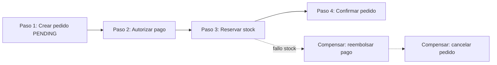

Fuente editable: [assets/diagrams/04-saga-steps.mermaid](./assets/diagrams/04-saga-steps.mermaid)

**Compensación ≠ rollback técnico:** a menudo es otra operación de negocio (`IssueRefund`, no `DELETE FROM payments`).

### Cuándo usar Saga (y cuándo no)

| Usa Saga cuando… | Evita Saga cuando… |
|---|---|
| Operación de negocio cruza servicios | Puedes mantener ACID en monolito/modular |
| Negocio acepta estados intermedios visibles | Necesitas atomicidad estricta global |
| Compensaciones están definidas | No hay forma de deshacer (enviar email ya enviado) |

> **Nota del instructor:** diseña **compensaciones con negocio** antes de codificar la saga feliz. El camino de fallo es el que causa incidentes.

---

## 11. Saga: coreografía vs orquestación

### Definición formal

**Coreografía (choreography):** cada servicio **reacciona a eventos** y decide autonomamente qué hacer siguiente; no hay coordinador central. **Orquestación (orchestration):** un **orquestador central** (servicio o proceso) dirige la secuencia de pasos, invoca participantes y maneja compensaciones.

### Explicación desarrollada

**Coreografía** = baile sin director: cada bailarín conoce su parte al escuchar la música (eventos).

**Orquestación** = director de orquesta: indica quién entra y cuándo.

#### Coreografía — diagrama de secuencia

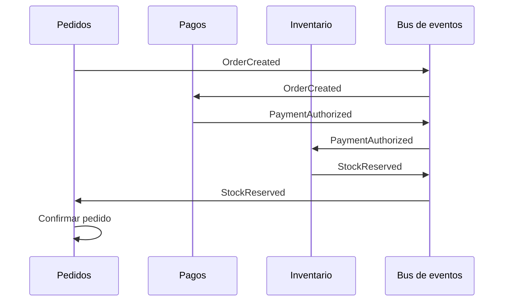

Fuente editable: [assets/diagrams/04-saga-choreography.mermaid](./assets/diagrams/04-saga-choreography.mermaid)

#### Orquestación — diagrama de secuencia

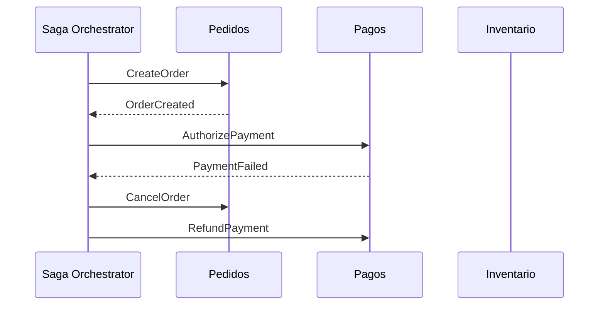

Fuente editable: [assets/diagrams/04-saga-orchestration-seq.mermaid](./assets/diagrams/04-saga-orchestration-seq.mermaid)

Comparación:

| Aspecto | Coreografía | Orquestación |
|---|---|---|
| Acoplamiento | Bajo entre servicios; alto al esquema de eventos | Servicios conocen al orquestador |
| Visibilidad del flujo | Difícil — eventos dispersos | Fácil — lógica en un sitio |
| Equipos autónomos | Muy buena | Orquestador puede ser cuello de botella |
| Debugging | Necesita trazas excelentes | Flujo lineal en orquestador |
| Riesgo | "Coreografía accidental" difícil de seguir | Orquestador con demasiada lógica de negocio |

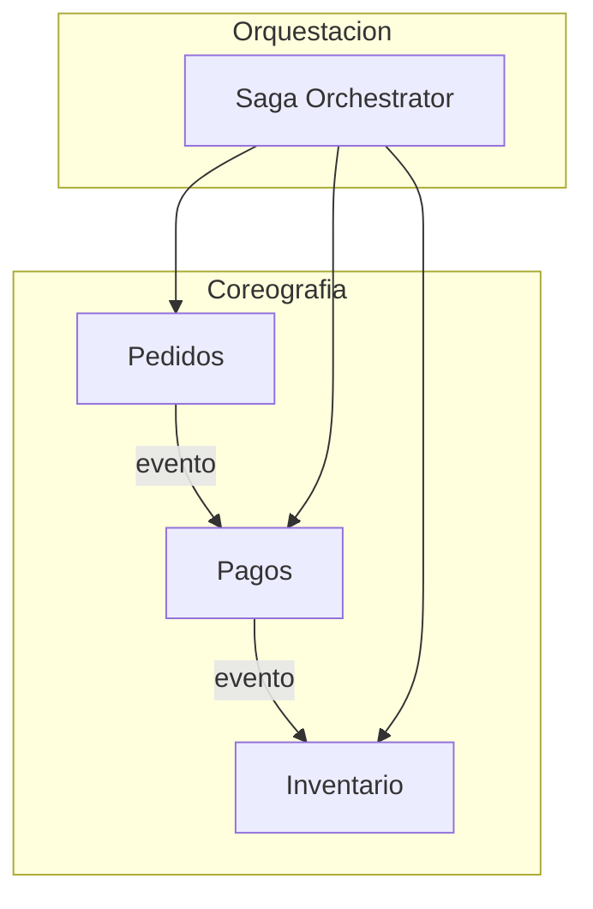

Fuente editable: [assets/diagrams/04-saga-orchestration.mermaid](./assets/diagrams/04-saga-orchestration.mermaid)

### Cuándo elegir cada enfoque

| Coreografía cuando… | Orquestación cuando… |
|---|---|
| Pocos pasos, equipos muy autónomos | Flujo complejo con muchas ramas |
| Event-driven ya maduro | Equipo junior necesita visibilidad |
| Escalar organizacionalmente | Compensaciones intrincadas |

> **Nota del instructor:** empieza con **orquestación** si el equipo es junior; migra a coreografía cuando el bus de eventos y las trazas estén maduros.

---

## 12. Patrón Outbox

### Definición formal

El **Transactional Outbox Pattern** garantiza que la **actualización de la base de datos** y la **publicación del mensaje de integración** ocurran de forma **atómica** en el emisor, escribiendo el mensaje en una tabla **Outbox** en la misma transacción local; un **worker** separado lee la outbox y publica al broker.

### Explicación desarrollada

**Problema dual write:** guardas pedido en BD y publicas a Service Bus. Si la BD confirma y el bus falla, Inventario nunca ve el evento. Si publicas primero y la BD falla, Inventario actúa sobre un pedido inexistente.

**Solución:** en una transacción:

1. `INSERT INTO Orders ...`
2. `INSERT INTO OutboxMessages (payload, status) ...`
3. `COMMIT`

Worker hace poll de `OutboxMessages WHERE status = pending`, publica al bus, marca `sent`.

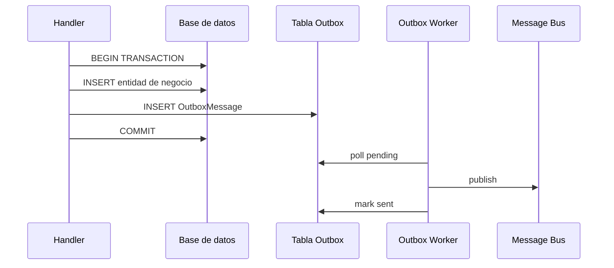

Fuente editable: [assets/diagrams/04-outbox.mermaid](./assets/diagrams/04-outbox.mermaid)

Referencia relacionada en patrones: [assets/diagrams/01-outbox.mermaid](./assets/diagrams/01-outbox.mermaid)

**Alternativas:** Change Data Capture (CDC) desde binlog SQL hacia Kafka — más infra, menos código app.

### Cuándo usar Outbox (y cuándo no)

| Usa Outbox cuando… | Alternativa cuando… |
|---|---|
| Debes publicar evento tras commit local | Solo HTTP síncrono sin eventos |
| At-least-once al bus es aceptable | CDC ya disponible en plataforma |
| Consistencia emisor-crítica | Fire-and-forget sin garantías (evitar en prod) |

> **Nota del instructor:** combina Outbox con **idempotencia** en consumidores — el worker puede publicar duplicados en reintentos.

---

## 13. Garantías de entrega

### Definición formal

Las **garantías de entrega** de mensajería describen cuántas veces un mensaje puede ser entregado al consumidor: **at-most-once** (como máximo una vez), **at-least-once** (al menos una vez, posibles duplicados) y **exactly-once** (exactamente una vez — extremadamente difícil end-to-end en sistemas distribuidos).

### Explicación desarrollada

| Garantía | Significado | Consecuencia para el consumidor |
|---|---|---|
| **At-most-once** | Puede perderse; no se repite | Simple; datos pueden faltar |
| **At-least-once** | No se pierde; puede duplicarse | **Debe ser idempotente** |
| **Exactly-once** | Una sola vez efecto | Requiere transacciones distribuidas o idempotencia + dedup sofisticada |

La mayoría de brokers (AWS SQS, Azure Service Bus, RabbitMQ con ack) ofrecen **at-least-once** si confirmas procesamiento correctamente.

**Exactly-once end-to-end** (productor → broker → consumidor → BD) es el santo grial; en la práctica se logra **efecto exactly-once** con:

- Outbox + idempotencia en consumidor.
- Deduplicación por `messageId` en ventana temporal.
- Transacciones locales en consumidor.

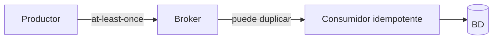

### Cuándo asumir cada garantía

| Diseña para at-least-once cuando… | At-most-once aceptable cuando… |
|---|---|
| Pedidos, pagos, inventario | Métricas aproximadas, logs perdibles |
| Usas SQS, Service Bus, Kafka estándar | Telemetría no crítica |

> **Nota del instructor:** promete **at-least-once + idempotencia** a negocio, no exactly-once mágico, salvo que hayas auditado todo el pipeline.

---

## 14. Idempotencia — implementación práctica

### Definición formal

Una operación es **idempotente** si ejecutarla **múltiples veces** con los mismos parámetros produce el **mismo efecto** en el estado del sistema que ejecutarla **una sola vez**.

### Explicación desarrollada

Sin idempotencia, un reintento de red duplica el pedido o cobra dos veces.

**Estrategias de implementación:**

#### 1. Idempotency Key (APIs HTTP)

Cliente envía header `Idempotency-Key: uuid`. Servidor guarda clave + respuesta; peticiones repetidas devuelven la misma respuesta sin reejecutar.

#### 2. Deduplicación por messageId (consumidores)

Tabla `ProcessedMessages`:

```csharp
public async Task Handle(OrderCreated message, CancellationToken ct)
{
    if (await _db.ProcessedMessages.AnyAsync(m => m.MessageId == message.MessageId, ct))
        return;

    await using var tx = await _db.Database.BeginTransactionAsync(ct);
    await ApplyBusinessLogic(message, ct);
    _db.ProcessedMessages.Add(new ProcessedMessage(message.MessageId, DateTime.UtcNow));
    await _db.SaveChangesAsync(ct);
    await tx.CommitAsync(ct);
}
```

#### 3. Operaciones naturalmente idempotentes

- `PUT /orders/42` con estado completo.
- `DELETE /orders/42` — segunda vez → 404, mismo efecto final.

#### 4. Upsert con clave de negocio

`INSERT ... ON CONFLICT DO NOTHING` o equivalente en EF.

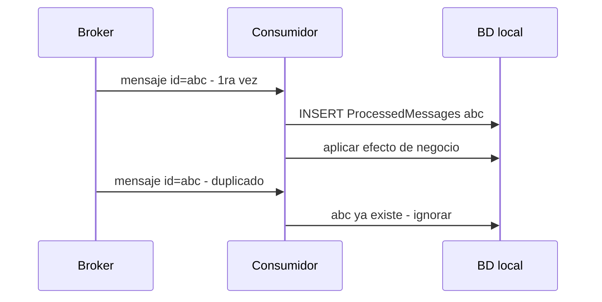

Fuente editable: [assets/diagrams/04-idempotency.mermaid](./assets/diagrams/04-idempotency.mermaid)

### Cuándo implementar idempotencia (obligatorio vs opcional)

| Obligatorio cuando… | Opcional cuando… |
|---|---|
| Consumidor at-least-once | At-most-once y pérdida aceptable |
| POST de pago / creación | GET, DELETE idempotente por HTTP |
| Reintentos automáticos configurados | Sin reintentos (frágil) |

> **Nota del instructor:** guarda `ProcessedMessages` con **TTL o partición** — crece infinito si no archivas.

---

## 15. Dead-Letter Queue (DLQ)

### Definición formal

Una **Dead-Letter Queue (DLQ)** es una cola especial donde el broker o el consumidor envía mensajes que **no pudieron procesarse** tras un número configurado de reintentos, aislandándolos de la cola principal para **análisis manual** o reprocesamiento sin bloquear el flujo normal.

### Explicación desarrollada

Un mensaje con JSON malformado, un bug en el handler o una dependencia caída permanentemente puede **reintentar infinitamente** y bloquear el consumidor (poison message).

Flujo:

1. Mensaje falla procesamiento.
2. Broker reintenta N veces (backoff exponencial).
3. Tras N fallos → mueve a DLQ.
4. Equipo ops recibe alerta, inspecciona payload, corrige bug o reprocesa manualmente.

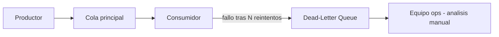

Fuente editable: [assets/diagrams/04-dlq.mermaid](./assets/diagrams/04-dlq.mermaid)

**Buenas prácticas:**

- Monitorizar **profundidad de DLQ** (alerta si > 0 sostenido).
- Guardar **razón del fallo** y stack trace en metadatos.
- Herramienta de **replay** a cola principal tras fix.
- No dejar mensajes en DLQ meses sin revisar.

### Cuándo configurar DLQ (y qué evitar)

| Configura DLQ cuando… | Evita… |
|---|---|
| Cola de producción con at-least-once | Ignorar DLQ — deuda silenciosa |
| Mensajes críticos de negocio | Reprocesar ciego sin entender poison message |
| Equipo tiene runbook de incidentes | DLQ sin alertas |

> **Nota del instructor:** un mensaje en DLQ es un **bug o dato inválido** hasta demostrar lo contrario. Trátalo como ticket de prioridad media-alta.

---

## 16. Versionado de APIs

### Definición formal

El **versionado de API** es la práctica de exponer **múltiples variantes** de un contrato HTTP para permitir **evolución** sin romper consumidores existentes, mediante convenciones en URL, headers o content negotiation.

### Explicación desarrollada

Cambias `OrderDto` eliminando un campo que la app móvil v1 aún usa → producción rota. Versionado permite `/v1/orders` estable mientras `/v2/orders` expone el nuevo modelo.

**Estrategias comunes:**

| Estrategia | Ejemplo | Pros / contras |
|---|---|---|
| **URL path** | `/v1/orders`, `/v2/orders` | Explícito; URLs duplicadas |
| **Header** | `Accept-Version: 2` o `Api-Version: 2` | URL limpia; menos visible |
| **Query string** | `/orders?api-version=2` | Simple; feo en cache |
| **Media type** | `Accept: application/vnd.company.v2+json` | REST puro; complejo |

En ASP.NET Core: paquete `Asp.Versioning.Mvc`.

**Reglas de compatibilidad:**

- **Cambios breaking:** eliminar campo, cambiar tipo, renombrar → nueva versión.
- **Cambios non-breaking:** añadir campo opcional → misma versión suele bastar.
- **Deprecation:** header `Sunset`, documentación, plazo antes de apagar v1.

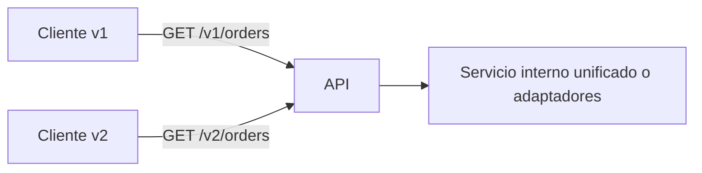

### Cuándo versionar (y cuándo no)

| Versiona cuando… | Puede no hacer falta cuando… |
|---|---|
| Clientes externos que no controlas | Solo consumidor interno desplegado contigo |
| Cambio breaking inevitable | Solo añades campos opcionales |
| Ciclo de vida largo de apps móviles | API privada con deploy coordinado |

> **Nota del instructor:** mantener **máximo 2 versiones activas** reduce carga de mantenimiento. Planifica sunset de v1.

---

## 17. Correlation ID

### Definición formal

Un **Correlation ID** (identificador de correlación) es un valor único (típicamente UUID) propagado a través de **todos los servicios, colas y logs** involucrados en una misma **petición de usuario o transacción de negocio**, permitiendo reconstruir el flujo completo en observabilidad.

### Explicación desarrollada

Usuario reporta error en checkout. Sin correlation ID, buscas en logs de 5 servicios por timestamp — imposible. Con `X-Correlation-Id: req-7f3a`, filtras todos los logs y trazas de esa petición.

**Implementación:**

1. API Gateway o primer servicio genera ID si no viene en request.
2. Propaga en header HTTP a downstream.
3. Incluye en mensajes de cola (metadata).
4. Logger enriquece cada línea: `CorrelationId=req-7f3a`.
5. OpenTelemetry span usa mismo trace id (capítulo 09).

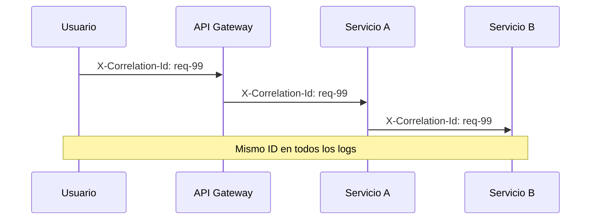

Fuente editable: [assets/diagrams/04-correlation-id.mermaid](./assets/diagrams/04-correlation-id.mermaid)

En .NET: `Activity.Current` / OpenTelemetry; middleware que lee header y pone en `HttpContext` + `ILogger` scope.

### Cuándo implementar Correlation ID

| Obligatorio cuando… | Complementa con… |
|---|---|
| 2+ microservicios | Distributed tracing (capítulo 09) |
| Mensajería async | MessageId distinto por mensaje + correlation por flujo |
| Soporte investiga incidentes | Dashboards que filtran por correlation |

> **Nota del instructor:** acuerda **un nombre de header** en el equipo (`X-Correlation-Id` vs `traceparent`). La inconsistencia mata el propósito.

---

## 18. Cascada de fallos

### Definición formal

Una **cascada de fallos** (*failure cascade*) ocurre cuando el fallo o degradación de un servicio downstream provoca agotamiento de recursos (threads, conexiones, memoria) en servicios upstream, extendiendo la indisponibilidad a componentes que inicialmente estaban sanos.

### Explicación desarrollada

Servicio B lento (500 ms → 30 s por bug de BD). Servicio A llama a B **síncronamente** en cada request. A acumula threads bloqueados esperando. Pool de threads agotado → A deja de responder. Servicio C depende de A → también cae. **Un bug en B tumba A y C.**

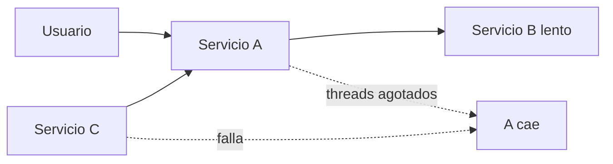

Fuente editable: [assets/diagrams/10-failure-cascade.mermaid](./assets/diagrams/10-failure-cascade.mermaid)

**Mitigaciones (introducción — capítulo 10 profundiza):**

| Técnica | Efecto |
|---|---|
| **Timeouts agresivos** | Libera threads; falla rápido |
| **Circuit breaker** | Deja de llamar a B cuando falla repetidamente |
| **Bulkhead** | Aísla pools de recursos por dependencia |
| **Async + cola** | A no espera a B en request del usuario |
| **Fallback / degradación** | Respuesta parcial si B no disponible |
| **Rate limiting** | Protege B de sobrecarga |

```mermaid
sequenceDiagram
  participant A as Servicio A
  participant CB as Circuit Breaker
  participant B as Servicio B
  A->>CB: Llamada
  CB->>B: Forward
  B-->>CB: Timeout
  Note over CB: Fallos acumulados - OPEN
  A->>CB: Nueva llamada
  CB-->>A: Fail fast sin llamar a B
```

### Cuándo preocuparse por cascadas (señales)

| Señal | Acción |
|---|---|
| Latencia p99 sube en cadena | Mapa de dependencias; timeouts |
| Thread pool starvation en .NET | Async correcto; no `.Result` |
| Un servicio cae y "tumban" otros | Circuit breaker + bulkhead |

> **Nota del instructor:** la cascada más común en juniors es **`HttpClient` sin timeout** + reintentos infinitos. Configura ambos el primer día.

---

## 19. Comunicación síncrona HTTP — flujo completo

### Definición formal

Una **llamada HTTP síncrona entre microservicios** es una petición request/response donde el servicio llamante **bloquea el hilo de ejecución** (o la tarea async) hasta recibir respuesta, timeout o error de transporte.

### Explicación desarrollada

Patrón típico en checkout: Pedidos llama `GET /stock/{productId}` a Inventario antes de confirmar.

```mermaid
sequenceDiagram
  participant A as Servicio A
  participant B as Servicio B
  A->>B: HTTP GET /stock/123
  B-->>A: 200 OK { quantity: 10 }
  Note over A,B: Sincrono - A espera a B
```

Fuente editable: [assets/diagrams/04-sync-http.mermaid](./assets/diagrams/04-sync-http.mermaid)

**Checklist HttpClient en .NET:**

- Usar `IHttpClientFactory` (no `new HttpClient()` por request).
- Timeout configurado (ej. 3–10 s según SLA).
- Polly: retry idempotente, circuit breaker.
- Propagar Correlation ID en `DefaultRequestHeaders`.
- Serialización JSON con `System.Text.Json`.

### Cuándo limitar llamadas síncronas en cadena

| Regla práctica | Razón |
|---|---|
| Máximo 1–2 saltos sync en path crítico UX | Latencia suma |
| Evitar cadenas A→B→C→D sync | Multiplica probabilidad de fallo |
| Preferir datos cacheados o async para B y C | Resiliencia |

> **Nota del instructor:** dibuja el **grafo de dependencias sync** de tu sistema. Si parece una cadena de dominó, rediseña.

---

## Resumen del capítulo

- La **red no es confiable** — latencia, timeouts, duplicados y particiones son normales, no excepciones.
- **Síncrono** (REST, gRPC) = espera respuesta; **asíncrono** (cola, pub/sub, streaming) = mensaje y continúa.
- **REST** usa recursos, verbos HTTP y códigos de estado con semántica precisa; **gRPC** optimiza comunicación interna con Protobuf y HTTP/2.
- **ACID** aplica dentro de un servicio; entre servicios rige **consistencia eventual** y **sagas** con compensaciones.
- **CAP:** durante partición, eliges entre consistencia fuerte y disponibilidad.
- **Saga coreografía** = eventos entre pares; **orquestación** = coordinador central — elige según visibilidad y madurez del equipo.
- **Outbox** atomiciza BD + publicación; **at-least-once** exige **idempotencia** en consumidores.
- **DLQ** aísla poison messages; **versionado** protege clientes; **Correlation ID** une logs y trazas.
- **Cascadas de fallos** se mitigan con timeouts, circuit breaker y async — no con "más servidores".

**Siguiente capítulo:** [05 — Servicios de Microsoft Azure](./05-servicios-azure.md) — dónde se **despliegan** estos servicios en la nube y qué productos gestionados usar.
