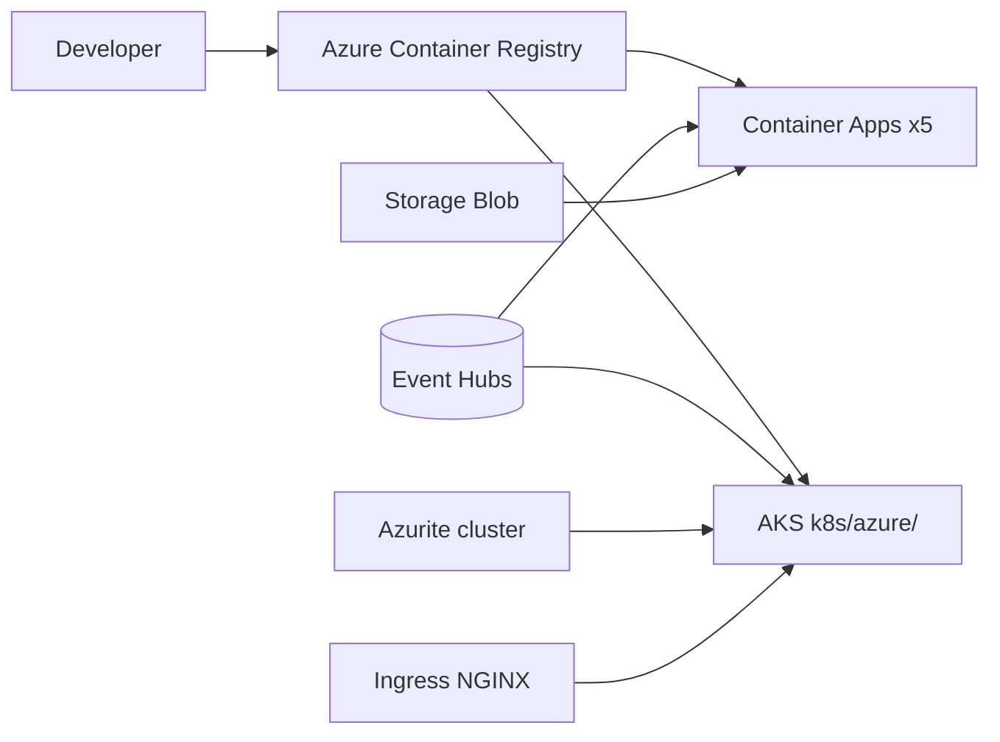

# 05 — Servicios Azure en ShopDemo

**Objetivo:** Explicar cada servicio Azure del lab y responder preguntas de arquitectura cloud.

---

## Mapa de release Azure

Fuente draw.io: [assets/diagrams/05-azure-release.mermaid](./assets/diagrams/05-azure-release.mermaid)

---

## Servicios y rol en el lab

| Servicio Azure | Función en ShopDemo | ¿Alternativa en lab? |
|---|---|---|
| **Resource Group** | Agrupar recursos | — |
| **ACR** | Registro de imágenes Docker | — |
| **Container Apps (ACA)** | Release serverless 5 APIs + MCP | AKS |
| **AKS** | Kubernetes gestionado | ACA |
| **Event Hubs** | Bus de eventos (todos los entornos) | — |
| **Storage Account** | Checkpoints EH en **ACA** | Azurite en K8s |
| **Log Analytics + ACA Environment** | Requisito de Container Apps | — |
| **PostgreSQL (ACI en lab)** | 3 bases en contenedor | PG in-cluster en AKS |

---

## ACA vs AKS (pregunta de entrevista)

| | ACA | AKS |
|---|---|---|
| Complejidad ops | Baja | Alta (Ingress, probes, manifiestos) |
| Control | Limitado | Total (HPA, YAML) |
| Caso ShopDemo | Release rápido ~3 h | Curso K8s + multicloud |
| Imágenes | ACR | ACR (`k8s/azure/`) |

**Respuesta modelo:** ACA para velocidad y PaaS; AKS cuando necesitas **orquestación estándar**, Ingress unificado y mismo modelo que EKS.

---

## Event Hubs (detalle entrevista)

- **Namespace + hub** `shopdemo-events`
- **Consumer groups** obligatorios: `analytics-service`, `inventory-service`
- Publicadores: Catalog, Orders, Inventory
- Contrato: `IntegrationEventEnvelope`

---

## Secretos y identidad

- **Service Principal** → `AZURE_CREDENTIALS` en GitHub (`azure`, `azure-aks`)
- **attach-acr** en AKS evita `ImagePullBackOff`

---

## Preguntas de entrevista

1. ¿Por qué checkpoints en Storage en ACA pero Azurite en AKS?
2. ¿Qué es un Container Apps Environment?
3. ¿Cómo expone ShopDemo 5 APIs en AKS con una IP? (Ingress + paths)
4. ¿Diferencia ACR vs Docker Hub?

**Profundizar:** [TEORIA-CONTENEDORES-AZURE.md](../despliegue/azure/TEORIA-CONTENEDORES-AZURE.md) · [GUIA-RELEASE-SCRIPT-AZURE.md](../despliegue/azure/GUIA-RELEASE-SCRIPT-AZURE.md)
