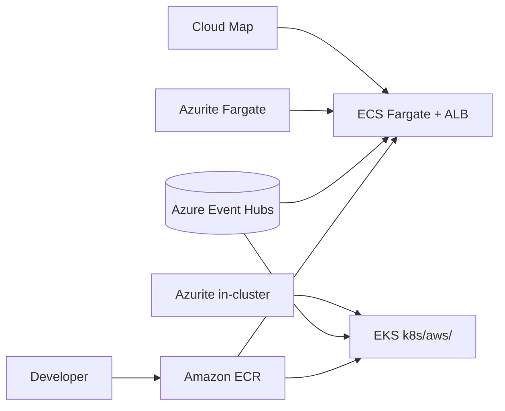

# 06 — Servicios AWS en ShopDemo

**Objetivo:** Explicar servicios AWS del lab y el patrón cross-cloud con Azure Event Hubs.

---

## Mapa de release AWS

Fuente draw.io: [assets/diagrams/06-aws-release.mermaid](./assets/diagrams/06-aws-release.mermaid)

---

## Servicios y rol

| Servicio AWS | Función en ShopDemo |
|---|---|
| **ECR** | Registro imágenes (5 repos) |
| **ECS Fargate** | Release sin Kubernetes |
| **EKS** | Kubernetes gestionado |
| **VPC + subnets** | Red del lab (públicas, sin NAT costoso) |
| **ALB** | APIs públicas en ECS |
| **Cloud Map** | DNS privado Orders → Inventory |
| **SSM Parameter Store** | Secretos ECS |
| **IAM + OIDC** | GitHub Actions → EKS/ECS |

---

## ECS vs EKS

| | ECS Fargate | EKS |
|---|---|---|
| Modelo | Tasks + services | Pods + Deployments |
| Exposición | ALB por API | Ingress NGINX |
| Descubrimiento | Cloud Map | DNS interno K8s |
| Manifiestos | Task definitions | `k8s/aws/` |

**Entrevista:** *¿Cuándo ECS sobre EKS?*

**Respuesta:** Menos superficie K8s, equipos sin expertise en YAML; EKS cuando quieres **portabilidad** con AKS/Minikube.

---

## Cross-cloud

- **Compute:** AWS
- **Mensajería:** Azure Event Hubs (connection string en `.env.aws`)
- Implicación: security groups / egress HTTPS hacia Azure

---

## EKS free-tier (contexto real)

4× `t3.micro` ≈ 16 pods → perfil reducido (Catalog, Orders, Inventory). Documentado en guía AWS.

---

## Preguntas de entrevista

1. ¿Por qué Event Hubs no está en AWS en este lab?
2. ¿Qué hace Cloud Map que un ALB no hace?
3. ¿Diferencia ECR vs ACR?
4. ¿Por qué Swagger en ELB a veces usa puerto `:8080`?

**Profundizar:** [TEORIA-CONTENEDORES-AWS.md](../despliegue/aws/TEORIA-CONTENEDORES-AWS.md) · [GUIA-RELEASE-SCRIPT-AWS.md](../despliegue/aws/GUIA-RELEASE-SCRIPT-AWS.md)
