# 06 — Servicios de Amazon Web Services (AWS)

## Objetivo de este capítulo

Comprender los **servicios fundamentales de AWS**, qué problema resuelve cada uno y cómo se **comparan con Azure** (capítulo anterior). Al final podrás leer un diagrama de arquitectura AWS, identificar cada componente y explicar por qué está ahí.

Asumimos conocimientos de C#, HTTP, SQL y haber leído el capítulo 05 (Azure). Muchos conceptos son **paralelos** entre nubes; aquí aprenderás los nombres y matices de AWS.

Conceptos que dominarás:

- Modelo de AWS y vocabulario (región, AZ, IAM).
- Compute: EC2, ECS, Fargate, EKS, Lambda.
- Almacenamiento y datos: S3, RDS, Aurora, DynamoDB, ElastiCache.
- Mensajería: SQS, SNS, EventBridge, Kinesis.
- Identidad, red, observabilidad, DevOps y conceptos de coste/resiliencia.

> **Nota del instructor:** AWS fue pionera en cloud y tiene **más servicios** que cualquier otro proveedor. No intentes aprenderlos todos de una vez. Enfócate en los de este capítulo; son los que aparecen en el 80 % de arquitecturas reales.

---

## 1. ¿Qué es Amazon Web Services (AWS)?

### Definición formal

**Amazon Web Services (AWS)** es una plataforma de computación en la nube pública que ofrece servicios de infraestructura, plataforma y software bajo demanda, facturados por consumo, organizados en **regiones** y **Availability Zones**.

### Explicación desarrollada

AWS y Azure resuelven los mismos problemas con nombres distintos. La diferencia cultural:

- **AWS** enfatiza **composabilidad**: arquitecturas construidas combinando servicios pequeños y especializados (S3 + Lambda + DynamoDB + SQS).
- **Azure** suele integrar más el ecosistema Microsoft (.NET, Entra ID, SQL Server).

Vocabulario esencial:

| Término | Significado |
|---|---|
| **Región** | Área geográfica (ej. `eu-west-1` Irlanda) |
| **Availability Zone (AZ)** | Datacenter independiente dentro de una región |
| **Account** | Contenedor de facturación y recursos (como una "suscripción" Azure) |
| **IAM** | Identity and Access Management — permisos en todo AWS |

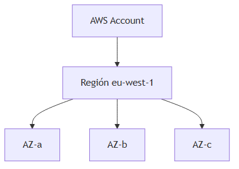

### Cuándo elegir AWS

| Elige AWS cuando… | Considera Azure cuando… |
|---|---|
| Tu organización ya estandarizó AWS | Ecosistema Microsoft predominante |
| Necesitas servicio específico líder (S3, Lambda madurez) | Integración profunda con Active Directory / M365 |
| Equipo con certificaciones AWS | Contrato enterprise Microsoft existente |

Las equivalencias son **aproximadas**; capacidades, precios y operación difieren.

---

## 2. Modelo de servicio en AWS

### Definición formal

Al igual que Azure, AWS opera en capas **IaaS, PaaS y SaaS**. La mayoría de servicios que verás como desarrollador backend son **IaaS** (EC2) o **PaaS** (RDS, Lambda, ECS Fargate).

### Explicación desarrollada

En C# / .NET en AWS desplegarías típicamente:

| Escenario | Servicio AWS |
|---|---|
| API en contenedor sin gestionar servidores | ECS Fargate o EKS |
| API serverless por eventos | Lambda + API Gateway |
| SQL managed | RDS PostgreSQL o Aurora |
| Cola entre servicios | SQS |

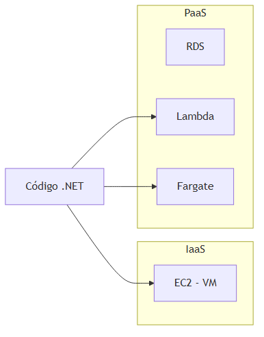

---

## 3. Compute

### 3.1 Amazon EC2 (Elastic Compute Cloud)

#### Definición formal

**Amazon EC2** proporciona **máquinas virtuales IaaS** con control completo del sistema operativo, almacenamiento conectado (EBS), red (VPC, security groups) y tipo de instancia seleccionable.

#### Explicación desarrollada

EC2 es el equivalente AWS de **Azure Virtual Machines**. Conceptos clave:

- **Instance type:** familia + tamaño (`t3.micro`, `m6i.large`, `c7g.xlarge`). Familias optimizadas para compute (C), memoria (R), general (M), GPU (P/G).
- **AMI (Amazon Machine Image):** plantilla de disco con SO preinstalado (Amazon Linux, Windows Server).
- **Security Group:** firewall a nivel de instancia (solo reglas allow; tráfico implícitamente denegado).
- **Elastic IP:** IP pública estática opcional.
- **EBS (Elastic Block Store):** disco persistente asociado a la VM.

Para un junior: EC2 es "un servidor remoto al que te conectas por RDP/SSH e instalas .NET Runtime".

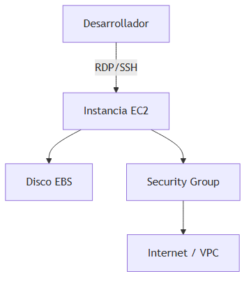

#### Cuándo usar EC2

| Usa EC2 cuando… | Prefiere Fargate/Lambda cuando… |
|---|---|
| Software legacy, licencias por servidor | Puedes containerizar o usar functions |
| Control total del SO y kernel | Quieres cero parches de SO |
| GPU, bare metal, instancias especiales | Carga variable serverless |

---

### 3.2 Amazon ECS y AWS Fargate

#### Definición formal

**Amazon ECS (Elastic Container Service)** es el **orquestador de contenedores nativo** de AWS. **AWS Fargate** es un modo **serverless** de ECS (y EKS) donde AWS gestiona la infraestructura de nodos; el cliente define CPU/memoria del **task**.

#### Explicación desarrollada

ECS introduce vocabulario propio:

| Concepto ECS | Equivalente mental K8s |
|---|---|
| **Cluster** | Agrupación lógica |
| **Task Definition** | Plantilla del contenedor (imagen, CPU, env vars) |
| **Task** | Instancia en ejecución de una task definition |
| **Service** | Mantiene N tasks corriendo con balanceo |

**Fargate** elimina la gestión de instancias EC2 como nodos. Defines: "quiero 0.5 vCPU y 1 GB RAM" y AWS coloca el contenedor.

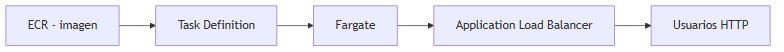

#### Cuándo usar ECS/Fargate

| Usa ECS Fargate cuando… | Usa EKS cuando… |
|---|---|
| Contenedores sin administrar K8s | Equipo ya domina Kubernetes |
| Integración nativa AWS (ALB, IAM) | Portabilidad de manifiestos K8s multicloud |
| Cargas moderadas de microservicios | Ecosistema Helm/operators |

---

### 3.3 Amazon EKS (Elastic Kubernetes Service)

#### Definición formal

**Amazon EKS** es un servicio de **Kubernetes gestionado** compatible con Kubernetes upstream; AWS opera el control plane y el cliente gestiona nodos (EC2 o Fargate).

#### Explicación desarrollada

EKS es el equivalente directo de **AKS**. Integraciones importantes:

- **ECR:** registro de imágenes (como ACR).
- **IRSA (IAM Roles for Service Accounts):** pods que asumen roles IAM via OIDC — equivalente a Workload Identity en Azure.
- **VPC CNI:** cada pod puede tener IP de VPC.
- **CloudWatch Container Insights:** métricas del clúster.

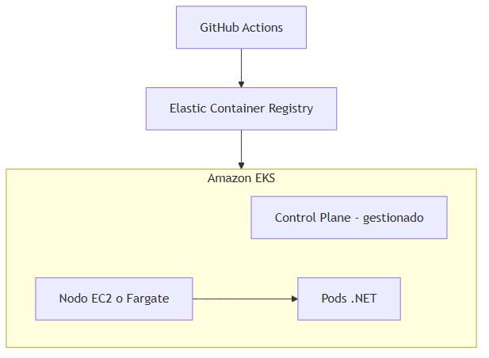

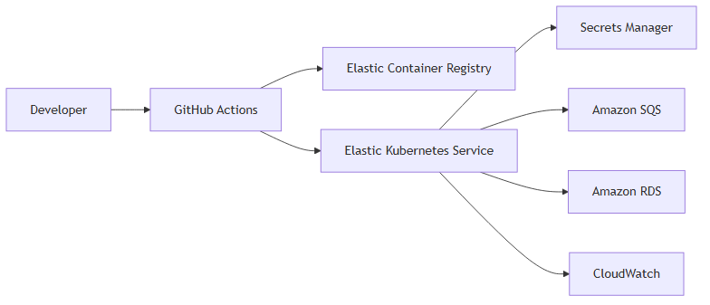

> *Fuente editable (Mermaid):* [06-aws-stack.mermaid](./assets/diagrams/06-aws-stack.mermaid)

#### Cuándo usar EKS

| Usa EKS cuando… | Usa ECS Fargate cuando… |
|---|---|
| Manifiestos K8s reutilizables en otra nube | Quieres simplicidad sin API de K8s |
| GitOps con Argo CD / Flux | Equipo pequeño sin experiencia K8s |

---

### 3.4 AWS Lambda

#### Definición formal

**AWS Lambda** es computación **serverless** que ejecuta código en respuesta a **eventos** (API Gateway, S3, SQS, DynamoDB Streams, EventBridge) facturando por invocación y duración.

#### Explicación desarrollada

Equivalente a **Azure Functions**. Limitaciones importantes para juniors:

- **Timeout máximo:** 15 minutos por invocación.
- **Cold start:** primera invocación tras idle puede tardar (especialmente .NET sin Native AOT).
- **Deployment package:** límite de tamaño comprimido.
- **Estado:** Lambda es stateless; persistencia en S3, DynamoDB o ElastiCache.

Triggers comunes:

| Trigger | Ejemplo |
|---|---|
| API Gateway | REST API serverless |
| S3 | Procesar imagen al subir archivo |
| SQS | Consumir cola de mensajes |
| EventBridge | Reaccionar a evento de negocio |

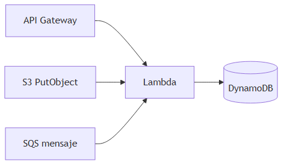

#### Cuándo usar Lambda

| Usa Lambda cuando… | Evita Lambda cuando… |
|---|---|
| Procesamiento event-driven corto | Latencia ultra-baja sin cold starts |
| Tráfico muy variable | Proceso continuo de horas |
| Integración con servicios AWS | Necesitas sockets persistentes o estado en memoria |

---

## 4. Almacenamiento y datos

### 4.1 Amazon S3 (Simple Storage Service)

#### Definición formal

**Amazon S3** es almacenamiento de **objetos** escalable con durabilidad diseñada del 99.999999999% (11 nines), accesible via API HTTP y organizado en **buckets** y **keys** (rutas de objeto).

#### Explicación desarrollada

S3 es el servicio más usado de AWS. Equivalente a **Azure Blob Storage**.

- **Bucket:** contenedor globalmente único por nombre (`mi-empresa-facturas-2024`).
- **Object key:** ruta lógica (`invoices/2024/enero/factura-001.pdf`).
- **Clases de almacenamiento:** Standard, Intelligent-Tiering, Glacier Instant Retrieval, Glacier Flexible, Deep Archive.

Usos típicos:

- Backups y archivos estáticos.
- Data lake (análisis con Athena).
- Hosting estático de SPA.
- Artefactos de build y logs archivados.

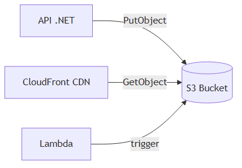

#### Cuándo usar S3

| Usa S3 cuando… | Usa EBS cuando… |
|---|---|
| Archivos, imágenes, backups, data lake | Disco de sistema de una EC2 |
| Acceso via HTTP/API | Block storage attachado a VM |

---

### 4.2 Amazon RDS (Relational Database Service)

#### Definición formal

**Amazon RDS** es un servicio **PaaS** de bases de datos **relacionales** que soporta PostgreSQL, MySQL, MariaDB, Oracle y SQL Server, con backups automáticos, parches y opciones Multi-AZ.

#### Explicación desarrollada

RDS es el equivalente general de **Azure Database for PostgreSQL/MySQL** o SQL managed.

Conceptos:

- **Multi-AZ:** réplica sincrónica en otra AZ para failover automático (alta disponibilidad).
- **Read Replica:** réplica asíncrona para lecturas (escala lectura).
- **Parameter Group:** configuración del motor (max_connections, etc.).
- **Subnet Group:** subnets donde puede vivir la BD (siempre privadas en producción).

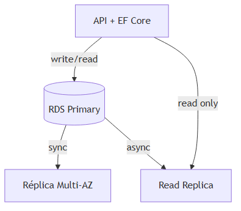

#### Cuándo usar RDS

| Usa RDS cuando… | Considera Aurora cuando… |
|---|---|
| PostgreSQL/MySQL estándar suficiente | Necesitas failover más rápido y más read replicas |
| Carga predecible moderada | Escrituras muy intensivas con storage autoescalable |

---

### 4.3 Amazon Aurora

#### Definición formal

**Amazon Aurora** es un motor de base de datos **compatible con MySQL o PostgreSQL** con almacenamiento distribuido autoescalable en AWS, replicación rápida y failover típico en segundos.

#### Explicación desarrollada

Aurora separa **compute** (instancias) de **storage** (capa distribuida en 6 copias en 3 AZ). Ventajas sobre RDS clásico:

- Hasta **15 read replicas** con lag mínimo.
- Failover automático rápido.
- Storage crece automáticamente hasta 128 TB.

Para juniors: si el equipo ya usa PostgreSQL en RDS y necesita más rendimiento HA, evalúa Aurora PostgreSQL.

#### Cuándo usar Aurora

Cargas transaccionales exigentes, SaaS con muchas lecturas, necesidad de HA superior a RDS estándar.

---

### 4.4 Amazon DynamoDB

#### Definición formal

**Amazon DynamoDB** es una base de datos **NoSQL serverless** de tipo clave-valor y documento con escalado automático, latencia de un dígito de milisegundos y opción de **Global Tables** multi-región.

#### Explicación desarrollada

Equivalente conceptual a **Azure Cosmos DB** (aunque modelos y APIs difieren).

Conceptos:

- **Partition key** (+ optional sort key): identifica item; diseño crítico para rendimiento.
- **On-demand vs provisioned capacity:** pago por request vs RCU/WCU reservadas.
- **DynamoDB Streams:** cambio de datos capturado (CDC) para Lambda.
- **Global Tables:** réplicas multi-región activo-activo.

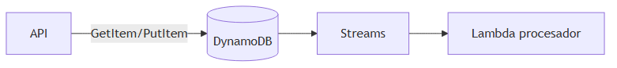

#### Cuándo usar DynamoDB

| Usa DynamoDB cuando… | Usa RDS cuando… |
|---|---|
| Acceso por clave simple, escala masiva | Joins SQL, reportes ad hoc complejos |
| Patrones serverless (Lambda + DynamoDB) | Modelo relacional normalizado |
| Latencia ms predecible a escala | ACID multi-tabla frecuente |

---

### 4.5 Amazon ElastiCache

#### Definición formal

**Amazon ElastiCache** es un servicio **managed** de cache en memoria compatible con **Redis** o **Memcached**.

#### Explicación desarrollada

Equivalente a **Azure Cache for Redis**. Mismos casos: cache de sesión, cache de consultas, rate limiting, leaderboards con Redis sorted sets.

#### Cuándo usar ElastiCache

Datos temporales, lecturas repetidas, reducir carga en RDS. No sustituye una base de datos principal.

---

## 5. Mensajería y eventos

### 5.1 Amazon SQS (Simple Queue Service)

#### Definición formal

**Amazon SQS** es una **cola de mensajes fully managed** con entrega **at-least-once**, visibilidad configurable y soporte para colas **Standard** (máximo throughput) y **FIFO** (orden e exactly-once processing).

#### Explicación desarrollada

Equivalente principal de **Azure Service Bus Queue**.

Conceptos esenciales para juniors:

- **Visibility timeout:** cuando un consumidor recibe un mensaje, queda invisible para otros. Si no lo elimina antes de expirar el timeout, **reaparece** en la cola (reintento).
- **Dead-Letter Queue (DLQ):** cola destino para mensajes que fallaron `maxReceiveCount` veces.
- **Long polling:** reduce requests vacíos y coste.

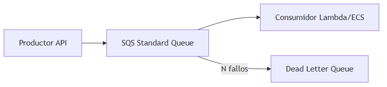

#### Cuándo usar SQS

| Usa SQS cuando… | Usa SNS cuando… |
|---|---|
| Un consumidor procesa cada tarea | Un evento notifica a muchos suscriptores |
| Desacoplar servicios async | Fan-out a múltiples colas o Lambdas |

---

### 5.2 Amazon SNS (Simple Notification Service)

#### Definición formal

**Amazon SNS** es un servicio **pub/sub** que envía mensajes a múltiples **suscriptores** (SQS, Lambda, HTTP, email, SMS) — patrón **fan-out**.

#### Explicación desarrollada

Un publicador envía a un **topic**; SNS entrega copias a todos los suscriptores. Patrón típico: SNS → varias colas SQS (una por microservicio).

Equivalente parcial: **Service Bus Topic** o combinación **Event Grid + handlers** en Azure.

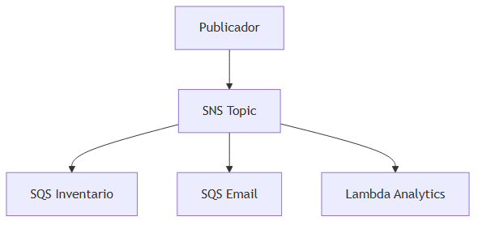

#### Cuándo usar SNS

Notificar múltiples sistemas del mismo evento ("pedido creado" → inventario + email + analytics).

---

### 5.3 Amazon EventBridge

#### Definición formal

**Amazon EventBridge** es un **bus de eventos serverless** que enruta eventos entre aplicaciones AWS, software SaaS y fuentes custom mediante **reglas** declarativas.

#### Explicación desarrollada

Equivalente cercano a **Azure Event Grid**. EventBridge conecta:

- Eventos de servicios AWS (EC2 state change, S3, etc.).
- Eventos custom de tu aplicación (`OrderCreated`).
- SaaS partners (Zendesk, Datadog, etc.).

Las **reglas** filtran por patrón JSON y envían a targets (Lambda, SQS, Step Functions).

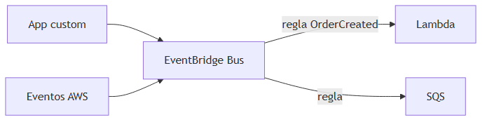

#### Cuándo usar EventBridge

Arquitecturas event-driven, integración entre servicios, automatización sin acoplar productores a consumidores concretos.

---

### 5.4 Amazon Kinesis

#### Definición formal

**Amazon Kinesis** es una plataforma de **streaming de datos** en tiempo real que incluye **Data Streams** (ingesta custom), **Firehose** (entrega a S3/Redshift) y **Analytics** (SQL sobre streams).

#### Explicación desarrollada

Equivalente a **Azure Event Hubs**. Modelo de **log particionado** para alto throughput: telemetría, logs, clickstreams, IoT.

| Componente | Función |
|---|---|
| **Kinesis Data Streams** | Productores/consumidores custom, shards |
| **Kinesis Firehose** | ETL managed hacia S3, OpenSearch, etc. |
| **Kinesis Analytics** | Consultas SQL en streaming (Managed Service for Apache Flink) |

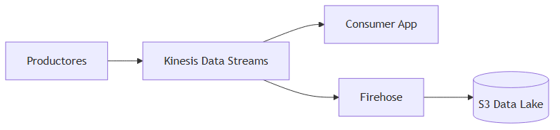

#### Cuándo usar Kinesis

| Usa Kinesis cuando… | Usa SQS cuando… |
|---|---|
| Millones de eventos/segundo | Mensajes de negocio individuales con DLQ |
| Múltiples consumidores leen mismo stream | Un worker por mensaje |

---

## 6. Identidad y seguridad

### 6.1 AWS IAM (Identity and Access Management)

#### Definición formal

**AWS IAM** es el servicio de **control de acceso** basado en **políticas JSON** que definen qué **principal** puede ejecutar qué **acción** sobre qué **recurso** bajo qué **condición**.

#### Explicación desarrollada

IAM es **transversal a todo AWS**. Elementos:

| Elemento | Descripción |
|---|---|
| **User** | Identidad humana con credenciales (evitar en prod para apps) |
| **Group** | Colección de users |
| **Role** | Identidad asumible (por EC2, Lambda, pod EKS) |
| **Policy** | Documento JSON de permisos |

Principio **least privilege:** concede solo permisos mínimos necesarios.

Ejemplo mental de policy: "Lambda role X puede `sqs:ReceiveMessage` en cola Y y `dynamodb:PutItem` en tabla Z".

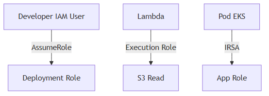

#### Cuándo aplicar IAM correctamente

Siempre. Errores comunes de juniors: access keys en código, policies `*` demasiado amplias, usar root account para tareas diarias.

---

### 6.2 IRSA (IAM Roles for Service Accounts)

#### Definición formal

**IRSA** es el mecanismo en **EKS** que permite a un **pod** asumir un **rol IAM** mediante el proveedor OIDC del clúster, sin almacenar access keys en el contenedor.

#### Explicación desarrollada

Equivalente a **Managed Identity / Workload Identity** en Azure AKS.

Flujo:

1. Service Account del pod anotado con ARN del rol IAM.
2. Pod solicita token OIDC al metadata del clúster.
3. STS de AWS intercambia token por credenciales temporales del rol.
4. SDK AWS en .NET usa esas credenciales para S3, SQS, etc.

---

### 6.3 AWS Secrets Manager y SSM Parameter Store

#### Definición formal

**AWS Secrets Manager** almacena secretos con **rotación automática** opcional e integración con RDS. **Systems Manager Parameter Store** almacena configuración y secretos (Standard sin coste, Advanced con cifrado KMS).

#### Explicación desarrollada

Equivalentes a **Azure Key Vault**. Secrets Manager para credenciales que rotan; Parameter Store para config simple (`/app/prod/MaxRetries`).

---

### 6.4 AWS KMS (Key Management Service)

#### Definición formal

**AWS KMS** gestiona **claves de cifrado** usadas por servicios AWS (S3, RDS, EBS) y aplicaciones para cifrar datos en reposo y en tránsito.

---

## 7. Red

### 7.1 Amazon VPC (Virtual Private Cloud)

#### Definición formal

**Amazon VPC** es una red virtual aislada en AWS con CIDR propio, **subnets** públicas y privadas, **route tables**, **Internet Gateway (IGW)**, **NAT Gateway** y **security groups**.

#### Explicación desarrollada

Equivalente a **Azure VNet**. Patrón típico producción:

- Subnet **pública:** load balancers, NAT Gateway.
- Subnet **privada:** EC2, ECS tasks, RDS (sin IP pública directa).

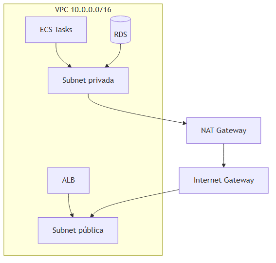

---

### 7.2 Elastic Load Balancing

#### Definición formal

AWS ofrece tres balanceadores:

| Balanceador | Capa | Uso |
|---|---|---|
| **ALB (Application Load Balancer)** | L7 HTTP/HTTPS | Routing por path/host, APIs REST |
| **NLB (Network Load Balancer)** | L4 TCP/UDP | Ultra baja latencia, millones de conexiones |
| **GLB (Gateway Load Balancer)** | L3/L4 | Appliances de seguridad inline |

#### Explicación desarrollada

ALB es el más común para APIs .NET en ECS/EKS/EC2. Termina TLS, health checks en `/health`, routing `/api/*` vs `/static/*`.

---

### 7.3 Amazon Route 53

#### Definición formal

**Route 53** es el servicio DNS de AWS con **hosted zones**, health checks y **routing policies** (weighted, latency, failover).

---

### 7.4 Amazon CloudFront

#### Definición formal

**CloudFront** es una **CDN (Content Delivery Network)** global con edge locations que cachea contenido cerca del usuario y se integra con S3, ALB y WAF.

Equivalente a **Azure Front Door / CDN**.

---

## 8. Observabilidad

### 8.1 Amazon CloudWatch

#### Definición formal

**Amazon CloudWatch** recopila **métricas**, **logs** y **alarmas** de servicios AWS y aplicaciones custom (métricas embebidas, agent en EC2).

#### Explicación desarrollada

Equivalente central a **Azure Monitor**. Componentes:

- **Metrics:** CPU, RequestCount, Duration de Lambda.
- **Logs:** Log Groups con Log Streams (stdout de containers).
- **Alarms:** acciones cuando métrica supera umbral (SNS, autoscaling).
- **Dashboards:** visualización operativa.

---

### 8.2 AWS X-Ray

#### Definición formal

**AWS X-Ray** proporciona **trazas distribuidas**, mapa de servicios y análisis de latencia para aplicaciones en Lambda, ECS, EKS y EC2.

#### Explicación desarrollada

Equivalente a **Application Insights** para trazas. SDK X-Ray en .NET propaga segmentos entre API → SQS → Lambda → DynamoDB.

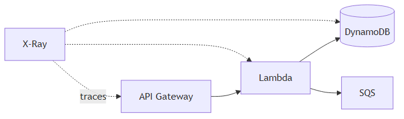

---

### 8.3 AWS CloudTrail

#### Definición formal

**AWS CloudTrail** registra **llamadas a la API AWS** (quién, qué, cuándo, desde dónde) para auditoría y compliance.

No confundir con CloudWatch Logs de aplicación: CloudTrail es auditoría de **control plane**.

---

## 9. DevOps

### 9.1 Amazon ECR (Elastic Container Registry)

#### Definición formal

**ECR** es registro **privado** de imágenes Docker/OCI integrado con ECS, EKS y pipelines CI/CD.

Equivalente a **ACR**.

---

### 9.2 AWS CodePipeline, CodeBuild, CodeDeploy

#### Definición formal

Suite **CI/CD nativa AWS:**

| Servicio | Función |
|---|---|
| **CodeBuild** | Compilar, test, build imagen |
| **CodePipeline** | Orquestar stages |
| **CodeDeploy** | Desplegar a EC2, ECS, Lambda |

Alternativa a GitHub Actions; muchos equipos usan GitHub Actions + OIDC a AWS igual que en Azure.

---

### 9.3 CloudFormation, CDK, Terraform

#### Definición formal

**CloudFormation** declara infraestructura en YAML/JSON (IaC nativo AWS). **AWS CDK** genera CloudFormation desde TypeScript, Python, C#, etc. **Terraform** es multicloud con HCL.

Equivalente a **Bicep/ARM** en Azure.

---

### 9.4 eksctl

#### Definición formal

**eksctl** es CLI oficial para crear y gestionar clústeres **EKS** de forma declarativa (`eksctl create cluster`).

---

## 10. Tabla de equivalencias Azure ↔ AWS

| Concepto | Azure | AWS |
|---|---|---|
| Kubernetes gestionado | AKS | EKS |
| Registro de contenedores | ACR | ECR |
| Cola de mensajes | Service Bus | SQS |
| Pub/sub | Service Bus Topic / Event Grid | SNS / EventBridge |
| Streaming | Event Hubs | Kinesis |
| Serverless compute | Azure Functions | Lambda |
| SQL PaaS | Azure SQL | RDS / Aurora |
| NoSQL global | Cosmos DB | DynamoDB |
| Cache | Azure Cache for Redis | ElastiCache |
| Identidad workload | Managed Identity | IAM Role / IRSA |
| Secretos | Key Vault | Secrets Manager |
| APM / trazas | Application Insights | X-Ray |
| Object storage | Blob Storage | S3 |
| CDN + WAF | Front Door | CloudFront + WAF |
| VM IaaS | Virtual Machines | EC2 |
| Contenedores serverless | Container Apps | Fargate |
| API serverless HTTP | Functions + APIM | Lambda + API Gateway |
| DNS | Azure DNS | Route 53 |
| Red privada | VNet | VPC |

**Importante:** equivalencia ≠ intercambiable sin cambios. APIs, pricing, límites y operación difieren.

---

## 11. Resiliencia y costes

### 11.1 Multi-AZ

#### Definición formal

**Multi-AZ** despliega recursos replicados en **Availability Zones distintas** dentro de la misma región para tolerar fallo de un datacenter.

#### Explicación desarrollada

Ejemplo: RDS Multi-AZ mantiene réplica sincrónica en otra AZ; si primary falla, failover automático. Protege contra fallo de edificio, no de región entera.

---

### 11.2 Multi-Region

#### Definición formal

**Multi-Region** replica servicios en **regiones geográficas distintas** para disaster recovery geográfico y baja latencia global.

Complejidad: replicación de datos, conflictos de escritura, coste duplicado.

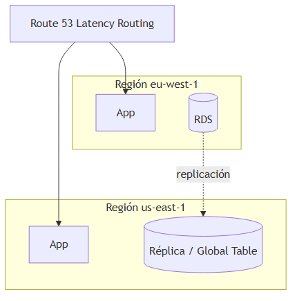

---

### 11.3 Modelos de precio compute

| Modelo | Descripción | Cuándo |
|---|---|---|
| **On-Demand** | Pago por hora/segundo sin compromiso | Cargas impredecibles, desarrollo |
| **Reserved Instances / Savings Plans** | Compromiso 1–3 años, descuento | Carga estable producción |
| **Spot Instances** | Capacidad sobrante barata; puede interrumpirse | Batch, workers tolerantes a fallos |

---

## 12. Diagrama: stack típico con EKS

> *Fuente editable (Mermaid):* [06-aws-stack.mermaid](./assets/diagrams/06-aws-stack.mermaid)

**Lectura del flujo:**

1. Pipeline compila .NET, construye imagen, push a ECR.
2. Despliegue en EKS (kubectl/Helm/GitOps).
3. Pods con IRSA leen Secrets Manager.
4. Comunicación async via SQS (+ DLQ).
5. Datos en RDS/Aurora.
6. Métricas, logs y alarmas en CloudWatch; trazas opcionales en X-Ray.

---

## 13. Resumen del capítulo

- **AWS** organiza servicios por dominio; **IAM** es transversal a todos.
- **Compute:** EC2 (IaaS), Fargate/ECS (contenedores sin K8s), EKS (Kubernetes), Lambda (serverless).
- **Datos:** S3 (objetos), RDS/Aurora (SQL), DynamoDB (NoSQL escalable), ElastiCache (Redis).
- **Mensajería:** SQS (colas), SNS (fan-out), EventBridge (bus eventos), Kinesis (streaming masivo).
- **Seguridad:** IAM roles > access keys; IRSA en EKS; Secrets Manager + KMS.
- **Observabilidad:** CloudWatch (métricas/logs), X-Ray (trazas), CloudTrail (auditoría API).
- **Resiliencia:** Multi-AZ = HA regional; Multi-Region = DR geográfico; Spot/Reserved = optimización coste.
- Las **equivalencias con Azure** ayudan a transferir conocimiento, pero siempre valida detalles operativos.

**Siguiente paso:** capítulo 07 — **Kubernetes** en profundidad: cómo funciona el orquestador que usan tanto AKS como EKS.
