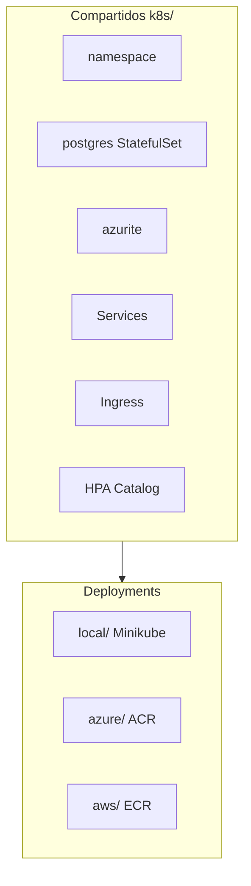

# 07 — Kubernetes y cloud-native en ShopDemo

**Objetivo:** Conceptos K8s aplicados al lab y preguntas típicas de entrevista SRE/DevOps.

---

## Estructura de manifiestos



Fuente: [assets/diagrams/07-k8s-estructura.mermaid](./assets/diagrams/07-k8s-estructura.mermaid)

**Regla de oro:** no mezclar `k8s/azure/` en EKS → `ImagePullBackOff`.

---

## Objetos K8s usados

| Objeto | ShopDemo | Para entrevista |
|---|---|---|
| **Namespace** | `shopdemo` | Aislamiento lógico |
| **Deployment** | 5 APIs | Réplicas, rolling update |
| **StatefulSet** | PostgreSQL | Identidad estable, PVC |
| **Service ClusterIP** | APIs internas | DNS `shopdemo-catalog:8080` |
| **Service LoadBalancer** | Lab EKS free-tier | IP pública directa |
| **Ingress** | NGINX, paths `/catalog`… | Un punto de entrada HTTP |
| **Secret** | `shopdemo-secrets` | EH, PG connection strings |
| **HPA** | Catalog 1–3 réplicas | Autoscaling demo CPU |
| **Job** | init-checkpoints Azurite | Setup blobs |

---

## Probes (resiliencia)

```yaml
livenessProbe:  GET /alive
readinessProbe: GET /health
```

**Entrevista:** *¿Diferencia liveness vs readiness?*

**Respuesta:** Readiness quita tráfico si no listo; liveness **reinicia** el pod si está muerto.

---

## Scripts y CI

- Manual: `apply-k8s-manifests.sh k8s {local|azure|aws}`
- CI: `deploy-aks.yml` / `deploy-eks.yml` tras merge a `main`

---

## Preguntas de entrevista

1. ¿Deployment vs StatefulSet para PostgreSQL?
2. ¿Por qué separar Service y Deployment?
3. ¿Qué es un Ingress Controller?
4. ¿Cómo actualiza CI la imagen sin re-aplicar todo el YAML?

**Profundizar:** [TEORIA-KUBERNETES-OPERACIONES.md](../despliegue/kubernetes/TEORIA-KUBERNETES-OPERACIONES.md) · [k8s/README.md](../../k8s/README.md)
