# 07 — Kubernetes y orquestación

## Objetivo de este capítulo

Comprender **qué es Kubernetes**, cómo funciona su arquitectura interna, qué **objetos** usa para desplegar aplicaciones .NET containerizadas, y qué conceptos de red, escalado, almacenamiento y seguridad necesitas para operar o desarrollar para K8s.

Asumimos que sabes C#, HTTP, SQL, y que has oído hablar de **Docker** (empaquetar una app en una imagen). Kubernetes **no sustituye** a Docker: **orquesta** contenedores — decide dónde corren, los mantiene vivos, los escala y los expone en red.

Conceptos que dominarás:

- Arquitectura: control plane vs worker nodes.
- Objetos: Pod, Deployment, Service, Ingress, ConfigMap, Secret, Namespace, HPA, StatefulSet.
- Probes de salud: liveness, readiness, startup.
- Red, almacenamiento, Helm/Kustomize y seguridad básica.

> **Nota del instructor:** Kubernetes tiene curva de aprendizaje pronunciada. No intentes memorizar todos los campos YAML. Primero entiende **el modelo mental**: estado deseado → controladores reconcilian → estado actual converge.

---

## 1. ¿Qué problema resuelve Kubernetes?

### Definición formal

**Kubernetes (K8s)** es una plataforma **open source** de **orquestación de contenedores** que automatiza el despliegue, escalado, operación y recuperación de aplicaciones containerizadas en un **clúster** de máquinas.

### Explicación desarrollada

Imagina que tienes 5 microservicios .NET, cada uno en un contenedor Docker, y quieres:

- 3 copias del servicio de pedidos porque hay mucho tráfico.
- Reinicio automático si un contenedor crashea.
- Despliegue de nueva versión **sin downtime** (rolling update).
- Un nombre DNS estable (`orders-api`) aunque los contenedores cambien de IP.
- Escalar cuando sube la CPU.

Hacer esto manualmente con `docker run` en varios servidores es frágil. Kubernetes lee archivos **declarativos** (YAML) que describen el **estado deseado** ("quiero 3 réplicas de esta imagen") y **controladores** trabajan continuamente para que la realidad coincida.

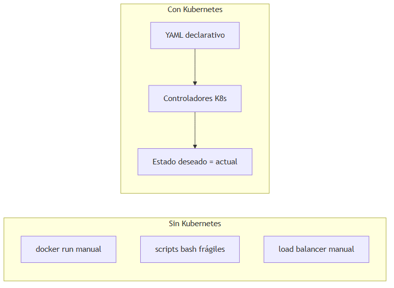

### Cuándo usar Kubernetes

| Usa Kubernetes cuando… | Evita Kubernetes cuando… |
|---|---|
| Varios microservicios en contenedores | Una sola API monolítica simple |
| Necesitas escalado, self-healing, rollouts | Equipo sin capacidad de operar K8s |
| Portabilidad entre AKS, EKS, Minikube, on-prem | App Service / Fargate cubren tu caso con menos complejidad |

---

## 2. Conceptos previos: contenedores e imágenes

### Definición formal

Un **contenedor** es un proceso aislado que empaqueta aplicación + dependencias runtime en una **imagen** inmutable construida desde un `Dockerfile`.

### Explicación desarrollada

Para un desarrollador C#:

```dockerfile
FROM mcr.microsoft.com/dotnet/aspnet:10.0
WORKDIR /app
COPY publish/ .
ENTRYPOINT ["dotnet", "Orders.Api.dll"]
```

- `docker build` crea la **imagen**.
- `docker run` inicia un **contenedor** (instancia de la imagen).
- Kubernetes **no construye** imágenes; las **descarga** de un registro (ACR, ECR, Docker Hub) y las ejecuta en pods.

---

## 3. Arquitectura del clúster

### Definición formal

Un **clúster Kubernetes** consta de un **control plane** (cerebro) y uno o más **worker nodes** (músculo donde corren los contenedores).

### Explicación desarrollada

#### Control Plane (plano de control)

| Componente | Definición | Función |
|---|---|---|
| **kube-apiserver** | API REST front-end | Punto de entrada para `kubectl`, controladores y usuarios |
| **etcd** | Base de datos clave-valor distribuida | Almacena **todo** el estado del clúster (fuente de verdad) |
| **kube-scheduler** | Planificador | Asigna pods a nodos según CPU, memoria, afinidad |
| **kube-controller-manager** | Bucle de control | ReplicaSets, Nodes, Jobs — reconcilian estado |
| **cloud-controller-manager** | Integración cloud | Crea load balancers, discos, rutas (AKS/EKS) |

#### Worker Nodes (nodos de trabajo)

| Componente | Definición | Función |
|---|---|---|
| **kubelet** | Agente en cada nodo | Asegura que los contenedores del pod están corriendo según spec |
| **kube-proxy** | Proxy de red | Reglas iptables/IPVS para Services |
| **Container runtime** | containerd, CRI-O | Ejecuta contenedores (estándar CRI) |

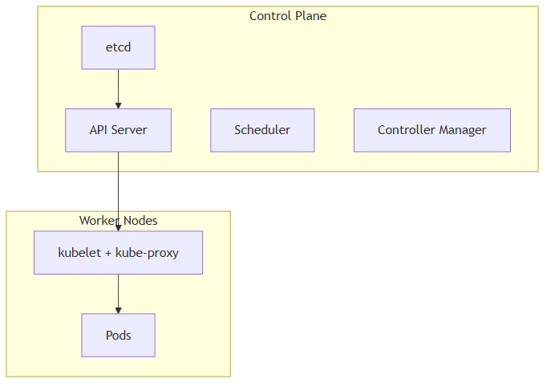

> *Fuente editable (Mermaid):* [07-k8s-architecture.mermaid](./assets/diagrams/07-k8s-architecture.mermaid)

**Analogía del instructor:** el control plane es la oficina de tráfico aéreo; los nodos son las pistas; los pods son los aviones. La API server es la torre de control; etcd es la libreta donde se anota quién está en el aire.

### Cuándo te importa esta arquitectura

- Como **desarrollador:** interactúas con API server via `kubectl`.
- Como **operador:** etcd corrupto o API server caído = clúster no funcional.
- En **AKS/EKS:** el proveedor gestiona control plane; tú gestionas nodos (o Fargate/serverless nodes).

---

## 4. Objetos fundamentales

Kubernetes organiza recursos como **objetos** con `apiVersion`, `kind`, `metadata`, `spec` (deseo) y `status` (realidad).

### 4.1 Pod

#### Definición formal

Un **Pod** es la **unidad mínima de despliegue** en Kubernetes: uno o más contenedores que comparten la misma **IP de red**, **namespace de red** y **volúmenes**, programados juntos en el mismo nodo.

#### Explicación desarrollada

¿Por qué no desplegar contenedores sueltos? Porque K8s necesita una unidad coherente de:

- **Red:** contenedores en el mismo pod se hablan via `localhost`.
- **Almacenamiento:** volúmenes compartidos montados en varios contenedores.

Patrón **sidecar:** contenedor auxiliar en el mismo pod:

- App principal: API .NET.
- Sidecar: agente de logs, proxy Envoy, o Dapr.

Los pods son **efímeros**: si mueren, otro pod con **IP distinta** los reemplaza. Por eso no llamas directamente a la IP del pod desde fuera.

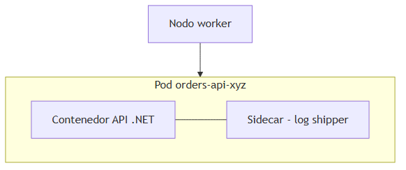

#### Cuándo crear pods directamente

**Casi nunca.** Usa Deployments u otros controladores que gestionan pods por ti.

---

### 4.2 Deployment

#### Definición formal

Un **Deployment** es un objeto **declarativo** que gestiona un **ReplicaSet** para mantener un número deseado de **pods idénticos**, con estrategias de actualización (rolling update, recreate).

#### Explicación desarrollada

Ejemplo mental de spec:

- Imagen: `myregistry/orders-api:1.2.0`
- Réplicas: 3
- Rolling update: `maxSurge: 1`, `maxUnavailable: 0` (siempre 3 disponibles durante update)

Flujo de rolling update:

1. Crea pod con versión nueva.
2. Espera readiness OK.
3. Termina pod viejo.
4. Repite hasta completar.

**Rollback:** `kubectl rollout undo deployment/orders-api` vuelve a revisión anterior.

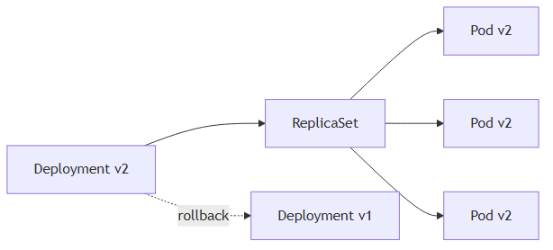

#### Cuándo usar Deployment

| Usa Deployment cuando… | Usa StatefulSet cuando… |
|---|---|
| API stateless (sin identidad de pod fija) | BD, broker, identidad estable pod-0, pod-1 |
| Escalado horizontal simple | Disco persistente por réplica |

---

### 4.3 ReplicaSet

#### Definición formal

Un **ReplicaSet** garantiza que un número especificado de **réplicas de pod** esté corriendo en todo momento, seleccionando pods por **label selector**.

#### Explicación desarrollada

Normalmente **no creas ReplicaSets directamente**; el Deployment los gestiona. Si un pod muere, ReplicaSet crea otro.

---

### 4.4 Service

#### Definición formal

Un **Service** es una abstracción de **red** que expone un conjunto de pods mediante una **IP virtual estable (ClusterIP)** y **DNS interno**, seleccionando pods por **labels**.

#### Explicación desarrollada

Problema: pods van y vienen con IPs nuevas. Solución: Service `orders-api` tiene DNS `orders-api.default.svc.cluster.local` que apunta a todos los pods con label `app=orders-api`.

Tipos:

| Tipo | Definición | Uso |
|---|---|---|
| **ClusterIP** | IP interna solo dentro del clúster | Comunicación entre microservicios (default) |
| **NodePort** | Expone puerto en cada nodo (30000–32767) | Pruebas, acceso directo sin LB cloud |
| **LoadBalancer** | Provisión de LB externo via cloud | Exponer API a internet (AKS/EKS crean ALB/Azure LB) |
| **ExternalName** | CNAME DNS a servicio fuera del clúster | Alias a BD managed externa |

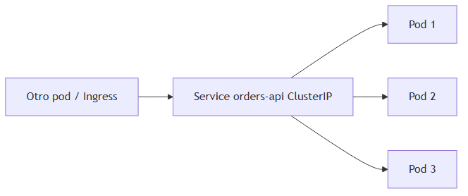

#### Cuándo usar cada tipo

- **ClusterIP:** 99 % de comunicación interna entre APIs.
- **LoadBalancer:** exposición directa (coste por LB; en producción suele preferirse Ingress).
- **NodePort:** desarrollo local (Minikube).

---

### 4.5 Ingress

#### Definición formal

Un **Ingress** define **reglas de enrutamiento HTTP/HTTPS** desde fuera del clúster hacia **Services** internos. Requiere un **Ingress Controller** (NGINX, Traefik, AWS Load Balancer Controller) instalado en el clúster.

#### Explicación desarrollada

Un solo punto de entrada puede enrutar:

- `api.miempresa.com/orders` → Service `orders-api`
- `api.miempresa.com/catalog` → Service `catalog-api`

Funciones adicionales (según controller):

- Terminación TLS (cert-manager + Let's Encrypt).
- Rate limiting, WAF (con anotaciones o IngressClass avanzada).

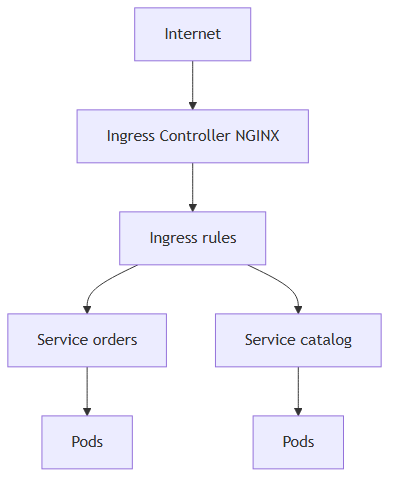

#### Cuándo usar Ingress

| Usa Ingress cuando… | Usa LoadBalancer Service cuando… |
|---|---|
| Múltiples APIs en un dominio/paths | Un solo servicio expuesto, simplicidad |
| TLS centralizado, routing L7 | Protocolo no HTTP (TCP puro → NLB) |

---

### 4.6 ConfigMap y Secret

#### Definición formal

**ConfigMap** almacena datos de configuración **no sensibles** en pares clave-valor. **Secret** almacena datos **sensibles** (contraseñas, tokens, certificados), codificados en base64 por defecto (no es cifrado fuerte por sí solo).

#### Explicación desarrollada

Equivalente mental a `appsettings.json` vs credenciales:

| Objeto | Ejemplo contenido | Inyección en pod |
|---|---|---|
| ConfigMap | `Logging__Level=Information`, URL de servicio interno | Env var o volumen montado |
| Secret | Connection string SQL, API key | Env var o volumen (evitar log accidental) |

**Buenas prácticas para juniors:**

- Secret en etcd debe estar **cifrado at rest** (habilitado en producción).
- Mejor aún: **External Secrets Operator** sincroniza desde Key Vault / Secrets Manager.
- **Nunca** commitear Secrets en Git en texto plano.

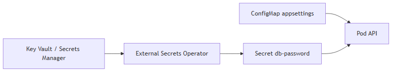

#### Cuándo usar cada uno

- ConfigMap: todo lo que podrías poner en Git sin vergüenza.
- Secret: credenciales; preferir referencias externas en producción.

---

### 4.7 Namespace

#### Definición formal

Un **Namespace** es una **partición lógica** del clúster para aislar recursos por equipo, entorno o aplicación (`dev`, `staging`, `prod`, `team-payments`).

#### Explicación desarrollada

Los namespaces **no** aíslan red por defecto (necesitas NetworkPolicy). Sirven para:

- Cuotas de recursos (ResourceQuota).
- RBAC por equipo.
- Organización de `kubectl get pods -n prod`.

#### Cuándo usar namespaces

Separar entornos en clúster compartido de desarrollo; en producción muchas empresas usan clústeres separados por entorno crítico.

---

### 4.8 Horizontal Pod Autoscaler (HPA)

#### Definición formal

**HPA** escala automáticamente el número de **réplicas** de un Deployment (o StatefulSet) basándose en **métricas** observadas: CPU, memoria, o métricas custom de Prometheus.

#### Explicación desarrollada

Ejemplo: "si CPU promedio > 70 % durante 2 minutos, sube de 3 a 10 réplicas; máximo 10".

Requisitos:

- Metrics Server instalado (CPU/memoria básica).
- Requests/limits de CPU definidos en pods (HPA usa requests como referencia).

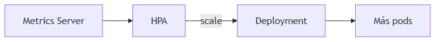

#### Cuándo usar HPA

Tráfico variable en APIs stateless. No confundir con **Cluster Autoscaler** (añade nodos al clúster cuando faltan recursos).

---

### 4.9 StatefulSet

#### Definición formal

Un **StatefulSet** gestiona pods con **identidad estable** (nombre `app-0`, `app-1`), **almacenamiento persistente por réplica** y despliegue ordenado (0 antes que 1).

#### Explicación desarrollada

Cada pod obtiene su propio **PersistentVolumeClaim** persistente. Si `postgres-0` muere, el reemplazo recupera el mismo disco.

#### Cuándo usar StatefulSet

Bases de datos, Kafka, Redis cluster, cualquier app donde la identidad del nodo importa. Para APIs .NET stateless, usa **Deployment**.

---

## 5. Probes (sondas de salud)

### Definición formal

Las **probes** son comprobaciones periódicas que Kubernetes ejecuta contra un contenedor para determinar su estado de **salud** y **disponibilidad**.

### Explicación desarrollada

| Probe | Pregunta que responde | Si falla… |
|---|---|---|
| **liveness** | ¿El proceso está vivo o bloqueado? | **Reinicia** el contenedor |
| **readiness** | ¿Puede recibir tráfico ahora? | Lo **quita** del Service (no recibe requests) |
| **startup** | ¿Terminó el arranque inicial? | Desactiva liveness/readiness hasta OK |

En ASP.NET Core típicamente apuntas a `/health` o `/alive`:

- **readiness:** incluye check de SQL (si BD caída, no recibir tráfico).
- **liveness:** check ligero (proceso responde); **conservador** — no reinicies por lentitud temporal.

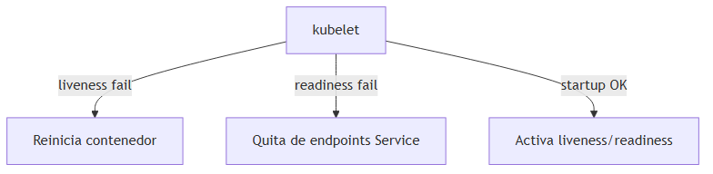

### Cuándo configurar cada probe

| Probe | Configura cuando… |
|---|---|
| **startup** | App tarda >30s en arrancar (migrations, warm-up) |
| **readiness** | Dependencias externas (BD, cache) deben estar OK |
| **liveness** | Proceso puede deadlock; umbral generoso para evitar restart loops |

**Error común de junior:** liveness que consulta BD → BD lenta → reinicios en cascada.

---

## 6. Networking en Kubernetes

### Definición formal

El modelo de red de Kubernetes asigna a **cada pod una IP** en un espacio de red del clúster (**modelo flat**); los pods se comunican directamente sin NAT entre ellos (idealmente).

### Explicación desarrollada

Conceptos:

- **DNS interno:** CoreDNS resuelve `servicio.namespace.svc.cluster.local`.
- **Service virtual IP:** kube-proxy redirige tráfico a pods backend.
- **NetworkPolicy:** firewall declarativo entre pods (allow/deny por labels y namespaces).
- **CNI plugins:** implementan red real (Calico, Azure CNI, Amazon VPC CNI, Flannel).

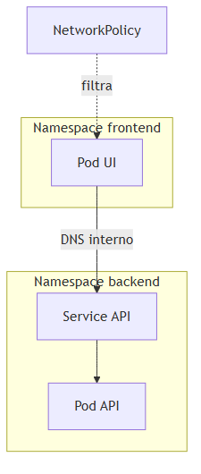

### Cuándo usar NetworkPolicy

Producción multi-tenant o microservicios con principio least privilege: solo el Ingress y el servicio de pedidos pueden llamar al servicio de pagos.

---

## 7. Almacenamiento

### Definición formal

Kubernetes abstrae almacenamiento persistente mediante **PersistentVolume (PV)**, **PersistentVolumeClaim (PVC)** y **StorageClass** para provisión dinámica.

### Explicación desarrollada

| Recurso | Definición |
|---|---|
| **PersistentVolume (PV)** | Recurso de almacenamiento del clúster (disco EBS, Azure Disk, NFS) |
| **PersistentVolumeClaim (PVC)** | Solicitud de almacenamiento por un pod ("quiero 10 Gi ReadWriteOnce") |
| **StorageClass** | Plantilla de provisión dinámica ("crear EBS gp3 automáticamente") |

Flujo:

1. Pod declara `volumeMount` con `claimName: postgres-data`.
2. PVC pendiente → StorageClass provisiona PV → bound.
3. Pod monta disco en `/var/lib/postgresql/data`.

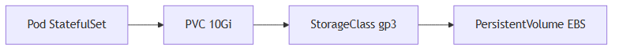

### Cuándo usar almacenamiento persistente

Bases de datos en K8s (debate operativo), caches con estado, uploads temporales que deben sobrevivir restart. APIs stateless: **no** necesitan PVC.

---

## 8. Helm y Kustomize

### 8.1 Helm

#### Definición formal

**Helm** es el gestor de paquetes de Kubernetes: empaqueta manifiestos en **Charts** parametrizables con `values.yaml` y gestiona **releases** versionadas.

#### Explicación desarrollada

En lugar de 20 YAML estáticos, instalas:

```bash
helm upgrade --install orders-api ./charts/orders -f values-prod.yaml
```

Útil para software de terceros (PostgreSQL, Redis, NGINX Ingress) y estandarizar despliegues internos.

---

### 8.2 Kustomize

#### Definición formal

**Kustomize** personaliza manifiestos YAML base mediante **overlays** (parches) por entorno sin templating (`dev`, `staging`, `prod`).

#### Explicación desarrollada

Base común + overlay prod cambia réplicas, imagen tag, recursos. Integrado en `kubectl apply -k`.

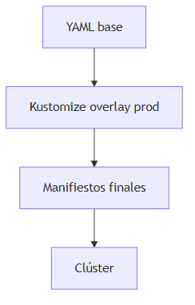

### Cuándo usar Helm vs Kustomize

| Helm | Kustomize |
|---|---|
| Paquetes reutilizables con muchos parámetros | Parches simples por entorno |
| Releases con historial rollback | Sin templating Go — YAML puro |

Muchos equipos usan **ambos**: Helm para infra terceros, Kustomize para apps propias.

---

## 9. Seguridad en Kubernetes

### 9.1 RBAC

#### Definición formal

**RBAC (Role-Based Access Control)** controla qué usuarios, grupos o **ServiceAccounts** pueden ejecutar qué operaciones sobre qué recursos en el API server.

Elementos: **Role/ClusterRole** (permisos) + **RoleBinding/ClusterRoleBinding** (asignación).

---

### 9.2 Pod Security Standards

#### Definición formal

**Pod Security Standards** definen tres perfiles — **Privileged**, **Baseline**, **Restricted** — que limitan capacidades peligrosas (ejecutar como root, hostNetwork, volúmenes sensibles).

---

### 9.3 Service Account

#### Definición formal

Un **ServiceAccount** es una identidad **dentro del clúster** para pods. Es la base para **IRSA** (AWS) y **Workload Identity** (Azure): el pod obtiene permisos cloud sin keys estáticas.

---

### 9.4 Admission Controllers

#### Definición formal

**Admission Controllers** interceptan requests al API server para **validar** o **mutar** objetos antes de persistirlos (ej. OPA Gatekeeper, Pod Security Admission).

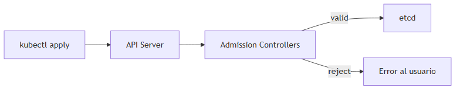

---

## 10. Flujo completo: desplegar una API .NET

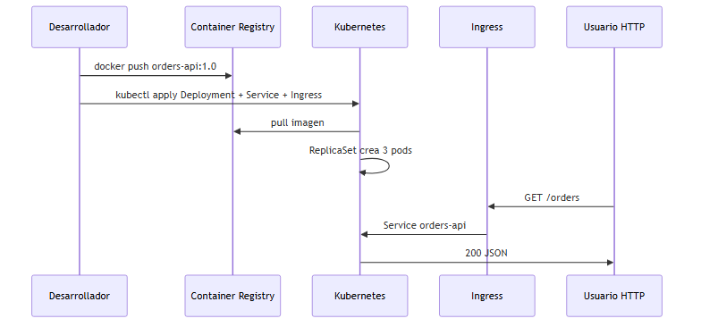

**Pasos resumidos:**

1. Empaquetar API en imagen Docker; publicar en registro.
2. Crear Deployment (réplicas, imagen, probes, resources, env from ConfigMap/Secret).
3. Crear Service ClusterIP (selector labels).
4. Crear Ingress (host, path, TLS).
5. Verificar `kubectl get pods`, logs, readiness.

---

## 11. kubectl: comandos esenciales para juniors

| Comando | Para qué |
|---|---|
| `kubectl get pods -n prod` | Listar pods |
| `kubectl describe pod <name>` | Eventos, probes fallidas, imagen |
| `kubectl logs <pod> -f` | Ver stdout (como consola) |
| `kubectl apply -f manifest.yaml` | Crear/actualizar recursos |
| `kubectl rollout status deployment/x` | Estado de despliegue |
| `kubectl port-forward svc/x 8080:80` | Acceso local debug |

---

## 12. Kubernetes managed: AKS y EKS

### Definición formal

**AKS** y **EKS** (capítulos 05–06) son Kubernetes donde el proveedor opera el **control plane**; tú gestionas nodos, manifiestos y aplicaciones.

### Explicación desarrollada

Lo que aprendes en este capítulo es **portable**: mismo Deployment YAML funciona en Minikube local, AKS y EKS (ajustando Ingress controller, StorageClass e identidad cloud).

---

## 13. Resumen del capítulo

- **Kubernetes orquesta contenedores:** estado deseado declarativo, controladores reconcilian.
- **Control plane** decide; **worker nodes** ejecutan **pods** (unidad mínima).
- **Deployment** gestiona réplicas y rollouts; **Service** da IP/DNS estable; **Ingress** enruta HTTP externo.
- **ConfigMap/Secret** inyectan configuración; en producción preferir secret stores externos.
- **liveness** reinicia; **readiness** controla tráfico; **startup** protege arranques lentos.
- **HPA** escala pods; **StatefulSet** para cargas con estado e identidad estable.
- **Helm/Kustomize** gestionan complejidad de manifiestos; **RBAC/NetworkPolicy** aseguran el clúster.
- **AKS/EKS** aplican este conocimiento en la nube; practica localmente con Minikube o kind.

**Siguiente paso:** capítulo 08 — cómo **automatizar** build, test y despliegue con **CI/CD y DevOps**.
