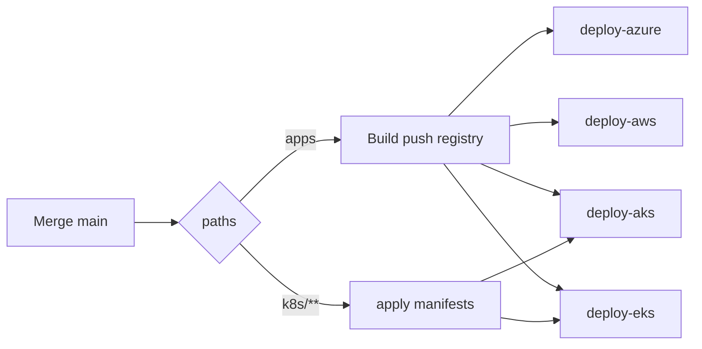

# 08 — CI/CD y DevOps en ShopDemo

**Objetivo:** Explicar pipelines GitHub Actions, environments y flujo post-merge.

---

## Pipeline conceptual

Fuente: [assets/diagrams/08-cicd.mermaid](./assets/diagrams/08-cicd.mermaid)

---

## Cuatro workflows

| Workflow | Environment | Acción principal |
|---|---|---|
| `deploy-azure.yml` | `azure` | Actualiza 5 Container Apps |
| `deploy-aws.yml` | `aws` | Nueva task definition ECS |
| `deploy-aks.yml` | `azure-aks` | Build ACR + `kubectl set image` |
| `deploy-eks.yml` | `aws-eks` | Build ECR + `kubectl set image` |

**Importante:** los workflows **no crean** VPC/cluster/ACA desde cero — infra inicial con scripts PowerShell.

---

## GitHub Environments

Separan secrets y aprobaciones por plataforma: `azure`, `azure-aks`, `aws`, `aws-eks`.

**Entrevista:** *¿Por qué environments y no solo secrets de repo?*

**Respuesta:** Aislamiento, gates de aprobación y principio de mínimo privilegio por destino de deploy.

---

## Primer deploy K8s (bootstrap)

Run manual con inputs:

- `sync_secrets` — Secret `shopdemo-secrets` en cluster
- `apply_manifests` — YAML deployments + ingress
- `apply_infra` — postgres + azurite (solo cluster vacío)

---

## Anti-patrones detectados en el lab

- `secrets.X` en `if:` de workflow → error en `workflow_dispatch`
- Aplicar `k8s/aws/` en cluster AKS → imágenes ECR incorrectas

---

## Preguntas de entrevista

1. ¿Path filters en GitHub Actions?
2. ¿Diferencia CI vs CD en ShopDemo?
3. ¿OIDC AWS vs access keys?
4. ¿Qué pasa si solo cambias docs en `main`?

**Profundizar:** [.github/README.md](../../.github/README.md) · [SECRETS-CHECKLIST.md](../../.github/SECRETS-CHECKLIST.md)
