# 08 — CI/CD y DevOps

## Objetivo de este capítulo

Entender los **principios de DevOps**, la diferencia entre **CI y CD**, cómo se estructura un **pipeline** de integración y entrega continua, qué **estrategias de despliegue** existen, y qué prácticas hacen que operar software en producción sea **confiable y repetible**.

Asumimos que sabes C#, Git, HTTP, SQL, y que has leído los capítulos de cloud (05–06) y Kubernetes (07). Aquí conectamos **código** con **despliegue automatizado**.

Conceptos que dominarás:

- Qué es DevOps y por qué importa a un desarrollador.
- CI vs Continuous Delivery vs Continuous Deployment.
- Anatomía de un pipeline (build, test, scan, publish, deploy, verify).
- GitHub Actions como ejemplo concreto.
- Estrategias: rolling, blue-green, canary, feature flags.
- GitOps, IaC, secretos, versionado SemVer y métricas DORA.

> **Nota del instructor:** DevOps no es "el equipo de infra". Es una forma de trabajar donde **tú** entiendes cómo tu código llega a producción y qué pasa cuando falla. Incluso como junior, leer pipelines YAML te hace mejor desarrollador.

---

## 1. ¿Qué es DevOps?

### Definición formal

**DevOps** es un conjunto de **prácticas culturales, procesos y herramientas** que unen desarrollo (**Dev**) y operaciones (**Ops**) para entregar software de forma **frecuente, confiable y automatizada**, con feedback rápido y mejora continua.

### Explicación desarrollada

Antes (modelo tradicional):

- Desarrolladores escribían código y "tiraban por la pared" a operaciones.
- Despliegues manuales, frágiles, una vez al mes.
- Culpa mutua cuando producción fallaba.

DevOps propone:

- **Automatizar** build, test y despliegue.
- **Compartir responsabilidad** de la salud en producción.
- **Medir** (frecuencia de deploy, tiempo de recuperación).
- **Reducir lotes** de cambio (commits pequeños, deploys frecuentes).

Para un junior en .NET: DevOps significa que cuando haces merge a `main`, un pipeline compila tu solución, ejecuta tests, construye imagen Docker y despliega en staging — sin que alguien copie DLLs a mano.

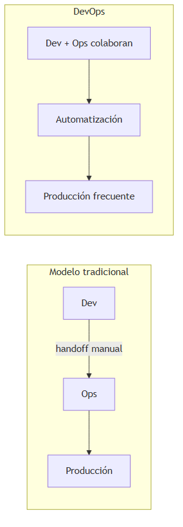

### Cuándo adoptar prácticas DevOps

Siempre que entregues software más allá de tu laptop. Desde equipos de 2 personas hasta empresas grandes, los principios escalan.

---

## 2. CI vs CD: tres siglas, dos significados de "CD"

### Definición formal

| Sigla | Nombre completo | Definición |
|---|---|---|
| **CI** | Continuous Integration | Integrar código frecuentemente en rama compartida con **build y tests automáticos** en cada cambio |
| **CD** | Continuous Delivery | Código siempre en estado **desplegable**; despliegue a producción es **decisión manual** |
| **CD** | Continuous Deployment | Cada cambio que pasa tests se **despliega automáticamente** a producción |

### Explicación desarrollada

**Continuous Integration (CI):**

- Haces commit varias veces al día.
- Pipeline compila (`dotnet build`), ejecuta tests (`dotnet test`), analiza calidad.
- Si algo rompe, el equipo lo detecta en **minutos**, no días después.

**Continuous Delivery:**

- Tras CI, el artefacto (DLL, imagen Docker) se publica a un registro.
- Despliegue a staging es automático; producción requiere **aprobación humana** (botón, ticket, change advisory).

**Continuous Deployment:**

- Sin aprobación manual: merge a `main` → producción.
- Requiere tests muy sólidos, feature flags y observabilidad madura.

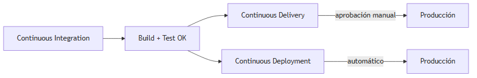

**Analogía:** CI es revisar cada ingrediente al cocinar. Delivery es tener el plato listo en pass (aprobación del chef para servir). Deployment es servir directamente al cliente cada plato aprobado por la máquina.

### Cuándo usar cada nivel

| Nivel | Elige cuando… |
|---|---|
| **CI mínimo** | Todo proyecto con más de una persona |
| **Continuous Delivery** | Mayoría de empresas reguladas o con ventanas de cambio |
| **Continuous Deployment** | Startups con tests/observabilidad excelentes, tolerancia al riesgo calculado |

---

## 3. Anatomía de un pipeline

### Definición formal

Un **pipeline CI/CD** es una secuencia **automatizada** de pasos que transforma código fuente en software desplegado en un entorno, con validaciones en cada fase.

### Explicación desarrollada


> *Fuente editable (Mermaid):* [08-cicd-pipeline.mermaid](./assets/diagrams/08-cicd-pipeline.mermaid)

#### Fase 1: Source (origen)

**Definición:** Trigger que inicia el pipeline.

Eventos comunes:

- `push` a rama `main` o `develop`.
- `pull_request` abierto o actualizado (validación antes de merge).
- `workflow_dispatch` (ejecución manual).
- Tag `v1.2.0` (release).

#### Fase 2: Build (compilación)

**Definición:** Restaurar dependencias, compilar y empaquetar artefacto.

En .NET:

```bash
dotnet restore
dotnet build --configuration Release --no-restore
dotnet publish -c Release -o ./publish
```

Salida: DLLs, o **imagen Docker** si el despliegue es containerizado.

#### Fase 3: Test (pruebas)

**Definición:** Ejecutar pruebas automatizadas según la **pirámide de testing**:

| Nivel | Qué prueba | Velocidad |
|---|---|---|
| **Unitarios** | Clases, funciones aisladas | Muy rápido |
| **Integración** | BD, HTTP con TestServer | Medio |
| **Contrato** | API cumple contrato con consumidor | Medio |
| **E2E** | Flujo completo usuario-sistema | Lento |

Principio: muchos unitarios, pocos E2E. Pipeline falla si cualquier test crítico falla.

#### Fase 4: Análisis de seguridad (Security Scan)

**Definición:** Detectar vulnerabilidades antes de producción.

| Tipo | Sigla | Qué analiza |
|---|---|---|
| **SAST** | Static Application Security Testing | Código fuente (SQL injection patterns, etc.) |
| **SCA** | Software Composition Analysis | Dependencias NuGet con CVEs conocidos |
| **Container scan** | — | Imagen Docker (Trivy, Defender, Snyk) |

**Shift-left security:** encontrar problemas **temprano** (en PR), no tras el breach.

#### Fase 5: Publish (publicación)

**Definición:** Subir artefacto inmutable a registro confiable.

- Imagen Docker → ACR / ECR con tag `1.2.0` **y** digest SHA256.
- Paquetes NuGet → feed interno (Azure Artifacts, GitHub Packages).

El digest SHA256 garantiza que lo desplegado es **exactamente** lo construido (un tag puede sobrescribirse; el digest no).

#### Fase 6: Deploy (despliegue)

**Definición:** Aplicar cambios al entorno destino.

Mecanismos:

- `kubectl apply` / Helm upgrade en Kubernetes.
- Azure CLI / AWS CLI actualizando App Service, ECS, Lambda.
- Terraform/Bicep apply para infraestructura.

#### Fase 7: Verify (verificación)

**Definición:** Confirmar que el despliegue funciona.

- Smoke tests: `GET /health` retorna 200.
- Tests E2E contra staging.
- Canaries automáticos (métricas de error rate).

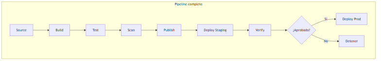

### Cuándo añadir cada fase

| Fase | Mínimo viable | Producción seria |
|---|---|---|
| Build + Test unitarios | Sí | Sí |
| Security scan | Opcional al inicio | Obligatorio |
| Deploy automático staging | Recomendado | Sí |
| Verify post-deploy | `/health` básico | Smoke + métricas |

---

## 4. GitHub Actions — conceptos esenciales

### Definición formal

**GitHub Actions** es la plataforma de **automatización CI/CD** integrada en GitHub que ejecuta **workflows** definidos en YAML en respuesta a **eventos**.

### Explicación desarrollada

Vocabulario:

| Elemento | Definición |
|---|---|
| **Workflow** | Archivo YAML en `.github/workflows/` que define el pipeline |
| **Event** | Trigger (`push`, `pull_request`, `schedule`, `workflow_dispatch`) |
| **Job** | Conjunto de **steps** que corre en un **runner** (máquina virtual) |
| **Step** | Comando shell o **action** reutilizable (`actions/checkout@v4`) |
| **Matrix** | Ejecutar job con variaciones (`.NET 8`, `.NET 10`, `ubuntu`, `windows`) |
| **Environment** | Entorno con protecciones (approvers requeridos) y secrets scoped |
| **Artifact** | Archivos pasados entre jobs (publish output, test results) |
| **OIDC** | Federación de identidad con cloud sin client secret permanente |

Ejemplo mental de workflow:

```yaml
on:
  push:
    branches: [main]
jobs:
  build:
    runs-on: ubuntu-latest
    steps:
      - uses: actions/checkout@v4
      - uses: actions/setup-dotnet@v4
        with:
          dotnet-version: '10.0.x'
      - run: dotnet test
```

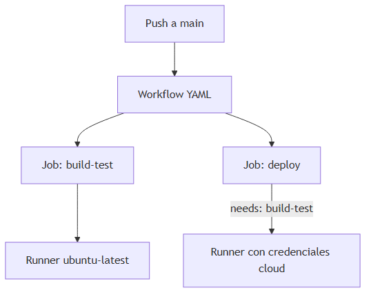

### Cuándo usar GitHub Actions

Repositorio ya en GitHub; alternativas equivalentes: Azure DevOps Pipelines, GitLab CI, Jenkins, CircleCI. Los **conceptos** de este capítulo aplican a todas.

---

## 5. Estrategias de despliegue

### Definición formal

Una **estrategia de despliegue** define **cómo** se reemplaza la versión en ejecución por una nueva minimizando downtime, riesgo y complejidad de rollback.

### 5.1 Rolling update

#### Definición formal

**Rolling update** reemplaza instancias **gradualmente**: algunas en versión nueva, otras en vieja, hasta completar la transición.

#### Explicación desarrollada

Default en Kubernetes Deployments (`maxSurge`, `maxUnavailable`). También en App Service slots parciales o ECS rolling deploy.

| Ventaja | Riesgo |
|---|---|
| Simple, sin infra extra | Mezcla temporal de versiones (compatibilidad API) |
| Sin downtime si readiness OK | Rollback toma minutos (rollout inverso) |

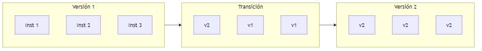

#### Cuándo usar rolling update

Despliegues rutinarios, APIs backward-compatible, equipos sin service mesh.

---

### 5.2 Blue-Green

#### Definición formal

**Blue-Green** mantiene **dos entornos idénticos** (blue=actual, green=nueva versión); el tráfico se **conmuta** de golpe del uno al otro.

#### Explicación desarrollada

- Blue recibe 100 % tráfico producción.
- Green recibe despliegue nuevo + tests internos.
- Switch de load balancer / DNS → green pasa a producción.
- Rollback = switch de vuelta a blue (segundos).

| Ventaja | Riesgo |
|---|---|
| Rollback instantáneo | **Doble coste** de infra mientras existen ambos |
| Sin mezcla de versiones | Migraciones de BD deben ser compatibles forward/backward |

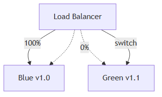

#### Cuándo usar blue-green

Releases críticas, necesidad de rollback inmediato, presupuesto para duplicar capacidad temporalmente.

---

### 5.3 Canary

#### Definición formal

**Canary deployment** dirige un **porcentaje pequeño** del tráfico real a la nueva versión; si métricas OK, incrementa gradualmente hasta 100 %.

#### Explicación desarrollada

Nombre viene de "canario en mina" — detectar problemas con exposición limitada.

Implementación:

- Kubernetes: Argo Rollouts, Flagger, service mesh (Istio).
- Cloud: pesos en ALB, Azure Front Door, LaunchDarkly integrado.

| Ventaja | Riesgo |
|---|---|
| Validación con tráfico real | Requiere métricas y alertas maduras |
| Blast radius pequeño | Complejidad de routing |

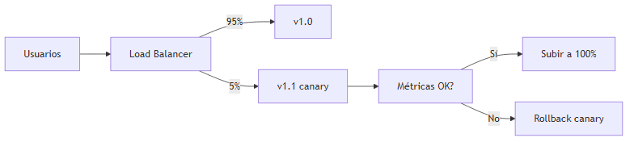

#### Cuándo usar canary

Alta escala, tolerancia cero a downtime masivo por bug, observabilidad (capítulo 09) implementada.

---

### 5.4 Feature flags

#### Definición formal

**Feature flags (toggles)** desacoplan **despliegue** (código en producción) de **release** (feature visible al usuario), activando funcionalidad en runtime via configuración.

#### Explicación desarrollada

Despliegas código con feature desactivada; activas para 1 % usuarios, luego 100 %. Rollback de feature = toggle off, sin redeploy.

| Ventaja | Riesgo |
|---|---|
| Control fino, A/B testing | Deuda de flags olvidados en código |
| Rollback lógico instantáneo | Complejidad de estados combinatorios |

#### Cuándo usar feature flags

Features grandes, experimentación, kill switch de emergencia. No abuses en lógica core simple.

---

### Tabla comparativa de estrategias

| Estrategia | Complejidad | Coste infra | Rollback | Mezcla versiones |
|---|---|---|---|---|
| Rolling | Baja | Bajo | Minutos | Sí, temporal |
| Blue-Green | Media | Alto | Segundos | No |
| Canary | Alta | Medio | Rápido parcial | Sí, controlada |
| Feature flags | Media (código) | Bajo | Instantáneo lógico | N/A |

---

## 6. GitOps

### Definición formal

**GitOps** es un paradigma donde el **repositorio Git es la fuente de verdad** del estado deseado del sistema (manifiestos K8s, Helm values, IaC), y un **operador** reconcilia continuamente el entorno real con lo declarado en Git.

### Explicación desarrollada

Herramientas: **Argo CD**, **Flux**.

Flujo:

1. Desarrollador mergea cambio en manifiestos (`replicas: 5`).
2. Operador detecta drift (clúster tiene 3 réplicas).
3. Operador aplica cambio automáticamente (o según policy).
4. Rollback = `git revert` del commit.

Principios:

| Principio | Significado |
|---|---|
| **Declarativo** | YAML/Helm describe estado deseado |
| **Versionado** | Cada cambio es commit auditable |
| **Automatizado** | Operador aplica sin `kubectl` manual |
| **Continuo** | Reconciliación en bucle |

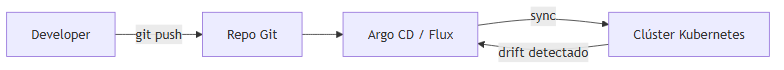

### Cuándo usar GitOps

Equipos con Kubernetes en producción que quieren auditoría, reproducibilidad y eliminar "kubectl manual en prod".

---

## 7. Infraestructura como Código (IaC)

### Definición formal

**Infraestructura como Código (IaC)** es la práctica de **provisionar y configurar** infraestructura (redes, BD, clústeres, permisos) mediante **archivos declarativos versionados** en Git, en lugar de clics manuales en portal cloud.

### Explicación desarrollada

Herramientas:

| Herramienta | Cloud | Lenguaje |
|---|---|---|
| **Terraform** | Multicloud | HCL |
| **Bicep** | Azure | Bicep |
| **ARM Templates** | Azure | JSON |
| **CloudFormation** | AWS | YAML/JSON |
| **AWS CDK** | AWS | TypeScript, Python, C# |
| **Pulumi** | Multicloud | C#, TypeScript, Python |

Beneficios:

- **Reproducibilidad:** entorno dev idéntico a prod (en teoría).
- **Revisión en PR:** cambio de firewall se revisa como código.
- **Detección de drift:** Terraform plan muestra diferencias.
- **Disaster recovery:** recrear infra desde Git.

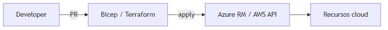

### Cuándo usar IaC

Desde el primer entorno compartido del equipo. Manual portal OK solo para experimentos personales temporales.

---

## 8. Gestión de secretos en CI/CD

### Definición formal

**Gestión de secretos** es el conjunto de prácticas y herramientas para almacenar, inyectar y rotar credenciales (tokens, connection strings, claves API) **sin exponerlas** en código fuente, logs ni artefactos.

### Explicación desarrollada

Reglas de oro:

1. **Nunca** commitear secretos en Git (ni en historial — usar escáneres si ocurre).
2. Usar **GitHub Secrets** / **Azure Key Vault** / **AWS Secrets Manager** según contexto.
3. **OIDC federado:** pipeline obtiene token temporal para asumir rol cloud — **sin client secret permanente** en GitHub.
4. **Rotación periódica** de credenciales.
5. Secretos como **variables de entorno** en runtime, no hardcoded en `appsettings.json` commiteado.

Flujo OIDC (Azure ejemplo mental):

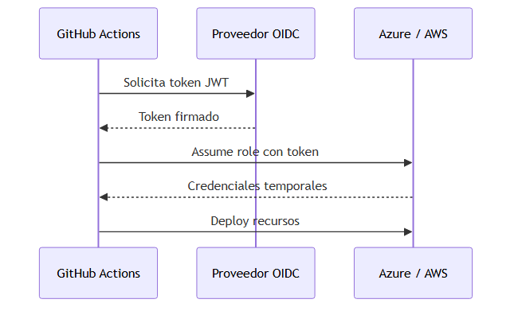

### Cuándo aplicar OIDC

Siempre que el pipeline despliegue en cloud desde GitHub Actions o similar. Evita secrets de larga duración robables.

---

## 9. Versionado y artefactos

### 9.1 Semantic Versioning (SemVer)

#### Definición formal

**SemVer** es un esquema de versionado `MAJOR.MINOR.PATCH`:

| Componente | Cuándo incrementar |
|---|---|
| **MAJOR** | Cambios incompatibles con versión anterior |
| **MINOR** | Funcionalidad nueva compatible hacia atrás |
| **PATCH** | Correcciones de bugs compatibles |

Ejemplo: `2.3.1` → bugfix; `2.4.0` → feature; `3.0.0` → breaking change.

### 9.2 Imágenes Docker inmutables

#### Definición formal

Un **artefacto inmutable** no se modifica tras crearse; nuevos cambios generan **nueva versión** con identificador único (tag + digest).

#### Explicación desarrollada

Buena práctica:

- Tag: `orders-api:1.2.0` (humano).
- Digest: `orders-api@sha256:abc123...` (garantía exacta en deploy K8s).

En Deployment K8s:

```yaml
image: myregistry/orders-api:1.2.0@sha256:abc123...
```

---

## 10. Calidad y seguridad en el pipeline

### Definición formal

**Quality gates** son criterios automáticos que el pipeline debe cumplir (cobertura mínima, cero vulnerabilidades críticas, tests E2E OK) antes de promover artefacto a entornos superiores.

### Explicación desarrollada

| Práctica | Definición | Propósito |
|---|---|---|
| **Shift-left security** | Seguridad desde diseño y PR | Evitar vulnerabilidades en prod |
| **SBOM** | Software Bill of Materials — inventario de dependencias | Trazabilidad ante CVEs |
| **Contract testing** | Verificar que productor/consumidor cumplen contrato API | Evitar romper microservicios |
| **Smoke tests post-deploy** | Tests mínimos tras despliegue | Detectar deploy roto rápido |
| **Lint / analyzers** | Reglas estáticas de código | Estilo y bugs obvios |

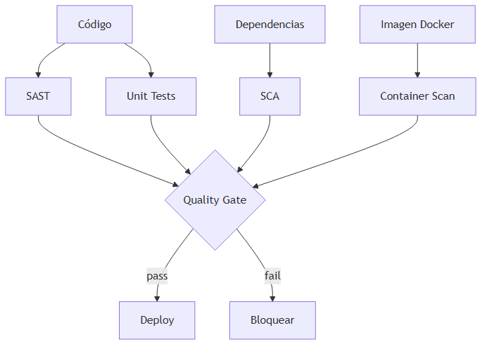

---

## 11. Entornos y promoción

### Definición formal

Un **entorno** (dev, staging, production) es un conjunto aislado de recursos cloud donde corre una versión del software, con configuración y datos apropiados al propósito.

### Explicación desarrollada

| Entorno | Propósito | Datos |
|---|---|---|
| **Development** | Integración diaria, inestable OK | Sintéticos / anonimizados |
| **Staging** | Réplica cercana a prod para validación | Copia anonimizada o subset |
| **Production** | Usuarios reales | Datos reales |

**Promoción:** mismo artefacto (imagen digest) pasa de staging a prod — **no recompilar** para prod (garantiza que lo testeado es lo desplegado).

---

## 12. Métricas DORA

### Definición formal

Las **métricas DORA** (DevOps Research and Assessment) son cuatro indicadores que miden la **madurez y rendimiento** de la entrega de software.

| Métrica | Definición | Equipos elite (referencia) |
|---|---|---|
| **Deployment Frequency** | Con qué frecuencia se despliega a producción | Múltiples veces al día |
| **Lead Time for Changes** | Tiempo desde commit hasta producción | Menos de un día |
| **Change Failure Rate** | % despliegues que causan incidente en prod | 0–15 % |
| **Mean Time to Recovery (MTTR)** | Tiempo para restaurar servicio tras fallo | Menos de una hora |

### Explicación desarrollada

Estas métricas **no** miden velocidad a costa de calidad. Equipos de alto rendimiento tienen deploys frecuentes **y** baja tasa de fallos, porque invierten en automatización y observabilidad.

Para un junior: preguntar "¿cuál es nuestro lead time?" en una empresa te posiciona como alguien que piensa en el sistema completo.

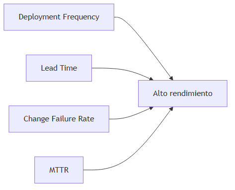

---

## 13. Pipeline .NET containerizado: ejemplo integrado

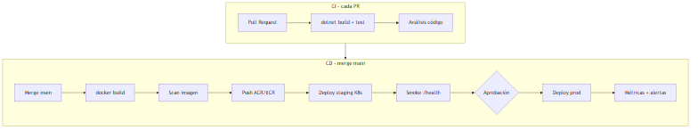

**Lectura paso a paso:**

1. PR dispara build + tests — feedback en minutos.
2. Merge a main construye imagen Docker de la API .NET.
3. Scan de vulnerabilidades bloquea si hay críticos.
4. Push a registro privado con tag SemVer.
5. Deploy automático a staging; smoke test en `/health`.
6. Aprobador humano (Continuous Delivery) o automático (Continuous Deployment).
7. Deploy prod; observabilidad detecta anomalías post-release.

---

## 14. Errores comunes de juniors en CI/CD

| Error | Por qué es malo | Qué hacer |
|---|---|---|
| Secretos en Git | Filtración, incidente seguridad | Secrets store + OIDC |
| Pipeline solo build, sin test | Bugs en prod | Mínimo tests unitarios críticos |
| Deploy manual sin reproducibilidad | "En mi máquina funciona" | IaC + pipeline idempotente |
| Tag `latest` en prod | No sabes qué versión corre | SemVer + digest |
| Sin rollback plan | Incidentes prolongados | Blue-green, GitOps revert, feature flags |

---

## 15. Resumen del capítulo

- **DevOps** une Dev y Ops con automatización, feedback rápido y responsabilidad compartida de producción.
- **CI** integra y valida cada cambio; **Continuous Delivery** mantiene código desplegable con aprobación manual; **Continuous Deployment** automatiza prod.
- **Pipeline típico:** source → build → test → scan → publish → deploy → verify.
- **GitHub Actions:** workflows YAML con jobs, steps, matrices, environments y OIDC.
- **Estrategias de despliegue:** rolling (simple), blue-green (rollback rápido), canary (riesgo controlado), feature flags (release vs deploy).
- **GitOps:** Git como fuente de verdad; operador reconcilia clúster.
- **IaC:** Terraform, Bicep, CloudFormation — infra reproducible y revisable.
- **Secretos:** nunca en Git; OIDC > credenciales permanentes.
- **SemVer + digest** identifican artefactos inmutables.
- **Métricas DORA** miden madurez: frecuencia, lead time, tasa de fallo, MTTR.

**Siguiente paso:** capítulo 09 — **observabilidad**: cómo saber qué pasa en producción cuando el pipeline ya desplegó tu código (métricas, logs y trazas).
