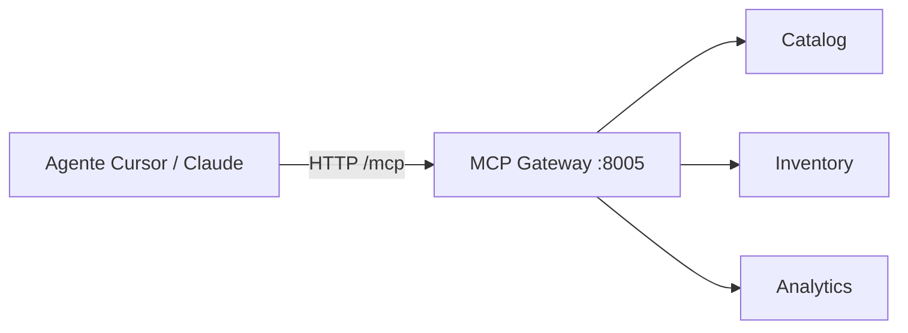

# 09 — Integración IA y MCP Gateway

**Objetivo:** Explicar MCP en ShopDemo y preguntas emergentes en entrevistas 2025–2026.

---

## ¿Qué es MCP aquí?

**Model Context Protocol:** contrato para que un **agente IA** invoque **tools** sobre APIs HTTP.

ShopDemo expone `ShopDemo.Mcp.Api` (:8005) con tools como:

- `CreateProduct` → Catalog
- `GetProductStock` → Inventory
- `ListAnalyticsEvents` → Analytics
- `GetShopDemoStatus` → health agregado

---

## Arquitectura MCP en el lab

**No es** un LLM embebido en el gateway: es un **adaptador** que traduce tools MCP a llamadas REST.

---

## Despliegue multicloud

| Entorno | Exposición MCP |
|---|---|
| Local | `dotnet run` AI project |
| ACA | Container App dedicada |
| ECS | ALB MCP |
| AKS/EKS | Ingress path `/mcp` |

Manifiestos: `k8s/azure/mcp/` o `k8s/aws/mcp/` + `k8s/mcp/service.yaml`.

---

## Seguridad (lab vs producción)

| Lab | Producción enterprise |
|---|---|
| Sin OAuth en `/mcp` | AuthN/Z, rate limit, mTLS |
| Red/Ingress controla acceso | API keys, WAF |

---

## Preguntas de entrevista

1. ¿MCP vs REST directo desde el agente?
2. ¿Por qué MCP no está en Aspire AppHost?
3. ¿Cómo descubre MCP las URLs de Catalog en K8s?
4. ¿Riesgos de exponer tools de escritura (`CreateProduct`)?

**Profundizar:** [TEORIA-INTEGRACION-IA.md](../integracion-ia/TEORIA-INTEGRACION-IA.md) · [IMPLEMENTACION-MCP-GATEWAY.md](../integracion-ia/IMPLEMENTACION-MCP-GATEWAY.md)
