# 10 — Resiliencia y tolerancia a fallos

## Objetivo de este capítulo

Al terminar este capítulo podrás **definir, distinguir e implementar mentalmente** los patrones fundamentales de resiliencia en sistemas distribuidos. No se trata de memorizar nombres de librerías, sino de entender **qué problema resuelve cada patrón**, cómo se combinan entre sí y **cuándo aplicar cada uno** antes de que un fallo parcial se convierta en catástrofe total.

Asumimos que ya sabes programar APIs REST, hacer llamadas HTTP entre servicios y desplegar en contenedores o plataformas cloud. Si has visto un timeout en Postman o un error 503 en producción, ya tienes la base para entender por qué la resiliencia no es opcional.

Conceptos que dominarás:

- Fallos parciales, intermitentes y silenciosos en sistemas distribuidos.
- Timeout, retry con backoff exponencial y jitter.
- Circuit breaker: estados Closed, Open y Half-Open en detalle.
- Bulkhead con thread pools aislados.
- Rate limiting con token bucket.
- Fallback y degradación graceful.
- Backpressure y Dead-Letter Queue (DLQ).
- Health checks: liveness, readiness y startup en Kubernetes.
- RTO, RPO, multi-AZ vs multi-región.
- Chaos engineering y la librería Polly en .NET.

> **Cómo leer este capítulo:** cada patrón sigue la misma estructura: definición formal → explicación desarrollada → diagrama → cuándo usarlo. No te saltes las definiciones; son el vocabulario que usarás al diseñar clientes HTTP, colas de mensajes y despliegues en producción.

---

## 1. Introducción: el mito de la red confiable

Cuando programas en local, todo parece predecible: la base de datos responde en milisegundos, la red nunca se cae, el disco siempre funciona. En producción, especialmente con microservicios en la nube, esa ilusión desaparece.

**En un monolito en una sola máquina**, un fallo suele ser total: el proceso muere y todo deja de funcionar. Es doloroso, pero simple de diagnosticar.

**En un sistema distribuido**, los fallos tienen características distintas que debes internalizar desde el diseño.

### Definición formal

Un **fallo parcial** es una degradación que afecta a uno o más componentes del sistema sin derribar la totalidad del servicio. La **tolerancia a fallos** (fault tolerance) es la capacidad del sistema de continuar operando — total o parcialmente — ante la falla de uno o más de sus componentes.

### Explicación desarrollada

| Característica | Qué significa en la práctica |
|---|---|
| **Parciales** | El servicio de pagos cae, pero el catálogo sigue respondiendo |
| **Intermitentes** | Un timeout ocurre 1 de cada 50 requests; el resto funciona |
| **Correlacionados** | Un despliegue defectuoso + pico de tráfico + saturación de BD ocurren a la vez |
| **Silenciosos** | Un servicio responde HTTP 200 pero tarda 30 segundos — técnicamente "funciona" |

La premisa fundamental del diseño distribuido, articulada por Peter Deutsch en los "Fallacies of Distributed Computing", es:

> **Asume que todo fallará.** No *si*, sino *cuándo* y *cómo*. Tu trabajo como desarrollador no es evitar todos los fallos (imposible), sino **contenerlos** y **recuperarte** con gracia.

Esto no es pesimismo — es realismo profesional. Los patrones de este capítulo son las herramientas para convertir ese realismo en diseño concreto.

### Diagrama

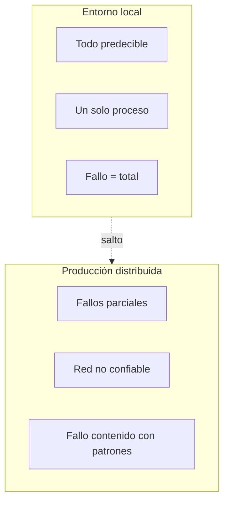

### Cuándo usar / Cuándo no

| Enfoque | Aplica cuando… | Suficiente sin patrones cuando… |
|---|---|---|
| **Patrones de resiliencia** | Microservicios, llamadas HTTP entre servicios, colas, cloud | Script batch local sin dependencias externas |
| **Asumir fallos desde diseño** | Siempre en producción distribuida | Prototipo desechable de un solo desarrollador |

> **Nota del instructor:** Si el capítulo 09 te enseñó a *ver* qué pasa en producción, este capítulo te enseña a *diseñar* para que un fallo parcial no se convierta en catástrofe total. La resiliencia no es un parche post-incidente: es una decisión de arquitectura que tomas **antes** de desplegar.

---

## 2. Patrón: Timeout (tiempo límite)

### Definición formal

Un **timeout** es el límite máximo de tiempo que el llamador esperará por una operación antes de considerarla fallida y liberar los recursos asociados: una llamada HTTP, una query a base de datos, una lectura de cola o una conexión a un servicio externo.

### Explicación desarrollada

Sin timeout, un servicio lento retiene recursos del llamador indefinidamente:

- Threads bloqueados en un pool finito.
- Conexiones HTTP abiertas consumiendo file descriptors.
- Memoria acumulada en requests pendientes.
- Contextos de cancelación que nunca se propagan.

El llamador no falla por el servicio lento — **se autodestruye** esperando. Este es uno de los mecanismos principales de la **cascada de fallos** (sección 12).

**Regla de encadenamiento — timeouts decrecientes:**

Los timeouts deben decrecer de fuera hacia adentro. El servicio externo debe fallar **antes** que el interno agote su propio timeout:

```
Cliente (30 s) → API Gateway (25 s) → Servicio A (20 s) → Servicio B (15 s) → BD (10 s)
```

Si el timeout interno es mayor que el externo, el servicio externo ya habrá fallado y respondido error al usuario cuando el interno aún espera — recursos desperdiciados y diagnóstico confuso.

**Cómo elegir valores concretos:**

1. Conoce tu **SLO de latencia** (capítulo 09). Si prometes p99 < 500 ms, un timeout de 30 s es absurdo.
2. Mide la latencia **normal** del servicio downstream en producción (p99 + margen).
3. El timeout debe ser ligeramente superior al p99 normal, no al peor caso histórico.
4. Documenta y revisa periódicamente — un timeout de hace dos años puede estar desalineado con el rendimiento actual.

**Dónde configurar timeouts:**

- Toda llamada HTTP saliente (`HttpClient.Timeout` en .NET).
- Toda query a base de datos o cache.
- Toda operación de cola (receive, send).
- Conexiones a servicios externos (APIs de terceros, pasarelas de pago).

### Diagrama

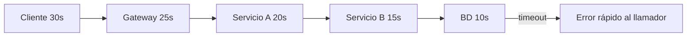

### Cuándo usar / Cuándo no

| Situación | ¿Timeout explícito? |
|---|---|
| Toda llamada HTTP/gRPC saliente | Sí — siempre |
| Query a base de datos | Sí — evita queries colgadas |
| Operación local en memoria | No necesario |
| Proceso batch de horas | Timeout por fase, no global |

> **Nota del instructor:** El error más común de juniors es usar el timeout por defecto del framework (a veces infinito o 100 segundos). Define timeouts explícitos basados en tu SLO de latencia. En .NET, `HttpClient.Timeout` por defecto es 100 segundos — demasiado para una API que promete responder en 500 ms.

---

## 3. Patrón: Retry con backoff exponencial y jitter

### Definición formal

Un **retry** (reintento) repite una operación que falló cuando el error es **transitorio** — es decir, cuando tiene sentido esperar que la siguiente tentativa tenga éxito. El **backoff exponencial** incrementa el tiempo de espera entre intentos de forma multiplicativa; el **jitter** añade variación aleatoria para evitar sincronización masiva de reintentos.

### Explicación desarrollada

Errores transitorios típicos: timeout de red, HTTP 503 (Service Unavailable), throttling (429 Too Many Requests), conexión rechazada momentánea, failover de base de datos en curso.

Errores **no** transitorios (no reintentar): HTTP 400 (Bad Request), 401 (Unauthorized), 404 (Not Found), 422 (Unprocessable Entity) — reintentar no cambiará el resultado.

**Parámetros esenciales:**

| Parámetro | Recomendación | Por qué |
|---|---|---|
| **Max attempts** | 3–5 | Más reintentos = más latencia y carga sobre el servicio caído |
| **Backoff** | Exponencial (1 s, 2 s, 4 s, 8 s…) | Da tiempo al servicio a recuperarse |
| **Jitter** | Variación aleatoria ±20–50 % | Evita que todos los clientes reintenten al mismo instante |

**Ejemplo numérico de backoff con jitter:**

```
Intento 1: fallo → espera 1 s ± 30 % → espera real: 0.7–1.3 s
Intento 2: fallo → espera 2 s ± 30 % → espera real: 1.4–2.6 s
Intento 3: fallo → espera 4 s ± 30 % → espera real: 2.8–5.2 s
Intento 4: fallo → abortar, devolver error al llamador
```

**El problema del thundering herd:**

Imagina que un servicio cae y 10 000 clientes reintentan exactamente a los 2 segundos. El servicio, al recuperarse, recibe un pico instantáneo de 10 000 requests y vuelve a caer. El **jitter** dispersa los reintentos en el tiempo, suavizando la carga de recuperación.

**Condición crítica: idempotencia**

> **Nunca reintentes una operación que no es idempotente** sin mecanismo de deduplicación.

Si un POST "crear pedido" llega al servidor, se procesa, pero la respuesta se pierde por timeout, el cliente reintenta y crea **dos pedidos**. Soluciones:

- Usar clave de idempotencia (`Idempotency-Key` header).
- Diseñar la operación como idempotente (PUT con ID fijo, upsert).
- Que el servidor deduplique por clave en una ventana temporal.

**Retry solo en operaciones idempotentes o con deduplicación** — esta regla no tiene excepciones en producción.

### Diagrama

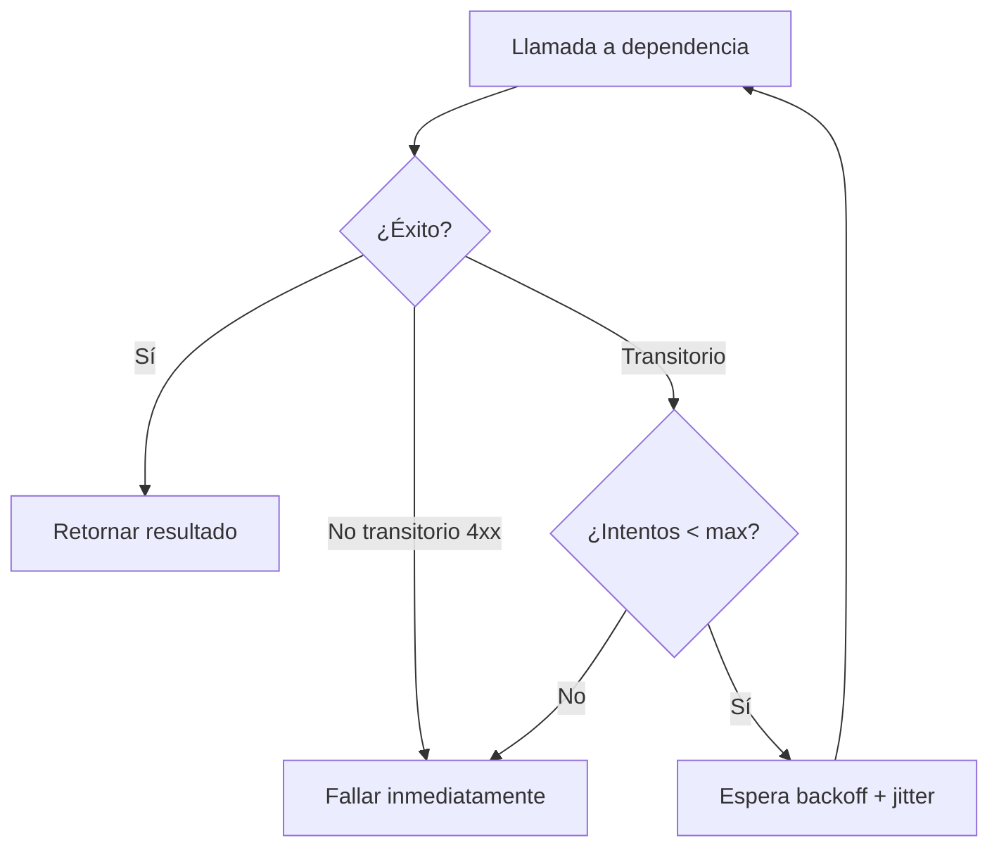

### Cuándo usar / Cuándo no

| Situación | ¿Retry? |
|---|---|
| Error 503, timeout, 429 | Sí — con backoff + jitter |
| Error 400, 401, 404 | No — fallo permanente |
| POST no idempotente sin deduplicación | No — riesgo de duplicados |
| Servicio con circuit breaker abierto | No — el breaker ya rechaza |

> **Nota del instructor:** Retry sin jitter en producción es una bomba de tiempo. En .NET, la librería **Polly** implementa retry con backoff exponencial y jitter de forma declarativa — ver sección 16.

---

## 4. Patrón: Circuit Breaker (cortacircuitos)

### Definición formal

Un **circuit breaker** monitoriza los fallos hacia una dependencia y, cuando superan un umbral configurable, **deja de llamarla** temporalmente — devolviendo error inmediato o ejecutando un fallback — en lugar de seguir acumulando timeouts y consumiendo recursos del llamador.

### Explicación desarrollada

La metáfora viene de la electricidad: el cortacircuitos "salta" para proteger el resto del sistema cuando detecta sobrecorriente. En software, la "sobrecorriente" son fallos consecutivos hacia un servicio downstream caído o muy lento.

**Estados del circuit breaker en detalle:**

#### Estado Closed (cerrado) — operación normal

- Todas las llamadas pasan al servicio downstream.
- El breaker **cuenta fallos** (consecutivos o ratio en ventana deslizante).
- Si los fallos superan el umbral → transición a **Open**.
- Parámetros típicos: "5 fallos consecutivos" o "50 % de fallos en los últimos 10 requests".

#### Estado Open (abierto) — protección activa

- **Todas las llamadas se rechazan inmediatamente** sin contactar al downstream.
- Devuelve error rápido o ejecuta fallback (respuesta cacheada, valor por defecto).
- Tras un **timeout de enfriamiento** (ej. 30 segundos) → transición a **Half-Open**.
- Durante Open, el servicio downstream puede recuperarse sin recibir tráfico.

#### Estado Half-Open (semiabierto) — prueba de recuperación

- Permite **N llamadas de prueba** (típicamente 1–3) al downstream.
- Si las pruebas tienen **éxito** → transición a **Closed** (recuperación confirmada).
- Si alguna prueba **falla** → transición inmediata a **Open** (aún no recuperado).
- Evita el "flapping": abrir y cerrar repetidamente en servicios inestables.

**Parámetros configurables:**

| Parámetro | Ejemplo | Efecto |
|---|---|---|
| Failure threshold | 5 fallos consecutivos | Cuándo abrir |
| Open duration | 30 segundos | Cuánto tiempo en Open antes de Half-Open |
| Half-open probes | 1 request | Cuántas pruebas en Half-Open |
| Failure ratio | 50 % en 10 requests | Alternativa a fallos consecutivos |

**Combinación con timeout y retry:**

- **Timeout:** limita cuánto espera cada intento.
- **Retry:** recupera fallos transitorios (503 puntual).
- **Circuit breaker:** protege cuando los fallos son **persistentes** — deja de reintentar cuando el servicio está claramente caído.

Orden mental: Rate Limit → Bulkhead → Timeout → Retry → Circuit Breaker → Fallback.

### Diagrama

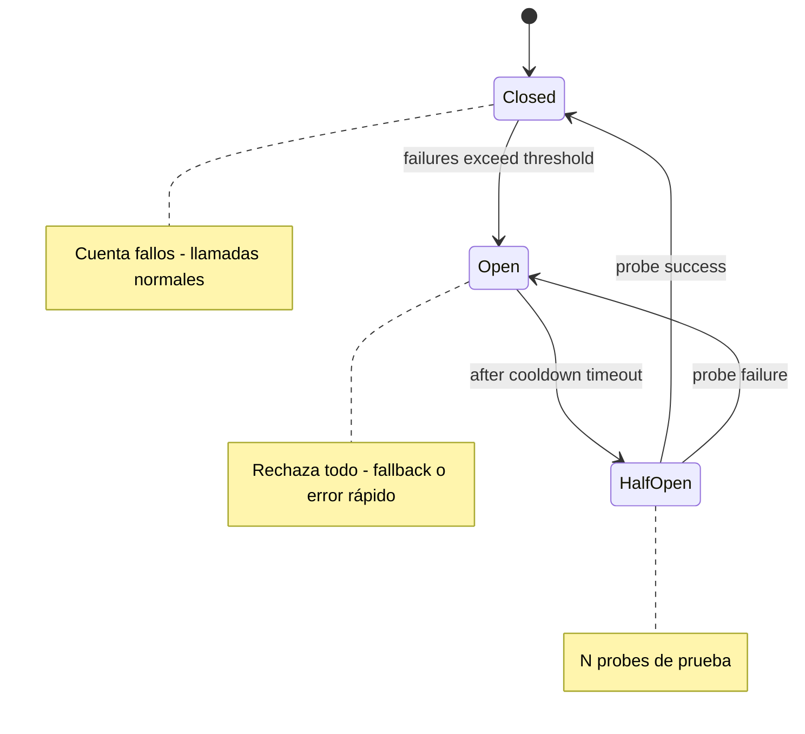

Fuente editable: [assets/diagrams/10-circuit-breaker.mermaid](./assets/diagrams/10-circuit-breaker.mermaid)

### Cuándo usar / Cuándo no

| Situación | ¿Circuit breaker? |
|---|---|
| Dependencia externa con historial de fallos intermitentes | Sí |
| Servicio downstream que, al caer, arrastraría al llamador | Sí |
| Llamada a servicio interno ultra-confiable en LAN | Opcional — evaluar coste vs beneficio |
| Operación local sin red | No aplica |

> **Nota del instructor:** Un circuit breaker sin métricas que muestren cuándo se abre es una caja negra. Expón métricas: `circuit_breaker_state{service="payments"}`, `circuit_breaker_failures_total`. Sin observabilidad (capítulo 09), no sabrás si el breaker está protegiendo o bloqueando tráfico legítimo.

---

## 5. Patrón: Bulkhead (mamparo) con thread pools

### Definición formal

Un **bulkhead** aísla recursos (thread pools, conexiones, semáforos, presupuestos de CPU) por tipo de operación, cliente o tenant, para que la saturación de un compartimento no agote el pool global del servicio.

### Explicación desarrollada

La metáfora viene de los barcos: los mamparos estancos dividen el casco en compartimentos independientes. Si uno se inunda, los demás mantienen la flotabilidad.

**Ejemplo concreto con thread pools:**

Un servicio de API tiene dos tipos de operación con latencias muy diferentes:

| Operación | Pool dedicado | Latencia típica |
|---|---|---|
| Consultas rápidas (GET /products) | 50 threads | 50–200 ms |
| Generación de informes (POST /reports) | 10 threads | 5–30 segundos |

Si la generación de informes satura sus 10 threads, las consultas GET siguen respondiendo con sus 50 threads. Sin bulkhead, un pico de informes agotaría el pool global de 60 threads y **todo** dejaría de responder — incluidas las consultas rápidas que no tienen relación con informes.

**Implementaciones habituales:**

| Mecanismo | Dónde se aplica |
|---|---|
| Thread pools separados | Servicios con operaciones de distinta latencia |
| Semáforos por tenant | Multi-tenant: un tenant ruidoso no afecta a los demás |
| Connection pools separados | BD de lectura vs BD de escritura |
| Kubernetes ResourceQuota | Límite de CPU/memoria por namespace |

**Bulkhead en .NET con Polly:**

Polly ofrece `BulkheadPolicy` que limita paralelismo concurrente y cola de espera por separado. Si la cola se llena, rechaza inmediatamente en lugar de acumular.

### Diagrama

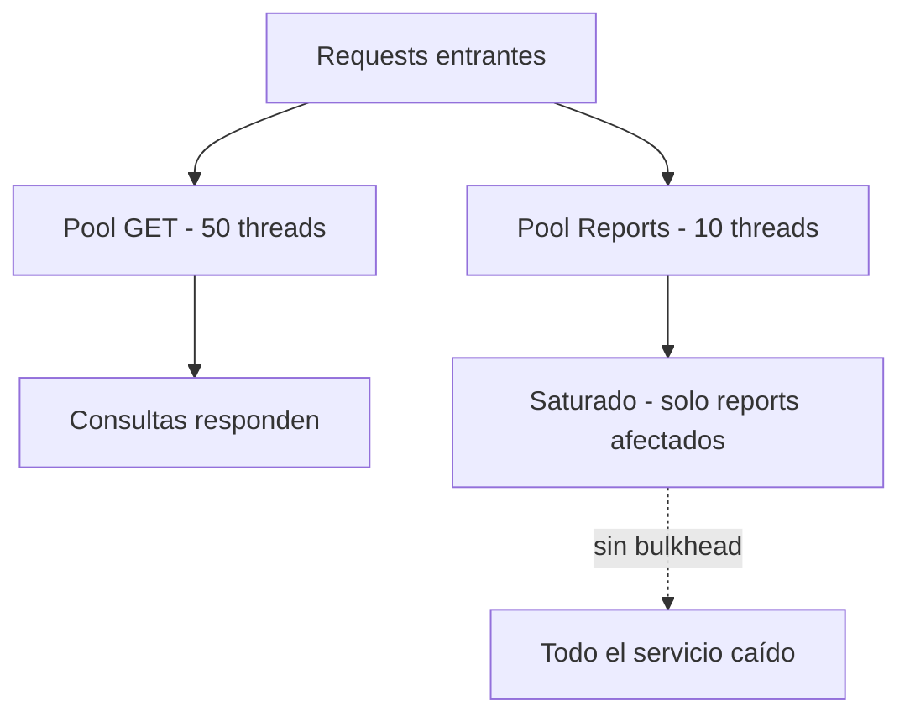

### Cuándo usar / Cuándo no

| Situación | ¿Bulkhead? |
|---|---|
| Servicio con operaciones de latencia muy diferente | Sí |
| Multi-tenant donde un tenant ruidoso no debe afectar a los demás | Sí |
| API simple con un solo tipo de operación homogénea | Opcional |
| Prototipo con un solo usuario | No necesario |

> **Nota del instructor:** Bulkhead es invisible cuando funciona y heroico cuando evita un outage. Diseña los pools basándote en mediciones reales de latencia y concurrencia — no en números inventados.

---

## 6. Patrón: Rate Limiting con token bucket

### Definición formal

El **rate limiting** (limitación de tasa) restringe la cantidad de requests que un cliente puede hacer por unidad de tiempo. El algoritmo **token bucket** acumula tokens a ritmo fijo; cada request consume un token; si no hay tokens disponibles, la request se rechaza.

### Explicación desarrollada

**Cómo funciona token bucket:**

1. El bucket tiene capacidad máxima (ej. 100 tokens).
2. Tokens se añaden a ritmo fijo (ej. 10 tokens/segundo = 600 req/min).
3. Cada request consume 1 token (o N para operaciones pesadas).
4. Si hay tokens → request permitida.
5. Si no hay tokens → HTTP 429 Too Many Requests (o cola de espera, según configuración).
6. Los tokens no usados se acumulan hasta la capacidad máxima — permite **ráfagas** controladas.

**Ejemplo numérico:**

```
Capacidad bucket: 100 tokens
Refill rate: 10 tokens/segundo
Cliente envía ráfaga de 80 requests → permitidas (80 tokens consumidos, 20 restantes)
Cliente envía 30 requests más inmediatamente → 20 permitidas, 10 rechazadas (429)
Tras 1 segundo sin requests → +10 tokens (refill)
```

**Propósitos del rate limiting:**

| Propósito | Ejemplo |
|---|---|
| **Proteger el servicio** | Evitar que un cliente consuma todo el CPU |
| **Prevenir abuso** | Limitar intentos de login, scraping |
| **Contener retry storms** | Tras un fallo masivo, evitar que reintentos saturen el servicio |
| **Modelo de negocio** | Plan gratuito: 100 req/min; plan premium: 10 000 req/min |
| **Fairness multi-tenant** | Cada tenant con cuota independiente |

**Algoritmos alternativos (referencia):**

| Algoritmo | Idea | Limitación |
|---|---|---|
| **Leaky bucket** | Requests salen a ritmo constante; exceso se descarta | No permite ráfagas |
| **Fixed window** | N requests por ventana fija (ej. por minuto) | Picos al borde de ventana |
| **Sliding window** | Ventana móvil que suaviza picos | Más complejo de implementar |

Token bucket es el más usado en APIs públicas por su balance entre simplicidad y soporte de ráfagas.

### Diagrama

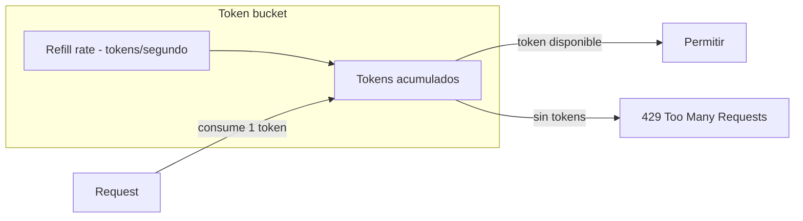

Fuente editable: [assets/diagrams/10-token-bucket.mermaid](./assets/diagrams/10-token-bucket.mermaid)

### Cuándo usar / Cuándo no

| Situación | ¿Rate limiting? |
|---|---|
| API pública expuesta a internet | Sí — imprescindible |
| Servicio interno con retry storms posibles | Sí — protege de sobrecarga |
| API interna de confianza con tráfico predecible | Opcional |
| Prototipo local | No necesario |

> **Nota del instructor:** Rate limiting en el API Gateway (antes de llegar a tus servicios) es la primera línea de defensa. Implementarlo también en cada servicio (defense in depth) protege contra tráfico interno descontrolado.

---

## 7. Patrón: Fallback y degradación graceful

### Definición formal

Un **fallback** ofrece una respuesta alternativa — cacheada, simplificada o parcial — cuando una dependencia falla, en lugar de devolver error total al usuario. La **degradación graceful** (graceful degradation) es la estrategia de reducir funcionalidad manteniendo el servicio core operativo.

### Explicación desarrollada

El principio fundamental es:

> Degradar es mejor que colapsar. Un usuario que ve datos parciales con un aviso sigue siendo un usuario. Un usuario que recibe HTTP 500 repetidamente se va.

**Patrones de fallback habituales:**

| Escenario | Fallback | Tipo |
|---|---|---|
| Servicio de recomendaciones caído | Mostrar productos populares estáticos | Cache estática |
| Cache de Redis no disponible | Consultar base de datos directamente | Degradación de rendimiento |
| API de tipo de cambio caída | Usar último valor cacheado con aviso "precio aproximado" | Stale cache |
| Servicio de reviews caído | Mostrar producto sin reviews, con mensaje informativo | Feature omitida |
| Circuit breaker abierto | Respuesta predefinida sin llamar al downstream | Fail-fast |

**Tipos de fallback:**

1. **Cache fallback:** devolver último valor conocido (puede estar desactualizado).
2. **Default fallback:** valor por defecto razonable (lista vacía, cero, mensaje informativo).
3. **Alternative path:** ruta alternativa funcional (BD directa si cache falla).
4. **Fail-fast:** error inmediato con mensaje claro (mejor que timeout de 30 s).

**Diseño de fallbacks:**

- El fallback debe ser **rápido** — si el fallback también tarda, no resuelve nada.
- Debe ser **honesto** con el usuario — "precio aproximado" es mejor que un precio falso presentado como exacto.
- Debe estar **probado** — un fallback que nunca se ejecuta en staging puede fallar en producción.
- Debe tener **observabilidad** — métrica `fallback_activated_total` para saber cuándo se usa.

### Diagrama

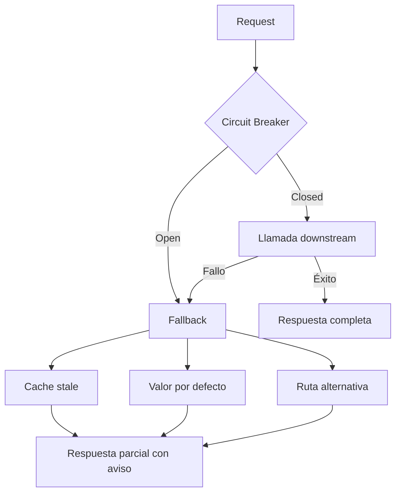

### Cuándo usar / Cuándo no

| Situación | ¿Fallback? |
|---|---|
| Feature no crítica (recomendaciones, reviews) | Sí — degradar gracefully |
| Operación crítica (pago, registro médico) | Fail-fast con error claro — no simular éxito |
| Datos que deben ser exactos (saldo bancario) | No usar cache stale — error honesto |

> **Nota del instructor:** Un fallback que devuelve datos incorrectos es peor que un error 500. En operaciones financieras o médicas, fail-fast con mensaje claro supera a degradación silenciosa.

---

## 8. Combinación de patrones — flujo de una request protegida

### Definición formal

La **defensa en profundidad** en resiliencia es la aplicación ordenada de múltiples patrones en capas sucesivas, donde cada patrón mitiga un tipo distinto de fallo.

### Explicación desarrollada

Ningún patrón funciona solo en producción real. El flujo típico de una request protegida:

1. **Rate Limiting:** ¿El cliente excedió su cuota? → 429 inmediato.
2. **Bulkhead:** ¿Hay thread disponible en el pool de esta operación? → rechazo si saturado.
3. **Timeout:** ¿La operación supera el límite de tiempo? → cancelación.
4. **Circuit Breaker:** ¿El downstream está caído? → fallback sin intentar llamada.
5. **Retry:** ¿Fallo transitorio? → reintento con backoff + jitter (solo si idempotente).
6. **Fallback:** ¿Todo lo anterior falló? → respuesta alternativa o error honesto.

Estudia este diagrama hasta que puedas explicarlo sin mirar. Es la secuencia mental que debes tener al diseñar un cliente HTTP resiliente.

### Diagrama

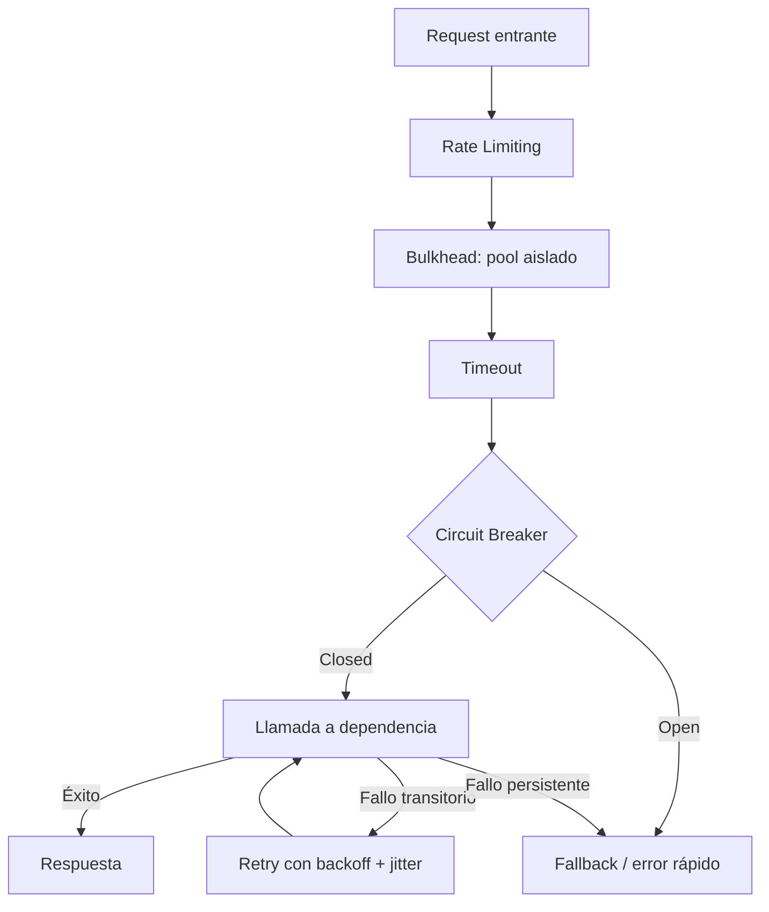

Fuente editable: [assets/diagrams/10-resilience-patterns.mermaid](./assets/diagrams/10-resilience-patterns.mermaid)

### Cuándo usar / Cuándo no

| Enfoque | Aplica cuando… | Excesivo cuando… |
|---|---|---|
| **Todos los patrones combinados** | Servicios críticos con dependencias externas | Script interno sin usuarios |
| **Solo timeout + retry** | Servicios internos de confianza | Dependencias con historial de fallos |
| **Service mesh (Istio/Linkerd)** | Clúster K8s con muchos servicios | 2–3 servicios simples |

> **Nota del instructor:** No añadas circuit breaker a una llamada que nunca ha fallado sin medir primero. Empieza con timeout, añade retry, luego breaker cuando tengas datos de fallos reales.

---

## 9. Cascada de fallos

### Definición formal

Una **cascada de fallos** (failure cascade) ocurre cuando el fallo o lentitud de un servicio downstream se propaga hacia arriba en la cadena de dependencias, derribando servicios que dependen de él, uno tras otro, hasta afectar al usuario final.

### Explicación desarrollada

**Secuencia típica sin protección:**

1. Servicio B (inventario) se ralentiza por saturación de BD.
2. Servicio A (pedidos) llama a B **sin timeout**; threads se acumulan esperando.
3. A deja de responder; el API Gateway devuelve 503 a los usuarios.
4. Servicio C (notificaciones) depende de A para confirmar envío; también cae.
5. Un problema en **un** servicio derribó **tres** — y el usuario ve "todo caído".

**Mitigación combinada:**

| Patrón | Qué previene en la cascada |
|---|---|
| **Timeout** | A no espera indefinidamente a B |
| **Circuit breaker** | A deja de llamar a B caído; fallback activo |
| **Bulkhead** | Threads de A para otras operaciones no se agotan |
| **Rate limiting** | Gateway rechaza exceso de tráfico antes de saturar A |
| **Colas async** | Desacopla A de B temporalmente |
| **Autoscaling** | Más instancias de A si el tráfico es legítimo |
| **Load shedding** | Rechazar tráfico excedente conscientemente |

### Diagrama

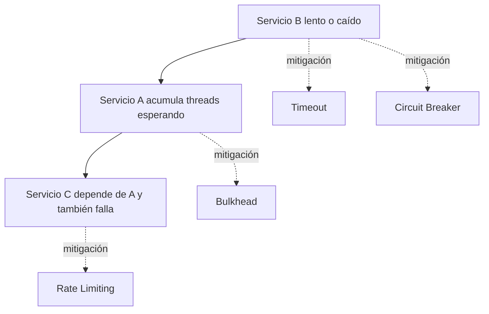

Fuente editable: [assets/diagrams/10-failure-cascade.mermaid](./assets/diagrams/10-failure-cascade.mermaid)

### Cuándo usar / Cuándo no

| Práctica | Imprescindible cuando… | Menos crítico cuando… |
|---|---|---|
| **Timeout en toda cadena** | Cualquier arquitectura distribuida | Monolito sin llamadas externas |
| **Circuit breaker en dependencias críticas** | Servicios con SLA y usuarios pagos | Herramientas internas |
| **Simulación de cascada (chaos)** | Antes de producción crítica | Prototipos desechables |

> **Nota del instructor:** Dibuja el mapa de dependencias de tu sistema (quién llama a quién) y simula mentalmente: "¿Qué pasa si X cae?" Si la respuesta es "todo cae", te falta resiliencia.

---

## 10. Backpressure

### Definición formal

**Backpressure** (contrapresión) es el mecanismo por el cual un consumidor lento señala al productor que reduzca la velocidad de envío, evitando acumulación ilimitada de mensajes o datos en buffers intermedios.

### Explicación desarrollada

Sin backpressure, las colas crecen indefinidamente cuando el productor es más rápido que el consumidor:

- Latencia aumenta (mensajes esperan horas en cola).
- Riesgo de Out Of Memory (OOM) al llenar buffers en memoria.
- El sistema parece "funcionar" (no hay errores) pero nadie recibe respuesta a tiempo.
- Eventualmente, el consumidor colapsa y pierde mensajes o se reinicia.

**Ejemplos de backpressure en la práctica:**

| Mecanismo | Dónde |
|---|---|
| ACK explícito en colas (RabbitMQ, Kafka) | El productor espera confirmación antes de enviar más |
| Semáforos que limitan mensajes en vuelo | Máximo N mensajes procesándose simultáneamente |
| Rechazo de nuevos mensajes cuando cola > umbral | HTTP 503 o pausa del productor |
| Reactive Streams (Project Reactor, RxJava) | El suscriptor solicita N elementos (`request(n)`) |
| Kubernetes HPA basado en profundidad de cola | Escalar consumidores cuando la cola crece |

**Backpressure vs rate limiting:**

- **Rate limiting:** limita requests **entrantes** al servicio (protección externa).
- **Backpressure:** limita flujo **interno** entre componentes (protección interna).

Ambos son complementarios.

### Diagrama

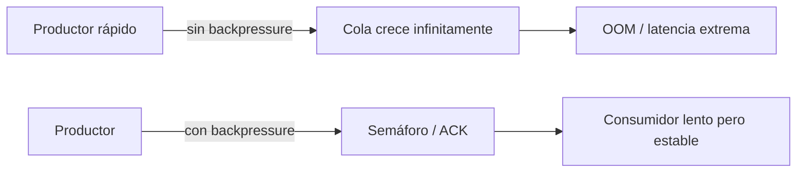

### Cuándo usar / Cuándo no

| Situación | ¿Backpressure? |
|---|---|
| Colas de mensajes con productor más rápido que consumidor | Sí — imprescindible |
| Streaming de datos (Kafka, Event Hubs) | Sí — via consumer lag monitoring |
| Request/response HTTP síncrono | Rate limiting + timeout (backpressure implícito) |
| Procesamiento batch offline | Menos crítico — cola en disco |

> **Nota del instructor:** Monitoriza la **profundidad de cola** (queue depth) como Golden Signal de saturación. Si crece monotónicamente, tienes un problema de backpressure, no de capacidad de procesamiento.

---

## 11. Dead-Letter Queue (DLQ)

### Definición formal

Una **Dead-Letter Queue (DLQ)** es una cola de destino especial a la que se envían mensajes que no pudieron procesarse tras un número configurado de reintentos, aislándolos del flujo normal para análisis manual sin bloquear el procesamiento de mensajes válidos.

### Explicación desarrollada

Flujo típico con DLQ:

```
Mensaje → procesar → fallo → reintentar (intento 1)
       → fallo → reintentar (intento 2)
       → fallo → reintentar (intento 3)
       → fallo → enviar a DLQ → alerta al equipo → análisis manual
```

**Por qué es imprescindible:**

Sin DLQ, un **poison message** (mensaje malformado o que provoca excepción siempre) se reintenta infinitamente, bloqueando el consumidor o consumiendo recursos sin progreso. Con DLQ, el mensaje problemático se aísla y el resto del flujo continúa.

**Buenas prácticas con DLQ:**

| Práctica | Por qué |
|---|---|
| Alertar cuando DLQ recibe mensajes | Indica problema que requiere intervención |
| Incluir contexto en el mensaje DLQ | Original message + error + stack trace + timestamp |
| Herramienta de replay | Reprocesar mensajes tras corregir el bug |
| Retención configurada | No acumular indefinidamente — revisar y purgar |
| Métrica `dlq_messages_total` | Dashboard de salud del pipeline |

**DLQ vs descarte:**

Descartar mensajes fallidos es tentador pero peligroso — pierdes datos. DLQ preserva el mensaje para investigación y posible replay.

### Diagrama

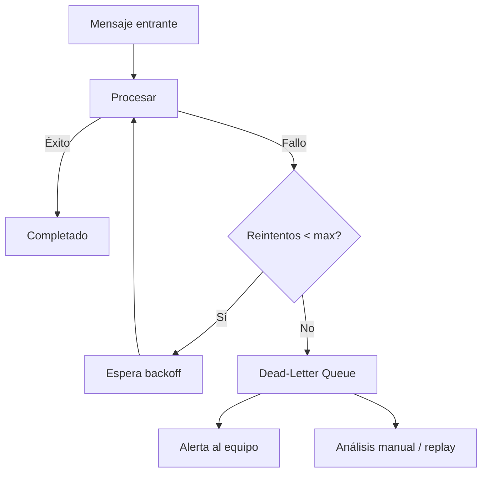

### Cuándo usar / Cuándo no

| Situación | ¿DLQ? |
|---|---|
| Cola de mensajes en producción | Sí — casi siempre |
| Procesamiento donde perder un mensaje es inaceptable | Sí — con replay |
| Log de errores en script batch | Suficiente — DLQ es overkill |
| Fire-and-forget sin garantía de entrega | Evaluar si realmente no necesitas DLQ |

> **Nota del instructor:** Una DLQ que crece sin que nadie la revise es una bomba de datos. Configura alertas y revisión periódica — la DLQ no es un cementerio, es una sala de espera para reprocesamiento.

---

## 12. Health checks — liveness, readiness y startup en Kubernetes

### Definición formal

Un **health check** (sondeo de salud) es una sonda HTTP, TCP o de comando que un orquestador (Kubernetes) ejecuta periódicamente para determinar el estado de un contenedor y decidir si debe recibir tráfico, reiniciarse o esperar.

### Explicación desarrollada

Kubernetes define tres tipos de probes con propósitos distintos:

| Tipo | Qué verifica | Consecuencia si falla | Cuándo evaluar |
|---|---|---|---|
| **Startup** | El arranque completó (warm-up, migraciones pesadas) | Retrasa evaluación de liveness/readiness | Solo durante arranque |
| **Readiness** | El servicio puede procesar tráfico ahora (BD conectada, cache caliente) | Kubernetes **deja de enviar tráfico** al pod | Continuamente tras startup |
| **Liveness** | El proceso responde (no está colgado/deadlock) | Kubernetes **reinicia** el pod | Continuamente tras startup |

**Startup probe — para arranques lentos:**

Si tu aplicación tarda 60 segundos en iniciar (migraciones EF Core, warm-up de cache), una liveness probe con `initialDelaySeconds: 10` matará el pod antes de que arranque — bucle de reinicios infinito. La startup probe le dice a Kubernetes: "Espera hasta 60 s antes de evaluar liveness/readiness."

**Readiness probe — tráfico condicional:**

Un pod puede estar "vivo" (proceso corriendo) pero no "listo" (BD caída temporalmente). Readiness quita el pod del Service sin reiniciarlo — cuando la BD vuelve, el pod se reintegra automáticamente.

**Liveness probe — detección de deadlock:**

Si el proceso está en deadlock o bucle infinito, liveness detecta que no responde y reinicia el pod. **Cuidado:** si la probe es demasiado agresiva bajo carga normal, reiniciará pods sanos.

**Errores frecuentes:**

| Error | Consecuencia |
|---|---|
| Readiness que verifica dependencias externas agresivamente | Un fallo de BD saca **todos** los pods del balanceador |
| Liveness con timeout corto bajo carga | Reinicio en bucle de pods simplemente ocupados |
| No diferenciar liveness de readiness | Reiniciar un pod lento en lugar de dejar de enviarle tráfico |
| Liveness que verifica BD | Reinicio por fallo de BD externo — incorrecto |

**Regla práctica:**

- **Liveness** = "¿El proceso está vivo?" → endpoint ligero (`/alive`).
- **Readiness** = "¿Puede atender requests ahora?" → verifica dependencias críticas (`/health`).
- **Startup** = "¿Terminó de arrancar?" → misma lógica que readiness pero con más tolerancia.

### Diagrama

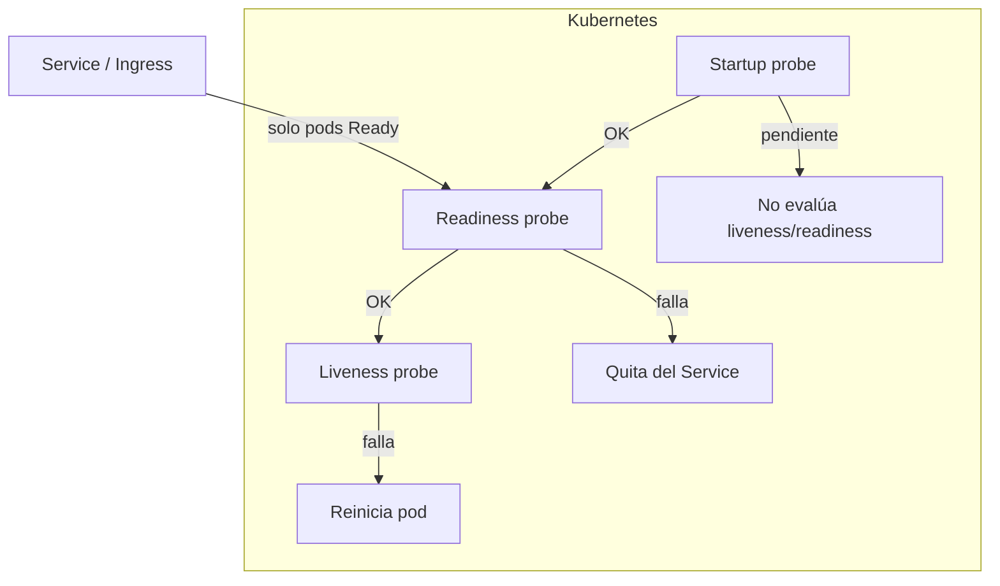

Fuente editable: [assets/diagrams/10-health-checks-k8s.mermaid](./assets/diagrams/10-health-checks-k8s.mermaid)

### Cuándo usar / Cuándo no

| Probe | Configura cuando… | Evita cuando… |
|---|---|---|
| **Startup** | Arranque > 30 segundos | Arranque instantáneo (< 5 s) |
| **Readiness** | Siempre en producción K8s | Nunca en prod — pods recibirían tráfico no preparado |
| **Liveness** | Siempre en producción K8s | Verificar dependencias externas (usa readiness) |

> **Nota del instructor:** En ASP.NET Core, `MapHealthChecks("/health")` para readiness y un endpoint `/alive` mínimo para liveness es el patrón recomendado. No uses el mismo endpoint para ambos con la misma lógica pesada.

---

## 13. RTO y RPO — objetivos de recuperación

### Definición formal

- **RTO (Recovery Time Objective):** el tiempo máximo aceptable para **restaurar el servicio** tras un desastre o fallo mayor.
- **RPO (Recovery Point Objective):** la pérdida máxima aceptable de **datos** medida en ventana temporal — cuánto tiempo de datos se puede perder.

### Explicación desarrollada

RTO responde: "¿Cuánto tiempo estaremos caídos?" RPO responde: "¿Cuántos datos perdemos?"

**Ejemplo numérico:**

| Escenario | RTO | RPO | Implicación |
|---|---|---|---|
| E-commerce | 1 hora | 5 minutos | Backups cada 5 min; failover en < 1 h |
| Blog personal | 24 horas | 24 horas | Backup diario suficiente |
| Banca online | 15 minutos | 0 (cero pérdida) | Réplicas síncronas, failover automático |
| Analytics batch | 8 horas | 1 hora | Reprocesar pipeline tras restaurar |

**Relación RTO/RPO con arquitectura:**

| RTO/RPO | Arquitectura típica | Coste |
|---|---|---|
| RTO > 24 h, RPO > 24 h | Backup en frío, restauración manual | Bajo |
| RTO < 4 h, RPO < 1 h | Backup frecuente, réplica en standby | Medio |
| RTO < 1 h, RPO < 15 min | Multi-AZ, failover automático | Medio-alto |
| RTO < 15 min, RPO ≈ 0 | Multi-región active-active, réplicas síncronas | Alto |

RTO y RPO son **decisiones de negocio** que informan decisiones técnicas — no al revés. Pregunta al negocio "¿Cuánto tiempo podemos estar caídos?" antes de diseñar infraestructura.

### Diagrama

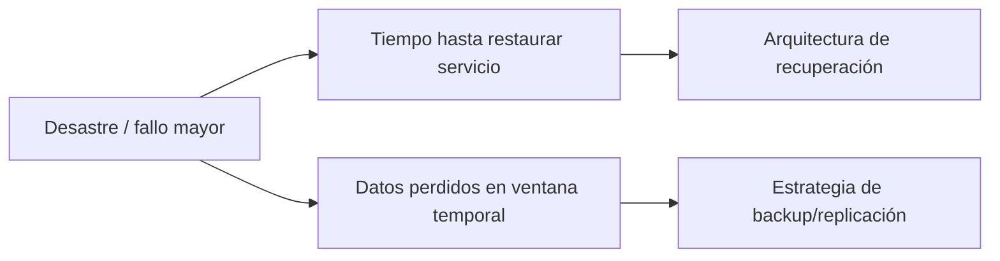

### Cuándo usar / Cuándo no

| Concepto | Define cuando… | Puede esperar cuando… |
|---|---|---|
| **RTO/RPO** | Servicio con impacto de negocio medible | Prototipo desechable |
| **Multi-AZ** | Siempre en cloud producción | Desarrollo local |
| **Multi-región** | SLA global, requisito de continuidad geográfica | Servicio regional sin requisito global |

> **Nota del instructor:** RTO de "lo antes posible" no es un RTO — es un deseo. Un RTO debe ser un número concreto que informe diseño: "4 horas" implica backups + runbook; "15 minutos" implica failover automático.

---

## 14. Multi-AZ vs multi-región

### Definición formal

**Multi-AZ (Multi-Availability Zone)** despliega réplicas del servicio en distintos datacenters de la **misma región** cloud. **Multi-región** despliega en **regiones geográficas distintas**, protegiendo contra desastres regionales completos.

### Explicación desarrollada

| Estrategia | Descripción | Protege contra | Complejidad |
|---|---|---|---|
| **Single-AZ** | Un solo datacenter | Fallo de servidor individual | Baja |
| **Multi-AZ** | Réplicas en 2–3 AZ de la misma región | Fallo de un datacenter | Baja-media — estándar en cloud |
| **Active-Passive multi-región** | Región secundaria en standby; failover manual o automático | Desastre regional (inundación, corte eléctrico) | Media |
| **Active-Active multi-región** | Tráfico en múltiples regiones simultáneamente | Desastre regional + latencia global | Alta — consistencia de datos es el reto |

**Multi-AZ — lo mínimo en producción cloud:**

Si usas servicios gestionados (Azure SQL, RDS, AKS con node pools multi-AZ), probablemente ya eres multi-AZ sin esfuerzo adicional. Protege contra fallo de un edificio físico, no contra fallo de región completa.

**Multi-región — decisión de negocio:**

| Factor | Multi-AZ suficiente | Multi-región necesario |
|---|---|---|
| Usuarios | Regionales | Globales con SLA estricto |
| Regulación | Una jurisdicción | Residencia de datos en múltiples países |
| Coste | Presupuesto limitado | Presupuesto para duplicar infra |
| Consistencia | Eventual aceptable | Strong consistency requerida (complica mucho) |

**Reto de active-active multi-región:**

Si dos regiones aceptan escrituras simultáneas, ¿cómo resolves conflictos? Opciones: base de datos global (CockroachDB, Cosmos DB multi-región), partición por región (usuarios EU escriben en EU), o colas de replicación con resolución de conflictos.

### Diagrama

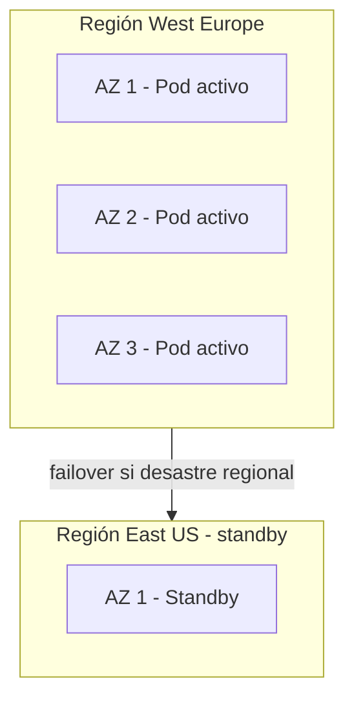

### Cuándo usar / Cuándo no

| Estrategia | Elige cuando… | Evita cuando… |
|---|---|---|
| **Multi-AZ** | Siempre en producción cloud | Nunca — es el mínimo |
| **Multi-región active-passive** | Requisito de continuidad geográfica | Coste no justificado por negocio |
| **Multi-región active-active** | Usuarios globales, latencia crítica | Equipo sin experiencia en consistencia distribuida |

> **Nota del instructor:** Multi-región sin probar el failover es teatro. Ejecuta un drill de failover en staging al menos una vez al trimestre — descubrirás que DNS, connection strings y replicación de datos no funcionan como esperabas.

---

## 15. Chaos engineering

### Definición formal

**Chaos engineering** es la disciplina de experimentación donde se inyectan fallos **controlados y medidos** en un entorno (preferiblemente pre-producción o producción con blast radius limitado) para validar que las hipótesis de resiliencia del sistema son ciertas en la práctica.

### Explicación desarrollada

Chaos engineering **no es "romper cosas por diversión"**. Todo experimento debe tener estructura:

1. **Hipótesis clara:** "Si matamos un pod del servicio de pagos, el circuit breaker del servicio de pedidos se abre y el fallback muestra 'pago no disponible' sin derribar pedidos."
2. **Blast radius limitado:** empieza en staging, luego canary en producción con 1 % de tráfico.
3. **Rollback planificado:** cómo detener el experimento si algo sale mal (botón de pánico).
4. **Observabilidad activa:** métricas y alertas funcionando (capítulo 09) — sin observabilidad, chaos es ceguera.
5. **Equipo informado:** nadie debe descubrir el experimento via alerta de producción sin contexto.

**Ejemplos de experimentos:**

| Experimento | Qué valida |
|---|---|
| Matar pods aleatorios (Chaos Monkey) | Que Kubernetes los reemplaza y el servicio sigue |
| Introducir latencia artificial (Toxiproxy) | Que los timeouts funcionan |
| Simular pérdida de una AZ | Que multi-AZ aguanta |
| Llenar disco | Que health checks detectan el problema |
| Inyectar errores 503 | Que circuit breakers se abren y fallbacks activan |

**Herramientas:**

| Herramienta | Entorno |
|---|---|
| Chaos Mesh | Kubernetes |
| AWS Fault Injection Simulator | AWS |
| Azure Chaos Studio | Azure |
| Toxiproxy | Red (latencia, particiones, timeouts) |
| Litmus | Kubernetes |

**Chaos engineering valida el diseño — no lo sustituye.** Si no tienes timeouts, circuit breakers y fallbacks implementados, chaos solo confirma que el sistema es frágil — lo cual ya sabías.

### Diagrama

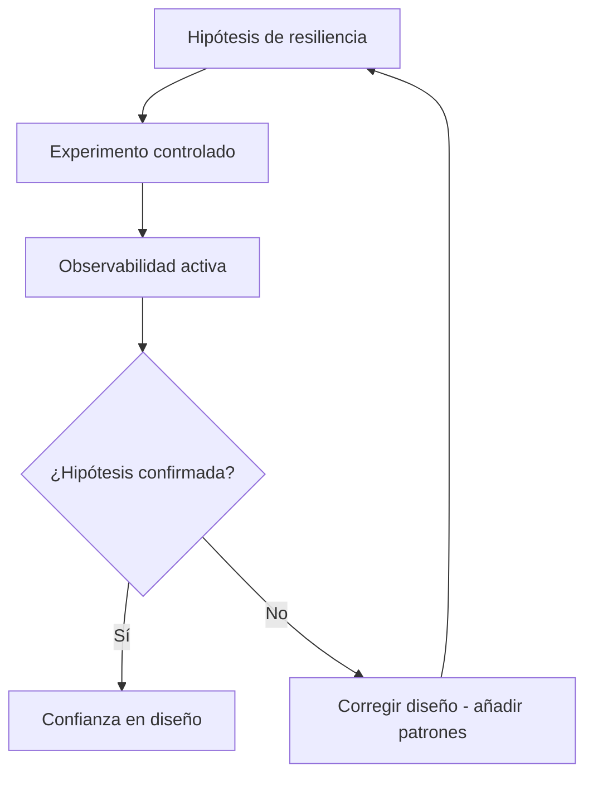

### Cuándo usar / Cuándo no

| Situación | ¿Chaos engineering? |
|---|---|
| Sistema con patrones de resiliencia implementados | Sí — valida que funcionan |
| Pre-producción antes de go-live crítico | Sí — staging con chaos |
| Sistema sin timeouts ni circuit breakers | Primero implementa patrones, luego chaos |
| Prototipo desechable | No — overhead innecesario |

> **Nota del instructor:** Empieza con el experimento más simple: mata un pod en staging y observa qué pasa. Si el servicio cae completamente, tu primera tarea no es más chaos — es añadir réplicas y health checks.

---

## 16. Polly — resiliencia declarativa en .NET

### Definición formal

**Polly** es una librería .NET de resiliencia y gestión de transitorios que implementa de forma declarativa los patrones de timeout, retry, circuit breaker, bulkhead, fallback y rate limiting mediante políticas composables.

### Explicación desarrollada

En lugar de escribir manualmente lógica de reintentos con try/catch, Polly permite definir políticas reutilizables:

```csharp
var retryPolicy = Policy
    .Handle<HttpRequestException>()
    .OrResult<HttpResponseMessage>(r => (int)r.StatusCode >= 500)
    .WaitAndRetryAsync(3, attempt => TimeSpan.FromSeconds(Math.Pow(2, attempt))
        + TimeSpan.FromMilliseconds(Random.Shared.Next(0, 500)));

var circuitBreakerPolicy = Policy
    .Handle<HttpRequestException>()
    .CircuitBreakerAsync(5, TimeSpan.FromSeconds(30));

var combinedPolicy = Policy.WrapAsync(retryPolicy, circuitBreakerPolicy);
```

**Políticas disponibles en Polly:**

| Política | Patrón |
|---|---|
| `Retry` | Reintento con backoff |
| `CircuitBreaker` | Cortacircuitos |
| `Timeout` | Tiempo límite |
| `Bulkhead` | Aislamiento de recursos |
| `Fallback` | Respuesta alternativa |
| `Cache` | Cache como fallback |

**Integración con HttpClient (.NET):**

`Microsoft.Extensions.Http.Resilience` integra Polly con `IHttpClientFactory` — cada cliente HTTP nombrado puede tener su pipeline de resiliencia configurado en DI.

**Polly vs service mesh:**

| Enfoque | Dónde actúa | Ventaja |
|---|---|---|
| **Polly (código)** | En la aplicación | Control fino, lógica de fallback custom |
| **Istio/Linkerd (mesh)** | En la red (sidecar) | Sin cambiar código, uniforme en todos los servicios |

Ambos pueden coexistir — mesh para timeout/retry básico, Polly para fallback con lógica de negocio.

### Diagrama

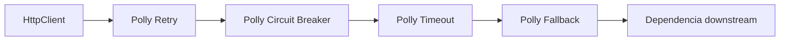

### Cuándo usar / Cuándo no

| Situación | ¿Polly? |
|---|---|
| Cliente HTTP .NET con dependencias externas | Sí — estándar en la industria .NET |
| Service mesh ya gestiona retry/timeout | Polly solo para fallback con lógica de negocio |
| Proyecto non-.NET | Resilience4j (Java), tenacity (Python), etc. |

> **Nota del instructor:** Polly no es excusa para no entender los patrones. Configura `onBreak`, `onReset` y `onHalfOpen` con logging — así sabrás en producción cuándo el circuit breaker cambia de estado.

---

## 17. Resiliencia y observabilidad — dos caras de la misma moneda

### Definición formal

La **resiliencia** y la **observabilidad** son disciplinas complementarias: la primera diseña el sistema para sobrevivir fallos; la segunda expone señales para detectar, diagnosticar y validar que los mecanismos de resiliencia funcionan.

### Explicación desarrollada

| Observabilidad (cap. 09) | Resiliencia (cap. 10) |
|---|---|
| "¿Qué está pasando?" | "¿Cómo sobrevivimos cuando falla?" |
| Métricas, logs, trazas | Timeout, retry, circuit breaker |
| SLI, SLO, error budget | Fallback, bulkhead, rate limiting |
| Diagnóstico post-incidente | Prevención y contención de incidentes |
| Chaos experiments observados | Chaos experiments ejecutados |

Diseña ambos **desde el inicio**. Un circuit breaker sin métricas que muestre cuándo se abre es una caja negra. Un dashboard de errores sin circuit breaker es un espejo que refleja la catástrofe sin impedirla.

**Métricas de resiliencia a instrumentar:**

| Métrica | Qué indica |
|---|---|
| `circuit_breaker_state` | Estado actual (closed/open/half-open) |
| `retry_attempts_total` | Cuántos reintentos ocurren |
| `fallback_activated_total` | Cuántas veces se usa fallback |
| `rate_limit_rejected_total` | Cuántas requests se rechazan por rate limit |
| `timeout_occurred_total` | Cuántos timeouts ocurren |
| `dlq_messages_total` | Mensajes en dead-letter queue |

### Diagrama

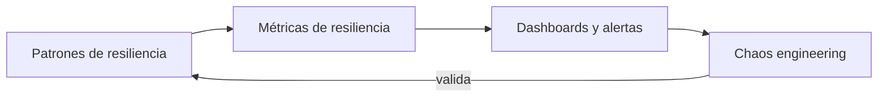

### Cuándo usar / Cuándo no

| Práctica | Siempre en… | Puede esperar en… |
|---|---|---|
| **Patrones + métricas de resiliencia** | Producción con usuarios | Prototipos locales |
| **Chaos + observabilidad** | Pre-producción crítica | MVPs desechables |

> **Nota del instructor:** El mejor incident review combina trazas del capítulo 09 con análisis de qué patrón de resiliencia falló o no existía del capítulo 10. Ese cruce es donde aprendes de verdad.

---

## Resumen del capítulo

- En sistemas distribuidos, los fallos **parciales, intermitentes y silenciosos** son la norma, no la excepción.
- **Timeout** limita la espera con valores decrecientes de fuera hacia adentro; **retry** recupera transitorios con backoff exponencial, jitter e idempotencia.
- **Circuit breaker** protege con estados Closed (normal), Open (rechazo) y Half-Open (prueba de recuperación).
- **Bulkhead** aísla thread pools por tipo de operación; **rate limiting** con token bucket protege de sobrecarga.
- **Fallback** degrada con gracia; **backpressure** señala al productor que reduzca velocidad; **DLQ** aísla mensajes envenenados.
- **Liveness** reinicia pods colgados; **readiness** controla tráfico; **startup** protege arranques lentos en Kubernetes.
- **RTO** define tiempo de recuperación; **RPO** define pérdida de datos aceptable; **multi-AZ** es el mínimo; **multi-región** es decisión de negocio.
- **Chaos engineering** valida hipótesis de resiliencia con experimentos controlados.
- **Polly** implementa patrones de forma declarativa en .NET; combínalo con observabilidad desde el diseño.

**Siguiente paso:** lee el capítulo 11 sobre integración de IA y MCP — verás cómo la inteligencia artificial amplifica cada fase del ciclo de vida del software, incluyendo operaciones y resiliencia.
